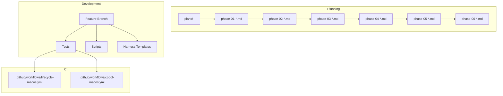
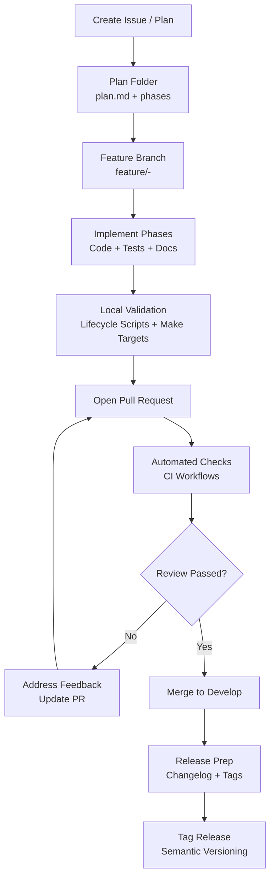
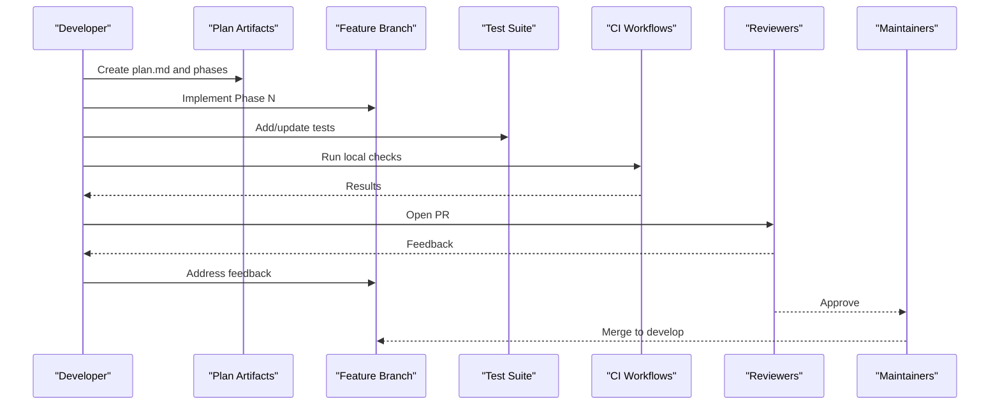
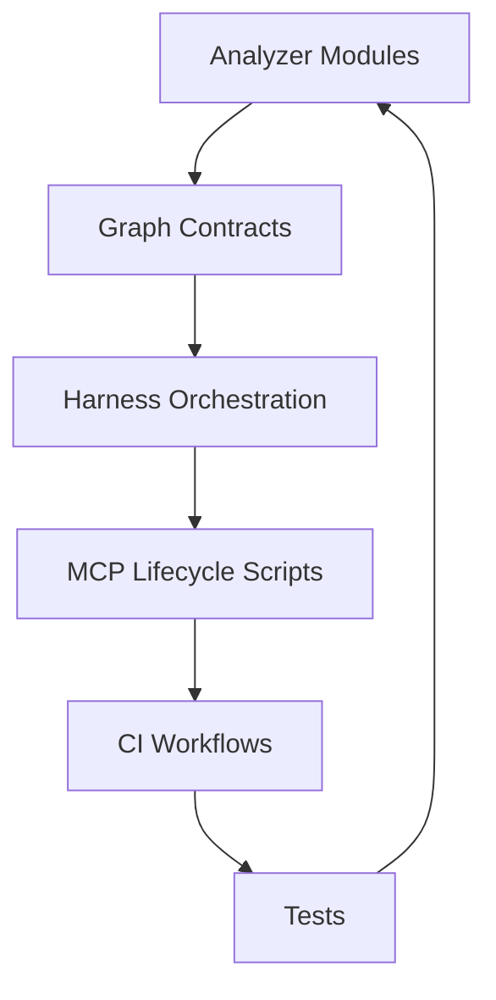

# Contribution Workflow & Process

<cite>
**Referenced Files in This Document**
- [ReadMe.md](file://ReadMe.md)
- [Makefile](file://Makefile)
- [.github/workflows/cobol-macos.yml](file://.github/workflows/cobol-macos.yml)
- [.github/workflows/lifecycle-macos.yml](file://.github/workflows/lifecycle-macos.yml)
- [plans/260713-1638-framework-parser-integration/plan.md](file://plans/260713-1638-framework-parser-integration/plan.md)
- [plans/260714-1603-flutter-analyzer-parser/plan.md](file://plans/260714-1603-flutter-analyzer-parser/plan.md)
- [plans/260714-1702-cobol-analyzer-parser/plan.md](file://plans/260714-1702-cobol-analyzer-parser/plan.md)
- [plans/260715-1629-perl-analyzer-parser/plan.md](file://plans/260715-1629-perl-analyzer-parser/plan.md)
- [plans/260715-2011-aspnet-roslyn-analyzers/plan.md](file://plans/260715-2011-aspnet-roslyn-analyzers/plan.md)
- [plans/260715-2200-mcp-capability-routing/plan.md](file://plans/260715-2200-mcp-capability-routing/plan.md)
- [plans/260716-1615-primary-vector-ingestion-completion/plan.md](file://plans/260716-1615-primary-vector-ingestion-completion/plan.md)
- [plans/260718-2159-incremental-scan-reliability/plan.md](file://plans/260718-2159-incremental-scan-reliability/plan.md)
- [plans/260719-0100-mcp-query-capability-hardening/plan.md](file://plans/260719-0100-mcp-query-capability-hardening/plan.md)
- [harness/templates/feature_template.json](file://harness/templates/feature_template.json)
- [harness/templates/progress.md](file://harness/templates/progress.md)
- [harness/templates/session-template.json](file://harness/templates/session-template.json)
- [scripts/mcp-lifecycle.py](file://scripts/mcp-lifecycle.py)
- [scripts/mcp-lifecycle.ps1](file://scripts/mcp-lifecycle.ps1)
- [tests/test_make_lifecycle.py](file://tests/test_make_lifecycle.py)
- [tests/test_dev_lifecycle_commands.py](file://tests/test_dev_lifecycle_commands.py)
- [docs/HARNESS_WORKFLOW.md](file://docs/HARNESS_WORKFLOW.md)
- [INSTALLER_GUIDE.md](file://INSTALLER_GUIDE.md)
</cite>

## Table of Contents
1. [Introduction](#introduction)
2. [Project Structure](#project-structure)
3. [Core Components](#core-components)
4. [Architecture Overview](#architecture-overview)
5. [Detailed Component Analysis](#detailed-component-analysis)
6. [Dependency Analysis](#dependency-analysis)
7. [Performance Considerations](#performance-considerations)
8. [Troubleshooting Guide](#troubleshooting-guide)
9. [Conclusion](#conclusion)
10. [Appendices](#appendices)

## Introduction
This document defines the contribution workflow for Cortex Harness development. It explains how to plan, develop, review, and release features using a GitFlow-inspired process aligned with the project’s phase-based planning approach. It also covers code review guidelines, documentation updates, changelog maintenance, versioning, release procedures, backward compatibility, deprecation policies, community communication channels, issue reporting standards, and support processes.

## Project Structure
The repository is organized into feature-oriented directories (analyzers, tools, scripts), CI workflows, plans, tests, and harness templates that drive the lifecycle and orchestration. Key areas relevant to contributions:
- Plans directory: Phase-based feature plans that define scope, deliverables, and acceptance criteria.
- Harness templates: Feature scaffolding and progress tracking artifacts used during development.
- Scripts: Lifecycle automation helpers for MCP-related tasks.
- Tests: Validation suites ensuring correctness across analyzers, pipelines, and lifecycle commands.
- CI workflows: Platform-specific checks and lifecycle targets.

**Diagram sources**
- [plans/260713-1638-framework-parser-integration/plan.md](file://plans/260713-1638-framework-parser-integration/plan.md)
- [plans/260714-1603-flutter-analyzer-parser/plan.md](file://plans/260714-1603-flutter-analyzer-parser/plan.md)
- [plans/260714-1702-cobol-analyzer-parser/plan.md](file://plans/260714-1702-cobol-analyzer-parser/plan.md)
- [plans/260715-1629-perl-analyzer-parser/plan.md](file://plans/260715-1629-perl-analyzer-parser/plan.md)
- [plans/260715-2011-aspnet-roslyn-analyzers/plan.md](file://plans/260715-2011-aspnet-roslyn-analyzers/plan.md)
- [plans/260715-2200-mcp-capability-routing/plan.md](file://plans/260715-2200-mcp-capability-routing/plan.md)
- [plans/260716-1615-primary-vector-ingestion-completion/plan.md](file://plans/260716-1615-primary-vector-ingestion-completion/plan.md)
- [plans/260718-2159-incremental-scan-reliability/plan.md](file://plans/260718-2159-incremental-scan-reliability/plan.md)
- [plans/260719-0100-mcp-query-capability-hardening/plan.md](file://plans/260719-0100-mcp-query-capability-hardening/plan.md)
- [.github/workflows/lifecycle-macos.yml](file://.github/workflows/lifecycle-macos.yml)
- [.github/workflows/cobol-macos.yml](file://.github/workflows/cobol-macos.yml)

**Section sources**
- [ReadMe.md](file://ReadMe.md)
- [Makefile](file://Makefile)
- [.github/workflows/lifecycle-macos.yml](file://.github/workflows/lifecycle-macos.yml)
- [.github/workflows/cobol-macos.yml](file://.github/workflows/cobol-macos.yml)

## Core Components
- Planning artifacts: Each feature has a dedicated folder under plans with a plan.md and phase documents describing scope, milestones, and acceptance criteria.
- Harness templates: Standardized JSON and Markdown templates for feature definition, session handoff, and progress tracking.
- Lifecycle scripts: Python and PowerShell helpers to automate MCP-related lifecycle tasks.
- Test suites: Comprehensive tests validating analyzer behavior, graph contracts, incremental sync, and lifecycle commands.
- CI workflows: macOS-focused workflows for lifecycle and platform-specific checks.

**Section sources**
- [harness/templates/feature_template.json](file://harness/templates/feature_template.json)
- [harness/templates/progress.md](file://harness/templates/progress.md)
- [harness/templates/session-template.json](file://harness/templates/session-template.json)
- [scripts/mcp-lifecycle.py](file://scripts/mcp-lifecycle.py)
- [scripts/mcp-lifecycle.ps1](file://scripts/mcp-lifecycle.ps1)
- [tests/test_make_lifecycle.py](file://tests/test_make_lifecycle.py)
- [tests/test_dev_lifecycle_commands.py](file://tests/test_dev_lifecycle_commands.py)

## Architecture Overview
The contribution architecture follows a GitFlow-inspired model with strong alignment to phase-based planning and automated validation.

[No sources needed since this diagram shows conceptual workflow, not actual code structure]

## Detailed Component Analysis

### Branching Strategy (GitFlow-Inspired)
- Main branch: Stable releases; only merge tagged releases here.
- Develop branch: Integration branch for completed features and fixes.
- Feature branches: Named feature/<id>-<title>, derived from develop; each corresponds to a plan folder.
- Hotfix branches: hotfix/<title> for urgent production fixes; merge back to main and develop.
- Release branches: release/<version> for final stabilization before tagging.

Guidelines:
- Keep feature branches small and focused on one plan.
- Rebase onto develop frequently to minimize merge conflicts.
- Use descriptive branch names tied to plan IDs for traceability.

**Section sources**
- [plans/260713-1638-framework-parser-integration/plan.md](file://plans/260713-1638-framework-parser-integration/plan.md)
- [plans/260714-1603-flutter-analyzer-parser/plan.md](file://plans/260714-1603-flutter-analyzer-parser/plan.md)
- [plans/260714-1702-cobol-analyzer-parser/plan.md](file://plans/260714-1702-cobol-analyzer-parser/plan.md)
- [plans/260715-1629-perl-analyzer-parser/plan.md](file://plans/260715-1629-perl-analyzer-parser/plan.md)
- [plans/260715-2011-aspnet-roslyn-analyzers/plan.md](file://plans/260715-2011-aspnet-roslyn-analyzers/plan.md)
- [plans/260715-2200-mcp-capability-routing/plan.md](file://plans/260715-2200-mcp-capability-routing/plan.md)
- [plans/260716-1615-primary-vector-ingestion-completion/plan.md](file://plans/260716-1615-primary-vector-ingestion-completion/plan.md)
- [plans/260718-2159-incremental-scan-reliability/plan.md](file://plans/260718-2159-incremental-scan-reliability/plan.md)
- [plans/260719-0100-mcp-query-capability-hardening/plan.md](file://plans/260719-0100-mcp-query-capability-hardening/plan.md)

### Commit Message Conventions
- Format: type(scope): subject
  - Types: feat, fix, docs, refactor, test, chore, build, ci, perf, revert
  - Scope: module or component (e.g., cobol-analyzer, mcp-lifecycle, incremental-sync)
- Subject line: imperative mood, concise summary
- Body: explain why and what changed; link to plan ID and issue number
- Footer: breaking changes, related issues, migration notes

Examples:
- feat(cobol-analyzer): add control flow semantics parsing
- fix(incremental-sync): resolve cross-platform lock contention
- docs(harness): update feature template usage

**Section sources**
- [tests/test_make_lifecycle.py](file://tests/test_make_lifecycle.py)
- [tests/test_dev_lifecycle_commands.py](file://tests/test_dev_lifecycle_commands.py)

### Pull Request Process
- Create PR from feature/<id>-<title> to develop.
- Include:
  - Summary of changes and rationale
  - Links to plan.md and relevant phase documents
  - Test coverage details and results
  - Documentation updates and migration steps if applicable
- Ensure all CI checks pass (see CI section).
- Request reviews from maintainers familiar with the affected modules.
- Address feedback iteratively; keep PRs focused and small.

**Section sources**
- [.github/workflows/lifecycle-macos.yml](file://.github/workflows/lifecycle-macos.yml)
- [.github/workflows/cobol-macos.yml](file://.github/workflows/cobol-macos.yml)

### Code Review Guidelines
Review checklist:
- Correctness: Logic aligns with plan and contract specifications.
- Tests: Adequate coverage including edge cases and failure paths.
- Performance: No regressions; consider incremental processing efficiency.
- Security: Input validation, safe defaults, no secrets in logs.
- Compatibility: Backward compatibility maintained unless explicitly breaking.
- Documentation: Updated user-facing docs and internal comments.
- Changelog: Entry added for notable changes.
- CI: All checks green locally and remotely.

Approval requirements:
- At least two approvals from maintainers.
- No outstanding blocking comments.
- All required checks passed.

Feedback incorporation:
- Respond to each comment with commit references or explanations.
- Squash minor fixes into relevant commits; avoid noise.
- Update PR description when significant changes occur.

**Section sources**
- [tests/test_make_lifecycle.py](file://tests/test_make_lifecycle.py)
- [tests/test_dev_lifecycle_commands.py](file://tests/test_dev_lifecycle_commands.py)

### Feature Development Lifecycle (Phase-Based)
Each feature is planned and executed in phases:
- Phase 01: Contract and skeleton (interfaces, models, minimal implementation)
- Phase 02: Core logic (parsing, resolution, normalization)
- Phase 03: Semantics and overlays (framework-specific behaviors)
- Phase 04: Harness integration (orchestration, MCP routing)
- Phase 05: Hardening and acceptance (edge cases, performance, security)
- Phase 06: Validation and rollout (documentation, migration, deployment)

Process:
- Start with plan.md outlining goals, scope, and acceptance criteria.
- Implement per phase; validate with tests and scripts.
- Maintain progress.md and harness templates for visibility.
- Merge to develop upon completion of all phases.

**Diagram sources**
- [plans/260713-1638-framework-parser-integration/plan.md](file://plans/260713-1638-framework-parser-integration/plan.md)
- [plans/260714-1603-flutter-analyzer-parser/plan.md](file://plans/260714-1603-flutter-analyzer-parser/plan.md)
- [plans/260714-1702-cobol-analyzer-parser/plan.md](file://plans/260714-1702-cobol-analyzer-parser/plan.md)
- [plans/260715-1629-perl-analyzer-parser/plan.md](file://plans/260715-1629-perl-analyzer-parser/plan.md)
- [plans/260715-2011-aspnet-roslyn-analyzers/plan.md](file://plans/260715-2011-aspnet-roslyn-analyzers/plan.md)
- [plans/260715-2200-mcp-capability-routing/plan.md](file://plans/260715-2200-mcp-capability-routing/plan.md)
- [plans/260716-1615-primary-vector-ingestion-completion/plan.md](file://plans/260716-1615-primary-vector-ingestion-completion/plan.md)
- [plans/260718-2159-incremental-scan-reliability/plan.md](file://plans/260718-2159-incremental-scan-reliability/plan.md)
- [plans/260719-0100-mcp-query-capability-hardening/plan.md](file://plans/260719-0100-mcp-query-capability-hardening/plan.md)
- [harness/templates/feature_template.json](file://harness/templates/feature_template.json)
- [harness/templates/progress.md](file://harness/templates/progress.md)
- [scripts/mcp-lifecycle.py](file://scripts/mcp-lifecycle.py)
- [scripts/mcp-lifecycle.ps1](file://scripts/mcp-lifecycle.ps1)
- [.github/workflows/lifecycle-macos.yml](file://.github/workflows/lifecycle-macos.yml)
- [.github/workflows/cobol-macos.yml](file://.github/workflows/cobol-macos.yml)

**Section sources**
- [plans/260713-1638-framework-parser-integration/plan.md](file://plans/260713-1638-framework-parser-integration/plan.md)
- [plans/260714-1603-flutter-analyzer-parser/plan.md](file://plans/260714-1603-flutter-analyzer-parser/plan.md)
- [plans/260714-1702-cobol-analyzer-parser/plan.md](file://plans/260714-1702-cobol-analyzer-parser/plan.md)
- [plans/260715-1629-perl-analyzer-parser/plan.md](file://plans/260715-1629-perl-analyzer-parser/plan.md)
- [plans/260715-2011-aspnet-roslyn-analyzers/plan.md](file://plans/260715-2011-aspnet-roslyn-analyzers/plan.md)
- [plans/260715-2200-mcp-capability-routing/plan.md](file://plans/260715-2200-mcp-capability-routing/plan.md)
- [plans/260716-1615-primary-vector-ingestion-completion/plan.md](file://plans/260716-1615-primary-vector-ingestion-completion/plan.md)
- [plans/260718-2159-incremental-scan-reliability/plan.md](file://plans/260718-2159-incremental-scan-reliability/plan.md)
- [plans/260719-0100-mcp-query-capability-hardening/plan.md](file://plans/260719-0100-mcp-query-capability-hardening/plan.md)
- [harness/templates/feature_template.json](file://harness/templates/feature_template.json)
- [harness/templates/progress.md](file://harness/templates/progress.md)
- [scripts/mcp-lifecycle.py](file://scripts/mcp-lifecycle.py)
- [scripts/mcp-lifecycle.ps1](file://scripts/mcp-lifecycle.ps1)

### Documentation Updates
- Update user-facing docs when changing CLI behavior, APIs, or configuration.
- Keep internal READMEs and specs current with implementation changes.
- Use harness templates to standardize feature descriptions and progress tracking.
- Link plan IDs in documentation for traceability.

**Section sources**
- [docs/HARNESS_WORKFLOW.md](file://docs/HARNESS_WORKFLOW.md)
- [harness/templates/feature_template.json](file://harness/templates/feature_template.json)
- [harness/templates/progress.md](file://harness/templates/progress.md)

### Changelog Maintenance
- Add entries for new features, fixes, breaking changes, and migrations.
- Group by category and include plan IDs where relevant.
- Maintain clarity for users upgrading between versions.

**Section sources**
- [plans/260713-1638-framework-parser-integration/plan.md](file://plans/260713-1638-framework-parser-integration/plan.md)
- [plans/260714-1603-flutter-analyzer-parser/plan.md](file://plans/260714-1603-flutter-analyzer-parser/plan.md)
- [plans/260714-1702-cobol-analyzer-parser/plan.md](file://plans/260714-1702-cobol-analyzer-parser/plan.md)
- [plans/260715-1629-perl-analyzer-parser/plan.md](file://plans/260715-1629-perl-analyzer-parser/plan.md)
- [plans/260715-2011-aspnet-roslyn-analyzers/plan.md](file://plans/260715-2011-aspnet-roslyn-analyzers/plan.md)
- [plans/260715-2200-mcp-capability-routing/plan.md](file://plans/260715-2200-mcp-capability-routing/plan.md)
- [plans/260716-1615-primary-vector-ingestion-completion/plan.md](file://plans/260716-1615-primary-vector-ingestion-completion/plan.md)
- [plans/260718-2159-incremental-scan-reliability/plan.md](file://plans/260718-2159-incremental-scan-reliability/plan.md)
- [plans/260719-0100-mcp-query-capability-hardening/plan.md](file://plans/260719-0100-mcp-query-capability-hardening/plan.md)

### Version Tagging
- Use semantic versioning (MAJOR.MINOR.PATCH).
- MAJOR: Breaking changes requiring migration.
- MINOR: New features without breaking changes.
- PATCH: Bug fixes and non-breaking improvements.
- Tag releases after successful CI and review.

**Section sources**
- [INSTALLER_GUIDE.md](file://INSTALLER_GUIDE.md)

### Release Procedures
- Prepare release branch from develop.
- Finalize changelog and documentation.
- Run full test suite and lifecycle checks.
- Tag release and publish artifacts.
- Merge release branch to main and develop.

**Section sources**
- [.github/workflows/lifecycle-macos.yml](file://.github/workflows/lifecycle-macos.yml)
- [.github/workflows/cobol-macos.yml](file://.github/workflows/cobol-macos.yml)
- [INSTALLER_GUIDE.md](file://INSTALLER_GUIDE.md)

### Backward Compatibility Requirements
- Preserve existing APIs and configurations unless documented as breaking.
- Provide migration guides for incompatible changes.
- Validate compatibility across supported platforms and frameworks.

**Section sources**
- [plans/260713-1638-framework-parser-integration/plan.md](file://plans/260713-1638-framework-parser-integration/plan.md)
- [plans/260714-1603-flutter-analyzer-parser/plan.md](file://plans/260714-1603-flutter-analyzer-parser/plan.md)
- [plans/260714-1702-cobol-analyzer-parser/plan.md](file://plans/260714-1702-cobol-analyzer-parser/plan.md)
- [plans/260715-1629-perl-analyzer-parser/plan.md](file://plans/260715-1629-perl-analyzer-parser/plan.md)
- [plans/260715-2011-aspnet-roslyn-analyzers/plan.md](file://plans/260715-2011-aspnet-roslyn-analyzers/plan.md)
- [plans/260715-2200-mcp-capability-routing/plan.md](file://plans/260715-2200-mcp-capability-routing/plan.md)
- [plans/260716-1615-primary-vector-ingestion-completion/plan.md](file://plans/260716-1615-primary-vector-ingestion-completion/plan.md)
- [plans/260718-2159-incremental-scan-reliability/plan.md](file://plans/260718-2159-incremental-scan-reliability/plan.md)
- [plans/260719-0100-mcp-query-capability-hardening/plan.md](file://plans/260719-0100-mcp-query-capability-hardening/plan.md)

### Deprecation Policies
- Announce deprecations in advance with timelines.
- Provide migration paths and examples.
- Remove deprecated features in major releases.

**Section sources**
- [INSTALLER_GUIDE.md](file://INSTALLER_GUIDE.md)

### Community Communication Channels
- Use GitHub Issues for bug reports and feature requests.
- Reference plan IDs and related issues in discussions.
- Engage in pull request reviews and comments.

**Section sources**
- [ReadMe.md](file://ReadMe.md)

### Issue Reporting Standards
- Title: Clear and concise summary.
- Description: Steps to reproduce, expected vs actual behavior.
- Environment: OS, Python version, dependencies.
- Attachments: Logs, screenshots, minimal reproducible example.
- Labels: Categorize by area (analyzer, lifecycle, docs).

**Section sources**
- [tests/test_make_lifecycle.py](file://tests/test_make_lifecycle.py)
- [tests/test_dev_lifecycle_commands.py](file://tests/test_dev_lifecycle_commands.py)

### Support Processes
- Check existing issues and documentation before opening new ones.
- Provide detailed reproduction steps and environment info.
- Follow up on assigned issues promptly.

**Section sources**
- [docs/HARNESS_WORKFLOW.md](file://docs/HARNESS_WORKFLOW.md)

### Examples of Successful Contributions
- Cobol analyzer parser integration: Implemented phase-by-phase with comprehensive tests and validation reports.
- Flutter analyzer parser: Delivered Dart parsing, resolver, and framework semantics with harness integration.
- Incremental scan reliability: Resolved cross-platform locking and improved change detection robustness.

**Section sources**
- [plans/260714-1702-cobol-analyzer-parser/plan.md](file://plans/260714-1702-cobol-analyzer-parser/plan.md)
- [plans/260714-1603-flutter-analyzer-parser/plan.md](file://plans/260714-1603-flutter-analyzer-parser/plan.md)
- [plans/260718-2159-incremental-scan-reliability/plan.md](file://plans/260718-2159-incremental-scan-reliability/plan.md)

### Common Pitfalls to Avoid
- Skipping phase validation: Always run tests and lifecycle checks before PR submission.
- Incomplete documentation: Update user-facing docs and internal specs alongside code changes.
- Ignoring backward compatibility: Provide migration guides for breaking changes.
- Large monolithic PRs: Split into smaller, focused PRs aligned with phases.

**Section sources**
- [tests/test_make_lifecycle.py](file://tests/test_make_lifecycle.py)
- [tests/test_dev_lifecycle_commands.py](file://tests/test_dev_lifecycle_commands.py)
- [harness/templates/feature_template.json](file://harness/templates/feature_template.json)

## Dependency Analysis
Contributions often touch multiple components: analyzers, harness orchestration, lifecycle scripts, and CI workflows. Understanding these relationships helps ensure cohesive changes.

[No sources needed since this diagram shows conceptual workflow, not actual code structure]

## Performance Considerations
- Prefer incremental processing to reduce overhead on large repositories.
- Cache intermediate results where appropriate.
- Profile critical paths and optimize bottlenecks identified in tests.
- Validate performance regressions in CI.

[No sources needed since this section provides general guidance]

## Troubleshooting Guide
Common issues and resolutions:
- Lifecycle script failures: Verify environment setup and dependencies; consult lifecycle tests for expected behavior.
- Analyzer import errors: Ensure correct module paths and runtime contracts are met.
- CI check failures: Reproduce locally using Make targets and scripts; address failing tests first.

**Section sources**
- [scripts/mcp-lifecycle.py](file://scripts/mcp-lifecycle.py)
- [scripts/mcp-lifecycle.ps1](file://scripts/mcp-lifecycle.ps1)
- [tests/test_make_lifecycle.py](file://tests/test_make_lifecycle.py)
- [tests/test_dev_lifecycle_commands.py](file://tests/test_dev_lifecycle_commands.py)

## Conclusion
Adhering to the GitFlow-inspired branching strategy, commit conventions, and phase-based planning ensures consistent, high-quality contributions. Robust testing, thorough documentation, and clear communication facilitate smooth reviews and reliable releases. By following these guidelines, contributors can effectively collaborate on Cortex Harness development and maintain its stability and extensibility.

[No sources needed since this section summarizes without analyzing specific files]

## Appendices
- Make targets and lifecycle commands: Refer to Makefile and lifecycle tests for available commands.
- Installer guide: Consult INSTALLER_GUIDE.md for packaging and distribution procedures.

**Section sources**
- [Makefile](file://Makefile)
- [INSTALLER_GUIDE.md](file://INSTALLER_GUIDE.md)