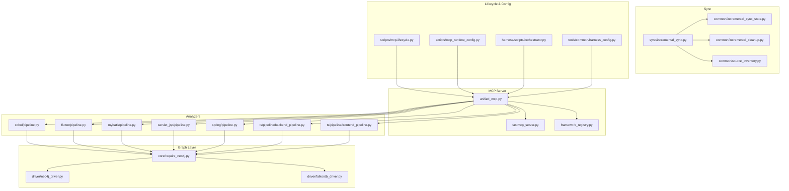
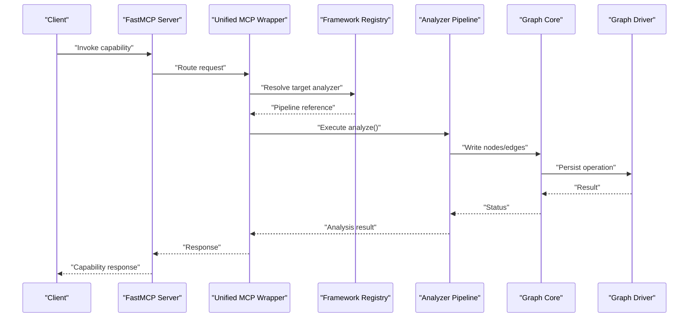
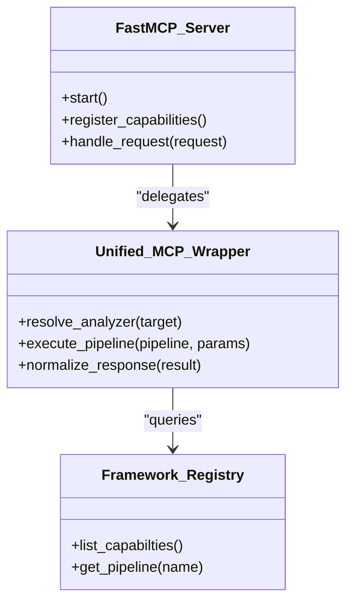
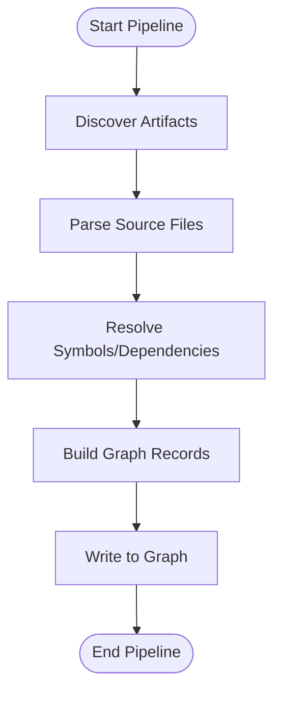
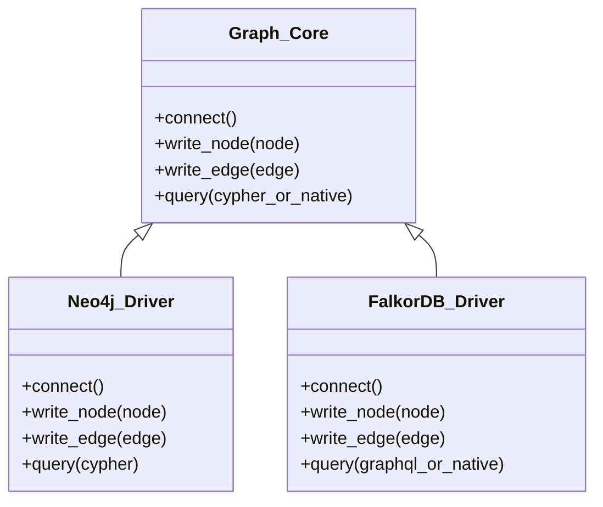
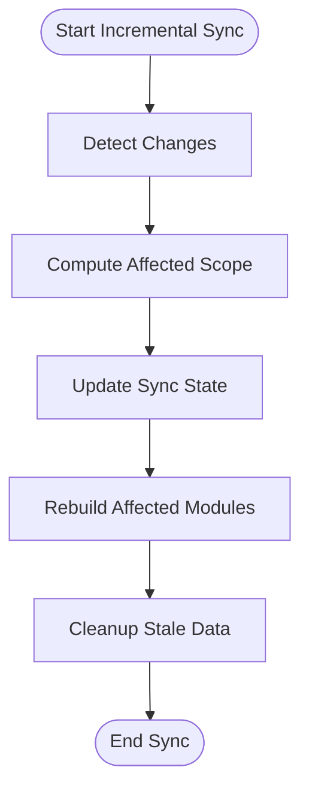
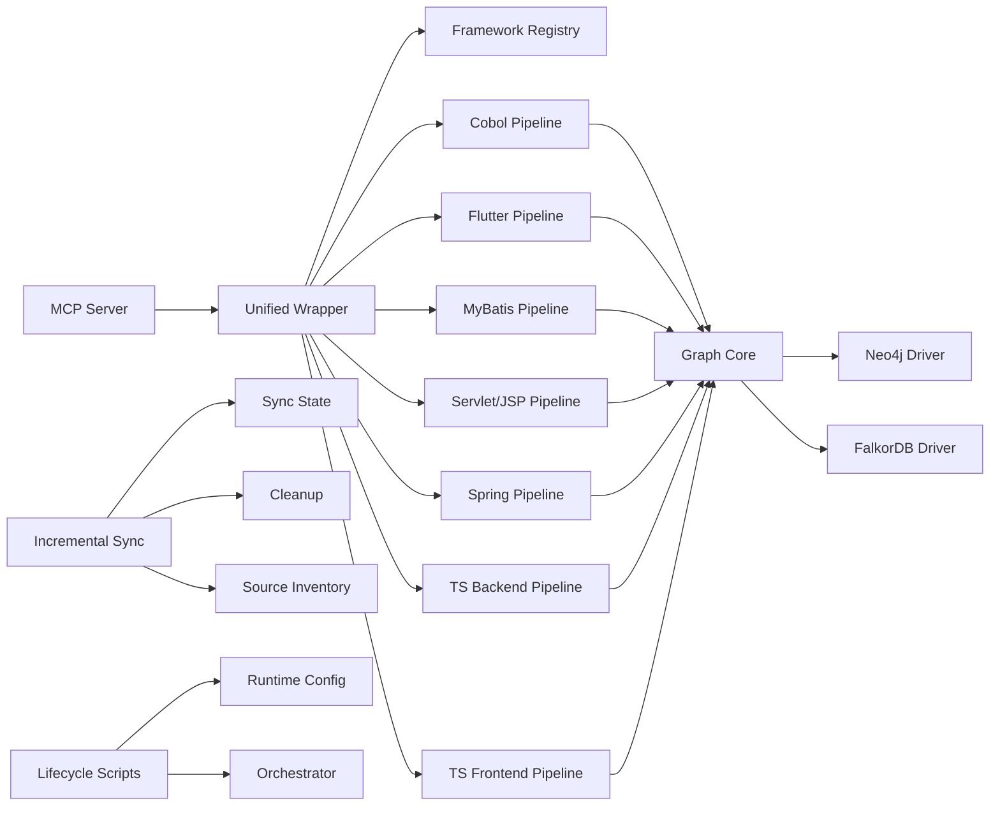

# Debugging & Performance Profiling

<cite>
**Referenced Files in This Document**
- [ReadMe.md](file://ReadMe.md)
- [Makefile](file://Makefile)
- [dev.sh](file://dev.sh)
- [dev.bat](file://dev.bat)
- [dev.ps1](file://dev.ps1)
- [cortex_harness/dev.py](file://cortex_harness/dev.py)
- [code-tiny/mcp/fastmcp_server.py](file://code-tiny/mcp/fastmcp_server.py)
- [code-tiny/mcp/unified_mcp.py](file://code-tiny/mcp/unified_mcp.py)
- [code-tiny/mcp/framework_registry.py](file://code-tiny/mcp/framework_registry.py)
- [code-tiny/tools/common/harness_config.py](file://code-tiny/tools/common/harness_config.py)
- [code-tiny/tools/graph/core/require_neo4j.py](file://code-tiny/tools/graph/core/require_neo4j.py)
- [code-tiny/tools/graph/driver/neo4j_driver.py](file://code-tiny/tools/graph/driver/neo4j_driver.py)
- [code-tiny/tools/graph/driver/falkordb_driver.py](file://code-tiny/tools/graph/driver/falkordb_driver.py)
- [code-tiny/tools/sync/incremental_sync.py](file://code-tiny/tools/sync/incremental_sync.py)
- [code-tiny/tools/common/incremental_sync_state.py](file://code-tiny/tools/common/incremental_sync_state.py)
- [code-tiny/tools/common/incremental_cleanup.py](file://code-tiny/tools/common/incremental_cleanup.py)
- [code-tiny/tools/common/source_inventory.py](file://code-tiny/tools/common/source_inventory.py)
- [code-tiny/tools/common/analyzer_cache.py](file://code-tiny/tools/common/analyzer_cache.py)
- [code-tiny/tools/cobol/pipeline.py](file://code-tiny/tools/cobol/pipeline.py)
- [code-tiny/tools/flutter/pipeline.py](file://code-tiny/tools/flutter/pipeline.py)
- [code-tiny/tools/mybatis/pipeline.py](file://code-tiny/tools/mybatis/pipeline.py)
- [code-tiny/tools/servlet_jsp/pipeline.py](file://code-tiny/tools/servlet_jsp/pipeline.py)
- [code-tiny/tools/spring/pipeline.py](file://code-tiny/tools/spring/pipeline.py)
- [code-tiny/tools/ts/pipeline/backend_pipeline.py](file://code-tiny/tools/ts/pipeline/backend_pipeline.py)
- [code-tiny/tools/ts/pipeline/frontend_pipeline.py](file://code-tiny/tools/ts/pipeline/frontend_pipeline.py)
- [scripts/mcp-lifecycle.py](file://scripts/mcp-lifecycle.py)
- [scripts/mcp_runtime_config.py](file://scripts/mcp_runtime_config.py)
- [harness/scripts/orchestrator.py](file://harness/scripts/orchestrator.py)
- [tests/test_incremental_sync_lock.py](file://tests/test_incremental_sync_lock.py)
- [tests/test_dev_lifecycle_commands.py](file://tests/test_dev_lifecycle_commands.py)
- [tests/test_falkordb_driver.py](file://tests/test_falkordb_driver.py)
- [tests/test_cobol_performance.py](file://tests/test_cobol_performance.py)
- [tests/test_git_change_detection.py](file://tests/test_git_change_detection.py)
</cite>

## Table of Contents
1. Introduction
2. Project Structure
3. Core Components
4. Architecture Overview
5. Detailed Component Analysis
6. Dependency Analysis
7. Performance Considerations
8. Troubleshooting Guide
9. Conclusion

## Introduction
This guide provides a comprehensive approach to debugging and performance profiling for Cortex Harness development. It covers analyzers, the MCP server, graph operations, and incremental sync processes. It also details logging strategies, log levels, analysis tools, profiling methodologies (CPU and memory), distributed component debugging, database connectivity troubleshooting, network diagnostics, monitoring and alerting, and techniques for analyzing large codebases and optimizing analysis performance.

## Project Structure
Cortex Harness is organized around:
- A Python-based MCP server and unified wrapper for framework-specific analyzers
- Graph drivers for Neo4j and FalkorDB with core abstractions
- Incremental sync subsystems for change detection and state management
- Lifecycle scripts and harness orchestration utilities
- Tests that validate behavior and performance across components

**Diagram sources**
- [code-tiny/mcp/unified_mcp.py](file://code-tiny/mcp/unified_mcp.py)
- [code-tiny/mcp/fastmcp_server.py](file://code-tiny/mcp/fastmcp_server.py)
- [code-tiny/mcp/framework_registry.py](file://code-tiny/mcp/framework_registry.py)
- [code-tiny/tools/cobol/pipeline.py](file://code-tiny/tools/cobol/pipeline.py)
- [code-tiny/tools/flutter/pipeline.py](file://code-tiny/tools/flutter/pipeline.py)
- [code-tiny/tools/mybatis/pipeline.py](file://code-tiny/tools/mybatis/pipeline.py)
- [code-tiny/tools/servlet_jsp/pipeline.py](file://code-tiny/tools/servlet_jsp/pipeline.py)
- [code-tiny/tools/spring/pipeline.py](file://code-tiny/tools/spring/pipeline.py)
- [code-tiny/tools/ts/pipeline/backend_pipeline.py](file://code-tiny/tools/ts/pipeline/backend_pipeline.py)
- [code-tiny/tools/ts/pipeline/frontend_pipeline.py](file://code-tiny/tools/ts/pipeline/frontend_pipeline.py)
- [code-tiny/tools/graph/core/require_neo4j.py](file://code-tiny/tools/graph/core/require_neo4j.py)
- [code-tiny/tools/graph/driver/neo4j_driver.py](file://code-tiny/tools/graph/driver/neo4j_driver.py)
- [code-tiny/tools/graph/driver/falkordb_driver.py](file://code-tiny/tools/graph/driver/falkordb_driver.py)
- [code-tiny/tools/sync/incremental_sync.py](file://code-tiny/tools/sync/incremental_sync.py)
- [code-tiny/tools/common/incremental_sync_state.py](file://code-tiny/tools/common/incremental_sync_state.py)
- [code-tiny/tools/common/incremental_cleanup.py](file://code-tiny/tools/common/incremental_cleanup.py)
- [code-tiny/tools/common/source_inventory.py](file://code-tiny/tools/common/source_inventory.py)
- [scripts/mcp-lifecycle.py](file://scripts/mcp-lifecycle.py)
- [scripts/mcp_runtime_config.py](file://scripts/mcp_runtime_config.py)
- [harness/scripts/orchestrator.py](file://harness/scripts/orchestrator.py)
- [code-tiny/tools/common/harness_config.py](file://code-tiny/tools/common/harness_config.py)

**Section sources**
- [ReadMe.md](file://ReadMe.md)
- [Makefile](file://Makefile)
- [dev.sh](file://dev.sh)
- [dev.bat](file://dev.bat)
- [dev.ps1](file://dev.ps1)
- [cortex_harness/dev.py](file://cortex_harness/dev.py)

## Core Components
- MCP Server and Unified Wrapper: The MCP server exposes capabilities and routes requests to framework-specific analyzers via a registry. The unified wrapper standardizes input/output contracts and error handling.
- Analyzer Pipelines: Each language or framework has a pipeline orchestrating parsing, resolution, semantic analysis, and graph writes.
- Graph Abstraction and Drivers: A core abstraction layer requires a graph backend and supports multiple drivers (Neo4j, FalkorDB).
- Incremental Sync: Manages change detection, state persistence, cleanup, and source inventory to minimize rework on subsequent runs.
- Lifecycle and Orchestration: Scripts manage MCP lifecycle, runtime configuration, and harness orchestration.

Key responsibilities:
- Request routing and capability discovery
- Pipeline orchestration per analyzer
- Graph write/read operations through drivers
- Stateful incremental updates and cleanup
- Environment and configuration loading

**Section sources**
- [code-tiny/mcp/unified_mcp.py](file://code-tiny/mcp/unified_mcp.py)
- [code-tiny/mcp/fastmcp_server.py](file://code-tiny/mcp/fastmcp_server.py)
- [code-tiny/mcp/framework_registry.py](file://code-tiny/mcp/framework_registry.py)
- [code-tiny/tools/cobol/pipeline.py](file://code-tiny/tools/cobol/pipeline.py)
- [code-tiny/tools/flutter/pipeline.py](file://code-tiny/tools/flutter/pipeline.py)
- [code-tiny/tools/mybatis/pipeline.py](file://code-tiny/tools/mybatis/pipeline.py)
- [code-tiny/tools/servlet_jsp/pipeline.py](file://code-tiny/tools/servlet_jsp/pipeline.py)
- [code-tiny/tools/spring/pipeline.py](file://code-tiny/tools/spring/pipeline.py)
- [code-tiny/tools/ts/pipeline/backend_pipeline.py](file://code-tiny/tools/ts/pipeline/backend_pipeline.py)
- [code-tiny/tools/ts/pipeline/frontend_pipeline.py](file://code-tiny/tools/ts/pipeline/frontend_pipeline.py)
- [code-tiny/tools/graph/core/require_neo4j.py](file://code-tiny/tools/graph/core/require_neo4j.py)
- [code-tiny/tools/graph/driver/neo4j_driver.py](file://code-tiny/tools/graph/driver/neo4j_driver.py)
- [code-tiny/tools/graph/driver/falkordb_driver.py](file://code-tiny/tools/graph/driver/falkordb_driver.py)
- [code-tiny/tools/sync/incremental_sync.py](file://code-tiny/tools/sync/incremental_sync.py)
- [code-tiny/tools/common/incremental_sync_state.py](file://code-tiny/tools/common/incremental_sync_state.py)
- [code-tiny/tools/common/incremental_cleanup.py](file://code-tiny/tools/common/incremental_cleanup.py)
- [code-tiny/tools/common/source_inventory.py](file://code-tiny/tools/common/source_inventory.py)
- [scripts/mcp-lifecycle.py](file://scripts/mcp-lifecycle.py)
- [scripts/mcp_runtime_config.py](file://scripts/mcp_runtime_config.py)
- [harness/scripts/orchestrator.py](file://harness/scripts/orchestrator.py)
- [code-tiny/tools/common/harness_config.py](file://code-tiny/tools/common/harness_config.py)

## Architecture Overview
The system follows a layered architecture:
- Client-facing MCP endpoints route to a unified wrapper
- The wrapper dispatches to analyzer pipelines based on framework/language
- Pipelines perform parsing and analysis, then use graph drivers to persist results
- Incremental sync coordinates change detection and state updates
- Lifecycle scripts control server startup, configuration, and orchestration

**Diagram sources**
- [code-tiny/mcp/fastmcp_server.py](file://code-tiny/mcp/fastmcp_server.py)
- [code-tiny/mcp/unified_mcp.py](file://code-tiny/mcp/unified_mcp.py)
- [code-tiny/mcp/framework_registry.py](file://code-tiny/mcp/framework_registry.py)
- [code-tiny/tools/cobol/pipeline.py](file://code-tiny/tools/cobol/pipeline.py)
- [code-tiny/tools/graph/core/require_neo4j.py](file://code-tiny/tools/graph/core/require_neo4j.py)
- [code-tiny/tools/graph/driver/neo4j_driver.py](file://code-tiny/tools/graph/driver/neo4j_driver.py)
- [code-tiny/tools/graph/driver/falkordb_driver.py](file://code-tiny/tools/graph/driver/falkordb_driver.py)

## Detailed Component Analysis

### MCP Server and Unified Wrapper
- Responsibilities:
  - Expose MCP endpoints and handle request/response serialization
  - Route calls to appropriate analyzer pipelines using a registry
  - Normalize inputs and outputs across frameworks
- Debugging tips:
  - Enable verbose logs at the server entry point to capture incoming requests and routing decisions
  - Validate capability registration by listing available services and checking registry mappings
  - Inspect error propagation from pipelines back to clients
- Performance profiling:
  - Profile request handlers to identify slow routing or serialization steps
  - Use CPU profilers to measure time spent in dispatcher logic versus pipeline execution

**Diagram sources**
- [code-tiny/mcp/fastmcp_server.py](file://code-tiny/mcp/fastmcp_server.py)
- [code-tiny/mcp/unified_mcp.py](file://code-tiny/mcp/unified_mcp.py)
- [code-tiny/mcp/framework_registry.py](file://code-tiny/mcp/framework_registry.py)

**Section sources**
- [code-tiny/mcp/fastmcp_server.py](file://code-tiny/mcp/fastmcp_server.py)
- [code-tiny/mcp/unified_mcp.py](file://code-tiny/mcp/unified_mcp.py)
- [code-tiny/mcp/framework_registry.py](file://code-tiny/mcp/framework_registry.py)

### Analyzer Pipelines
- Responsibilities:
  - Parse source artifacts, resolve symbols, build relationships
  - Write graph records via the graph core abstraction
  - Support incremental processing where applicable
- Debugging tips:
  - Add structured logs at key phases: discovery, parsing, resolution, writing
  - Validate intermediate artifacts (ASTs, symbol tables) when failures occur
  - Isolate regressions by running pipelines against minimal fixtures
- Performance profiling:
  - Profile parser hotspots and I/O-bound operations
  - Measure memory usage during large file scans; consider streaming parsers
  - Benchmark graph write throughput and batch sizes

**Diagram sources**
- [code-tiny/tools/cobol/pipeline.py](file://code-tiny/tools/cobol/pipeline.py)
- [code-tiny/tools/flutter/pipeline.py](file://code-tiny/tools/flutter/pipeline.py)
- [code-tiny/tools/mybatis/pipeline.py](file://code-tiny/tools/mybatis/pipeline.py)
- [code-tiny/tools/servlet_jsp/pipeline.py](file://code-tiny/tools/servlet_jsp/pipeline.py)
- [code-tiny/tools/spring/pipeline.py](file://code-tiny/tools/spring/pipeline.py)
- [code-tiny/tools/ts/pipeline/backend_pipeline.py](file://code-tiny/tools/ts/pipeline/backend_pipeline.py)
- [code-tiny/tools/ts/pipeline/frontend_pipeline.py](file://code-tiny/tools/ts/pipeline/frontend_pipeline.py)

**Section sources**
- [code-tiny/tools/cobol/pipeline.py](file://code-tiny/tools/cobol/pipeline.py)
- [code-tiny/tools/flutter/pipeline.py](file://code-tiny/tools/flutter/pipeline.py)
- [code-tiny/tools/mybatis/pipeline.py](file://code-tiny/tools/mybatis/pipeline.py)
- [code-tiny/tools/servlet_jsp/pipeline.py](file://code-tiny/tools/servlet_jsp/pipeline.py)
- [code-tiny/tools/spring/pipeline.py](file://code-tiny/tools/spring/pipeline.py)
- [code-tiny/tools/ts/pipeline/backend_pipeline.py](file://code-tiny/tools/ts/pipeline/backend_pipeline.py)
- [code-tiny/tools/ts/pipeline/frontend_pipeline.py](file://code-tiny/tools/ts/pipeline/frontend_pipeline.py)

### Graph Operations and Drivers
- Responsibilities:
  - Provide a consistent interface for graph reads/writes
  - Abstract backend specifics behind driver implementations
- Debugging tips:
  - Verify connectivity and credentials before running analyses
  - Log query payloads and responses for slow or failing operations
  - Compare behavior between drivers to isolate backend-specific issues
- Performance profiling:
  - Profile transaction boundaries and batch write sizes
  - Monitor connection pool utilization and latency
  - Identify expensive queries and optimize indexes or traversal patterns

**Diagram sources**
- [code-tiny/tools/graph/core/require_neo4j.py](file://code-tiny/tools/graph/core/require_neo4j.py)
- [code-tiny/tools/graph/driver/neo4j_driver.py](file://code-tiny/tools/graph/driver/neo4j_driver.py)
- [code-tiny/tools/graph/driver/falkordb_driver.py](file://code-tiny/tools/graph/driver/falkordb_driver.py)

**Section sources**
- [code-tiny/tools/graph/core/require_neo4j.py](file://code-tiny/tools/graph/core/require_neo4j.py)
- [code-tiny/tools/graph/driver/neo4j_driver.py](file://code-tiny/tools/graph/driver/neo4j_driver.py)
- [code-tiny/tools/graph/driver/falkordb_driver.py](file://code-tiny/tools/graph/driver/falkordb_driver.py)

### Incremental Sync Processes
- Responsibilities:
  - Detect changes efficiently (e.g., via Git diffs)
  - Maintain sync state and scope affected modules
  - Clean up stale data and rebuild only what is necessary
- Debugging tips:
  - Inspect change detection accuracy and lock contention
  - Validate state migration and consistency after interruptions
  - Confirm cleanup removes orphaned nodes/edges correctly
- Performance profiling:
  - Profile diff computation and file scanning
  - Measure impact of incremental vs full rebuilds
  - Optimize batch sizes for state updates and cleanup tasks

**Diagram sources**
- [code-tiny/tools/sync/incremental_sync.py](file://code-tiny/tools/sync/incremental_sync.py)
- [code-tiny/tools/common/incremental_sync_state.py](file://code-tiny/tools/common/incremental_sync_state.py)
- [code-tiny/tools/common/incremental_cleanup.py](file://code-tiny/tools/common/incremental_cleanup.py)
- [code-tiny/tools/common/source_inventory.py](file://code-tiny/tools/common/source_inventory.py)

**Section sources**
- [code-tiny/tools/sync/incremental_sync.py](file://code-tiny/tools/sync/incremental_sync.py)
- [code-tiny/tools/common/incremental_sync_state.py](file://code-tiny/tools/common/incremental_sync_state.py)
- [code-tiny/tools/common/incremental_cleanup.py](file://code-tiny/tools/common/incremental_cleanup.py)
- [code-tiny/tools/common/source_inventory.py](file://code-tiny/tools/common/source_inventory.py)

### Lifecycle and Configuration
- Responsibilities:
  - Manage MCP server lifecycle (start, stop, restart)
  - Load runtime configuration and environment variables
  - Orchestrate harness tasks and verify readiness
- Debugging tips:
  - Validate configuration precedence and defaults
  - Check lifecycle script logs for startup errors and port conflicts
  - Ensure environment variables are correctly propagated to child processes
- Performance profiling:
  - Profile initialization sequences to reduce cold start times
  - Cache reusable resources (parsers, indices) across invocations

**Section sources**
- [scripts/mcp-lifecycle.py](file://scripts/mcp-lifecycle.py)
- [scripts/mcp_runtime_config.py](file://scripts/mcp_runtime_config.py)
- [harness/scripts/orchestrator.py](file://harness/scripts/orchestrator.py)
- [code-tiny/tools/common/harness_config.py](file://code-tiny/tools/common/harness_config.py)
- [cortex_harness/dev.py](file://cortex_harness/dev.py)

## Dependency Analysis
Key dependencies include:
- MCP server depends on unified wrapper and registry
- Unified wrapper depends on analyzer pipelines and registry
- Pipelines depend on graph core and drivers
- Incremental sync depends on state, cleanup, and source inventory
- Lifecycle scripts depend on runtime config and orchestrator

**Diagram sources**
- [code-tiny/mcp/unified_mcp.py](file://code-tiny/mcp/unified_mcp.py)
- [code-tiny/mcp/framework_registry.py](file://code-tiny/mcp/framework_registry.py)
- [code-tiny/tools/cobol/pipeline.py](file://code-tiny/tools/cobol/pipeline.py)
- [code-tiny/tools/flutter/pipeline.py](file://code-tiny/tools/flutter/pipeline.py)
- [code-tiny/tools/mybatis/pipeline.py](file://code-tiny/tools/mybatis/pipeline.py)
- [code-tiny/tools/servlet_jsp/pipeline.py](file://code-tiny/tools/servlet_jsp/pipeline.py)
- [code-tiny/tools/spring/pipeline.py](file://code-tiny/tools/spring/pipeline.py)
- [code-tiny/tools/ts/pipeline/backend_pipeline.py](file://code-tiny/tools/ts/pipeline/backend_pipeline.py)
- [code-tiny/tools/ts/pipeline/frontend_pipeline.py](file://code-tiny/tools/ts/pipeline/frontend_pipeline.py)
- [code-tiny/tools/graph/core/require_neo4j.py](file://code-tiny/tools/graph/core/require_neo4j.py)
- [code-tiny/tools/graph/driver/neo4j_driver.py](file://code-tiny/tools/graph/driver/neo4j_driver.py)
- [code-tiny/tools/graph/driver/falkordb_driver.py](file://code-tiny/tools/graph/driver/falkordb_driver.py)
- [code-tiny/tools/sync/incremental_sync.py](file://code-tiny/tools/sync/incremental_sync.py)
- [code-tiny/tools/common/incremental_sync_state.py](file://code-tiny/tools/common/incremental_sync_state.py)
- [code-tiny/tools/common/incremental_cleanup.py](file://code-tiny/tools/common/incremental_cleanup.py)
- [code-tiny/tools/common/source_inventory.py](file://code-tiny/tools/common/source_inventory.py)
- [scripts/mcp-lifecycle.py](file://scripts/mcp-lifecycle.py)
- [scripts/mcp_runtime_config.py](file://scripts/mcp_runtime_config.py)
- [harness/scripts/orchestrator.py](file://harness/scripts/orchestrator.py)

**Section sources**
- [code-tiny/mcp/unified_mcp.py](file://code-tiny/mcp/unified_mcp.py)
- [code-tiny/mcp/framework_registry.py](file://code-tiny/mcp/framework_registry.py)
- [code-tiny/tools/graph/core/require_neo4j.py](file://code-tiny/tools/graph/core/require_neo4j.py)
- [code-tiny/tools/graph/driver/neo4j_driver.py](file://code-tiny/tools/graph/driver/neo4j_driver.py)
- [code-tiny/tools/graph/driver/falkordb_driver.py](file://code-tiny/tools/graph/driver/falkordb_driver.py)
- [code-tiny/tools/sync/incremental_sync.py](file://code-tiny/tools/sync/incremental_sync.py)
- [code-tiny/tools/common/incremental_sync_state.py](file://code-tiny/tools/common/incremental_sync_state.py)
- [code-tiny/tools/common/incremental_cleanup.py](file://code-tiny/tools/common/incremental_cleanup.py)
- [code-tiny/tools/common/source_inventory.py](file://code-tiny/tools/common/source_inventory.py)
- [scripts/mcp-lifecycle.py](file://scripts/mcp-lifecycle.py)
- [scripts/mcp_runtime_config.py](file://scripts/mcp_runtime_config.py)
- [harness/scripts/orchestrator.py](file://harness/scripts/orchestrator.py)

## Performance Considerations
- Analyzers:
  - Profile parsing and resolution hotspots; prefer streaming where possible
  - Tune batch sizes for graph writes; avoid excessive transactions
  - Use caches for repeated computations (symbol lookups, dependency graphs)
- MCP Server:
  - Minimize serialization overhead; reuse context objects
  - Implement concurrency controls to prevent resource exhaustion
- Graph Drivers:
  - Monitor connection pools and query latencies
  - Optimize indexes and traversal patterns; profile expensive queries
- Incremental Sync:
  - Reduce diff scope; leverage accurate change detection
  - Batch state updates and cleanup operations
- Large Codebases:
  - Parallelize independent tasks safely; monitor memory pressure
  - Use incremental builds and caching to avoid redundant work

[No sources needed since this section provides general guidance]

## Troubleshooting Guide

### Logging Strategies and Levels
- Recommended levels:
  - DEBUG: detailed internal state and inputs
  - INFO: high-level progress and milestones
  - WARNING: recoverable issues and degraded performance
  - ERROR: failures requiring attention
  - CRITICAL: unrecoverable conditions
- Structured logging:
  - Include correlation IDs, timestamps, and component names
  - Serialize large payloads selectively to avoid log bloat
- Log analysis tools:
  - Use grep/awk for quick filtering
  - Leverage log aggregation systems for dashboards and alerts
  - Apply regex patterns to extract metrics (latency, counts)

[No sources needed since this section provides general guidance]

### MCP Server Issues
- Symptoms:
  - Requests not routed, missing capabilities, timeouts
- Steps:
  - Verify server startup logs and port availability
  - List registered capabilities and confirm registry mappings
  - Reproduce with minimal inputs and enable debug logs
- Diagnostics:
  - Capture request/response payloads
  - Profile handler execution paths

**Section sources**
- [code-tiny/mcp/fastmcp_server.py](file://code-tiny/mcp/fastmcp_server.py)
- [code-tiny/mcp/unified_mcp.py](file://code-tiny/mcp/unified_mcp.py)
- [code-tiny/mcp/framework_registry.py](file://code-tiny/mcp/framework_registry.py)

### Analyzer Pipeline Failures
- Symptoms:
  - Parsing errors, missing symbols, incomplete graphs
- Steps:
  - Isolate problematic files and run pipeline in isolation
  - Validate intermediate artifacts and symbol tables
  - Compare against known-good fixtures
- Optimization:
  - Increase cache hit rates; tune batch sizes
  - Profile hotspots and refactor heavy loops

**Section sources**
- [code-tiny/tools/cobol/pipeline.py](file://code-tiny/tools/cobol/pipeline.py)
- [code-tiny/tools/flutter/pipeline.py](file://code-tiny/tools/flutter/pipeline.py)
- [code-tiny/tools/mybatis/pipeline.py](file://code-tiny/tools/mybatis/pipeline.py)
- [code-tiny/tools/servlet_jsp/pipeline.py](file://code-tiny/tools/servlet_jsp/pipeline.py)
- [code-tiny/tools/spring/pipeline.py](file://code-tiny/tools/spring/pipeline.py)
- [code-tiny/tools/ts/pipeline/backend_pipeline.py](file://code-tiny/tools/ts/pipeline/backend_pipeline.py)
- [code-tiny/tools/ts/pipeline/frontend_pipeline.py](file://code-tiny/tools/ts/pipeline/frontend_pipeline.py)

### Graph Connectivity and Queries
- Symptoms:
  - Connection refused, authentication failures, slow queries
- Steps:
  - Validate credentials and endpoint URLs
  - Test connectivity independently of pipelines
  - Log query payloads and responses; compare driver behaviors
- Optimization:
  - Adjust connection pool settings
  - Profile and rewrite expensive queries; add indexes

**Section sources**
- [code-tiny/tools/graph/core/require_neo4j.py](file://code-tiny/tools/graph/core/require_neo4j.py)
- [code-tiny/tools/graph/driver/neo4j_driver.py](file://code-tiny/tools/graph/driver/neo4j_driver.py)
- [code-tiny/tools/graph/driver/falkordb_driver.py](file://code-tiny/tools/graph/driver/falkordb_driver.py)

### Incremental Sync Problems
- Symptoms:
  - Missed changes, inconsistent state, long rebuild times
- Steps:
  - Inspect change detection accuracy and lock contention
  - Validate state migrations and rollback scenarios
  - Confirm cleanup removes stale data without affecting active nodes
- Optimization:
  - Narrow scopes and batch updates
  - Profile diff computation and file scanning

**Section sources**
- [code-tiny/tools/sync/incremental_sync.py](file://code-tiny/tools/sync/incremental_sync.py)
- [code-tiny/tools/common/incremental_sync_state.py](file://code-tiny/tools/common/incremental_sync_state.py)
- [code-tiny/tools/common/incremental_cleanup.py](file://code-tiny/tools/common/incremental_cleanup.py)
- [code-tiny/tools/common/source_inventory.py](file://code-tiny/tools/common/source_inventory.py)

### Distributed Components and Network Issues
- Symptoms:
  - Timeouts, retries, partial failures
- Steps:
  - Enable retry policies and circuit breakers where applicable
  - Trace network calls and measure latency distributions
  - Validate idempotency of write operations
- Diagnostics:
  - Capture packet traces if necessary
  - Correlate client/server logs using correlation IDs

[No sources needed since this section provides general guidance]

### Monitoring, Metrics, and Alerting
- Metrics to collect:
  - Request latency, error rates, throughput
  - Graph write/read durations, queue lengths
  - Memory/CPU usage per component
- Tools:
  - Use application-level metrics exporters
  - Integrate with observability platforms for dashboards
- Alerting:
  - Define thresholds for latency and error rates
  - Set up alerts for connectivity failures and resource exhaustion

[No sources needed since this section provides general guidance]

### Common Development Issues
- Memory leaks:
  - Profile heap growth over time; identify unbounded caches
  - Use memory profilers to pinpoint allocations
- Performance regressions:
  - Run benchmark suites across versions; track regressions
  - Compare profiler outputs to locate new hotspots
- Large codebase analysis:
  - Prefer incremental builds and caching
  - Parallelize safely and monitor resource usage

**Section sources**
- [tests/test_cobol_performance.py](file://tests/test_cobol_performance.py)
- [tests/test_git_change_detection.py](file://tests/test_git_change_detection.py)

## Conclusion
Effective debugging and performance profiling in Cortex Harness require structured logging, targeted profiling of analyzers and graph operations, careful management of incremental sync state, and robust monitoring for production environments. By following the strategies outlined here—focusing on component-level diagnostics, measuring bottlenecks, and optimizing critical paths—you can maintain reliability and performance across diverse codebases and frameworks.