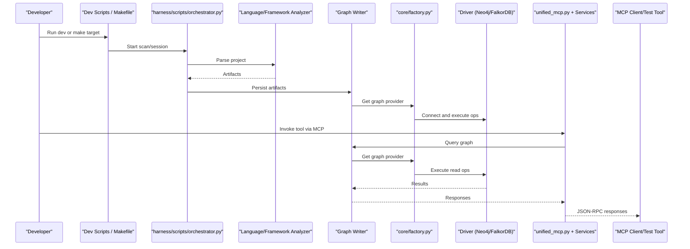
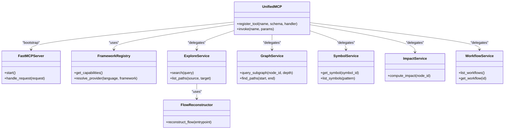
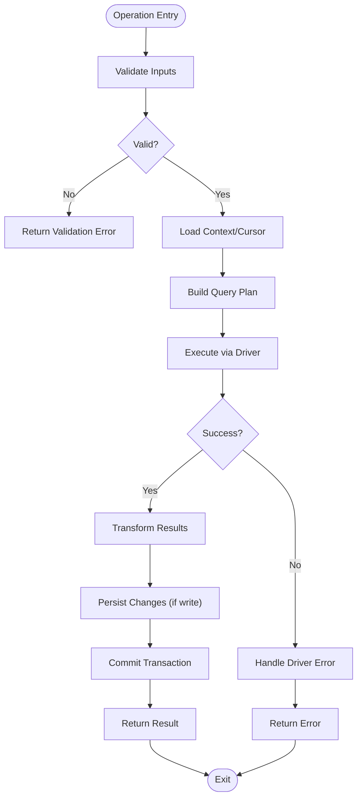
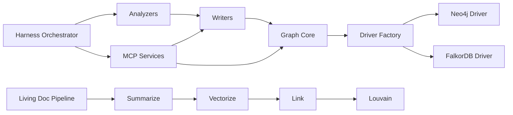

# Developer Guide

<cite>
**Referenced Files in This Document**
- [ReadMe.md](file://ReadMe.md)
- [Makefile](file://Makefile)
- [pyproject.toml](file://pyproject.toml)
- [requirements.txt](file://requirements.txt)
- [dev.sh](file://dev.sh)
- [dev.bat](file://dev.bat)
- [dev.ps1](file://dev.ps1)
- [dev-global.cmd](file://dev-global.cmd)
- [cortex_harness/dev.py](file://cortex_harness/dev.py)
- [harness/scripts/orchestrator.py](file://harness/scripts/orchestrator.py)
- [harness/scripts/init.sh](file://harness/scripts/init.sh)
- [harness/scripts/verify.sh](file://harness/scripts/verify.sh)
- [code-tiny/tools/graph/core/base.py](file://code-tiny/tools/graph/core/base.py)
- [code-tiny/tools/graph/core/factory.py](file://code-tiny/tools/graph/core/factory.py)
- [code-tiny/tools/graph/driver/neo4j_driver.py](file://code-tiny/tools/graph/driver/neo4j_driver.py)
- [code-tiny/tools/graph/driver/falkordb_driver.py](file://code-tiny/tools/graph/driver/falkordb_driver.py)
- [code-tiny/tools/graph/operations/function_ops.py](file://code-tiny/tools/graph/operations/function_ops.py)
- [code-tiny/tools/graph/operations/class_ops.py](file://code-tiny/tools/graph/operations/class_ops.py)
- [code-tiny/tools/graph/writer/language_writer.py](file://code-tiny/tools/graph/writer/language_writer.py)
- [code-tiny/mcp/unified_mcp.py](file://code-tiny/mcp/unified_mcp.py)
- [code-tiny/mcp/fastmcp_server.py](file://code-tiny/mcp/fastmcp_server.py)
- [code-tiny/mcp/framework_registry.py](file://code-tiny/mcp/framework_registry.py)
- [code-tiny/mcp/services/explore_service.py](file://code-tiny/mcp/services/explore_service.py)
- [code-tiny/mcp/services/graph_service.py](file://code-tiny/mcp/services/graph_service.py)
- [code-tiny/mcp/services/symbol_service.py](file://code-tiny/mcp/services/symbol_service.py)
- [code-tiny/mcp/services/impact_service.py](file://code-tiny/mcp/services/impact_service.py)
- [code-tiny/mcp/services/workflow_service.py](file://code-tiny/mcp/services/workflow_service.py)
- [code-tiny/mcp/services/flow_reconstructor.py](file://code-tiny/mcp/services/flow_reconstructor.py)
- [code-tiny/mcp/tool_metadata.py](file://code-tiny/mcp/tool_metadata.py)
- [code-tiny/mcp/semantic_graph_expansion.py](file://code-tiny/mcp/semantic_graph_expansion.py)
- [code-tiny/mcp/android/android_mcp.py](file://code-tiny/mcp/android/android_mcp.py)
- [code-tiny/mcp/cplus/cplus_mcp.py](file://code-tiny/mcp/cplus/cplus_mcp.py)
- [code-tiny/mcp/java/java_mcp.py](file://code-tiny/mcp/java/java_mcp.py)
- [code-tiny/tools/common/harness_config.py](file://code-tiny/tools/common/harness_config.py)
- [code-tiny/tools/common/incremental_sync_state.py](file://code-tiny/tools/common/incremental_sync_state.py)
- [code-tiny/tools/common/source_inventory.py](file://code-tiny/tools/common/source_inventory.py)
- [code-tiny/tools/common/analyzer_cache.py](file://code-tiny/tools/common/analyzer_cache.py)
- [code-tiny/tools/python/python_analyzer.py](file://code-tiny/tools/python/python_analyzer.py)
- [code-tiny/tools/cobol/cobol_analyzer.py](file://code-tiny/tools/cobol/cobol_analyzer.py)
- [code-tiny/tools/flutter/flutter_analyzer.py](file://code-tiny/tools/flutter/flutter_analyzer.py)
- [code-tiny/tools/ts/ts_analyzer.py](file://code-tiny/tools/ts/ts_analyzer.py)
- [code-tiny/tools/web_framework/web_framework_analyzer.py](file://code-tiny/tools/web_framework/web_framework_analyzer.py)
- [code-tiny/livingdoc/README.md](file://code-tiny/livingdoc/README.md)
- [code-tiny/livingdoc/living-doc-pipeline.py](file://code-tiny/livingdoc/living-doc-pipeline.py)
- [code-tiny/livingdoc/living-doc-summarize.py](file://code-tiny/livingdoc/living-doc-summarize.py)
- [code-tiny/livingdoc/living-doc-vectorize.py](file://code-tiny/livingdoc/living-doc-vectorize.py)
- [code-tiny/livingdoc/living-doc-link.py](file://code-tiny/livingdoc/living-doc-link.py)
- [code-tiny/livingdoc/living-doc-louvain.py](file://code-tiny/livingdoc/living-doc-louvain.py)
- [code-tiny/livingdoc/living-doc-vectorize-infra.py](file://code-tiny/livingdoc/living-doc-vectorize-infra.py)
- [code-tiny/livingdoc/living-doc-summarize-infra.py](file://code-tiny/livingdoc/living-doc-summarize-infra.py)
- [code-tiny/testtool/README.md](file://code-tiny/testtool/README.md)
- [code-tiny/testtool/mcp_client.py](file://code-tiny/testtool/mcp_client.py)
- [code-tiny/testtool/mcp_tester.py](file://code-tiny/testtool/mcp_tester.py)
- [code-tiny/testtool/tool_defaults.py](file://code-tiny/testtool/tool_defaults.py)
- [tests/test_dev_lifecycle_commands.py](file://tests/test_dev_lifecycle_commands.py)
- [tests/test_make_lifecycle.py](file://tests/test_make_lifecycle.py)
- [tests/test_incremental_sync_lock.py](file://tests/test_incremental_sync_lock.py)
- [tests/test_incremental_sync_state_migration.py](file://tests/test_incremental_sync_state_migration.py)
- [tests/test_unified_mcp_wrapper_signatures.py](file://tests/test_unified_mcp_wrapper_signatures.py)
- [tests/test_unified_mcp_input_coercion.py](file://tests/test_unified_mcp_input_coercion.py)
- [tests/test_mcp_runtime_config.py](file://tests/test_mcp_runtime_config.py)
- [tests/test_falkordb_driver.py](file://tests/test_falkordb_driver.py)
- [tests/test_semantic_graph_expansion.py](file://tests/test_semantic_graph_expansion.py)
- [tests/test_primary_vector_sync.py](file://tests/test_primary_vector_sync.py)
- [tests/test_source_inventory.py](file://tests/test_source_inventory.py)
- [tests/test_git_change_detection.py](file://tests/test_git_change_detection.py)
- [scripts/mcp-lifecycle.py](file://scripts/mcp-lifecycle.py)
- [scripts/mcp-lifecycle.ps1](file://scripts/mcp-lifecycle.ps1)
- [scripts/mcp_runtime_config.py](file://scripts/mcp_runtime_config.py)
- [scripts/validate_retrieval.py](file://scripts/validate_retrieval.py)
- [.github/workflows/lifecycle-macos.yml](file:.github/workflows/lifecycle-macos.yml)
- [.github/workflows/cobol-macos.yml](file:.github/workflows/cobol-macos.yml)
</cite>

## Table of Contents
1. Introduction
2. Project Structure
3. Core Components
4. Architecture Overview
5. Detailed Component Analysis
6. Dependency Analysis
7. Performance Considerations
8. Troubleshooting Guide
9. Conclusion
10. Appendices

## Introduction
This Developer Guide provides a comprehensive, end-to-end reference for contributing to Cortex Harness development. It covers environment setup, IDE and debugging configuration, local testing infrastructure, code organization and conventions, contribution workflow, extending analyzers and framework overlays, implementing MCP capabilities, adding graph operations, integrating third-party tools, living documentation, automated testing, CI processes, release procedures, versioning, backward compatibility, performance profiling, troubleshooting, and community guidelines.

The repository is a multi-language analysis and orchestration platform with:
- Language and framework analyzers that build semantic graphs
- A graph core with pluggable drivers (Neo4j, FalkorDB)
- An MCP server layer exposing tool capabilities across languages and frameworks
- A harness orchestrator and lifecycle scripts for dev/test/release
- Living documentation generation and vectorization pipelines
- Extensive tests and CI workflows

## Project Structure
High-level layout:
- Root orchestration and packaging: Makefile, pyproject.toml, requirements.txt, dev scripts
- Graph core and writers: code-tiny/tools/graph
- Analyzers and framework overlays: code-tiny/tools/{language|framework}
- MCP server and services: code-tiny/mcp
- Harness orchestration: harness/scripts
- Tests: tests
- Scripts: scripts
- Living doc generators: code-tiny/livingdoc
- Test tooling: code-tiny/testtool
- CI: .github/workflows

```mermaid
graph TB
subgraph "Root"
MK["Makefile"]
PYPROJ["pyproject.toml"]
REQ["requirements.txt"]
DEVSH["dev.sh"]
DEVBAT["dev.bat"]
DEVPS["dev.ps1"]
end
subgraph "Graph Core"
BASE["core/base.py"]
FACT["core/factory.py"]
NEO["driver/neo4j_driver.py"]
FALK["driver/falkordb_driver.py"]
FOPS["operations/function_ops.py"]
COPS["operations/class_ops.py"]
LWR["writer/language_writer.py"]
end
subgraph "Analyzers"
PYA["python/python_analyzer.py"]
COBOL["cobol/cobol_analyzer.py"]
FLUT["flutter/flutter_analyzer.py"]
TSAN["ts/ts_analyzer.py"]
WEBFA["web_framework/web_framework_analyzer.py"]
end
subgraph "MCP Layer"
UMC["unified_mcp.py"]
FMS["fastmcp_server.py"]
REG["framework_registry.py"]
EXP["services/explore_service.py"]
GRS["services/graph_service.py"]
SYM["services/symbol_service.py"]
IMP["services/impact_service.py"]
WFS["services/workflow_service.py"]
FRC["services/flow_reconstructor.py"]
end
subgraph "Harness"
ORCH["harness/scripts/orchestrator.py"]
INIT["harness/scripts/init.sh"]
VER["harness/scripts/verify.sh"]
end
subgraph "Living Doc"
LDP["livingdoc/living-doc-pipeline.py"]
LDS["livingdoc/living-doc-summarize.py"]
LDV["livingdoc/living-doc-vectorize.py"]
LDL["livingdoc/living-doc-link.py"]
LDLV["livingdoc/living-doc-louvain.py"]
end
subgraph "Test Tooling"
TREADME["testtool/README.md"]
MCPC["testtool/mcp_client.py"]
MTC["testtool/mcp_tester.py"]
TD["testtool/tool_defaults.py"]
end
MK --> ORCH
PYPROJ --> REQ
DEVSH --> ORCH
DEVBAT --> ORCH
DEVPS --> ORCH
PYA --> LWR
COBOL --> LWR
FLUT --> LWR
TSAN --> LWR
WEBFA --> LWR
LWR --> BASE
BASE --> FACT
FACT --> NEO
FACT --> FALK
FOPS --> BASE
COPS --> BASE
UMC --> FMS
UMC --> REG
UMC --> EXP
UMC --> GRS
UMC --> SYM
UMC --> IMP
UMC --> WFS
UMC --> FRC
LDP --> LDS
LDS --> LDV
LDV --> LDL
LDL --> LDLV
MCPC --> UMC
MTC --> UMC
```

**Diagram sources**
- [Makefile](file://Makefile)
- [pyproject.toml](file://pyproject.toml)
- [requirements.txt](file://requirements.txt)
- [dev.sh](file://dev.sh)
- [dev.bat](file://dev.bat)
- [dev.ps1](file://dev.ps1)
- [code-tiny/tools/graph/core/base.py](file://code-tiny/tools/graph/core/base.py)
- [code-tiny/tools/graph/core/factory.py](file://code-tiny/tools/graph/core/factory.py)
- [code-tiny/tools/graph/driver/neo4j_driver.py](file://code-tiny/tools/graph/driver/neo4j_driver.py)
- [code-tiny/tools/graph/driver/falkordb_driver.py](file://code-tiny/tools/graph/driver/falkordb_driver.py)
- [code-tiny/tools/graph/operations/function_ops.py](file://code-tiny/tools/graph/operations/function_ops.py)
- [code-tiny/tools/graph/operations/class_ops.py](file://code-tiny/tools/graph/operations/class_ops.py)
- [code-tiny/tools/graph/writer/language_writer.py](file://code-tiny/tools/graph/writer/language_writer.py)
- [code-tiny/tools/python/python_analyzer.py](file://code-tiny/tools/python/python_analyzer.py)
- [code-tiny/tools/cobol/cobol_analyzer.py](file://code-tiny/tools/cobol/cobol_analyzer.py)
- [code-tiny/tools/flutter/flutter_analyzer.py](file://code-tiny/tools/flutter/flutter_analyzer.py)
- [code-tiny/tools/ts/ts_analyzer.py](file://code-tiny/tools/ts/ts_analyzer.py)
- [code-tiny/tools/web_framework/web_framework_analyzer.py](file://code-tiny/tools/web_framework/web_framework_analyzer.py)
- [code-tiny/mcp/unified_mcp.py](file://code-tiny/mcp/unified_mcp.py)
- [code-tiny/mcp/fastmcp_server.py](file://code-tiny/mcp/fastmcp_server.py)
- [code-tiny/mcp/framework_registry.py](file://code-tiny/mcp/framework_registry.py)
- [code-tiny/mcp/services/explore_service.py](file://code-tiny/mcp/services/explore_service.py)
- [code-tiny/mcp/services/graph_service.py](file://code-tiny/mcp/services/graph_service.py)
- [code-tiny/mcp/services/symbol_service.py](file://code-tiny/mcp/services/symbol_service.py)
- [code-tiny/mcp/services/impact_service.py](file://code-tiny/mcp/services/impact_service.py)
- [code-tiny/mcp/services/workflow_service.py](file://code-tiny/mcp/services/workflow_service.py)
- [code-tiny/mcp/services/flow_reconstructor.py](file://code-tiny/mcp/services/flow_reconstructor.py)
- [harness/scripts/orchestrator.py](file://harness/scripts/orchestrator.py)
- [harness/scripts/init.sh](file://harness/scripts/init.sh)
- [harness/scripts/verify.sh](file://harness/scripts/verify.sh)
- [code-tiny/livingdoc/living-doc-pipeline.py](file://code-tiny/livingdoc/living-doc-pipeline.py)
- [code-tiny/livingdoc/living-doc-summarize.py](file://code-tiny/livingdoc/living-doc-summarize.py)
- [code-tiny/livingdoc/living-doc-vectorize.py](file://code-tiny/livingdoc/living-doc-vectorize.py)
- [code-tiny/livingdoc/living-doc-link.py](file://code-tiny/livingdoc/living-doc-link.py)
- [code-tiny/livingdoc/living-doc-louvain.py](file://code-tiny/livingdoc/living-doc-louvain.py)
- [code-tiny/testtool/README.md](file://code-tiny/testtool/README.md)
- [code-tiny/testtool/mcp_client.py](file://code-tiny/testtool/mcp_client.py)
- [code-tiny/testtool/mcp_tester.py](file://code-tiny/testtool/mcp_tester.py)
- [code-tiny/testtool/tool_defaults.py](file://code-tiny/testtool/tool_defaults.py)

**Section sources**
- [ReadMe.md](file://ReadMe.md)
- [Makefile](file://Makefile)
- [pyproject.toml](file://pyproject.toml)
- [requirements.txt](file://requirements.txt)

## Core Components
- Graph Core: Base abstractions, driver factory, and typed operations for functions/classes and other nodes. Writers translate analyzer outputs into graph records.
- Analyzers: Per-language and per-framework analyzers producing normalized artifacts consumed by writers.
- MCP Layer: Unified MCP wrapper, FastMCP server bootstrap, capability registry, and domain services (explore, graph, symbol, impact, workflow, flow reconstruction).
- Harness Orchestration: Lifecycle scripts for init, verify, and orchestration tasks.
- Living Documentation: Pipelines to summarize, link, and vectorize docs; Louvain clustering for topic discovery.
- Test Tooling: MCP client and tester utilities with defaults and fixtures.

Key responsibilities and interactions are illustrated in the architecture diagram above.

**Section sources**
- [code-tiny/tools/graph/core/base.py](file://code-tiny/tools/graph/core/base.py)
- [code-tiny/tools/graph/core/factory.py](file://code-tiny/tools/graph/core/factory.py)
- [code-tiny/tools/graph/operations/function_ops.py](file://code-tiny/tools/graph/operations/function_ops.py)
- [code-tiny/tools/graph/operations/class_ops.py](file://code-tiny/tools/graph/operations/class_ops.py)
- [code-tiny/tools/graph/writer/language_writer.py](file://code-tiny/tools/graph/writer/language_writer.py)
- [code-tiny/mcp/unified_mcp.py](file://code-tiny/mcp/unified_mcp.py)
- [code-tiny/mcp/fastmcp_server.py](file://code-tiny/mcp/fastmcp_server.py)
- [code-tiny/mcp/framework_registry.py](file://code-tiny/mcp/framework_registry.py)
- [harness/scripts/orchestrator.py](file://harness/scripts/orchestrator.py)
- [code-tiny/livingdoc/living-doc-pipeline.py](file://code-tiny/livingdoc/living-doc-pipeline.py)
- [code-tiny/testtool/mcp_client.py](file://code-tiny/testtool/mcp_client.py)

## Architecture Overview
The system follows a layered architecture:
- Orchestrator and CLI entry points drive scans and MCP sessions
- Analyzers parse source and produce normalized artifacts
- Writers persist artifacts into the graph via pluggable drivers
- MCP services expose query and exploration capabilities over the graph
- Living doc pipelines maintain up-to-date documentation and vectors
- Tests validate contracts, routing, and runtime behavior

**Diagram sources**
- [Makefile](file://Makefile)
- [harness/scripts/orchestrator.py](file://harness/scripts/orchestrator.py)
- [code-tiny/tools/graph/core/factory.py](file://code-tiny/tools/graph/core/factory.py)
- [code-tiny/tools/graph/driver/neo4j_driver.py](file://code-tiny/tools/graph/driver/neo4j_driver.py)
- [code-tiny/tools/graph/driver/falkordb_driver.py](file://code-tiny/tools/graph/driver/falkordb_driver.py)
- [code-tiny/mcp/unified_mcp.py](file://code-tiny/mcp/unified_mcp.py)
- [code-tiny/testtool/mcp_client.py](file://code-tiny/testtool/mcp_client.py)

## Detailed Component Analysis

### Development Environment Setup
- Python and dependencies: Use the root requirements and project metadata to install deps. Prefer a virtualenv or conda env managed by your IDE.
- Cross-platform dev scripts:
  - Unix-like: dev.sh
  - Windows batch: dev.bat
  - PowerShell: dev.ps1
  - Global launcher: dev-global.cmd
- Makefile targets: Provide lifecycle commands for common tasks (init, test, lint, mcp run, etc.). Inspect targets for exact commands.
- Local MCP server: Bootstrap via unified MCP and FastMCP server modules. Use testtool clients to exercise endpoints.

IDE tips:
- Configure Python interpreter to your venv
- Set working directory to repo root
- Add environment variables required by MCP/runtime config
- Create launch configurations for:
  - Running the MCP server
  - Running orchestrator tasks
  - Executing specific tests

Debugging:
- Attach debugger to MCP server process
- Enable logging in harness scripts and MCP runtime config
- Use testtool clients to send sample requests and inspect payloads

Local testing:
- Unit tests under tests/
- MCP acceptance and integration tests
- Fixture-based analyzer tests
- Use Makefile or direct pytest invocation

**Section sources**
- [requirements.txt](file://requirements.txt)
- [pyproject.toml](file://pyproject.toml)
- [dev.sh](file://dev.sh)
- [dev.bat](file://dev.bat)
- [dev.ps1](file://dev.ps1)
- [dev-global.cmd](file://dev-global.cmd)
- [Makefile](file://Makefile)
- [code-tiny/mcp/unified_mcp.py](file://code-tiny/mcp/unified_mcp.py)
- [code-tiny/mcp/fastmcp_server.py](file://code-tiny/mcp/fastmcp_server.py)
- [code-tiny/testtool/README.md](file://code-tiny/testtool/README.md)
- [code-tiny/testtool/mcp_client.py](file://code-tiny/testtool/mcp_client.py)
- [code-tiny/testtool/mcp_tester.py](file://code-tiny/testtool/mcp_tester.py)
- [code-tiny/testtool/tool_defaults.py](file://code-tiny/testtool/tool_defaults.py)

### Code Organization and Conventions
- Feature-based directories: Each language/framework has its own folder under code-tiny/tools/<lang|framework>.
- Common utilities: Shared logic resides under code-tiny/tools/common.
- Graph core: Abstractions, drivers, operations, and writers under code-tiny/tools/graph.
- MCP services: Domain services under code-tiny/mcp/services.
- Naming:
  - Modules: snake_case
  - Classes: PascalCase
  - Functions/variables: snake_case
  - Constants: UPPER_SNAKE_CASE
- Contracts:
  - Analyzer outputs must conform to writer expectations
  - MCP tool schemas should be validated against registered capabilities
- Error handling:
  - Raise typed exceptions where appropriate
  - Return structured error responses from MCP services

**Section sources**
- [code-tiny/tools/common/harness_config.py](file://code-tiny/tools/common/harness_config.py)
- [code-tiny/tools/common/incremental_sync_state.py](file://code-tiny/tools/common/incremental_sync_state.py)
- [code-tiny/tools/common/source_inventory.py](file://code-tiny/tools/common/source_inventory.py)
- [code-tiny/tools/common/analyzer_cache.py](file://code-tiny/tools/common/analyzer_cache.py)
- [code-tiny/mcp/tool_metadata.py](file://code-tiny/mcp/tool_metadata.py)

### Contribution Workflow
- Branching strategy:
  - Main branch protected; feature branches named descriptively (e.g., feat/add-cobol-analyzer)
  - Keep PRs focused on a single capability or fix
- Pull request process:
  - Ensure all tests pass locally
  - Update relevant specs and docs
  - Include screenshots or logs if UI or MCP behavior changes
- Code review guidelines:
  - Verify contract compliance (analyzers, MCP schemas)
  - Check for performance regressions
  - Validate cross-platform considerations
- Continuous Integration:
  - Workflows for macOS lifecycle and Cobol-specific checks
  - Triggered on push/PR events

**Section sources**
- [.github/workflows/lifecycle-macos.yml](file:.github/workflows/lifecycle-macos.yml)
- [.github/workflows/cobol-macos.yml](file:.github/workflows/cobol-macos.yml)
- [tests/test_dev_lifecycle_commands.py](file://tests/test_dev_lifecycle_commands.py)
- [tests/test_make_lifecycle.py](file://tests/test_make_lifecycle.py)

### Implementing New Language Analyzers
Steps:
1. Create analyzer module under code-tiny/tools/<lang>/
2. Implement parsing and artifact normalization
3. Integrate with graph writer(s) to persist nodes and edges
4. Register analyzer in discovery mechanisms if applicable
5. Add tests using fixtures and contract assertions
6. Optionally add MCP service methods for querying new artifacts

Patterns:
- Use shared utilities from code-tiny/tools/common
- Follow existing analyzer structure (e.g., python, cobol, flutter, ts)
- Maintain incremental sync state and caching where beneficial

Examples:
- See existing analyzers for patterns and contracts

**Section sources**
- [code-tiny/tools/python/python_analyzer.py](file://code-tiny/tools/python/python_analyzer.py)
- [code-tiny/tools/cobol/cobol_analyzer.py](file://code-tiny/tools/cobol/cobol_analyzer.py)
- [code-tiny/tools/flutter/flutter_analyzer.py](file://code-tiny/tools/flutter/flutter_analyzer.py)
- [code-tiny/tools/ts/ts_analyzer.py](file://code-tiny/tools/ts/ts_analyzer.py)
- [code-tiny/tools/common/analyzer_cache.py](file://code-tiny/tools/common/analyzer_cache.py)
- [code-tiny/tools/common/incremental_sync_state.py](file://code-tiny/tools/common/incremental_sync_state.py)
- [code-tiny/tools/common/source_inventory.py](file://code-tiny/tools/common/source_inventory.py)

### Implementing Framework Overlays
Framework overlays extend base language analysis with framework-specific semantics (e.g., web frameworks).
- Place overlay under code-tiny/tools/<framework>/
- Extend or wrap language analyzer outputs
- Write framework-specific writers or augment existing ones
- Validate with framework fixture projects

Example:
- Web framework overlay demonstrates combining multiple language signals

**Section sources**
- [code-tiny/tools/web_framework/web_framework_analyzer.py](file://code-tiny/tools/web_framework/web_framework_analyzer.py)
- [code-tiny/tools/graph/writer/language_writer.py](file://code-tiny/tools/graph/writer/language_writer.py)

### Implementing MCP Capabilities
To add a new MCP tool:
1. Define tool metadata and schema
2. Implement service method(s) in code-tiny/mcp/services
3. Register capability in framework registry
4. Expose via unified MCP wrapper
5. Add tests for input coercion, signature validation, and acceptance matrix

**Diagram sources**
- [code-tiny/mcp/unified_mcp.py](file://code-tiny/mcp/unified_mcp.py)
- [code-tiny/mcp/fastmcp_server.py](file://code-tiny/mcp/fastmcp_server.py)
- [code-tiny/mcp/framework_registry.py](file://code-tiny/mcp/framework_registry.py)
- [code-tiny/mcp/services/explore_service.py](file://code-tiny/mcp/services/explore_service.py)
- [code-tiny/mcp/services/graph_service.py](file://code-tiny/mcp/services/graph_service.py)
- [code-tiny/mcp/services/symbol_service.py](file://code-tiny/mcp/services/symbol_service.py)
- [code-tiny/mcp/services/impact_service.py](file://code-tiny/mcp/services/impact_service.py)
- [code-tiny/mcp/services/workflow_service.py](file://code-tiny/mcp/services/workflow_service.py)
- [code-tiny/mcp/services/flow_reconstructor.py](file://code-tiny/mcp/services/flow_reconstructor.py)

**Section sources**
- [code-tiny/mcp/tool_metadata.py](file://code-tiny/mcp/tool_metadata.py)
- [code-tiny/mcp/unified_mcp.py](file://code-tiny/mcp/unified_mcp.py)
- [code-tiny/mcp/fastmcp_server.py](file://code-tiny/mcp/fastmcp_server.py)
- [code-tiny/mcp/framework_registry.py](file://code-tiny/mcp/framework_registry.py)
- [code-tiny/mcp/services/explore_service.py](file://code-tiny/mcp/services/explore_service.py)
- [code-tiny/mcp/services/graph_service.py](file://code-tiny/mcp/services/graph_service.py)
- [code-tiny/mcp/services/symbol_service.py](file://code-tiny/mcp/services/symbol_service.py)
- [code-tiny/mcp/services/impact_service.py](file://code-tiny/mcp/services/impact_service.py)
- [code-tiny/mcp/services/workflow_service.py](file://code-tiny/mcp/services/workflow_service.py)
- [code-tiny/mcp/services/flow_reconstructor.py](file://code-tiny/mcp/services/flow_reconstructor.py)
- [tests/test_unified_mcp_wrapper_signatures.py](file://tests/test_unified_mcp_wrapper_signatures.py)
- [tests/test_unified_mcp_input_coercion.py](file://tests/test_unified_mcp_input_coercion.py)
- [tests/test_mcp_runtime_config.py](file://tests/test_mcp_runtime_config.py)

### Adding New Graph Operations
- Implement operation classes under code-tiny/tools/graph/operations
- Compose operations using the base abstractions
- Ensure idempotency and transactional safety when writing
- Add tests covering edge cases and performance

**Diagram sources**
- [code-tiny/tools/graph/core/base.py](file://code-tiny/tools/graph/core/base.py)
- [code-tiny/tools/graph/operations/function_ops.py](file://code-tiny/tools/graph/operations/function_ops.py)
- [code-tiny/tools/graph/operations/class_ops.py](file://code-tiny/tools/graph/operations/class_ops.py)

**Section sources**
- [code-tiny/tools/graph/core/base.py](file://code-tiny/tools/graph/core/base.py)
- [code-tiny/tools/graph/operations/function_ops.py](file://code-tiny/tools/graph/operations/function_ops.py)
- [code-tiny/tools/graph/operations/class_ops.py](file://code-tiny/tools/graph/operations/class_ops.py)

### Integrating Third-Party Tools
- Wrap external binaries or APIs behind adapters
- Normalize inputs/outputs to internal contracts
- Cache results and handle retries/timeouts
- Provide MCP tools to expose functionality safely

[No sources needed since this section provides general guidance]

### Extending Existing Functionality
- Add new writers for additional artifact types
- Augment MCP services with new queries
- Extend living doc pipelines to include new content sources
- Update test fixtures and assertions

**Section sources**
- [code-tiny/tools/graph/writer/language_writer.py](file://code-tiny/tools/graph/writer/language_writer.py)
- [code-tiny/mcp/services/explore_service.py](file://code-tiny/mcp/services/explore_service.py)
- [code-tiny/livingdoc/living-doc-pipeline.py](file://code-tiny/livingdoc/living-doc-pipeline.py)

## Dependency Analysis
Core dependency relationships:
- Analyzers depend on common utilities and writers
- Writers depend on graph core and driver factory
- MCP services depend on writers and graph core
- Harness orchestrator coordinates scanning and MCP sessions
- Living doc pipelines depend on summarization and vectorization components

**Diagram sources**
- [code-tiny/tools/graph/core/factory.py](file://code-tiny/tools/graph/core/factory.py)
- [code-tiny/tools/graph/driver/neo4j_driver.py](file://code-tiny/tools/graph/driver/neo4j_driver.py)
- [code-tiny/tools/graph/driver/falkordb_driver.py](file://code-tiny/tools/graph/driver/falkordb_driver.py)
- [code-tiny/tools/graph/writer/language_writer.py](file://code-tiny/tools/graph/writer/language_writer.py)
- [code-tiny/mcp/unified_mcp.py](file://code-tiny/mcp/unified_mcp.py)
- [harness/scripts/orchestrator.py](file://harness/scripts/orchestrator.py)
- [code-tiny/livingdoc/living-doc-pipeline.py](file://code-tiny/livingdoc/living-doc-pipeline.py)
- [code-tiny/livingdoc/living-doc-summarize.py](file://code-tiny/livingdoc/living-doc-summarize.py)
- [code-tiny/livingdoc/living-doc-vectorize.py](file://code-tiny/livingdoc/living-doc-vectorize.py)
- [code-tiny/livingdoc/living-doc-link.py](file://code-tiny/livingdoc/living-doc-link.py)
- [code-tiny/livingdoc/living-doc-louvain.py](file://code-tiny/livingdoc/living-doc-louvain.py)

**Section sources**
- [code-tiny/tools/graph/core/factory.py](file://code-tiny/tools/graph/core/factory.py)
- [code-tiny/tools/graph/driver/neo4j_driver.py](file://code-tiny/tools/graph/driver/neo4j_driver.py)
- [code-tiny/tools/graph/driver/falkordb_driver.py](file://code-tiny/tools/graph/driver/falkordb_driver.py)
- [code-tiny/tools/graph/writer/language_writer.py](file://code-tiny/tools/graph/writer/language_writer.py)
- [code-tiny/mcp/unified_mcp.py](file://code-tiny/mcp/unified_mcp.py)
- [harness/scripts/orchestrator.py](file://harness/scripts/orchestrator.py)
- [code-tiny/livingdoc/living-doc-pipeline.py](file://code-tiny/livingdoc/living-doc-pipeline.py)

## Performance Considerations
- Incremental scanning: Leverage change detection and state management to minimize rework
- Caching: Use analyzer cache and primary vector sync to reduce redundant work
- Driver selection: Choose FalkorDB for high-throughput scenarios; Neo4j for rich ecosystem features
- Query optimization: Batch operations and avoid deep traversals without limits
- Profiling: Profile MCP handlers and graph operations; monitor driver latency

[No sources needed since this section provides general guidance]

## Troubleshooting Guide
Common issues and resolutions:
- MCP connection failures: Verify server startup, ports, and runtime config
- Graph connectivity: Validate driver credentials and network access
- Analyzer errors: Check parser logs and fixture coverage
- Incremental sync inconsistencies: Inspect lock files and state migration
- Test failures: Re-run with verbose output and compare against fixtures

Useful scripts and tests:
- MCP lifecycle scripts for Windows and cross-platform
- Runtime config validation
- Retrieval validation script
- Specific tests for drivers, MCP wrappers, and incremental sync

**Section sources**
- [scripts/mcp-lifecycle.py](file://scripts/mcp-lifecycle.py)
- [scripts/mcp-lifecycle.ps1](file://scripts/mcp-lifecycle.ps1)
- [scripts/mcp_runtime_config.py](file://scripts/mcp_runtime_config.py)
- [scripts/validate_retrieval.py](file://scripts/validate_retrieval.py)
- [tests/test_mcp_runtime_config.py](file://tests/test_mcp_runtime_config.py)
- [tests/test_falkordb_driver.py](file://tests/test_falkordb_driver.py)
- [tests/test_unified_mcp_wrapper_signatures.py](file://tests/test_unified_mcp_wrapper_signatures.py)
- [tests/test_unified_mcp_input_coercion.py](file://tests/test_unified_mcp_input_coercion.py)
- [tests/test_incremental_sync_lock.py](file://tests/test_incremental_sync_lock.py)
- [tests/test_incremental_sync_state_migration.py](file://tests/test_incremental_sync_state_migration.py)
- [tests/test_semantic_graph_expansion.py](file://tests/test_semantic_graph_expansion.py)
- [tests/test_primary_vector_sync.py](file://tests/test_primary_vector_sync.py)
- [tests/test_source_inventory.py](file://tests/test_source_inventory.py)
- [tests/test_git_change_detection.py](file://tests/test_git_change_detection.py)

## Conclusion
Cortex Harness provides a robust, extensible foundation for multi-language analysis, graph construction, and MCP-driven exploration. By following the conventions, leveraging shared utilities, and adhering to the contribution workflow, contributors can confidently implement new analyzers, framework overlays, and MCP capabilities while maintaining reliability and performance.

[No sources needed since this section summarizes without analyzing specific files]

## Appendices

### Appendix A: Local Testing Infrastructure
- Use testtool clients to exercise MCP endpoints
- Run targeted tests for analyzers, MCP routing, and drivers
- Validate retrieval and semantic expansion

**Section sources**
- [code-tiny/testtool/README.md](file://code-tiny/testtool/README.md)
- [code-tiny/testtool/mcp_client.py](file://code-tiny/testtool/mcp_client.py)
- [code-tiny/testtool/mcp_tester.py](file://code-tiny/testtool/mcp_tester.py)
- [code-tiny/testtool/tool_defaults.py](file://code-tiny/testtool/tool_defaults.py)
- [tests/test_mcp_acceptance_matrix.py](file://tests/test_mcp_acceptance_matrix.py)
- [tests/test_semantic_graph_expansion.py](file://tests/test_semantic_graph_expansion.py)

### Appendix B: Living Documentation System
- Summarize and link documentation artifacts
- Vectorize content for semantic search
- Apply Louvain clustering for topic discovery

**Section sources**
- [code-tiny/livingdoc/README.md](file://code-tiny/livingdoc/README.md)
- [code-tiny/livingdoc/living-doc-pipeline.py](file://code-tiny/livingdoc/living-doc-pipeline.py)
- [code-tiny/livingdoc/living-doc-summarize.py](file://code-tiny/livingdoc/living-doc-summarize.py)
- [code-tiny/livingdoc/living-doc-vectorize.py](file://code-tiny/livingdoc/living-doc-vectorize.py)
- [code-tiny/livingdoc/living-doc-link.py](file://code-tiny/livingdoc/living-doc-link.py)
- [code-tiny/livingdoc/living-doc-louvain.py](file://code-tiny/livingdoc/living-doc-louvain.py)
- [code-tiny/livingdoc/living-doc-vectorize-infra.py](file://code-tiny/livingdoc/living-doc-vectorize-infra.py)
- [code-tiny/livingdoc/living-doc-summarize-infra.py](file://code-tiny/livingdoc/living-doc-summarize-infra.py)

### Appendix C: Release Procedures and Version Management
- Use Makefile targets to prepare releases
- Tag versions consistently and update changelogs
- Validate cross-platform builds and MCP lifecycle
- Ensure backward compatibility by preserving MCP schemas and graph contracts

**Section sources**
- [Makefile](file://Makefile)
- [pyproject.toml](file://pyproject.toml)
- [.github/workflows/lifecycle-macos.yml](file:.github/workflows/lifecycle-macos.yml)
- [.github/workflows/cobol-macos.yml](file:.github/workflows/cobol-macos.yml)

### Appendix D: Community Guidelines and Support
- Communication channels: Issue tracker, discussions, and PR comments
- Support resources: Specs, living docs, and test fixtures
- Code of conduct and review standards apply to all contributions

[No sources needed since this section provides general guidance]