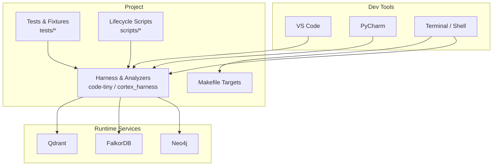
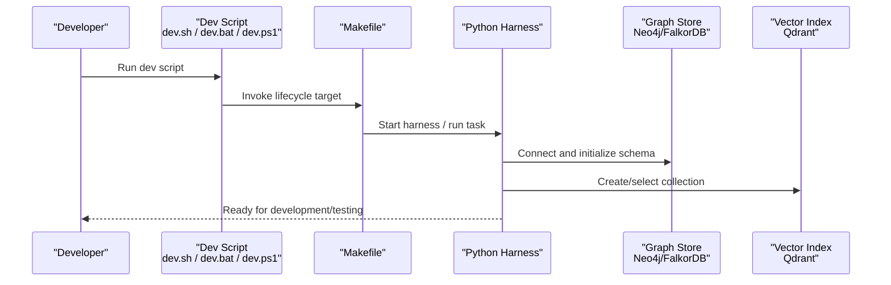
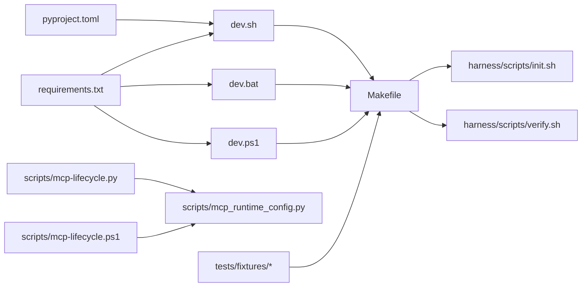

# Development Environment Setup

<cite>
**Referenced Files in This Document**
- [ReadMe.md](file://ReadMe.md)
- [requirements.txt](file://requirements.txt)
- [pyproject.toml](file://pyproject.toml)
- [Makefile](file://Makefile)
- [dev.sh](file://dev.sh)
- [dev.bat](file://dev.bat)
- [dev.ps1](file://dev.ps1)
- [install-windows.bat](file://install-windows.bat)
- [install-windows.ps1](file://install-windows.ps1)
- [cortex-harness.sln](file://cortex-harness.sln)
- [.github/workflows/cobol-macos.yml](file://.github/workflows/cobol-macos.yml)
- [.github/workflows/lifecycle-macos.yml](file://.github/workflows/lifecycle-macos.yml)
- [harness/scripts/init.sh](file://harness/scripts/init.sh)
- [harness/scripts/verify.sh](file://harness/scripts/verify.sh)
- [code-tiny/requirements.txt](file://code-tiny/requirements.txt)
- [doc-tiny/requirements.txt](file://doc-tiny/requirements.txt)
- [code-tiny/mcp.sh](file://code-tiny/mcp.sh)
- [code-tiny/run_mcp.sh](file://code-tiny/run_mcp.sh)
- [scripts/mcp-lifecycle.py](file://scripts/mcp-lifecycle.py)
- [scripts/mcp-lifecycle.ps1](file://scripts/mcp-lifecycle.ps1)
- [scripts/mcp_runtime_config.py](file://scripts/mcp_runtime_config.py)
- [tests/fixtures/aspnet-core-application/Program.cs](file://tests/fixtures/aspnet-core-application/Program.cs)
- [tests/fixtures/database-schema-application/schema.sql](file://tests/fixtures/database-schema-application/schema.sql)
- [code-tiny/scripts/setup_constraints.py](file://code-tiny/scripts/setup_constraints.py)
- [code-tiny/scripts/setup_graph_project.py](file://code-tiny/scripts/setup_graph_project.py)
- [code-tiny/scripts/ingest_workflows.py](file://code-tiny/scripts/ingest_workflows.py)
- [doc-tiny/6_setup_indexes.py](file://doc-tiny/6_setup_indexes.py)
- [doc-tiny/0_reset_all.py](file://doc-tiny/0_reset_all.py)
- [INSTALLER_GUIDE.md](file://INSTALLER_GUIDE.md)
</cite>

## Table of Contents
1. Introduction
2. Project Structure
3. Core Components
4. Architecture Overview
5. Detailed Component Analysis
6. Dependency Analysis
7. Performance Considerations
8. Troubleshooting Guide
9. Conclusion
10. Appendices

## Introduction
This guide provides a complete, step-by-step setup for developing Cortex Harness locally across Windows, macOS, and Linux. It covers Python and toolchain installation, graph database (Neo4j/FalkorDB), vector search (Qdrant), IDE configuration, local testing infrastructure, and performance tuning tips. The repository includes cross-platform scripts and CI workflows that demonstrate the expected environment and runtime behavior.

## Project Structure
Cortex Harness is a multi-language, multi-component project with:
- Python-based harness and analyzers under code-tiny and cortex_harness
- Graph database integration via Neo4j or FalkorDB drivers
- Vector search via Qdrant
- Cross-platform dev and install scripts
- Test fixtures and lifecycle utilities

[No sources needed since this diagram shows conceptual workflow, not actual code structure]

**Section sources**
- [ReadMe.md](file://ReadMe.md)
- [Makefile](file://Makefile)

## Core Components
- Python environment and dependencies are defined in requirements files and project metadata.
- Cross-platform development entry points exist as shell and PowerShell scripts.
- Lifecycle and orchestration helpers are provided by Make targets and Python scripts.
- Local services include graph databases and vector search.

Key responsibilities:
- Requirements management: Python packages and optional extras
- Dev entry points: dev.sh, dev.bat, dev.ps1
- Lifecycle automation: Makefile targets and scripts/mcp-lifecycle.*
- Service initialization: harness/scripts/init.sh and verify.sh
- Test fixtures: tests/fixtures/*

**Section sources**
- [requirements.txt](file://requirements.txt)
- [pyproject.toml](file://pyproject.toml)
- [dev.sh](file://dev.sh)
- [dev.bat](file://dev.bat)
- [dev.ps1](file://dev.ps1)
- [Makefile](file://Makefile)
- [harness/scripts/init.sh](file://harness/scripts/init.sh)
- [harness/scripts/verify.sh](file://harness/scripts/verify.sh)
- [scripts/mcp-lifecycle.py](file://scripts/mcp-lifecycle.py)
- [scripts/mcp-lifecycle.ps1](file://scripts/mcp-lifecycle.ps1)

## Architecture Overview
The development architecture centers on a Python harness interacting with:
- A graph store (Neo4j or FalkorDB) for code semantics and relationships
- A vector index (Qdrant) for semantic search
- Optional MCP lifecycle tools for orchestrating analysis tasks

**Diagram sources**
- [dev.sh](file://dev.sh)
- [dev.bat](file://dev.bat)
- [dev.ps1](file://dev.ps1)
- [Makefile](file://Makefile)
- [harness/scripts/init.sh](file://harness/scripts/init.sh)
- [harness/scripts/verify.sh](file://harness/scripts/verify.sh)

## Detailed Component Analysis

### Python and Package Management
- Use a modern Python version compatible with the project’s requirements.
- Install dependencies from the top-level requirements file and any component-specific ones if running isolated modules.
- If using a virtual environment, activate it before installing.

Recommended steps:
- Create and activate a virtual environment
- Install top-level requirements
- Optionally install component requirements for code-tiny/doc-tiny when working within those areas

**Section sources**
- [requirements.txt](file://requirements.txt)
- [code-tiny/requirements.txt](file://code-tiny/requirements.txt)
- [doc-tiny/requirements.txt](file://doc-tiny/requirements.txt)
- [pyproject.toml](file://pyproject.toml)

### Graph Databases (Neo4j and FalkorDB)
- The harness supports both Neo4j and FalkorDB through dedicated drivers.
- Ensure your chosen graph service is reachable at the configured host/port.
- Initialize schema and indexes as needed using provided scripts.

Initialization and verification:
- Use harness init/verify scripts to bootstrap and validate connectivity
- For doc-tiny related work, use index setup and reset scripts

**Section sources**
- [harness/scripts/init.sh](file://harness/scripts/init.sh)
- [harness/scripts/verify.sh](file://harness/scripts/verify.sh)
- [doc-tiny/6_setup_indexes.py](file://doc-tiny/6_setup_indexes.py)
- [doc-tiny/0_reset_all.py](file://doc-tiny/0_reset_all.py)

### Vector Search (Qdrant)
- Ensure Qdrant is running and accessible.
- Collections used by analyzers should be created or selected by the harness at runtime.
- Confirm connectivity during local verification.

**Section sources**
- [harness/scripts/verify.sh](file://harness/scripts/verify.sh)

### Build and Lifecycle Automation
- The Makefile centralizes common tasks such as linting, testing, and service checks.
- Use Make targets to standardize local workflows across platforms.

**Section sources**
- [Makefile](file://Makefile)

### Cross-Platform Development Entry Points
- Shell script for Unix-like systems
- Batch and PowerShell scripts for Windows
- These scripts typically set up environment variables, start services, and invoke Make targets

**Section sources**
- [dev.sh](file://dev.sh)
- [dev.bat](file://dev.bat)
- [dev.ps1](file://dev.ps1)

### MCP Lifecycle Utilities
- Python and PowerShell helpers manage MCP-related tasks and runtime configuration.
- Useful for orchestrating analysis runs and verifying capabilities.

**Section sources**
- [scripts/mcp-lifecycle.py](file://scripts/mcp-lifecycle.py)
- [scripts/mcp-lifecycle.ps1](file://scripts/mcp-lifecycle.ps1)
- [scripts/mcp_runtime_config.py](file://scripts/mcp_runtime_config.py)

### Local Testing Infrastructure
- Test fixtures provide sample projects for various frameworks and languages.
- Database schema fixtures support SQL-based tests.
- Use the test runner configured in the project to execute suites.

Examples of fixture locations:
- ASP.NET Core application fixture
- Database schema fixture

**Section sources**
- [tests/fixtures/aspnet-core-application/Program.cs](file://tests/fixtures/aspnet-core-application/Program.cs)
- [tests/fixtures/database-schema-application/schema.sql](file://tests/fixtures/database-schema-application/schema.sql)

### Graph Project and Constraint Setup Helpers
- Utility scripts assist with setting up constraints and initializing graph projects for code-tiny workflows.

**Section sources**
- [code-tiny/scripts/setup_constraints.py](file://code-tiny/scripts/setup_constraints.py)
- [code-tiny/scripts/setup_graph_project.py](file://code-tiny/scripts/setup_graph_project.py)
- [code-tiny/scripts/ingest_workflows.py](file://code-tiny/scripts/ingest_workflows.py)

### MCP Server Scripts (code-tiny)
- Convenience scripts to start MCP servers and related processes for code-tiny components.

**Section sources**
- [code-tiny/mcp.sh](file://code-tiny/mcp.sh)
- [code-tiny/run_mcp.sh](file://code-tiny/run_mcp.sh)

## Dependency Analysis
High-level dependency relationships relevant to setup:
- Python harness depends on graph and vector libraries
- Lifecycle scripts depend on Make targets and environment variables
- Tests depend on fixtures and running services

**Diagram sources**
- [requirements.txt](file://requirements.txt)
- [pyproject.toml](file://pyproject.toml)
- [dev.sh](file://dev.sh)
- [dev.bat](file://dev.bat)
- [dev.ps1](file://dev.ps1)
- [Makefile](file://Makefile)
- [harness/scripts/init.sh](file://harness/scripts/init.sh)
- [harness/scripts/verify.sh](file://harness/scripts/verify.sh)
- [scripts/mcp-lifecycle.py](file://scripts/mcp-lifecycle.py)
- [scripts/mcp-lifecycle.ps1](file://scripts/mcp-lifecycle.ps1)
- [scripts/mcp_runtime_config.py](file://scripts/mcp_runtime_config.py)

**Section sources**
- [requirements.txt](file://requirements.txt)
- [pyproject.toml](file://pyproject.toml)
- [Makefile](file://Makefile)

## Performance Considerations
- Prefer a virtual environment to avoid global package conflicts and speed up installs.
- Pin Python versions aligned with CI to reduce compatibility issues.
- Limit concurrent indexing or scanning jobs locally to control memory usage.
- Use incremental sync features where available to reduce reprocessing time.
- Keep graph and vector stores on fast storage; consider SSDs for large datasets.
- Adjust JVM/runtime settings for external services (e.g., Neo4j heap) based on available RAM.

[No sources needed since this section provides general guidance]

## Troubleshooting Guide
Common issues and resolutions:
- Python version mismatch: Align with the version used in CI workflows and requirements.
- Port conflicts: Ensure Neo4j, FalkorDB, and Qdrant ports are free and correctly configured.
- Missing dependencies: Reinstall from requirements files after activating the correct environment.
- Service connectivity: Use verify scripts to confirm reachability and schema readiness.
- Windows-specific paths: Use the provided batch/PowerShell scripts to normalize environment setup.

Useful references:
- CI workflows show platform-specific steps and environment expectations
- Installer guides document packaging and system integration details

**Section sources**
- [.github/workflows/cobol-macos.yml](file://.github/workflows/cobol-macos.yml)
- [.github/workflows/lifecycle-macos.yml](file://.github/workflows/lifecycle-macos.yml)
- [INSTALLER_GUIDE.md](file://INSTALLER_GUIDE.md)

## Conclusion
With Python, graph databases, and vector search configured, and the provided scripts and Make targets in place, you can develop and test Cortex Harness efficiently across platforms. Leverage the lifecycle scripts and verify routines to keep your local environment consistent and reliable.

[No sources needed since this section summarizes without analyzing specific files]

## Appendices

### IDE Configuration

#### Visual Studio Code
- Recommended extensions:
  - Python extension pack
  - YAML/JSON formatters
  - Markdown previewers
- Debugging:
  - Configure launch configurations to run dev scripts or Make targets
  - Set breakpoints in analyzer modules and harness code
  - Attach to running processes if starting services externally

[No sources needed since this section doesn't analyze specific files]

#### PyCharm
- Project interpreter:
  - Point to your virtual environment containing requirements
- Run/Debug Configurations:
  - Add configurations for dev scripts and Make targets
  - Set environment variables for service endpoints
- Linting and formatting:
  - Enable linters and formatters aligned with project standards

[No sources needed since this section doesn't analyze specific files]

#### Other Editors
- Vim/Neovim:
  - Use language servers for Python and YAML
  - Integrate with Make and shell scripts via plugins
- Sublime Text:
  - Install Python build systems and linter integrations

[No sources needed since this section doesn't analyze specific files]

### Cross-Platform Setup Instructions

#### Windows
- Use install scripts to bootstrap environment and dependencies
- Prefer PowerShell or CMD with the provided batch scripts
- Ensure required ports are open and services are started

**Section sources**
- [install-windows.bat](file://install-windows.bat)
- [install-windows.ps1](file://install-windows.ps1)
- [dev.bat](file://dev.bat)
- [dev.ps1](file://dev.ps1)

#### macOS
- Use shell scripts and Make targets
- Follow CI workflow patterns for environment consistency

**Section sources**
- [dev.sh](file://dev.sh)
- [Makefile](file://Makefile)
- [.github/workflows/cobol-macos.yml](file://.github/workflows/cobol-macos.yml)
- [.github/workflows/lifecycle-macos.yml](file://.github/workflows/lifecycle-macos.yml)

#### Linux
- Use shell scripts and Make targets
- Verify service availability and permissions

**Section sources**
- [dev.sh](file://dev.sh)
- [Makefile](file://Makefile)

### Local Testing Infrastructure
- Fixtures:
  - Sample applications under tests/fixtures for multiple frameworks
- Database schema:
  - SQL fixtures for schema-driven tests
- Running tests:
  - Use the project’s test runner and Make targets

**Section sources**
- [tests/fixtures/aspnet-core-application/Program.cs](file://tests/fixtures/aspnet-core-application/Program.cs)
- [tests/fixtures/database-schema-application/schema.sql](file://tests/fixtures/database-schema-application/schema.sql)
- [Makefile](file://Makefile)

### Solution and Project Integration
- C# solution file indicates additional .NET components may be present in the workspace.
- Open the solution in Visual Studio or Rider if working with .NET parts.

**Section sources**
- [cortex-harness.sln](file://cortex-harness.sln)