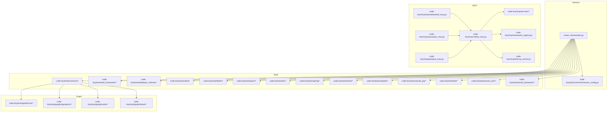
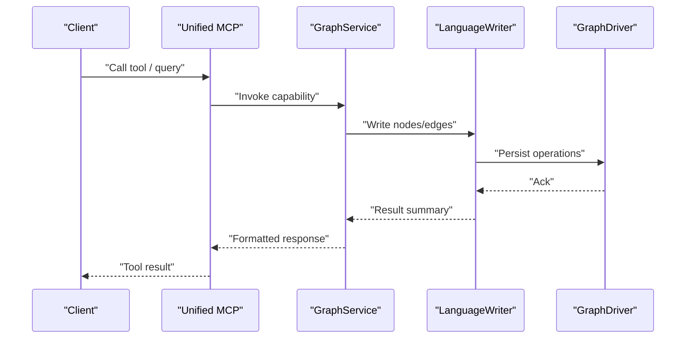
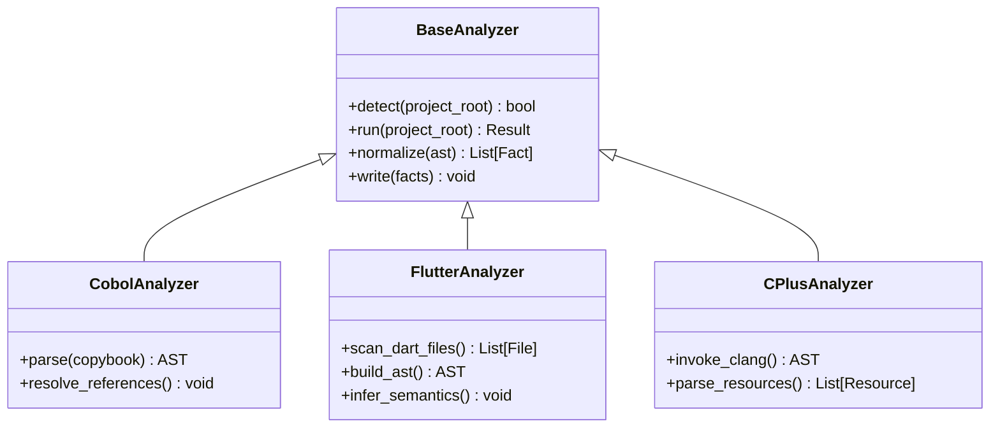
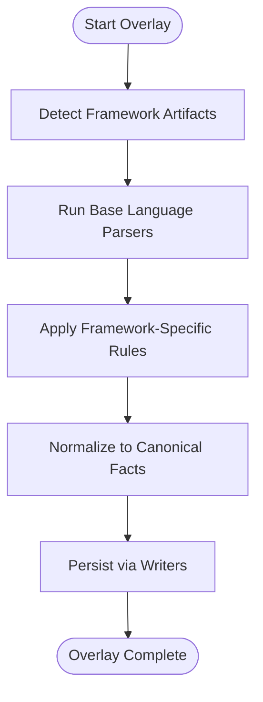
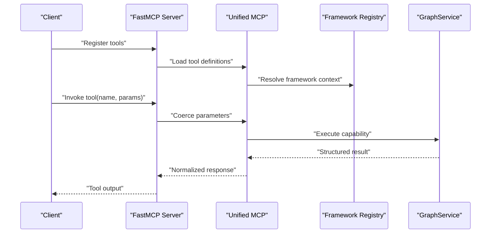
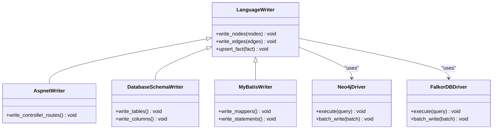
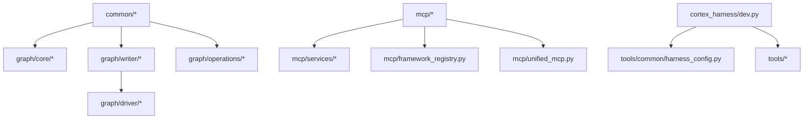

# Extension Development

<cite>
**Referenced Files in This Document**
- [ReadMe.md](file://ReadMe.md)
- [Makefile](file://Makefile)
- [pyproject.toml](file://pyproject.toml)
- [requirements.txt](file://requirements.txt)
- [cortex_harness/dev.py](file://cortex_harness/dev.py)
- [code-tiny/tools/common/harness_config.py](file://code-tiny/tools/common/harness_config.py)
- [code-tiny/mcp/unified_mcp.py](file://code-tiny/mcp/unified_mcp.py)
- [code-tiny/mcp/framework_registry.py](file://code-tiny/mcp/framework_registry.py)
- [code-tiny/mcp/tool_metadata.py](file://code-tiny/mcp/tool_metadata.py)
- [code-tiny/mcp/services/graph_service.py](file://code-tiny/mcp/services/graph_service.py)
- [code-tiny/mcp/services/impact_service.py](file://code-tiny/mcp/services/impact_service.py)
- [code-tiny/mcp/services/symbol_service.py](file://code-tiny/mcp/services/symbol_service.py)
- [code-tiny/mcp/services/explore_service.py](file://code-tiny/mcp/services/explore_service.py)
- [code-tiny/mcp/services/workflow_service.py](file://code-tiny/mcp/services/workflow_service.py)
- [code-tiny/mcp/services/flow_reconstructor.py](file://code-tiny/mcp/services/flow_reconstructor.py)
- [code-tiny/mcp/semantic_graph_expansion.py](file://code-tiny/mcp/semantic_graph_expansion.py)
- [code-tiny/mcp/fastmcp_server.py](file://code-tiny/mcp/fastmcp_server.py)
- [code-tiny/mcp/android/android_mcp.py](file://code-tiny/mcp/android/android_mcp.py)
- [code-tiny/mcp/cplus/cplus_mcp.py](file://code-tiny/mcp/cplus/cplus_mcp.py)
- [code-tiny/mcp/java/java_mcp.py](file://code-tiny/mcp/java/java_mcp.py)
- [code-tiny/tools/web_framework/web_framework_analyzer.py](file://code-tiny/tools/web_framework/web_framework_analyzer.py)
- [code-tiny/tools/web_framework/pipeline.py](file://code-tiny/tools/web_framework/pipeline.py)
- [code-tiny/tools/web_framework/models.py](file://code-tiny/tools/web_framework/models.py)
- [code-tiny/tools/database_schema/database_schema_analyzer.py](file://code-tiny/tools/database_schema/database_schema_analyzer.py)
- [code-tiny/tools/database_schema/pipeline.py](file://code-tiny/tools/database_schema/pipeline.py)
- [code-tiny/tools/database_schema/models.py](file://code-tiny/tools/database_schema/models.py)
- [code-tiny/tools/graph/core/base.py](file://code-tiny/tools/graph/core/base.py)
- [code-tiny/tools/graph/core/factory.py](file://code-tiny/tools/graph/core/factory.py)
- [code-tiny/tools/graph/driver/neo4j_driver.py](file://code-tiny/tools/graph/driver/neo4j_driver.py)
- [code-tiny/tools/graph/driver/falkordb_driver.py](file://code-tiny/tools/graph/driver/falkordb_driver.py)
- [code-tiny/tools/graph/writer/language_writer.py](file://code-tiny/tools/graph/writer/language_writer.py)
- [code-tiny/tools/graph/writer/aspnet_writer.py](file://code-tiny/tools/graph/writer/aspnet_writer.py)
- [code-tiny/tools/graph/writer/database_schema_writer.py](file://code-tiny/tools/graph/writer/database_schema_writer.py)
- [code-tiny/tools/graph/writer/mybatis_writer.py](file://code-tiny/tools/graph/writer/mybatis_writer.py)
- [code-tiny/tools/graph/writer/servlet_jsp_writer.py](file://code-tiny/tools/graph/writer/servlet_jsp_writer.py)
- [code-tiny/tools/graph/writer/spring_writer.py](file://code-tiny/tools/graph/writer/spring_writer.py)
- [code-tiny/tools/graph/operations/class_ops.py](file://code-tiny/tools/graph/operations/class_ops.py)
- [code-tiny/tools/graph/operations/function_ops.py](file://code-tiny/tools/graph/operations/function_ops.py)
- [code-tiny/tools/graph/operations/package_ops.py](file://code-tiny/tools/graph/operations/package_ops.py)
- [code-tiny/tools/graph/operations/namespace_ops.py](file://code-tiny/tools/graph/operations/namespace_ops.py)
- [code-tiny/tools/graph/operations/document_ops.py](file://code-tiny/tools/graph/operations/document_ops.py)
- [code-tiny/tools/graph/operations/flow_ops.py](file://code-tiny/tools/graph/operations/flow_ops.py)
- [code-tiny/tools/graph/operations/type_ops.py](file://code-tiny/tools/graph/operations/type_ops.py)
- [code-tiny/tools/graph/operations/infra_ops.py](file://code-tiny/tools/graph/operations/infra_ops.py)
- [code-tiny/tools/graph/operations/cross_edge_ops.py](file://code-tiny/tools/graph/operations/cross_edge_ops.py)
- [code-tiny/tools/python/python_analyzer.py](file://code-tiny/tools/python/python_analyzer.py)
- [code-tiny/tools/cobol/cobol_analyzer.py](file://code-tiny/tools/cobol/cobol_analyzer.py)
- [code-tiny/tools/cobol/parser_runtime.py](file://code-tiny/tools/cobol/parser_runtime.py)
- [code-tiny/tools/cobol/pipeline.py](file://code-tiny/tools/cobol/pipeline.py)
- [code-tiny/tools/flutter/flutter_analyzer.py](file://code-tiny/tools/flutter/flutter_analyzer.py)
- [code-tiny/tools/flutter/pipeline.py](file://code-tiny/tools/flutter/pipeline.py)
- [code-tiny/tools/flutter/dart_parser.py](file://code-tiny/tools/flutter/dart_parser.py)
- [code-tiny/tools/flutter/resolver.py](file://code-tiny/tools/flutter/resolver.py)
- [code-tiny/tools/flutter/models.py](file://code-tiny/tools/flutter/models.py)
- [code-tiny/tools/flutter/normalizer.py](file://code-tiny/tools/flutter/normalizer.py)
- [code-tiny/tools/flutter/cache.py](file://code-tiny/tools/flutter/cache.py)
- [code-tiny/tools/flutter/protocol.py](file://code-tiny/tools/flutter/protocol.py)
- [code-tiny/tools/flutter/detector.py](file://code-tiny/tools/flutter/detector.py)
- [code-tiny/tools/cplus/cplus_analyzer.py](file://code-tiny/tools/cplus/cplus_analyzer.py)
- [code-tiny/tools/cplus/clang_parser.py](file://code-tiny/tools/cplus/clang_parser.py)
- [code-tiny/tools/cplus/rc_parser.py](file://code-tiny/tools/cplus/rc_parser.py)
- [code-tiny/tools/cplus/windows_resource_parser.py](file://code-tiny/tools/cplus/windows_resource_parser.py)
- [code-tiny/tools/csharp/csharp_analyzer.py](file://code-tiny/tools/csharp/csharp_analyzer.py)
- [code-tiny/tools/go/go_analyzer.py](file://code-tiny/tools/go/go_analyzer.py)
- [code-tiny/tools/js/js_analyzer.py](file://code-tiny/tools/js/js_analyzer.py)
- [code-tiny/tools/kotlin/kotlin_analyzer.py](file://code-tiny/tools/kotlin/kotlin_analyzer.py)
- [code-tiny/tools/php/php_analyzer.py](file://code-tiny/tools/php/php_analyzer.py)
- [code-tiny/tools/plsql/plsql_analyzer.py](file://code-tiny/tools/plsql/plsql_analyzer.py)
- [code-tiny/tools/rust/rust_analyzer.py](file://code-tiny/tools/rust/rust_analyzer.py)
- [code-tiny/tools/sql/sql_analyzer.py](file://code-tiny/tools/sql/sql_analyzer.py)
- [code-tiny/tools/swift/swift_analyzer.py](file://code-tiny/tools/swift/swift_analyzer.py)
- [code-tiny/tools/vb/vb6_analyzer.py](file://code-tiny/tools/vb/vb6_analyzer.py)
- [code-tiny/tools/vb/vba_analyzer.py](file://code-tiny/tools/vb/vba_analyzer.py)
- [code-tiny/tools/vb/vbnet_analyzer.py](file://code-tiny/tools/vb/vbnet_analyzer.py)
- [code-tiny/tools/vb/vbscript_analyzer.py](file://code-tiny/tools/vb/vbscript_analyzer.py)
- [code-tiny/tools/vb/vb_analyzer_base.py](file://code-tiny/tools/vb/vb_analyzer_base.py)
- [code-tiny/tools/vb/vb_common.py](file://code-tiny/tools/vb/vb_common.py)
- [code-tiny/tools/vb/vb_path_classifier.py](file://code-tiny/tools/vb/vb_path_classifier.py)
- [code-tiny/tools/vb/roslyn_worker/__init__.py](file://code-tiny/tools/vb/roslyn_worker/__init__.py)
- [code-tiny/tools/vb/vb_roslyn_adapter.py](file://code-tiny/tools/vb/vb_roslyn_adapter.py)
- [code-tiny/tools/ts/ts_analyzer.py](file://code-tiny/tools/ts/ts_analyzer.py)
- [code-tiny/tools/ts/_refactor_ts_analyzer.py](file://code-tiny/tools/ts/_refactor_ts_analyzer.py)
- [code-tiny/tools/ts/ts_api_bridge.py](file://code-tiny/tools/ts/ts_api_bridge.py)
- [code-tiny/tools/ts/ts_backend_analyzer.py](file://code-tiny/tools/ts/ts_backend_analyzer.py)
- [code-tiny/tools/ts/ts_project_detector.py](file://code-tiny/tools/ts/ts_project_detector.py)
- [code-tiny/tools/ts/workflow_finder.py](file://code-tiny/tools/ts/workflow_finder.py)
- [code-tiny/tools/ts/context/analyzer_context.py](file://code-tiny/tools/ts/context/analyzer_context.py)
- [code-tiny/tools/ts/types/ast_types.py](file://code-tiny/tools/ts/types/ast_types.py)
- [code-tiny/tools/ts/types/graph_types.py](file://code-tiny/tools/ts/types/graph_types.py)
- [code-tiny/tools/ts/utils/file_utils.py](file://code-tiny/tools/ts/utils/file_utils.py)
- [code-tiny/tools/ts/utils/id_utils.py](file://code-tiny/tools/ts/utils/id_utils.py)
- [code-tiny/tools/ts/utils/regex_patterns.py](file://code-tiny/tools/ts/utils/regex_patterns.py)
- [code-tiny/tools/ts/pipeline/backend_pipeline.py](file://code-tiny/tools/ts/pipeline/backend_pipeline.py)
- [code-tiny/tools/ts/pipeline/frontend_pipeline.py](file://code-tiny/tools/ts/pipeline/frontend_pipeline.py)
- [code-tiny/tools/ts/agents/parser_agent.py](file://code-tiny/tools/ts/agents/parser_agent.py)
- [code-tiny/tools/ts/agents/symbol_agent.py](file://code-tiny/tools/ts/agents/symbol_agent.py)
- [code-tiny/tools/ts/agents/traversal_agent.py](file://code-tiny/tools/ts/agents/traversal_agent.py)
- [code-tiny/tools/ts/agents/api_bridge_agent.py](file://code-tiny/tools/ts/agents/api_bridge_agent.py)
- [code-tiny/tools/ts/agents/backend_agent.py](file://code-tiny/tools/ts/agents/backend_agent.py)
- [code-tiny/tools/ts/agents/dependency_agent.py](file://code-tiny/tools/ts/agents/dependency_agent.py)
- [code-tiny/tools/ts/agents/graph_agent.py](file://code-tiny/tools/ts/agents/graph_agent.py)
- [code-tiny/tools/spring/spring_analyzer.py](file://code-tiny/tools/spring/spring_analyzer.py)
- [code-tiny/tools/spring/spring_java_analyzer.py](file://code-tiny/tools/spring/spring_java_analyzer.py)
- [code-tiny/tools/spring/spring_kotlin_analyzer.py](file://code-tiny/tools/spring/spring_kotlin_analyzer.py)
- [code-tiny/tools/spring/spring_mixed_analyzer.py](file://code-tiny/tools/spring/spring_mixed_analyzer.py)
- [code-tiny/tools/spring/adapters.py](file://code-tiny/tools/spring/adapters.py)
- [code-tiny/tools/spring/annotation_catalog.py](file://code-tiny/tools/spring/annotation_catalog.py)
- [code-tiny/tools/spring/config.py](file://code-tiny/tools/spring/config.py)
- [code-tiny/tools/spring/detector.py](file://code-tiny/tools/spring/detector.py)
- [code-tiny/tools/spring/models.py](file://code-tiny/tools/spring/models.py)
- [code-tiny/tools/spring/source_scanner.py](file://code-tiny/tools/spring/source_scanner.py)
- [code-tiny/tools/spring/value_resolver.py](file://code-tiny/tools/spring/value_resolver.py)
- [code-tiny/tools/spring/pipeline.py](file://code-tiny/tools/spring/pipeline.py)
- [code-tiny/tools/spring/extractors/core.py](file://code-tiny/tools/spring/extractors/core.py)
- [code-tiny/tools/spring/extractors/crosscutting.py](file://code-tiny/tools/spring/extractors/crosscutting.py)
- [code-tiny/tools/spring/extractors/messaging.py](file://code-tiny/tools/spring/extractors/messaging.py)
- [code-tiny/tools/spring/extractors/persistence.py](file://code-tiny/tools/spring/extractors/persistence.py)
- [code-tiny/tools/spring/extractors/security.py](file://code-tiny/tools/spring/extractors/security.py)
- [code-tiny/tools/spring/extractors/common.py](file://code-tiny/tools/spring/extractors/common.py)
- [code-tiny/tools/struts/struts_analyzer.py](file://code-tiny/tools/struts/struts_analyzer.py)
- [code-tiny/tools/struts/struts_xml_parser.py](file://code-tiny/tools/struts/struts_xml_parser.py)
- [code-tiny/tools/struts/validation_parser.py](file://code-tiny/tools/struts/validation_parser.py)
- [code-tiny/tools/struts/web_xml_parser.py](file://code-tiny/tools/struts/web_xml_parser.py)
- [code-tiny/tools/struts/xml_utils.py](file://code-tiny/tools/struts/xml_utils.py)
- [code-tiny/tools/struts/java_validation.py](file://code-tiny/tools/struts/java_validation.py)
- [code-tiny/tools/struts/resolver.py](file://code-tiny/tools/struts/resolver.py)
- [code-tiny/tools/struts/models.py](file://code-tiny/tools/struts/models.py)
- [code-tiny/tools/struts/pipeline.py](file://code-tiny/tools/struts/pipeline.py)
- [code-tiny/tools/mybatis/mybatis_analyzer.py](file://code-tiny/tools/mybatis/mybatis_analyzer.py)
- [code-tiny/tools/mybatis/mapper_interface_analyzer.py](file://code-tiny/tools/mybatis/mapper_interface_analyzer.py)
- [code-tiny/tools/mybatis/mapper_xml_analyzer.py](file://code-tiny/tools/mybatis/mapper_xml_analyzer.py)
- [code-tiny/tools/mybatis/annotation_mapper.py](file://code-tiny/tools/mybatis/annotation_mapper.py)
- [code-tiny/tools/mybatis/dynamic_sql.py](file://code-tiny/tools/mybatis/dynamic_sql.py)
- [code-tiny/tools/mybatis/spring_bridge.py](file://code-tiny/tools/mybatis/spring_bridge.py)
- [code-tiny/tools/mybatis/sql_semantic_analyzer.py](file://code-tiny/tools/mybatis/sql_semantic_analyzer.py)
- [code-tiny/tools/mybatis/parser_runtime.py](file://code-ttiny/tools/mybatis/parser_runtime.py)
- [code-tiny/tools/mybatis/resolver.py](file://code-tiny/tools/mybatis/resolver.py)
- [code-tiny/tools/mybatis/models.py](file://code-tiny/tools/mybatis/models.py)
- [code-tiny/tools/mybatis/pipeline.py](file://code-tiny/tools/mybatis/pipeline.py)
- [code-tiny/tools/mybatis/cache.py](file://code-tiny/tools/mybatis/cache.py)
- [code-tiny/tools/mybatis/detector.py](file://code-tiny/tools/mybatis/detector.py)
- [code-tiny/tools/perl/perl_analyzer.py](file://code-tiny/tools/perl/perl_analyzer.py)
- [code-tiny/tools/perl/per_parser.py](file://code-tiny/tools/perl/per_parser.py)
- [code-tiny/tools/perl/parser_runtime.py](file://code-tiny/tools/perl/parser_runtime.py)
- [code-tiny/tools/perl/resolver.py](file://code-tiny/tools/perl/resolver.py)
- [code-tiny/tools/perl/models.py](file://code-tiny/tools/perl/models.py)
- [code-tiny/tools/perl/pipeline.py](file://code-tiny/tools/perl/pipeline.py)
- [code-tiny/tools/asnet_core/aspnet_core_analyzer.py](file://code-tiny/tools/asnet_core/aspnet_core_analyzer.py)
- [code-tiny/tools/asnet_core/artifact_parsers.py](file://code-tiny/tools/asnet_core/artifact_parsers.py)
- [code-tiny/tools/asnet_core/detector.py](file://code-tiny/tools/asnet_core/detector.py)
- [code-tiny/tools/asnet_core/pipeline.py](file://code-tiny/tools/asnet_core/pipeline.py)
- [code-tiny/tools/asnet_core/resolver.py](file://code-tiny/tools/asnet_core/resolver.py)
- [code-tiny/tools/asnet_framework/aspnet_framework_analyzer.py](file://code-tiny/tools/asnet_framework/aspnet_framework_analyzer.py)
- [code-tiny/tools/asnet_framework/artifact_parsers.py](file://code-tiny/tools/asnet_framework/artifact_parsers.py)
- [code-tiny/tools/asnet_framework/detector.py](file://code-tiny/tools/asnet_framework/detector.py)
- [code-tiny/tools/asnet_framework/pipeline.py](file://code-tiny/tools/asnet_framework/pipeline.py)
- [code-tiny/tools/asnet_framework/resolver.py](file://code-tiny/tools/asnet_framework/resolver.py)
- [code-tiny/tools/servlet_jsp/servlet_jsp_analyzer.py](file://code-tiny/tools/servlet_jsp/servlet_jsp_analyzer.py)
- [code-tiny/tools/servlet_jsp/jsp_parser.py](file://code-tiny/tools/servlet_jsp/jsp_parser.py)
- [code-tiny/tools/servlet_jsp/el_parser.py](file://code-tiny/tools/servlet_jsp/el_parser.py)
- [code-tiny/tools/servlet_jsp/web_xml_parser.py](file://code-tiny/tools/servlet_jsp/web_xml_parser.py)
- [code-tiny/tools/servlet_jsp/properties_parser.py](file://code-tiny/tools/servlet_jsp/properties_parser.py)
- [code-tiny/tools/servlet_jsp/path_resolver.py](file://code-tiny/tools/servlet_jsp/path_resolver.py)
- [code-tiny/tools/servlet_jsp/java_identity.py](file://code-tiny/tools/servlet_jsp/java_identity.py)
- [code-tiny/tools/servlet_jsp/java_semantics.py](file://code-tiny/tools/servlet_jsp/java_semantics.py)
- [code-tiny/tools/servlet_jsp/parser_runtime.py](file://code-tiny/tools/servlet_jsp/parser_runtime.py)
- [code-tiny/tools/servlet_jsp/resolver.py](file://code-tiny/tools/servlet_jsp/resolver.py)
- [code-tiny/tools/servlet_jsp/models.py](file://code-tiny/tools/servlet_jsp/models.py)
- [code-tiny/tools/servlet_jsp/pipeline.py](file://code-tiny/tools/servlet_jsp/pipeline.py)
- [code-tiny/tools/servlet_jsp/cache.py](file://code-tiny/tools/servlet_jsp/cache.py)
- [code-tiny/tools/servlet_jsp/detector.py](file://code-tiny/tools/servlet_jsp/detector.py)
- [code-tiny/tools/common/message_detectors/base.py](file://code-tiny/tools/common/message_detectors/base.py)
- [code-tiny/tools/common/message_detectors/android.py](file://code-tiny/tools/common/message_detectors/android.py)
- [code-tiny/tools/common/message_detectors/cplus.py](file://code-tiny/tools/common/message_detectors/cplus.py)
- [code-tiny/tools/common/message_detectors/csharp.py](file://code-tiny/tools/common/message_detectors/csharp.py)
- [code-tiny/tools/common/message_detectors/delphi.py](file://code-tiny/tools/common/message_detectors/delphi.py)
- [code-tiny/tools/common/message_detectors/java.py](file://code-tiny/tools/common/message_detectors/java.py)
- [code-tiny/tools/common/message_detectors/js.py](file://code-tiny/tools/common/message_detectors/js.py)
- [code-tiny/tools/common/message_detectors/kotlin.py](file://code-tiny/tools/common/message_detectors/kotlin.py)
- [code-tiny/tools/common/message_detectors/php.py](file://code-tiny/tools/common/message_detectors/php.py)
- [code-tiny/tools/common/message_detectors/plsql.py](file://code-tiny/tools/common/message_detectors/plsql.py)
- [code-tiny/tools/common/message_detectors/python.py](file://code-tiny/tools/common/message_detectors/python.py)
- [code-tiny/tools/common/message_detectors/sql.py](file://code-tiny/tools/common/message_detectors/sql.py)
- [code-tiny/tools/common/message_detectors/ts.py](file://code-tiny/tools/common/message_detectors/ts.py)
- [code-tiny/tools/common/message_detectors/vb6.py](file://code-tiny/tools/common/message_detectors/vb6.py)
- [code-tiny/tools/common/message_detectors/vba.py](file://code-tiny/tools/common/message_detectors/vba.py)
- [code-tiny/tools/common/message_detectors/vbnet.py](file://code-tiny/tools/common/message_detectors/vbnet.py)
- [code-tiny/tools/common/message_detectors/vbscript.py](file://code-tiny/tools/common/message_detectors/vbscript.py)
- [code-tiny/tools/common/analyzer_cache.py](file://code-tiny/tools/common/analyzer_cache.py)
- [code-tiny/tools/common/api_match_engine.py](file://code-tiny/tools/common/api_match_engine.py)
- [code-tiny/tools/common/bm25_ranker.py](file://code-tiny/tools/common/bm25_ranker.py)
- [code-tiny/tools/common/call_graph_builder.py](file://code-tiny/tools/common/call_graph_builder.py)
- [code-tiny/tools/common/cloc_stats.py](file://code-tiny/tools/common/cloc_stats.py)
- [code-tiny/tools/common/confidence_scorer.py](file://code-tiny/tools/common/confidence_scorer.py)
- [code-tiny/tools/common/frontend_relationship_extractor.py](file://code-tiny/tools/common/frontend_relationship_extractor.py)
- [code-tiny/tools/common/git_diff.py](file://code-tiny/tools/common/git_diff.py)
- [code-tiny/tools/common/graph_expander.py](file://code-tiny/tools/common/graph_expander.py)
- [code-tiny/tools/common/incremental_cleanup.py](file://code-tiny/tools/common/incremental_cleanup.py)
- [code-tiny/tools/common/incremental_sync_state.py](file://code-tiny/tools/common/incremental_sync_state.py)
- [code-tiny/tools/common/intelligent_retrieval.py](file://code-tiny/tools/common/intelligent_retrieval.py)
- [code-tiny/tools/common/llm_summary.py](file://code-tiny/tools/common/llm_summary.py)
- [code-tiny/tools/common/message_scan.py](file://code-tiny/tools/common/message_scan.py)
- [code-tiny/tools/common/primary_vector_sync.py](file://code-tiny/tools/common/primary_vector_sync.py)
- [code-tiny/tools/common/query_intent_classifier.py](file://code-tiny/tools/common/query_understanding.py](file://code-tiny/tools/common/query_understanding.py)
- [code-tiny/tools/common/react_role_classifier.py](file://code-tiny/tools/common/react_role_classifier.py)
- [code-tiny/tools/common/result_packager.py](file://code-tiny/tools/common/result_packager.py)
- [code-tiny/tools/common/retrieval_scorer.py](file://code-tiny/tools/common/retrieval_scorer.py)
- [code-tiny/tools/common/semantic_inference.py](file://code-tiny/tools/common/semantic_inference.py)
- [code-tiny/tools/common/signal_normalizer.py](file://code-tiny/tools/common/signal_normalizer.py)
- [code-tiny/tools/common/source_inventory.py](file://code-tiny/tools/common/source_inventory.py)
- [code-tiny/tools/common/sync_scope.py](file://code-tiny/tools/common/sync_scope.py)
- [code-tiny/tools/common/url_normalizer.py](file://code-tiny/tools/common/url_normalizer.py)
- [code-tiny/tools/common/workflow_classifier.py](file://code-tiny/tools/common/workflow_classifier.py)
- [code-tiny/tools/common/workflow_impact_scorer.py](file://code-tiny/tools/common/workflow_impact_scorer.py)
- [tests/test_cobol_mcp_routing.py](file://tests/test_cobol_mcp_routing.py)
- [tests/test_framework_mcp_flows.py](file://tests/test_framework_mcp_flows.py)
- [tests/test_framework_mcp_routing.py](file://tests/test_framework_mcp_routing.py)
- [tests/test_framework_mcp_search.py](file://tests/test_framework_mcp_search.py)
- [tests/test_unified_mcp_input_coercion.py](file://tests/test_unified_mcp_input_coercion.py)
- [tests/test_unified_mcp_wrapper_signatures.py](file://tests/test_unified_mcp_wrapper_signatures.py)
- [tests/test_web_framework_overlay.py](file://tests/test_web_framework_overlay.py)
- [tests/test_incremental_sync_framework_overlays.py](file://tests/test_incremental_sync_framework_overlays.py)
- [tests/test_dev_framework_parser_discovery.py](file://tests/test_dev_framework_parser_discovery.py)
- [tests/test_dev_init_graph_provider.py](file://tests/test_dev_init_graph_provider.py)
- [tests/test_primary_analyzer_vector_contract.py](file://tests/test_primary_analyzer_vector_contract.py)
- [tests/test_falkordb_driver.py](file://tests/test_falkordb_driver.py)
- [tests/test_qdrant_collection_scope.py](file://tests/test_qdrant_collection_scope.py)
- [tests/test_git_change_detection.py](file://tests/test_git_change_detection.py)
- [tests/test_source_inventory.py](file://tests/test_source_inventory.py)
- [tests/test_struts_common_integration.py](file://tests/test_struts_common_integration.py)
- [tests/test_struts_scan_filtering.py](file://tests/test_struts_scan_filtering.py)
- [tests/test_semantic_graph_expansion.py](file://tests/test_semantic_graph_expansion.py)
- [tests/test_doc_graph_store.py](file://tests/test_doc_graph_store.py)
- [tests/test_make_lifecycle.py](file://tests/test_make_lifecycle.py)
- [tests/test_mcp_acceptance_matrix.py](file://tests/test_mcp_acceptance_matrix.py)
- [tests/test_mcp_http_resilience.py](file://tests/test_mcp_http_resilience.py)
- [tests/test_mcp_runtime_config.py](file://tests/test_mcp_runtime_config.py)
- [tests/test_validate_retrieval.py](file://tests/test_validate_retrieval.py)
</cite>

## Table of Contents
1. Introduction
2. Project Structure
3. Core Components
4. Architecture Overview
5. Detailed Component Analysis
6. Dependency Analysis
7. Performance Considerations
8. Troubleshooting Guide
9. Conclusion
10. Appendices

## Introduction
This guide explains how to extend Cortex Harness with new capabilities: language analyzers, framework overlays, MCP tools and services, and graph operations (writers and query builders). It provides step-by-step instructions, templates, and testing strategies so you can integrate third-party parsers and register new components into the existing ecosystem.

## Project Structure
Cortex Harness organizes extensions under code-tiny/tools by feature or language, with shared utilities in code-tiny/tools/common. Graph infrastructure is under code-tiny/tools/graph. MCP capabilities are under code-tiny/mcp. The harness entry points and configuration live under cortex_harness and code-tiny/tools/common.

**Diagram sources**
- [cortex_harness/dev.py](file://cortex_harness/dev.py)
- [code-tiny/tools/common/harness_config.py](file://code-tiny/tools/common/harness_config.py)
- [code-tiny/tools/web_framework/web_framework_analyzer.py](file://code-tiny/tools/web_framework/web_framework_analyzer.py)
- [code-tiny/tools/database_schema/database_schema_analyzer.py](file://code-tiny/tools/database_schema/database_schema_analyzer.py)
- [code-tiny/tools/cobol/cobol_analyzer.py](file://code-tiny/tools/cobol/cobol_analyzer.py)
- [code-tiny/tools/flutter/flutter_analyzer.py](file://code-tiny/tools/flutter/flutter_analyzer.py)
- [code-tiny/tools/cplus/cplus_analyzer.py](file://code-tiny/tools/cplus/cplus_analyzer.py)
- [code-tiny/tools/ts/ts_analyzer.py](file://code-tiny/tools/ts/ts_analyzer.py)
- [code-tiny/tools/spring/spring_analyzer.py](file://code-tiny/tools/spring/spring_analyzer.py)
- [code-tiny/tools/struts/struts_analyzer.py](file://code-tiny/tools/struts/struts_analyzer.py)
- [code-tiny/tools/mybatis/mybatis_analyzer.py](file://code-tiny/tools/mybatis/mybatis_analyzer.py)
- [code-tiny/tools/servlet_jsp/servlet_jsp_analyzer.py](file://code-tiny/tools/servlet_jsp/servlet_jsp_analyzer.py)
- [code-tiny/tools/perl/perl_analyzer.py](file://code-tiny/tools/perl/perl_analyzer.py)
- [code-tiny/tools/asnet_core/aspnet_core_analyzer.py](file://code-tiny/tools/asnet_core/aspnet_core_analyzer.py)
- [code-tiny/tools/asnet_framework/aspnet_framework_analyzer.py](file://code-tiny/tools/asnet_framework/aspnet_framework_analyzer.py)
- [code-tiny/tools/graph/core/base.py](file://code-tiny/tools/graph/core/base.py)
- [code-tiny/tools/graph/core/factory.py](file://code-tiny/tools/graph/core/factory.py)
- [code-tiny/tools/graph/operations/class_ops.py](file://code-tiny/tools/graph/operations/class_ops.py)
- [code-tiny/tools/graph/operations/function_ops.py](file://code-tiny/tools/graph/operations/function_ops.py)
- [code-tiny/tools/graph/operations/package_ops.py](file://code-tiny/tools/graph/operations/package_ops.py)
- [code-tiny/tools/graph/operations/namespace_ops.py](file://code-tiny/tools/graph/operations/namespace_ops.py)
- [code-tiny/tools/graph/operations/document_ops.py](file://code-tiny/tools/graph/operations/document_ops.py)
- [code-tiny/tools/graph/operations/flow_ops.py](file://code-tiny/tools/graph/operations/flow_ops.py)
- [code-tiny/tools/graph/operations/type_ops.py](file://code-tiny/tools/graph/operations/type_ops.py)
- [code-tiny/tools/graph/operations/infra_ops.py](file://code-tiny/tools/graph/operations/infra_ops.py)
- [code-tiny/tools/graph/operations/cross_edge_ops.py](file://code-tiny/tools/graph/operations/cross_edge_ops.py)
- [code-tiny/tools/graph/writer/language_writer.py](file://code-tiny/tools/graph/writer/language_writer.py)
- [code-tiny/tools/graph/writer/aspnet_writer.py](file://code-tiny/tools/graph/writer/aspnet_writer.py)
- [code-tiny/tools/graph/writer/database_schema_writer.py](file://code-tiny/tools/graph/writer/database_schema_writer.py)
- [code-tiny/tools/graph/writer/mybatis_writer.py](file://code-tiny/tools/graph/writer/mybatis_writer.py)
- [code-tiny/tools/graph/writer/servlet_jsp_writer.py](file://code-tiny/tools/graph/writer/servlet_jsp_writer.py)
- [code-tiny/tools/graph/writer/spring_writer.py](file://code-tiny/tools/graph/writer/spring_writer.py)
- [code-tiny/tools/graph/driver/neo4j_driver.py](file://code-tiny/tools/graph/driver/neo4j_driver.py)
- [code-tiny/tools/graph/driver/falkordb_driver.py](file://code-tiny/tools/graph/driver/falkordb_driver.py)
- [code-tiny/mcp/unified_mcp.py](file://code-tiny/mcp/unified_mcp.py)
- [code-tiny/mcp/services/graph_service.py](file://code-tiny/mcp/services/graph_service.py)
- [code-tiny/mcp/services/impact_service.py](file://code-tiny/mcp/services/impact_service.py)
- [code-tiny/mcp/services/symbol_service.py](file://code-tiny/mcp/services/symbol_service.py)
- [code-tiny/mcp/services/explore_service.py](file://code-tiny/mcp/services/explore_service.py)
- [code-tiny/mcp/services/workflow_service.py](file://code-tiny/mcp/services/workflow_service.py)
- [code-tiny/mcp/services/flow_reconstructor.py](file://code-tiny/mcp/services/flow_reconstructor.py)
- [code-tiny/mcp/framework_registry.py](file://code-tiny/mcp/framework_registry.py)
- [code-tiny/mcp/fastmcp_server.py](file://code-tiny/mcp/fastmcp_server.py)
- [code-tiny/mcp/android/android_mcp.py](file://code-tiny/mcp/android/android_mcp.py)
- [code-tiny/mcp/cplus/cplus_mcp.py](file://code-tiny/mcp/cplus/cplus_mcp.py)
- [code-tiny/mcp/java/java_mcp.py](file://code-tiny/mcp/java/java_mcp.py)

**Section sources**
- [ReadMe.md](file://ReadMe.md)
- [Makefile](file://Makefile)
- [pyproject.toml](file://pyproject.toml)
- [requirements.txt](file://requirements.txt)
- [cortex_harness/dev.py](file://cortex_harness/dev.py)
- [code-tiny/tools/common/harness_config.py](file://code-tiny/tools/common/harness_config.py)

## Core Components
- Analyzer base and registry: Base classes and factory patterns for analyzers and graph providers enable pluggable languages and frameworks.
- Framework overlays: Specialized parsing logic layered on top of base analyzers using decorators and extension points.
- MCP capability layer: Unified tool interface, service implementations, and per-framework MCP adapters.
- Graph operations: Writers and operation modules that persist and traverse analysis results.

Key responsibilities:
- Analyzers parse source artifacts and emit normalized graph facts.
- Overlays refine semantics for specific frameworks.
- MCP exposes tools and queries over the graph.
- Graph writers and operations provide persistence and traversal APIs.

**Section sources**
- [code-tiny/tools/graph/core/base.py](file://code-tiny/tools/graph/core/base.py)
- [code-tiny/tools/graph/core/factory.py](file://code-tiny/tools/graph/core/factory.py)
- [code-tiny/tools/web_framework/web_framework_analyzer.py](file://code-tiny/tools/web_framework/web_framework_analyzer.py)
- [code-tiny/tools/web_framework/pipeline.py](file://code-tiny/tools/web_framework/pipeline.py)
- [code-tiny/mcp/unified_mcp.py](file://code-tiny/mcp/unified_mcp.py)
- [code-tiny/mcp/framework_registry.py](file://code-tiny/mcp/framework_registry.py)
- [code-tiny/mcp/services/graph_service.py](file://code-tiny/mcp/services/graph_service.py)
- [code-tiny/tools/graph/writer/language_writer.py](file://code-tiny/tools/graph/writer/language_writer.py)
- [code-tiny/tools/graph/operations/class_ops.py](file://code-tiny/tools/graph/operations/class_ops.py)

## Architecture Overview
The extension architecture follows a layered approach:
- Harness orchestrates discovery and execution of analyzers and overlays.
- Analyzers produce canonical graph facts via writers.
- MCP services expose these facts through tools and queries.
- Graph drivers abstract storage backends.

**Diagram sources**
- [code-tiny/mcp/unified_mcp.py](file://code-tiny/mcp/unified_mcp.py)
- [code-tiny/mcp/services/graph_service.py](file://code-tiny/mcp/services/graph_service.py)
- [code-tiny/tools/graph/writer/language_writer.py](file://code-tiny/tools/graph/writer/language_writer.py)
- [code-tiny/tools/graph/driver/neo4j_driver.py](file://code-tiny/tools/graph/driver/neo4j_driver.py)
- [code-tiny/tools/graph/driver/falkordb_driver.py](file://code-tiny/tools/graph/driver/falkordb_driver.py)

## Detailed Component Analysis

### Language Analyzer Extensions
Goal: Add support for a new language by implementing an analyzer that integrates with the harness pipeline and writes canonical graph facts.

Steps:
1. Create a new analyzer module under code-tiny/tools/<lang>.
2. Implement detection and parsing logic; optionally use a parser runtime abstraction.
3. Normalize parsed data into canonical models.
4. Use graph writers to persist nodes and edges.
5. Register the analyzer in the harness configuration or registry.

Reference patterns:
- Cobol analyzer and pipeline demonstrate parser runtime integration and normalization.
- Flutter analyzer shows project detection, protocol handling, and incremental resolution.
- C++ analyzer demonstrates external tool invocation and resource parsing.

**Diagram sources**
- [code-tiny/tools/cobol/cobol_analyzer.py](file://code-tiny/tools/cobol/cobol_analyzer.py)
- [code-tiny/tools/cobol/parser_runtime.py](file://code-tiny/tools/cobol/parser_runtime.py)
- [code-tiny/tools/cobol/pipeline.py](file://code-tiny/tools/cobol/pipeline.py)
- [code-tiny/tools/flutter/flutter_analyzer.py](file://code-tiny/tools/flutter/flutter_analyzer.py)
- [code-tiny/tools/flutter/pipeline.py](file://code-tiny/tools/flutter/pipeline.py)
- [code-tiny/tools/flutter/dart_parser.py](file://code-tiny/tools/flutter/dart_parser.py)
- [code-tiny/tools/flutter/resolver.py](file://code-tiny/tools/flutter/resolver.py)
- [code-tiny/tools/cplus/cplus_analyzer.py](file://code-tiny/tools/cplus/cplus_analyzer.py)
- [code-tiny/tools/cplus/clang_parser.py](file://code-tiny/tools/cplus/clang_parser.py)
- [code-tiny/tools/cplus/windows_resource_parser.py](file://code-tiny/tools/cplus/windows_resource_parser.py)

**Section sources**
- [code-tiny/tools/cobol/cobol_analyzer.py](file://code-tiny/tools/cobol/cobol_analyzer.py)
- [code-tiny/tools/cobol/parser_runtime.py](file://code-tiny/tools/cobol/parser_runtime.py)
- [code-tiny/tools/cobol/pipeline.py](file://code-tiny/tools/cobol/pipeline.py)
- [code-tiny/tools/flutter/flutter_analyzer.py](file://code-tiny/tools/flutter/flutter_analyzer.py)
- [code-tiny/tools/flutter/pipeline.py](file://code-tiny/tools/flutter/pipeline.py)
- [code-tiny/tools/flutter/dart_parser.py](file://code-tiny/tools/flutter/dart_parser.py)
- [code-tiny/tools/flutter/resolver.py](file://code-tiny/tools/flutter/resolver.py)
- [code-tiny/tools/cplus/cplus_analyzer.py](file://code-tiny/tools/cplus/cplus_analyzer.py)
- [code-tiny/tools/cplus/clang_parser.py](file://code-tiny/tools/cplus/clang_parser.py)
- [code-tiny/tools/cplus/windows_resource_parser.py](file://code-tiny/tools/cplus/windows_resource_parser.py)

### Framework Overlay Development
Goal: Layer specialized parsing and semantic enrichment on top of base analyzers using decorator patterns and extension points.

Patterns:
- Web framework overlay composes multiple language analyzers and applies framework-specific rules.
- Database schema overlay adds schema-centric nodes and relationships.
- Spring and Struts overlays enrich Java/Kotlin artifacts with annotations and XML configurations.

**Diagram sources**
- [code-tiny/tools/web_framework/web_framework_analyzer.py](file://code-tiny/tools/web_framework/web_framework_analyzer.py)
- [code-tiny/tools/web_framework/pipeline.py](file://code-tiny/tools/web_framework/pipeline.py)
- [code-tiny/tools/database_schema/database_schema_analyzer.py](file://code-tiny/tools/database_schema/database_schema_analyzer.py)
- [code-tiny/tools/database_schema/pipeline.py](file://code-tiny/tools/database_schema/pipeline.py)
- [code-tiny/tools/spring/spring_analyzer.py](file://code-tiny/tools/spring/spring_analyzer.py)
- [code-tiny/tools/struts/struts_analyzer.py](file://code-tiny/tools/struts/struts_analyzer.py)

**Section sources**
- [code-tiny/tools/web_framework/web_framework_analyzer.py](file://code-tiny/tools/web_framework/web_framework_analyzer.py)
- [code-tiny/tools/web_framework/pipeline.py](file://code-tiny/tools/web_framework/pipeline.py)
- [code-tiny/tools/database_schema/database_schema_analyzer.py](file://code-tiny/tools/database_schema/database_schema_analyzer.py)
- [code-tiny/tools/database_schema/pipeline.py](file://code-tiny/tools/database_schema/pipeline.py)
- [code-tiny/tools/spring/spring_analyzer.py](file://code-tiny/tools/spring/spring_analyzer.py)
- [code-tiny/tools/struts/struts_analyzer.py](file://code-tiny/tools/struts/struts_analyzer.py)

### MCP Capability Development
Goal: Expose custom tools and queries over the graph using the MCP layer.

Steps:
1. Define tool metadata and parameter schemas.
2. Implement service methods that read/write graph data.
3. Register tools in the unified MCP wrapper and per-framework MCP adapters.
4. Validate inputs and format responses consistently.

**Diagram sources**
- [code-tiny/mcp/fastmcp_server.py](file://code-tiny/mcp/fastmcp_server.py)
- [code-tiny/mcp/unified_mcp.py](file://code-tiny/mcp/unified_mcp.py)
- [code-tiny/mcp/framework_registry.py](file://code-tiny/mcp/framework_registry.py)
- [code-tiny/mcp/services/graph_service.py](file://code-tiny/mcp/services/graph_service.py)
- [code-tiny/mcp/tool_metadata.py](file://code-tiny/mcp/tool_metadata.py)

**Section sources**
- [code-tiny/mcp/unified_mcp.py](file://code-tiny/mcp/unified_mcp.py)
- [code-tiny/mcp/framework_registry.py](file://code-tiny/mcp/framework_registry.py)
- [code-tiny/mcp/tool_metadata.py](file://code-tiny/mcp/tool_metadata.py)
- [code-tiny/mcp/services/graph_service.py](file://code-tiny/mcp/services/graph_service.py)
- [code-tiny/mcp/services/impact_service.py](file://code-tiny/mcp/services/impact_service.py)
- [code-tiny/mcp/services/symbol_service.py](file://code-tiny/mcp/services/symbol_service.py)
- [code-tiny/mcp/services/explore_service.py](file://code-tiny/mcp/services/explore_service.py)
- [code-tiny/mcp/services/workflow_service.py](file://code-tiny/mcp/services/workflow_service.py)
- [code-tiny/mcp/services/flow_reconstructor.py](file://code-tiny/mcp/services/flow_reconstructor.py)
- [code-tiny/mcp/android/android_mcp.py](file://code-tiny/mcp/android/android_mcp.py)
- [code-tiny/mcp/cplus/cplus_mcp.py](file://code-tiny/mcp/cplus/cplus_mcp.py)
- [code-tiny/mcp/java/java_mcp.py](file://code-tiny/mcp/java/java_mcp.py)

### Graph Operation Extensions
Goal: Extend graph persistence and traversal by adding custom writers and query builders.

Writers:
- Implement writer classes to persist domain-specific nodes and edges.
- Use driver abstractions to target Neo4j or FalkorDB.

Query builders:
- Provide operation modules for classes, functions, packages, namespaces, documents, flows, types, infra, and cross-language edges.

**Diagram sources**
- [code-tiny/tools/graph/writer/language_writer.py](file://code-tiny/tools/graph/writer/language_writer.py)
- [code-tiny/tools/graph/writer/aspnet_writer.py](file://code-tiny/tools/graph/writer/aspnet_writer.py)
- [code-tiny/tools/graph/writer/database_schema_writer.py](file://code-tiny/tools/graph/writer/database_schema_writer.py)
- [code-tiny/tools/graph/writer/mybatis_writer.py](file://code-tiny/tools/graph/writer/mybatis_writer.py)
- [code-tiny/tools/graph/driver/neo4j_driver.py](file://code-tiny/tools/graph/driver/neo4j_driver.py)
- [code-tiny/tools/graph/driver/falkordb_driver.py](file://code-tiny/tools/graph/driver/falkordb_driver.py)

**Section sources**
- [code-tiny/tools/graph/writer/language_writer.py](file://code-tiny/tools/graph/writer/language_writer.py)
- [code-tiny/tools/graph/writer/aspnet_writer.py](file://code-tiny/tools/graph/writer/aspnet_writer.py)
- [code-tiny/tools/graph/writer/database_schema_writer.py](file://code-tiny/tools/graph/writer/database_schema_writer.py)
- [code-tiny/tools/graph/writer/mybatis_writer.py](file://code-tiny/tools/graph/writer/mybatis_writer.py)
- [code-tiny/tools/graph/driver/neo4j_driver.py](file://code-tiny/tools/graph/driver/neo4j_driver.py)
- [code-tiny/tools/graph/driver/falkordb_driver.py](file://code-tiny/tools/graph/driver/falkordb_driver.py)
- [code-tiny/tools/graph/operations/class_ops.py](file://code-tiny/tools/graph/operations/class_ops.py)
- [code-tiny/tools/graph/operations/function_ops.py](file://code-tiny/tools/graph/operations/function_ops.py)
- [code-tiny/tools/graph/operations/package_ops.py](file://code-tiny/tools/graph/operations/package_ops.py)
- [code-tiny/tools/graph/operations/namespace_ops.py](file://code-tiny/tools/graph/operations/namespace_ops.py)
- [code-tiny/tools/graph/operations/document_ops.py](file://code-tiny/tools/graph/operations/document_ops.py)
- [code-tiny/tools/graph/operations/flow_ops.py](file://code-tiny/tools/graph/operations/flow_ops.py)
- [code-tiny/tools/graph/operations/type_ops.py](file://code-tiny/tools/graph/operations/type_ops.py)
- [code-tiny/tools/graph/operations/infra_ops.py](file://code-tiny/tools/graph/operations/infra_ops.py)
- [code-tiny/tools/graph/operations/cross_edge_ops.py](file://code-tiny/tools/graph/operations/cross_edge_ops.py)

### Step-by-Step Examples

#### Example A: Create a Complete Analyzer from Scratch
- Create a new directory under code-tiny/tools/<your_lang>.
- Implement detection logic to identify projects.
- Build a parser adapter for your language’s AST or intermediate representation.
- Normalize parsed elements into canonical facts.
- Use graph writers to persist nodes and edges.
- Integrate with the harness pipeline and register the analyzer.

References:
- Cobol analyzer and pipeline for parser runtime integration.
- Flutter analyzer for project detection and protocol handling.
- C++ analyzer for external tool invocation.

**Section sources**
- [code-tiny/tools/cobol/cobol_analyzer.py](file://code-tiny/tools/cobol/cobol_analyzer.py)
- [code-tiny/tools/cobol/parser_runtime.py](file://code-tiny/tools/cobol/parser_runtime.py)
- [code-tiny/tools/cobol/pipeline.py](file://code-tiny/tools/cobol/pipeline.py)
- [code-tiny/tools/flutter/flutter_analyzer.py](file://code-tiny/tools/flutter/flutter_analyzer.py)
- [code-tiny/tools/flutter/pipeline.py](file://code-tiny/tools/flutter/pipeline.py)
- [code-tiny/tools/cplus/cplus_analyzer.py](file://code-tiny/tools/cplus/cplus_analyzer.py)

#### Example B: Integrate a Third-Party Parser
- Wrap the third-party parser in a parser adapter.
- Map parser outputs to canonical models.
- Handle errors and partial parses gracefully.
- Cache parsed artifacts to support incremental scans.

References:
- Dart parser and resolver in Flutter analyzer.
- Clang-based parser in C++ analyzer.

**Section sources**
- [code-tiny/tools/flutter/dart_parser.py](file://code-tiny/tools/flutter/dart_parser.py)
- [code-tiny/tools/flutter/resolver.py](file://code-tiny/tools/flutter/resolver.py)
- [code-tiny/tools/cplus/clang_parser.py](file://code-tiny/tools/cplus/clang_parser.py)

#### Example C: Register New Components
- Update harness configuration to include your analyzer and overlay.
- Ensure MCP tool registration includes your new capabilities.
- Verify graph provider initialization and driver selection.

References:
- Harness configuration and development entry point.
- MCP unified wrapper and framework registry.

**Section sources**
- [cortex_harness/dev.py](file://cortex_harness/dev.py)
- [code-tiny/tools/common/harness_config.py](file://code-tiny/tools/common/harness_config.py)
- [code-tiny/mcp/unified_mcp.py](file://code-tiny/mcp/unified_mcp.py)
- [code-tiny/mcp/framework_registry.py](file://code-tiny/mcp/framework_registry.py)

### Templates and Boilerplate Patterns
- Analyzer skeleton:
  - Detection method returning boolean based on project structure.
  - Run method orchestrating parsing, normalization, and writing.
  - Normalization function mapping AST to canonical facts.
  - Writer calls to persist nodes and edges.
- Overlay decorator pattern:
  - Compose base analyzer runs.
  - Apply framework-specific enrichment steps.
  - Normalize enriched facts and write.
- MCP tool template:
  - Tool metadata definition with parameter schema.
  - Service method implementation reading/writing graph data.
  - Input coercion and response formatting.

References:
- Web framework overlay pipeline and analyzer.
- Database schema overlay analyzer and pipeline.
- MCP tool metadata and unified wrapper.

**Section sources**
- [code-tiny/tools/web_framework/web_framework_analyzer.py](file://code-tiny/tools/web_framework/web_framework_analyzer.py)
- [code-tiny/tools/web_framework/pipeline.py](file://code-tiny/tools/web_framework/pipeline.py)
- [code-tiny/tools/database_schema/database_schema_analyzer.py](file://code-tiny/tools/database_schema/database_schema_analyzer.py)
- [code-tiny/tools/database_schema/pipeline.py](file://code-tiny/tools/database_schema/pipeline.py)
- [code-tiny/mcp/tool_metadata.py](file://code-tiny/mcp/tool_metadata.py)
- [code-tiny/mcp/unified_mcp.py](file://code-tiny/mcp/unified_mcp.py)

## Dependency Analysis
Extensions depend on shared utilities, graph core, writers, and MCP services. The following diagram highlights key dependencies across layers.

**Diagram sources**
- [code-tiny/tools/common/harness_config.py](file://code-tiny/tools/common/harness_config.py)
- [code-tiny/tools/graph/core/base.py](file://code-tiny/tools/graph/core/base.py)
- [code-tiny/tools/graph/core/factory.py](file://code-tiny/tools/graph/core/factory.py)
- [code-tiny/tools/graph/writer/language_writer.py](file://code-tiny/tools/graph/writer/language_writer.py)
- [code-tiny/tools/graph/operations/class_ops.py](file://code-tiny/tools/graph/operations/class_ops.py)
- [code-tiny/tools/graph/driver/neo4j_driver.py](file://code-tiny/tools/graph/driver/neo4j_driver.py)
- [code-tiny/mcp/unified_mcp.py](file://code-tiny/mcp/unified_mcp.py)
- [code-tiny/mcp/framework_registry.py](file://code-tiny/mcp/framework_registry.py)
- [code-tiny/mcp/services/graph_service.py](file://code-tiny/mcp/services/graph_service.py)
- [cortex_harness/dev.py](file://cortex_harness/dev.py)

**Section sources**
- [code-tiny/tools/common/harness_config.py](file://code-tiny/tools/common/harness_config.py)
- [code-tiny/tools/graph/core/base.py](file://code-tiny/tools/graph/core/base.py)
- [code-tiny/tools/graph/core/factory.py](file://code-tiny/tools/graph/core/factory.py)
- [code-tiny/tools/graph/writer/language_writer.py](file://code-tiny/tools/graph/writer/language_writer.py)
- [code-tiny/tools/graph/operations/class_ops.py](file://code-tiny/tools/graph/operations/class_ops.py)
- [code-tiny/tools/graph/driver/neo4j_driver.py](file://code-tiny/tools/graph/driver/neo4j_driver.py)
- [code-tiny/mcp/unified_mcp.py](file://code-tiny/mcp/unified_mcp.py)
- [code-tiny/mcp/framework_registry.py](file://code-tiny/mcp/framework_registry.py)
- [code-tiny/mcp/services/graph_service.py](file://code-tiny/mcp/services/graph_service.py)
- [cortex_harness/dev.py](file://cortex_harness/dev.py)

## Performance Considerations
- Incremental scanning: Leverage change detection and state management to avoid full re-parses.
- Caching: Persist parsed artifacts and normalized facts to reduce repeated work.
- Batch writes: Use batch operations in graph drivers to minimize round-trips.
- Query optimization: Prefer targeted operations and indexes when traversing large graphs.

[No sources needed since this section provides general guidance]

## Troubleshooting Guide
Common issues and diagnostics:
- MCP routing failures: Validate tool registration and parameter schemas.
- Graph provider initialization: Confirm driver selection and connection settings.
- Parser runtime errors: Inspect error recovery paths and partial parse handling.
- Incremental sync reliability: Check lock files, scope definitions, and change detection.

Relevant tests and utilities:
- MCP acceptance and resilience tests.
- Graph contract and driver compatibility tests.
- Source inventory and change detection tests.

**Section sources**
- [tests/test_mcp_acceptance_matrix.py](file://tests/test_mcp_acceptance_matrix.py)
- [tests/test_mcp_http_resilience.py](file://tests/test_mcp_http_resilience.py)
- [tests/test_mcp_runtime_config.py](file://tests/test_mcp_runtime_config.py)
- [tests/test_falkordb_driver.py](file://tests/test_falkordb_driver.py)
- [tests/test_qdrant_collection_scope.py](file://tests/test_qdrant_collection_scope.py)
- [tests/test_git_change_detection.py](file://tests/test_git_change_detection.py)
- [tests/test_source_inventory.py](file://tests/test_source_inventory.py)

## Conclusion
By following the patterns outlined here—extending base analyzers, building framework overlays, implementing MCP tools and services, and adding graph writers and operations—you can integrate new languages and frameworks into Cortex Harness seamlessly. Use the provided references and test suites to validate correctness and performance.

[No sources needed since this section summarizes without analyzing specific files]

## Appendices

### Appendix A: MCP Tool Registration Checklist
- Define tool metadata with clear parameter schemas.
- Implement service methods with robust input validation.
- Format responses consistently and handle errors gracefully.
- Register tools in unified MCP and per-framework adapters.

**Section sources**
- [code-tiny/mcp/tool_metadata.py](file://code-tiny/mcp/tool_metadata.py)
- [code-tiny/mcp/unified_mcp.py](file://code-tiny/mcp/unified_mcp.py)
- [code-tiny/mcp/services/graph_service.py](file://code-tiny/mcp/services/graph_service.py)

### Appendix B: Graph Writer Implementation Checklist
- Normalize facts before writing.
- Use batch operations for efficiency.
- Support both Neo4j and FalkorDB drivers.
- Provide idempotent upserts where appropriate.

**Section sources**
- [code-tiny/tools/graph/writer/language_writer.py](file://code-tiny/tools/graph/writer/language_writer.py)
- [code-tiny/tools/graph/driver/neo4j_driver.py](file://code-tiny/tools/graph/driver/neo4j_driver.py)
- [code-tiny/tools/graph/driver/falkordb_driver.py](file://code-tiny/tools/graph/driver/falkordb_driver.py)

### Appendix C: Testing Strategies for Extensions
- Unit tests for analyzers and overlays.
- Integration tests for MCP tool flows and routing.
- Contract tests for graph writers and drivers.
- Acceptance tests validating end-to-end pipelines.

**Section sources**
- [tests/test_cobol_mcp_routing.py](file://tests/test_cobol_mcp_routing.py)
- [tests/test_framework_mcp_flows.py](file://tests/test_framework_mcp_flows.py)
- [tests/test_framework_mcp_routing.py](file://tests/test_framework_mcp_routing.py)
- [tests/test_framework_mcp_search.py](file://tests/test_framework_mcp_search.py)
- [tests/test_unified_mcp_input_coercion.py](file://tests/test_unified_mcp_input_coercion.py)
- [tests/test_unified_mcp_wrapper_signatures.py](file://tests/test_unified_mcp_wrapper_signatures.py)
- [tests/test_web_framework_overlay.py](file://tests/test_web_framework_overlay.py)
- [tests/test_incremental_sync_framework_overlays.py](file://tests/test_incremental_sync_framework_overlays.py)
- [tests/test_dev_framework_parser_discovery.py](file://tests/test_dev_framework_parser_discovery.py)
- [tests/test_dev_init_graph_provider.py](file://tests/test_dev_init_graph_provider.py)
- [tests/test_primary_analyzer_vector_contract.py](file://tests/test_primary_analyzer_vector_contract.py)
- [tests/test_semantic_graph_expansion.py](file://tests/test_semantic_graph_expansion.py)
- [tests/test_doc_graph_store.py](file://tests/test_doc_graph_store.py)
- [tests/test_make_lifecycle.py](file://tests/test_make_lifecycle.py)
- [tests/test_struts_common_integration.py](file://tests/test_struts_common_integration.py)
- [tests/test_struts_scan_filtering.py](file://tests/test_struts_scan_filtering.py)
- [tests/test_validate_retrieval.py](file://tests/test_validate_retrieval.py)