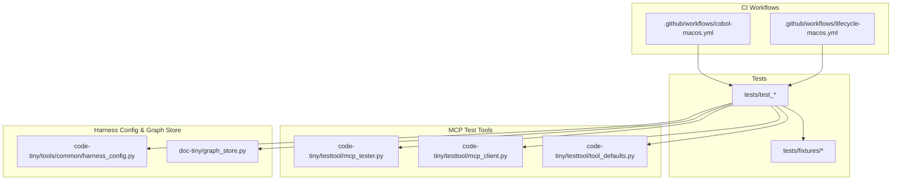
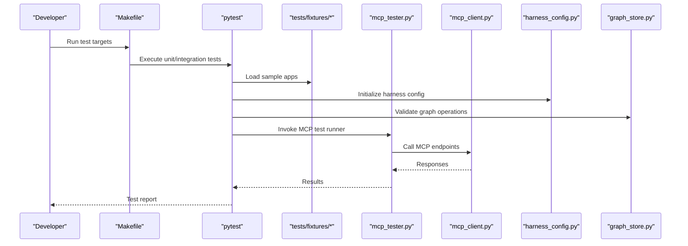
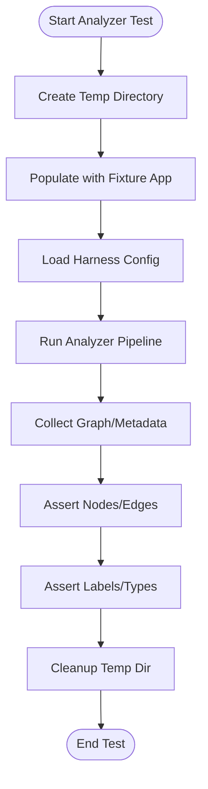
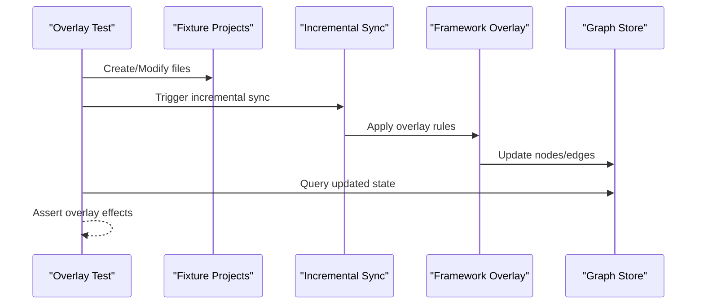
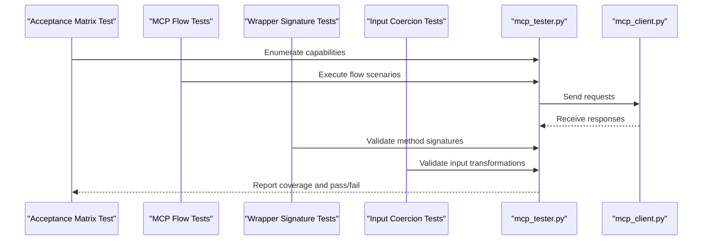
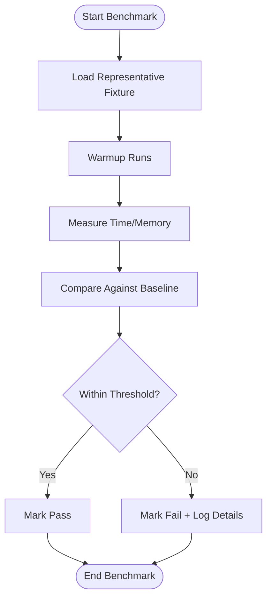
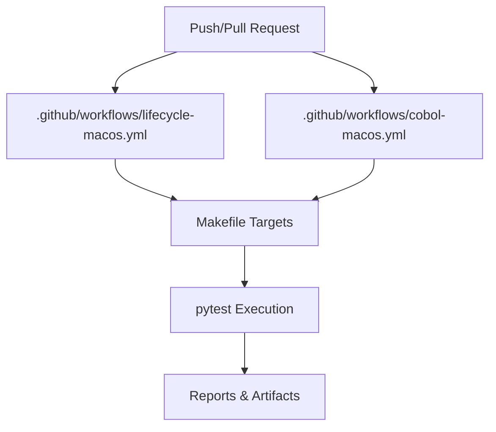
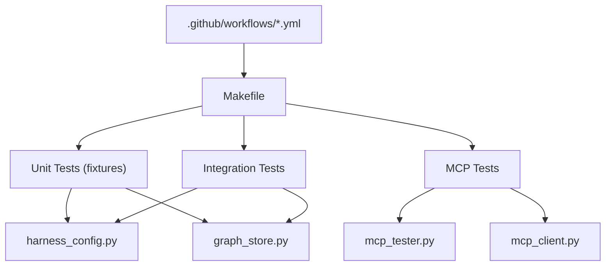

# Extension Testing Strategies

<cite>
**Referenced Files in This Document**
- [test_aspnet_fixture_analysis.py](file://tests/test_aspnet_fixture_analysis.py)
- [test_cobol_fixture_analysis.py](file://tests/test_cobol_fixture_analysis.py)
- [test_framework_fixture_analysis.py](file://tests/test_framework_fixture_analysis.py)
- [test_incremental_sync_framework_overlays.py](file://tests/test_incremental_sync_framework_overlays.py)
- [test_web_framework_overlay.py](file://tests/test_web_framework_overlay.py)
- [test_mcp_acceptance_matrix.py](file://tests/test_mcp_acceptance_matrix.py)
- [test_framework_mcp_flows.py](file://tests/test_framework_mcp_flows.py)
- [test_unified_mcp_wrapper_signatures.py](file://tests/test_unified_mcp_wrapper_signatures.py)
- [test_unified_mcp_input_coercion.py](file://tests/test_unified_mcp_input_coercion.py)
- [test_cobol_performance.py](file://tests/test_cobol_performance.py)
- [test_primary_vector_sync.py](file://tests/test_primary_vector_sync.py)
- [test_falkordb_driver.py](file://tests/test_falkordb_driver.py)
- [test_graphrag_ingest_langextract.py](file://tests/test_graphrag_ingest_langextract.py)
- [Makefile](file://Makefile)
- [.github/workflows/lifecycle-macos.yml](file://.github/workflows/lifecycle-macos.yml)
- [.github/workflows/cobol-macos.yml](file://.github/workflows/cobol-macos.yml)
- [mcp_tester.py](file://code-tiny/testtool/mcp_tester.py)
- [mcp_client.py](file://code-tiny/testtool/mcp_client.py)
- [tool_defaults.py](file://code-tiny/testtool/tool_defaults.py)
- [harness_config.py](file://code-tiny/tools/common/harness_config.py)
- [graph_store.py](file://doc-tiny/graph_store.py)
</cite>

## Table of Contents
1. [Introduction](#introduction)
2. [Project Structure](#project-structure)
3. [Core Components](#core-components)
4. [Architecture Overview](#architecture-overview)
5. [Detailed Component Analysis](#detailed-component-analysis)
6. [Dependency Analysis](#dependency-analysis)
7. [Performance Considerations](#performance-considerations)
8. [Troubleshooting Guide](#troubleshooting-guide)
9. [Conclusion](#conclusion)
10. [Appendices](#appendices)

## Introduction
This document provides a comprehensive testing and validation strategy for Cortex Harness extensions, focusing on analyzers, framework overlays, and MCP capabilities. It covers unit testing patterns with fixtures and mocks, integration testing approaches, performance benchmarking, regression testing, continuous integration setup, test data management, assertion libraries, debugging techniques, and templates for common scenarios and automated pipelines. The guidance is grounded in the repository’s existing tests and tooling to ensure practical applicability.

## Project Structure
The repository organizes extension-related tests under tests/, with fixture applications under tests/fixtures/. MCP-related utilities are located under code-tiny/testtool/. CI workflows are defined under .github/workflows/. Harness configuration and graph store utilities are used across tests and examples.

**Diagram sources**
- [test_aspnet_fixture_analysis.py](file://tests/test_aspnet_fixture_analysis.py)
- [test_cobol_fixture_analysis.py](file://tests/test_cobol_fixture_analysis.py)
- [test_framework_fixture_analysis.py](file://tests/test_framework_fixture_analysis.py)
- [test_incremental_sync_framework_overlays.py](file://tests/test_incremental_sync_framework_overlays.py)
- [test_web_framework_overlay.py](file://tests/test_web_framework_overlay.py)
- [test_mcp_acceptance_matrix.py](file://tests/test_mcp_acceptance_matrix.py)
- [test_framework_mcp_flows.py](file://tests/test_framework_mcp_flows.py)
- [test_unified_mcp_wrapper_signatures.py](file://tests/test_unified_mcp_wrapper_signatures.py)
- [test_unified_mcp_input_coercion.py](file://tests/test_unified_mcp_input_coercion.py)
- [test_cobol_performance.py](file://tests/test_cobol_performance.py)
- [test_primary_vector_sync.py](file://tests/test_primary_vector_sync.py)
- [test_falkordb_driver.py](file://tests/test_falkordb_driver.py)
- [test_graphrag_ingest_langextract.py](file://tests/test_graphrag_ingest_langextract.py)
- [Makefile](file://Makefile)
- [.github/workflows/lifecycle-macos.yml](file://.github/workflows/lifecycle-macos.yml)
- [.github/workflows/cobol-macos.yml](file://.github/workflows/cobol-macos.yml)
- [mcp_tester.py](file://code-tiny/testtool/mcp_tester.py)
- [mcp_client.py](file://code-tiny/testtool/mcp_client.py)
- [tool_defaults.py](file://code-tiny/testtool/tool_defaults.py)
- [harness_config.py](file://code-tiny/tools/common/harness_config.py)
- [graph_store.py](file://doc-tiny/graph_store.py)

**Section sources**
- [test_aspnet_fixture_analysis.py](file://tests/test_aspnet_fixture_analysis.py)
- [test_cobol_fixture_analysis.py](file://tests/test_cobol_fixture_analysis.py)
- [test_framework_fixture_analysis.py](file://tests/test_framework_fixture_analysis.py)
- [test_incremental_sync_framework_overlays.py](file://tests/test_incremental_sync_framework_overlays.py)
- [test_web_framework_overlay.py](file://tests/test_web_framework_overlay.py)
- [test_mcp_acceptance_matrix.py](file://tests/test_mcp_acceptance_matrix.py)
- [test_framework_mcp_flows.py](file://tests/test_framework_mcp_flows.py)
- [test_unified_mcp_wrapper_signatures.py](file://tests/test_unified_mcp_wrapper_signatures.py)
- [test_unified_mcp_input_coercion.py](file://tests/test_unified_mcp_input_coercion.py)
- [test_cobol_performance.py](file://tests/test_cobol_performance.py)
- [test_primary_vector_sync.py](file://tests/test_primary_vector_sync.py)
- [test_falkordb_driver.py](file://tests/test_falkordb_driver.py)
- [test_graphrag_ingest_langextract.py](file://tests/test_graphrag_ingest_langextract.py)
- [Makefile](file://Makefile)
- [.github/workflows/lifecycle-macos.yml](file://.github/workflows/lifecycle-macos.yml)
- [.github/workflows/cobol-macos.yml](file://.github/workflows/cobol-macos.yml)
- [mcp_tester.py](file://code-tiny/testtool/mcp_tester.py)
- [mcp_client.py](file://code-tiny/testtool/mcp_client.py)
- [tool_defaults.py](file://code-tiny/testtool/tool_defaults.py)
- [harness_config.py](file://code-tiny/tools/common/harness_config.py)
- [graph_store.py](file://doc-tiny/graph_store.py)

## Core Components
- Fixture-based analyzer tests: Tests under tests/ use sample application fixtures (e.g., ASP.NET, Cobol, Web Framework) to validate analyzer outputs and graph contracts. These tests typically set up temporary directories, run analyzers against fixtures, and assert expected nodes/edges or metadata.
- Framework overlay tests: Tests verify incremental sync behavior and overlay logic for web frameworks, ensuring correct detection and processing of framework-specific artifacts.
- MCP capability tests: Tests validate MCP routing, acceptance matrix coverage, wrapper signatures, input coercion, and end-to-end flows using MCP client and tester utilities.
- Performance and regression tests: Dedicated tests measure performance characteristics and guard regressions by asserting thresholds or stable behaviors over time.
- Integration utilities: Harness configuration and graph store modules are leveraged to bootstrap environments and validate persistence layers.

**Section sources**
- [test_aspnet_fixture_analysis.py](file://tests/test_aspnet_fixture_analysis.py)
- [test_cobol_fixture_analysis.py](file://tests/test_cobol_fixture_analysis.py)
- [test_framework_fixture_analysis.py](file://tests/test_framework_fixture_analysis.py)
- [test_incremental_sync_framework_overlays.py](file://tests/test_incremental_sync_framework_overlays.py)
- [test_web_framework_overlay.py](file://tests/test_web_framework_overlay.py)
- [test_mcp_acceptance_matrix.py](file://tests/test_mcp_acceptance_matrix.py)
- [test_framework_mcp_flows.py](file://tests/test_framework_mcp_flows.py)
- [test_unified_mcp_wrapper_signatures.py](file://tests/test_unified_mcp_wrapper_signatures.py)
- [test_unified_mcp_input_coercion.py](file://tests/test_unified_mcp_input_coercion.py)
- [test_cobol_performance.py](file://tests/test_cobol_performance.py)
- [test_primary_vector_sync.py](file://tests/test_primary_vector_sync.py)
- [test_falkordb_driver.py](file://tests/test_falkordb_driver.py)
- [test_graphrag_ingest_langextract.py](file://tests/test_graphrag_ingest_langextract.py)
- [harness_config.py](file://code-tiny/tools/common/harness_config.py)
- [graph_store.py](file://doc-tiny/graph_store.py)

## Architecture Overview
The testing architecture spans unit tests, integration tests, and MCP validation tools, orchestrated via Make targets and GitHub Actions workflows.

**Diagram sources**
- [Makefile](file://Makefile)
- [test_aspnet_fixture_analysis.py](file://tests/test_aspnet_fixture_analysis.py)
- [test_cobol_fixture_analysis.py](file://tests/test_cobol_fixture_analysis.py)
- [test_framework_fixture_analysis.py](file://tests/test_framework_fixture_analysis.py)
- [test_incremental_sync_framework_overlays.py](file://tests/test_incremental_sync_framework_overlays.py)
- [test_web_framework_overlay.py](file://tests/test_web_framework_overlay.py)
- [test_mcp_acceptance_matrix.py](file://tests/test_mcp_acceptance_matrix.py)
- [test_framework_mcp_flows.py](file://tests/test_framework_mcp_flows.py)
- [test_unified_mcp_wrapper_signatures.py](file://tests/test_unified_mcp_wrapper_signatures.py)
- [test_unified_mcp_input_coercion.py](file://tests/test_unified_mcp_input_coercion.py)
- [mcp_tester.py](file://code-tiny/testtool/mcp_tester.py)
- [mcp_client.py](file://code-tiny/testtool/mcp_client.py)
- [harness_config.py](file://code-tiny/tools/common/harness_config.py)
- [graph_store.py](file://doc-tiny/graph_store.py)

## Detailed Component Analysis

### Unit Testing Patterns for Analyzers (Fixture-Based)
- Pattern overview: Tests create temporary directories, populate them with fixture applications, configure harness settings, execute analyzers, and assert results against expected graph structures or metadata.
- Key practices:
  - Use isolated temp directories per test to avoid cross-test contamination.
  - Centralize fixture paths under tests/fixtures/ for consistency.
  - Assert both structural properties (nodes/edges) and semantic properties (labels/types).
  - Leverage harness configuration to control analyzer behavior deterministically.

**Diagram sources**
- [test_aspnet_fixture_analysis.py](file://tests/test_aspnet_fixture_analysis.py)
- [test_cobol_fixture_analysis.py](file://tests/test_cobol_fixture_analysis.py)
- [test_framework_fixture_analysis.py](file://tests/test_framework_fixture_analysis.py)
- [harness_config.py](file://code-tiny/tools/common/harness_config.py)

**Section sources**
- [test_aspnet_fixture_analysis.py](file://tests/test_aspnet_fixture_analysis.py)
- [test_cobol_fixture_analysis.py](file://tests/test_cobol_fixture_analysis.py)
- [test_framework_fixture_analysis.py](file://tests/test_framework_fixture_analysis.py)
- [harness_config.py](file://code-tiny/tools/common/harness_config.py)

### Mock Objects and Isolation Techniques
- Strategy: Replace external dependencies (e.g., network calls, database drivers) with mock objects to isolate analyzer logic.
- Examples:
  - Mock MCP client responses when validating MCP wrappers and input coercion.
  - Mock graph store operations to assert persistence behavior without real databases.
- Benefits: Faster execution, deterministic outcomes, and robustness against environment variability.

**Section sources**
- [test_unified_mcp_wrapper_signatures.py](file://tests/test_unified_mcp_wrapper_signatures.py)
- [test_unified_mcp_input_coercion.py](file://tests/test_unified_mcp_input_coercion.py)
- [test_falkordb_driver.py](file://tests/test_falkordb_driver.py)

### Integration Testing for Framework Overlays
- Focus areas:
  - Incremental synchronization correctness for web framework overlays.
  - Overlay detection and merging behavior across multiple framework types.
- Approach:
  - Prepare fixture projects representing different frameworks.
  - Simulate changes and verify overlay updates reflect expected state transitions.
  - Assert that overlay rules do not interfere with core analysis.

**Diagram sources**
- [test_incremental_sync_framework_overlays.py](file://tests/test_incremental_sync_framework_overlays.py)
- [test_web_framework_overlay.py](file://tests/test_web_framework_overlay.py)

**Section sources**
- [test_incremental_sync_framework_overlays.py](file://tests/test_incremental_sync_framework_overlays.py)
- [test_web_framework_overlay.py](file://tests/test_web_framework_overlay.py)

### MCP Capabilities Validation
- Acceptance matrix tests: Ensure all documented MCP capabilities are covered by tests.
- Flow tests: Validate end-to-end MCP interactions using MCP tester and client utilities.
- Signature and coercion tests: Confirm wrapper signatures match expectations and inputs are coerced correctly.

**Diagram sources**
- [test_mcp_acceptance_matrix.py](file://tests/test_mcp_acceptance_matrix.py)
- [test_framework_mcp_flows.py](file://tests/test_framework_mcp_flows.py)
- [test_unified_mcp_wrapper_signatures.py](file://tests/test_unified_mcp_wrapper_signatures.py)
- [test_unified_mcp_input_coercion.py](file://tests/test_unified_mcp_input_coercion.py)
- [mcp_tester.py](file://code-tiny/testtool/mcp_tester.py)
- [mcp_client.py](file://code-tiny/testtool/mcp_client.py)

**Section sources**
- [test_mcp_acceptance_matrix.py](file://tests/test_mcp_acceptance_matrix.py)
- [test_framework_mcp_flows.py](file://tests/test_framework_mcp_flows.py)
- [test_unified_mcp_wrapper_signatures.py](file://tests/test_unified_mcp_wrapper_signatures.py)
- [test_unified_mcp_input_coercion.py](file://tests/test_unified_mcp_input_coercion.py)
- [mcp_tester.py](file://code-tiny/testtool/mcp_tester.py)
- [mcp_client.py](file://code-tiny/testtool/mcp_client.py)

### Performance Benchmarking and Regression Testing
- Benchmarking: Measure analyzer runtime and memory usage on representative fixtures; assert thresholds to prevent regressions.
- Regression tests: Re-run critical scenarios after changes to ensure stability; compare outputs against baselines.
- Vector and graph persistence: Validate primary vector sync and FalkorDB driver behavior under load.

**Diagram sources**
- [test_cobol_performance.py](file://tests/test_cobol_performance.py)
- [test_primary_vector_sync.py](file://tests/test_primary_vector_sync.py)
- [test_falkordb_driver.py](file://tests/test_falkordb_driver.py)

**Section sources**
- [test_cobol_performance.py](file://tests/test_cobol_performance.py)
- [test_primary_vector_sync.py](file://tests/test_primary_vector_sync.py)
- [test_falkordb_driver.py](file://tests/test_falkordb_driver.py)

### Continuous Integration Setup
- Makefile targets: Provide standardized commands to run subsets of tests (unit, integration, MCP, performance).
- GitHub Actions workflows: Define macOS-based jobs for lifecycle and Cobol-specific validations; trigger on pushes and pull requests.
- Artifacts and reports: Capture test logs and results for post-mortem analysis.

**Diagram sources**
- [.github/workflows/lifecycle-macos.yml](file://.github/workflows/lifecycle-macos.yml)
- [.github/workflows/cobol-macos.yml](file://.github/workflows/cobol-macos.yml)
- [Makefile](file://Makefile)

**Section sources**
- [.github/workflows/lifecycle-macos.yml](file://.github/workflows/lifecycle-macos.yml)
- [.github/workflows/cobol-macos.yml](file://.github/workflows/cobol-macos.yml)
- [Makefile](file://Makefile)

## Dependency Analysis
Testing components depend on harness configuration, graph store utilities, and MCP test tools. CI workflows orchestrate test execution based on Make targets.

**Diagram sources**
- [test_aspnet_fixture_analysis.py](file://tests/test_aspnet_fixture_analysis.py)
- [test_cobol_fixture_analysis.py](file://tests/test_cobol_fixture_analysis.py)
- [test_framework_fixture_analysis.py](file://tests/test_framework_fixture_analysis.py)
- [test_mcp_acceptance_matrix.py](file://tests/test_mcp_acceptance_matrix.py)
- [test_framework_mcp_flows.py](file://tests/test_framework_mcp_flows.py)
- [test_unified_mcp_wrapper_signatures.py](file://tests/test_unified_mcp_wrapper_signatures.py)
- [test_unified_mcp_input_coercion.py](file://tests/test_unified_mcp_input_coercion.py)
- [harness_config.py](file://code-tiny/tools/common/harness_config.py)
- [graph_store.py](file://doc-tiny/graph_store.py)
- [mcp_tester.py](file://code-tiny/testtool/mcp_tester.py)
- [mcp_client.py](file://code-tiny/testtool/mcp_client.py)
- [.github/workflows/lifecycle-macos.yml](file://.github/workflows/lifecycle-macos.yml)
- [.github/workflows/cobol-macos.yml](file://.github/workflows/cobol-macos.yml)
- [Makefile](file://Makefile)

**Section sources**
- [test_aspnet_fixture_analysis.py](file://tests/test_aspnet_fixture_analysis.py)
- [test_cobol_fixture_analysis.py](file://tests/test_cobol_fixture_analysis.py)
- [test_framework_fixture_analysis.py](file://tests/test_framework_fixture_analysis.py)
- [test_mcp_acceptance_matrix.py](file://tests/test_mcp_acceptance_matrix.py)
- [test_framework_mcp_flows.py](file://tests/test_framework_mcp_flows.py)
- [test_unified_mcp_wrapper_signatures.py](file://tests/test_unified_mcp_wrapper_signatures.py)
- [test_unified_mcp_input_coercion.py](file://tests/test_unified_mcp_input_coercion.py)
- [harness_config.py](file://code-tiny/tools/common/harness_config.py)
- [graph_store.py](file://doc-tiny/graph_store.py)
- [mcp_tester.py](file://code-tiny/testtool/mcp_tester.py)
- [mcp_client.py](file://code-tiny/testtool/mcp_client.py)
- [.github/workflows/lifecycle-macos.yml](file://.github/workflows/lifecycle-macos.yml)
- [.github/workflows/cobol-macos.yml](file://.github/workflows/cobol-macos.yml)
- [Makefile](file://Makefile)

## Performance Considerations
- Use lightweight fixtures for fast unit tests; reserve heavier fixtures for integration and performance tests.
- Parallelize independent tests where possible to reduce CI duration.
- Cache external dependencies (e.g., model downloads) to speed up repeated runs.
- Monitor resource usage and set sensible thresholds to catch regressions early.

[No sources needed since this section provides general guidance]

## Troubleshooting Guide
- Common issues:
  - Fixture path resolution failures: Ensure fixtures exist under tests/fixtures/ and paths are relative to the test root.
  - MCP endpoint connectivity: Verify MCP server availability and credentials; use mcp_client.py for diagnostics.
  - Graph store inconsistencies: Validate schema and indexes; use graph_store.py helpers to inspect state.
- Debugging techniques:
  - Enable verbose logging in harness configuration.
  - Dump intermediate graphs and MCP payloads for inspection.
  - Isolate failing tests with focused pytest markers.

**Section sources**
- [mcp_client.py](file://code-tiny/testtool/mcp_client.py)
- [graph_store.py](file://doc-tiny/graph_store.py)
- [harness_config.py](file://code-tiny/tools/common/harness_config.py)

## Conclusion
By adopting fixture-based unit tests, robust integration tests for overlays and MCP capabilities, performance benchmarking, and CI-driven validation, teams can maintain high confidence in Cortex Harness extensions. The provided patterns and diagrams serve as actionable templates to standardize testing across analyzers and frameworks.

[No sources needed since this section summarizes without analyzing specific files]

## Appendices

### Templates for Common Test Scenarios
- Analyzer fixture test template:
  - Steps: Create temp dir, populate fixture, configure harness, run analyzer, assert structure and semantics, cleanup.
  - Reference: [test_aspnet_fixture_analysis.py](file://tests/test_aspnet_fixture_analysis.py), [test_cobol_fixture_analysis.py](file://tests/test_cobol_fixture_analysis.py), [test_framework_fixture_analysis.py](file://tests/test_framework_fixture_analysis.py)
- MCP flow test template:
  - Steps: Initialize MCP tester, send request via client, assert response shape and content, handle errors.
  - Reference: [test_framework_mcp_flows.py](file://tests/test_framework_mcp_flows.py), [mcp_tester.py](file://code-tiny/testtool/mcp_tester.py), [mcp_client.py](file://code-tiny/testtool/mcp_client.py)
- Overlay integration test template:
  - Steps: Modify fixture files, trigger incremental sync, apply overlay rules, query graph store, assert changes.
  - Reference: [test_incremental_sync_framework_overlays.py](file://tests/test_incremental_sync_framework_overlays.py), [test_web_framework_overlay.py](file://tests/test_web_framework_overlay.py)
- Performance benchmark template:
  - Steps: Load fixture, warmup, measure time/memory, compare baseline, log details on failure.
  - Reference: [test_cobol_performance.py](file://tests/test_cobol_performance.py)

### Automated Validation Pipelines
- Makefile targets:
  - Use standardized targets to run subsets of tests (unit, integration, MCP, performance).
  - Reference: [Makefile](file://Makefile)
- GitHub Actions:
  - macOS-based jobs for lifecycle and Cobol validations; trigger on push/PR.
  - Reference: [.github/workflows/lifecycle-macos.yml](file://.github/workflows/lifecycle-macos.yml), [.github/workflows/cobol-macos.yml](file://.github/workflows/cobol-macos.yml)

**Section sources**
- [test_aspnet_fixture_analysis.py](file://tests/test_aspnet_fixture_analysis.py)
- [test_cobol_fixture_analysis.py](file://tests/test_cobol_fixture_analysis.py)
- [test_framework_fixture_analysis.py](file://tests/test_framework_fixture_analysis.py)
- [test_framework_mcp_flows.py](file://tests/test_framework_mcp_flows.py)
- [mcp_tester.py](file://code-tiny/testtool/mcp_tester.py)
- [mcp_client.py](file://code-tiny/testtool/mcp_client.py)
- [test_incremental_sync_framework_overlays.py](file://tests/test_incremental_sync_framework_overlays.py)
- [test_web_framework_overlay.py](file://tests/test_web_framework_overlay.py)
- [test_cobol_performance.py](file://tests/test_cobol_performance.py)
- [Makefile](file://Makefile)
- [.github/workflows/lifecycle-macos.yml](file://.github/workflows/lifecycle-macos.yml)
- [.github/workflows/cobol-macos.yml](file://.github/workflows/cobol-macos.yml)