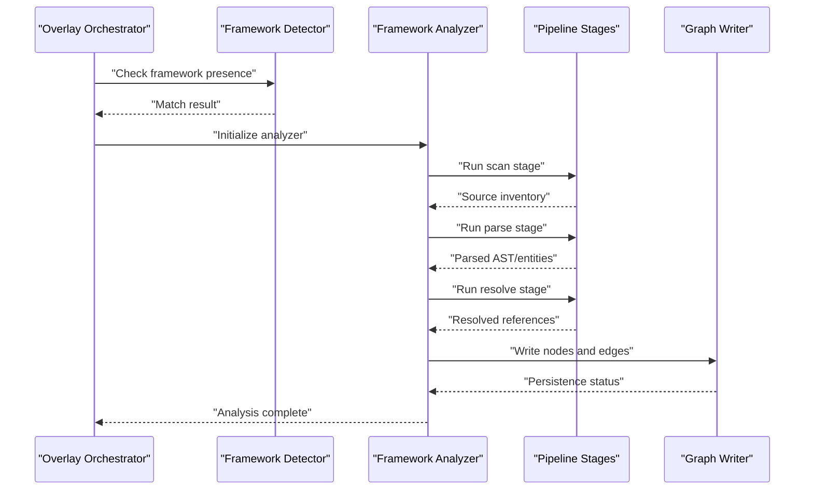
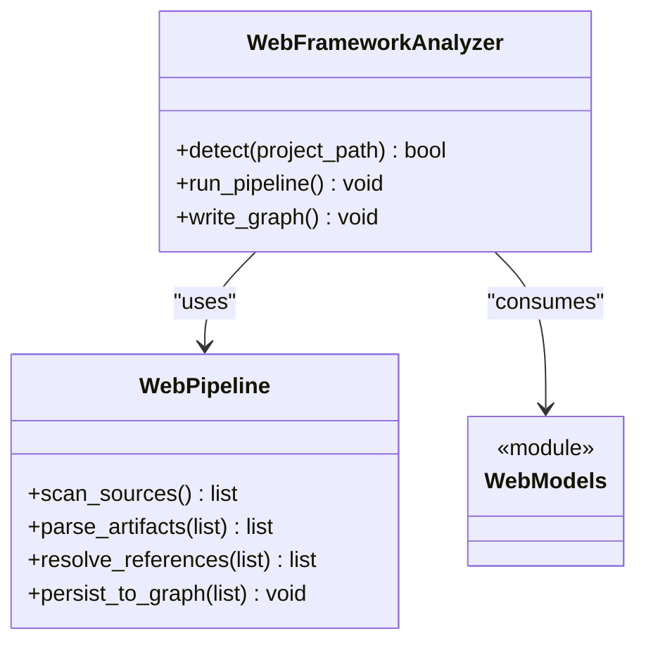
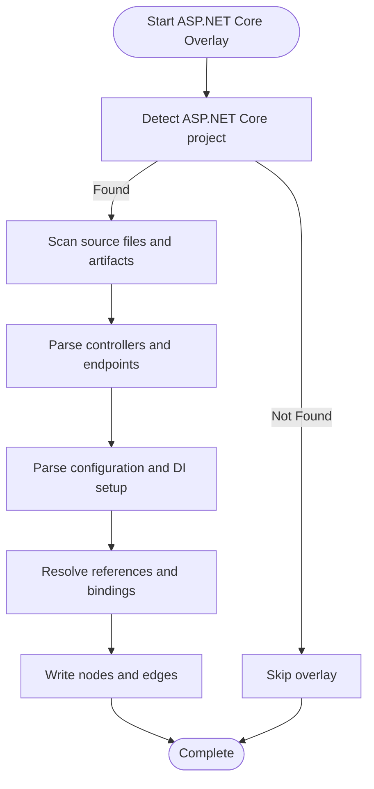
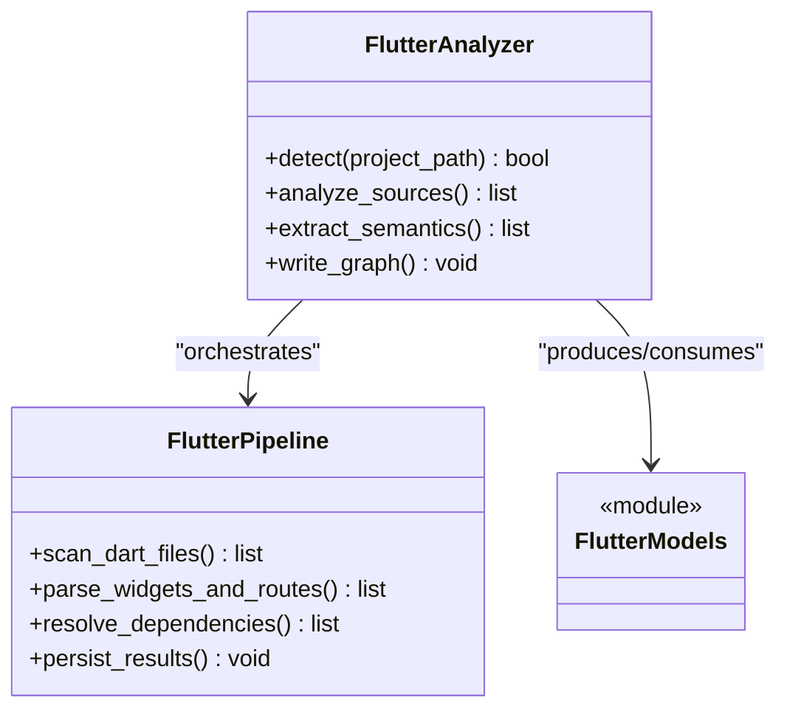
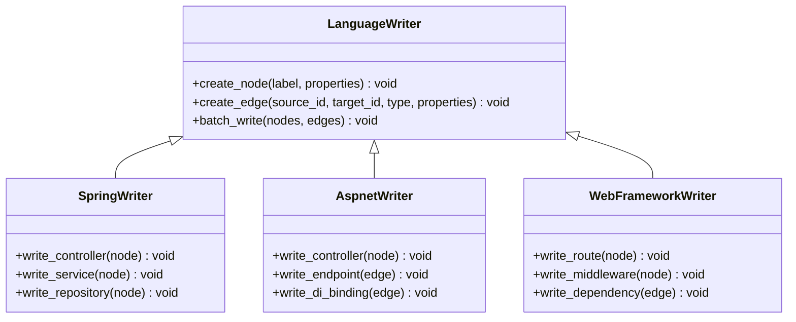
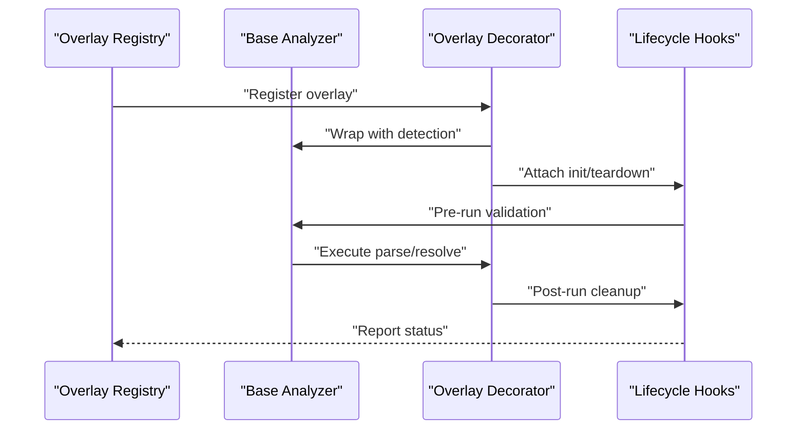
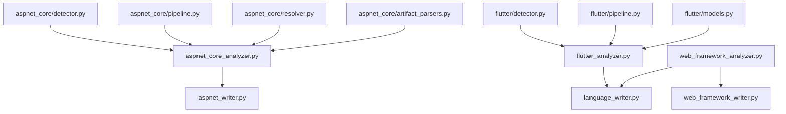

# Framework Overlay Development

<cite>
**Referenced Files in This Document**
- [web_framework_analyzer.py](file://code-tiny/tools/graph/web_framework/web_framework_analyzer.py)
- [pipeline.py](file://code-tiny/tools/graph/web_framework/pipeline.py)
- [models.py](file://code-tiny/tools/graph/web_framework/models.py)
- [__init__.py](file://code-tiny/tools/graph/writer/__init__.py)
- [language_writer.py](file://code-tiny/tools/graph/writer/language_writer.py)
- [spring_writer.py](file://code-tiny/tools/graph/writer/spring_writer.py)
- [aspnet_writer.py](file://code-tiny/tools/graph/writer/aspnet_writer.py)
- [web_framework_writer.py](file://code-tiny/tools/graph/writer/web_framework_writer.py)
- [detector.py](file://code-tiny/tools/flutter/detector.py)
- [flutter_analyzer.py](file://code-tiny/tools/flutter/flutter_analyzer.py)
- [pipeline.py](file://code-tiny/tools/flutter/pipeline.py)
- [models.py](file://code-tiny/tools/flutter/models.py)
- [aspnet_core_analyzer.py](file://code-tiny/tools/aspnet_core/aspnet_core_analyzer.py)
- [detector.py](file://code-tiny/tools/aspnet_core/detector.py)
- [pipeline.py](file://code-tiny/tools/aspnet_core/pipeline.py)
- [resolver.py](file://code-tiny/tools/aspnet_core/resolver.py)
- [artifact_parsers.py](file://code-tiny/tools/aspnet_core/artifact_parsers.py)
- [test_web_framework_overlay.py](file://tests/test_web_framework_overlay.py)
- [test_flutter_project_detection.py](file://tests/test_flutter_project_detection.py)
- [test_aspnet_fixture_analysis.py](file://tests/test_aspnet_fixture_analysis.py)
- [test_incremental_sync_framework_overlays.py](file://tests/test_incremental_sync_framework_overlays.py)
</cite>

## Table of Contents
1. [Introduction](#introduction)
2. [Project Structure](#project-structure)
3. [Core Components](#core-components)
4. [Architecture Overview](#architecture-overview)
5. [Detailed Component Analysis](#detailed-component-analysis)
6. [Dependency Analysis](#dependency-analysis)
7. [Performance Considerations](#performance-considerations)
8. [Troubleshooting Guide](#troubleshooting-guide)
9. [Conclusion](#conclusion)
10. [Appendices](#appendices)

## Introduction
This document explains how to develop framework overlays that extend existing language analyzers with specialized parsing logic. It focuses on the decorator pattern used for overlay registration and lifecycle management, framework detection mechanisms, annotation processing, metadata extraction strategies, configuration schema definition, dependency resolution, and integration with the graph writer system. Practical examples are provided for Spring Boot, ASP.NET Core, and Flutter. Testing approaches and performance considerations for large codebases are also covered.

## Project Structure
The repository organizes framework-specific analyzers under tools/<framework>, each typically providing:
- A detector to identify framework presence
- An analyzer orchestrating parsing and analysis
- A pipeline defining stages (scan, parse, resolve, write)
- Models representing extracted entities
- Optional resolvers and artifact parsers for framework-specific files

A shared web framework foundation exists under tools/graph/web_framework, which provides common contracts and utilities for web-oriented overlays. Graph writers live under tools/graph/writer and implement persistence into the target graph store.

```mermaid
graph TB
subgraph "Web Framework Foundation"
WFA["web_framework_analyzer.py"]
WFPI["web_framework/pipeline.py"]
WFMD["web_framework/models.py"]
end
subgraph "ASP.NET Core Overlay"
ANCA["aspnet_core_analyzer.py"]
ANDT["aspnet_core/detector.py"]
ANPL["aspnet_core/pipeline.py"]
ANRS["aspnet_core/resolver.py"]
ANAP["aspnet_core/artifact_parsers.py"]
end
subgraph "Flutter Overlay"
FLDA["flutter_analyzer.py"]
FLDT["flutter/detector.py"]
FLPL["flutter/pipeline.py"]
FLMD["flutter/models.py"]
end
subgraph "Graph Writers"
LWR["writer/language_writer.py"]
SPRW["writer/spring_writer.py"]
ASPNW["writer/aspnet_writer.py"]
WFW["writer/web_framework_writer.py"]
WRINI["writer/__init__.py"]
end
WFA --> WFPI
WFA --> WFMD
ANCA --> ANDT
ANCA --> ANPL
ANCA --> ANRS
ANCA --> ANAP
FLDA --> FLDT
FLDA --> FLPL
FLDA --> FLMD
ANCA --> LWR
ANCA --> ASPNW
FLDA --> LWR
WFA --> WFW
WRINI --> LWR
WRINI --> SPRW
WRINI --> ASPNW
WRINI --> WFW
```

**Diagram sources**
- [web_framework_analyzer.py](file://code-tiny/tools/graph/web_framework/web_framework_analyzer.py)
- [pipeline.py](file://code-tiny/tools/graph/web_framework/pipeline.py)
- [models.py](file://code-tiny/tools/graph/web_framework/models.py)
- [aspnet_core_analyzer.py](file://code-tiny/tools/aspnet_core/aspnet_core_analyzer.py)
- [detector.py](file://code-tiny/tools/aspnet_core/detector.py)
- [pipeline.py](file://code-tiny/tools/aspnet_core/pipeline.py)
- [resolver.py](file://code-tiny/tools/aspnet_core/resolver.py)
- [artifact_parsers.py](file://code-tiny/tools/aspnet_core/artifact_parsers.py)
- [flutter_analyzer.py](file://code-tiny/tools/flutter/flutter_analyzer.py)
- [detector.py](file://code-tiny/tools/flutter/detector.py)
- [pipeline.py](file://code-tiny/tools/flutter/pipeline.py)
- [models.py](file://code-tiny/tools/flutter/models.py)
- [language_writer.py](file://code-tiny/tools/graph/writer/language_writer.py)
- [spring_writer.py](file://code-tiny/tools/graph/writer/spring_writer.py)
- [aspnet_writer.py](file://code-tiny/tools/graph/writer/aspnet_writer.py)
- [web_framework_writer.py](file://code-tiny/tools/graph/writer/web_framework_writer.py)
- [__init__.py](file://code-tiny/tools/graph/writer/__init__.py)

**Section sources**
- [web_framework_analyzer.py](file://code-tiny/tools/graph/web_framework/web_framework_analyzer.py)
- [pipeline.py](file://code-tiny/tools/graph/web_framework/pipeline.py)
- [models.py](file://code-tiny/tools/graph/web_framework/models.py)
- [aspnet_core_analyzer.py](file://code-tiny/tools/aspnet_core/aspnet_core_analyzer.py)
- [detector.py](file://code-tiny/tools/aspnet_core/detector.py)
- [pipeline.py](file://code-tiny/tools/aspnet_core/pipeline.py)
- [resolver.py](file://code-tiny/tools/aspnet_core/resolver.py)
- [artifact_parsers.py](file://code-tiny/tools/aspnet_core/artifact_parsers.py)
- [flutter_analyzer.py](file://code-tiny/tools/flutter/flutter_analyzer.py)
- [detector.py](file://code-tiny/tools/flutter/detector.py)
- [pipeline.py](file://code-tiny/tools/flutter/pipeline.py)
- [models.py](file://code-tiny/tools/flutter/models.py)
- [language_writer.py](file://code-tiny/tools/graph/writer/language_writer.py)
- [spring_writer.py](file://code-tiny/tools/graph/writer/spring_writer.py)
- [aspnet_writer.py](file://code-tiny/tools/graph/writer/aspnet_writer.py)
- [web_framework_writer.py](file://code-tiny/tools/graph/writer/web_framework_writer.py)
- [__init__.py](file://code-tiny/tools/graph/writer/__init__.py)

## Core Components
- Web framework foundation: Provides a base analyzer and shared models/pipeline for web-oriented overlays.
- Framework overlays: Implement detection, parsing, and writing specific to frameworks like ASP.NET Core and Flutter.
- Graph writers: Persist extracted entities and relationships into the graph store.

Key responsibilities:
- Detection: Identify framework presence via project artifacts or configuration files.
- Parsing: Extract annotations, routes, controllers, services, and other semantic elements.
- Resolution: Resolve dependencies and references across modules.
- Writing: Convert extracted data into graph nodes and edges using writer components.

**Section sources**
- [web_framework_analyzer.py](file://code-tiny/tools/graph/web_framework/web_framework_analyzer.py)
- [pipeline.py](file://code-tiny/tools/graph/web_framework/pipeline.py)
- [models.py](file://code-tiny/tools/graph/web_framework/models.py)
- [language_writer.py](file://code-tiny/tools/graph/writer/language_writer.py)
- [web_framework_writer.py](file://code-tiny/tools/graph/writer/web_framework_writer.py)

## Architecture Overview
The overlay architecture follows a layered approach:
- Detector layer determines if an overlay applies to a given codebase.
- Analyzer layer orchestrates scanning, parsing, and resolution.
- Pipeline layer defines ordered stages for incremental processing.
- Writer layer persists results to the graph store.

**Diagram sources**
- [web_framework_analyzer.py](file://code-tiny/tools/graph/web_framework/web_framework_analyzer.py)
- [pipeline.py](file://code-tiny/tools/graph/web_framework/pipeline.py)
- [aspnet_core_analyzer.py](file://code-tiny/tools/aspnet_core/aspnet_core_analyzer.py)
- [pipeline.py](file://code-tiny/tools/aspnet_core/pipeline.py)
- [flutter_analyzer.py](file://code-tiny/tools/flutter/flutter_analyzer.py)
- [pipeline.py](file://code-tiny/tools/flutter/pipeline.py)
- [language_writer.py](file://code-tiny/tools/graph/writer/language_writer.py)

## Detailed Component Analysis

### Web Framework Foundation
The web framework foundation provides a reusable base for overlays targeting web applications. It includes:
- Base analyzer class with common hooks for detection, scanning, parsing, and writing.
- Shared models for web-centric entities such as endpoints, controllers, and middleware.
- Pipeline scaffolding that standardizes stage execution and error handling.

**Diagram sources**
- [web_framework_analyzer.py](file://code-tiny/tools/graph/web_framework/web_framework_analyzer.py)
- [pipeline.py](file://code-tiny/tools/graph/web_framework/pipeline.py)
- [models.py](file://code-tiny/tools/graph/web_framework/models.py)

**Section sources**
- [web_framework_analyzer.py](file://code-tiny/tools/graph/web_framework/web_framework_analyzer.py)
- [pipeline.py](file://code-tiny/tools/graph/web_framework/pipeline.py)
- [models.py](file://code-tiny/tools/graph/web_framework/models.py)

### ASP.NET Core Overlay
The ASP.NET Core overlay extends the foundation to analyze .NET projects:
- Detector inspects project files and configuration to confirm ASP.NET Core presence.
- Analyzer coordinates parsing of controllers, endpoints, DI registrations, and related artifacts.
- Resolver resolves cross-file references and dependency injection wiring.
- Artifact parsers handle csproj, Program.cs, Controllers, and appsettings.

**Diagram sources**
- [detector.py](file://code-tiny/tools/aspnet_core/detector.py)
- [aspnet_core_analyzer.py](file://code-tiny/tools/aspnet_core/aspnet_core_analyzer.py)
- [pipeline.py](file://code-tiny/tools/aspnet_core/pipeline.py)
- [resolver.py](file://code-tiny/tools/aspnet_core/resolver.py)
- [artifact_parsers.py](file://code-tiny/tools/aspnet_core/artifact_parsers.py)

**Section sources**
- [aspnet_core_analyzer.py](file://code-tiny/tools/aspnet_core/aspnet_core_analyzer.py)
- [detector.py](file://code-tiny/tools/aspnet_core/detector.py)
- [pipeline.py](file://code-tiny/tools/aspnet_core/pipeline.py)
- [resolver.py](file://code-tiny/tools/aspnet_core/resolver.py)
- [artifact_parsers.py](file://code-tiny/tools/aspnet_core/artifact_parsers.py)

### Flutter Overlay
The Flutter overlay targets Dart-based mobile and desktop apps:
- Detector identifies Flutter projects by analyzing pubspec.yaml and directory structure.
- Analyzer parses Dart files, widgets, routes, and state management constructs.
- Pipeline stages manage incremental updates and caching for faster reanalysis.
- Models represent Flutter-specific entities such as screens, routes, and providers.

**Diagram sources**
- [flutter_analyzer.py](file://code-tiny/tools/flutter/flutter_analyzer.py)
- [pipeline.py](file://code-tiny/tools/flutter/pipeline.py)
- [models.py](file://code-tiny/tools/flutter/models.py)
- [detector.py](file://code-tiny/tools/flutter/detector.py)

**Section sources**
- [flutter_analyzer.py](file://code-tiny/tools/flutter/flutter_analyzer.py)
- [pipeline.py](file://code-tiny/tools/flutter/pipeline.py)
- [models.py](file://code-tiny/tools/flutter/models.py)
- [detector.py](file://code-tiny/tools/flutter/detector.py)

### Graph Writer Integration
Writers convert extracted entities into graph nodes and edges:
- Language writer provides generic persistence operations.
- Framework-specific writers (e.g., Spring, ASP.NET) tailor node labels and edge semantics.
- Web framework writer encapsulates common web patterns.

**Diagram sources**
- [language_writer.py](file://code-tiny/tools/graph/writer/language_writer.py)
- [spring_writer.py](file://code-tiny/tools/graph/writer/spring_writer.py)
- [aspnet_writer.py](file://code-tiny/tools/graph/writer/aspnet_writer.py)
- [web_framework_writer.py](file://code-tiny/tools/graph/writer/web_framework_writer.py)
- [__init__.py](file://code-tiny/tools/graph/writer/__init__.py)

**Section sources**
- [language_writer.py](file://code-tiny/tools/graph/writer/language_writer.py)
- [spring_writer.py](file://code-tiny/tools/graph/writer/spring_writer.py)
- [aspnet_writer.py](file://code-tiny/tools/graph/writer/aspnet_writer.py)
- [web_framework_writer.py](file://code-tiny/tools/graph/writer/web_framework_writer.py)
- [__init__.py](file://code-tiny/tools/graph/writer/__init__.py)

### Decorator Pattern for Overlay Registration and Lifecycle
Overlays can be registered using a decorator-like mechanism that attaches capabilities to base analyzers:
- A registry collects available overlays at runtime.
- Decorators wrap base analyzers to inject detection, parsing, and writing behaviors.
- Lifecycle hooks initialize resources, run stages, and clean up after analysis.

[No diagram sources needed since this diagram shows conceptual decorator usage without mapping to specific files]

**Section sources**
- [web_framework_analyzer.py](file://code-tiny/tools/graph/web_framework/web_framework_analyzer.py)
- [pipeline.py](file://code-tiny/tools/graph/web_framework/pipeline.py)

### Configuration Schema Definition
Configuration schemas define overlay behavior:
- Framework-specific options (e.g., include/exclude paths, feature flags).
- Writer settings (e.g., batch sizes, label mappings).
- Pipeline tuning (e.g., concurrency limits, cache policies).

Typical schema keys:
- detection.rules: Patterns for project identification.
- parsing.options: File extensions, regex filters, parser backends.
- resolution.config: Dependency scopes, alias maps.
- writer.settings: Node/edge templates, persistence mode.

[No section sources needed since this section provides general guidance]

### Dependency Resolution Strategies
Resolution bridges parsed artifacts to concrete symbols:
- Symbol tables built from imports and declarations.
- DI container introspection (e.g., ASP.NET Core service registrations).
- Cross-language linkage (e.g., Flutter route definitions referencing handlers).

Best practices:
- Use incremental symbol indexing to avoid full re-indexing.
- Cache resolved references keyed by file hash.
- Defer heavy resolution until required by downstream stages.

[No section sources needed since this section provides general guidance]

### Annotation Processing and Metadata Extraction
Annotation processing extracts framework-specific semantics:
- Controller decorators and route attributes (ASP.NET Core).
- Service and repository markers (Spring Boot).
- Widget and route builders (Flutter).

Strategies:
- Build annotation catalogs per framework.
- Normalize metadata into common models before writing.
- Validate annotations against expected shapes to reduce noise.

[No section sources needed since this section provides general guidance]

### Examples: Building Overlays

#### Spring Boot Overlay
- Detection: Look for Spring Boot starters and configuration classes.
- Parsing: Extract @Controller, @Service, @Repository, and REST mappings.
- Resolution: Wire beans and repositories based on DI annotations.
- Writing: Use Spring writer to persist controller/service/repository nodes and edges.

[No section sources needed since this section provides general guidance]

#### ASP.NET Core Overlay
- Detection: Inspect csproj and Program.cs for Microsoft.AspNetCore.* packages.
- Parsing: Analyze controllers, endpoints, and DI registrations.
- Resolution: Map endpoint routes to controller actions and DI bindings.
- Writing: Use ASP.NET writer to create controller/endpoint/DI binding nodes.

**Section sources**
- [aspnet_core_analyzer.py](file://code-tiny/tools/aspnet_core/aspnet_core_analyzer.py)
- [detector.py](file://code-tiny/tools/aspnet_core/detector.py)
- [pipeline.py](file://code-tiny/tools/aspnet_core/pipeline.py)
- [resolver.py](file://code-tiny/tools/aspnet_core/resolver.py)
- [artifact_parsers.py](file://code-tiny/tools/aspnet_core/artifact_parsers.py)
- [aspnet_writer.py](file://code-tiny/tools/graph/writer/aspnet_writer.py)

#### Flutter Overlay
- Detection: Check pubspec.yaml and lib/ structure for Flutter conventions.
- Parsing: Extract widgets, routes, and state management constructs.
- Resolution: Link route definitions to handler functions and providers.
- Writing: Persist widget/route/provider nodes and navigation edges.

**Section sources**
- [flutter_analyzer.py](file://code-tiny/tools/flutter/flutter_analyzer.py)
- [detector.py](file://code-tiny/tools/flutter/detector.py)
- [pipeline.py](file://code-tiny/tools/flutter/pipeline.py)
- [models.py](file://code-tiny/tools/flutter/models.py)

## Dependency Analysis
Overlay components depend on shared foundations and writers:
- Overlays rely on detectors and pipelines for orchestration.
- Writers provide persistence abstractions tailored to frameworks.
- Tests validate overlay behavior against fixtures.

**Diagram sources**
- [detector.py](file://code-tiny/tools/aspnet_core/detector.py)
- [aspnet_core_analyzer.py](file://code-tiny/tools/aspnet_core/aspnet_core_analyzer.py)
- [pipeline.py](file://code-tiny/tools/aspnet_core/pipeline.py)
- [resolver.py](file://code-tiny/tools/aspnet_core/resolver.py)
- [artifact_parsers.py](file://code-tiny/tools/aspnet_core/artifact_parsers.py)
- [aspnet_writer.py](file://code-tiny/tools/graph/writer/aspnet_writer.py)
- [detector.py](file://code-tiny/tools/flutter/detector.py)
- [flutter_analyzer.py](file://code-tiny/tools/flutter/flutter_analyzer.py)
- [pipeline.py](file://code-tiny/tools/flutter/pipeline.py)
- [models.py](file://code-tiny/tools/flutter/models.py)
- [language_writer.py](file://code-tiny/tools/graph/writer/language_writer.py)
- [web_framework_analyzer.py](file://code-tiny/tools/graph/web_framework/web_framework_analyzer.py)
- [web_framework_writer.py](file://code-tiny/tools/graph/writer/web_framework_writer.py)

**Section sources**
- [aspnet_core_analyzer.py](file://code-tiny/tools/aspnet_core/aspnet_core_analyzer.py)
- [detector.py](file://code-tiny/tools/aspnet_core/detector.py)
- [pipeline.py](file://code-tiny/tools/aspnet_core/pipeline.py)
- [resolver.py](file://code-tiny/tools/aspnet_core/resolver.py)
- [artifact_parsers.py](file://code-tiny/tools/aspnet_core/artifact_parsers.py)
- [aspnet_writer.py](file://code-tiny/tools/graph/writer/aspnet_writer.py)
- [flutter_analyzer.py](file://code-tiny/tools/flutter/flutter_analyzer.py)
- [detector.py](file://code-tiny/tools/flutter/detector.py)
- [pipeline.py](file://code-tiny/tools/flutter/pipeline.py)
- [models.py](file://code-tiny/tools/flutter/models.py)
- [language_writer.py](file://code-tiny/tools/graph/writer/language_writer.py)
- [web_framework_analyzer.py](file://code-tiny/tools/graph/web_framework/web_framework_analyzer.py)
- [web_framework_writer.py](file://code-tiny/tools/graph/writer/web_framework_writer.py)

## Performance Considerations
- Incremental scanning: Reuse previous results and only process changed files.
- Caching: Store symbol indexes and resolved references keyed by content hashes.
- Concurrency: Parallelize file parsing while respecting I/O limits.
- Batching writes: Group node/edge creation to reduce transaction overhead.
- Selective parsing: Skip irrelevant directories and files early in detection.

[No section sources needed since this section provides general guidance]

## Troubleshooting Guide
Common issues and resolutions:
- Framework not detected: Verify detector rules match project artifacts; adjust detection patterns.
- Missing annotations: Ensure parsers cover relevant file types and attribute names.
- Resolution failures: Confirm symbol tables include all import paths; add alias mappings.
- Writer errors: Validate node/edge schemas; check writer configurations and permissions.

Testing approaches:
- Unit tests for detectors and parsers against fixtures.
- Integration tests validating end-to-end overlay runs.
- Contract tests ensuring graph output matches expected schemas.
- Incremental sync tests verifying change propagation.

**Section sources**
- [test_web_framework_overlay.py](file://tests/test_web_framework_overlay.py)
- [test_flutter_project_detection.py](file://tests/test_flutter_project_detection.py)
- [test_aspnet_fixture_analysis.py](file://tests/test_aspnet_fixture_analysis.py)
- [test_incremental_sync_framework_overlays.py](file://tests/test_incremental_sync_framework_overlays.py)

## Conclusion
Framework overlays extend language analyzers with specialized parsing and semantic extraction. By leveraging a shared foundation, consistent pipelines, and robust writers, overlays for Spring Boot, ASP.NET Core, and Flutter can be developed systematically. The decorator pattern facilitates overlay registration and lifecycle management, while careful configuration, dependency resolution, and testing ensure reliability and performance at scale.

## Appendices
- Best practices for overlay development:
  - Keep detection lightweight and precise.
  - Normalize metadata early to simplify downstream processing.
  - Provide clear configuration schemas with defaults.
  - Write comprehensive tests covering detection, parsing, resolution, and writing.

[No section sources needed since this section provides general guidance]