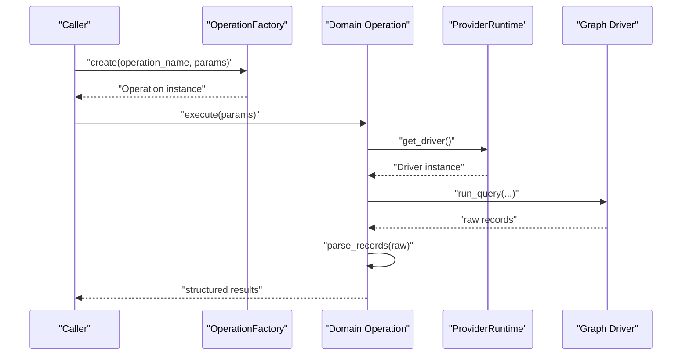
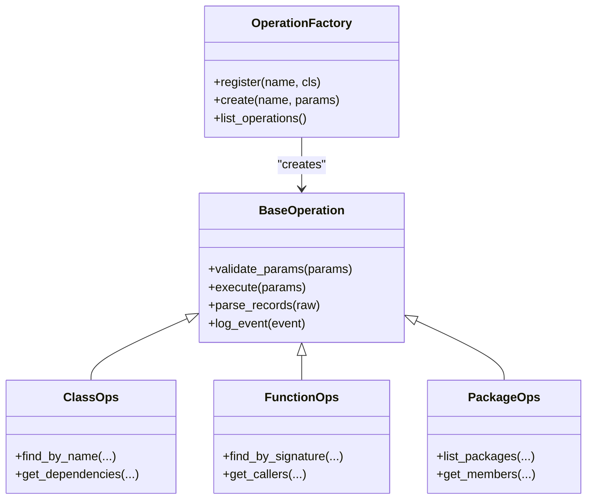
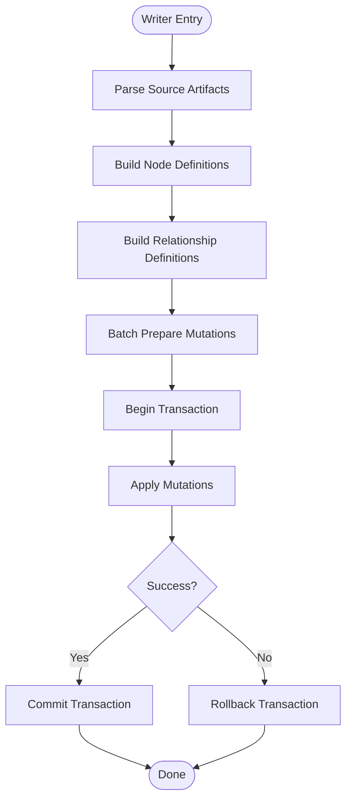
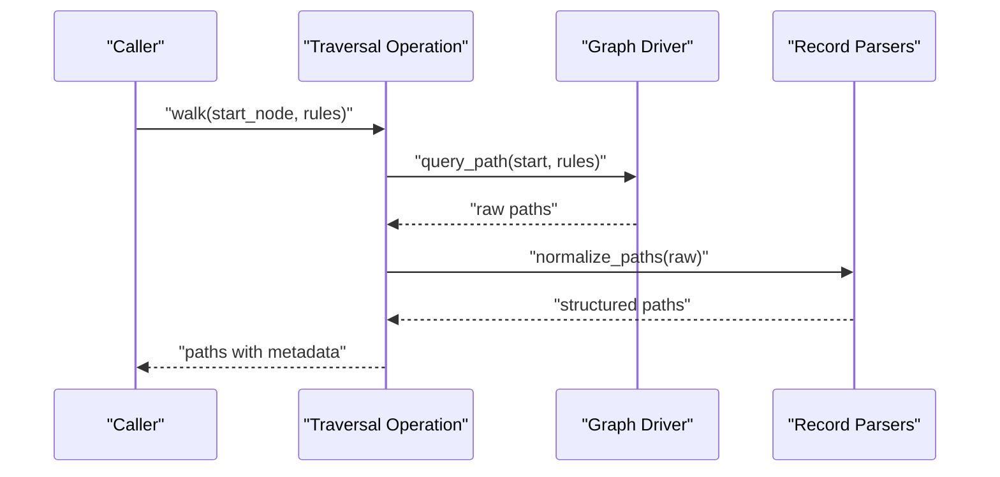
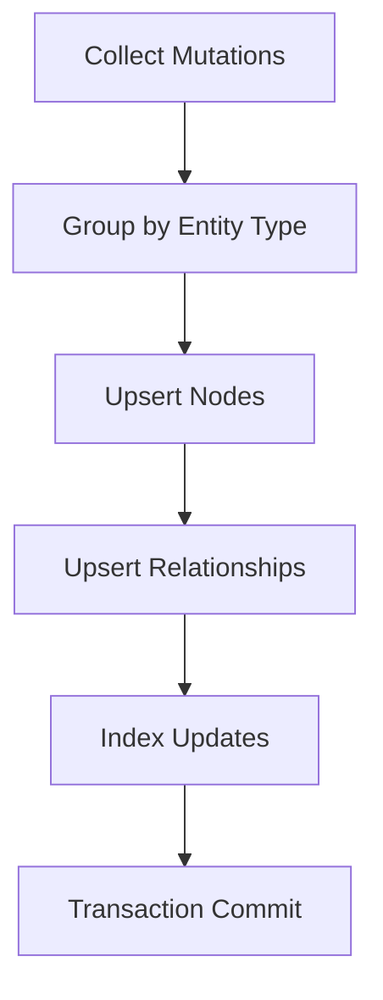
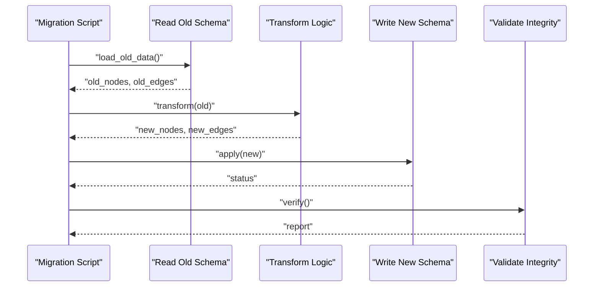
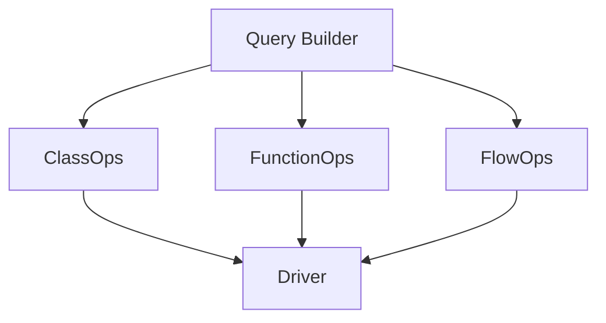

# Graph Operation Extension

<cite>
**Referenced Files in This Document**
- [graph/__init__.py](file://code-tiny/tools/graph/__init__.py)
- [core/base.py](file://code-tiny/tools/graph/core/base.py)
- [core/factory.py](file://code-tiny/tools/graph/core/factory.py)
- [core/provider_runtime.py](file://code-tiny/tools/graph/core/provider_runtime.py)
- [core/record_parsers.py](file://code-tiny/tools/graph/core/record_parsers.py)
- [core/require_neo4j.py](file://code-tiny/tools/graph/core/require_neo4j.py)
- [driver/neo4j_driver.py](file://code-tiny/tools/graph/driver/neo4j_driver.py)
- [driver/falkordb_driver.py](file://code-tiny/tools/graph/driver/falkordb_driver.py)
- [operations/class_ops.py](file://code-tiny/tools/graph/operations/class_ops.py)
- [operations/function_ops.py](file://code-tiny/tools/graph/operations/function_ops.py)
- [operations/package_ops.py](file://code-tiny/tools/graph/operations/package_ops.py)
- [operations/namespace_ops.py](file://code-tiny/tools/graph/operations/namespace_ops.py)
- [operations/type_ops.py](file://code-tiny/tools/graph/operations/type_ops.py)
- [operations/document_ops.py](file://code-tiny/tools/graph/operations/document_ops.py)
- [operations/flow_ops.py](file://code-tiny/tools/graph/operations/flow_ops.py)
- [operations/cross_edge_ops.py](file://code-tiny/tools/graph/operations/cross_edge_ops.py)
- [operations/infra_ops.py](file://code-tiny/tools/graph/operations/infra_ops.py)
- [writer/language_writer.py](file://code-tiny/tools/graph/writer/language_writer.py)
- [writer/database_schema_writer.py](file://code-tiny/tools/graph/writer/database_schema_writer.py)
- [writer/servlet_jsp_writer.py](file://code-tiny/tools/graph/writer/servlet_jsp_writer.py)
- [writer/aspnet_writer.py](file://code-tiny/tools/graph/writer/aspnet_writer.py)
- [writer/spring_writer.py](file://code-tiny/tools/graph/writer/spring_writer.py)
- [writer/mybatis_writer.py](file://code-tiny/tools/graph/writer/mybatis_writer.py)
- [writer/web_framework_writer.py](file://code-tiny/tools/graph/writer/web_framework_writer.py)
- [STRUCTURE.md](file://code-tiny/tools/graph/STRUCTURE.md)
- [cli.py](file://code-tiny/tools/graph/cli.py)
- [example_usage.py](file://code-tiny/tools/graph/examples/example_usage.py)
</cite>

## Table of Contents
1. [Introduction](#introduction)
2. [Project Structure](#project-structure)
3. [Core Components](#core-components)
4. [Architecture Overview](#architecture-overview)
5. [Detailed Component Analysis](#detailed-component-analysis)
6. [Dependency Analysis](#dependency-analysis)
7. [Performance Considerations](#performance-considerations)
8. [Troubleshooting Guide](#troubleshooting-guide)
9. [Conclusion](#conclusion)
10. [Appendices](#appendices)

## Introduction
This document explains how to extend graph operations and write custom graph transformations within the codebase. It focuses on:
- The graph operation factory pattern and base class inheritance structure
- Implementing custom graph writers for new node types and relationship mappings
- Creating specialized traversal operations, batch processing utilities, and data migration scripts
- Performance optimization techniques, transaction management, and database-specific optimizations
- Templates for common graph operation patterns and integration with existing query builders

The goal is to provide a clear path for extending the system while maintaining consistency, performance, and reliability across different graph backends.

## Project Structure
The graph subsystem is organized into core abstractions, driver implementations, domain operations, and writers that map language/framework constructs to graph nodes and edges.

```mermaid
graph TB
subgraph "Graph Core"
Base["Base Abstractions"]
Factory["Operation Factory"]
Runtime["Provider Runtime"]
Parsers["Record Parsers"]
Neo4jReq["Neo4j Requirement"]
end
subgraph "Drivers"
Neo4jDriver["Neo4j Driver"]
FalkorDB["FalkorDB Driver"]
end
subgraph "Operations"
ClassOps["Class Ops"]
FuncOps["Function Ops"]
PackageOps["Package Ops"]
NamespaceOps["Namespace Ops"]
TypeOps["Type Ops"]
DocOps["Document Ops"]
FlowOps["Flow Ops"]
CrossEdgeOps["Cross Edge Ops"]
InfraOps["Infra Ops"]
end
subgraph "Writers"
LangWriter["Language Writer"]
DBSchemaWriter["Database Schema Writer"]
ServletJSPWriter["Servlet/JSP Writer"]
ASPNetWriter["ASP.NET Writer"]
SpringWriter["Spring Writer"]
MyBatisWriter["MyBatis Writer"]
WebFWWriter["Web Framework Writer"]
end
Base --> Factory
Factory --> Runtime
Runtime --> Neo4jDriver
Runtime --> FalkorDB
Factory --> ClassOps
Factory --> FuncOps
Factory --> PackageOps
Factory --> NamespaceOps
Factory --> TypeOps
Factory --> DocOps
Factory --> FlowOps
Factory --> CrossEdgeOps
Factory --> InfraOps
LangWriter --> Neo4jDriver
LangWriter --> FalkorDB
DBSchemaWriter --> Neo4jDriver
DBSchemaWriter --> FalkorDB
ServletJSPWriter --> Neo4jDriver
ServletJSPWriter --> FalkorDB
ASPNetWriter --> Neo4jDriver
ASPNetWriter --> FalkorDB
SpringWriter --> Neo4jDriver
SpringWriter --> FalkorDB
MyBatisWriter --> Neo4jDriver
MyBatisWriter --> FalkorDB
WebFWWriter --> Neo4jDriver
WebFWWriter --> FalkorDB
```

**Diagram sources**
- [core/base.py](file://code-tiny/tools/graph/core/base.py)
- [core/factory.py](file://code-tiny/tools/graph/core/factory.py)
- [core/provider_runtime.py](file://code-tiny/tools/graph/core/provider_runtime.py)
- [core/record_parsers.py](file://code-tiny/tools/graph/core/record_parsers.py)
- [core/require_neo4j.py](file://code-tiny/tools/graph/core/require_neo4j.py)
- [driver/neo4j_driver.py](file://code-tiny/tools/graph/driver/neo4j_driver.py)
- [driver/falkordb_driver.py](file://code-tiny/tools/graph/driver/falkordb_driver.py)
- [operations/class_ops.py](file://code-tiny/tools/graph/operations/class_ops.py)
- [operations/function_ops.py](file://code-tiny/tools/graph/operations/function_ops.py)
- [operations/package_ops.py](file://code-tiny/tools/graph/operations/package_ops.py)
- [operations/namespace_ops.py](file://code-tiny/tools/graph/operations/namespace_ops.py)
- [operations/type_ops.py](file://code-tiny/tools/graph/operations/type_ops.py)
- [operations/document_ops.py](file://code-tiny/tools/graph/operations/document_ops.py)
- [operations/flow_ops.py](file://code-tiny/tools/graph/operations/flow_ops.py)
- [operations/cross_edge_ops.py](file://code-tiny/tools/graph/operations/cross_edge_ops.py)
- [operations/infra_ops.py](file://code-tiny/tools/graph/operations/infra_ops.py)
- [writer/language_writer.py](file://code-tiny/tools/graph/writer/language_writer.py)
- [writer/database_schema_writer.py](file://code-tiny/tools/graph/writer/database_schema_writer.py)
- [writer/servlet_jsp_writer.py](file://code-tiny/tools/graph/writer/servlet_jsp_writer.py)
- [writer/aspnet_writer.py](file://code-tiny/tools/graph/writer/aspnet_writer.py)
- [writer/spring_writer.py](file://code-tiny/tools/graph/writer/spring_writer.py)
- [writer/mybatis_writer.py](file://code-tiny/tools/graph/writer/mybatis_writer.py)
- [writer/web_framework_writer.py](file://code-tiny/tools/graph/writer/web_framework_writer.py)

**Section sources**
- [STRUCTURE.md](file://code-tiny/tools/graph/STRUCTURE.md)
- [graph/__init__.py](file://code-tiny/tools/graph/__init__.py)

## Core Components
This section describes the foundational building blocks used by all graph operations and writers.

- Base abstractions define shared interfaces and utilities for operations and drivers.
- The operation factory centralizes creation and registration of operation instances.
- Provider runtime manages lifecycle and configuration for underlying graph drivers.
- Record parsers normalize raw results from queries into consistent structures.
- Neo4j requirement helpers enforce prerequisites or capabilities when needed.

Key responsibilities:
- Provide a uniform API for creating and invoking operations regardless of backend.
- Ensure consistent record parsing and result handling.
- Abstract driver differences behind a stable interface.

**Section sources**
- [core/base.py](file://code-tiny/tools/graph/core/base.py)
- [core/factory.py](file://code-tiny/tools/graph/core/factory.py)
- [core/provider_runtime.py](file://code-tiny/tools/graph/core/provider_runtime.py)
- [core/record_parsers.py](file://code-tiny/tools/graph/core/record_parsers.py)
- [core/require_neo4j.py](file://code-tiny/tools/graph/core/require_neo4j.py)

## Architecture Overview
The architecture follows a layered approach:
- Operations layer encapsulates domain logic (classes, functions, packages, flows).
- Drivers layer abstracts database specifics (Neo4j, FalkorDB).
- Writers layer maps framework/language artifacts to graph nodes and relationships.
- Core layer provides factory, runtime, and parsing utilities.

**Diagram sources**
- [core/factory.py](file://code-tiny/tools/graph/core/factory.py)
- [core/provider_runtime.py](file://code-tiny/tools/graph/core/provider_runtime.py)
- [driver/neo4j_driver.py](file://code-tiny/tools/graph/driver/neo4j_driver.py)
- [driver/falkordb_driver.py](file://code-tiny/tools/graph/driver/falkordb_driver.py)

## Detailed Component Analysis

### Operation Factory Pattern and Base Inheritance
The factory pattern ensures operations are created consistently and can be resolved by name. Base classes define common behavior such as validation, logging, and result normalization.

**Diagram sources**
- [core/factory.py](file://code-tiny/tools/graph/core/factory.py)
- [core/base.py](file://code-tiny/tools/graph/core/base.py)
- [operations/class_ops.py](file://code-tiny/tools/graph/operations/class_ops.py)
- [operations/function_ops.py](file://code-tiny/tools/graph/operations/function_ops.py)
- [operations/package_ops.py](file://code-tiny/tools/graph/operations/package_ops.py)

**Section sources**
- [core/factory.py](file://code-tiny/tools/graph/core/factory.py)
- [core/base.py](file://code-tiny/tools/graph/core/base.py)
- [operations/class_ops.py](file://code-tiny/tools/graph/operations/class_ops.py)
- [operations/function_ops.py](file://code-tiny/tools/graph/operations/function_ops.py)
- [operations/package_ops.py](file://code-tiny/tools/graph/operations/package_ops.py)

### Custom Graph Writer Implementation
Writers translate high-level constructs into graph mutations. They typically:
- Define node schemas and relationship types
- Map source artifacts to node properties
- Create or update edges based on semantic relationships
- Batch writes where possible for performance

**Diagram sources**
- [writer/language_writer.py](file://code-tiny/tools/graph/writer/language_writer.py)
- [writer/database_schema_writer.py](file://code-tiny/tools/graph/writer/database_schema_writer.py)
- [writer/servlet_jsp_writer.py](file://code-tiny/tools/graph/writer/servlet_jsp_writer.py)
- [writer/aspnet_writer.py](file://code-tiny/tools/graph/writer/aspnet_writer.py)
- [writer/spring_writer.py](file://code-tiny/tools/graph/writer/spring_writer.py)
- [writer/mybatis_writer.py](file://code-tiny/tools/graph/writer/mybatis_writer.py)
- [writer/web_framework_writer.py](file://code-tiny/tools/graph/writer/web_framework_writer.py)

**Section sources**
- [writer/language_writer.py](file://code-tiny/tools/graph/writer/language_writer.py)
- [writer/database_schema_writer.py](file://code-tiny/tools/graph/writer/database_schema_writer.py)
- [writer/servlet_jsp_writer.py](file://code-tiny/tools/graph/writer/servlet_jsp_writer.py)
- [writer/aspnet_writer.py](file://code-tiny/tools/graph/writer/aspnet_writer.py)
- [writer/spring_writer.py](file://code-tiny/tools/graph/writer/spring_writer.py)
- [writer/mybatis_writer.py](file://code-tiny/tools/graph/writer/mybatis_writer.py)
- [writer/web_framework_writer.py](file://code-tiny/tools/graph/writer/web_framework_writer.py)

### Specialized Traversal Operations
Traversals encapsulate complex graph walks like dependency chains, call graphs, and cross-framework links.

**Diagram sources**
- [operations/flow_ops.py](file://code-tiny/tools/graph/operations/flow_ops.py)
- [operations/cross_edge_ops.py](file://code-tiny/tools/graph/operations/cross_edge_ops.py)
- [core/record_parsers.py](file://code-tiny/tools/graph/core/record_parsers.py)

**Section sources**
- [operations/flow_ops.py](file://code-tiny/tools/graph/operations/flow_ops.py)
- [operations/cross_edge_ops.py](file://code-tiny/tools/graph/operations/cross_edge_ops.py)
- [core/record_parsers.py](file://code-tiny/tools/graph/core/record_parsers.py)

### Batch Processing Utilities
Batch utilities aggregate multiple mutations and execute them efficiently. They often integrate with transactions to ensure atomicity.

**Diagram sources**
- [operations/infra_ops.py](file://code-tiny/tools/graph/operations/infra_ops.py)
- [driver/neo4j_driver.py](file://code-tiny/tools/graph/driver/neo4j_driver.py)
- [driver/falkordb_driver.py](file://code-tiny/tools/graph/driver/falkordb_driver.py)

**Section sources**
- [operations/infra_ops.py](file://code-tiny/tools/graph/operations/infra_ops.py)
- [driver/neo4j_driver.py](file://code-tiny/tools/graph/driver/neo4j_driver.py)
- [driver/falkordb_driver.py](file://code-tiny/tools/graph/driver/falkordb_driver.py)

### Data Migration Scripts
Migration scripts transform legacy graph structures to new schemas. They typically:
- Read old nodes/edges
- Transform properties and relationships
- Write new schema elements
- Validate integrity post-migration

**Diagram sources**
- [cli.py](file://code-tiny/tools/graph/cli.py)
- [driver/neo4j_driver.py](file://code-tiny/tools/graph/driver/neo4j_driver.py)
- [driver/falkordb_driver.py](file://code-tiny/tools/graph/driver/falkordb_driver.py)

**Section sources**
- [cli.py](file://code-tiny/tools/graph/cli.py)
- [driver/neo4j_driver.py](file://code-tiny/tools/graph/driver/neo4j_driver.py)
- [driver/falkordb_driver.py](file://code-tiny/tools/graph/driver/falkordb_driver.py)

### Integration with Existing Query Builders
Integration points allow operations to compose queries using shared builders. This promotes reuse and consistency across operations.

**Diagram sources**
- [operations/class_ops.py](file://code-tiny/tools/graph/operations/class_ops.py)
- [operations/function_ops.py](file://code-tiny/tools/graph/operations/function_ops.py)
- [operations/flow_ops.py](file://code-tiny/tools/graph/operations/flow_ops.py)
- [driver/neo4j_driver.py](file://code-tiny/tools/graph/driver/neo4j_driver.py)
- [driver/falkordb_driver.py](file://code-tiny/tools/graph/driver/falkordb_driver.py)

**Section sources**
- [operations/class_ops.py](file://code-tiny/tools/graph/operations/class_ops.py)
- [operations/function_ops.py](file://code-tiny/tools/graph/operations/function_ops.py)
- [operations/flow_ops.py](file://code-tiny/tools/graph/operations/flow_ops.py)
- [driver/neo4j_driver.py](file://code-tiny/tools/graph/driver/neo4j_driver.py)
- [driver/falkordb_driver.py](file://code-tiny/tools/graph/driver/falkordb_driver.py)

## Dependency Analysis
The following diagram shows key dependencies between core components, drivers, operations, and writers.

```mermaid
graph TB
Factory["factory.py"] --> Base["base.py"]
Factory --> Runtime["provider_runtime.py"]
Runtime --> Neo4jDriver["neo4j_driver.py"]
Runtime --> FalkorDB["falkordb_driver.py"]
Base --> ClassOps["class_ops.py"]
Base --> FunctionOps["function_ops.py"]
Base --> PackageOps["package_ops.py"]
Base --> NamespaceOps["namespace_ops.py"]
Base --> TypeOps["type_ops.py"]
Base --> DocOps["document_ops.py"]
Base --> FlowOps["flow_ops.py"]
Base --> CrossEdgeOps["cross_edge_ops.py"]
Base --> InfraOps["infra_ops.py"]
LangWriter["language_writer.py"] --> Neo4jDriver
LangWriter --> FalkorDB
DBSchemaWriter["database_schema_writer.py"] --> Neo4jDriver
DBSchemaWriter --> FalkorDB
ServletJSPWriter["servlet_jsp_writer.py"] --> Neo4jDriver
ServletJSPWriter --> FalkorDB
ASPNetWriter["aspnet_writer.py"] --> Neo4jDriver
ASPNetWriter --> FalkorDB
SpringWriter["spring_writer.py"] --> Neo4jDriver
SpringWriter --> FalkorDB
MyBatisWriter["mybatis_writer.py"] --> Neo4jDriver
MyBatisWriter --> FalkorDB
WebFWWriter["web_framework_writer.py"] --> Neo4jDriver
WebFWWriter --> FalkorDB
```

**Diagram sources**
- [core/factory.py](file://code-tiny/tools/graph/core/factory.py)
- [core/base.py](file://code-tiny/tools/graph/core/base.py)
- [core/provider_runtime.py](file://code-tiny/tools/graph/core/provider_runtime.py)
- [driver/neo4j_driver.py](file://code-tiny/tools/graph/driver/neo4j_driver.py)
- [driver/falkordb_driver.py](file://code-tiny/tools/graph/driver/falkordb_driver.py)
- [operations/class_ops.py](file://code-tiny/tools/graph/operations/class_ops.py)
- [operations/function_ops.py](file://code-tiny/tools/graph/operations/function_ops.py)
- [operations/package_ops.py](file://code-tiny/tools/graph/operations/package_ops.py)
- [operations/namespace_ops.py](file://code-tiny/tools/graph/operations/namespace_ops.py)
- [operations/type_ops.py](file://code-tiny/tools/graph/operations/type_ops.py)
- [operations/document_ops.py](file://code-tiny/tools/graph/operations/document_ops.py)
- [operations/flow_ops.py](file://code-tiny/tools/graph/operations/flow_ops.py)
- [operations/cross_edge_ops.py](file://code-tiny/tools/graph/operations/cross_edge_ops.py)
- [operations/infra_ops.py](file://code-tiny/tools/graph/operations/infra_ops.py)
- [writer/language_writer.py](file://code-tiny/tools/graph/writer/language_writer.py)
- [writer/database_schema_writer.py](file://code-tiny/tools/graph/writer/database_schema_writer.py)
- [writer/servlet_jsp_writer.py](file://code-tiny/tools/graph/writer/servlet_jsp_writer.py)
- [writer/aspnet_writer.py](file://code-tiny/tools/graph/writer/aspnet_writer.py)
- [writer/spring_writer.py](file://code-tiny/tools/graph/writer/spring_writer.py)
- [writer/mybatis_writer.py](file://code-tiny/tools/graph/writer/mybatis_writer.py)
- [writer/web_framework_writer.py](file://code-tiny/tools/graph/writer/web_framework_writer.py)

**Section sources**
- [core/factory.py](file://code-tiny/tools/graph/core/factory.py)
- [core/base.py](file://code-tiny/tools/graph/core/base.py)
- [core/provider_runtime.py](file://code-tiny/tools/graph/core/provider_runtime.py)
- [driver/neo4j_driver.py](file://code-tiny/tools/graph/driver/neo4j_driver.py)
- [driver/falkordb_driver.py](file://code-tiny/tools/graph/driver/falkordb_driver.py)
- [operations/class_ops.py](file://code-tiny/tools/graph/operations/class_ops.py)
- [operations/function_ops.py](file://code-tiny/tools/graph/operations/function_ops.py)
- [operations/package_ops.py](file://code-tiny/tools/graph/operations/package_ops.py)
- [operations/namespace_ops.py](file://code-tiny/tools/graph/operations/namespace_ops.py)
- [operations/type_ops.py](file://code-tiny/tools/graph/operations/type_ops.py)
- [operations/document_ops.py](file://code-tiny/tools/graph/operations/document_ops.py)
- [operations/flow_ops.py](file://code-tiny/tools/graph/operations/flow_ops.py)
- [operations/cross_edge_ops.py](file://code-tiny/tools/graph/operations/cross_edge_ops.py)
- [operations/infra_ops.py](file://code-tiny/tools/graph/operations/infra_ops.py)
- [writer/language_writer.py](file://code-tiny/tools/graph/writer/language_writer.py)
- [writer/database_schema_writer.py](file://code-tiny/tools/graph/writer/database_schema_writer.py)
- [writer/servlet_jsp_writer.py](file://code-tiny/tools/graph/writer/servlet_jsp_writer.py)
- [writer/aspnet_writer.py](file://code-tiny/tools/graph/writer/aspnet_writer.py)
- [writer/spring_writer.py](file://code-tiny/tools/graph/writer/spring_writer.py)
- [writer/mybatis_writer.py](file://code-tiny/tools/graph/writer/mybatis_writer.py)
- [writer/web_framework_writer.py](file://code-tiny/tools/graph/writer/web_framework_writer.py)

## Performance Considerations
- Prefer batched writes to reduce round-trips and leverage transactional boundaries.
- Use upsert semantics to avoid redundant updates and minimize index churn.
- Limit traversal depth and filter early to reduce result set size.
- Reuse prepared statements or query templates where supported by the driver.
- Monitor driver-specific features (e.g., streaming results, connection pooling) and tune accordingly.
- Normalize records once per operation to avoid repeated parsing overhead.

[No sources needed since this section provides general guidance]

## Troubleshooting Guide
Common issues and strategies:
- Driver connectivity errors: verify credentials, endpoints, and network access; use provider runtime diagnostics.
- Transaction failures: inspect rollback logs and partial mutation states; consider smaller batches.
- Parsing inconsistencies: validate raw records against expected schemas; add defensive checks in parsers.
- Capability mismatches: ensure required features (e.g., Neo4j version) are present before executing dependent operations.

**Section sources**
- [core/provider_runtime.py](file://code-tiny/tools/graph/core/provider_runtime.py)
- [core/record_parsers.py](file://code-tiny/tools/graph/core/record_parsers.py)
- [core/require_neo4j.py](file://code-tiny/tools/graph/core/require_neo4j.py)

## Conclusion
By leveraging the factory pattern, base class inheritance, and well-defined writer contracts, you can extend graph operations safely and efficiently. Focus on batching, transactional integrity, and driver-specific optimizations to achieve robust performance. Use the provided patterns and diagrams as templates for implementing new operations, writers, and migrations.

[No sources needed since this section summarizes without analyzing specific files]

## Appendices

### Templates for Common Graph Operation Patterns
- Operation template: register via factory, implement execute and parse_records, wrap calls in transactions.
- Writer template: define node/edge schemas, build mutations, batch apply, commit or rollback.
- Traversal template: define start nodes and rules, stream results, normalize paths, return structured output.
- Migration template: read old schema, transform to new schema, apply changes, validate integrity.

[No sources needed since this section provides conceptual templates]

### Example Usage Reference
For concrete examples of usage patterns, see the example file.

**Section sources**
- [examples/example_usage.py](file://code-tiny/tools/graph/examples/example_usage.py)