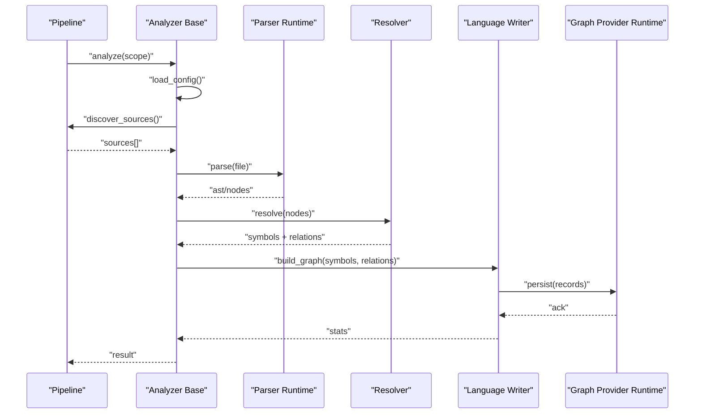
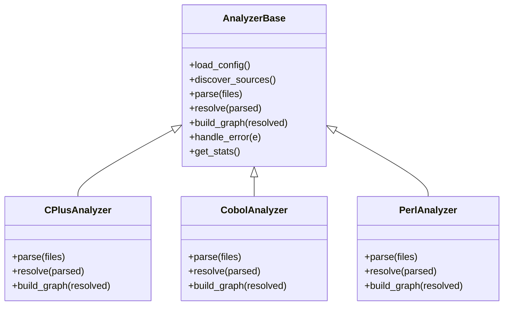
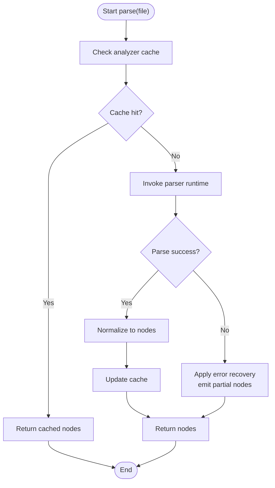
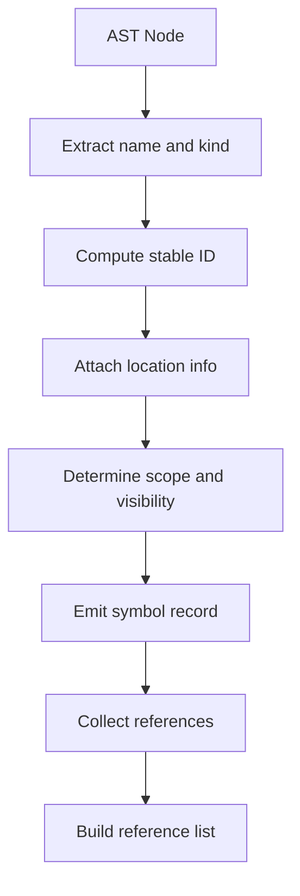
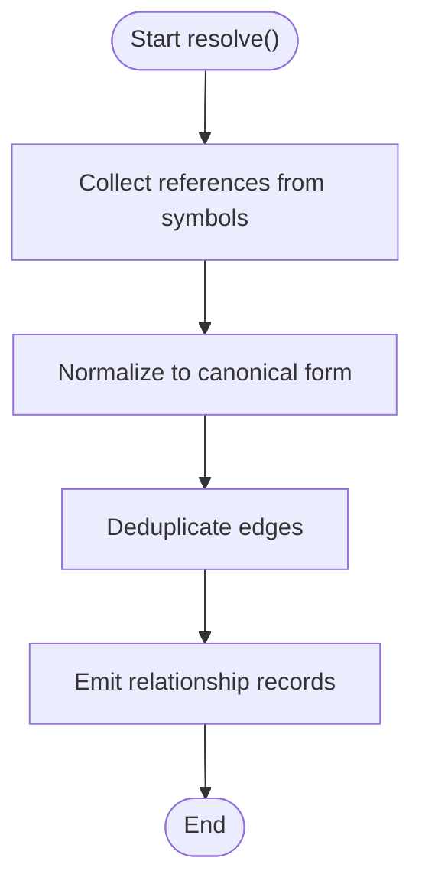
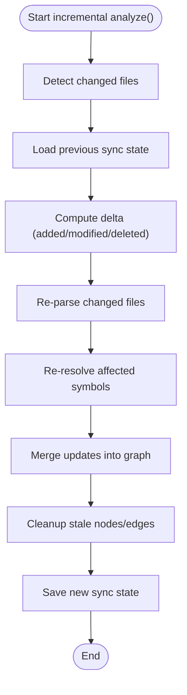

# Language Analyzer Development

<cite>
**Referenced Files in This Document**
- [cplus_analyzer.py](file://code-tiny/tools/cplus/cplus_analyzer.py)
- [cobol_analyzer.py](file://code-tiny/tools/cobol/cobol_analyzer.py)
- [perl_analyzer.py](file://code-tiny/tools/perl/perl_analyzer.py)
- [parser_runtime.py](file://code-tiny/tools/cobol/parser_runtime.py)
- [parser_runtime.py](file://code-tiny/tools/perl/parser_runtime.py)
- [pipeline.py](file://code-tiny/tools/cobol/pipeline.py)
- [pipeline.py](file://code-tiny/tools/perl/pipeline.py)
- [resolver.py](file://code-tiny/tools/cobol/resolver.py)
- [resolver.py](file://code-tiny/tools/perl/resolver.py)
- [harness_config.py](file://code-tiny/tools/common/harness_config.py)
- [analyzer_cache.py](file://code-tiny/tools/common/analyzer_cache.py)
- [incremental_sync_state.py](file://code-tiny/tools/common/incremental_sync_state.py)
- [incremental_cleanup.py](file://code-tiny/tools/common/incremental_cleanup.py)
- [sync_scope.py](file://code-tiny/tools/common/sync_scope.py)
- [graph_expander.py](file://code-tiny/tools/common/graph_expander.py)
- [call_graph_builder.py](file://code-tiny/tools/common/call_graph_builder.py)
- [source_inventory.py](file://code-tiny/tools/common/source_inventory.py)
- [git_diff.py](file://code-tiny/tools/common/git_diff.py)
- [provider_runtime.py](file://code-tiny/tools/graph/core/provider_runtime.py)
- [base.py](file://code-tiny/tools/graph/core/base.py)
- [factory.py](file://code-tiny/tools/graph/core/factory.py)
- [record_parsers.py](file://code-tiny/tools/graph/core/record_parsers.py)
- [language_writer.py](file://code-tiny/tools/graph/writer/language_writer.py)
- [aspnet_core_analyzer.py](file://code-tiny/tools/aspnet_core/aspnet_core_analyzer.py)
- [flutter_analyzer.py](file://code-tiny/tools/flutter/flutter_analyzer.py)
- [ts_analyzer.py](file://code-tiny/tools/ts/ts_analyzer.py)
- [java_analyzer.py](file://code-tiny/tools/java/java_analyzer.py)
- [python_analyzer.py](file://code-tiny/tools/python/python_analyzer.py)
- [js_analyzer.py](file://code-tiny/tools/js/js_analyzer.py)
- [kotlin_analyzer.py](file://code-tiny/tools/kotlin/kotlin_analyzer.py)
- [csharp_analyzer.py](file://code-tiny/tools/csharp/csharp_analyzer.py)
- [go_analyzer.py](file://code-tiny/tools/go/go_analyzer.py)
- [php_analyzer.py](file://code-tiny/tools/php/php_analyzer.py)
- [rust_analyzer.py](file://code-tiny/tools/rust/rust_analyzer.py)
- [swift_analyzer.py](file://code-tiny/tools/swift/swift_analyzer.py)
- [sql_analyzer.py](file://code-tiny/tools/sql/sql_analyzer.py)
- [plsql_analyzer.py](file://code-tiny/tools/plsql/plsql_analyzer.py)
- [delphi_analyzer.py](file://code-tiny/tools/delphi/delphi_analyzer.py)
- [vb6_analyzer.py](file://code-tiny/tools/vb/vb6_analyzer.py)
- [vba_analyzer.py](file://code-tiny/tools/vb/vba_analyzer.py)
- [vbnet_analyzer.py](file://code-tiny/tools/vb/vbnet_analyzer.py)
- [vbscript_analyzer.py](file://code-tiny/tools/vb/vbscript_analyzer.py)
</cite>

## Table of Contents
1. [Introduction](#introduction)
2. [Project Structure](#project-structure)
3. [Core Components](#core-components)
4. [Architecture Overview](#architecture-overview)
5. [Detailed Component Analysis](#detailed-component-analysis)
6. [Dependency Analysis](#dependency-analysis)
7. [Performance Considerations](#performance-considerations)
8. [Troubleshooting Guide](#troubleshooting-guide)
9. [Conclusion](#conclusion)
10. [Appendices](#appendices)

## Introduction
This document explains how to implement custom language analyzers in Cortex Harness. It focuses on the analyzer base class architecture, required interface implementations (parse(), resolve(), build_graph()), parser runtime integration, symbol extraction patterns, and relationship mapping strategies. It also provides step-by-step guidance for building a complete analyzer from scratch, handling AST generation, implementing incremental analysis support, configuration management, error recovery mechanisms, performance optimization techniques, templates for common patterns, and debugging strategies for parser development.

## Project Structure

```mermaid
graph TB
subgraph "Language Analyzers"
A["cplus_analyzer.py"]
B["cobol_analyzer.py"]
C["perl_analyzer.py"]
D["aspnet_core_analyzer.py"]
E["flutter_analyzer.py"]
F["ts_analyzer.py"]
end
subgraph "Common Utilities"
G["harness_config.py"]
H["analyzer_cache.py"]
I["incremental_sync_state.py"]
J["incremental_cleanup.py"]
K["sync_scope.py"]
L["graph_expander.py"]
M["call_graph_builder.py"]
N["source_inventory.py"]
O["git_diff.py"]
end
subgraph "Graph Core"
P["provider_runtime.py"]
Q["base.py"]
R["factory.py"]
S["record_parsers.py"]
T["language_writer.py"]
end
A --> G
B --> G
C --> G
D --> G
E --> G
F --> G
A --> H
B --> H
C --> H
A --> I
B --> I
C --> I
A --> J
B --> J
C --> J
A --> K
B --> K
C --> K
A --> L
B --> L
C --> L
A --> M
B --> M
C --> M
A --> N
B --> N
C --> N
A --> O
B --> O
C --> O
A --> P
B --> P
C --> P
A --> Q
B --> Q
C --> Q
A --> R
B --> R
C --> R
A --> S
B --> S
C --> S
A --> T
B --> T
C --> T
```

Cortex Harness organizes language analyzers under tools/<language>/ with consistent modules: analyzer entrypoint, pipeline orchestration, resolver for cross-file resolution, optional parser runtime wrapper, and graph writers. Common utilities live under tools/common/. Graph core abstractions and drivers are under tools/graph/core/ and tools/graph/writer/.

**Diagram sources**
- [cplus_analyzer.py:1-200](file://code-tiny/tools/cplus/cplus_analyzer.py#L1-L200)
- [cobol_analyzer.py:1-200](file://code-tiny/tools/cobol/cobol_analyzer.py#L1-L200)
- [perl_analyzer.py:1-200](file://code-tiny/tools/perl/perl_analyzer.py#L1-L200)
- [harness_config.py:1-200](file://code-tiny/tools/common/harness_config.py#L1-L200)
- [analyzer_cache.py:1-200](file://code-tiny/tools/common/analyzer_cache.py#L1-L200)
- [incremental_sync_state.py:1-200](file://code-tiny/tools/common/incremental_sync_state.py#L1-L200)
- [incremental_cleanup.py:1-200](file://code-tiny/tools/common/incremental_cleanup.py#L1-L200)
- [sync_scope.py:1-200](file://code-tiny/tools/common/sync_scope.py#L1-L200)
- [graph_expander.py:1-200](file://code-tiny/tools/common/graph_expander.py#L1-L200)
- [call_graph_builder.py:1-200](file://code-tiny/tools/common/call_graph_builder.py#L1-L200)
- [source_inventory.py:1-200](file://code-tiny/tools/common/source_inventory.py#L1-L200)
- [git_diff.py:1-200](file://code-tiny/tools/common/git_diff.py#L1-L200)
- [provider_runtime.py:1-200](file://code-tiny/tools/graph/core/provider_runtime.py#L1-L200)
- [base.py:1-200](file://code-tiny/tools/graph/core/base.py#L1-L200)
- [factory.py:1-200](file://code-tiny/tools/graph/core/factory.py#L1-L200)
- [record_parsers.py:1-200](file://code-tiny/tools/graph/core/record_parsers.py#L1-L200)
- [language_writer.py:1-200](file://code-tiny/tools/graph/writer/language_writer.py#L1-L200)

**Section sources**
- [cplus_analyzer.py:1-200](file://code-tiny/tools/cplus/cplus_analyzer.py#L1-L200)
- [cobol_analyzer.py:1-200](file://code-tiny/tools/cobol/cobol_analyzer.py#L1-L200)
- [perl_analyzer.py:1-200](file://code-tiny/tools/perl/perl_analyzer.py#L1-L200)
- [harness_config.py:1-200](file://code-tiny/tools/common/harness_config.py#L1-L200)
- [analyzer_cache.py:1-200](file://code-tiny/tools/common/analyzer_cache.py#L1-L200)
- [incremental_sync_state.py:1-200](file://code-tiny/tools/common/incremental_sync_state.py#L1-L200)
- [incremental_cleanup.py:1-200](file://code-tiny/tools/common/incremental_cleanup.py#L1-L200)
- [sync_scope.py:1-200](file://code-tiny/tools/common/sync_scope.py#L1-L200)
- [graph_expander.py:1-200](file://code-tiny/tools/common/graph_expander.py#L1-L200)
- [call_graph_builder.py:1-200](file://code-tiny/tools/common/call_graph_builder.py#L1-L200)
- [source_inventory.py:1-200](file://code-tiny/tools/common/source_inventory.py#L1-L200)
- [git_diff.py:1-200](file://code-tiny/tools/common/git_diff.py#L1-L200)
- [provider_runtime.py:1-200](file://code-tiny/tools/graph/core/provider_runtime.py#L1-L200)
- [base.py:1-200](file://code-tiny/tools/graph/core/base.py#L1-L200)
- [factory.py:1-200](file://code-tiny/tools/graph/core/factory.py#L1-L200)
- [record_parsers.py:1-200](file://code-tiny/tools/graph/core/record_parsers.py#L1-L200)
- [language_writer.py:1-200](file://code-tiny/tools/graph/writer/language_writer.py#L1-L200)

## Core Components
The analyzer base class defines the contract that all language analyzers must implement. The key methods are:
- parse(): Parse source files into an internal representation (AST or intermediate nodes).
- resolve(): Resolve symbols across files and build cross-references.
- build_graph(): Convert resolved data into graph records and persist them via the graph provider.

Additional responsibilities include:
- Configuration management through harness config.
- Incremental analysis using change detection and state persistence.
- Error recovery during parsing and resolution.
- Performance optimizations such as caching and batching writes.

Existing analyzers demonstrate these patterns:
- C++ analyzer integrates Clang-based parsing and graph writing.
- COBOL analyzer uses a dedicated parser runtime and resolver.
- Perl analyzer follows similar structure with its own parser runtime.

**Section sources**
- [cplus_analyzer.py:1-200](file://code-tiny/tools/cplus/cplus_analyzer.py#L1-L200)
- [cobol_analyzer.py:1-200](file://code-tiny/tools/cobol/cobol_analyzer.py#L1-L200)
- [perl_analyzer.py:1-200](file://code-tiny/tools/perl/perl_analyzer.py#L1-L200)

## Architecture Overview
The analyzer lifecycle is orchestrated by a pipeline that coordinates discovery, parsing, resolution, and graph ingestion. Parser runtimes encapsulate language-specific parsing logic and expose normalized results to the resolver. The resolver builds symbol tables and relationships. Finally, the graph writer persists nodes and edges using the graph core provider.

**Diagram sources**
- [pipeline.py:1-200](file://code-tiny/tools/cobol/pipeline.py#L1-L200)
- [pipeline.py:1-200](file://code-tiny/tools/perl/pipeline.py#L1-L200)
- [parser_runtime.py:1-200](file://code-tiny/tools/cobol/parser_runtime.py#L1-L200)
- [parser_runtime.py:1-200](file://code-tiny/tools/perl/parser_runtime.py#L1-L200)
- [resolver.py:1-200](file://code-tiny/tools/cobol/resolver.py#L1-L200)
- [resolver.py:1-200](file://code-tiny/tools/perl/resolver.py#L1-L200)
- [language_writer.py:1-200](file://code-tiny/tools/graph/writer/language_writer.py#L1-L200)
- [provider_runtime.py:1-200](file://code-tiny/tools/graph/core/provider_runtime.py#L1-L200)

## Detailed Component Analysis

### Analyzer Base Class Contract
The base class defines the interface and shared behavior for all analyzers. Implementers must provide:
- parse(): Accepts file paths and returns parsed structures.
- resolve(): Consumes parsed structures to produce symbol tables and relationships.
- build_graph(): Transforms symbols and relationships into graph records and persists them.

Shared capabilities typically include:
- Config loading and validation.
- Source discovery and filtering.
- Incremental state management.
- Error handling and recovery hooks.
- Logging and metrics.

**Diagram sources**
- [cplus_analyzer.py:1-200](file://code-tiny/tools/cplus/cplus_analyzer.py#L1-L200)
- [cobol_analyzer.py:1-200](file://code-tiny/tools/cobol/cobol_analyzer.py#L1-L200)
- [perl_analyzer.py:1-200](file://code-tiny/tools/perl/perl_analyzer.py#L1-L200)

**Section sources**
- [cplus_analyzer.py:1-200](file://code-tiny/tools/cplus/cplus_analyzer.py#L1-L200)
- [cobol_analyzer.py:1-200](file://code-tiny/tools/cobol/cobol_analyzer.py#L1-L200)
- [perl_analyzer.py:1-200](file://code-tiny/tools/perl/perl_analyzer.py#L1-L200)

### Parser Runtime Integration
Parser runtimes encapsulate language-specific parsing logic and normalize outputs for the resolver. They handle:
- Invoking external parsers or libraries.
- Converting raw parse results into structured nodes.
- Reporting errors and partial parses gracefully.

Integration points:
- Analyzer calls parser runtime per file or batch.
- Parser runtime returns normalized AST or node lists.
- Errors are captured and surfaced to the analyzer for recovery.

**Diagram sources**
- [parser_runtime.py:1-200](file://code-tiny/tools/cobol/parser_runtime.py#L1-L200)
- [parser_runtime.py:1-200](file://code-tiny/tools/perl/parser_runtime.py#L1-L200)
- [analyzer_cache.py:1-200](file://code-tiny/tools/common/analyzer_cache.py#L1-L200)

**Section sources**
- [parser_runtime.py:1-200](file://code-tiny/tools/cobol/parser_runtime.py#L1-L200)
- [parser_runtime.py:1-200](file://code-tiny/tools/perl/parser_runtime.py#L1-L200)
- [analyzer_cache.py:1-200](file://code-tiny/tools/common/analyzer_cache.py#L1-L200)

### Symbol Extraction Patterns
Symbol extraction transforms AST nodes into canonical symbol entries with metadata:
- Unique identifiers (stable IDs).
- Names and qualified names.
- Locations (file path, line/column ranges).
- Kind/type (function, class, variable, etc.).
- Visibility and scope context.

Patterns observed:
- Hierarchical scoping: parent-child relationships tracked via scopes.
- Cross-file references: imports/includes mapped to symbol IDs.
- Normalization: dialect-specific constructs normalized to common schema.

[No sources needed since this diagram shows conceptual workflow, not actual code structure]

### Relationship Mapping Strategies
Relationships connect symbols and files:
- File-to-symbol: containment edges.
- Symbol-to-symbol: inheritance, composition, call, import, use.
- Cross-language/framework overlays: additional semantic edges.

Strategies:
- Build adjacency lists during resolution.
- Deduplicate edges by canonical keys.
- Batch write edges to minimize IO overhead.

[No sources needed since this diagram shows conceptual workflow, not actual code structure]

### Step-by-Step Example: Creating a Complete Language Analyzer
Follow these steps to implement a new analyzer:

1. Define analyzer class extending the base class.
   - Implement parse(), resolve(), build_graph().
   - Integrate with parser runtime if applicable.
   - Use harness config for settings.

2. Implement parse():
   - Discover source files within scope.
   - Call parser runtime to generate nodes.
   - Apply error recovery and caching.

3. Implement resolve():
   - Build symbol table from nodes.
   - Map references and relationships.
   - Handle cross-file dependencies.

4. Implement build_graph():
   - Convert symbols and relationships to graph records.
   - Persist via language writer and provider runtime.
   - Return stats and diagnostics.

5. Configure incremental analysis:
   - Track file changes using git diff or timestamps.
   - Load previous state and compute delta.
   - Re-parse and re-resolve only affected files.

6. Add tests and fixtures:
   - Validate parsing correctness.
   - Verify symbol and edge contracts.
   - Measure performance and memory usage.

**Section sources**
- [pipeline.py:1-200](file://code-tiny/tools/cobol/pipeline.py#L1-L200)
- [pipeline.py:1-200](file://code-tiny/tools/perl/pipeline.py#L1-L200)
- [harness_config.py:1-200](file://code-tiny/tools/common/harness_config.py#L1-L200)
- [analyzer_cache.py:1-200](file://code-tiny/tools/common/analyzer_cache.py#L1-L200)
- [incremental_sync_state.py:1-200](file://code-tiny/tools/common/incremental_sync_state.py#L1-L200)
- [git_diff.py:1-200](file://code-tiny/tools/common/git_diff.py#L1-L200)

### Handling AST Generation
AST generation involves:
- Invoking language-specific parsers.
- Normalizing AST nodes to analyzer’s internal format.
- Capturing diagnostics and warnings.
- Supporting partial parses when syntax errors occur.

Best practices:
- Use parser runtime to isolate language-specific logic.
- Provide fallbacks for unsupported constructs.
- Record parse errors with file and location for user feedback.

**Section sources**
- [parser_runtime.py:1-200](file://code-tiny/tools/cobol/parser_runtime.py#L1-L200)
- [parser_runtime.py:1-200](file://code-tiny/tools/perl/parser_runtime.py#L1-L200)

### Implementing Incremental Analysis Support
Incremental analysis minimizes work by processing only changed files:
- Detect changes using git diff or file metadata.
- Load previous sync state and compute deltas.
- Re-run parse and resolve for affected files.
- Merge updated symbols and edges into existing graph.

Key components:
- Sync scope to define boundaries.
- State persistence for previous runs.
- Cleanup routines to remove stale nodes/edges.

**Diagram sources**
- [incremental_sync_state.py:1-200](file://code-tiny/tools/common/incremental_sync_state.py#L1-L200)
- [incremental_cleanup.py:1-200](file://code-tiny/tools/common/incremental_cleanup.py#L1-L200)
- [sync_scope.py:1-200](file://code-tiny/tools/common/sync_scope.py#L1-L200)
- [git_diff.py:1-200](file://code-tiny/tools/common/git_diff.py#L1-L200)

**Section sources**
- [incremental_sync_state.py:1-200](file://code-tiny/tools/common/incremental_sync_state.py#L1-L200)
- [incremental_cleanup.py:1-200](file://code-tiny/tools/common/incremental_cleanup.py#L1-L200)
- [sync_scope.py:1-200](file://code-tiny/tools/common/sync_scope.py#L1-L200)
- [git_diff.py:1-200](file://code-tiny/tools/common/git_diff.py#L1-L200)

### Configuration Management
Configuration is loaded and validated at startup:
- Settings include parser options, thresholds, and feature flags.
- Defaults are provided; overrides come from environment or config files.
- Validation ensures required fields and compatible values.

Use harness config utilities to:
- Load YAML/JSON configurations.
- Merge defaults with user overrides.
- Expose typed accessors for analyzer settings.

**Section sources**
- [harness_config.py:1-200](file://code-tiny/tools/common/harness_config.py#L1-L200)

### Error Recovery Mechanisms
Robust analyzers recover from parse and resolution errors:
- Capture exceptions and emit partial nodes where possible.
- Log detailed diagnostics with file and location.
- Continue processing unaffected files to maximize coverage.

Patterns:
- Try-catch around parser invocations.
- Skip malformed files with warnings.
- Aggregate errors for reporting.

**Section sources**
- [parser_runtime.py:1-200](file://code-tiny/tools/cobol/parser_runtime.py#L1-L200)
- [parser_runtime.py:1-200](file://code-tiny/tools/perl/parser_runtime.py#L1-L200)

### Performance Optimization Techniques
Optimize analyzers for speed and memory:
- Cache parsed nodes and symbols to avoid re-parsing.
- Batch graph writes to reduce IO overhead.
- Limit scope to relevant directories and file types.
- Use streaming where possible to process large files.

Tools:
- Analyzer cache for persistent storage.
- Graph expander for efficient traversal.
- Call graph builder for optimized relation construction.

**Section sources**
- [analyzer_cache.py:1-200](file://code-tiny/tools/common/analyzer_cache.py#L1-L200)
- [graph_expander.py:1-200](file://code-tiny/tools/common/graph_expander.py#L1-L200)
- [call_graph_builder.py:1-200](file://code-tiny/tools/common/call_graph_builder.py#L1-L200)

### Templates for Common Analyzer Patterns
Templates help standardize implementation:
- Minimal analyzer skeleton with parse/resolve/build_graph stubs.
- Parser runtime wrapper template for external tool integration.
- Resolver template for symbol and relationship construction.
- Pipeline template for orchestration and progress reporting.

Adopt these templates to accelerate development and ensure consistency.

[No sources needed since this section provides general guidance]

### Debugging Strategies for Parser Development
Debugging tips:
- Enable verbose logging in parser runtime.
- Dump intermediate AST or nodes to files for inspection.
- Validate symbol IDs and locations against source.
- Use fixtures to reproduce issues deterministically.
- Profile memory and CPU to identify bottlenecks.

**Section sources**
- [parser_runtime.py:1-200](file://code-tiny/tools/cobol/parser_runtime.py#L1-L200)
- [parser_runtime.py:1-200](file://code-tiny/tools/perl/parser_runtime.py#L1-L200)

## Dependency Analysis
Analyzers depend on common utilities and graph core components. Dependencies include:
- Configuration loader for settings.
- Cache for performance.
- Incremental state and cleanup for efficiency.
- Source inventory and git diff for change detection.
- Graph provider runtime and writers for persistence.

```mermaid
graph TB
Analyzer["Analyzer Implementation"] --> Config["harness_config.py"]
Analyzer --> Cache["analyzer_cache.py"]
Analyzer --> State["incremental_sync_state.py"]
Analyzer --> Cleanup["incremental_cleanup.py"]
Analyzer --> Scope["sync_scope.py"]
Analyzer --> Inventory["source_inventory.py"]
Analyzer --> Diff["git_diff.py"]
Analyzer --> Expander["graph_expander.py"]
Analyzer --> Builder["call_graph_builder.py"]
Analyzer --> Writer["language_writer.py"]
Analyzer --> Provider["provider_runtime.py"]
Analyzer --> Base["base.py"]
Analyzer --> Factory["factory.py"]
Analyzer --> Records["record_parsers.py"]
```

**Diagram sources**
- [harness_config.py:1-200](file://code-tiny/tools/common/harness_config.py#L1-L200)
- [analyzer_cache.py:1-200](file://code-tiny/tools/common/analyzer_cache.py#L1-L200)
- [incremental_sync_state.py:1-200](file://code-tiny/tools/common/incremental_sync_state.py#L1-L200)
- [incremental_cleanup.py:1-200](file://code-tiny/tools/common/incremental_cleanup.py#L1-L200)
- [sync_scope.py:1-200](file://code-tiny/tools/common/sync_scope.py#L1-L200)
- [source_inventory.py:1-200](file://code-tiny/tools/common/source_inventory.py#L1-L200)
- [git_diff.py:1-200](file://code-tiny/tools/common/git_diff.py#L1-L200)
- [graph_expander.py:1-200](file://code-tiny/tools/common/graph_expander.py#L1-L200)
- [call_graph_builder.py:1-200](file://code-tiny/tools/common/call_graph_builder.py#L1-L200)
- [language_writer.py:1-200](file://code-tiny/tools/graph/writer/language_writer.py#L1-L200)
- [provider_runtime.py:1-200](file://code-tiny/tools/graph/core/provider_runtime.py#L1-L200)
- [base.py:1-200](file://code-tiny/tools/graph/core/base.py#L1-L200)
- [factory.py:1-200](file://code-tiny/tools/graph/core/factory.py#L1-L200)
- [record_parsers.py:1-200](file://code-tiny/tools/graph/core/record_parsers.py#L1-L200)

**Section sources**
- [harness_config.py:1-200](file://code-tiny/tools/common/harness_config.py#L1-L200)
- [analyzer_cache.py:1-200](file://code-tiny/tools/common/analyzer_cache.py#L1-L200)
- [incremental_sync_state.py:1-200](file://code-tiny/tools/common/incremental_sync_state.py#L1-L200)
- [incremental_cleanup.py:1-200](file://code-tiny/tools/common/incremental_cleanup.py#L1-L200)
- [sync_scope.py:1-200](file://code-tiny/tools/common/sync_scope.py#L1-L200)
- [source_inventory.py:1-200](file://code-tiny/tools/common/source_inventory.py#L1-L200)
- [git_diff.py:1-200](file://code-tiny/tools/common/git_diff.py#L1-L200)
- [graph_expander.py:1-200](file://code-tiny/tools/common/graph_expander.py#L1-L200)
- [call_graph_builder.py:1-200](file://code-tiny/tools/common/call_graph_builder.py#L1-L200)
- [language_writer.py:1-200](file://code-tiny/tools/graph/writer/language_writer.py#L1-L200)
- [provider_runtime.py:1-200](file://code-tiny/tools/graph/core/provider_runtime.py#L1-L200)
- [base.py:1-200](file://code-tiny/tools/graph/core/base.py#L1-L200)
- [factory.py:1-200](file://code-tiny/tools/graph/core/factory.py#L1-L200)
- [record_parsers.py:1-200](file://code-tiny/tools/graph/core/record_parsers.py#L1-L200)

## Performance Considerations
- Prefer incremental analysis to limit work to changed files.
- Cache parsed nodes and symbols to avoid redundant computation.
- Batch graph writes to reduce IO overhead.
- Stream large files instead of loading entirely into memory.
- Profile analyzers to identify hotspots and optimize critical paths.

[No sources needed since this section provides general guidance]

## Troubleshooting Guide
Common issues and resolutions:
- Parser failures: Check logs for specific errors; enable verbose mode; validate input files.
- Missing symbols: Ensure proper scoping and cross-file resolution; verify import/include mappings.
- Stale graph data: Run cleanup routines; verify incremental state integrity.
- Slow performance: Enable caching; reduce scope; batch writes; profile memory usage.

**Section sources**
- [parser_runtime.py:1-200](file://code-tiny/tools/cobol/parser_runtime.py#L1-L200)
- [parser_runtime.py:1-200](file://code-tiny/tools/perl/parser_runtime.py#L1-L200)
- [incremental_cleanup.py:1-200](file://code-tiny/tools/common/incremental_cleanup.py#L1-L200)

## Conclusion
Implementing custom language analyzers in Cortex Harness requires adhering to the base class contract, integrating parser runtimes, extracting symbols consistently, mapping relationships robustly, and leveraging incremental analysis and caching for performance. By following the patterns and guidelines outlined here, you can develop reliable, efficient analyzers that integrate seamlessly with the harness ecosystem.

[No sources needed since this section summarizes without analyzing specific files]

## Appendices
- Additional language analyzer examples:
  - ASP.NET Core analyzer
  - Flutter analyzer
  - TypeScript analyzer
  - Java analyzer
  - Python analyzer
  - JavaScript analyzer
  - Kotlin analyzer
  - C# analyzer
  - Go analyzer
  - PHP analyzer
  - Rust analyzer
  - Swift analyzer
  - SQL analyzer
  - PL/SQL analyzer
  - Delphi analyzer
  - VB6/VBA/VBScript/VB.NET analyzers

These examples illustrate diverse integration approaches and can serve as references for your implementation.

**Section sources**
- [aspnet_core_analyzer.py:1-200](file://code-tiny/tools/aspnet_core/aspnet_core_analyzer.py#L1-L200)
- [flutter_analyzer.py:1-200](file://code-tiny/tools/flutter/flutter_analyzer.py#L1-L200)
- [ts_analyzer.py:1-200](file://code-tiny/tools/ts/ts_analyzer.py#L1-L200)
- [java_analyzer.py:1-200](file://code-tiny/tools/java/java_analyzer.py#L1-L200)
- [python_analyzer.py:1-200](file://code-tiny/tools/python/python_analyzer.py#L1-L200)
- [js_analyzer.py:1-200](file://code-tiny/tools/js/js_analyzer.py#L1-L200)
- [kotlin_analyzer.py:1-200](file://code-tiny/tools/kotlin/kotlin_analyzer.py#L1-L200)
- [csharp_analyzer.py:1-200](file://code-tiny/tools/csharp/csharp_analyzer.py#L1-L200)
- [go_analyzer.py:1-200](file://code-tiny/tools/go/go_analyzer.py#L1-L200)
- [php_analyzer.py:1-200](file://code-tiny/tools/php/php_analyzer.py#L1-L200)
- [rust_analyzer.py:1-200](file://code-tiny/tools/rust/rust_analyzer.py#L1-L200)
- [swift_analyzer.py:1-200](file://code-tiny/tools/swift/swift_analyzer.py#L1-L200)
- [sql_analyzer.py:1-200](file://code-tiny/tools/sql/sql_analyzer.py#L1-L200)
- [plsql_analyzer.py:1-200](file://code-tiny/tools/plsql/plsql_analyzer.py#L1-L200)
- [delphi_analyzer.py:1-200](file://code-tiny/tools/delphi/delphi_analyzer.py#L1-L200)
- [vb6_analyzer.py:1-200](file://code-tiny/tools/vb/vb6_analyzer.py#L1-L200)
- [vba_analyzer.py:1-200](file://code-tiny/tools/vb/vba_analyzer.py#L1-L200)
- [vbnet_analyzer.py:1-200](file://code-tiny/tools/vb/vbnet_analyzer.py#L1-L200)
- [vbscript_analyzer.py:1-200](file://code-tiny/tools/vb/vbscript_analyzer.py#L1-L200)