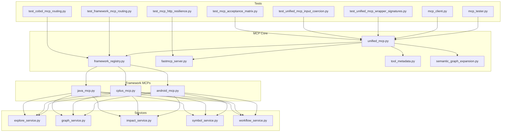
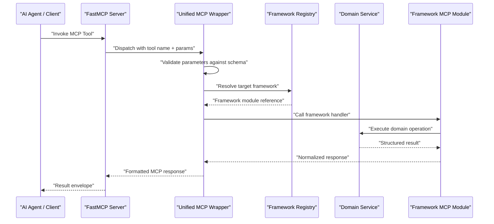
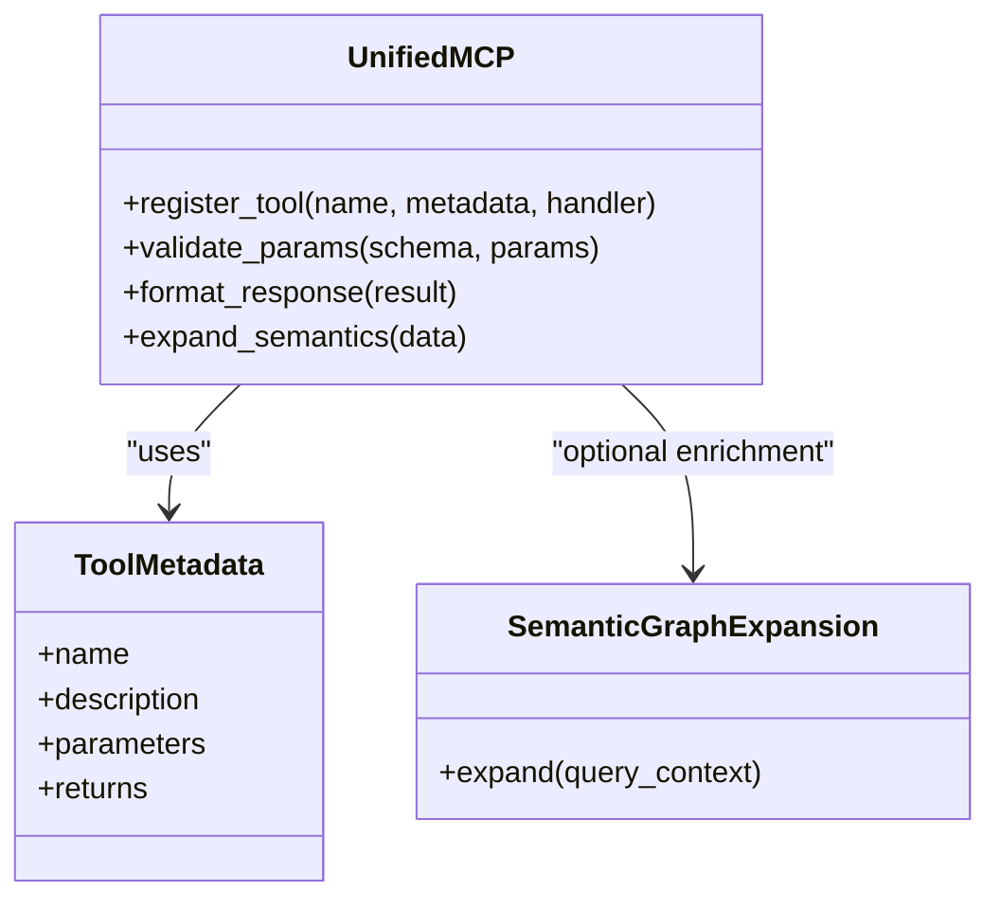
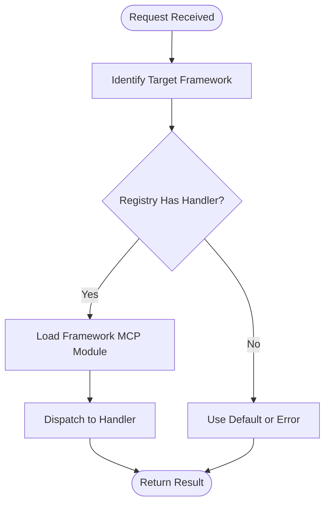
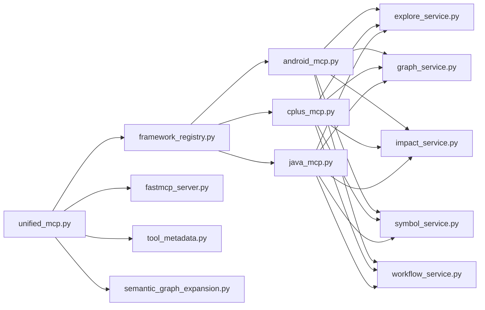
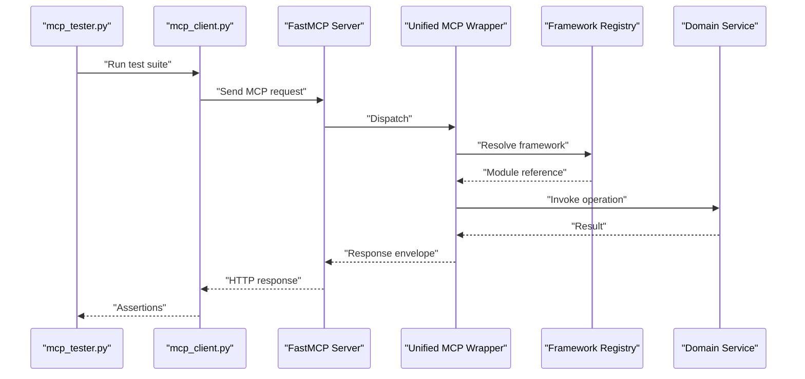

# MCP Capability Development

<cite>
**Referenced Files in This Document**
- [unified_mcp.py](file://code-tiny/mcp/unified_mcp.py)
- [framework_registry.py](file://code-tiny/mcp/framework_registry.py)
- [fastmcp_server.py](file://code-tiny/mcp/fastmcp_server.py)
- [tool_metadata.py](file://code-tiny/mcp/tool_metadata.py)
- [semantic_graph_expansion.py](file://code-tiny/mcp/semantic_graph_expansion.py)
- [android_mcp.py](file://code-tiny/mcp/android/android_mcp.py)
- [cplus_mcp.py](file://code-tiny/mcp/cplus/cplus_mcp.py)
- [java_mcp.py](file://code-tiny/mcp/java/java_mcp.py)
- [explore_service.py](file://code-tiny/mcp/services/explore_service.py)
- [graph_service.py](file://code-tiny/mcp/services/graph_service.py)
- [impact_service.py](file://code-tiny/mcp/services/impact_service.py)
- [symbol_service.py](file://code-tiny/mcp/services/symbol_service.py)
- [workflow_service.py](file://code-tiny/mcp/services/workflow_service.py)
- [mcp_tester.py](file://code-tiny/testtool/mcp_tester.py)
- [mcp_client.py](file://code-tiny/testtool/mcp_client.py)
- [test_unified_mcp_wrapper_signatures.py](file://tests/test_unified_mcp_wrapper_signatures.py)
- [test_unified_mcp_input_coercion.py](file://tests/test_unified_mcp_input_coercion.py)
- [test_framework_mcp_routing.py](file://tests/test_framework_mcp_routing.py)
- [test_cobol_mcp_routing.py](file://tests/test_cobol_mcp_routing.py)
- [test_mcp_acceptance_matrix.py](file://tests/test_mcp_acceptance_matrix.py)
- [test_mcp_http_resilience.py](file://tests/test_mcp_http_resilience.py)
- [mcp.md](file://docs/specs/mcp.md)
- [MCP_CAPABILITY_ACCEPTANCE_MATRIX.md](file://docs/MCP_CAPABILITY_ACCEPTANCE_MATRIX.md)
</cite>

## Table of Contents
1. [Introduction](#introduction)
2. [Project Structure](#project-structure)
3. [Core Components](#core-components)
4. [Architecture Overview](#architecture-overview)
5. [Detailed Component Analysis](#detailed-component-analysis)
6. [Dependency Analysis](#dependency-analysis)
7. [Performance Considerations](#performance-considerations)
8. [Security and Input Sanitization](#security-and-input-sanitization)
9. [Error Handling Patterns](#error-handling-patterns)
10. [Testing MCP Capabilities](#testing-mcp-capabilities)
11. [Integration with AI Agents](#integration-with-ai-agents)
12. [Conclusion](#conclusion)

## Introduction
This document explains how to develop custom Model Context Protocol (MCP) capabilities and tools within the repository. It covers the tool registration system, parameter validation schemas, response formatting standards, the unified MCP wrapper architecture, and capability routing mechanisms. It also provides step-by-step guidance for implementing query tools, search functions, and data transformation utilities, along with security considerations, input sanitization, error handling patterns, testing strategies, and integration practices with AI agents.

## Project Structure
The MCP implementation is centered under code-tiny/mcp and integrates with services and framework-specific modules. Key areas include:
- Unified MCP server and wrapper
- Framework registry and capability routing
- Service layer implementations (graph, symbol, explore, impact, workflow)
- Test harness and acceptance tests
- Documentation and specs

**Diagram sources**
- [unified_mcp.py](file://code-tiny/mcp/unified_mcp.py)
- [framework_registry.py](file://code-tiny/mcp/framework_registry.py)
- [fastmcp_server.py](file://code-tiny/mcp/fastmcp_server.py)
- [tool_metadata.py](file://code-tiny/mcp/tool_metadata.py)
- [semantic_graph_expansion.py](file://code-tiny/mcp/semantic_graph_expansion.py)
- [android_mcp.py](file://code-tiny/mcp/android/android_mcp.py)
- [cplus_mcp.py](file://code-tiny/mcp/cplus/cplus_mcp.py)
- [java_mcp.py](file://code-tiny/mcp/java/java_mcp.py)
- [explore_service.py](file://code-tiny/mcp/services/explore_service.py)
- [graph_service.py](file://code-tiny/mcp/services/graph_service.py)
- [impact_service.py](file://code-tiny/mcp/services/impact_service.py)
- [symbol_service.py](file://code-tiny/mcp/services/symbol_service.py)
- [workflow_service.py](file://code-tiny/mcp/services/workflow_service.py)
- [mcp_tester.py](file://code-tiny/testtool/mcp_tester.py)
- [mcp_client.py](file://code-tiny/testtool/mcp_client.py)
- [test_unified_mcp_wrapper_signatures.py](file://tests/test_unified_mcp_wrapper_signatures.py)
- [test_unified_mcp_input_coercion.py](file://tests/test_unified_mcp_input_coercion.py)
- [test_framework_mcp_routing.py](file://tests/test_framework_mcp_routing.py)
- [test_cobol_mcp_routing.py](file://tests/test_cobol_mcp_routing.py)
- [test_mcp_acceptance_matrix.py](file://tests/test_mcp_acceptance_matrix.py)
- [test_mcp_http_resilience.py](file://tests/test_mcp_http_resilience.py)

**Section sources**
- [unified_mcp.py](file://code-tiny/mcp/unified_mcp.py)
- [framework_registry.py](file://code-tiny/mcp/framework_registry.py)
- [fastmcp_server.py](file://code-tiny/mcp/fastmcp_server.py)
- [tool_metadata.py](file://code-tiny/mcp/tool_metadata.py)
- [semantic_graph_expansion.py](file://code-tiny/mcp/semantic_graph_expansion.py)
- [android_mcp.py](file://code-tiny/mcp/android/android_mcp.py)
- [cplus_mcp.py](file://code-tiny/mcp/cplus/cplus_mcp.py)
- [java_mcp.py](file://code-tiny/mcp/java/java_mcp.py)
- [explore_service.py](file://code-tiny/mcp/services/explore_service.py)
- [graph_service.py](file://code-tiny/mcp/services/graph_service.py)
- [impact_service.py](file://code-tiny/mcp/services/impact_service.py)
- [symbol_service.py](file://code-tiny/mcp/services/symbol_service.py)
- [workflow_service.py](file://code-tiny/mcp/services/workflow_service.py)
- [mcp_tester.py](file://code-tiny/testtool/mcp_tester.py)
- [mcp_client.py](file://code-tiny/testtool/mcp_client.py)
- [test_unified_mcp_wrapper_signatures.py](file://tests/test_unified_mcp_wrapper_signatures.py)
- [test_unified_mcp_input_coercion.py](file://tests/test_unified_mcp_input_coercion.py)
- [test_framework_mcp_routing.py](file://tests/test_framework_mcp_routing.py)
- [test_cobol_mcp_routing.py](file://tests/test_cobol_mcp_routing.py)
- [test_mcp_acceptance_matrix.py](file://tests/test_mcp_acceptance_matrix.py)
- [test_mcp_http_resilience.py](file://tests/test_mcp_http_resilience.py)

## Core Components
- Unified MCP Wrapper: Provides a consistent interface for registering tools, validating inputs against schemas, and formatting responses. It centralizes capability discovery and dispatch.
- Framework Registry: Maintains mappings between frameworks (Android, C++, Java, etc.) and their MCP modules, enabling dynamic loading and routing based on context.
- FastMCP Server: Exposes MCP endpoints and handles transport-level concerns such as HTTP resilience and request lifecycle.
- Tool Metadata: Defines tool descriptors, including names, descriptions, parameters, and return types used for schema generation and documentation.
- Semantic Graph Expansion: Enhances query results by expanding semantic relationships across the graph, improving answer richness.

Key responsibilities:
- Registration: Tools are registered via decorators or explicit registration calls that attach metadata and handlers.
- Validation: Parameter schemas enforce types, required fields, and constraints before invoking handlers.
- Formatting: Responses follow a standardized envelope structure suitable for MCP clients and AI agents.
- Routing: Requests are routed to framework-specific implementations using the registry and context.

**Section sources**
- [unified_mcp.py](file://code-tiny/mcp/unified_mcp.py)
- [framework_registry.py](file://code-tiny/mcp/framework_registry.py)
- [fastmcp_server.py](file://code-tiny/mcp/fastmcp_server.py)
- [tool_metadata.py](file://code-tiny/mcp/tool_metadata.py)
- [semantic_graph_expansion.py](file://code-tiny/mcp/semantic_graph_expansion.py)

## Architecture Overview
The MCP architecture layers separate transport, orchestration, and domain logic:
- Transport Layer: FastMCP server exposes endpoints and manages connection resilience.
- Orchestration Layer: Unified MCP wrapper validates inputs, formats outputs, and coordinates service calls.
- Domain Layer: Services implement concrete operations (graph queries, symbol lookups, exploration, impact analysis, workflows).
- Framework Layer: Framework-specific MCP modules adapt domain services to language/framework contexts.

**Diagram sources**
- [fastmcp_server.py](file://code-tiny/mcp/fastmcp_server.py)
- [unified_mcp.py](file://code-tiny/mcp/unified_mcp.py)
- [framework_registry.py](file://code-tiny/mcp/framework_registry.py)
- [android_mcp.py](file://code-tiny/mcp/android/android_mcp.py)
- [cplus_mcp.py](file://code-tiny/mcp/cplus/cplus_mcp.py)
- [java_mcp.py](file://code-tiny/mcp/java/java_mcp.py)
- [explore_service.py](file://code-tiny/mcp/services/explore_service.py)
- [graph_service.py](file://code-tiny/mcp/services/graph_service.py)
- [impact_service.py](file://code-tiny/mcp/services/impact_service.py)
- [symbol_service.py](file://code-tiny/mcp/services/symbol_service.py)
- [workflow_service.py](file://code-tiny/mcp/services/workflow_service.py)

## Detailed Component Analysis

### Unified MCP Wrapper
Responsibilities:
- Tool registration API
- Schema-based parameter validation
- Response envelope formatting
- Integration with semantic graph expansion

Implementation highlights:
- Decorators or registration functions bind tool names to handlers and metadata.
- Validation uses declared schemas to coerce and check inputs prior to execution.
- Responses are wrapped into a consistent structure for MCP consumers.
- Optional enrichment steps can expand results using semantic graph relations.

**Diagram sources**
- [unified_mcp.py](file://code-tiny/mcp/unified_mcp.py)
- [tool_metadata.py](file://code-tiny/mcp/tool_metadata.py)
- [semantic_graph_expansion.py](file://code-tiny/mcp/semantic_graph_expansion.py)

**Section sources**
- [unified_mcp.py](file://code-tiny/mcp/unified_mcp.py)
- [tool_metadata.py](file://code-tiny/mcp/tool_metadata.py)
- [semantic_graph_expansion.py](file://code-tiny/mcp/semantic_graph_expansion.py)

### Framework Registry and Capability Routing
Responsibilities:
- Maintain mappings from framework identifiers to MCP modules
- Resolve the appropriate implementation at runtime based on context
- Provide fallbacks and capability checks

Routing flow:
- The wrapper requests resolution from the registry using context (e.g., project type).
- The registry returns the matching framework MCP module.
- The wrapper invokes the module’s handler, which delegates to domain services.

**Diagram sources**
- [framework_registry.py](file://code-tiny/mcp/framework_registry.py)
- [android_mcp.py](file://code-tiny/mcp/android/android_mcp.py)
- [cplus_mcp.py](file://code-tiny/mcp/cplus/cplus_mcp.py)
- [java_mcp.py](file://code-tiny/mcp/java/java_mcp.py)

**Section sources**
- [framework_registry.py](file://code-tiny/mcp/framework_registry.py)
- [android_mcp.py](file://code-tiny/mcp/android/android_mcp.py)
- [cplus_mcp.py](file://code-tiny/mcp/cplus/cplus_mcp.py)
- [java_mcp.py](file://code-tiny/mcp/java/java_mcp.py)

### Service Layer Operations
Services encapsulate domain logic:
- Explore Service: High-level exploration operations combining multiple signals.
- Graph Service: Graph traversal and query operations.
- Symbol Service: Symbol lookup and cross-reference resolution.
- Impact Service: Change impact analysis and propagation.
- Workflow Service: Orchestrates multi-step processes.

These services are invoked by framework MCP modules and return structured data consumed by the wrapper.

**Section sources**
- [explore_service.py](file://code-tiny/mcp/services/explore_service.py)
- [graph_service.py](file://code-tiny/mcp/services/graph_service.py)
- [impact_service.py](file://code-tiny/mcp/services/impact_service.py)
- [symbol_service.py](file://code-tiny/mcp/services/symbol_service.py)
- [workflow_service.py](file://code-tiny/mcp/services/workflow_service.py)

### Step-by-Step Examples

#### Implementing a Custom Query Tool
Steps:
1. Define tool metadata (name, description, parameters, returns).
2. Register the tool with the unified wrapper using the registration API.
3. Implement the handler to call relevant services (e.g., graph or symbol services).
4. Ensure parameter validation schemas match expected inputs.
5. Return results in the standard response envelope.

References:
- Tool metadata definition and usage
- Unified wrapper registration and validation
- Service invocation patterns

**Section sources**
- [tool_metadata.py](file://code-tiny/mcp/tool_metadata.py)
- [unified_mcp.py](file://code-tiny/mcp/unified_mcp.py)
- [graph_service.py](file://code-tiny/mcp/services/graph_service.py)
- [symbol_service.py](file://code-tiny/mcp/services/symbol_service.py)

#### Implementing a Search Function
Steps:
1. Create a search tool descriptor with parameters like query text, filters, and scope.
2. Register the tool with the wrapper.
3. In the handler, use explore or graph services to perform search and ranking.
4. Apply optional semantic expansion to enrich results.
5. Format the response consistently.

References:
- Search-related service methods
- Semantic graph expansion utility
- Wrapper formatting

**Section sources**
- [explore_service.py](file://code-tiny/mcp/services/explore_service.py)
- [semantic_graph_expansion.py](file://code-tiny/mcp/semantic_graph_expansion.py)
- [unified_mcp.py](file://code-tiny/mcp/unified_mcp.py)

#### Implementing a Data Transformation Utility
Steps:
1. Define a transformation tool with clear input/output schemas.
2. Register it with the wrapper.
3. Implement the handler to transform data structures (e.g., normalize, aggregate).
4. Validate outputs against the declared return schema.
5. Return the transformed data in the standard envelope.

References:
- Wrapper validation and formatting
- Service transformation patterns

**Section sources**
- [unified_mcp.py](file://code-tiny/mcp/unified_mcp.py)
- [impact_service.py](file://code-tiny/mcp/services/impact_service.py)

## Dependency Analysis
The MCP core depends on framework modules and services. Tests validate signatures, coercion, routing, acceptance criteria, and HTTP resilience.

**Diagram sources**
- [unified_mcp.py](file://code-tiny/mcp/unified_mcp.py)
- [framework_registry.py](file://code-tiny/mcp/framework_registry.py)
- [fastmcp_server.py](file://code-tiny/mcp/fastmcp_server.py)
- [tool_metadata.py](file://code-tiny/mcp/tool_metadata.py)
- [semantic_graph_expansion.py](file://code-tiny/mcp/semantic_graph_expansion.py)
- [android_mcp.py](file://code-tiny/mcp/android/android_mcp.py)
- [cplus_mcp.py](file://code-tiny/mcp/cplus/cplus_mcp.py)
- [java_mcp.py](file://code-tiny/mcp/java/java_mcp.py)
- [explore_service.py](file://code-tiny/mcp/services/explore_service.py)
- [graph_service.py](file://code-tiny/mcp/services/graph_service.py)
- [impact_service.py](file://code-tiny/mcp/services/impact_service.py)
- [symbol_service.py](file://code-tiny/mcp/services/symbol_service.py)
- [workflow_service.py](file://code-tiny/mcp/services/workflow_service.py)

**Section sources**
- [unified_mcp.py](file://code-tiny/mcp/unified_mcp.py)
- [framework_registry.py](file://code-tiny/mcp/framework_registry.py)
- [fastmcp_server.py](file://code-tiny/mcp/fastmcp_server.py)
- [tool_metadata.py](file://code-tiny/mcp/tool_metadata.py)
- [semantic_graph_expansion.py](file://code-tiny/mcp/semantic_graph_expansion.py)
- [android_mcp.py](file://code-tiny/mcp/android/android_mcp.py)
- [cplus_mcp.py](file://code-tiny/mcp/cplus/cplus_mcp.py)
- [java_mcp.py](file://code-tiny/mcp/java/java_mcp.py)
- [explore_service.py](file://code-tiny/mcp/services/explore_service.py)
- [graph_service.py](file://code-tiny/mcp/services/graph_service.py)
- [impact_service.py](file://code-tiny/mcp/services/impact_service.py)
- [symbol_service.py](file://code-tiny/mcp/services/symbol_service.py)
- [workflow_service.py](file://code-tiny/mcp/services/workflow_service.py)

## Performance Considerations
- Prefer batched operations in services to reduce round-trips.
- Cache frequently accessed graph segments or symbol indices where appropriate.
- Use pagination for large result sets to avoid memory pressure.
- Avoid unnecessary semantic expansion unless explicitly requested.
- Monitor and profile service latency; consider async execution for I/O-bound tasks.

[No sources needed since this section provides general guidance]

## Security and Input Sanitization
Guidelines:
- Always validate inputs against declared schemas before processing.
- Sanitize strings and paths to prevent injection or unintended file access.
- Enforce scope limits (e.g., only allow queries within active projects).
- Limit resource consumption (max depth, max result size).
- Log errors without exposing sensitive details.

Validation and enforcement are handled centrally by the unified wrapper and should be extended in framework modules when additional constraints apply.

**Section sources**
- [unified_mcp.py](file://code-tiny/mcp/unified_mcp.py)
- [fastmcp_server.py](file://code-tiny/mcp/fastmcp_server.py)

## Error Handling Patterns
Recommended patterns:
- Wrap exceptions in standardized error envelopes with codes and messages.
- Distinguish between client errors (validation failures) and server errors (internal faults).
- Provide actionable hints for remediation (e.g., missing required fields).
- Ensure graceful degradation when dependencies fail (e.g., graph unavailable).

Test coverage includes error scenarios and resilience behaviors.

**Section sources**
- [test_unified_mcp_wrapper_signatures.py](file://tests/test_unified_mcp_wrapper_signatures.py)
- [test_unified_mcp_input_coercion.py](file://tests/test_unified_mcp_input_coercion.py)
- [test_mcp_http_resilience.py](file://tests/test_mcp_http_resilience.py)

## Testing MCP Capabilities
Approach:
- Unit tests for wrapper signatures and input coercion.
- Integration tests for routing across frameworks.
- Acceptance matrix tests to verify capability coverage.
- HTTP resilience tests to ensure robustness under failure conditions.
- Use the test client and tester utilities to simulate MCP calls.

**Diagram sources**
- [mcp_tester.py](file://code-tiny/testtool/mcp_tester.py)
- [mcp_client.py](file://code-tiny/testtool/mcp_client.py)
- [fastmcp_server.py](file://code-tiny/mcp/fastmcp_server.py)
- [unified_mcp.py](file://code-tiny/mcp/unified_mcp.py)
- [framework_registry.py](file://code-tiny/mcp/framework_registry.py)
- [explore_service.py](file://code-tiny/mcp/services/explore_service.py)
- [graph_service.py](file://code-tiny/mcp/services/graph_service.py)
- [impact_service.py](file://code-tiny/mcp/services/impact_service.py)
- [symbol_service.py](file://code-tiny/mcp/services/symbol_service.py)
- [workflow_service.py](file://code-tiny/mcp/services/workflow_service.py)

**Section sources**
- [test_unified_mcp_wrapper_signatures.py](file://tests/test_unified_mcp_wrapper_signatures.py)
- [test_unified_mcp_input_coercion.py](file://tests/test_unified_mcp_input_coercion.py)
- [test_framework_mcp_routing.py](file://tests/test_framework_mcp_routing.py)
- [test_cobol_mcp_routing.py](file://tests/test_cobol_mcp_routing.py)
- [test_mcp_acceptance_matrix.py](file://tests/test_mcp_acceptance_matrix.py)
- [test_mcp_http_resilience.py](file://tests/test_mcp_http_resilience.py)
- [mcp_tester.py](file://code-tiny/testtool/mcp_tester.py)
- [mcp_client.py](file://code-tiny/testtool/mcp_client.py)

## Integration with AI Agents
To integrate MCP capabilities with AI agents:
- Expose MCP endpoints via the FastMCP server.
- Ensure tool metadata is accurate so agents can discover and invoke tools correctly.
- Follow the response envelope format for predictable parsing.
- Use the acceptance matrix and spec documents to align agent expectations.

**Section sources**
- [fastmcp_server.py](file://code-tiny/mcp/fastmcp_server.py)
- [tool_metadata.py](file://code-tiny/mcp/tool_metadata.py)
- [MCP_CAPABILITY_ACCEPTANCE_MATRIX.md](file://docs/MCP_CAPABILITY_ACCEPTANCE_MATRIX.md)
- [mcp.md](file://docs/specs/mcp.md)

## Conclusion
Developing custom MCP capabilities involves defining clear tool metadata, registering them through the unified wrapper, enforcing parameter validation, and returning standardized responses. The framework registry enables routing to language-specific implementations, while services provide reusable domain logic. Robust testing and adherence to security and error handling patterns ensure reliable integration with AI agents.

[No sources needed since this section summarizes without analyzing specific files]