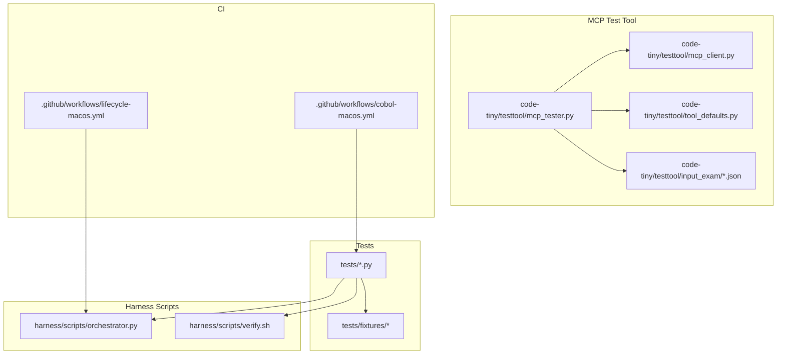
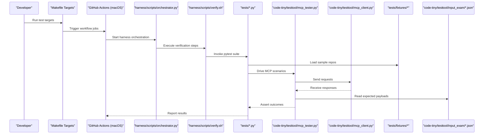
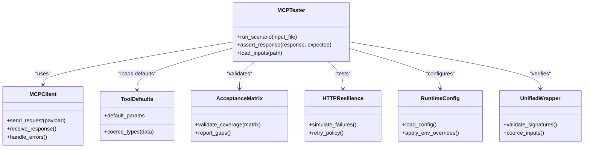
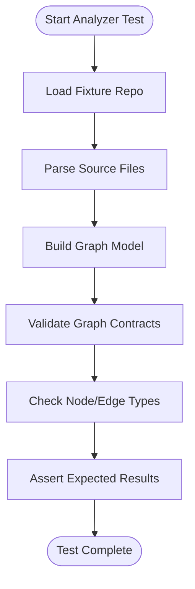
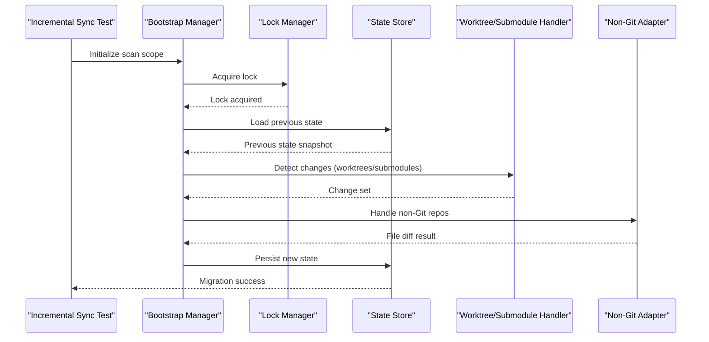
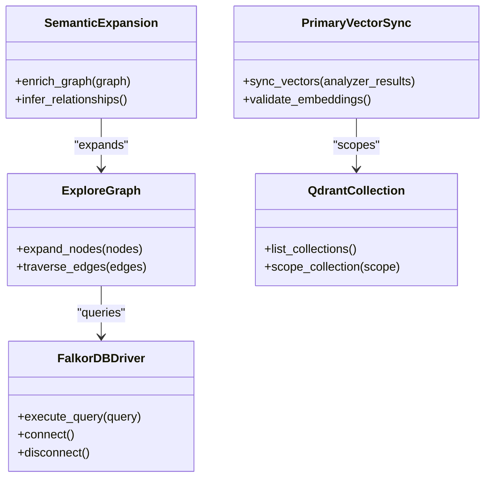
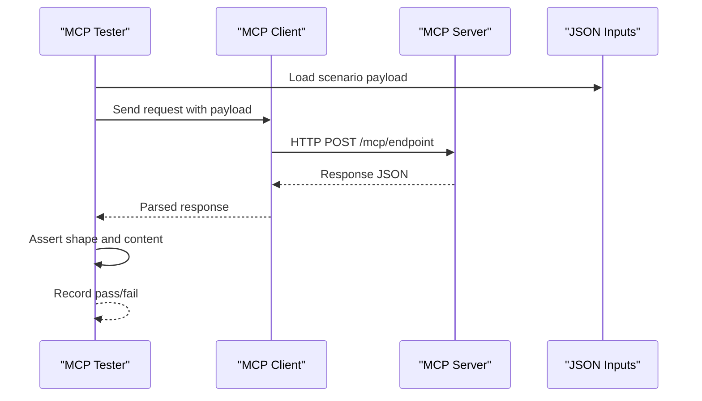
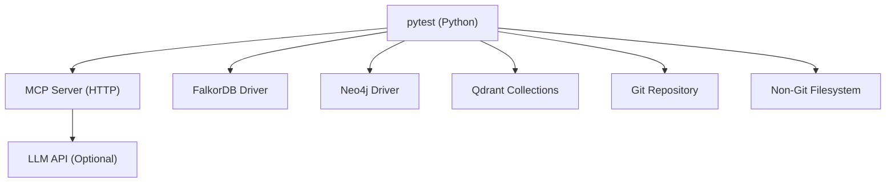

# Testing Strategies & Guidelines

<cite>
**Referenced Files in This Document**
- [ReadMe.md](file://ReadMe.md)
- [Makefile](file://Makefile)
- [pyproject.toml](file://pyproject.toml)
- [requirements.txt](file://requirements.txt)
- [test_mcp_acceptance_matrix.py](file://tests/test_mcp_acceptance_matrix.py)
- [test_mcp_http_resilience.py](file://tests/test_mcp_http_resilience.py)
- [test_mcp_runtime_config.py](file://tests/test_mcp_runtime_config.py)
- [test_framework_mcp_flows.py](file://tests/test_framework_mcp_flows.py)
- [test_framework_mcp_routing.py](file://tests/test_framework_mcp_routing.py)
- [test_framework_mcp_search.py](file://tests/test_framework_mcp_search.py)
- [test_unified_mcp_input_coercion.py](file://tests/test_unified_mcp_input_coercion.py)
- [test_unified_mcp_wrapper_signatures.py](file://tests/test_unified_mcp_wrapper_signatures.py)
- [test_cobol_analyzer_imports.py](file://tests/test_cobol_analyzer_imports.py)
- [test_cobol_error_recovery.py](file://tests/test_cobol_error_recovery.py)
- [test_cobol_fact_contract.py](file://tests/test_cobol_fact_contract.py)
- [test_cobol_fixture_analysis.py](file://tests/test_cobol_fixture_analysis.py)
- [test_cobol_graph_contract.py](file://tests/test_cobol_graph_contract.py)
- [test_cobol_incremental_resolution.py](file://tests/test_cobol_incremental_resolution.py)
- [test_cobol_mcp_routing.py](file://tests/test_cobol_mcp_routing.py)
- [test_cobol_parser_runtime.py](file://tests/test_cobol_parser_runtime.py)
- [test_cobol_performance.py](file://tests/test_cobol_performance.py)
- [test_cobol_qdrant_contract.py](file://tests/test_cobol_qdrant_contract.py)
- [test_cobol_source_formats.py](file://tests/test_cobol_source_formats.py)
- [test_aspnet_analyzer_imports.py](file://tests/test_aspnet_analyzer_imports.py)
- [test_aspnet_fixture_analysis.py](file://tests/test_aspnet_fixture_analysis.py)
- [test_aspnet_graph_contract.py](file://tests/test_aspnet_graph_contract.py)
- [test_aspnet_integration.py](file://tests/test_aspnet_integration.py)
- [test_aspnet_protocol_and_security.py](file://tests/test_aspnet_protocol_and_security.py)
- [test_dart_fixture_analysis.py](file://tests/test_dart_fixture_analysis.py)
- [test_dart_incremental_resolution.py](file://tests/test_dart_incremental_resolution.py)
- [test_flutter_analyzer_imports.py](file://tests/test_flutter_analyzer_imports.py)
- [test_flutter_project_detection.py](file://tests/test_flutter_project_detection.py)
- [test_flutter_protocol.py](file://tests/test_flutter_protocol.py)
- [test_framework_analyzer_imports.py](file://tests/test_framework_analyzer_imports.py)
- [test_framework_fixture_analysis.py](file://tests/test_framework_fixture_analysis.py)
- [test_framework_graph_contract.py](file://tests/test_framework_graph_contract.py)
- [test_git_change_detection.py](file://tests/test_git_change_detection.py)
- [test_graphrag_ingest_langextract.py](file://tests/test_graphrag_ingest_langextract.py)
- [test_incremental_sync_bootstrap.py](file://tests/test_incremental_sync_bootstrap.py)
- [test_incremental_sync_cobol.py](file://tests/test_incremental_sync_cobol.py)
- [test_incremental_sync_framework_overlays.py](file://tests/test_incremental_sync_framework_overlays.py)
- [test_incremental_sync_graph_setup.py](file://tests/test_incremental_sync_graph_setup.py)
- [test_incremental_sync_lock.py](file://tests/test_incremental_sync_lock.py)
- [test_incremental_sync_non_git.py](file://tests/test_incremental_sync_non_git.py)
- [test_incremental_sync_state_migration.py](file://tests/test_incremental_sync_state_migration.py)
- [test_incremental_sync_submodules.py](file://tests/test_incremental_sync_submodules.py)
- [test_incremental_sync_worktree.py](file://tests/test_incremental_sync_worktree.py)
- [test_make_lifecycle.py](file://tests/test_make_lifecycle.py)
- [test_primary_analyzer_vector_contract.py](file://tests/test_primary_analyzer_vector_contract.py)
- [test_primary_vector_sync.py](file://tests/test_primary_vector_sync.py)
- [test_qdrant_collection_scope.py](file://tests/test_qdrant_collection_scope.py)
- [test_semantic_graph_expansion.py](file://tests/test_semantic_graph_expansion.py)
- [test_source_inventory.py](file://tests/test_source_inventory.py)
- [test_struts_common_integration.py](file://tests/test_struts_common_integration.py)
- [test_struts_scan_filtering.py](file://tests/test_struts_scan_filtering.py)
- [test_validate_retrieval.py](file://tests/test_validate_retrieval.py)
- [test_web_framework_overlay.py](file://tests/test_web_framework_overlay.py)
- [test_dev_cobol_parser_discovery.py](file://tests/test_dev_cobol_parser_discovery.py)
- [test_dev_framework_parser_discovery.py](file://tests/test_dev_framework_parser_discovery.py)
- [test_dev_init_graph_provider.py](file://tests/test_dev_init_graph_provider.py)
- [test_dev_lifecycle_commands.py](file://tests/test_dev_lifecycle_commands.py)
- [test_dev_sync_reliability.py](file://tests/test_dev_sync_reliability.py)
- [test_doc_graph_store.py](file://tests/test_doc_graph_store.py)
- [test_explore_graph_falkor_compat.py](file://tests/test_explore_graph_falkor_compat.py)
- [test_falkordb_driver.py](file://tests/test_falkordb_driver.py)
- [test_database_schema_overlay.py](file://tests/test_database_schema_overlay.py)
- [test_perl_incremental.py](file://tests/test_perl_incremental.py)
- [test_perl_integration.py](file://tests/test_perl_integration.py)
- [test_perl_parser.py](file://tests/test_perl_parser.py)
- [cplus_windows_resource_parser_test.py](file://tests/test_cplus_windows_resource_parser.py)
- [.github/workflows/lifecycle-macos.yml](file://.github/workflows/lifecycle-macos.yml)
- [.github/workflows/cobol-macos.yml](file://.github/workflows/cobol-macos.yml)
- [harness/scripts/orchestrator.py](file://harness/scripts/orchestrator.py)
- [harness/scripts/verify.sh](file://harness/scripts/verify.sh)
- [code-tiny/testtool/mcp_tester.py](file://code-tiny/testtool/mcp_tester.py)
- [code-tiny/testtool/mcp_client.py](file://code-tiny/testtool/mcp_client.py)
- [code-tiny/testtool/tool_defaults.py](file://code-tiny/testtool/tool_defaults.py)
- [code-tiny/testtool/input_exam/search_by_code.json](file://code-tiny/testtool/input_exam/search_by_code.json)
- [code-tiny/testtool/input_exam/query_subgraph.json](file://code-tiny/testtool/input_exam/query_subgraph.json)
- [code-tiny/testtool/input_exam/find_paths.json](file://code-tiny/testtool/input_exam/find_paths.json)
- [code-tiny/testtool/input_exam/trace_flow.json](file://code-tiny/testtool/input_exam/trace_flow.json)
- [code-tiny/testtool/input_exam/get_node_details.json](file://code-tiny/testtool/input_exam/get_node_details.json)
- [code-tiny/testtool/input_exam/listup_class_matching_path.json](file://code-tiny/testtool/input_exam/listup_class_matching_path.json)
- [code-tiny/testtool/input_exam/semantic_search.json](file://code-tiny/testtool/input_exam/semantic_search.json)
- [code-tiny/testtool/input_exam/annotate_node.json](file://code-tiny/testtool/input_exam/annotate_node.json)
- [code-tiny/testtool/input_exam/find_path_between_module.json](file://code-tiny/testtool/input_exam/find_path_between_module.json)
- [code-tiny/testtool/input_exam/get_ipc_message.json](file://code-tiny/testtool/input_exam/get_ipc_message.json)
- [code-tiny/testtool/input_exam/list_possible_calls.json](file://code-tiny/testtool/input_exam/list_possible_calls.json)
- [code-tiny/testtool/input_exam/list_up_entrypoint.json](file://code-tiny/testtool/input_exam/list_up_entrypoint.json)
- [code-tiny/testtool/input_exam/list_qdrant_collections.json](file://code-tiny/testtool/input_exam/list_qdrant_collections.json)
- [code-tiny/testtool/input_exam/test_find_path.json](file://code-tiny/testtool/input_exam/test_find_path.json)
- [code-tiny/testtool/input_exam/activate_project.json](file://code-tiny/testtool/input_exam/activate_project.json)
- [code-tiny/testtool/input_exam/trace_flow_between_module.json](file://code-tiny/testtool/input_exam/trace_flow_between_module.json)
</cite>

## Table of Contents
1. [Introduction](#introduction)
2. [Project Structure](#project-structure)
3. [Core Components](#core-components)
4. [Architecture Overview](#architecture-overview)
5. [Detailed Component Analysis](#detailed-component-analysis)
6. [Dependency Analysis](#dependency-analysis)
7. [Performance Considerations](#performance-considerations)
8. [Troubleshooting Guide](#troubleshooting-guide)
9. [Conclusion](#conclusion)
10. [Appendices](#appendices)

## Introduction
This document defines the comprehensive testing strategy for Cortex Harness development. It covers unit tests, integration tests, and end-to-end validation suites; test fixture management across languages and frameworks; mocking strategies for external dependencies such as graph databases, vector search, and LLM APIs; performance testing and benchmarking procedures; continuous integration pipelines and automated quality gates; guidelines for writing effective tests for analyzers, MCP capabilities, and graph operations; debugging techniques for failing tests; and test data management strategies.

The goal is to provide a consistent, scalable, and maintainable approach that ensures correctness, reliability, and performance across all components of Cortex Harness.

## Project Structure
Cortex Harness organizes tests under a dedicated directory with fixtures and specialized tooling:
- tests/: Python-based unit and integration tests organized by feature and component
- tests/fixtures/: Sample code repositories and minimal project structures used by analyzer and framework tests
- code-tiny/testtool/: MCP client and tester utilities, plus input examples for end-to-end scenarios
- harness/scripts/: Orchestration and verification scripts used by lifecycle and dev workflows
- .github/workflows/: CI configuration for macOS-based lifecycle and Cobol-specific runs

**Diagram sources**
- [test_mcp_acceptance_matrix.py](file://tests/test_mcp_acceptance_matrix.py)
- [test_framework_mcp_flows.py](file://tests/test_framework_mcp_flows.py)
- [test_cobol_fixture_analysis.py](file://tests/test_cobol_fixture_analysis.py)
- [code-tiny/testtool/mcp_tester.py](file://code-tiny/testtool/mcp_tester.py)
- [code-tiny/testtool/mcp_client.py](file://code-tiny/testtool/mcp_client.py)
- [code-tiny/testtool/tool_defaults.py](file://code-tiny/testtool/tool_defaults.py)
- [code-tiny/testtool/input_exam/search_by_code.json](file://code-tiny/testtool/input_exam/search_by_code.json)
- [harness/scripts/orchestrator.py](file://harness/scripts/orchestrator.py)
- [harness/scripts/verify.sh](file://harness/scripts/verify.sh)
- [.github/workflows/lifecycle-macos.yml](file://.github/workflows/lifecycle-macos.yml)
- [.github/workflows/cobol-macos.yml](file://.github/workflows/cobol-macos.yml)

**Section sources**
- [ReadMe.md](file://ReadMe.md)
- [Makefile](file://Makefile)
- [pyproject.toml](file://pyproject.toml)
- [requirements.txt](file://requirements.txt)

## Core Components
This section outlines the primary testing layers and their responsibilities:

- Unit Tests
  - Validate individual functions, classes, and modules (e.g., parser runtime, contract checks, import discovery).
  - Examples include Cobol parser runtime behavior, fact contracts, error recovery, source formats, and analyzer imports.
  - Typical files:
    - [test_cobol_parser_runtime.py](file://tests/test_cobol_parser_runtime.py)
    - [test_cobol_fact_contract.py](file://tests/test_cobol_fact_contract.py)
    - [test_cobol_error_recovery.py](file://tests/test_cobol_error_recovery.py)
    - [test_cobol_source_formats.py](file://tests/test_cobol_source_formats.py)
    - [test_cobol_analyzer_imports.py](file://tests/test_cobol_analyzer_imports.py)

- Integration Tests
  - Exercise multi-component flows including analyzers, graph contracts, MCP routing, incremental sync, and overlays.
  - Examples include ASP.NET integration, Cobol MCP routing, framework MCP flows, and database schema overlay.
  - Typical files:
    - [test_aspnet_integration.py](file://tests/test_aspnet_integration.py)
    - [test_cobol_mcp_routing.py](file://tests/test_cobol_mcp_routing.py)
    - [test_framework_mcp_flows.py](file://tests/test_framework_mcp_flows.py)
    - [test_database_schema_overlay.py](file://tests/test_database_schema_overlay.py)

- End-to-End Validation Suites
  - Use MCP tester and client utilities with JSON inputs to validate full analysis and query workflows.
  - Input examples cover semantic search, path finding, flow tracing, node details, and collection listing.
  - Typical files:
    - [code-tiny/testtool/mcp_tester.py](file://code-tiny/testtool/mcp_tester.py)
    - [code-tiny/testtool/mcp_client.py](file://code-tiny/testtool/mcp_client.py)
    - [code-tiny/testtool/tool_defaults.py](file://code-tiny/testtool/tool_defaults.py)
    - [code-tiny/testtool/input_exam/search_by_code.json](file://code-tiny/testtool/input_exam/search_by_code.json)
    - [code-tiny/testtool/input_exam/query_subgraph.json](file://code-tiny/testtool/input_exam/query_subgraph.json)
    - [code-tiny/testtool/input_exam/find_paths.json](file://code-tiny/testtool/input_exam/find_paths.json)
    - [code-tiny/testtool/input_exam/trace_flow.json](file://code-tiny/testtool/input_exam/trace_flow.json)
    - [code-tiny/testtool/input_exam/get_node_details.json](file://code-tiny/testtool/input_exam/get_node_details.json)
    - [code-tiny/testtool/input_exam/listup_class_matching_path.json](file://code-tiny/testtool/input_exam/listup_class_matching_path.json)
    - [code-tiny/testtool/input_exam/semantic_search.json](file://code-tiny/testtool/input_exam/semantic_search.json)
    - [code-tiny/testtool/input_exam/annotate_node.json](file://code-tiny/testtool/input_exam/annotate_node.json)
    - [code-tiny/testtool/input_exam/find_path_between_module.json](file://code-tiny/testtool/input_exam/find_path_between_module.json)
    - [code-tiny/testtool/input_exam/get_ipc_message.json](file://code-tiny/testtool/input_exam/get_ipc_message.json)
    - [code-tiny/testtool/input_exam/list_possible_calls.json](file://code-tiny/testtool/input_exam/list_possible_calls.json)
    - [code-tiny/testtool/input_exam/list_up_entrypoint.json](file://code-tiny/testtool/input_exam/list_up_entrypoint.json)
    - [code-tiny/testtool/input_exam/list_qdrant_collections.json](file://code-tiny/testtool/input_exam/list_qdrant_collections.json)
    - [code-tiny/testtool/input_exam/test_find_path.json](file://code-tiny/testtool/input_exam/test_find_path.json)
    - [code-tiny/testtool/input_exam/activate_project.json](file://code-tiny/testtool/input_exam/activate_project.json)
    - [code-tiny/testtool/input_exam/trace_flow_between_module.json](file://code-tiny/testtool/input_exam/trace_flow_between_module.json)

- Graph Operations and Vector Contracts
  - Validate FalkorDB driver compatibility, Qdrant collection scoping, primary vector sync, and semantic graph expansion.
  - Typical files:
    - [test_falkordb_driver.py](file://tests/test_falkordb_driver.py)
    - [test_explore_graph_falkor_compat.py](file://tests/test_explore_graph_falkor_compat.py)
    - [test_qdrant_collection_scope.py](file://tests/test_qdrant_collection_scope.py)
    - [test_primary_vector_sync.py](file://tests/test_primary_vector_sync.py)
    - [test_primary_analyzer_vector_contract.py](file://tests/test_primary_analyzer_vector_contract.py)
    - [test_semantic_graph_expansion.py](file://tests/test_semantic_graph_expansion.py)

- MCP Acceptance and Resilience
  - Verify acceptance matrix coverage, HTTP resilience, runtime config, unified wrapper signatures, and input coercion.
  - Typical files:
    - [test_mcp_acceptance_matrix.py](file://tests/test_mcp_acceptance_matrix.py)
    - [test_mcp_http_resilience.py](file://tests/test_mcp_http_resilience.py)
    - [test_mcp_runtime_config.py](file://tests/test_mcp_runtime_config.py)
    - [test_unified_mcp_wrapper_signatures.py](file://tests/test_unified_mcp_wrapper_signatures.py)
    - [test_unified_mcp_input_coercion.py](file://tests/test_unified_mcp_input_coercion.py)

- Incremental Sync and Lifecycle
  - Ensure reliable incremental scanning, lock handling, state migration, worktree/submodule support, and non-Git environments.
  - Typical files:
    - [test_incremental_sync_bootstrap.py](file://tests/test_incremental_sync_bootstrap.py)
    - [test_incremental_sync_lock.py](file://tests/test_incremental_sync_lock.py)
    - [test_incremental_sync_state_migration.py](file://tests/test_incremental_sync_state_migration.py)
    - [test_incremental_sync_worktree.py](file://tests/test_incremental_sync_worktree.py)
    - [test_incremental_sync_submodules.py](file://tests/test_incremental_sync_submodules.py)
    - [test_incremental_sync_non_git.py](file://tests/test_incremental_sync_non_git.py)
    - [test_make_lifecycle.py](file://tests/test_make_lifecycle.py)

**Section sources**
- [test_cobol_parser_runtime.py](file://tests/test_cobol_parser_runtime.py)
- [test_cobol_fact_contract.py](file://tests/test_cobol_fact_contract.py)
- [test_cobol_error_recovery.py](file://tests/test_cobol_error_recovery.py)
- [test_cobol_source_formats.py](file://tests/test_cobol_source_formats.py)
- [test_cobol_analyzer_imports.py](file://tests/test_cobol_analyzer_imports.py)
- [test_aspnet_integration.py](file://tests/test_aspnet_integration.py)
- [test_cobol_mcp_routing.py](file://tests/test_cobol_mcp_routing.py)
- [test_framework_mcp_flows.py](file://tests/test_framework_mcp_flows.py)
- [test_database_schema_overlay.py](file://tests/test_database_schema_overlay.py)
- [code-tiny/testtool/mcp_tester.py](file://code-tiny/testtool/mcp_tester.py)
- [code-tiny/testtool/mcp_client.py](file://code-tiny/testtool/mcp_client.py)
- [code-tiny/testtool/tool_defaults.py](file://code-tiny/testtool/tool_defaults.py)
- [code-tiny/testtool/input_exam/search_by_code.json](file://code-tiny/testtool/input_exam/search_by_code.json)
- [test_falkordb_driver.py](file://tests/test_falkordb_driver.py)
- [test_explore_graph_falkor_compat.py](file://tests/test_explore_graph_falkor_compat.py)
- [test_qdrant_collection_scope.py](file://tests/test_qdrant_collection_scope.py)
- [test_primary_vector_sync.py](file://tests/test_primary_vector_sync.py)
- [test_primary_analyzer_vector_contract.py](file://tests/test_primary_analyzer_vector_contract.py)
- [test_semantic_graph_expansion.py](file://tests/test_semantic_graph_expansion.py)
- [test_mcp_acceptance_matrix.py](file://tests/test_mcp_acceptance_matrix.py)
- [test_mcp_http_resilience.py](file://tests/test_mcp_http_resilience.py)
- [test_mcp_runtime_config.py](file://tests/test_mcp_runtime_config.py)
- [test_unified_mcp_wrapper_signatures.py](file://tests/test_unified_mcp_wrapper_signatures.py)
- [test_unified_mcp_input_coercion.py](file://tests/test_unified_mcp_input_coercion.py)
- [test_incremental_sync_bootstrap.py](file://tests/test_incremental_sync_bootstrap.py)
- [test_incremental_sync_lock.py](file://tests/test_incremental_sync_lock.py)
- [test_incremental_sync_state_migration.py](file://tests/test_incremental_sync_state_migration.py)
- [test_incremental_sync_worktree.py](file://tests/test_incremental_sync_worktree.py)
- [test_incremental_sync_submodules.py](file://tests/test_incremental_sync_submodules.py)
- [test_incremental_sync_non_git.py](file://tests/test_incremental_sync_non_git.py)
- [test_make_lifecycle.py](file://tests/test_make_lifecycle.py)

## Architecture Overview
The testing architecture spans multiple layers:
- Unit layer validates core logic and contracts
- Integration layer exercises cross-component interactions (analyzers, MCP, graph ops)
- E2E layer uses MCP tester/client with JSON inputs to drive real-world scenarios
- CI orchestrates tests via Make targets and GitHub Actions on macOS

**Diagram sources**
- [Makefile](file://Makefile)
- [.github/workflows/lifecycle-macos.yml](file://.github/workflows/lifecycle-macos.yml)
- [harness/scripts/orchestrator.py](file://harness/scripts/orchestrator.py)
- [harness/scripts/verify.sh](file://harness/scripts/verify.sh)
- [code-tiny/testtool/mcp_tester.py](file://code-tiny/testtool/mcp_tester.py)
- [code-tiny/testtool/mcp_client.py](file://code-tiny/testtool/mcp_client.py)
- [code-tiny/testtool/input_exam/search_by_code.json](file://code-tiny/testtool/input_exam/search_by_code.json)
- [test_cobol_fixture_analysis.py](file://tests/test_cobol_fixture_analysis.py)

## Detailed Component Analysis

### MCP Capabilities Testing
MCP testing focuses on acceptance matrix coverage, HTTP resilience, runtime configuration, unified wrapper signatures, and input coercion. The MCP tester drives scenarios using JSON inputs and asserts response shapes and behaviors.

**Diagram sources**
- [code-tiny/testtool/mcp_tester.py](file://code-tiny/testtool/mcp_tester.py)
- [code-tiny/testtool/mcp_client.py](file://code-tiny/testtool/mcp_client.py)
- [code-tiny/testtool/tool_defaults.py](file://code-tiny/testtool/tool_defaults.py)
- [test_mcp_acceptance_matrix.py](file://tests/test_mcp_acceptance_matrix.py)
- [test_mcp_http_resilience.py](file://tests/test_mcp_http_resilience.py)
- [test_mcp_runtime_config.py](file://tests/test_mcp_runtime_config.py)
- [test_unified_mcp_wrapper_signatures.py](file://tests/test_unified_mcp_wrapper_signatures.py)
- [test_unified_mcp_input_coercion.py](file://tests/test_unified_mcp_input_coercion.py)

**Section sources**
- [test_mcp_acceptance_matrix.py](file://tests/test_mcp_acceptance_matrix.py)
- [test_mcp_http_resilience.py](file://tests/test_mcp_http_resilience.py)
- [test_mcp_runtime_config.py](file://tests/test_mcp_runtime_config.py)
- [test_unified_mcp_wrapper_signatures.py](file://tests/test_unified_mcp_wrapper_signatures.py)
- [test_unified_mcp_input_coercion.py](file://tests/test_unified_mcp_input_coercion.py)
- [code-tiny/testtool/mcp_tester.py](file://code-tiny/testtool/mcp_tester.py)
- [code-tiny/testtool/mcp_client.py](file://code-tiny/testtool/mcp_client.py)
- [code-tiny/testtool/tool_defaults.py](file://code-tiny/testtool/tool_defaults.py)

### Analyzer and Graph Contract Testing
Analyzer tests validate parsing, resolution, and graph construction. Graph contract tests ensure nodes and edges conform to expected schemas. Cobol and ASP.NET analyzers are representative examples.

**Diagram sources**
- [test_cobol_fixture_analysis.py](file://tests/test_cobol_fixture_analysis.py)
- [test_cobol_graph_contract.py](file://tests/test_cobol_graph_contract.py)
- [test_aspnet_fixture_analysis.py](file://tests/test_aspnet_fixture_analysis.py)
- [test_aspnet_graph_contract.py](file://tests/test_aspnet_graph_contract.py)

**Section sources**
- [test_cobol_fixture_analysis.py](file://tests/test_cobol_fixture_analysis.py)
- [test_cobol_graph_contract.py](file://tests/test_cobol_graph_contract.py)
- [test_aspnet_fixture_analysis.py](file://tests/test_aspnet_fixture_analysis.py)
- [test_aspnet_graph_contract.py](file://tests/test_aspnet_graph_contract.py)

### Incremental Sync and State Management
Incremental sync tests verify bootstrap, locking, state migration, worktree/submodule handling, and non-Git environments. These tests ensure robustness under partial updates and complex repository topologies.

**Diagram sources**
- [test_incremental_sync_bootstrap.py](file://tests/test_incremental_sync_bootstrap.py)
- [test_incremental_sync_lock.py](file://tests/test_incremental_sync_lock.py)
- [test_incremental_sync_state_migration.py](file://tests/test_incremental_sync_state_migration.py)
- [test_incremental_sync_worktree.py](file://tests/test_incremental_sync_worktree.py)
- [test_incremental_sync_submodules.py](file://tests/test_incremental_sync_submodules.py)
- [test_incremental_sync_non_git.py](file://tests/test_incremental_sync_non_git.py)

**Section sources**
- [test_incremental_sync_bootstrap.py](file://tests/test_incremental_sync_bootstrap.py)
- [test_incremental_sync_lock.py](file://tests/test_incremental_sync_lock.py)
- [test_incremental_sync_state_migration.py](file://tests/test_incremental_sync_state_migration.py)
- [test_incremental_sync_worktree.py](file://tests/test_incremental_sync_worktree.py)
- [test_incremental_sync_submodules.py](file://tests/test_incremental_sync_submodules.py)
- [test_incremental_sync_non_git.py](file://tests/test_incremental_sync_non_git.py)

### Graph Operations and Vector Search Contracts
Graph operation tests validate FalkorDB driver compatibility and explore functionality. Vector search tests ensure Qdrant collection scoping and primary vector synchronization. Semantic graph expansion tests confirm enrichment accuracy.

**Diagram sources**
- [test_falkordb_driver.py](file://tests/test_falkordb_driver.py)
- [test_explore_graph_falkor_compat.py](file://tests/test_explore_graph_falkor_compat.py)
- [test_qdrant_collection_scope.py](file://tests/test_qdrant_collection_scope.py)
- [test_primary_vector_sync.py](file://tests/test_primary_vector_sync.py)
- [test_primary_analyzer_vector_contract.py](file://tests/test_primary_analyzer_vector_contract.py)
- [test_semantic_graph_expansion.py](file://tests/test_semantic_graph_expansion.py)

**Section sources**
- [test_falkordb_driver.py](file://tests/test_falkordb_driver.py)
- [test_explore_graph_falkor_compat.py](file://tests/test_explore_graph_falkor_compat.py)
- [test_qdrant_collection_scope.py](file://tests/test_qdrant_collection_scope.py)
- [test_primary_vector_sync.py](file://tests/test_primary_vector_sync.py)
- [test_primary_analyzer_vector_contract.py](file://tests/test_primary_analyzer_vector_contract.py)
- [test_semantic_graph_expansion.py](file://tests/test_semantic_graph_expansion.py)

### End-to-End MCP Scenarios
E2E scenarios use MCP tester and client with JSON inputs to simulate real user workflows like semantic search, path finding, flow tracing, and node inspection.

**Diagram sources**
- [code-tiny/testtool/mcp_tester.py](file://code-tiny/testtool/mcp_tester.py)
- [code-tiny/testtool/mcp_client.py](file://code-tiny/testtool/mcp_client.py)
- [code-tiny/testtool/input_exam/search_by_code.json](file://code-tiny/testtool/input_exam/search_by_code.json)
- [code-tiny/testtool/input_exam/query_subgraph.json](file://code-tiny/testtool/input_exam/query_subgraph.json)
- [code-tiny/testtool/input_exam/find_paths.json](file://code-tiny/testtool/input_exam/find_paths.json)
- [code-tiny/testtool/input_exam/trace_flow.json](file://code-tiny/testtool/input_exam/trace_flow.json)
- [code-tiny/testtool/input_exam/get_node_details.json](file://code-tiny/testtool/input_exam/get_node_details.json)
- [code-tiny/testtool/input_exam/listup_class_matching_path.json](file://code-tiny/testtool/input_exam/listup_class_matching_path.json)
- [code-tiny/testtool/input_exam/semantic_search.json](file://code-tiny/testtool/input_exam/semantic_search.json)
- [code-tiny/testtool/input_exam/annotate_node.json](file://code-tiny/testtool/input_exam/annotate_node.json)
- [code-tiny/testtool/input_exam/find_path_between_module.json](file://code-tiny/testtool/input_exam/find_path_between_module.json)
- [code-tiny/testtool/input_exam/get_ipc_message.json](file://code-tiny/testtool/input_exam/get_ipc_message.json)
- [code-tiny/testtool/input_exam/list_possible_calls.json](file://code-tiny/testtool/input_exam/list_possible_calls.json)
- [code-tiny/testtool/input_exam/list_up_entrypoint.json](file://code-tiny/testtool/input_exam/list_up_entrypoint.json)
- [code-tiny/testtool/input_exam/list_qdrant_collections.json](file://code-tiny/testtool/input_exam/list_qdrant_collections.json)
- [code-tiny/testtool/input_exam/test_find_path.json](file://code-tiny/testtool/input_exam/test_find_path.json)
- [code-tiny/testtool/input_exam/activate_project.json](file://code-tiny/testtool/input_exam/activate_project.json)
- [code-tiny/testtool/input_exam/trace_flow_between_module.json](file://code-tiny/testtool/input_exam/trace_flow_between_module.json)

**Section sources**
- [code-tiny/testtool/mcp_tester.py](file://code-tiny/testtool/mcp_tester.py)
- [code-tiny/testtool/mcp_client.py](file://code-tiny/testtool/mcp_client.py)
- [code-tiny/testtool/input_exam/search_by_code.json](file://code-tiny/testtool/input_exam/search_by_code.json)
- [code-tiny/testtool/input_exam/query_subgraph.json](file://code-tiny/testtool/input_exam/query_subgraph.json)
- [code-tiny/testtool/input_exam/find_paths.json](file://code-tiny/testtool/input_exam/find_paths.json)
- [code-tiny/testtool/input_exam/trace_flow.json](file://code-tiny/testtool/input_exam/trace_flow.json)
- [code-tiny/testtool/input_exam/get_node_details.json](file://code-tiny/testtool/input_exam/get_node_details.json)
- [code-tiny/testtool/input_exam/listup_class_matching_path.json](file://code-tiny/testtool/input_exam/listup_class_matching_path.json)
- [code-tiny/testtool/input_exam/semantic_search.json](file://code-tiny/testtool/input_exam/semantic_search.json)
- [code-tiny/testtool/input_exam/annotate_node.json](file://code-tiny/testtool/input_exam/annotate_node.json)
- [code-tiny/testtool/input_exam/find_path_between_module.json](file://code-tiny/testtool/input_exam/find_path_between_module.json)
- [code-tiny/testtool/input_exam/get_ipc_message.json](file://code-tiny/testtool/input_exam/get_ipc_message.json)
- [code-tiny/testtool/input_exam/list_possible_calls.json](file://code-tiny/testtool/input_exam/list_possible_calls.json)
- [code-tiny/testtool/input_exam/list_up_entrypoint.json](file://code-tiny/testtool/input_exam/list_up_entrypoint.json)
- [code-tiny/testtool/input_exam/list_qdrant_collections.json](file://code-tiny/testtool/input_exam/list_qdrant_collections.json)
- [code-tiny/testtool/input_exam/test_find_path.json](file://code-tiny/testtool/input_exam/test_find_path.json)
- [code-tiny/testtool/input_exam/activate_project.json](file://code-tiny/testtool/input_exam/activate_project.json)
- [code-tiny/testtool/input_exam/trace_flow_between_module.json](file://code-tiny/testtool/input_exam/trace_flow_between_module.json)

## Dependency Analysis
Testing dependencies span Python packages, MCP server endpoints, graph databases, and vector stores. The following diagram highlights key relationships between test components and external systems.

**Diagram sources**
- [test_falkordb_driver.py](file://tests/test_falkordb_driver.py)
- [test_explore_graph_falkor_compat.py](file://tests/test_explore_graph_falkor_compat.py)
- [test_qdrant_collection_scope.py](file://tests/test_qdrant_collection_scope.py)
- [test_mcp_http_resilience.py](file://tests/test_mcp_http_resilience.py)
- [test_git_change_detection.py](file://tests/test_git_change_detection.py)
- [test_incremental_sync_non_git.py](file://tests/test_incremental_sync_non_git.py)

**Section sources**
- [test_falkordb_driver.py](file://tests/test_falkordb_driver.py)
- [test_explore_graph_falkor_compat.py](file://tests/test_explore_graph_falkor_compat.py)
- [test_qdrant_collection_scope.py](file://tests/test_qdrant_collection_scope.py)
- [test_mcp_http_resilience.py](file://tests/test_mcp_http_resilience.py)
- [test_git_change_detection.py](file://tests/test_git_change_detection.py)
- [test_incremental_sync_non_git.py](file://tests/test_incremental_sync_non_git.py)

## Performance Considerations
Performance testing should focus on:
- Parser throughput and memory usage for large repositories
- Graph build time and edge creation latency
- Vector embedding generation and indexing speed
- MCP request/response latency under load
- Incremental sync efficiency with change sets

Recommended practices:
- Use timing decorators or profiling tools around critical paths
- Benchmark against fixed-size fixtures to track regressions
- Measure both CPU and memory metrics
- Simulate concurrent MCP requests to validate scalability
- Track performance trends over time with CI artifacts

[No sources needed since this section provides general guidance]

## Troubleshooting Guide
Common issues and debugging techniques:
- MCP failures: Inspect HTTP resilience logs, retry policies, and runtime configuration overrides
- Graph contract violations: Validate node/edge types and ensure proper initialization of graph providers
- Fixture mismatches: Confirm fixture repo structure matches analyzer expectations
- Vector search anomalies: Check Qdrant collection scoping and primary vector sync status
- Incremental sync errors: Review lock acquisition, state migration logs, and worktree/submodule detection

Debugging tips:
- Enable verbose logging in MCP tester and client
- Isolate failing tests by running them individually
- Use small fixtures to reduce noise and speed up iteration
- Compare actual vs expected outputs side-by-side
- Validate environment variables and configuration files

**Section sources**
- [test_mcp_http_resilience.py](file://tests/test_mcp_http_resilience.py)
- [test_mcp_runtime_config.py](file://tests/test_mcp_runtime_config.py)
- [test_cobol_graph_contract.py](file://tests/test_cobol_graph_contract.py)
- [test_qdrant_collection_scope.py](file://tests/test_qdrant_collection_scope.py)
- [test_incremental_sync_lock.py](file://tests/test_incremental_sync_lock.py)
- [test_incremental_sync_state_migration.py](file://tests/test_incremental_sync_state_migration.py)

## Conclusion
Cortex Harness employs a layered testing strategy combining unit, integration, and end-to-end validation to ensure correctness, reliability, and performance. By leveraging structured fixtures, robust MCP testing utilities, and comprehensive CI pipelines, the project maintains high standards across analyzers, graph operations, and MCP capabilities. Continuous improvement through performance benchmarking, thorough debugging practices, and disciplined test data management will further strengthen the system’s stability and scalability.

[No sources needed since this section summarizes without analyzing specific files]

## Appendices

### Test Data Management Strategy
- Maintain minimal, representative fixtures per language/framework
- Version control fixtures alongside tests
- Provide clear documentation for fixture structure and expected outcomes
- Use JSON inputs for MCP scenarios to standardize E2E testing
- Separate sensitive or large datasets from version control when necessary

**Section sources**
- [test_cobol_fixture_analysis.py](file://tests/test_cobol_fixture_analysis.py)
- [test_aspnet_fixture_analysis.py](file://tests/test_aspnet_fixture_analysis.py)
- [code-tiny/testtool/input_exam/search_by_code.json](file://code-tiny/testtool/input_exam/search_by_code.json)
- [code-tiny/testtool/input_exam/query_subgraph.json](file://code-tiny/testtool/input_exam/query_subgraph.json)

### Mocking External Dependencies
- Graph Databases: Mock FalkorDB/Neo4j drivers for isolated unit tests
- Vector Stores: Mock Qdrant collections to avoid network calls
- LLM APIs: Stub HTTP responses for embeddings and summaries
- MCP Server: Use local test server or mock endpoints for resilience testing

[No sources needed since this section provides general guidance]

### Continuous Integration and Quality Gates
- GitHub Actions workflows trigger on macOS for lifecycle and Cobol-specific tests
- Makefile targets orchestrate test execution and verification
- Automated quality gates enforce passing tests before merging

**Section sources**
- [.github/workflows/lifecycle-macos.yml](file://.github/workflows/lifecycle-macos.yml)
- [.github/workflows/cobol-macos.yml](file://.github/workflows/cobol-macos.yml)
- [Makefile](file://Makefile)
- [harness/scripts/orchestrator.py](file://harness/scripts/orchestrator.py)
- [harness/scripts/verify.sh](file://harness/scripts/verify.sh)