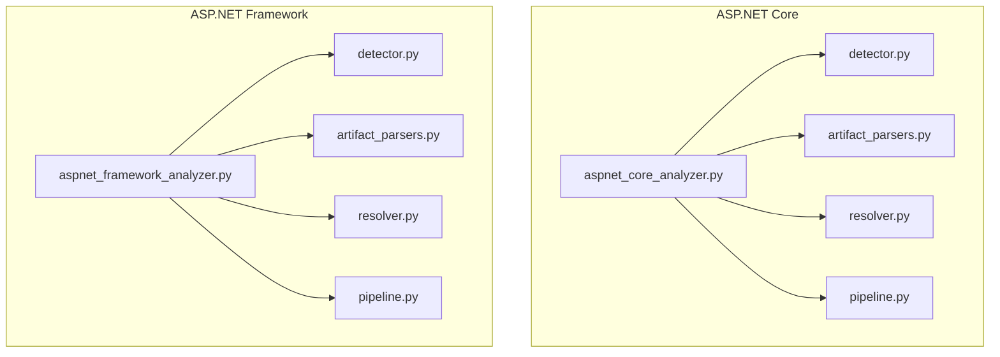
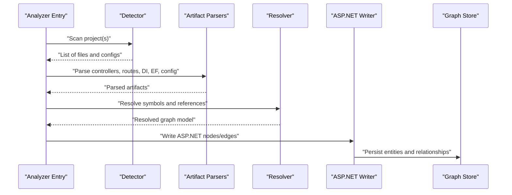
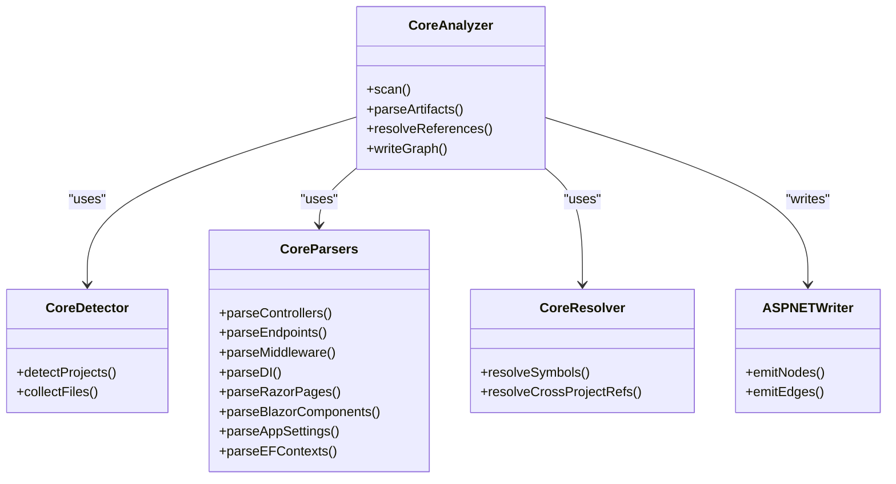
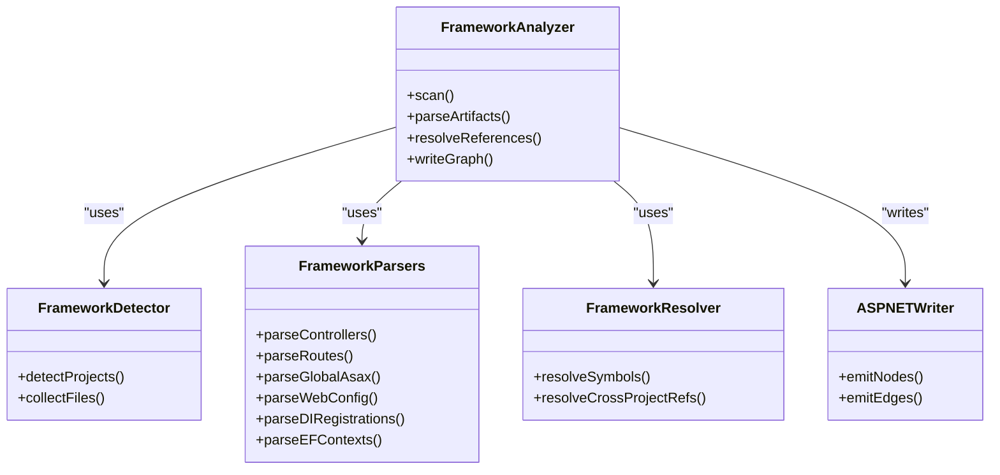
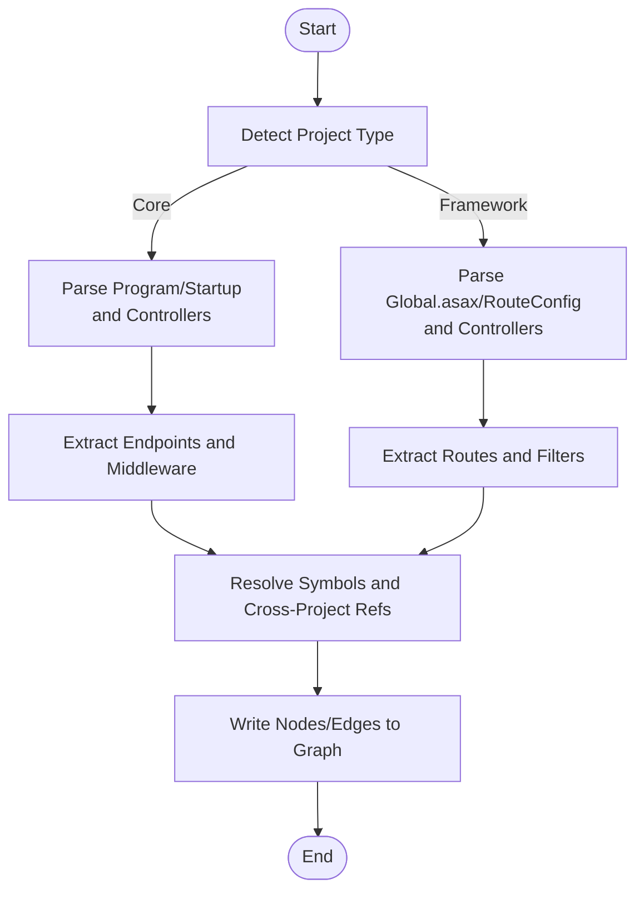
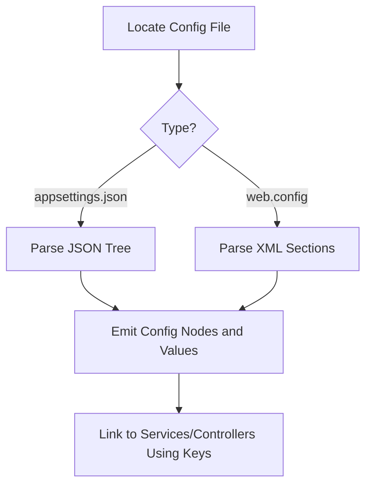
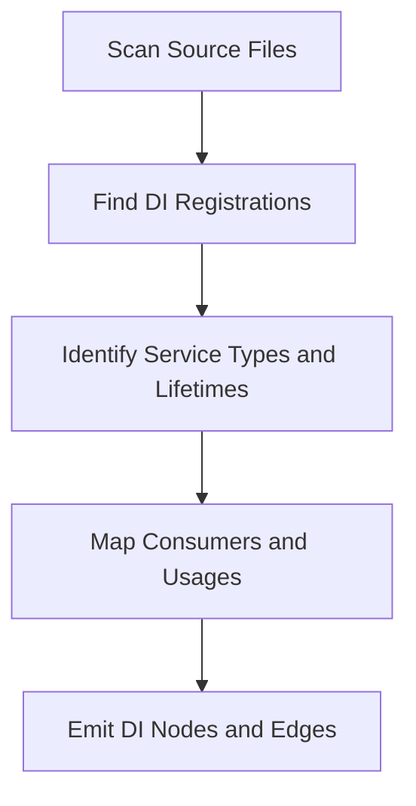
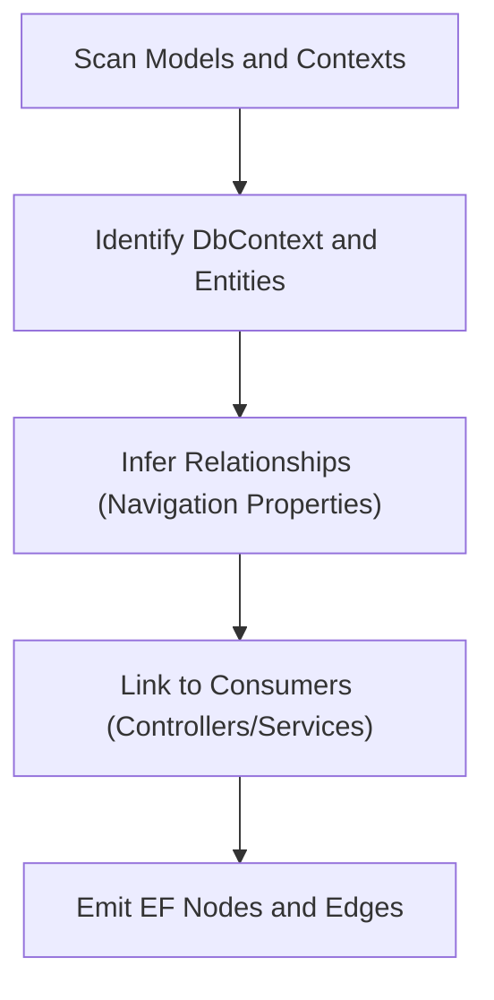
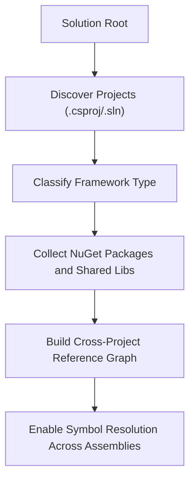
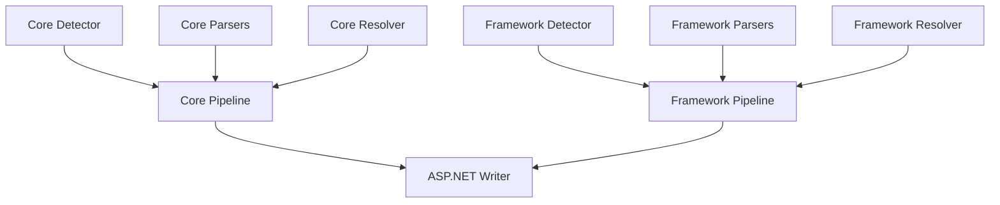

# ASP.NET Framework Analysis

<cite>
**Referenced Files in This Document**
- [aspnet_core_analyzer.py](file://code-tiny/tools/aspnet_core/aspnet_core_analyzer.py)
- [aspnet_framework_analyzer.py](file://code-tiny/tools/aspnet_framework/aspnet_framework_analyzer.py)
- [artifact_parsers.py (ASP.NET Core)](file://code-tiny/tools/aspnet_core/artifact_parsers.py)
- [artifact_parsers.py (ASP.NET Framework)](file://code-tiny/tools/aspnet_framework/artifact_parsers.py)
- [detector.py (ASP.NET Core)](file://code-tiny/tools/aspnet_core/detector.py)
- [detector.py (ASP.NET Framework)](file://code-tiny/tools/aspnet_framework/detector.py)
- [pipeline.py (ASP.NET Core)](file://code-tiny/tools/aspnet_core/pipeline.py)
- [pipeline.py (ASP.NET Framework)](file://code-tiny/tools/aspnet_framework/pipeline.py)
- [resolver.py (ASP.NET Core)](file://code-tiny/tools/aspnet_core/resolver.py)
- [resolver.py (ASP.NET Framework)](file://code-tiny/tools/aspnet_framework/resolver.py)
- [README.md (ASP.NET Core)](file://code-tiny/tools/aspnet_core/README.md)
- [README.md (ASP.NET Framework)](file://code-tiny/tools/aspnet_framework/README.md)
- [Program.cs (Core Web App)](file://tests/fixtures/aspnet-core-application/Program.cs)
- [HomeController.cs (Core Web App)](file://tests/fixtures/aspnet-core-application/Controllers/HomeController.cs)
- [Index.cshtml (Core Web App)](file://tests/fixtures/aspnet-core-application/Pages/Index.cshtml)
- [appsettings.json (Core Web App)](file://tests/fixtures/aspnet-core-application/appsettings.json)
- [RouteConfig.cs (Framework Web App)](file://tests/fixtures/aspnet-framework-application/App_Start/RouteConfig.cs)
- [Global.asax.cs (Framework Web App)](file://tests/fixtures/aspnet-framework-application/Global.asax.cs)
- [web.config (Framework Web App)](file://tests/fixtures/aspnet-framework-application/web.config)
- [HomeController.cs (Framework Web App)](file://tests/fixtures/aspnet-framework-application/HomeController.cs)
- [Default.aspx.cs (Framework Web App)](file://tests/fixtures/aspnet-framework-application/Default.aspx.cs)
- [test_aspnet_fixture_analysis.py](file://tests/test_aspnet_fixture_analysis.py)
- [test_aspnet_graph_contract.py](file://tests/test_aspnet_graph_contract.py)
- [aspnet_writer.py](file://code-tiny/tools/graph/writer/aspnet_writer.py)
</cite>

## Table of Contents
1. [Introduction](#introduction)
2. [Project Structure](#project-structure)
3. [Core Components](#core-components)
4. [Architecture Overview](#architecture-overview)
5. [Detailed Component Analysis](#detailed-component-analysis)
6. [Dependency Analysis](#dependency-analysis)
7. [Performance Considerations](#performance-considerations)
8. [Troubleshooting Guide](#troubleshooting-guide)
9. [Conclusion](#conclusion)
10. [Appendices](#appendices)

## Introduction
This document explains the ASP.NET analysis capabilities for both modern ASP.NET Core and legacy ASP.NET Framework projects. It covers how controllers, routing configurations, middleware pipelines, dependency injection containers, and Entity Framework models are detected and analyzed. It also documents support for .csproj-based projects across both frameworks, configuration file parsing (appsettings.json and web.config), authentication/authorization setup, and database context relationships. Guidance is provided for handling mixed project types, NuGet package dependencies, and cross-project references in large solutions.

## Project Structure
The repository implements two parallel analyzers:
- ASP.NET Core analyzer under tools/aspnet_core
- ASP.NET Framework analyzer under tools/aspnet_framework

Each analyzer follows a consistent structure:
- detector: identifies framework type and relevant files
- artifact_parsers: parses code artifacts (controllers, routes, DI registrations, EF contexts)
- resolver: resolves symbols and cross-project references
- pipeline: orchestrates scanning, parsing, resolution, and graph writing
- README: usage notes and examples

**Diagram sources**
- [aspnet_core_analyzer.py](file://code-tiny/tools/aspnet_core/aspnet_core_analyzer.py)
- [aspnet_framework_analyzer.py](file://code-tiny/tools/aspnet_framework/aspnet_framework_analyzer.py)
- [detector.py (ASP.NET Core)](file://code-tiny/tools/aspnet_core/detector.py)
- [detector.py (ASP.NET Framework)](file://code-tiny/tools/aspnet_framework/detector.py)
- [artifact_parsers.py (ASP.NET Core)](file://code-tiny/tools/aspnet_core/artifact_parsers.py)
- [artifact_parsers.py (ASP.NET Framework)](file://code-tiny/tools/aspnet_framework/artifact_parsers.py)
- [resolver.py (ASP.NET Core)](file://code-tiny/tools/aspnet_core/resolver.py)
- [resolver.py (ASP.NET Framework)](file://code-tiny/tools/aspnet_framework/resolver.py)
- [pipeline.py (ASP.NET Core)](file://code-tiny/tools/aspnet_core/pipeline.py)
- [pipeline.py (ASP.NET Framework)](file://code-tiny/tools/aspnet_framework/pipeline.py)

**Section sources**
- [README.md (ASP.NET Core)](file://code-tiny/tools/aspnet_core/README.md)
- [README.md (ASP.NET Framework)](file://code-tiny/tools/aspnet_framework/README.md)

## Core Components
- Analyzer entry points:
  - ASP.NET Core analyzer orchestrates detection, parsing, resolution, and output.
  - ASP.NET Framework analyzer mirrors the same orchestration for legacy projects.
- Artifact parsers:
  - Extract controllers, endpoints, Razor pages, Blazor components, DI registrations, EF contexts, and configuration usages.
- Resolver:
  - Resolves symbol references across files and projects, including NuGet packages and shared libraries.
- Pipeline:
  - Coordinates incremental scans, scope filtering, and writes results to the graph store via the ASP.NET writer.

Key responsibilities:
- Detect project type (.csproj vs .sln) and framework target.
- Parse configuration files (appsettings.json, web.config).
- Identify controller classes and action methods (Web API and MVC).
- Discover routing definitions (attribute routing and route config).
- Analyze middleware registration and order.
- Map dependency injection registrations and lifetimes.
- Model Entity Framework DbContext and entity relationships.
- Handle mixed solutions with multiple project types and cross-references.

**Section sources**
- [aspnet_core_analyzer.py](file://code-tiny/tools/aspnet_core/aspnet_core_analyzer.py)
- [aspnet_framework_analyzer.py](file://code-tiny/tools/aspnet_framework/aspnet_framework_analyzer.py)
- [artifact_parsers.py (ASP.NET Core)](file://code-tiny/tools/aspnet_core/artifact_parsers.py)
- [artifact_parsers.py (ASP.NET Framework)](file://code-tiny/tools/aspnet_framework/artifact_parsers.py)
- [resolver.py (ASP.NET Core)](file://code-tiny/tools/aspnet_core/resolver.py)
- [resolver.py (ASP.NET Framework)](file://code-tiny/tools/aspnet_framework/resolver.py)
- [pipeline.py (ASP.NET Core)](file://code-tiny/tools/aspnet_core/pipeline.py)
- [pipeline.py (ASP.NET Framework)](file://code-tiny/tools/aspnet_framework/pipeline.py)

## Architecture Overview
The analysis pipeline integrates with the graph layer through a dedicated writer that emits nodes and edges representing ASP.NET constructs. The flow is consistent across both analyzers, differing mainly in source patterns and configuration formats.

**Diagram sources**
- [aspnet_core_analyzer.py](file://code-tiny/tools/aspnet_core/aspnet_core_analyzer.py)
- [aspnet_framework_analyzer.py](file://code-tiny/tools/aspnet_framework/aspnet_framework_analyzer.py)
- [aspnet_writer.py](file://code-tiny/tools/graph/writer/aspnet_writer.py)

## Detailed Component Analysis

### ASP.NET Core Analyzer
Responsibilities:
- Detect .csproj targets and SDK style projects.
- Parse Program.cs and Startup classes for middleware and DI.
- Extract controllers and endpoints from attribute routing and conventions.
- Discover Razor Pages and Blazor components.
- Parse appsettings.json for configuration keys and values.
- Identify EF DbContext and entity classes.

**Diagram sources**
- [aspnet_core_analyzer.py](file://code-tiny/tools/aspnet_core/aspnet_core_analyzer.py)
- [detector.py (ASP.NET Core)](file://code-tiny/tools/aspnet_core/detector.py)
- [artifact_parsers.py (ASP.NET Core)](file://code-tiny/tools/aspnet_core/artifact_parsers.py)
- [resolver.py (ASP.NET Core)](file://code-tiny/tools/aspnet_core/resolver.py)
- [aspnet_writer.py](file://code-tiny/tools/graph/writer/aspnet_writer.py)

**Section sources**
- [Program.cs (Core Web App)](file://tests/fixtures/aspnet-core-application/Program.cs)
- [HomeController.cs (Core Web App)](file://tests/fixtures/aspnet-core-application/Controllers/HomeController.cs)
- [Index.cshtml (Core Web App)](file://tests/fixtures/aspnet-core-application/Pages/Index.cshtml)
- [appsettings.json (Core Web App)](file://tests/fixtures/aspnet-core-application/appsettings.json)

### ASP.NET Framework Analyzer
Responsibilities:
- Detect legacy .csproj or .sln-based projects.
- Parse Global.asax and RouteConfig for routing and application lifecycle hooks.
- Extract MVC controllers and actions.
- Parse web.config for modules, handlers, and settings.
- Identify DI container registrations (e.g., Unity, Autofac) if present.
- Model EF DbContext and entities similarly to Core.

**Diagram sources**
- [aspnet_framework_analyzer.py](file://code-tiny/tools/aspnet_framework/aspnet_framework_analyzer.py)
- [detector.py (ASP.NET Framework)](file://code-tiny/tools/aspnet_framework/detector.py)
- [artifact_parsers.py (ASP.NET Framework)](file://code-tiny/tools/aspnet_framework/artifact_parsers.py)
- [resolver.py (ASP.NET Framework)](file://code-tiny/tools/aspnet_framework/resolver.py)
- [aspnet_writer.py](file://code-tiny/tools/graph/writer/aspnet_writer.py)

**Section sources**
- [RouteConfig.cs (Framework Web App)](file://tests/fixtures/aspnet-framework-application/App_Start/RouteConfig.cs)
- [Global.asax.cs (Framework Web App)](file://tests/fixtures/aspnet-framework-application/Global.asax.cs)
- [web.config (Framework Web App)](file://tests/fixtures/aspnet-framework-application/web.config)
- [HomeController.cs (Framework Web App)](file://tests/fixtures/aspnet-framework-application/HomeController.cs)
- [Default.aspx.cs (Framework Web App)](file://tests/fixtures/aspnet-framework-application/Default.aspx.cs)

### Controller and Endpoint Analysis
- Controllers:
  - Both analyzers detect controller classes and action methods, mapping them to HTTP verbs based on attributes or naming conventions.
- Routing:
  - ASP.NET Core supports attribute routing and endpoint routing; ASP.NET Framework uses RouteConfig and convention-based routes.
- Middleware:
  - Core analyzer inspects Program.cs and Startup classes for Use* calls and custom middleware registrations.
- Authentication/Authorization:
  - Detect AddAuthentication/AddAuthorization and policy setups in Core; detect Forms/Windows auth and authorization filters in Framework.

**Diagram sources**
- [aspnet_core_analyzer.py](file://code-tiny/tools/aspnet_core/aspnet_core_analyzer.py)
- [aspnet_framework_analyzer.py](file://code-tiny/tools/aspnet_framework/aspnet_framework_analyzer.py)
- [artifact_parsers.py (ASP.NET Core)](file://code-tiny/tools/aspnet_core/artifact_parsers.py)
- [artifact_parsers.py (ASP.NET Framework)](file://code-tiny/tools/aspnet_framework/artifact_parsers.py)

**Section sources**
- [HomeController.cs (Core Web App)](file://tests/fixtures/aspnet-core-application/Controllers/HomeController.cs)
- [HomeController.cs (Framework Web App)](file://tests/fixtures/aspnet-framework-application/HomeController.cs)
- [RouteConfig.cs (Framework Web App)](file://tests/fixtures/aspnet-framework-application/App_Start/RouteConfig.cs)

### Configuration File Parsing
- ASP.NET Core:
  - Parses appsettings.json to extract configuration sections, keys, and values used by services and controllers.
- ASP.NET Framework:
  - Parses web.config to identify modules, handlers, connection strings, and app settings.

**Diagram sources**
- [artifact_parsers.py (ASP.NET Core)](file://code-tiny/tools/aspnet_core/artifact_parsers.py)
- [artifact_parsers.py (ASP.NET Framework)](file://code-tiny/tools/aspnet_framework/artifact_parsers.py)
- [appsettings.json (Core Web App)](file://tests/fixtures/aspnet-core-application/appsettings.json)
- [web.config (Framework Web App)](file://tests/fixtures/aspnet-framework-application/web.config)

**Section sources**
- [appsettings.json (Core Web App)](file://tests/fixtures/aspnet-core-application/appsettings.json)
- [web.config (Framework Web App)](file://tests/fixtures/aspnet-framework-application/web.config)

### Dependency Injection Containers
- ASP.NET Core:
  - Detects built-in DI registrations (services, singletons, scoped, transient) and maps them to consumers.
- ASP.NET Framework:
  - Detects common container registrations (e.g., Unity, Autofac) when present and links to resolved types.

**Diagram sources**
- [artifact_parsers.py (ASP.NET Core)](file://code-tiny/tools/aspnet_core/artifact_parsers.py)
- [artifact_parsers.py (ASP.NET Framework)](file://code-tiny/tools/aspnet_framework/artifact_parsers.py)

**Section sources**
- [Program.cs (Core Web App)](file://tests/fixtures/aspnet-core-application/Program.cs)

### Entity Framework Models and Contexts
- Both analyzers detect DbContext classes and entity models, inferring relationships where possible (e.g., navigation properties).
- Links between controllers/services and DbContext instances are established via DI resolution.

**Diagram sources**
- [artifact_parsers.py (ASP.NET Core)](file://code-tiny/tools/aspnet_core/artifact_parsers.py)
- [artifact_parsers.py (ASP.NET Framework)](file://code-tiny/tools/aspnet_framework/artifact_parsers.py)

**Section sources**
- [test_aspnet_graph_contract.py](file://tests/test_aspnet_graph_contract.py)

### Mixed Projects, NuGet Dependencies, and Cross-Project References
- Mixed project types:
  - The detectors differentiate between .csproj (SDK-style) and .sln-based projects, enabling unified scanning across solutions.
- NuGet dependencies:
  - The resolver accounts for referenced packages and shared libraries, improving symbol resolution accuracy.
- Cross-project references:
  - The resolver traces inter-project dependencies to link controllers, services, and data access layers across assemblies.

**Diagram sources**
- [detector.py (ASP.NET Core)](file://code-tiny/tools/aspnet_core/detector.py)
- [detector.py (ASP.NET Framework)](file://code-tiny/tools/aspnet_framework/detector.py)
- [resolver.py (ASP.NET Core)](file://code-tiny/tools/aspnet_core/resolver.py)
- [resolver.py (ASP.NET Framework)](file://code-tiny/tools/aspnet_framework/resolver.py)

**Section sources**
- [test_aspnet_fixture_analysis.py](file://tests/test_aspnet_fixture_analysis.py)

## Dependency Analysis
The analyzers depend on:
- Detector modules for project discovery and file collection.
- Artifact parsers for extracting framework-specific semantics.
- Resolver for symbol and reference resolution.
- Pipeline for orchestration and incremental updates.
- ASP.NET writer for emitting standardized graph nodes and edges.

**Diagram sources**
- [pipeline.py (ASP.NET Core)](file://code-tiny/tools/aspnet_core/pipeline.py)
- [pipeline.py (ASP.NET Framework)](file://code-tiny/tools/aspnet_framework/pipeline.py)
- [aspnet_writer.py](file://code-tiny/tools/graph/writer/aspnet_writer.py)

**Section sources**
- [pipeline.py (ASP.NET Core)](file://code-tiny/tools/aspnet_core/pipeline.py)
- [pipeline.py (ASP.NET Framework)](file://code-tiny/tools/aspnet_framework/pipeline.py)
- [aspnet_writer.py](file://code-tiny/tools/graph/writer/aspnet_writer.py)

## Performance Considerations
- Incremental scanning:
  - Pipelines support change detection to re-scan only affected files, reducing overhead in large solutions.
- Scope filtering:
  - Limiting analysis to specific directories or project types improves performance.
- Parallelization:
  - Where feasible, file parsing and symbol resolution can be parallelized to speed up analysis.
- Graph write batching:
  - Batched writes reduce I/O pressure on the graph store.

[No sources needed since this section provides general guidance]

## Troubleshooting Guide
Common issues and resolutions:
- Missing project detection:
  - Ensure .csproj or .sln files are discoverable at the solution root.
- Incomplete symbol resolution:
  - Verify NuGet packages and shared library references are included in the scan scope.
- Configuration not parsed:
  - Confirm appsettings.json or web.config paths are within the scanned directories.
- Mixed project errors:
  - Check framework target compatibility and ensure detectors classify projects correctly.

Validation tests:
- Fixture-based analysis ensures correct extraction of controllers, routes, and configuration.
- Graph contract tests validate node and edge consistency.

**Section sources**
- [test_aspnet_fixture_analysis.py](file://tests/test_aspnet_fixture_analysis.py)
- [test_aspnet_graph_contract.py](file://tests/test_aspnet_graph_contract.py)

## Conclusion
The ASP.NET analysis capability provides comprehensive coverage for both modern ASP.NET Core and legacy ASP.NET Framework projects. It extracts critical runtime constructs such as controllers, endpoints, routing, middleware, DI registrations, and EF contexts, while supporting configuration parsing and cross-project resolution. The consistent architecture across both analyzers enables unified analysis in mixed solutions, with robust integration into the graph layer for downstream querying and impact analysis.

[No sources needed since this section summarizes without analyzing specific files]

## Appendices

### Example Scenarios
- Web API endpoints:
  - Analyze attribute routing and action methods to map HTTP verbs and paths.
- MVC controllers:
  - Detect controller classes and action methods, linking to views and models.
- Razor pages:
  - Discover page handlers and associated models.
- Blazor components:
  - Identify component classes and parameter bindings.

[No sources needed since this section doesn't analyze specific files]