# Flutter & Dart Analysis

<cite>
**Referenced Files in This Document**
- [flutter_analyzer.py](file://code-tiny/tools/flutter/flutter_analyzer.py)
- [dart_parser.py](file://code-tiny/tools/flutter/dart_parser.py)
- [models.py](file://code-tiny/tools/flutter/models.py)
- [pipeline.py](file://code-tiny/tools/flutter/pipeline.py)
- [detector.py](file://code-tiny/tools/flutter/detector.py)
- [normalizer.py](file://code-tiny/tools/flutter/normalizer.py)
- [cache.py](file://code-tiny/tools/flutter/cache.py)
- [protocol.py](file://code-tiny/tools/flutter/protocol.py)
- [test_flutter_analyzer_imports.py](file://tests/test_flutter_analyzer_imports.py)
- [test_flutter_project_detection.py](file://tests/test_flutter_project_detection.py)
- [test_flutter_protocol.py](file://tests/test_flutter_protocol.py)
- [test_dart_fixture_analysis.py](file://tests/test_dart_fixture_analysis.py)
- [test_dart_incremental_resolution.py](file://tests/test_dart_incremental_resolution.py)
</cite>

## Table of Contents
1. [Introduction](#introduction)
2. [Project Structure](#project-structure)
3. [Core Components](#core-components)
4. [Architecture Overview](#architecture-overview)
5. [Detailed Component Analysis](#detailed-component-analysis)
6. [Dependency Analysis](#dependency-analysis)
7. [Performance Considerations](#performance-considerations)
8. [Troubleshooting Guide](#troubleshooting-guide)
9. [Conclusion](#conclusion)
10. [Appendices](#appendices)

## Introduction
This document explains the Flutter and Dart analysis capabilities implemented in the repository. It covers how Dart source code is parsed, how Flutter widgets and state management patterns are modeled, how navigation structures and pubspec.yaml dependencies are analyzed, and how widget trees and UI component relationships are represented. It also includes guidance for analyzing complex applications with multiple screens, custom widgets, and platform-specific implementations, as well as support for different state management libraries, testing frameworks, and build configurations. Finally, it provides recommendations for hot reload workflows, incremental analysis, and performance optimization for large mobile applications.

## Project Structure
The Flutter analyzer is implemented under a dedicated module with clear separation of concerns: parsing, modeling, pipeline orchestration, detection, normalization, caching, and protocol definitions. Tests validate imports, project detection, protocol contracts, fixture-based analysis, and incremental resolution behavior.

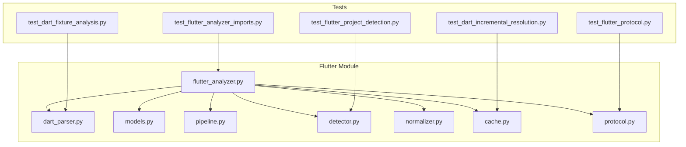

**Diagram sources**
- [flutter_analyzer.py](file://code-tiny/tools/flutter/flutter_analyzer.py)
- [dart_parser.py](file://code-tiny/tools/flutter/dart_parser.py)
- [models.py](file://code-tiny/tools/flutter/models.py)
- [pipeline.py](file://code-tiny/tools/flutter/pipeline.py)
- [detector.py](file://code-tiny/tools/flutter/detector.py)
- [normalizer.py](file://code-tiny/tools/flutter/normalizer.py)
- [cache.py](file://code-tiny/tools/flutter/cache.py)
- [protocol.py](file://code-tiny/tools/flutter/protocol.py)
- [test_flutter_analyzer_imports.py](file://tests/test_flutter_analyzer_imports.py)
- [test_flutter_project_detection.py](file://tests/test_flutter_project_detection.py)
- [test_flutter_protocol.py](file://tests/test_flutter_protocol.py)
- [test_dart_fixture_analysis.py](file://tests/test_dart_fixture_analysis.py)
- [test_dart_incremental_resolution.py](file://tests/test_dart_incremental_resolution.py)

**Section sources**
- [flutter_analyzer.py](file://code-tiny/tools/flutter/flutter_analyzer.py)
- [dart_parser.py](file://code-tiny/tools/flutter/dart_parser.py)
- [models.py](file://code-tiny/tools/flutter/models.py)
- [pipeline.py](file://code-tiny/tools/flutter/pipeline.py)
- [detector.py](file://code-tiny/tools/flutter/detector.py)
- [normalizer.py](file://code-tiny/tools/flutter/normalizer.py)
- [cache.py](file://code-tiny/tools/flutter/cache.py)
- [protocol.py](file://code-tiny/tools/flutter/protocol.py)
- [test_flutter_analyzer_imports.py](file://tests/test_flutter_analyzer_imports.py)
- [test_flutter_project_detection.py](file://tests/test_flutter_project_detection.py)
- [test_flutter_protocol.py](file://tests/test_flutter_protocol.py)
- [test_dart_fixture_analysis.py](file://tests/test_dart_fixture_analysis.py)
- [test_dart_incremental_resolution.py](file://tests/test_dart_incremental_resolution.py)

## Core Components
- Analyzer entrypoint orchestrates scanning, parsing, and graph construction for Flutter projects.
- Dart parser extracts symbols, classes, methods, and references from .dart files.
- Models define canonical representations for Dart constructs, Flutter widgets, providers, blocs, riverpod elements, navigation routes, and pubspec dependencies.
- Pipeline coordinates stages such as discovery, parsing, normalization, and indexing.
- Detector identifies Flutter projects and relevant artifacts (pubspec.yaml, lib structure).
- Normalizer standardizes identifiers, paths, and semantic labels across modules.
- Cache stores intermediate results to support incremental updates.
- Protocol defines request/response schemas used by higher-level services or MCP integration.

Key responsibilities:
- Parse Dart AST-like structures and resolve imports.
- Identify Flutter widget classes and their composition relationships.
- Detect state management patterns (Provider, Bloc, Riverpod) via symbol and usage heuristics.
- Extract navigation routes and screen relationships.
- Analyze pubspec.yaml for dependencies and version constraints.
- Build normalized graphs suitable for downstream querying and visualization.

**Section sources**
- [flutter_analyzer.py](file://code-tiny/tools/flutter/flutter_analyzer.py)
- [dart_parser.py](file://code-tiny/tools/flutter/dart_parser.py)
- [models.py](file://code-tiny/tools/flutter/models.py)
- [pipeline.py](file://code-tiny/tools/flutter/pipeline.py)
- [detector.py](file://code-tiny/tools/flutter/detector.py)
- [normalizer.py](file://code-tiny/tools/flutter/normalizer.py)
- [cache.py](file://code-tiny/tools/flutter/cache.py)
- [protocol.py](file://code-tiny/tools/flutter/protocol.py)

## Architecture Overview
The Flutter analyzer follows a layered architecture:
- Detection layer locates Flutter projects and scopes.
- Parsing layer reads Dart sources and builds internal models.
- Normalization layer harmonizes names and relationships.
- Pipeline layer sequences operations and manages incremental updates.
- Protocol layer exposes structured interfaces for consumers.

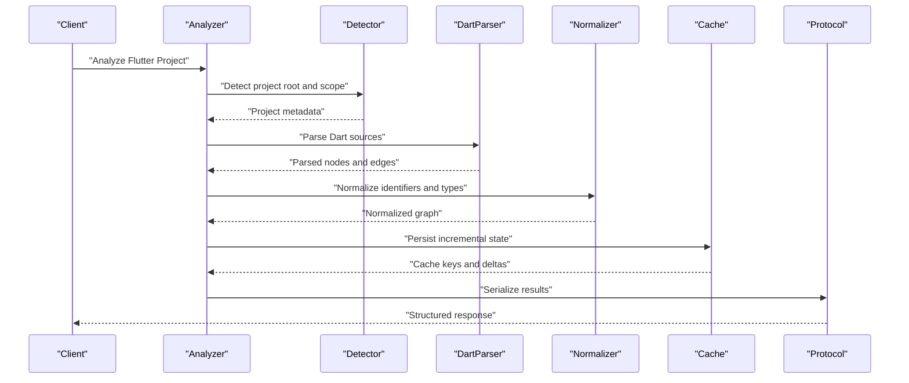

**Diagram sources**
- [flutter_analyzer.py](file://code-tiny/tools/flutter/flutter_analyzer.py)
- [detector.py](file://code-tiny/tools/flutter/detector.py)
- [dart_parser.py](file://code-tiny/tools/flutter/dart_parser.py)
- [normalizer.py](file://code-tiny/tools/flutter/normalizer.py)
- [cache.py](file://code-tiny/tools/flutter/cache.py)
- [protocol.py](file://code-tiny/tools/flutter/protocol.py)

## Detailed Component Analysis

### Analyzer Orchestration
The analyzer coordinates detection, parsing, normalization, and result serialization. It integrates with the pipeline to sequence steps and uses cache to avoid reprocessing unchanged files.

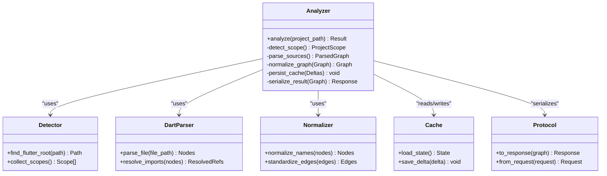

**Diagram sources**
- [flutter_analyzer.py](file://code-tiny/tools/flutter/flutter_analyzer.py)
- [detector.py](file://code-tiny/tools/flutter/detector.py)
- [dart_parser.py](file://code-tiny/tools/flutter/dart_parser.py)
- [normalizer.py](file://code-tiny/tools/flutter/normalizer.py)
- [cache.py](file://code-tiny/tools/flutter/cache.py)
- [protocol.py](file://code-tiny/tools/flutter/protocol.py)

**Section sources**
- [flutter_analyzer.py](file://code-tiny/tools/flutter/flutter_analyzer.py)

### Dart Parser
The Dart parser extracts symbols, classes, methods, and references from .dart files. It resolves imports and produces a graph of nodes and edges representing code relationships.

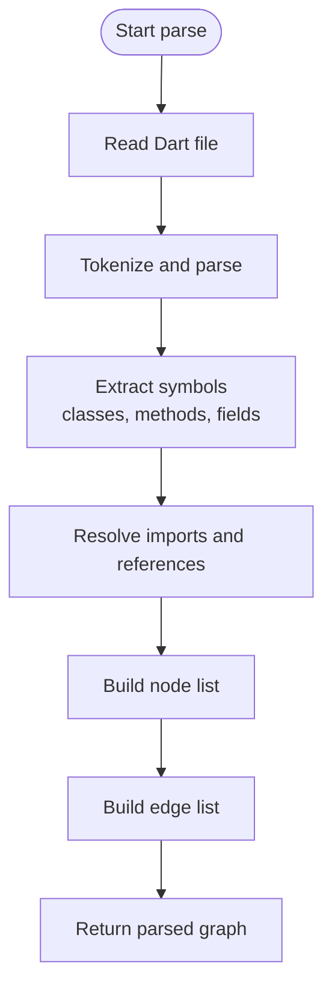

**Diagram sources**
- [dart_parser.py](file://code-tiny/tools/flutter/dart_parser.py)

**Section sources**
- [dart_parser.py](file://code-tiny/tools/flutter/dart_parser.py)

### Models
Models define canonical data structures for Dart constructs, Flutter widgets, state management components, navigation routes, and pubspec dependencies. They provide a consistent schema for downstream processing and queries.

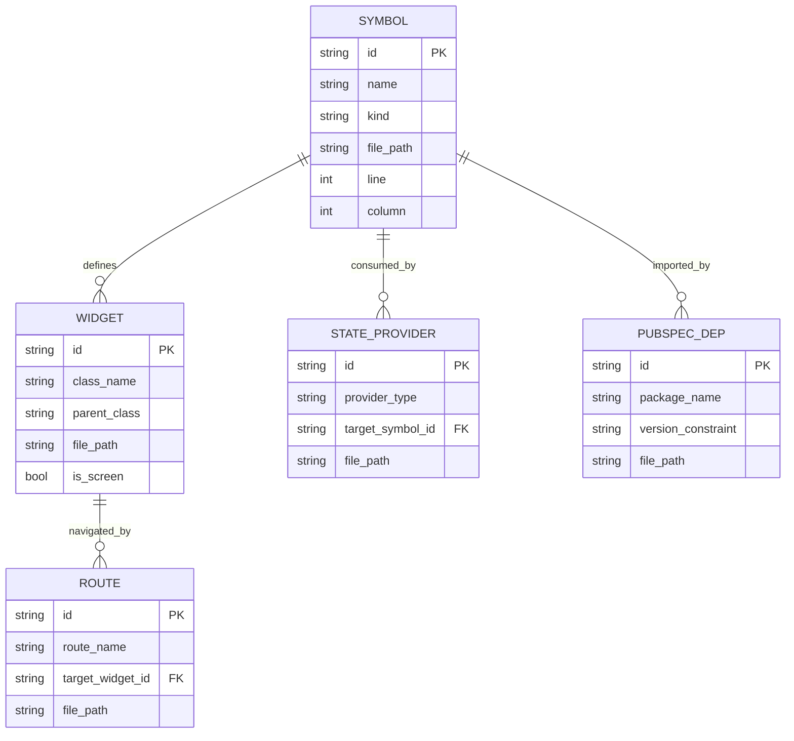

**Diagram sources**
- [models.py](file://code-tiny/tools/flutter/models.py)

**Section sources**
- [models.py](file://code-tiny/tools/flutter/models.py)

### Pipeline
The pipeline sequences discovery, parsing, normalization, and indexing. It supports incremental updates by leveraging cache and delta computation.

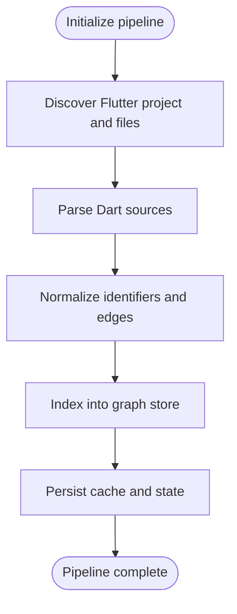

**Diagram sources**
- [pipeline.py](file://code-tiny/tools/flutter/pipeline.py)

**Section sources**
- [pipeline.py](file://code-tiny/tools/flutter/pipeline.py)

### Detector
The detector identifies Flutter projects by locating pubspec.yaml and validating typical directory structures. It returns project metadata and scopes for analysis.

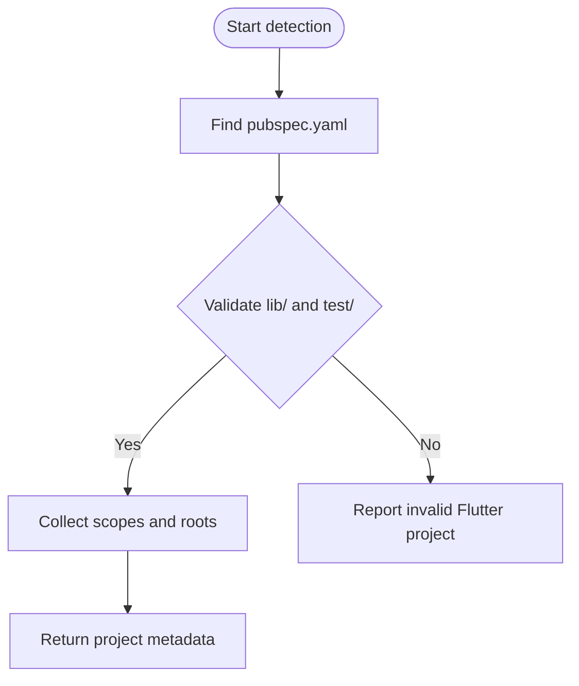

**Diagram sources**
- [detector.py](file://code-tiny/tools/flutter/detector.py)

**Section sources**
- [detector.py](file://code-tiny/tools/flutter/detector.py)

### Normalizer
The normalizer standardizes identifiers, file paths, and relationship labels to ensure consistency across modules and reduce ambiguity.

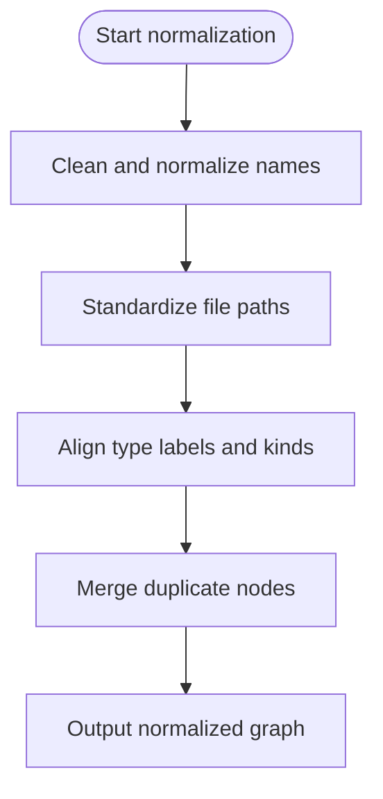

**Diagram sources**
- [normalizer.py](file://code-tiny/tools/flutter/normalizer.py)

**Section sources**
- [normalizer.py](file://code-tiny/tools/flutter/normalizer.py)

### Cache
The cache persists incremental state and deltas to speed up subsequent analyses and support hot reload workflows.

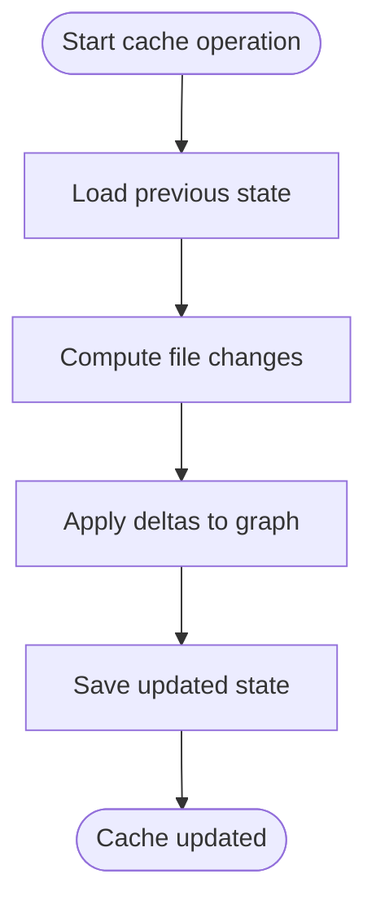

**Diagram sources**
- [cache.py](file://code-tiny/tools/flutter/cache.py)

**Section sources**
- [cache.py](file://code-tiny/tools/flutter/cache.py)

### Protocol
The protocol defines request and response schemas for interacting with the analyzer, enabling integration with higher-level services or MCP clients.

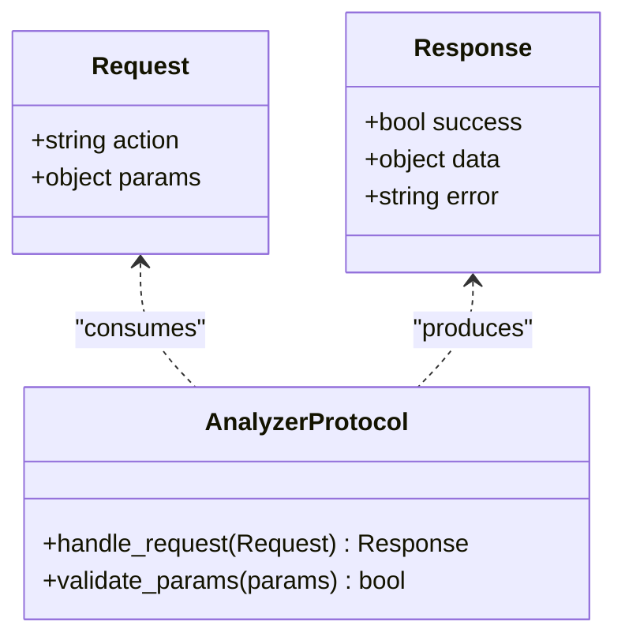

**Diagram sources**
- [protocol.py](file://code-tiny/tools/flutter/protocol.py)

**Section sources**
- [protocol.py](file://code-tiny/tools/flutter/protocol.py)

### Conceptual Overview
Widget tree analysis involves identifying widget classes, their composition, and relationships to state providers and navigation routes. State flow tracking maps how state changes propagate through providers, blocs, or riverpod elements. Pubspec dependency analysis captures package versions and constraints to inform impact and compatibility checks.

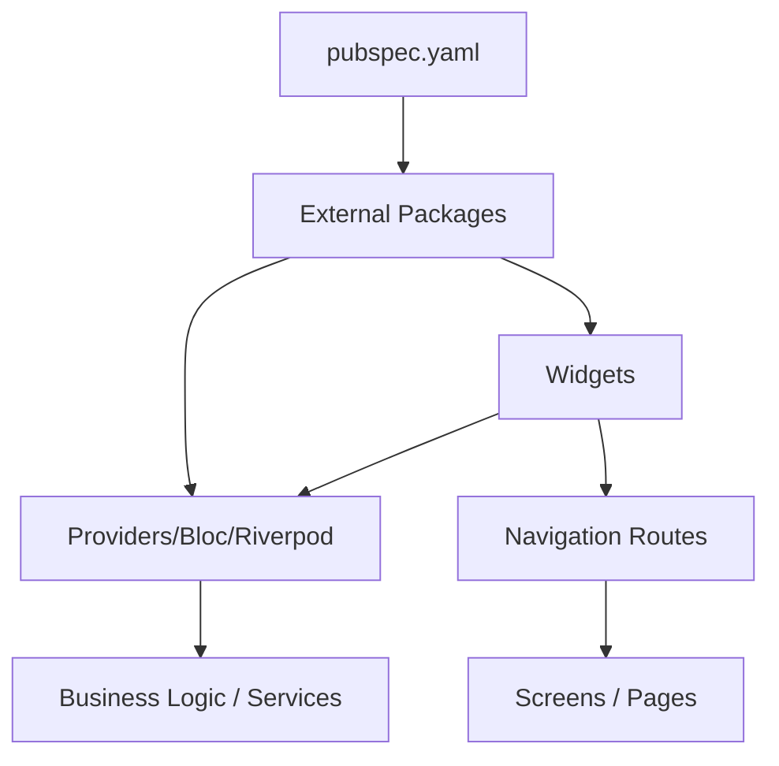

[No sources needed since this diagram shows conceptual workflow, not actual code structure]

## Dependency Analysis
The Flutter analyzer depends on core utilities for parsing, normalization, caching, and protocol handling. Tests validate import correctness, project detection, protocol contracts, fixture-based analysis, and incremental resolution behavior.

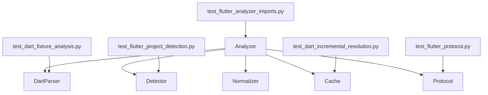

**Diagram sources**
- [flutter_analyzer.py](file://code-tiny/tools/flutter/flutter_analyzer.py)
- [dart_parser.py](file://code-tiny/tools/flutter/dart_parser.py)
- [detector.py](file://code-tiny/tools/flutter/detector.py)
- [normalizer.py](file://code-tiny/tools/flutter/normalizer.py)
- [cache.py](file://code-tiny/tools/flutter/cache.py)
- [protocol.py](file://code-tiny/tools/flutter/protocol.py)
- [test_flutter_analyzer_imports.py](file://tests/test_flutter_analyzer_imports.py)
- [test_flutter_project_detection.py](file://tests/test_flutter_project_detection.py)
- [test_flutter_protocol.py](file://tests/test_flutter_protocol.py)
- [test_dart_fixture_analysis.py](file://tests/test_dart_fixture_analysis.py)
- [test_dart_incremental_resolution.py](file://tests/test_dart_incremental_resolution.py)

**Section sources**
- [flutter_analyzer.py](file://code-tiny/tools/flutter/flutter_analyzer.py)
- [dart_parser.py](file://code-tiny/tools/flutter/dart_parser.py)
- [detector.py](file://code-tiny/tools/flutter/detector.py)
- [normalizer.py](file://code-tiny/tools/flutter/normalizer.py)
- [cache.py](file://code-tiny/tools/flutter/cache.py)
- [protocol.py](file://code-tiny/tools/flutter/protocol.py)
- [test_flutter_analyzer_imports.py](file://tests/test_flutter_analyzer_imports.py)
- [test_flutter_project_detection.py](file://tests/test_flutter_project_detection.py)
- [test_flutter_protocol.py](file://tests/test_flutter_protocol.py)
- [test_dart_fixture_analysis.py](file://tests/test_dart_fixture_analysis.py)
- [test_dart_incremental_resolution.py](file://tests/test_dart_incremental_resolution.py)

## Performance Considerations
- Incremental analysis: Use cache to persist state and apply deltas based on file changes, reducing full re-parsing overhead.
- Scope limiting: Restrict analysis to changed modules or affected screens to minimize work during hot reload cycles.
- Parallel parsing: Where feasible, parse independent files concurrently to improve throughput.
- Memory management: Stream large files and release intermediate structures after normalization.
- Indexing efficiency: Prefer stable identifiers and deduplicate nodes to keep graph size manageable.
- Dependency pruning: Skip irrelevant packages when focusing on application-specific analysis.

[No sources needed since this section provides general guidance]

## Troubleshooting Guide
Common issues and resolutions:
- Invalid Flutter project: Ensure pubspec.yaml exists and lib/ and test/ directories are present; detector will report errors if structure is missing.
- Import resolution failures: Verify that imported modules exist within the project scope and that path normalization is applied consistently.
- Duplicate nodes: Normalizer should merge duplicates; check normalization rules if conflicts persist.
- Stale cache: Clear cache state if incremental updates produce inconsistent results; force full reanalysis.
- Protocol mismatches: Validate request parameters against protocol schema before invoking analyzer endpoints.

Validation points:
- Import correctness verified by tests.
- Project detection validated by dedicated tests.
- Protocol contract enforced by protocol tests.
- Fixture-based analysis ensures parser outputs match expected shapes.
- Incremental resolution tests confirm cache behavior and delta application.

**Section sources**
- [test_flutter_analyzer_imports.py](file://tests/test_flutter_analyzer_imports.py)
- [test_flutter_project_detection.py](file://tests/test_flutter_project_detection.py)
- [test_flutter_protocol.py](file://tests/test_flutter_protocol.py)
- [test_dart_fixture_analysis.py](file://tests/test_dart_fixture_analysis.py)
- [test_dart_incremental_resolution.py](file://tests/test_dart_incremental_resolution.py)

## Conclusion
The Flutter and Dart analyzer provides a modular, scalable foundation for analyzing Dart sources, Flutter widgets, state management patterns, navigation structures, and pubspec dependencies. Its layered design separates detection, parsing, normalization, and orchestration, while caching and protocol layers enable efficient incremental updates and integration with higher-level services. The included tests validate core behaviors and help maintain reliability as features evolve.

[No sources needed since this section summarizes without analyzing specific files]

## Appendices

### Example Scenarios
- Complex multi-screen app: Identify screen widgets, map navigation routes, and trace state providers consumed by each screen.
- Custom widgets: Classify reusable widgets, detect composition relationships, and link them to state providers.
- Platform-specific implementations: Separate platform channels and native integrations by filtering imports and annotations.
- State management libraries: Recognize Provider, Bloc, and Riverpod patterns via symbol heuristics and usage contexts.
- Testing frameworks: Include test files in scope to analyze widget tests and mock providers/blocs.
- Build configurations: Parse pubspec.yaml for dependencies and constraints; flag incompatible versions.

[No sources needed since this section provides general guidance]