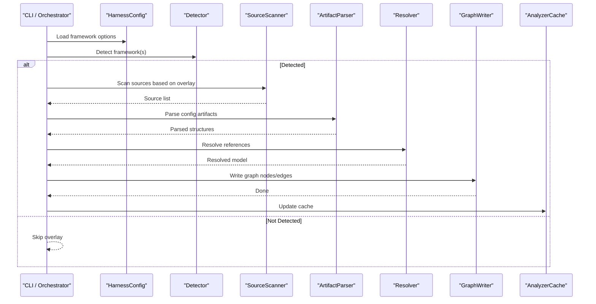
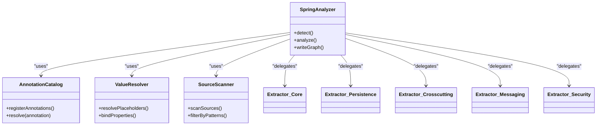
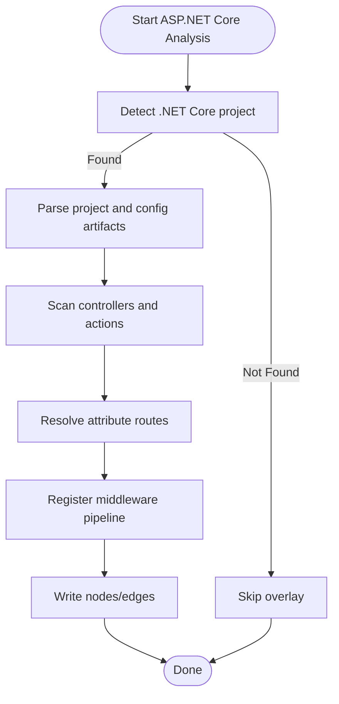
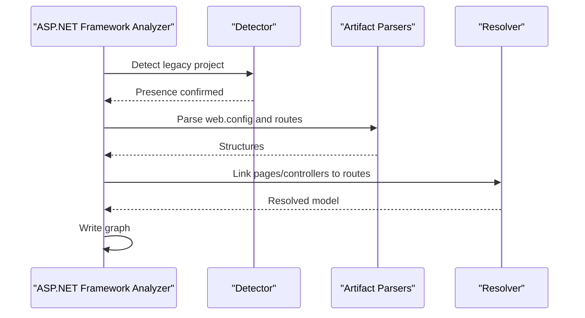
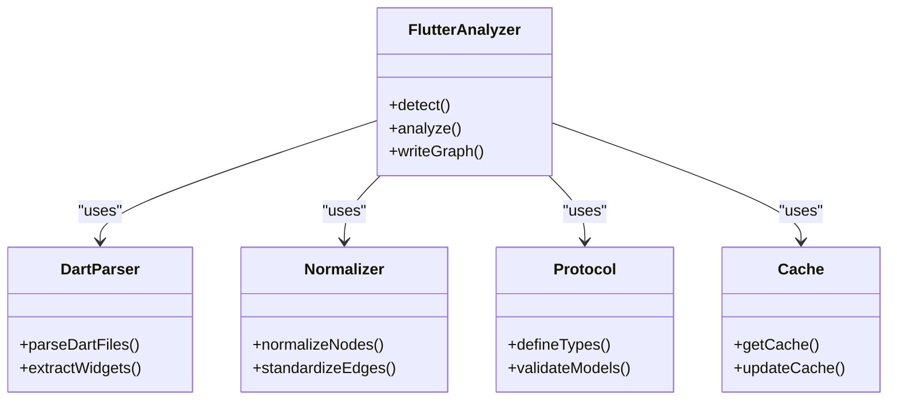
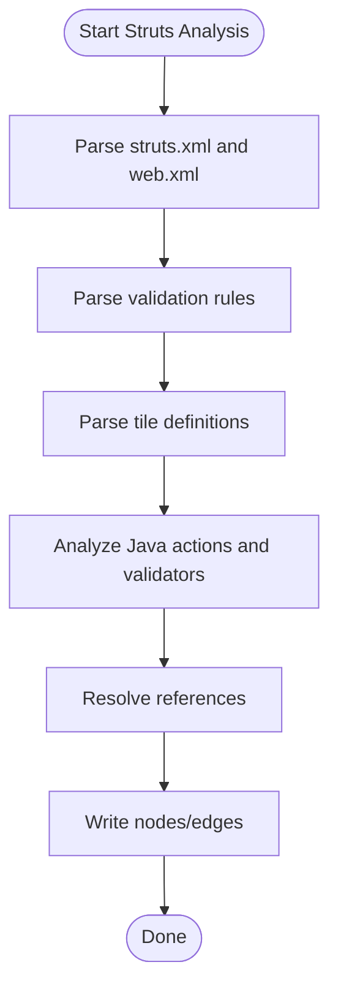
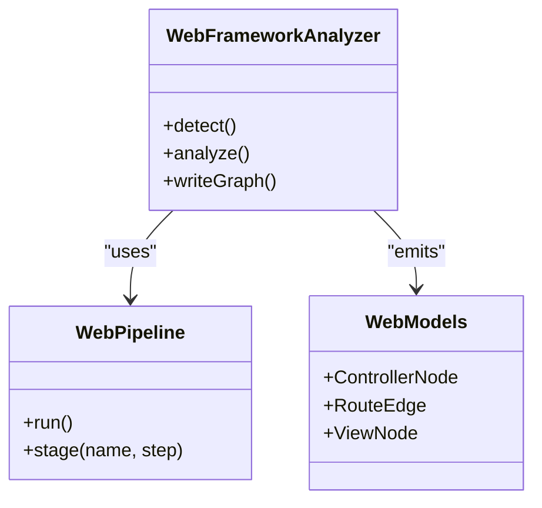
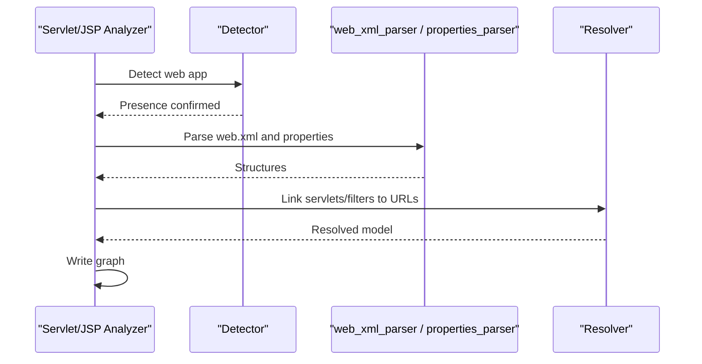
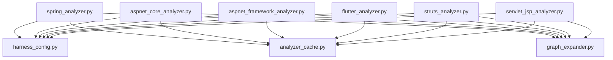

# Framework Analysis & Overlays

<cite>
**Referenced Files in This Document**
- [web_framework_analyzer.py](file://code-tiny/tools/web_framework/web_framework_analyzer.py)
- [pipeline.py](file://code-tiny/tools/web_framework/pipeline.py)
- [models.py](file://code-tiny/tools/web_framework/models.py)
- [__init__.py](file://code-tiny/tools/web_framework/__init__.py)
- [aspnet_core_analyzer.py](file://code-tiny/tools/aspnet_core/aspnet_core_analyzer.py)
- [detector.py](file://code-tiny/tools/aspnet_core/detector.py)
- [pipeline.py](file://code-tiny/tools/aspnet_core/pipeline.py)
- [artifact_parsers.py](file://code-tiny/tools/aspnet_core/artifact_parsers.py)
- [resolver.py](file://code-tiny/tools/aspnet_core/resolver.py)
- [aspnet_framework_analyzer.py](file://code-tiny/tools/aspnet_framework/aspnet_framework_analyzer.py)
- [detector.py](file://code-tiny/tools/aspnet_framework/detector.py)
- [pipeline.py](file://code-tiny/tools/aspnet_framework/pipeline.py)
- [artifact_parsers.py](file://code-tiny/tools/aspnet_framework/artifact_parsers.py)
- [resolver.py](file://code-tiny/tools/aspnet_framework/resolver.py)
- [flutter_analyzer.py](file://code-tiny/tools/flutter/flutter_analyzer.py)
- [detector.py](file://code-tiny/tools/flutter/detector.py)
- [pipeline.py](file://code-tiny/tools/flutter/pipeline.py)
- [dart_parser.py](file://code-tiny/tools/flutter/dart_parser.py)
- [normalizer.py](file://code-tiny/tools/flutter/normalizer.py)
- [protocol.py](file://code-tiny/tools/flutter/protocol.py)
- [cache.py](file://code-tiny/tools/flutter/cache.py)
- [struts_analyzer.py](file://code-tiny/tools/struts/struts_analyzer.py)
- [pipeline.py](file://code-tiny/tools/struts/pipeline.py)
- [struts_xml_parser.py](file://code-tiny/tools/struts/struts_xml_parser.py)
- [validation_parser.py](file://code-tiny/tools/struts/validation_parser.py)
- [web_xml_parser.py](file://code-tiny/tools/struts/web_xml_parser.py)
- [java_validation.py](file://code-tiny/tools/struts/java_validation.py)
- [spring_analyzer.py](file://code-tiny/tools/spring/spring_analyzer.py)
- [detector.py](file://code-tiny/tools/spring/detector.py)
- [pipeline.py](file://code-tiny/tools/spring/pipeline.py)
- [annotation_catalog.py](file://code-tiny/tools/spring/annotation_catalog.py)
- [value_resolver.py](file://code-tiny/tools/spring/value_resolver.py)
- [source_scanner.py](file://code-tiny/tools/spring/source_scanner.py)
- [adapters.py](file://code-tiny/tools/spring/adapters.py)
- [core.py](file://code-tiny/tools/spring/extractors/core.py)
- [persistence.py](file://code-tiny/tools/spring/extractors/persistence.py)
- [crosscutting.py](file://code-tiny/tools/spring/extractors/crosscutting.py)
- [messaging.py](file://code-tiny/tools/spring/extractors/messaging.py)
- [security.py](file://code-tiny/tools/spring/extractors/security.py)
- [common.py](file://code-tiny/tools/spring/extractors/common.py)
- [servlet_jsp_analyzer.py](file://code-tiny/tools/servlet_jsp/servlet_jsp_analyzer.py)
- [pipeline.py](file://code-tiny/tools/servlet_jsp/pipeline.py)
- [detector.py](file://code-tiny/tools/servlet_jsp/detector.py)
- [web_xml_parser.py](file://code-tiny/tools/servlet_jsp/web_xml_parser.py)
- [properties_parser.py](file://code-tiny/tools/servlet_jsp/properties_parser.py)
- [harness_config.py](file://code-tiny/tools/common/harness_config.py)
- [analyzer_cache.py](file://code-tiny/tools/common/analyzer_cache.py)
- [graph_expander.py](file://code-tiny/tools/common/graph_expander.py)
- [test_web_framework_overlay.py](file://tests/test_web_framework_overlay.py)
- [test_aspnet_fixture_analysis.py](file://tests/test_aspnet_fixture_analysis.py)
- [test_flutter_project_detection.py](file://tests/test_flutter_project_detection.py)
- [test_struts_scan_filtering.py](file://tests/test_struts_scan_filtering.py)
</cite>

## Table of Contents
1. [Introduction](#introduction)
2. [Project Structure](#project-structure)
3. [Core Components](#core-components)
4. [Architecture Overview](#architecture-overview)
5. [Detailed Component Analysis](#detailed-component-analysis)
6. [Dependency Analysis](#dependency-analysis)
7. [Performance Considerations](#performance-considerations)
8. [Troubleshooting Guide](#troubleshooting-guide)
9. [Conclusion](#conclusion)
10. [Appendices](#appendices)

## Introduction
This document explains how Cortex Harness implements framework-aware analysis through specialized overlays that extend base language analysis with domain-specific semantics. It covers Spring Boot (dependency injection, REST endpoints, JPA entities), ASP.NET Core and ASP.NET Framework (controllers, routing, middleware), Flutter/Dart (widgets, state management, navigation), Struts (actions, validation, tiles), and a generic web framework overlay for broader web frameworks. The document details detection algorithms, configuration options, annotation processing, configuration file parsing, integration points, performance characteristics, and troubleshooting guidance. It also provides guidance on developing custom framework overlays and extending existing ones.

## Project Structure
Framework overlays are implemented as modular tool packages under code-tiny/tools. Each overlay typically includes:
- An analyzer entry point
- A detector to identify the framework presence
- A pipeline orchestrating scanning, parsing, resolution, and graph writing
- Optional artifact parsers for configuration files
- Extractors or semantic modules for domain-specific features
- Common utilities for caching, expansion, and configuration

```mermaid
graph TB
subgraph "Web Framework Overlay"
WFA["web_framework_analyzer.py"]
WFP["web_framework/pipeline.py"]
WFM["web_framework/models.py"]
end
subgraph "Spring Overlay"
SA["spring_analyzer.py"]
SD["spring/detector.py"]
SP["spring/pipeline.py"]
SAC["spring/annotation_catalog.py"]
SVR["spring/value_resolver.py"]
SSC["spring/source_scanner.py"]
SE_CORE["spring/extractors/core.py"]
SE_PERS["spring/extractors/persistence.py"]
SE_CROSS["spring/extractors/crosscutting.py"]
SE_MSG["spring/extractors/messaging.py"]
SE_SEC["spring/extractors/security.py"]
end
subgraph "ASP.NET Core Overlay"
ACAN["aspnet_core_analyzer.py"]
ACD["aspnet_core/detector.py"]
ACP["aspnet_core/pipeline.py"]
ACPA["aspnet_core/artifact_parsers.py"]
ACR["aspnet_core/resolver.py"]
end
subgraph "ASP.NET Framework Overlay"
AFAN["aspnet_framework_analyzer.py"]
AFD["aspnet_framework/detector.py"]
AFP["aspnet_framework/pipeline.py"]
AFPA["aspnet_framework/artifact_parsers.py"]
AFR["aspnet_framework/resolver.py"]
end
subgraph "Flutter Overlay"
FA["flutter_analyzer.py"]
FD["flutter/detector.py"]
FP["flutter/pipeline.py"]
FDP["flutter/dart_parser.py"]
FNO["flutter/normalizer.py"]
FPR["flutter/protocol.py"]
FCC["flutter/cache.py"]
end
subgraph "Struts Overlay"
STRA["struts_analyzer.py"]
STRP["struts/pipeline.py"]
STRXML["struts_xml_parser.py"]
STRVAL["validation_parser.py"]
STRWEB["web_xml_parser.py"]
STRJV["java_validation.py"]
end
subgraph "Servlet/JSP Overlay"
SJSPA["servlet_jsp_analyzer.py"]
SJSPP["servlet_jsp/pipeline.py"]
SJSDD["servlet_jsp/detector.py"]
SJSWXP["web_xml_parser.py"]
SJSPPX["properties_parser.py"]
end
subgraph "Common Utilities"
HC["harness_config.py"]
AC["analyzer_cache.py"]
GE["graph_expander.py"]
end
WFA --> WFP
SA --> SD
SA --> SP
SA --> SAC
SA --> SVR
SA --> SSC
SA --> SE_CORE
SA --> SE_PERS
SA --> SE_CROSS
SA --> SE_MSG
SA --> SE_SEC
ACAN --> ACD
ACAN --> ACP
ACAN --> ACPA
ACAN --> ACR
AFAN --> AFD
AFAN --> AFP
AFAN --> AFPA
AFAN --> AFR
FA --> FD
FA --> FP
FA --> FDP
FA --> FNO
FA --> FPR
FA --> FCC
STRA --> STRP
STRA --> STRXML
STRA --> STRVAL
STRA --> STRWEB
STRA --> STRJV
SJSPA --> SJSPP
SJSPA --> SJSDD
SJSPA --> SJSWXP
SJSPA --> SJSPPX
WFA -.-> HC
SA -.-> HC
ACAN -.-> HC
AFAN -.-> HC
FA -.-> HC
STRA -.-> HC
SJSPA -.-> HC
WFA -.-> AC
SA -.-> AC
ACAN -.-> AC
AFAN -.-> AC
FA -.-> AC
STRA -.-> AC
SJSPA -.-> AC
WFA -.-> GE
SA -.-> GE
ACAN -.-> GE
AFAN -.-> GE
FA -.-> GE
STRA -.-> GE
SJSPA -.-> GE
```

**Diagram sources**
- [web_framework_analyzer.py](file://code-tiny/tools/web_framework/web_framework_analyzer.py)
- [pipeline.py](file://code-tiny/tools/web_framework/pipeline.py)
- [models.py](file://code-tiny/tools/web_framework/models.py)
- [spring_analyzer.py](file://code-tiny/tools/spring/spring_analyzer.py)
- [detector.py](file://code-tiny/tools/spring/detector.py)
- [pipeline.py](file://code-tiny/tools/spring/pipeline.py)
- [annotation_catalog.py](file://code-tiny/tools/spring/annotation_catalog.py)
- [value_resolver.py](file://code-tiny/tools/spring/value_resolver.py)
- [source_scanner.py](file://code-tiny/tools/spring/source_scanner.py)
- [core.py](file://code-tiny/tools/spring/extractors/core.py)
- [persistence.py](file://code-tiny/tools/spring/extractors/persistence.py)
- [crosscutting.py](file://code-tiny/tools/spring/extractors/crosscutting.py)
- [messaging.py](file://code-tiny/tools/spring/extractors/messaging.py)
- [security.py](file://code-tiny/tools/spring/extractors/security.py)
- [aspnet_core_analyzer.py](file://code-tiny/tools/aspnet_core/aspnet_core_analyzer.py)
- [detector.py](file://code-tiny/tools/aspnet_core/detector.py)
- [pipeline.py](file://code-tiny/tools/aspnet_core/pipeline.py)
- [artifact_parsers.py](file://code-tiny/tools/aspnet_core/artifact_parsers.py)
- [resolver.py](file://code-tiny/tools/aspnet_core/resolver.py)
- [aspnet_framework_analyzer.py](file://code-tiny/tools/aspnet_framework/aspnet_framework_analyzer.py)
- [detector.py](file://code-tiny/tools/aspnet_framework/detector.py)
- [pipeline.py](file://code-tiny/tools/aspnet_framework/pipeline.py)
- [artifact_parsers.py](file://code-tiny/tools/aspnet_framework/artifact_parsers.py)
- [resolver.py](file://code-tiny/tools/aspnet_framework/resolver.py)
- [flutter_analyzer.py](file://code-tiny/tools/flutter/flutter_analyzer.py)
- [detector.py](file://code-tiny/tools/flutter/detector.py)
- [pipeline.py](file://code-tiny/tools/flutter/pipeline.py)
- [dart_parser.py](file://code-tiny/tools/flutter/dart_parser.py)
- [normalizer.py](file://code-tiny/tools/flutter/normalizer.py)
- [protocol.py](file://code-tiny/tools/flutter/protocol.py)
- [cache.py](file://code-tiny/tools/flutter/cache.py)
- [struts_analyzer.py](file://code-tiny/tools/struts/struts_analyzer.py)
- [pipeline.py](file://code-tiny/tools/struts/pipeline.py)
- [struts_xml_parser.py](file://code-tiny/tools/struts/struts_xml_parser.py)
- [validation_parser.py](file://code-tiny/tools/struts/validation_parser.py)
- [web_xml_parser.py](file://code-tiny/tools/struts/web_xml_parser.py)
- [java_validation.py](file://code-tiny/tools/struts/java_validation.py)
- [servlet_jsp_analyzer.py](file://code-tiny/tools/servlet_jsp/servlet_jsp_analyzer.py)
- [pipeline.py](file://code-tiny/tools/servlet_jsp/pipeline.py)
- [detector.py](file://code-tiny/tools/servlet_jsp/detector.py)
- [web_xml_parser.py](file://code-tiny/tools/servlet_jsp/web_xml_parser.py)
- [properties_parser.py](file://code-tiny/tools/servlet_jsp/properties_parser.py)
- [harness_config.py](file://code-tiny/tools/common/harness_config.py)
- [analyzer_cache.py](file://code-tiny/tools/common/analyzer_cache.py)
- [graph_expander.py](file://code-tiny/tools/common/graph_expander.py)

**Section sources**
- [web_framework_analyzer.py](file://code-tiny/tools/web_framework/web_framework_analyzer.py)
- [pipeline.py](file://code-tiny/tools/web_framework/pipeline.py)
- [models.py](file://code-tiny/tools/web_framework/models.py)
- [spring_analyzer.py](file://code-tiny/tools/spring/spring_analyzer.py)
- [aspnet_core_analyzer.py](file://code-tiny/tools/aspnet_core/aspnet_core_analyzer.py)
- [aspnet_framework_analyzer.py](file://code-tiny/tools/aspnet_framework/aspnet_framework_analyzer.py)
- [flutter_analyzer.py](file://code-tiny/tools/flutter/flutter_analyzer.py)
- [struts_analyzer.py](file://code-tiny/tools/struts/struts_analyzer.py)
- [servlet_jsp_analyzer.py](file://code-tiny/tools/servlet_jsp/servlet_jsp_analyzer.py)
- [harness_config.py](file://code-tiny/tools/common/harness_config.py)
- [analyzer_cache.py](file://code-tiny/tools/common/analyzer_cache.py)
- [graph_expander.py](file://code-tiny/tools/common/graph_expander.py)

## Core Components
- Web Framework Overlay: Provides a generic baseline for web frameworks, including common models and pipeline orchestration.
- Spring Overlay: Adds deep Java/Kotlin semantics for dependency injection, REST controllers, persistence annotations, messaging, security, and cross-cutting concerns.
- ASP.NET Core Overlay: Analyzes controllers, routing attributes, middleware registration, and project artifacts.
- ASP.NET Framework Overlay: Analyzes legacy MVC/WebForms patterns, routes, and configuration.
- Flutter Overlay: Parses Dart source, normalizes widget trees, resolves navigation and state management constructs, and caches results.
- Struts Overlay: Parses struts.xml, validation rules, web.xml, and Java-based validation logic.
- Servlet/JSP Overlay: Parses web.xml, properties, and JSP/EL constructs to enrich web request flows.

Key responsibilities:
- Detection: Identify framework presence via project structure, manifests, and configuration files.
- Parsing: Extract AST-level or configuration-level semantics into normalized models.
- Resolution: Resolve references across files and configurations.
- Graph Writing: Emit nodes and edges representing framework concepts.
- Caching and Incremental Updates: Minimize rework by leveraging cached analysis results.

**Section sources**
- [web_framework_analyzer.py](file://code-tiny/tools/web_framework/web_framework_analyzer.py)
- [pipeline.py](file://code-tiny/tools/web_framework/pipeline.py)
- [models.py](file://code-tiny/tools/web_framework/models.py)
- [spring_analyzer.py](file://code-tiny/tools/spring/spring_analyzer.py)
- [aspnet_core_analyzer.py](file://code-tiny/tools/aspnet_core/aspnet_core_analyzer.py)
- [aspnet_framework_analyzer.py](file://code-tiny/tools/aspnet_framework/aspnet_framework_analyzer.py)
- [flutter_analyzer.py](file://code-tiny/tools/flutter/flutter_analyzer.py)
- [struts_analyzer.py](file://code-tiny/tools/struts/struts_analyzer.py)
- [servlet_jsp_analyzer.py](file://code-tiny/tools/servlet_jsp/servlet_jsp_analyzer.py)
- [analyzer_cache.py](file://code-tiny/tools/common/analyzer_cache.py)

## Architecture Overview
The framework overlays integrate with a shared harness configuration and common utilities. Each overlay follows a consistent pattern:
- Analyzer entry point initializes detectors, scanners, and extractors.
- Pipeline coordinates scanning, parsing, resolution, and graph emission.
- Artifact parsers handle configuration files (e.g., XML, JSON).
- Resolvers link symbols across files and configurations.
- Common cache and graph expander support incremental updates and enrichment.

**Diagram sources**
- [harness_config.py](file://code-tiny/tools/common/harness_config.py)
- [analyzer_cache.py](file://code-tiny/tools/common/analyzer_cache.py)
- [pipeline.py](file://code-tiny/tools/web_framework/pipeline.py)
- [pipeline.py](file://code-tiny/tools/spring/pipeline.py)
- [pipeline.py](file://code-tiny/tools/aspnet_core/pipeline.py)
- [pipeline.py](file://code-tiny/tools/aspnet_framework/pipeline.py)
- [pipeline.py](file://code-tiny/tools/flutter/pipeline.py)
- [pipeline.py](file://code-tiny/tools/struts/pipeline.py)
- [pipeline.py](file://code-tiny/tools/servlet_jsp/pipeline.py)

## Detailed Component Analysis

### Spring Boot Overlay
Capabilities:
- Dependency Injection: Recognize beans, components, and wiring via annotations.
- REST Endpoints: Map controller methods to HTTP verbs and paths.
- Persistence: Identify JPA entities, repositories, and query annotations.
- Messaging, Security, Cross-Cutting Concerns: Process relevant annotations and configurations.

Implementation highlights:
- Annotation catalog maps annotations to semantic roles.
- Value resolver interprets placeholders and property references.
- Source scanner targets Java/Kotlin sources and configuration files.
- Extractors implement feature-specific parsing and modeling.

**Diagram sources**
- [spring_analyzer.py](file://code-tiny/tools/spring/spring_analyzer.py)
- [annotation_catalog.py](file://code-tiny/tools/spring/annotation_catalog.py)
- [value_resolver.py](file://code-tiny/tools/spring/value_resolver.py)
- [source_scanner.py](file://code-tiny/tools/spring/source_scanner.py)
- [core.py](file://code-tiny/tools/spring/extractors/core.py)
- [persistence.py](file://code-tiny/tools/spring/extractors/persistence.py)
- [crosscutting.py](file://code-tiny/tools/spring/extractors/crosscutting.py)
- [messaging.py](file://code-tiny/tools/spring/extractors/messaging.py)
- [security.py](file://code-tiny/tools/spring/extractors/security.py)

Configuration examples:
- Enable/disable specific extractors via harness configuration keys.
- Provide additional annotation mappings for third-party libraries.
- Configure property placeholder resolution scope.

Integration with build tools:
- Use project manifests and dependency metadata to refine scanning scopes.
- Leverage incremental builds by updating cache after successful runs.

Detection algorithm:
- Look for Spring-related dependencies and configuration markers.
- Validate presence of known annotations or configuration files.

Version compatibility:
- Maintain a matrix mapping supported Spring versions to extractor capabilities.

Troubleshooting:
- If beans are not detected, verify annotation catalog entries and value resolver configuration.
- For missing REST endpoints, ensure controller scanning patterns include target packages.

**Section sources**
- [spring_analyzer.py](file://code-tiny/tools/spring/spring_analyzer.py)
- [detector.py](file://code-tiny/tools/spring/detector.py)
- [pipeline.py](file://code-tiny/tools/spring/pipeline.py)
- [annotation_catalog.py](file://code-tiny/tools/spring/annotation_catalog.py)
- [value_resolver.py](file://code-tiny/tools/spring/value_resolver.py)
- [source_scanner.py](file://code-tiny/tools/spring/source_scanner.py)
- [core.py](file://code-tiny/tools/spring/extractors/core.py)
- [persistence.py](file://code-tiny/tools/spring/extractors/persistence.py)
- [crosscutting.py](file://code-tiny/tools/spring/extractors/crosscutting.py)
- [messaging.py](file://code-tiny/tools/spring/extractors/messaging.py)
- [security.py](file://code-tiny/tools/spring/extractors/security.py)

### ASP.NET Core Overlay
Capabilities:
- Controllers: Identify controller classes and action methods.
- Routing: Parse attribute-based routes and route constraints.
- Middleware: Detect registration and ordering in application startup.
- Artifacts: Parse project files and configuration settings.

Implementation highlights:
- Detector inspects project structure and package references.
- Artifact parsers read project files and app settings.
- Resolver links actions to routes and middleware pipelines.

**Diagram sources**
- [aspnet_core_analyzer.py](file://code-tiny/tools/aspnet_core/aspnet_core_analyzer.py)
- [detector.py](file://code-tiny/tools/aspnet_core/detector.py)
- [pipeline.py](file://code-tiny/tools/aspnet_core/pipeline.py)
- [artifact_parsers.py](file://code-tiny/tools/aspnet_core/artifact_parsers.py)
- [resolver.py](file://code-tiny/tools/aspnet_core/resolver.py)

Configuration examples:
- Specify root namespaces for controller scanning.
- Include/exclude directories from analysis.
- Define custom route patterns if needed.

Integration with build tools:
- Use MSBuild outputs and NuGet references to constrain scans.
- Cache resolved routes and middleware registrations.

Detection algorithm:
- Check for .csproj files and Microsoft.AspNetCore.* references.
- Validate Program.cs or Startup patterns.

Version compatibility:
- Track differences between minimal APIs and traditional MVC patterns.

Troubleshooting:
- If routes are unresolved, verify attribute route parsing and namespace inclusion.
- For missing middleware, confirm registration order and conditional checks.

**Section sources**
- [aspnet_core_analyzer.py](file://code-tiny/tools/aspnet_core/aspnet_core_analyzer.py)
- [detector.py](file://code-tiny/tools/aspnet_core/detector.py)
- [pipeline.py](file://code-tiny/tools/aspnet_core/pipeline.py)
- [artifact_parsers.py](file://code-tiny/tools/aspnet_core/artifact_parsers.py)
- [resolver.py](file://code-tiny/tools/aspnet_core/resolver.py)

### ASP.NET Framework Overlay
Capabilities:
- Legacy MVC and WebForms patterns.
- Route configuration and global.asax handling.
- web.config parsing for modules and handlers.

Implementation highlights:
- Detector identifies legacy project types and configuration files.
- Artifact parsers read web.config and route definitions.
- Resolver connects pages/controllers to routes and handlers.

**Diagram sources**
- [aspnet_framework_analyzer.py](file://code-tiny/tools/aspnet_framework/aspnet_framework_analyzer.py)
- [detector.py](file://code-tiny/tools/aspnet_framework/detector.py)
- [pipeline.py](file://code-tiny/tools/aspnet_framework/pipeline.py)
- [artifact_parsers.py](file://code-tiny/tools/aspnet_framework/artifact_parsers.py)
- [resolver.py](file://code-tiny/tools/aspnet_framework/resolver.py)

Configuration examples:
- Define legacy module names and handler mappings.
- Include custom route tables.

Integration with build tools:
- Use Visual Studio project files and IIS configuration hints.

Detection algorithm:
- Look for Global.asax, web.config, and legacy project markers.

Version compatibility:
- Support .NET Framework versions and IIS hosting modes.

Troubleshooting:
- If routes are incomplete, validate web.config parsing and route table initialization.

**Section sources**
- [aspnet_framework_analyzer.py](file://code-tiny/tools/aspnet_framework/aspnet_framework_analyzer.py)
- [detector.py](file://code-tiny/tools/aspnet_framework/detector.py)
- [pipeline.py](file://code-tiny/tools/aspnet_framework/pipeline.py)
- [artifact_parsers.py](file://code-tiny/tools/aspnet_framework/artifact_parsers.py)
- [resolver.py](file://code-tiny/tools/aspnet_framework/resolver.py)

### Flutter/Dart Overlay
Capabilities:
- Widgets: Identify widget classes and composition.
- State Management: Recognize providers, blocs, and other patterns.
- Navigation: Map route definitions and navigation calls.
- Protocol: Normalize Dart constructs into consistent models.

Implementation highlights:
- Detector validates pubspec.yaml and dart files.
- Dart parser extracts widget trees and method signatures.
- Normalizer standardizes node types and relationships.
- Cache stores parsed results for incremental updates.

**Diagram sources**
- [flutter_analyzer.py](file://code-tiny/tools/flutter/flutter_analyzer.py)
- [dart_parser.py](file://code-tiny/tools/flutter/dart_parser.py)
- [normalizer.py](file://code-tiny/tools/flutter/normalizer.py)
- [protocol.py](file://code-tiny/tools/flutter/protocol.py)
- [cache.py](file://code-tiny/tools/flutter/cache.py)

Configuration examples:
- Set scan roots for lib/, test/, and example/.
- Include/exclude generated files.
- Configure state management plugins to recognize.

Integration with build tools:
- Use pubspec.lock to constrain dependency versions.
- Cache parsed widgets and routes.

Detection algorithm:
- Check for pubspec.yaml and dart SDK presence.

Version compatibility:
- Track Dart language version and Flutter SDK changes.

Troubleshooting:
- If widgets are missing, verify Dart parser coverage and ignore patterns.
- For navigation gaps, ensure route definitions are included in scan scope.

**Section sources**
- [flutter_analyzer.py](file://code-tiny/tools/flutter/flutter_analyzer.py)
- [detector.py](file://code-tiny/tools/flutter/detector.py)
- [pipeline.py](file://code-tiny/tools/flutter/pipeline.py)
- [dart_parser.py](file://code-tiny/tools/flutter/dart_parser.py)
- [normalizer.py](file://code-tiny/tools/flutter/normalizer.py)
- [protocol.py](file://code-tiny/tools/flutter/protocol.py)
- [cache.py](file://code-tiny/tools/flutter/cache.py)

### Struts Overlay
Capabilities:
- Actions: Map Action classes and method invocations.
- Validation: Parse validation rules and Java-based validators.
- Tiles: Recognize tile definitions and layout compositions.
- Configuration: Parse struts.xml and web.xml.

Implementation highlights:
- XML parsers extract action mappings, validation rules, and tile definitions.
- Java validation analyzer integrates with Java symbol resolution.
- Pipeline coordinates parsing and graph emission.

**Diagram sources**
- [struts_analyzer.py](file://code-tiny/tools/struts/struts_analyzer.py)
- [pipeline.py](file://code-tiny/tools/struts/pipeline.py)
- [struts_xml_parser.py](file://code-tiny/tools/struts/struts_xml_parser.py)
- [validation_parser.py](file://code-tiny/tools/struts/validation_parser.py)
- [web_xml_parser.py](file://code-tiny/tools/struts/web_xml_parser.py)
- [java_validation.py](file://code-tiny/tools/struts/java_validation.py)

Configuration examples:
- Define custom action package prefixes.
- Include/exclude validation rule files.
- Configure tile definition locations.

Integration with build tools:
- Use Maven/Gradle outputs to locate configuration files.
- Cache parsed XML structures.

Detection algorithm:
- Look for struts.xml and Struts-related dependencies.

Version compatibility:
- Support Struts 2.x variants and plugin extensions.

Troubleshooting:
- If actions are missing, verify XML parsing and package scanning.
- For validation gaps, ensure rule files are included and Java validators are linked.

**Section sources**
- [struts_analyzer.py](file://code-tiny/tools/struts/struts_analyzer.py)
- [pipeline.py](file://code-tiny/tools/struts/pipeline.py)
- [struts_xml_parser.py](file://code-tiny/tools/struts/struts_xml_parser.py)
- [validation_parser.py](file://code-tiny/tools/struts/validation_parser.py)
- [web_xml_parser.py](file://code-tiny/tools/struts/web_xml_parser.py)
- [java_validation.py](file://code-tiny/tools/struts/java_validation.py)

### Generic Web Framework Overlay
Capabilities:
- Baseline models for controllers, routes, and views.
- Pluggable extractors for framework-specific behaviors.
- Shared pipeline for scanning, parsing, and graph writing.

Implementation highlights:
- Models define common node and edge types.
- Pipeline orchestrates detection and analysis steps.
- Analyzer provides extension points for custom overlays.

**Diagram sources**
- [web_framework_analyzer.py](file://code-tiny/tools/web_framework/web_framework_analyzer.py)
- [pipeline.py](file://code-tiny/tools/web_framework/pipeline.py)
- [models.py](file://code-tiny/tools/web_framework/models.py)

Configuration examples:
- Define custom controller patterns and route regexes.
- Add view template extensions and naming conventions.

Integration with build tools:
- Use manifest files and dependency lists to scope scans.

Detection algorithm:
- Match common web framework markers (e.g., routing modules, template engines).

Version compatibility:
- Maintain a matrix for supported web frameworks and versions.

Troubleshooting:
- If routes are incomplete, adjust pattern matching and include additional directories.

**Section sources**
- [web_framework_analyzer.py](file://code-tiny/tools/web_framework/web_framework_analyzer.py)
- [pipeline.py](file://code-tiny/tools/web_framework/pipeline.py)
- [models.py](file://code-tiny/tools/web_framework/models.py)

### Servlet/JSP Overlay
Capabilities:
- web.xml parsing for servlets, filters, and listeners.
- Properties parsing for configuration values.
- JSP/EL analysis to enrich request flows.

Implementation highlights:
- Detector identifies web applications and deployment descriptors.
- Parsers extract servlet mappings and EL expressions.
- Pipeline coordinates analysis and graph emission.

**Diagram sources**
- [servlet_jsp_analyzer.py](file://code-tiny/tools/servlet_jsp/servlet_jsp_analyzer.py)
- [pipeline.py](file://code-tiny/tools/servlet_jsp/pipeline.py)
- [detector.py](file://code-tiny/tools/servlet_jsp/detector.py)
- [web_xml_parser.py](file://code-tiny/tools/servlet_jsp/web_xml_parser.py)
- [properties_parser.py](file://code-tiny/tools/servlet_jsp/properties_parser.py)

Configuration examples:
- Define custom servlet name patterns.
- Include/exclude filter mappings.

Integration with build tools:
- Use WAR artifacts and deployment descriptors.

Detection algorithm:
- Check for WEB-INF/web.xml and servlet containers.

Version compatibility:
- Support Servlet API versions and JSP specifications.

Troubleshooting:
- If servlets are missing, verify web.xml parsing and URL patterns.

**Section sources**
- [servlet_jsp_analyzer.py](file://code-tiny/tools/servlet_jsp/servlet_jsp_analyzer.py)
- [pipeline.py](file://code-tiny/tools/servlet_jsp/pipeline.py)
- [detector.py](file://code-tiny/tools/servlet_jsp/detector.py)
- [web_xml_parser.py](file://code-tiny/tools/servlet_jsp/web_xml_parser.py)
- [properties_parser.py](file://code-tiny/tools/servlet_jsp/properties_parser.py)

## Dependency Analysis
Overlays depend on shared configuration and utilities:
- HarnessConfig centralizes framework-specific options.
- AnalyzerCache supports incremental updates and reduces redundant work.
- GraphExpander enriches graphs with inferred relationships.

**Diagram sources**
- [harness_config.py](file://code-tiny/tools/common/harness_config.py)
- [analyzer_cache.py](file://code-tiny/tools/common/analyzer_cache.py)
- [graph_expander.py](file://code-tiny/tools/common/graph_expander.py)
- [spring_analyzer.py](file://code-tiny/tools/spring/spring_analyzer.py)
- [aspnet_core_analyzer.py](file://code-tiny/tools/aspnet_core/aspnet_core_analyzer.py)
- [aspnet_framework_analyzer.py](file://code-tiny/tools/aspnet_framework/aspnet_framework_analyzer.py)
- [flutter_analyzer.py](file://code-tiny/tools/flutter/flutter_analyzer.py)
- [struts_analyzer.py](file://code-tiny/tools/struts/struts_analyzer.py)
- [servlet_jsp_analyzer.py](file://code-tiny/tools/servlet_jsp/servlet_jsp_analyzer.py)

**Section sources**
- [harness_config.py](file://code-tiny/tools/common/harness_config.py)
- [analyzer_cache.py](file://code-tiny/tools/common/analyzer_cache.py)
- [graph_expander.py](file://code-tiny/tools/common/graph_expander.py)

## Performance Considerations
- Incremental Scanning: Use AnalyzerCache to avoid re-parsing unchanged files.
- Targeted Scans: Configure detectors and scanners to limit scope to relevant directories and patterns.
- Parallel Processing: Where possible, parallelize independent parsing tasks.
- Memory Management: Stream large configuration files and avoid loading entire projects into memory.
- Graph Expansion: Apply GraphExpander selectively to prevent excessive edge creation.

[No sources needed since this section provides general guidance]

## Troubleshooting Guide
Common issues and resolutions:
- Framework not detected: Verify detector conditions and project markers; check harness configuration for overrides.
- Missing symbols: Ensure source scanning patterns include target packages; update annotation catalogs or parsers.
- Incomplete routes: Confirm artifact parsers can read configuration files; validate path resolution and environment variables.
- Slow analysis: Reduce scan scope, enable caching, and disable unnecessary extractors.
- Version incompatibilities: Consult compatibility matrices and adjust overlay versions or configuration.

Relevant tests and fixtures:
- Web framework overlay behavior is validated by tests.
- ASP.NET fixture analysis ensures correct parsing and graph emission.
- Flutter project detection tests validate detector accuracy.
- Struts scan filtering tests confirm configuration-driven exclusions.

**Section sources**
- [test_web_framework_overlay.py](file://tests/test_web_framework_overlay.py)
- [test_aspnet_fixture_analysis.py](file://tests/test_aspnet_fixture_analysis.py)
- [test_flutter_project_detection.py](file://tests/test_flutter_project_detection.py)
- [test_struts_scan_filtering.py](file://tests/test_struts_scan_filtering.py)

## Conclusion
Cortex Harness framework overlays provide robust, extensible analysis for popular frameworks by combining detection, parsing, resolution, and graph emission within a consistent architecture. By leveraging shared configuration, caching, and expansion utilities, overlays deliver accurate and performant insights tailored to each framework’s semantics. The documented patterns and guidance enable developers to create custom overlays and extend existing ones effectively.

[No sources needed since this section summarizes without analyzing specific files]

## Appendices

### Developing Custom Framework Overlays
Steps:
- Create an analyzer entry point implementing detection, analysis, and graph writing.
- Implement a detector to identify framework presence using project structure and configuration markers.
- Build a pipeline to coordinate scanning, parsing, resolution, and writing.
- Add artifact parsers for configuration files and resolvers for cross-file references.
- Integrate with HarnessConfig for user-facing options and use AnalyzerCache for incremental updates.
- Write tests to validate detection, parsing, and graph contracts.

Best practices:
- Keep extractors focused and composable.
- Use normalization layers to standardize models.
- Provide clear configuration keys and defaults.
- Document version compatibility and known limitations.

[No sources needed since this section provides general guidance]