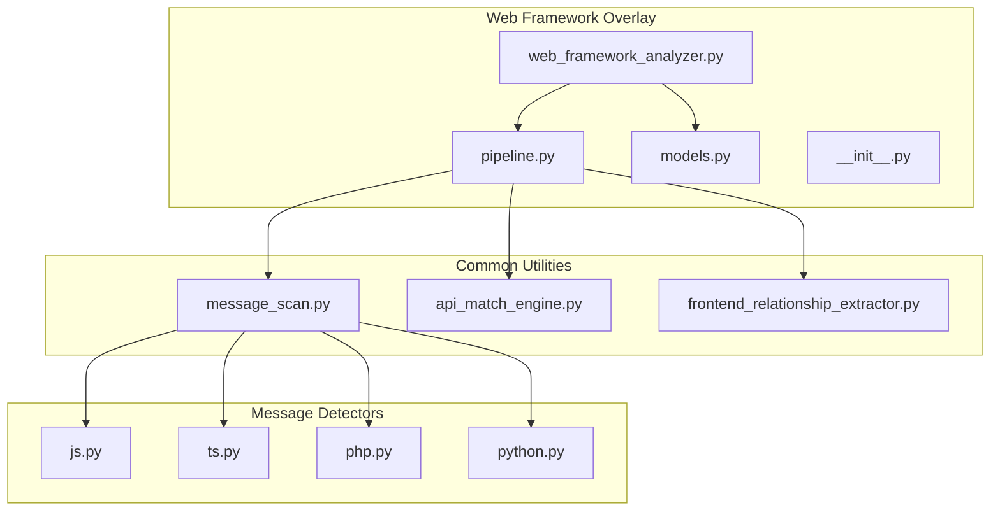
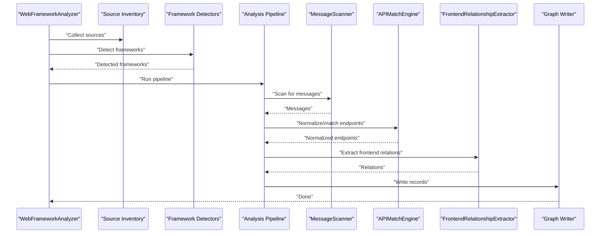
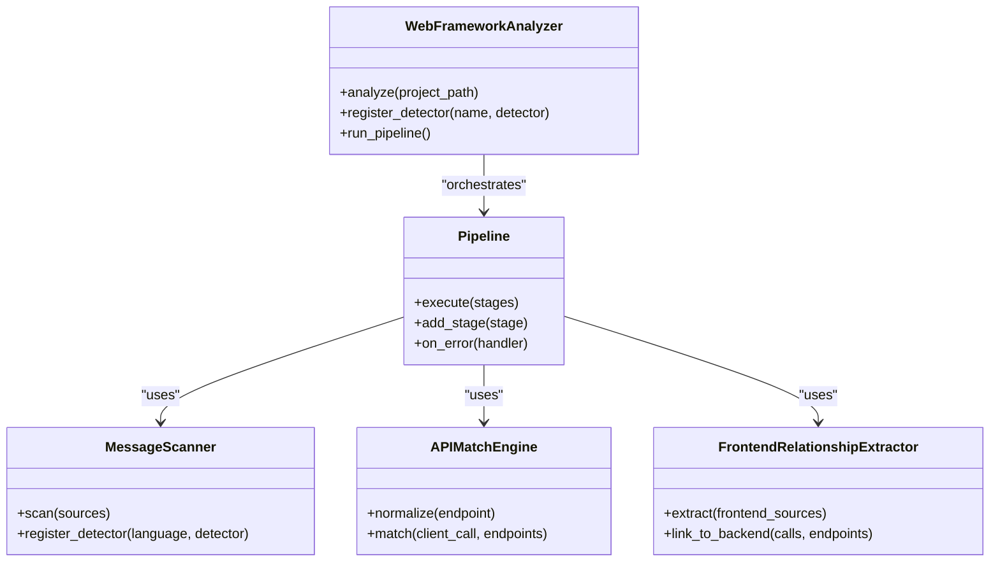
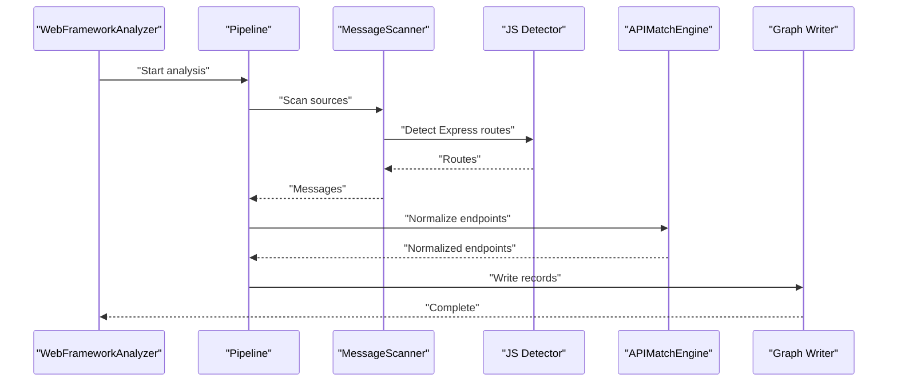
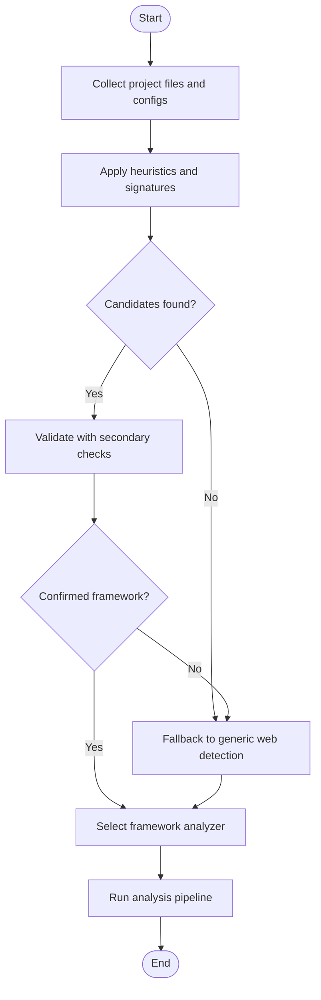
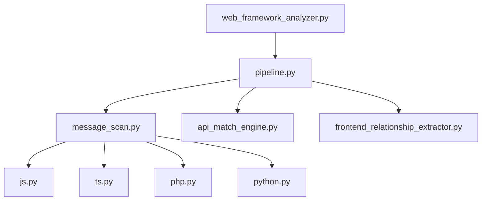

# Generic Web Framework Overlays

<cite>
**Referenced Files in This Document**
- [web_framework_analyzer.py](file://code-tiny/tools/graph/web_framework/web_framework_analyzer.py)
- [pipeline.py](file://code-tiny/tools/graph/web_framework/pipeline.py)
- [models.py](file://code-tiny/tools/graph/web_framework/models.py)
- [__init__.py](file://code-tiny/tools/graph/web_framework/__init__.py)
- [message_scan.py](file://code-tiny/tools/common/message_scan.py)
- [api_match_engine.py](file://code-tiny/tools/common/api_match_engine.py)
- [frontend_relationship_extractor.py](file://code-tiny/tools/common/frontend_relationship_extractor.py)
- [js.py](file://code-tiny/tools/common/message_detectors/js.py)
- [ts.py](file://code-tiny/tools/common/message_detectors/ts.py)
- [php.py](file://code-tiny/tools/common/message_detectors/php.py)
- [python.py](file://code-tiny/tools/common/message_detectors/python.py)
- [test_web_framework_overlay.py](file://tests/test_web_framework_overlay.py)
- [test_framework_fixture_analysis.py](file://tests/test_framework_fixture_analysis.py)
- [test_incremental_sync_framework_overlays.py](file://tests/test_incremental_sync_framework_overlays.py)
- [web_framework_application/django_views.py](file://tests/fixtures/web-framework-application/python/django_views.py)
- [web_framework_application/fastapi_app.py](file://tests/fixtures/web-framework-application/python/fastapi_app.py)
- [web_framework_application/routes.php](file://tests/fixtures/web-framework-application/php/routes.php)
- [web_framework_application/UserController.php](file://tests/fixtures/web-framework-application/php/UserController.php)
- [web_framework_application/urls.py](file://tests/fixtures/web-framework-application/python/urls.py)
</cite>

## Table of Contents
1. [Introduction](#introduction)
2. [Project Structure](#project-structure)
3. [Core Components](#core-components)
4. [Architecture Overview](#architecture-overview)
5. [Detailed Component Analysis](#detailed-component-analysis)
6. [Dependency Analysis](#dependency-analysis)
7. [Performance Considerations](#performance-considerations)
8. [Troubleshooting Guide](#troubleshooting-guide)
9. [Conclusion](#conclusion)
10. [Appendices](#appendices)

## Introduction
This document explains the generic web framework overlay system in Cortex Harness. It describes how overlays extend base language analysis with web-specific semantics such as HTTP routing, request/response flows, template engines, and client-server communication patterns. It also documents the message detection system for identifying API endpoints, WebSocket connections, and event-driven architectures across JavaScript, TypeScript, PHP, and Python frameworks. Examples include analyzing Express.js routes, Django views, Flask endpoints, and Vue.js/React frontend-backend interactions. Finally, it covers framework detection algorithms, plugin registration, customization points, and guidance for developing custom web framework overlays and integrating them into existing analysis pipelines.

## Project Structure
The web framework overlay is implemented under a dedicated module that provides:
- A unified analyzer entry point to orchestrate web framework analysis
- A pipeline to coordinate scanning, detection, and graph writing
- Data models for web artifacts (routes, endpoints, templates, clients)
- Integration with common utilities for message scanning, API matching, and frontend relationship extraction

**Diagram sources**
- [web_framework_analyzer.py](file://code-tiny/tools/graph/web_framework/web_framework_analyzer.py)
- [pipeline.py](file://code-tiny/tools/graph/web_framework/pipeline.py)
- [models.py](file://code-tiny/tools/graph/web_framework/models.py)
- [message_scan.py](file://code-tiny/tools/common/message_scan.py)
- [api_match_engine.py](file://code-tiny/tools/common/api_match_engine.py)
- [frontend_relationship_extractor.py](file://code-tiny/tools/common/frontend_relationship_extractor.py)
- [js.py](file://code-tiny/tools/common/message_detectors/js.py)
- [ts.py](file://code-tiny/tools/common/message_detectors/ts.py)
- [php.py](file://code-tiny/tools/common/message_detectors/php.py)
- [python.py](file://code-tiny/tools/common/message_detectors/python.py)

**Section sources**
- [web_framework_analyzer.py](file://code-tiny/tools/graph/web_framework/web_framework_analyzer.py)
- [pipeline.py](file://code-tiny/tools/graph/web_framework/pipeline.py)
- [models.py](file://code-tiny/tools/graph/web_framework/models.py)
- [__init__.py](file://code-tiny/tools/graph/web_framework/__init__.py)
- [message_scan.py](file://code-tiny/tools/common/message_scan.py)
- [api_match_engine.py](file://code-tiny/tools/common/api_match_engine.py)
- [frontend_relationship_extractor.py](file://code-tiny/tools/common/frontend_relationship_extractor.py)
- [js.py](file://code-tiny/tools/common/message_detectors/js.py)
- [ts.py](file://code-tiny/tools/common/message_detectors/ts.py)
- [php.py](file://code-tiny/tools/common/message_detectors/php.py)
- [python.py](file://code-tiny/tools/common/message_detectors/python.py)

## Core Components
- Web Framework Analyzer: Orchestrates discovery, detection, and analysis of web frameworks within a project. It coordinates scanning, invokes detectors, and writes semantic graph records.
- Pipeline: Provides a structured flow from source inventory through message scanning, API matching, and frontend relationship extraction to final graph output.
- Models: Defines canonical data structures for web artifacts such as routes, endpoints, templates, and client-server relationships.
- Message Scanning: Detects messages (HTTP calls, WebSocket events, RPC calls) using language-specific detectors.
- API Match Engine: Normalizes and matches API endpoints across languages and frameworks.
- Frontend Relationship Extractor: Identifies frontend-to-backend interactions (e.g., fetch/AJAX calls, GraphQL queries).

Key responsibilities:
- Framework detection via heuristics and file signatures
- Plugin registration for new framework analyzers
- Extensible message detection per language
- Graph integration for downstream querying and impact analysis

**Section sources**
- [web_framework_analyzer.py](file://code-tiny/tools/graph/web_framework/web_framework_analyzer.py)
- [pipeline.py](file://code-tiny/tools/graph/web_framework/pipeline.py)
- [models.py](file://code-tiny/tools/graph/web_framework/models.py)
- [message_scan.py](file://code-tiny/tools/common/message_scan.py)
- [api_match_engine.py](file://code-tiny/tools/common/api_match_engine.py)
- [frontend_relationship_extractor.py](file://code-tiny/tools/common/frontend_relationship_extractor.py)

## Architecture Overview
The overlay architecture composes several layers:
- Detection Layer: Identifies frameworks by scanning configuration files, dependency manifests, and code patterns.
- Analysis Layer: Applies framework-specific rules to extract routes, views, controllers, and templates.
- Messaging Layer: Uses message detectors to find HTTP endpoints, WebSocket handlers, and event-driven signals.
- Integration Layer: Writes normalized records into the semantic graph and links frontend and backend components.

**Diagram sources**
- [web_framework_analyzer.py](file://code-tiny/tools/graph/web_framework/web_framework_analyzer.py)
- [pipeline.py](file://code-tiny/tools/graph/web_framework/pipeline.py)
- [message_scan.py](file://code-tiny/tools/common/message_scan.py)
- [api_match_engine.py](file://code-tiny/tools/common/api_match_engine.py)
- [frontend_relationship_extractor.py](file://code-tiny/tools/common/frontend_relationship_extractor.py)

## Detailed Component Analysis

### Web Framework Analyzer
Responsibilities:
- Initialize analysis context and configuration
- Discover candidate frameworks
- Coordinate pipeline execution
- Aggregate results and write graph records

Design patterns:
- Composition over inheritance for pluggable detectors
- Strategy pattern for framework-specific analysis steps
- Registry-based plugin registration for extensibility

Customization points:
- Register new framework detectors
- Add or override analysis steps in the pipeline
- Extend models for new artifact types

**Section sources**
- [web_framework_analyzer.py](file://code-tiny/tools/graph/web_framework/web_framework_analyzer.py)
- [__init__.py](file://code-tiny/tools/graph/web_framework/__init__.py)

### Analysis Pipeline
Responsibilities:
- Orchestrate stages: scan, detect, analyze, normalize, link, write
- Provide hooks for incremental updates
- Manage error handling and logging

Stages:
- Source inventory collection
- Framework detection
- Message scanning
- API normalization and matching
- Frontend-backend relation extraction
- Graph record emission

Extensibility:
- Insert custom stages between existing ones
- Override stage behavior via strategy interfaces
- Configure stage parameters at runtime

**Section sources**
- [pipeline.py](file://code-tiny/tools/graph/web_framework/pipeline.py)

### Data Models
Responsibilities:
- Define canonical representations for web artifacts
- Ensure consistent schema across frameworks
- Support serialization to graph nodes and edges

Key entities:
- Route: path, method, handler reference, metadata
- Endpoint: normalized API surface, parameters, response shape hints
- Template: engine type, location, variables
- ClientCall: frontend call site, target endpoint, payload hints

Normalization:
- Path templating and parameter extraction
- Method and content-type standardization
- Cross-language symbol resolution

**Section sources**
- [models.py](file://code-tiny/tools/graph/web_framework/models.py)

### Message Detection System
Responsibilities:
- Identify HTTP endpoints, WebSocket handlers, and event-driven signals
- Support multiple languages and frameworks
- Produce normalized messages for downstream processing

Language-specific detectors:
- JavaScript: Express-style route definitions, fetch/AJAX calls, WebSocket usage
- TypeScript: Typed route definitions, API client generation markers
- PHP: Router declarations, controller actions, Blade/Twig template references
- Python: Django views, Flask endpoints, FastAPI decorators, URL configurations

Detection strategies:
- AST-based parsing where available
- Regex and heuristic scanning for dynamic patterns
- Configuration file inspection (e.g., routing tables)

Integration:
- Unified interface for detector registration
- Confidence scoring and disambiguation
- Error recovery and partial results

**Section sources**
- [message_scan.py](file://code-tiny/tools/common/message_scan.py)
- [js.py](file://code-tiny/tools/common/message_detectors/js.py)
- [ts.py](file://code-tiny/tools/common/message_detectors/ts.py)
- [php.py](file://code-tiny/tools/common/message_detectors/php.py)
- [python.py](file://code-tiny/tools/common/message_detectors/python.py)

### API Matching Engine
Responsibilities:
- Normalize detected endpoints across frameworks
- Match frontend calls to backend endpoints
- Resolve path parameters and query constraints

Algorithms:
- Pattern matching with parameter placeholders
- Semantic equivalence checks for similar paths
- Weighted scoring based on confidence signals

Outputs:
- Mapped pairs of client calls and server endpoints
- Disambiguated choices when multiple candidates exist

**Section sources**
- [api_match_engine.py](file://code-tiny/tools/common/api_match_engine.py)

### Frontend Relationship Extractor
Responsibilities:
- Identify frontend-to-backend interactions
- Extract call sites, payloads, and headers
- Link UI components to backend endpoints

Techniques:
- Static analysis of fetch/AJAX calls
- Template variable binding to API responses
- GraphQL query extraction and mapping

**Section sources**
- [frontend_relationship_extractor.py](file://code-tiny/tools/common/frontend_relationship_extractor.py)

### Framework-Specific Examples

#### Express.js Routes (JavaScript/TypeScript)
- Detection focuses on route registration patterns and middleware chains
- Supports REST and WebSocket endpoints
- Integrates with TypeScript type annotations for improved accuracy

Relevant detectors:
- [js.py](file://code-tiny/tools/common/message_detectors/js.py)
- [ts.py](file://code-tiny/tools/common/message_detectors/ts.py)

#### Django Views (Python)
- Recognizes function/class-based views and URL configurations
- Handles template rendering and form processing signals
- Maps URL patterns to view functions

Relevant detectors:
- [python.py](file://code-tiny/tools/common/message_detectors/python.py)

Example fixtures:
- [django_views.py](file://tests/fixtures/web-framework-application/python/django_views.py)
- [urls.py](file://tests/fixtures/web-framework-application/python/urls.py)

#### Flask Endpoints (Python)
- Detects route decorators and blueprint registrations
- Captures request/response transformations
- Links to template engines and static assets

Relevant detectors:
- [python.py](file://code-tiny/tools/common/message_detectors/python.py)

Example fixtures:
- [fastapi_app.py](file://tests/fixtures/web-framework-application/python/fastapi_app.py)

#### PHP Routing and Controllers
- Parses router declarations and controller action methods
- Identifies Blade/Twig template usage and asset references
- Resolves URL patterns to controller methods

Relevant detectors:
- [php.py](file://code-tiny/tools/common/message_detectors/php.py)

Example fixtures:
- [routes.php](file://tests/fixtures/web-framework-application/php/routes.php)
- [UserController.php](file://tests/fixtures/web-framework-application/php/UserController.php)

#### Vue.js/React Frontend-Backend Interactions
- Extracts fetch/AJAX calls and GraphQL queries
- Maps component state changes to API responses
- Links template bindings to backend endpoints

Relevant extractor:
- [frontend_relationship_extractor.py](file://code-tiny/tools/common/frontend_relationship_extractor.py)

**Section sources**
- [js.py](file://code-tiny/tools/common/message_detectors/js.py)
- [ts.py](file://code-tiny/tools/common/message_detectors/ts.py)
- [python.py](file://code-tiny/tools/common/message_detectors/python.py)
- [php.py](file://code-tiny/tools/common/message_detectors/php.py)
- [frontend_relationship_extractor.py](file://code-tiny/tools/common/frontend_relationship_extractor.py)
- [django_views.py](file://tests/fixtures/web-framework-application/python/django_views.py)
- [urls.py](file://tests/fixtures/web-framework-application/python/urls.py)
- [fastapi_app.py](file://tests/fixtures/web-framework-application/python/fastapi_app.py)
- [routes.php](file://tests/fixtures/web-framework-application/php/routes.php)
- [UserController.php](file://tests/fixtures/web-framework-application/php/UserController.php)

### Class Diagram: Core Classes and Relationships

**Diagram sources**
- [web_framework_analyzer.py](file://code-tiny/tools/graph/web_framework/web_framework_analyzer.py)
- [pipeline.py](file://code-tiny/tools/graph/web_framework/pipeline.py)
- [message_scan.py](file://code-tiny/tools/common/message_scan.py)
- [api_match_engine.py](file://code-tiny/tools/common/api_match_engine.py)
- [frontend_relationship_extractor.py](file://code-tiny/tools/common/frontend_relationship_extractor.py)

### Sequence Diagram: Analyzing an Express.js Route

**Diagram sources**
- [web_framework_analyzer.py](file://code-tiny/tools/graph/web_framework/web_framework_analyzer.py)
- [pipeline.py](file://code-tiny/tools/graph/web_framework/pipeline.py)
- [message_scan.py](file://code-tiny/tools/common/message_scan.py)
- [js.py](file://code-tiny/tools/common/message_detectors/js.py)
- [api_match_engine.py](file://code-tiny/tools/common/api_match_engine.py)

### Flowchart: Framework Detection Algorithm

[No sources needed since this diagram shows conceptual workflow, not actual code structure]

## Dependency Analysis
The overlay depends on common utilities for scanning, matching, and extraction. The following diagram illustrates key dependencies:

**Diagram sources**
- [web_framework_analyzer.py](file://code-tiny/tools/graph/web_framework/web_framework_analyzer.py)
- [pipeline.py](file://code-tiny/tools/graph/web_framework/pipeline.py)
- [message_scan.py](file://code-tiny/tools/common/message_scan.py)
- [api_match_engine.py](file://code-tiny/tools/common/api_match_engine.py)
- [frontend_relationship_extractor.py](file://code-tiny/tools/common/frontend_relationship_extractor.py)
- [js.py](file://code-tiny/tools/common/message_detectors/js.py)
- [ts.py](file://code-tiny/tools/common/message_detectors/ts.py)
- [php.py](file://code-tiny/tools/common/message_detectors/php.py)
- [python.py](file://code-tiny/tools/common/message_detectors/python.py)

**Section sources**
- [web_framework_analyzer.py](file://code-tiny/tools/graph/web_framework/web_framework_analyzer.py)
- [pipeline.py](file://code-tiny/tools/graph/web_framework/pipeline.py)
- [message_scan.py](file://code-tiny/tools/common/message_scan.py)
- [api_match_engine.py](file://code-tiny/tools/common/api_match_engine.py)
- [frontend_relationship_extractor.py](file://code-tiny/tools/common/frontend_relationship_extractor.py)
- [js.py](file://code-tiny/tools/common/message_detectors/js.py)
- [ts.py](file://code-tiny/tools/common/message_detectors/ts.py)
- [php.py](file://code-tiny/tools/common/message_detectors/php.py)
- [python.py](file://code-tiny/tools/common/message_detectors/python.py)

## Performance Considerations
- Incremental scanning: Reuse previous results and only reprocess changed sources to reduce overhead.
- Detector caching: Cache parsed ASTs and regex matches to avoid repeated work.
- Parallelization: Run independent detectors concurrently for different languages or modules.
- Early filtering: Use lightweight heuristics to exclude irrelevant files before heavy analysis.
- Memory management: Stream large source lists and limit in-memory graph growth during intermediate stages.

[No sources needed since this section provides general guidance]

## Troubleshooting Guide
Common issues and resolutions:
- Missing framework detection: Verify configuration files and dependency manifests are included in the source inventory.
- False positives in route detection: Adjust detector thresholds and add negative patterns to reduce noise.
- Incomplete frontend-backend linking: Ensure both frontend and backend sources are scanned and that API match engine includes relevant normalization rules.
- Performance regressions: Enable incremental sync and detector caching; profile hotspots in message scanning.

Validation and tests:
- Unit and integration tests validate overlay behavior and fixture analyses.
- Regression tests ensure compatibility with existing analysis pipelines.

**Section sources**
- [test_web_framework_overlay.py](file://tests/test_web_framework_overlay.py)
- [test_framework_fixture_analysis.py](file://tests/test_framework_fixture_analysis.py)
- [test_incremental_sync_framework_overlays.py](file://tests/test_incremental_sync_framework_overlays.py)

## Conclusion
The generic web framework overlay system extends Cortex Harness with robust web-specific semantics across multiple languages and frameworks. By combining framework detection, message scanning, API normalization, and frontend-backend relationship extraction, it delivers comprehensive insights into HTTP routing, request/response flows, template engines, and client-server interactions. Its modular design supports easy extension for new frameworks and seamless integration into existing analysis pipelines.

[No sources needed since this section summarizes without analyzing specific files]

## Appendices

### Developing Custom Web Framework Overlays
Steps:
- Implement a framework detector with signature and heuristic checks
- Register the detector in the analyzer’s registry
- Add language-specific message detectors if needed
- Extend models for any new artifact types
- Integrate custom pipeline stages for specialized analysis
- Write tests against representative fixtures

Best practices:
- Keep detectors deterministic and idempotent
- Provide confidence scores to aid disambiguation
- Document expected file patterns and configuration keys
- Prefer AST-based parsing when available for accuracy

**Section sources**
- [web_framework_analyzer.py](file://code-tiny/tools/graph/web_framework/web_framework_analyzer.py)
- [pipeline.py](file://code-tiny/tools/graph/web_framework/pipeline.py)
- [models.py](file://code-tiny/tools/graph/web_framework/models.py)
- [message_scan.py](file://code-tiny/tools/common/message_scan.py)
- [api_match_engine.py](file://code-tiny/tools/common/api_match_engine.py)
- [frontend_relationship_extractor.py](file://code-tiny/tools/common/frontend_relationship_extractor.py)