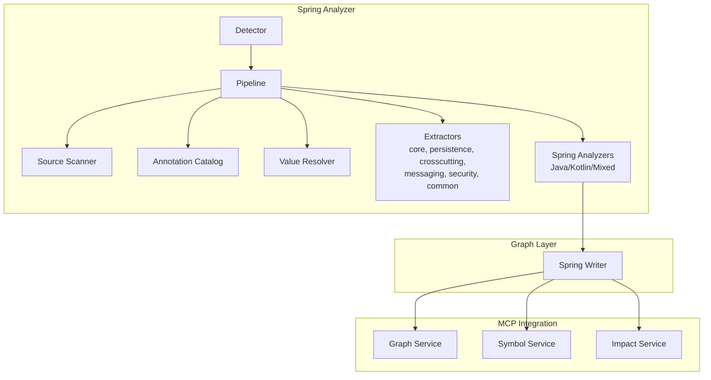
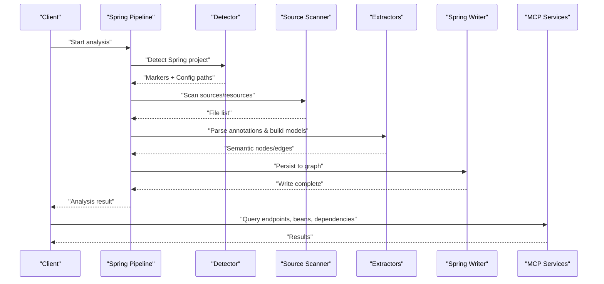
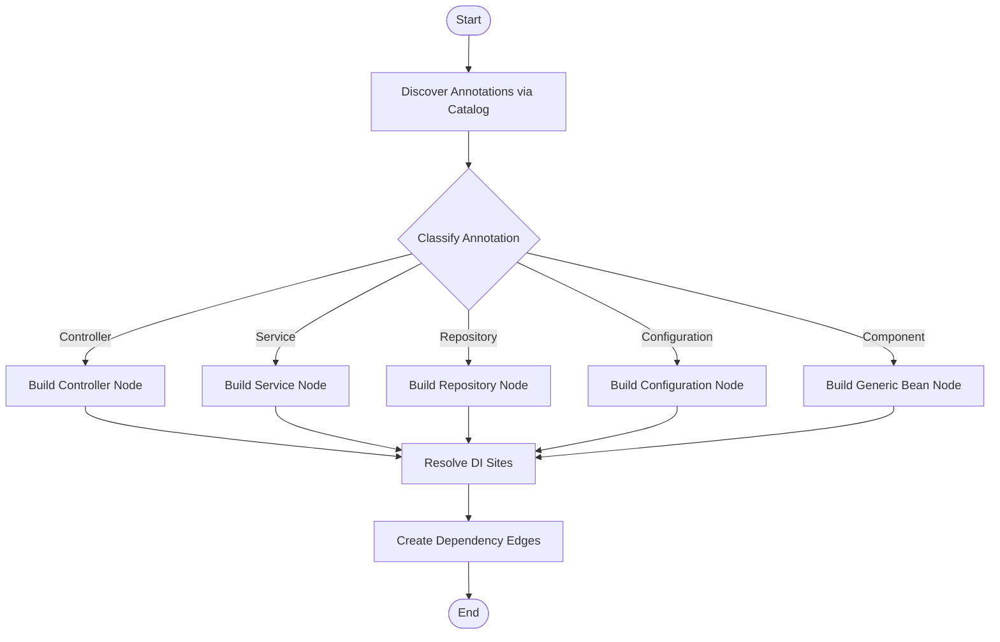
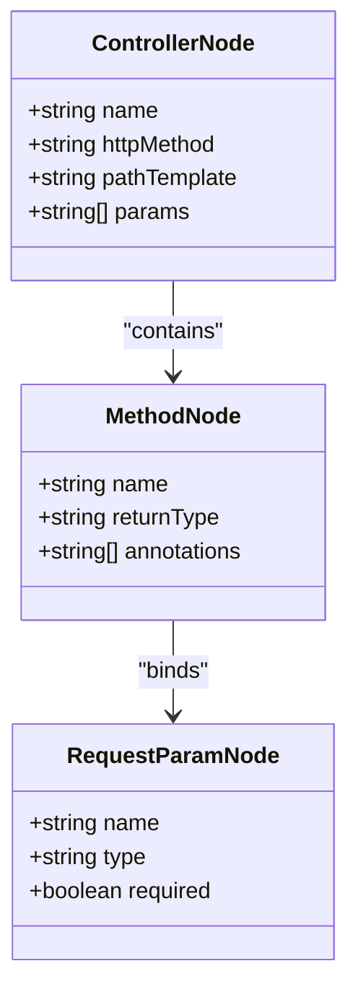
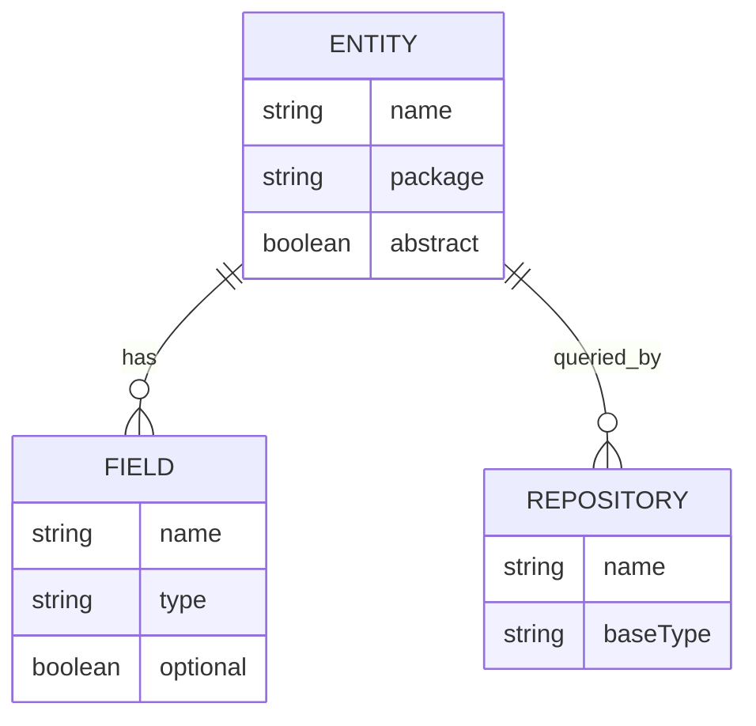
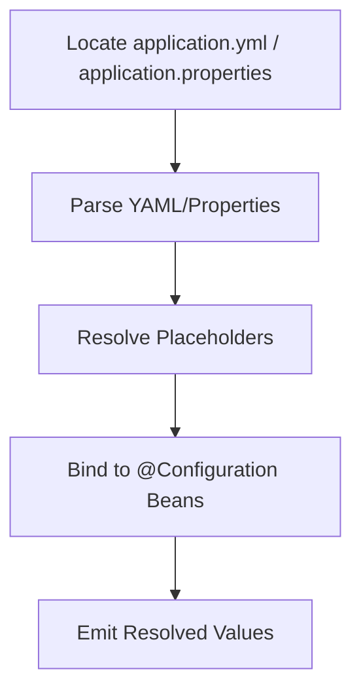
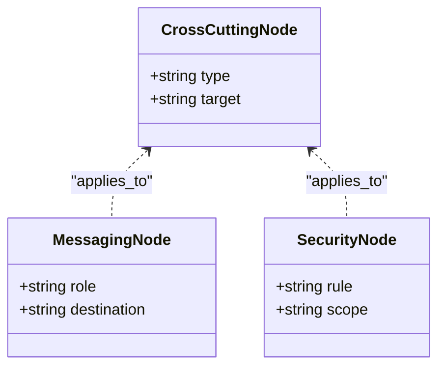
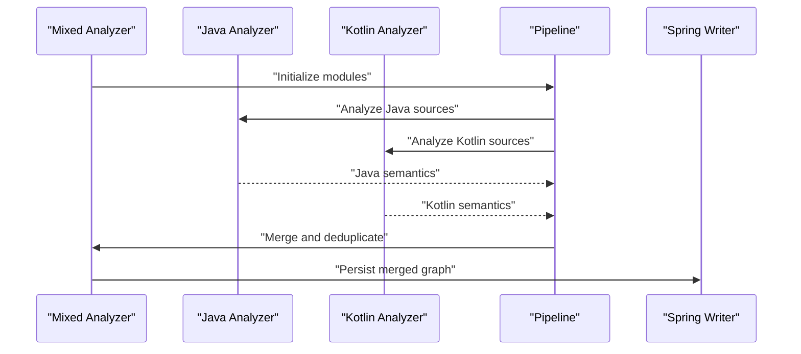
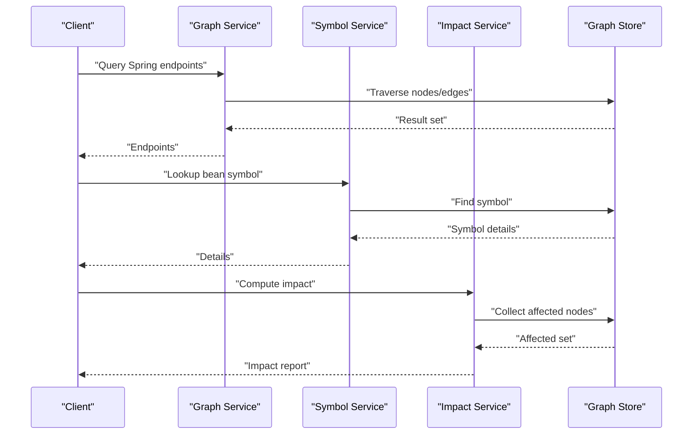
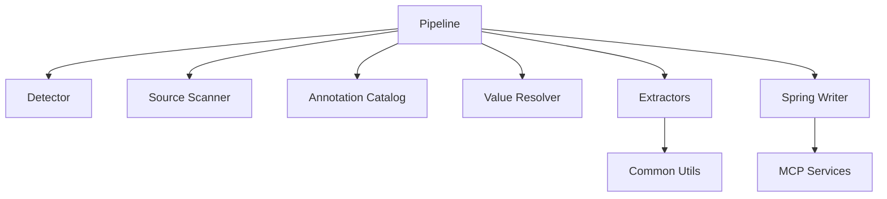

# Spring Boot Analysis

<cite>
**Referenced Files in This Document**
- [spring_analyzer.py](file://code-tiny/tools/spring/spring_analyzer.py)
- [spring_java_analyzer.py](file://code-tiny/tools/spring/spring_java_analyzer.py)
- [spring_kotlin_analyzer.py](file://code-tiny/tools/spring/spring_kotlin_analyzer.py)
- [spring_mixed_analyzer.py](file://code-tiny/tools/spring/spring_mixed_analyzer.py)
- [detector.py](file://code-tiny/tools/spring/detector.py)
- [pipeline.py](file://code-tiny/tools/spring/pipeline.py)
- [annotation_catalog.py](file://code-tiny/tools/spring/annotation_catalog.py)
- [value_resolver.py](file://code-tiny/tools/spring/value_resolver.py)
- [source_scanner.py](file://code-tiny/tools/spring/source_scanner.py)
- [adapters.py](file://code-tiny/tools/spring/adapters.py)
- [config.py](file://code-tiny/tools/spring/config.py)
- [cache.py](file://code-tiny/tools/spring/cache.py)
- [models.py](file://code-tiny/tools/spring/models.py)
- [core.py](file://code-tiny/tools/spring/extractors/core.py)
- [persistence.py](file://code-tiny/tools/spring/extractors/persistence.py)
- [crosscutting.py](file://code-tiny/tools/spring/extractors/crosscutting.py)
- [messaging.py](file://code-tiny/tools/spring/extractors/messaging.py)
- [security.py](file://code-tiny/tools/spring/extractors/security.py)
- [common.py](file://code-tiny/tools/spring/extractors/common.py)
- [spring_writer.py](file://code-tiny/tools/graph/writer/spring_writer.py)
- [graph_service.py](file://code-tiny/mcp/java/services/graph_service.py)
- [symbol_service.py](file://code-tiny/mcp/java/services/symbol_service.py)
- [impact_service.py](file://code-tiny/mcp/java/services/impact_service.py)
</cite>

## Table of Contents
1. [Introduction](#introduction)
2. [Project Structure](#project-structure)
3. [Core Components](#core-components)
4. [Architecture Overview](#architecture-overview)
5. [Detailed Component Analysis](#detailed-component-analysis)
6. [Dependency Analysis](#dependency-analysis)
7. [Performance Considerations](#performance-considerations)
8. [Troubleshooting Guide](#troubleshooting-guide)
9. [Conclusion](#conclusion)

## Introduction
This document explains how Cortex Harness analyzes Spring and Spring Boot applications. It covers annotation processing (@RestController, @Service, @Repository, @Configuration), dependency injection patterns, REST endpoint discovery, JPA entity relationships, and configuration files (application.yml, application.properties). It also documents bean definition extraction, controller mapping resolution, service layer relationships, data access patterns, multi-module analysis strategies, performance optimization for large codebases, incremental analysis approaches, and troubleshooting guidance for common Spring-specific issues.

## Project Structure
The Spring analysis capability is implemented as a dedicated analyzer module with clear separation between detection, scanning, extraction, graph writing, and MCP integration. The key directories are:
- tools/spring: Core Spring analyzer, detectors, extractors, models, pipeline, and utilities
- tools/graph/writer/spring_writer.py: Graph persistence writer for Spring artifacts
- mcp/java/services: MCP services that expose Spring-aware queries to clients

**Diagram sources**
- [detector.py](file://code-tiny/tools/spring/detector.py)
- [pipeline.py](file://code-tiny/tools/spring/pipeline.py)
- [source_scanner.py](file://code-tiny/tools/spring/source_scanner.py)
- [annotation_catalog.py](file://code-tiny/tools/spring/annotation_catalog.py)
- [value_resolver.py](file://code-tiny/tools/spring/value_resolver.py)
- [core.py](file://code-tiny/tools/spring/extractors/core.py)
- [persistence.py](file://code-tiny/tools/spring/extractors/persistence.py)
- [crosscutting.py](file://code-tiny/tools/spring/extractors/crosscutting.py)
- [messaging.py](file://code-tiny/tools/spring/extractors/messaging.py)
- [security.py](file://code-tiny/tools/spring/extractors/security.py)
- [common.py](file://code-tiny/tools/spring/extractors/common.py)
- [spring_analyzer.py](file://code-tiny/tools/spring/spring_analyzer.py)
- [spring_java_analyzer.py](file://code-tiny/tools/spring/spring_java_analyzer.py)
- [spring_kotlin_analyzer.py](file://code-tiny/tools/spring/spring_kotlin_analyzer.py)
- [spring_mixed_analyzer.py](file://code-tiny/tools/spring/spring_mixed_analyzer.py)
- [spring_writer.py](file://code-tiny/tools/graph/writer/spring_writer.py)
- [graph_service.py](file://code-tiny/mcp/java/services/graph_service.py)
- [symbol_service.py](file://code-tiny/mcp/java/services/symbol_service.py)
- [impact_service.py](file://code-tiny/mcp/java/services/impact_service.py)

**Section sources**
- [detector.py](file://code-tiny/tools/spring/detector.py)
- [pipeline.py](file://code-tiny/tools/spring/pipeline.py)
- [spring_analyzer.py](file://code-tiny/tools/spring/spring_analyzer.py)
- [spring_writer.py](file://code-tiny/tools/graph/writer/spring_writer.py)

## Core Components
- Detector: Identifies Spring/Spring Boot projects by presence of framework markers and configuration files.
- Pipeline: Orchestrates scanning, extraction, and writing phases; integrates caching and incremental updates.
- Source Scanner: Locates relevant source files and resources across modules.
- Annotation Catalog: Maps Spring annotations to semantic categories used by extractors.
- Value Resolver: Resolves property placeholders and configuration values from application.yml/properties.
- Extractors: Specialized modules for core beans, persistence (JPA/Hibernate), cross-cutting concerns, messaging, and security.
- Spring Analyzers: Language-specific entry points for Java, Kotlin, and mixed codebases.
- Spring Writer: Persists extracted Spring semantics into the graph store.
- MCP Services: Expose query capabilities for graphs, symbols, and impact analysis.

**Section sources**
- [detector.py](file://code-tiny/tools/spring/detector.py)
- [pipeline.py](file://code-tiny/tools/spring/pipeline.py)
- [source_scanner.py](file://code-tiny/tools/spring/source_scanner.py)
- [annotation_catalog.py](file://code-tiny/tools/spring/annotation_catalog.py)
- [value_resolver.py](file://code-tiny/tools/spring/value_resolver.py)
- [core.py](file://code-tiny/tools/spring/extractors/core.py)
- [persistence.py](file://code-tiny/tools/spring/extractors/persistence.py)
- [crosscutting.py](file://code-tiny/tools/spring/extractors/crosscutting.py)
- [messaging.py](file://code-tiny/tools/spring/extractors/messaging.py)
- [security.py](file://code-tiny/tools/spring/extractors/security.py)
- [spring_analyzer.py](file://code-tiny/tools/spring/spring_analyzer.py)
- [spring_java_analyzer.py](file://code-tiny/tools/spring/spring_java_analyzer.py)
- [spring_kotlin_analyzer.py](file://code-tiny/tools/spring/spring_kotlin_analyzer.py)
- [spring_mixed_analyzer.py](file://code-tiny/tools/spring/spring_mixed_analyzer.py)
- [spring_writer.py](file://code-tiny/tools/graph/writer/spring_writer.py)

## Architecture Overview
The Spring analysis pipeline follows a layered architecture:
- Detection phase identifies Spring-enabled projects and config locations.
- Scanning phase enumerates source files and resources.
- Extraction phase parses annotations and constructs semantic models.
- Writing phase persists results to the graph database.
- MCP services provide query interfaces over the persisted graph.

**Diagram sources**
- [pipeline.py](file://code-tiny/tools/spring/pipeline.py)
- [detector.py](file://code-tiny/tools/spring/detector.py)
- [source_scanner.py](file://code-tiny/tools/spring/source_scanner.py)
- [core.py](file://code-tiny/tools/spring/extractors/core.py)
- [persistence.py](file://code-tiny/tools/spring/extractors/persistence.py)
- [spring_writer.py](file://code-tiny/tools/graph/writer/spring_writer.py)
- [graph_service.py](file://code-tiny/mcp/java/services/graph_service.py)
- [symbol_service.py](file://code-tiny/mcp/java/services/symbol_service.py)
- [impact_service.py](file://code-tiny/mcp/java/services/impact_service.py)

## Detailed Component Analysis

### Spring Annotation Processing and Bean Discovery
- Annotation Catalog maps Spring annotations to categories such as controllers, services, repositories, configurations, and components.
- Extractors use this catalog to identify annotated classes and methods, then construct nodes and edges representing beans and their relationships.
- Dependency injection patterns are inferred from constructor, field, and method injection sites, including generic type hints where available.

**Diagram sources**
- [annotation_catalog.py](file://code-tiny/tools/spring/annotation_catalog.py)
- [core.py](file://code-tiny/tools/spring/extractors/core.py)
- [common.py](file://code-tiny/tools/spring/extractors/common.py)

**Section sources**
- [annotation_catalog.py](file://code-tiny/tools/spring/annotation_catalog.py)
- [core.py](file://code-tiny/tools/spring/extractors/core.py)
- [common.py](file://code-tiny/tools/spring/extractors/common.py)

### REST Endpoint Discovery
- Controllers annotated with @RestController or @Controller are identified.
- Mapping annotations on methods are parsed to derive HTTP verbs and path templates.
- Parameter binding annotations are recognized to associate request parameters, headers, and bodies with method signatures.

**Diagram sources**
- [core.py](file://code-tiny/tools/spring/extractors/core.py)
- [common.py](file://code-tiny/tools/spring/extractors/common.py)

**Section sources**
- [core.py](file://code-tiny/tools/spring/extractors/core.py)
- [common.py](file://code-tiny/tools/spring/extractors/common.py)

### JPA Entity Relationships and Data Access Patterns
- Persistence extractor recognizes JPA entities, repository interfaces, and related annotations.
- Entity relationships (e.g., one-to-one, one-to-many, many-to-many) are captured as edges between entity nodes.
- Repository interfaces and custom query methods are linked to underlying data access patterns.

**Diagram sources**
- [persistence.py](file://code-tiny/tools/spring/extractors/persistence.py)
- [common.py](file://code-tiny/tools/spring/extractors/common.py)

**Section sources**
- [persistence.py](file://code-tiny/tools/spring/extractors/persistence.py)
- [common.py](file://code-tiny/tools/spring/extractors/common.py)

### Configuration Files and Property Resolution
- Value resolver reads application.yml and application.properties to resolve placeholders and environment-specific overrides.
- Configuration classes annotated with @Configuration and @Bean definitions are mapped to bean nodes with resolved values where possible.

**Diagram sources**
- [value_resolver.py](file://code-tiny/tools/spring/value_resolver.py)
- [core.py](file://code-tiny/tools/spring/extractors/core.py)

**Section sources**
- [value_resolver.py](file://code-tiny/tools/spring/value_resolver.py)
- [core.py](file://code-tiny/tools/spring/extractors/core.py)

### Cross-Cutting Concerns, Messaging, and Security
- Crosscutting extractor captures aspects, interceptors, and advice patterns.
- Messaging extractor identifies message listeners, producers, and channel bindings.
- Security extractor recognizes authorization annotations and security configurations.

**Diagram sources**
- [crosscutting.py](file://code-tiny/tools/spring/extractors/crosscutting.py)
- [messaging.py](file://code-tiny/tools/spring/extractors/messaging.py)
- [security.py](file://code-tiny/tools/spring/extractors/security.py)

**Section sources**
- [crosscutting.py](file://code-tiny/tools/spring/extractors/crosscutting.py)
- [messaging.py](file://code-tiny/tools/spring/extractors/messaging.py)
- [security.py](file://code-tiny/tools/spring/extractors/security.py)

### Multi-Module and Mixed-Language Support
- Mixed analyzer coordinates Java and Kotlin sources within the same project.
- Pipeline supports multiple modules by aggregating scanner results and merging semantic graphs.
- Adapters normalize differences between language-specific ASTs into unified models.

**Diagram sources**
- [spring_mixed_analyzer.py](file://code-tiny/tools/spring/spring_mixed_analyzer.py)
- [spring_java_analyzer.py](file://code-tiny/tools/spring/spring_java_analyzer.py)
- [spring_kotlin_analyzer.py](file://code-tiny/tools/spring/spring_kotlin_analyzer.py)
- [pipeline.py](file://code-tiny/tools/spring/pipeline.py)
- [spring_writer.py](file://code-tiny/tools/graph/writer/spring_writer.py)

**Section sources**
- [spring_mixed_analyzer.py](file://code-tiny/tools/spring/spring_mixed_analyzer.py)
- [spring_java_analyzer.py](file://code-tiny/tools/spring/spring_java_analyzer.py)
- [spring_kotlin_analyzer.py](file://code-tiny/tools/spring/spring_kotlin_analyzer.py)
- [pipeline.py](file://code-tiny/tools/spring/pipeline.py)
- [spring_writer.py](file://code-tiny/tools/graph/writer/spring_writer.py)

### MCP Query Integration
- Graph service exposes traversal and pattern queries over Spring artifacts.
- Symbol service provides symbol lookups and references for Spring beans and endpoints.
- Impact service computes change impact across controllers, services, and repositories.

**Diagram sources**
- [graph_service.py](file://code-tiny/mcp/java/services/graph_service.py)
- [symbol_service.py](file://code-tiny/mcp/java/services/symbol_service.py)
- [impact_service.py](file://code-tiny/mcp/java/services/impact_service.py)

**Section sources**
- [graph_service.py](file://code-tiny/mcp/java/services/graph_service.py)
- [symbol_service.py](file://code-tiny/mcp/java/services/symbol_service.py)
- [impact_service.py](file://code-tiny/mcp/java/services/impact_service.py)

## Dependency Analysis
The Spring analyzer depends on shared graph operations and writers, and integrates with MCP services for querying. Key relationships include:
- Pipeline orchestrates detector, scanner, extractors, and writer.
- Extractors rely on common utilities and annotation catalog.
- Writers persist to the graph store consumed by MCP services.

**Diagram sources**
- [pipeline.py](file://code-tiny/tools/spring/pipeline.py)
- [detector.py](file://code-tiny/tools/spring/detector.py)
- [source_scanner.py](file://code-tiny/tools/spring/source_scanner.py)
- [annotation_catalog.py](file://code-tiny/tools/spring/annotation_catalog.py)
- [value_resolver.py](file://code-tiny/tools/spring/value_resolver.py)
- [common.py](file://code-tiny/tools/spring/extractors/common.py)
- [spring_writer.py](file://code-tiny/tools/graph/writer/spring_writer.py)
- [graph_service.py](file://code-tiny/mcp/java/services/graph_service.py)

**Section sources**
- [pipeline.py](file://code-tiny/tools/spring/pipeline.py)
- [spring_writer.py](file://code-tiny/tools/graph/writer/spring_writer.py)

## Performance Considerations
- Incremental analysis: Use pipeline-level caching and state tracking to re-analyze only changed modules and files.
- Parallel scanning: Leverage multi-threaded scanning for large codebases; ensure thread-safe writes to the graph.
- Selective extraction: Filter by annotation categories to reduce parsing overhead when focusing on specific layers (e.g., controllers only).
- Configuration caching: Cache resolved properties to avoid repeated file I/O.
- Batch writes: Group node/edge insertions to minimize round-trips to the graph store.
- Indexing: Ensure indexes exist on frequently queried attributes (e.g., bean names, HTTP paths).

[No sources needed since this section provides general guidance]

## Troubleshooting Guide
Common Spring-specific analysis issues and resolutions:
- Missing configuration files: Verify application.yml/application.properties paths detected by the detector; adjust scanner filters if non-standard locations are used.
- Placeholder resolution failures: Check environment variables and profile-specific overrides; ensure value resolver has access to all necessary contexts.
- Mixed-language conflicts: Confirm mixed analyzer merges Java and Kotlin correctly; validate adapters normalize types consistently.
- Duplicate beans: Deduplicate based on canonical identifiers; review annotation catalog mappings for overlapping categories.
- Large project slowdowns: Enable incremental mode, limit scan scope, and batch write operations.

**Section sources**
- [detector.py](file://code-tiny/tools/spring/detector.py)
- [value_resolver.py](file://code-tiny/tools/spring/value_resolver.py)
- [spring_mixed_analyzer.py](file://code-tiny/tools/spring/spring_mixed_analyzer.py)
- [pipeline.py](file://code-tiny/tools/spring/pipeline.py)

## Conclusion
Cortex Harness provides a comprehensive Spring analysis pipeline that detects projects, scans sources and resources, extracts semantic models from annotations, resolves configuration values, and persists results to a graph for powerful querying. With support for Java, Kotlin, and mixed environments, it enables deep insights into controllers, services, repositories, and cross-cutting concerns while offering performance optimizations and incremental strategies suitable for large codebases.