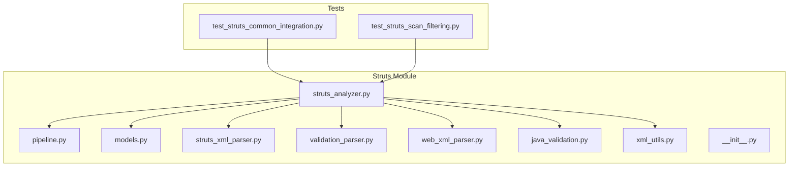
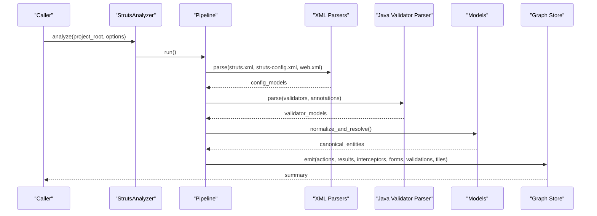
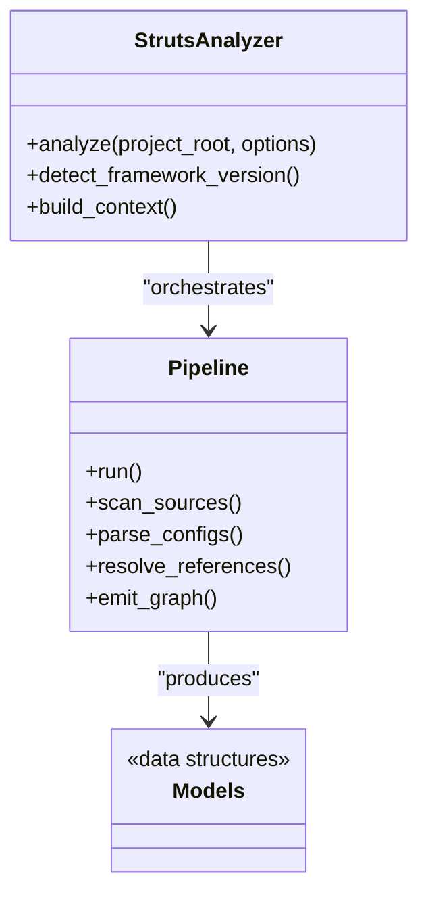
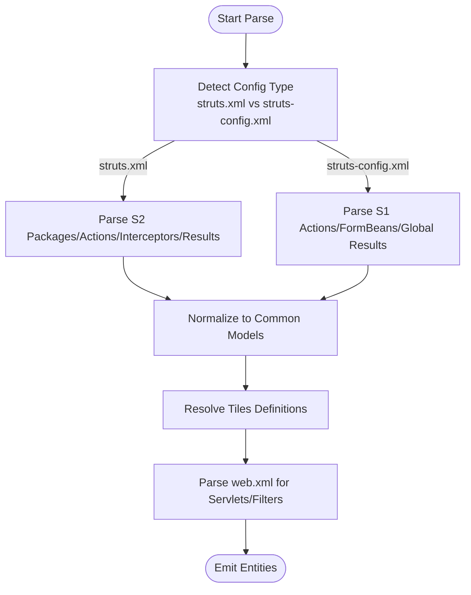
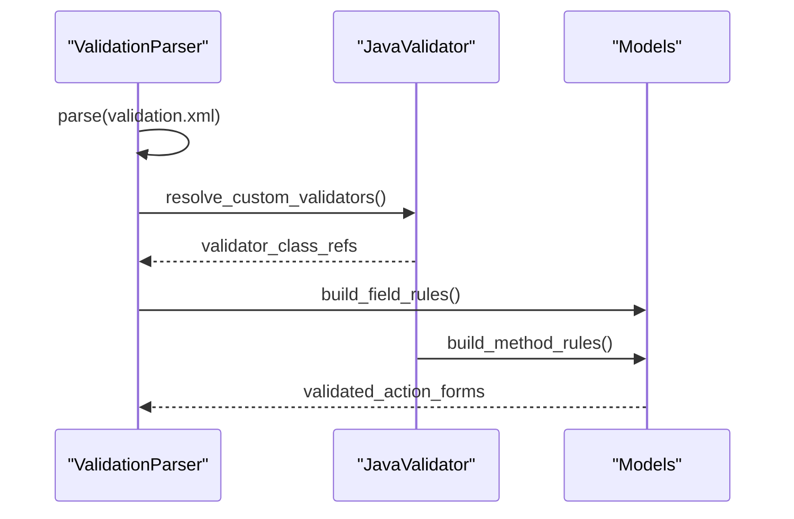
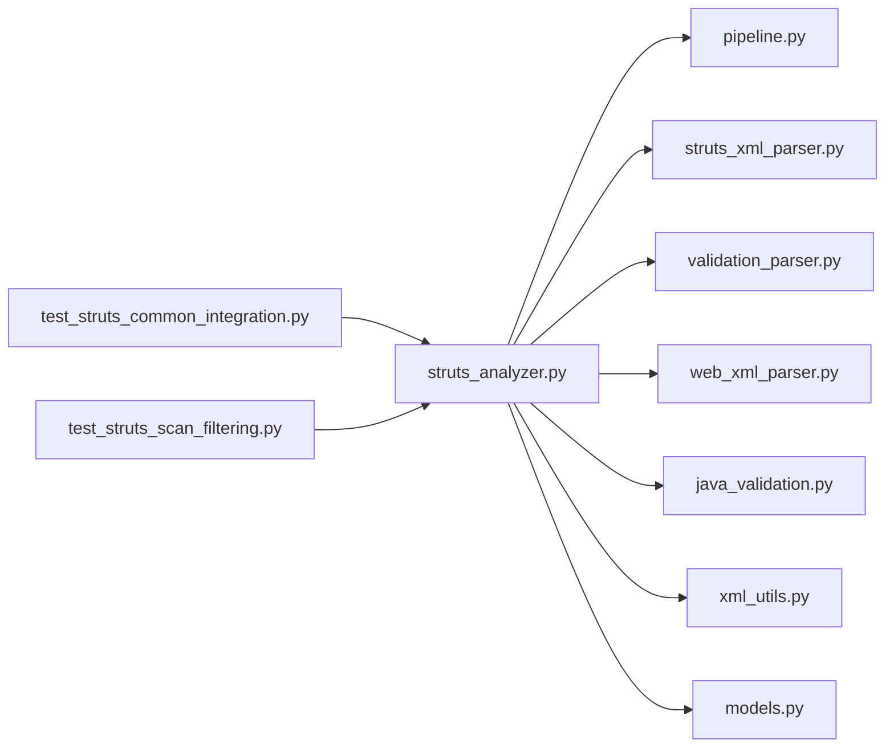

# Struts Framework Analysis

<cite>
**Referenced Files in This Document**
- [struts_analyzer.py](file://code-tiny/tools/struts/struts_analyzer.py)
- [pipeline.py](file://code-tiny/tools/struts/pipeline.py)
- [models.py](file://code-tiny/tools/struts/models.py)
- [struts_xml_parser.py](file://code-tiny/tools/struts/struts_xml_parser.py)
- [validation_parser.py](file://code-tiny/tools/struts/validation_parser.py)
- [web_xml_parser.py](file://code-tiny/tools/struts/web_xml_parser.py)
- [java_validation.py](file://code-tiny/tools/struts/java_validation.py)
- [xml_utils.py](file://code-tiny/tools/struts/xml_utils.py)
- [__init__.py](file://code-tiny/tools/struts/__init__.py)
- [README.md](file://code-tiny/tools/struts/README.md)
- [test_struts_common_integration.py](file://tests/test_struts_common_integration.py)
- [test_struts_scan_filtering.py](file://tests/test_struts_scan_filtering.py)
</cite>

## Table of Contents
1. [Introduction](#introduction)
2. [Project Structure](#project-structure)
3. [Core Components](#core-components)
4. [Architecture Overview](#architecture-overview)
5. [Detailed Component Analysis](#detailed-component-analysis)
6. [Dependency Analysis](#dependency-analysis)
7. [Performance Considerations](#performance-considerations)
8. [Troubleshooting Guide](#troubleshooting-guide)
9. [Conclusion](#conclusion)
10. [Appendices](#appendices)

## Introduction
This document explains the Apache Struts analysis capabilities implemented in the repository. It covers how the analyzer processes Struts configuration files (including struts.xml and struts-config.xml), action mappings, validation rules, Tiles layouts, and web deployment descriptors. It also documents extraction of Action classes, Form beans, result mappings, interceptor chains, and integration points with frameworks such as Spring and Hibernate. Guidance is provided for analyzing legacy Struts applications, handling deprecated features, and planning modernization or migration from older versions.

## Project Structure
The Struts analysis feature resides under a dedicated module with clear separation of concerns:
- Analyzer orchestration and pipeline
- Configuration parsers for XML-based settings
- Validation rule parsing
- Java-side validation support
- Shared XML utilities
- Data models representing extracted entities
- Tests validating behavior and integration

**Diagram sources**
- [struts_analyzer.py](file://code-tiny/tools/struts/struts_analyzer.py)
- [pipeline.py](file://code-tiny/tools/struts/pipeline.py)
- [models.py](file://code-tiny/tools/struts/models.py)
- [struts_xml_parser.py](file://code-tiny/tools/struts/struts_xml_parser.py)
- [validation_parser.py](file://code-tiny/tools/struts/validation_parser.py)
- [web_xml_parser.py](file://code-tiny/tools/struts/web_xml_parser.py)
- [java_validation.py](file://code-tiny/tools/struts/java_validation.py)
- [xml_utils.py](file://code-tiny/tools/struts/xml_utils.py)
- [__init__.py](file://code-tiny/tools/struts/__init__.py)
- [test_struts_common_integration.py](file://tests/test_struts_common_integration.py)
- [test_struts_scan_filtering.py](file://tests/test_struts_scan_filtering.py)

**Section sources**
- [README.md](file://code-tiny/tools/struts/README.md)
- [__init__.py](file://code-tiny/tools/struts/__init__.py)

## Core Components
- Analyzer entrypoint: orchestrates discovery, parsing, and graph emission for Struts artifacts.
- Pipeline: coordinates scanning, filtering, and incremental updates.
- Parsers:
  - struts_xml_parser.py: parses struts.xml and related configuration fragments.
  - validation_parser.py: parses validation.xml and field-level rules.
  - web_xml_parser.py: parses web.xml to resolve servlets, filters, and init parameters.
  - java_validation.py: analyzes Java-based validators and annotations.
  - xml_utils.py: shared helpers for XML traversal and normalization.
- Models: canonical data structures for actions, results, interceptors, forms, validations, and Tiles definitions.

Key responsibilities:
- Extract Action classes and their mappings from configuration.
- Resolve Form beans and associated validation rules.
- Capture result mappings and interceptor chains.
- Detect Tiles layout references and include directives.
- Integrate with Spring/Hibernate by resolving referenced beans and mappers where present.

**Section sources**
- [struts_analyzer.py](file://code-tiny/tools/struts/struts_analyzer.py)
- [pipeline.py](file://code-tiny/tools/struts/pipeline.py)
- [models.py](file://code-tiny/tools/struts/models.py)
- [struts_xml_parser.py](file://code-tiny/tools/struts/struts_xml_parser.py)
- [validation_parser.py](file://code-tiny/tools/struts/validation_parser.py)
- [web_xml_parser.py](file://code-tiny/tools/struts/web_xml_parser.py)
- [java_validation.py](file://code-tiny/tools/struts/java_validation.py)
- [xml_utils.py](file://code-tiny/tools/struts/xml_utils.py)

## Architecture Overview
The analyzer follows a layered architecture:
- Discovery layer scans project roots for Struts-related files.
- Parsing layer converts XML and Java sources into normalized models.
- Integration layer resolves cross-references (e.g., Spring beans, Hibernate mappers).
- Graph emission layer persists findings for downstream queries.

**Diagram sources**
- [struts_analyzer.py](file://code-tiny/tools/struts/struts_analyzer.py)
- [pipeline.py](file://code-tiny/tools/struts/pipeline.py)
- [struts_xml_parser.py](file://code-tiny/tools/struts/struts_xml_parser.py)
- [validation_parser.py](file://code-tiny/tools/struts/validation_parser.py)
- [web_xml_parser.py](file://code-tiny/tools/struts/web_xml_parser.py)
- [java_validation.py](file://code-tiny/tools/struts/java_validation.py)
- [models.py](file://code-tiny/tools/struts/models.py)

## Detailed Component Analysis

### Struts Analyzer and Pipeline
Responsibilities:
- Initialize context and configuration.
- Discover relevant files (XML configs, Java sources, JSP/Tiles).
- Execute pipeline stages: scan, parse, resolve, normalize, emit.
- Handle incremental updates and caching.

**Diagram sources**
- [struts_analyzer.py](file://code-tiny/tools/struts/struts_analyzer.py)
- [pipeline.py](file://code-tiny/tools/struts/pipeline.py)
- [models.py](file://code-tiny/tools/struts/models.py)

**Section sources**
- [struts_analyzer.py](file://code-tiny/tools/struts/struts_analyzer.py)
- [pipeline.py](file://code-tiny/tools/struts/pipeline.py)

### XML Configuration Parsers
Handles:
- struts.xml and struts-config.xml: action mappings, global results, exception handlers, message resources, package inheritance.
- web.xml: servlet mappings, filter chains, context parameters.
- Tiles definitions: layout references, includes, attributes.

**Diagram sources**
- [struts_xml_parser.py](file://code-tiny/tools/struts/struts_xml_parser.py)
- [web_xml_parser.py](file://code-tiny/tools/struts/web_xml_parser.py)
- [xml_utils.py](file://code-tiny/tools/struts/xml_utils.py)

**Section sources**
- [struts_xml_parser.py](file://code-tiny/tools/struts/struts_xml_parser.py)
- [web_xml_parser.py](file://code-tiny/tools/struts/web_xml_parser.py)
- [xml_utils.py](file://code-tiny/tools/struts/xml_utils.py)

### Validation Rules and Java Validators
Covers:
- Field-level and method-level validation rules from validation.xml.
- Java-based validators and annotations.
- Cross-field validation and custom validator classes.

**Diagram sources**
- [validation_parser.py](file://code-tiny/tools/struts/validation_parser.py)
- [java_validation.py](file://code-tiny/tools/struts/java_validation.py)
- [models.py](file://code-tiny/tools/struts/models.py)

**Section sources**
- [validation_parser.py](file://code-tiny/tools/struts/validation_parser.py)
- [java_validation.py](file://code-tiny/tools/struts/java_validation.py)

### Data Models
Canonical representations include:
- Action mapping (path, class, result names, interceptor stack)
- Result mapping (name, type, location, params)
- Interceptor chain (stack, individual interceptors, params)
- Form bean (class, properties, validation refs)
- Validation rule (field/method, validators, messages)
- Tiles definition (layout, attributes, includes)

These models unify Struts 1.x and 2.x differences for consistent downstream processing.

**Section sources**
- [models.py](file://code-tiny/tools/struts/models.py)

### Integration Points
- Spring: resolves Spring-managed beans referenced by actions or interceptors; can link to Spring configuration if present.
- Hibernate: detects mapper interfaces and XML mappings referenced by services invoked from actions.
- Internationalization: extracts message resource bundles and keys used across configurations and views.

[No sources needed since this section provides general guidance]

## Dependency Analysis
Internal dependencies:
- Analyzer depends on pipeline and parsers.
- Parsers depend on xml_utils for common operations.
- Pipeline composes parser outputs into models.
- Tests validate integration and filtering behaviors.

**Diagram sources**
- [struts_analyzer.py](file://code-tiny/tools/struts/struts_analyzer.py)
- [pipeline.py](file://code-tiny/tools/struts/pipeline.py)
- [struts_xml_parser.py](file://code-tiny/tools/struts/struts_xml_parser.py)
- [validation_parser.py](file://code-tiny/tools/struts/validation_parser.py)
- [web_xml_parser.py](file://code-tiny/tools/struts/web_xml_parser.py)
- [java_validation.py](file://code-tiny/tools/struts/java_validation.py)
- [xml_utils.py](file://code-tiny/tools/struts/xml_utils.py)
- [models.py](file://code-tiny/tools/struts/models.py)
- [test_struts_common_integration.py](file://tests/test_struts_common_integration.py)
- [test_struts_scan_filtering.py](file://tests/test_struts_scan_filtering.py)

**Section sources**
- [test_struts_common_integration.py](file://tests/test_struts_common_integration.py)
- [test_struts_scan_filtering.py](file://tests/test_struts_scan_filtering.py)

## Performance Considerations
- Incremental scanning: leverage pipeline’s change detection to re-parse only affected configuration and source files.
- Caching: reuse parsed ASTs and resolved references between runs.
- Parallel parsing: process independent XML files concurrently where safe.
- Filtering: scope scans to relevant packages and exclude generated or third-party directories.
- Memory management: stream large XML inputs and avoid retaining full file contents after parsing.

[No sources needed since this section provides general guidance]

## Troubleshooting Guide
Common issues and resolutions:
- Missing or mislocated configuration files: ensure struts.xml or struts-config.xml are discoverable at expected paths.
- Incomplete action resolution: verify web.xml servlet mappings and filter chains that may affect path resolution.
- Validation not linked: confirm validation.xml naming conventions and package scoping match Struts expectations.
- Tiles references unresolved: check Tiles plugin initialization and definition file locations.
- Deprecated features: identify usage of deprecated elements and plan replacements during modernization.

Operational checks:
- Validate framework version detection logic to choose correct parser mode.
- Inspect emitted models for completeness and correctness using tests.

**Section sources**
- [struts_analyzer.py](file://code-tiny/tools/struts/struts_analyzer.py)
- [pipeline.py](file://code-tiny/tools/struts/pipeline.py)
- [test_struts_common_integration.py](file://tests/test_struts_common_integration.py)
- [test_struts_scan_filtering.py](file://tests/test_struts_scan_filtering.py)

## Conclusion
The Struts analysis module provides comprehensive support for both Struts 1.x and 2.x ecosystems. It normalizes disparate configuration formats into unified models, enabling robust exploration of actions, results, interceptors, forms, validations, and Tiles layouts. With integration hooks for Spring and Hibernate, it aids in understanding enterprise application boundaries and supports informed decisions for modernization and migration.

[No sources needed since this section summarizes without analyzing specific files]

## Appendices

### Supported Artifacts and Extraction Targets
- Configuration files:
  - struts.xml (Struts 2.x)
  - struts-config.xml (Struts 1.x)
  - web.xml (Servlet container)
  - validation.xml (Field/method validation)
  - Tiles definitions and JSP includes
- Code artifacts:
  - Action classes and methods
  - Form beans and DTOs
  - Interceptor stacks and interceptors
  - Custom validators and annotation-driven rules
  - Message resource bundles for i18n
- Integration artifacts:
  - Spring beans referenced by Struts components
  - Hibernate mappers and repositories invoked by actions/services

**Section sources**
- [struts_xml_parser.py](file://code-tiny/tools/struts/struts_xml_parser.py)
- [validation_parser.py](file://code-tiny/tools/struts/validation_parser.py)
- [web_xml_parser.py](file://code-tiny/tools/struts/web_xml_parser.py)
- [java_validation.py](file://code-tiny/tools/struts/java_validation.py)
- [models.py](file://code-tiny/tools/struts/models.py)

### Migration and Modernization Guidance
- Identify deprecated elements and replace with supported equivalents.
- Consolidate scattered configurations into centralized modules where possible.
- Prefer programmatic configuration over XML where feasible.
- Decouple business logic from actions; introduce service layers and dependency injection via Spring.
- Replace legacy validation patterns with standardized approaches and centralize error messages.

[No sources needed since this section provides general guidance]