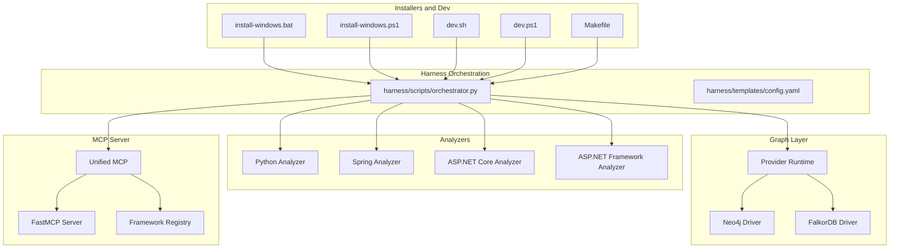
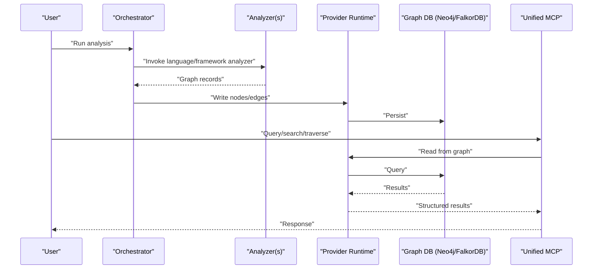
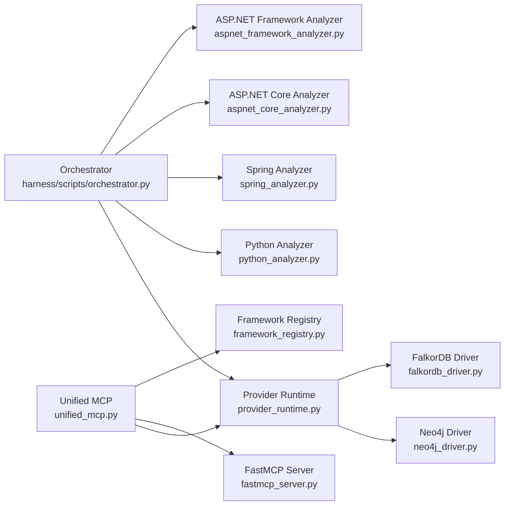

# Getting Started

<cite>
**Referenced Files in This Document**
- [ReadMe.md](file://ReadMe.md)
- [INSTALLER_GUIDE.md](file://INSTALLER_GUIDE.md)
- [Makefile](file://Makefile)
- [dev.sh](file://dev.sh)
- [dev.ps1](file://dev.ps1)
- [install-windows.bat](file://install-windows.bat)
- [install-windows.ps1](file://install-windows.ps1)
- [cortex_harness/dev.py](file://cortex_harness/dev.py)
- [harness/scripts/orchestrator.py](file://harness/scripts/orchestrator.py)
- [harness/templates/config.yaml](file://harness/templates/config.yaml)
- [code-tiny/mcp/unified_mcp.py](file://code-tiny/mcp/unified_mcp.py)
- [code-tiny/mcp/fastmcp_server.py](file://code-tiny/mcp/fastmcp_server.py)
- [code-tiny/mcp/framework_registry.py](file://code-tiny/mcp/framework_registry.py)
- [code-tiny/tools/graph/driver/neo4j_driver.py](file://code-tiny/tools/graph/driver/neo4j_driver.py)
- [code-tiny/tools/graph/driver/falkordb_driver.py](file://code-tiny/tools/graph/driver/falkordb_driver.py)
- [code-tiny/tools/graph/core/provider_runtime.py](file://code-tiny/tools/graph/core/provider_runtime.py)
- [code-tiny/tools/common/harness_config.py](file://code-tiny/tools/common/harness_config.py)
- [code-tiny/tools/sync/incremental_sync.py](file://code-tiny/tools/sync/incremental_sync.py)
- [code-tiny/tools/python/python_analyzer.py](file://code-tiny/tools/python/python_analyzer.py)
- [code-tiny/tools/spring/spring_analyzer.py](file://code-tiny/tools/spring/spring_analyzer.py)
- [code-tiny/tools/aspnet_core/aspnet_core_analyzer.py](file://code-tiny/tools/aspnet_core/aspnet_core_analyzer.py)
- [code-tiny/tools/aspnet_framework/aspnet_framework_analyzer.py](file://code-tiny/tools/aspnet_framework/aspnet_framework_analyzer.py)
- [scripts/mcp-lifecycle.py](file://scripts/mcp-lifecycle.py)
- [scripts/mcp-lifecycle.ps1](file://scripts/mcp-lifecycle.ps1)
- [scripts/mcp_runtime_config.py](file://scripts/mcp_runtime_config.py)
</cite>

## Table of Contents
1. [Introduction](#introduction)
2. [Project Structure](#project-structure)
3. [Core Components](#core-components)
4. [Architecture Overview](#architecture-overview)
5. [Installation and Setup](#installation-and-setup)
6. [First Analysis Tutorial](#first-analysis-tutorial)
7. [Practical Examples](#practical-examples)
8. [Dependency Analysis](#dependency-analysis)
9. [Performance Considerations](#performance-considerations)
10. [Troubleshooting Guide](#troubleshooting-guide)
11. [Conclusion](#conclusion)

## Introduction
Cortex Harness is a multi-language code analysis platform that builds rich, queryable graph representations of your codebases and integrates with AI to power intelligent exploration and impact analysis. It combines:
- Analyzers for many languages and frameworks (Python, Java/Spring, ASP.NET Core/Framework, C/C++, Go, TypeScript, etc.)
- A graph layer backed by Neo4j or FalkorDB to store nodes and edges representing code entities and relationships
- An MCP server that exposes capabilities (search, traversal, symbol lookup, flow tracing) to clients and agents
- CLI and lifecycle scripts to orchestrate scanning, incremental sync, and MCP runtime management

The platform emphasizes incremental sync to keep the graph up-to-date efficiently and provides consistent terminology across analyzers, graph nodes, MCP capabilities, and synchronization workflows.

[No sources needed since this section summarizes without analyzing specific files]

## Project Structure
At a high level, the repository contains:
- Installation and dev tooling for Windows/macOS/Linux
- Graph database drivers and core runtime
- Language and framework analyzers under tools
- MCP server components and capability registry
- Lifecycle and runtime configuration scripts
- Templates and harness orchestration scripts

**Diagram sources**
- [install-windows.bat](file://install-windows.bat)
- [install-windows.ps1](file://install-windows.ps1)
- [dev.sh](file://dev.sh)
- [dev.ps1](file://dev.ps1)
- [Makefile](file://Makefile)
- [harness/scripts/orchestrator.py](file://harness/scripts/orchestrator.py)
- [harness/templates/config.yaml](file://harness/templates/config.yaml)
- [code-tiny/tools/graph/driver/neo4j_driver.py](file://code-tiny/tools/graph/driver/neo4j_driver.py)
- [code-tiny/tools/graph/driver/falkordb_driver.py](file://code-tiny/tools/graph/driver/falkordb_driver.py)
- [code-tiny/tools/graph/core/provider_runtime.py](file://code-tiny/tools/graph/core/provider_runtime.py)
- [code-tiny/tools/python/python_analyzer.py](file://code-tiny/tools/python/python_analyzer.py)
- [code-tiny/tools/spring/spring_analyzer.py](file://code-tiny/tools/spring/spring_analyzer.py)
- [code-tiny/tools/aspnet_core/aspnet_core_analyzer.py](file://code-tiny/tools/aspnet_core/aspnet_core_analyzer.py)
- [code-tiny/tools/aspnet_framework/aspnet_framework_analyzer.py](file://code-tiny/tools/aspnet_framework/aspnet_framework_analyzer.py)
- [code-tiny/mcp/unified_mcp.py](file://code-tiny/mcp/unified_mcp.py)
- [code-tiny/mcp/fastmcp_server.py](file://code-tiny/mcp/fastmcp_server.py)
- [code-tiny/mcp/framework_registry.py](file://code-tiny/mcp/framework_registry.py)

**Section sources**
- [ReadMe.md](file://ReadMe.md)
- [INSTALLER_GUIDE.md](file://INSTALLER_GUIDE.md)
- [Makefile](file://Makefile)

## Core Components
- Graph drivers and provider runtime: Abstracts over Neo4j and FalkorDB, providing a unified interface for creating and querying graph nodes and edges.
- Analyzers: Language-specific and framework-specific modules that parse source artifacts and emit normalized graph records.
- MCP server: Exposes capabilities such as search, traversal, symbol resolution, and flow tracing via a standardized protocol.
- Harness orchestration: Coordinates analyzer execution, graph writes, and MCP lifecycle operations.
- Incremental sync: Tracks changes and updates only affected parts of the graph to improve performance.

Key implementation references:
- Graph driver implementations and provider runtime
- Unified MCP entrypoint and FastMCP server
- Python, Spring, and ASP.NET analyzers
- Harness orchestrator and configuration template
- Incremental sync module

**Section sources**
- [code-tiny/tools/graph/driver/neo4j_driver.py](file://code-tiny/tools/graph/driver/neo4j_driver.py)
- [code-tiny/tools/graph/driver/falkordb_driver.py](file://code-tiny/tools/graph/driver/falkordb_driver.py)
- [code-tiny/tools/graph/core/provider_runtime.py](file://code-tiny/tools/graph/core/provider_runtime.py)
- [code-tiny/mcp/unified_mcp.py](file://code-tiny/mcp/unified_mcp.py)
- [code-tiny/mcp/fastmcp_server.py](file://code-tiny/mcp/fastmcp_server.py)
- [code-tiny/tools/python/python_analyzer.py](file://code-tiny/tools/python/python_analyzer.py)
- [code-tiny/tools/spring/spring_analyzer.py](file://code-tiny/tools/spring/spring_analyzer.py)
- [code-tiny/tools/aspnet_core/aspnet_core_analyzer.py](file://code-tiny/tools/aspnet_core/aspnet_core_analyzer.py)
- [code-tiny/tools/aspnet_framework/aspnet_framework_analyzer.py](file://code-tiny/tools/aspnet_framework/aspnet_framework_analyzer.py)
- [harness/scripts/orchestrator.py](file://harness/scripts/orchestrator.py)
- [harness/templates/config.yaml](file://harness/templates/config.yaml)
- [code-tiny/tools/sync/incremental_sync.py](file://code-tiny/tools/sync/incremental_sync.py)

## Architecture Overview
The system follows a layered architecture:
- Orchestrator invokes analyzers against a target project
- Analyzers produce graph records written through the provider runtime
- The provider runtime persists data into Neo4j or FalkorDB
- MCP server exposes capabilities backed by the graph store
- Lifecycle scripts manage MCP runtime and environment configuration

**Diagram sources**
- [harness/scripts/orchestrator.py](file://harness/scripts/orchestrator.py)
- [code-tiny/tools/graph/core/provider_runtime.py](file://code-tiny/tools/graph/core/provider_runtime.py)
- [code-tiny/tools/graph/driver/neo4j_driver.py](file://code-tiny/tools/graph/driver/neo4j_driver.py)
- [code-tiny/tools/graph/driver/falkordb_driver.py](file://code-tiny/tools/graph/driver/falkordb_driver.py)
- [code-tiny/mcp/unified_mcp.py](file://code-tiny/mcp/unified_mcp.py)

## Installation and Setup
This section covers installation on Windows, macOS, and Linux using package managers and manual setup.

### Prerequisites
- Python environment compatible with the project’s dependencies
- Access to a graph database (Neo4j or FalkorDB)
- Optional: .NET SDK for ASP.NET projects; JDK for Spring/Java projects

### Windows
- Use provided installers and wrappers:
  - Batch installer: [install-windows.bat](file://install-windows.bat)
  - PowerShell installer: [install-windows.ps1](file://install-windows.ps1)
- Development helpers:
  - PowerShell dev script: [dev.ps1](file://dev.ps1)
- For MCP lifecycle management:
  - PowerShell lifecycle script: [scripts/mcp-lifecycle.ps1](file://scripts/mcp-lifecycle.ps1)

### macOS
- Manual setup:
  - Shell dev script: [dev.sh](file://dev.sh)
  - Make targets: [Makefile](file://Makefile)
- MCP lifecycle:
  - Python lifecycle script: [scripts/mcp-lifecycle.py](file://scripts/mcp-lifecycle.py)

### Linux
- Manual setup:
  - Shell dev script: [dev.sh](file://dev.sh)
  - Make targets: [Makefile](file://Makefile)
- MCP lifecycle:
  - Python lifecycle script: [scripts/mcp-lifecycle.py](file://scripts/mcp-lifecycle.py)

### Package Managers
- Refer to the installer guide for packaging details and distribution notes:
  - [INSTALLER_GUIDE.md](file://INSTALLER_GUIDE.md)

### Configuration
- Harness configuration template:
  - [harness/templates/config.yaml](file://harness/templates/config.yaml)
- MCP runtime configuration helper:
  - [scripts/mcp_runtime_config.py](file://scripts/mcp_runtime_config.py)

**Section sources**
- [INSTALLER_GUIDE.md](file://INSTALLER_GUIDE.md)
- [install-windows.bat](file://install-windows.bat)
- [install-windows.ps1](file://install-windows.ps1)
- [dev.sh](file://dev.sh)
- [dev.ps1](file://dev.ps1)
- [Makefile](file://Makefile)
- [harness/templates/config.yaml](file://harness/templates/config.yaml)
- [scripts/mcp-lifecycle.py](file://scripts/mcp-lifecycle.py)
- [scripts/mcp-lifecycle.ps1](file://scripts/mcp-lifecycle.ps1)
- [scripts/mcp_runtime_config.py](file://scripts/mcp_runtime_config.py)

## First Analysis Tutorial
Follow these steps to configure a project, set up the graph database, and run your first analysis.

1. Prepare the environment
   - Ensure Python is installed and accessible
   - Install dependencies per the project’s requirements
   - Choose a graph backend: Neo4j or FalkorDB

2. Configure the harness
   - Copy and edit the harness configuration template:
     - [harness/templates/config.yaml](file://harness/templates/config.yaml)
   - Set the graph provider and connection parameters

3. Initialize the graph provider
   - Use the harness development entrypoint to initialize the provider:
     - [cortex_harness/dev.py](file://cortex_harness/dev.py)

4. Run the first analysis
   - Invoke the orchestrator to analyze your project:
     - [harness/scripts/orchestrator.py](file://harness/scripts/orchestrator.py)
   - Select appropriate analyzers based on your project type

5. Start the MCP server
   - Launch the unified MCP server:
     - [code-tiny/mcp/unified_mcp.py](file://code-tiny/mcp/unified_mcp.py)
   - Optionally use the FastMCP server wrapper:
     - [code-tiny/mcp/fastmcp_server.py](file://code-tiny/mcp/fastmcp_server.py)

6. Query the graph
   - Use MCP capabilities to search, traverse, and inspect graph nodes and edges

7. Enable incremental sync
   - Configure incremental sync to update only changed parts:
     - [code-tiny/tools/sync/incremental_sync.py](file://code-tiny/tools/sync/incremental_sync.py)

**Section sources**
- [harness/templates/config.yaml](file://harness/templates/config.yaml)
- [cortex_harness/dev.py](file://cortex_harness/dev.py)
- [harness/scripts/orchestrator.py](file://harness/scripts/orchestrator.py)
- [code-tiny/mcp/unified_mcp.py](file://code-tiny/mcp/unified_mcp.py)
- [code-tiny/mcp/fastmcp_server.py](file://code-tiny/mcp/fastmcp_server.py)
- [code-tiny/tools/sync/incremental_sync.py](file://code-tiny/tools/sync/incremental_sync.py)

## Practical Examples
Below are practical examples for common scenarios. Replace placeholders with your actual paths and settings.

- Analyze a Python project
  - Use the Python analyzer to build nodes and edges for modules, functions, and imports:
    - [code-tiny/tools/python/python_analyzer.py](file://code-tiny/tools/python/python_analyzer.py)
  - Typical workflow:
    - Point the orchestrator at your Python project root
    - Run analysis and verify graph nodes for modules and symbols
    - Query via MCP to explore call relationships

- Analyze a Spring Boot application
  - Use the Spring analyzer to extract beans, controllers, services, and persistence layers:
    - [code-tiny/tools/spring/spring_analyzer.py](file://code-tiny/tools/spring/spring_analyzer.py)
  - Typical workflow:
    - Build the project if required by the analyzer
    - Run analysis and confirm presence of framework-specific nodes
    - Use MCP to trace request flows and dependency graphs

- Analyze an ASP.NET solution
  - Use the ASP.NET Core analyzer for modern solutions:
    - [code-tiny/tools/aspnet_core/aspnet_core_analyzer.py](file://code-tiny/tools/aspnet_core/aspnet_core_analyzer.py)
  - Use the ASP.NET Framework analyzer for legacy applications:
    - [code-tiny/tools/aspnet_framework/aspnet_framework_analyzer.py](file://code-tiny/tools/aspnet_framework/aspnet_framework_analyzer.py)
  - Typical workflow:
    - Restore/build the solution if required
    - Run analysis and validate controller/service nodes
    - Query via MCP to map routes and dependencies

**Section sources**
- [code-tiny/tools/python/python_analyzer.py](file://code-tiny/tools/python/python_analyzer.py)
- [code-tiny/tools/spring/spring_analyzer.py](file://code-tiny/tools/spring/spring_analyzer.py)
- [code-tiny/tools/aspnet_core/aspnet_core_analyzer.py](file://code-tiny/tools/aspnet_core/aspnet_core_analyzer.py)
- [code-tiny/tools/aspnet_framework/aspnet_framework_analyzer.py](file://code-tiny/tools/aspnet_framework/aspnet_framework_analyzer.py)

## Dependency Analysis
The following diagram shows key runtime dependencies between orchestrator, analyzers, provider runtime, and MCP server.

**Diagram sources**
- [harness/scripts/orchestrator.py](file://harness/scripts/orchestrator.py)
- [code-tiny/tools/graph/core/provider_runtime.py](file://code-tiny/tools/graph/core/provider_runtime.py)
- [code-tiny/tools/graph/driver/neo4j_driver.py](file://code-tiny/tools/graph/driver/neo4j_driver.py)
- [code-tiny/tools/graph/driver/falkordb_driver.py](file://code-tiny/tools/graph/driver/falkordb_driver.py)
- [code-tiny/tools/python/python_analyzer.py](file://code-tiny/tools/python/python_analyzer.py)
- [code-tiny/tools/spring/spring_analyzer.py](file://code-tiny/tools/spring/spring_analyzer.py)
- [code-tiny/tools/aspnet_core/aspnet_core_analyzer.py](file://code-tiny/tools/aspnet_core/aspnet_core_analyzer.py)
- [code-tiny/tools/aspnet_framework/aspnet_framework_analyzer.py](file://code-tiny/tools/aspnet_framework/aspnet_framework_analyzer.py)
- [code-tiny/mcp/unified_mcp.py](file://code-tiny/mcp/unified_mcp.py)
- [code-tiny/mcp/fastmcp_server.py](file://code-tiny/mcp/fastmcp_server.py)
- [code-tiny/mcp/framework_registry.py](file://code-tiny/mcp/framework_registry.py)

**Section sources**
- [harness/scripts/orchestrator.py](file://harness/scripts/orchestrator.py)
- [code-tiny/tools/graph/core/provider_runtime.py](file://code-tiny/tools/graph/core/provider_runtime.py)
- [code-tiny/mcp/unified_mcp.py](file://code-tiny/mcp/unified_mcp.py)

## Performance Considerations
- Prefer incremental sync for large repositories to minimize reanalysis time
- Tune graph provider settings for write throughput and query latency
- Limit analyzer scope to relevant modules when possible
- Cache intermediate results where supported by analyzers
- Monitor MCP query patterns and optimize indexes accordingly

[No sources needed since this section provides general guidance]

## Troubleshooting Guide
Common issues and resolutions:

- Graph database connectivity
  - Verify Neo4j or FalkorDB endpoints and credentials in harness configuration
  - Confirm network access and firewall rules
  - References:
    - [harness/templates/config.yaml](file://harness/templates/config.yaml)
    - [code-tiny/tools/graph/driver/neo4j_driver.py](file://code-tiny/tools/graph/driver/neo4j_driver.py)
    - [code-tiny/tools/graph/driver/falkordb_driver.py](file://code-tiny/tools/graph/driver/falkordb_driver.py)

- MCP server startup failures
  - Check MCP runtime configuration and port availability
  - Validate framework registry entries and capability routing
  - References:
    - [code-tiny/mcp/unified_mcp.py](file://code-tiny/mcp/unified_mcp.py)
    - [code-tiny/mcp/fastmcp_server.py](file://code-tiny/mcp/fastmcp_server.py)
    - [code-tiny/mcp/framework_registry.py](file://code-tiny/mcp/framework_registry.py)
    - [scripts/mcp_runtime_config.py](file://scripts/mcp_runtime_config.py)

- Analyzer execution errors
  - Ensure required SDKs (e.g., .NET, JDK) are installed and on PATH
  - Validate project build prerequisites before running analyzers
  - References:
    - [code-tiny/tools/python/python_analyzer.py](file://code-tiny/tools/python/python_analyzer.py)
    - [code-tiny/tools/spring/spring_analyzer.py](file://code-tiny/tools/spring/spring_analyzer.py)
    - [code-tiny/tools/aspnet_core/aspnet_core_analyzer.py](file://code-tiny/tools/aspnet_core/aspnet_core_analyzer.py)
    - [code-tiny/tools/aspnet_framework/aspnet_framework_analyzer.py](file://code-tiny/tools/aspnet_framework/aspnet_framework_analyzer.py)

- Incremental sync inconsistencies
  - Review change detection and state files
  - Re-run full sync if necessary to rebuild baseline
  - References:
    - [code-tiny/tools/sync/incremental_sync.py](file://code-tiny/tools/sync/incremental_sync.py)

- Platform-specific setup problems
  - Windows: Use installers and wrappers; verify PowerShell execution policy
  - macOS/Linux: Use dev scripts and Make targets; ensure shell permissions
  - References:
    - [install-windows.bat](file://install-windows.bat)
    - [install-windows.ps1](file://install-windows.ps1)
    - [dev.sh](file://dev.sh)
    - [dev.ps1](file://dev.ps1)
    - [Makefile](file://Makefile)

**Section sources**
- [harness/templates/config.yaml](file://harness/templates/config.yaml)
- [code-tiny/tools/graph/driver/neo4j_driver.py](file://code-tiny/tools/graph/driver/neo4j_driver.py)
- [code-tiny/tools/graph/driver/falkordb_driver.py](file://code-tiny/tools/graph/driver/falkordb_driver.py)
- [code-tiny/mcp/unified_mcp.py](file://code-tiny/mcp/unified_mcp.py)
- [code-tiny/mcp/fastmcp_server.py](file://code-tiny/mcp/fastmcp_server.py)
- [code-tiny/mcp/framework_registry.py](file://code-tiny/mcp/framework_registry.py)
- [scripts/mcp_runtime_config.py](file://scripts/mcp_runtime_config.py)
- [code-tiny/tools/python/python_analyzer.py](file://code-tiny/tools/python/python_analyzer.py)
- [code-tiny/tools/spring/spring_analyzer.py](file://code-tiny/tools/spring/spring_analyzer.py)
- [code-tiny/tools/aspnet_core/aspnet_core_analyzer.py](file://code-tiny/tools/aspnet_core/aspnet_core_analyzer.py)
- [code-tiny/tools/aspnet_framework/aspnet_framework_analyzer.py](file://code-tiny/tools/aspnet_framework/aspnet_framework_analyzer.py)
- [code-tiny/tools/sync/incremental_sync.py](file://code-tiny/tools/sync/incremental_sync.py)
- [install-windows.bat](file://install-windows.bat)
- [install-windows.ps1](file://install-windows.ps1)
- [dev.sh](file://dev.sh)
- [dev.ps1](file://dev.ps1)
- [Makefile](file://Makefile)

## Conclusion
You now have the essentials to install Cortex Harness, configure your environment, run your first analysis, and explore code via MCP capabilities. Leverage incremental sync for efficiency and extend analyzers as needed. For deeper customization, consult the harness configuration and MCP runtime scripts.

[No sources needed since this section summarizes without analyzing specific files]