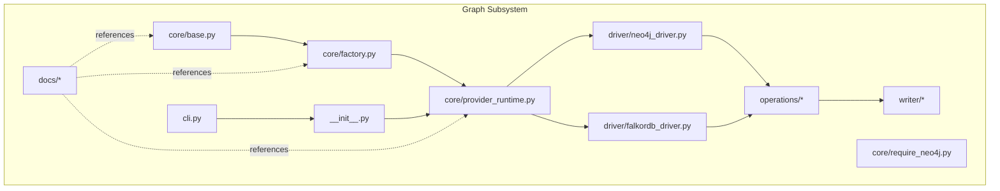
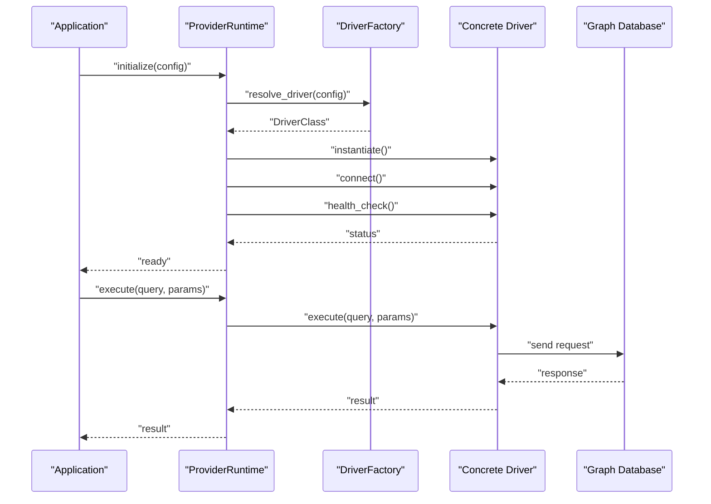
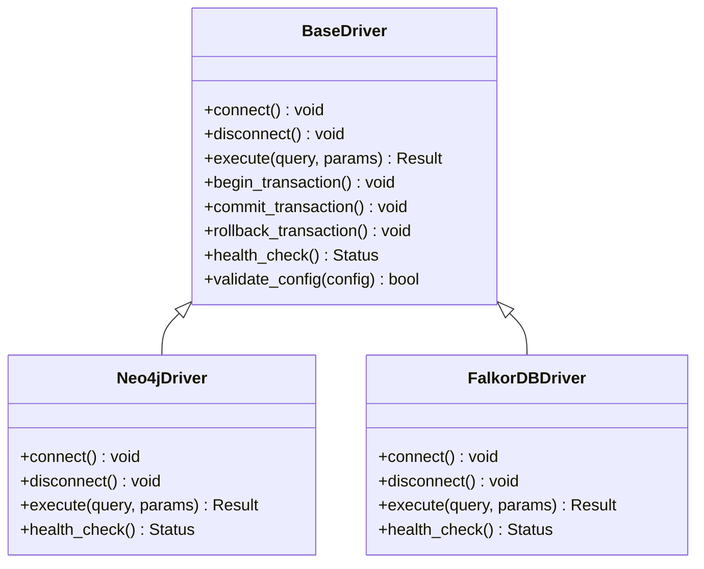
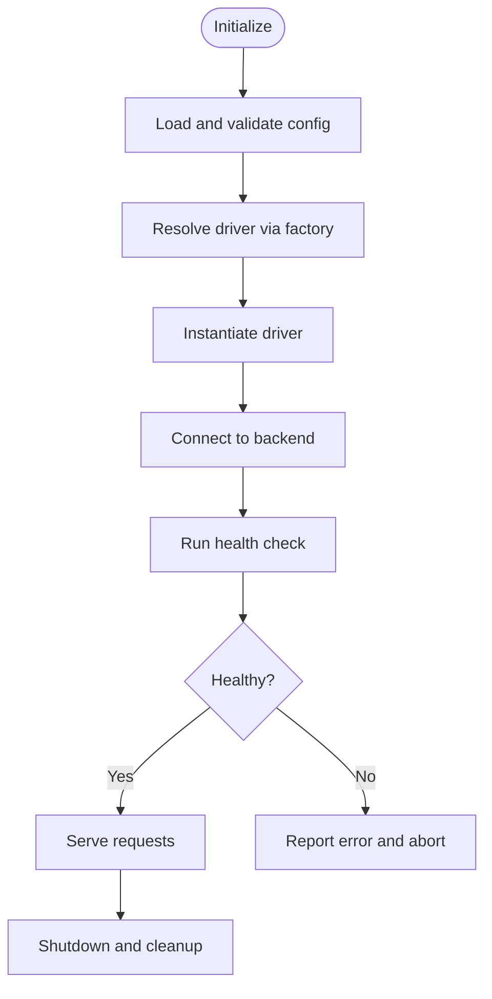
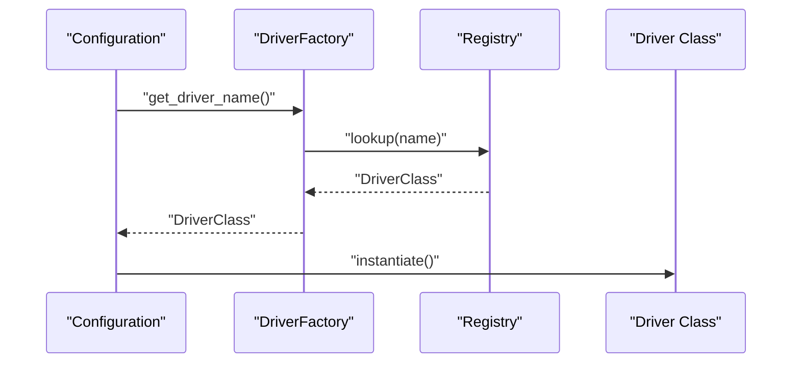
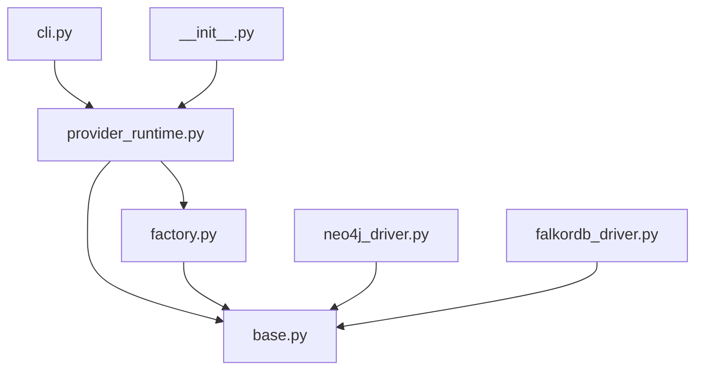

# Abstract Driver Interface & Extension

<cite>
**Referenced Files in This Document**
- [base.py](file://code-tiny/tools/graph/core/base.py)
- [factory.py](file://code-tiny/tools/graph/core/factory.py)
- [provider_runtime.py](file://code-tiny/tools/graph/core/provider_runtime.py)
- [neo4j_driver.py](file://code-tiny/tools/graph/driver/neo4j_driver.py)
- [falkordb_driver.py](file://code-tiny/tools/graph/driver/falkordb_driver.py)
- [require_neo4j.py](file://code-tiny/tools/graph/core/require_neo4j.py)
- [__init__.py](file://code-tiny/tools/graph/__init__.py)
- [cli.py](file://code-tiny/tools/graph/cli.py)
- [STRUCTURE.md](file://code-tiny/tools/graph/STRUCTURE.md)
- [README.md](file://code-tiny/tools/graph/docs/README.md)
- [QUICK_REFERENCE.md](file://code-tiny/tools/graph/docs/QUICK_REFERENCE.md)
- [IMPLEMENTATION_SUMMARY.md](file://code-tiny/tools/graph/docs/IMPLEMENTATION_SUMMARY.md)
- [MIGRATION_GUIDE.py](file://code-tiny/tools/graph/docs/MIGRATION_GUIDE.py)
- [test_falkordb_driver.py](file://tests/test_falkordb_driver.py)
- [test_dev_init_graph_provider.py](file://tests/test_dev_init_graph_provider.py)
</cite>

## Table of Contents
1. [Introduction](#introduction)
2. [Project Structure](#project-structure)
3. [Core Components](#core-components)
4. [Architecture Overview](#architecture-overview)
5. [Detailed Component Analysis](#detailed-component-analysis)
6. [Dependency Analysis](#dependency-analysis)
7. [Performance Considerations](#performance-considerations)
8. [Troubleshooting Guide](#troubleshooting-guide)
9. [Conclusion](#conclusion)
10. [Appendices](#appendices)

## Introduction
This document explains the abstract graph database driver interface and extension mechanisms in Cortex Harness. It covers the base driver contract, required method implementations, lifecycle management, provider runtime behavior (instantiation, configuration, health checks), factory-based selection and registration, configuration schema for custom drivers, step-by-step guidance to implement new backends, testing strategies, validation procedures, examples of extending existing drivers, integration patterns for third-party graph databases, and policies around versioning, backward compatibility, and deprecation.

## Project Structure
The graph subsystem is organized under code-tiny/tools/graph with clear separation between core contracts, provider runtime, concrete drivers, operations, writers, and documentation. The key areas are:
- Core contracts and runtime: base driver class, factory, provider runtime, and optional requirements helpers
- Concrete drivers: Neo4j and FalkorDB implementations
- Operations and writers: higher-level APIs and persistence utilities
- CLI entry points and package initialization
- Documentation and migration guides

**Diagram sources**
- [base.py](file://code-tiny/tools/graph/core/base.py)
- [factory.py](file://code-tiny/tools/graph/core/factory.py)
- [provider_runtime.py](file://code-tiny/tools/graph/core/provider_runtime.py)
- [require_neo4j.py](file://code-tiny/tools/graph/core/require_neo4j.py)
- [neo4j_driver.py](file://code-tiny/tools/graph/driver/neo4j_driver.py)
- [falkordb_driver.py](file://code-tiny/tools/graph/driver/falkordb_driver.py)
- [cli.py](file://code-tiny/tools/graph/cli.py)
- [__init__.py](file://code-tiny/tools/graph/__init__.py)
- [README.md](file://code-tiny/tools/graph/docs/README.md)

**Section sources**
- [STRUCTURE.md](file://code-tiny/tools/graph/STRUCTURE.md)
- [README.md](file://code-tiny/tools/graph/docs/README.md)

## Core Components
- Base driver contract: Defines the abstract interface that all graph drivers must implement, including connection lifecycle, transactional semantics, query execution, and health checks.
- Provider runtime: Manages driver instantiation from configuration, performs health checks, and exposes a unified API to callers.
- Factory: Provides driver selection and registration based on configuration or environment, enabling pluggable backends.
- Concrete drivers: Implementations for Neo4j and FalkorDB that adhere to the base contract.
- Optional requirement helpers: Provide capability gates such as requiring specific drivers at runtime.

Key responsibilities:
- Base driver: Declare methods for connect/disconnect, execute queries, manage transactions, and report health.
- Provider runtime: Load configuration, instantiate the correct driver via factory, run health checks, and expose a stable surface.
- Factory: Maintain registry mapping driver names to classes; support dynamic loading and fallbacks.
- Drivers: Translate abstract calls into backend-specific operations while preserving the contract.

**Section sources**
- [base.py](file://code-tiny/tools/graph/core/base.py)
- [factory.py](file://code-tiny/tools/graph/core/factory.py)
- [provider_runtime.py](file://code-tiny/tools/graph/core/provider_runtime.py)
- [require_neo4j.py](file://code-tiny/tools/graph/core/require_neo4j.py)

## Architecture Overview
The system follows a layered architecture:
- Application layer calls into the provider runtime.
- Provider runtime uses the factory to select and instantiate a driver based on configuration.
- The selected driver implements the base contract and interacts with the underlying graph database.
- Health checks and lifecycle hooks ensure reliability and observability.

**Diagram sources**
- [provider_runtime.py](file://code-tiny/tools/graph/core/provider_runtime.py)
- [factory.py](file://code-tiny/tools/graph/core/factory.py)
- [base.py](file://code-tiny/tools/graph/core/base.py)
- [neo4j_driver.py](file://code-tiny/tools/graph/driver/neo4j_driver.py)
- [falkordb_driver.py](file://code-tiny/tools/graph/driver/falkordb_driver.py)

## Detailed Component Analysis

### Base Driver Contract
The base driver defines the contract that all implementations must satisfy. Typical responsibilities include:
- Connection lifecycle: connect, disconnect, reconnect
- Query execution: execute, execute_many, stream results
- Transaction management: begin, commit, rollback
- Schema and metadata access: list nodes/edges, describe types
- Health and readiness: health_check, status reporting
- Configuration handling: validate and apply settings

Implementation notes:
- Methods should be idempotent where possible and raise consistent exceptions for failures.
- Timeouts, retries, and resource cleanup should be handled within the driver.
- Health checks should return structured status information suitable for monitoring.

**Diagram sources**
- [base.py](file://code-tiny/tools/graph/core/base.py)
- [neo4j_driver.py](file://code-tiny/tools/graph/driver/neo4j_driver.py)
- [falkordb_driver.py](file://code-tiny/tools/graph/driver/falkordb_driver.py)

**Section sources**
- [base.py](file://code-tiny/tools/graph/core/base.py)

### Provider Runtime System
The provider runtime orchestrates driver lifecycle and exposes a stable API:
- Instantiation: Reads configuration, resolves driver name, and constructs the driver instance.
- Configuration: Validates parameters, applies defaults, and ensures required fields are present.
- Health checks: Periodically or on-demand verifies connectivity and reports status.
- Error handling: Normalizes errors across drivers and provides actionable diagnostics.

Lifecycle flow:
- Initialize with configuration
- Resolve and instantiate driver
- Connect and perform health check
- Expose execute/query methods
- Graceful shutdown and resource cleanup

**Diagram sources**
- [provider_runtime.py](file://code-tiny/tools/graph/core/provider_runtime.py)
- [factory.py](file://code-tiny/tools/graph/core/factory.py)

**Section sources**
- [provider_runtime.py](file://code-tiny/tools/graph/core/provider_runtime.py)

### Factory Pattern for Driver Selection and Registration
The factory manages driver discovery and selection:
- Registry: Maps driver identifiers to implementation classes.
- Resolution: Chooses a driver based on configuration keys or environment variables.
- Extensibility: Supports registering additional drivers at runtime.
- Fallbacks: Allows default drivers when none specified.

Operational details:
- Registration occurs during import or explicit calls.
- Resolution validates presence of required configuration keys.
- Errors indicate missing drivers or invalid configurations.

**Diagram sources**
- [factory.py](file://code-tiny/tools/graph/core/factory.py)

**Section sources**
- [factory.py](file://code-tiny/tools/graph/core/factory.py)

### Concrete Drivers
- Neo4j driver: Implements the base contract using Neo4j client libraries. Handles connection pooling, Cypher execution, and health checks.
- FalkorDB driver: Implements the base contract for FalkorDB, translating abstract operations to FalkorDB commands.

Both drivers:
- Validate configuration parameters (host, port, credentials).
- Manage connection lifecycle and resource cleanup.
- Provide health checks returning structured status.

**Section sources**
- [neo4j_driver.py](file://code-tiny/tools/graph/driver/neo4j_driver.py)
- [falkordb_driver.py](file://code-tiny/tools/graph/driver/falkordb_driver.py)

### Optional Requirement Helpers
A helper enforces runtime requirements for specific drivers (e.g., requiring Neo4j). This allows early failure with clear messages when dependencies are missing.

**Section sources**
- [require_neo4j.py](file://code-tiny/tools/graph/core/require_neo4j.py)

## Dependency Analysis
High-level dependency relationships:
- Provider runtime depends on factory and base driver contract.
- Concrete drivers depend on their respective client libraries and implement the base contract.
- CLI and package initialization depend on provider runtime and factory.

**Diagram sources**
- [provider_runtime.py](file://code-tiny/tools/graph/core/provider_runtime.py)
- [factory.py](file://code-tiny/tools/graph/core/factory.py)
- [base.py](file://code-tiny/tools/graph/core/base.py)
- [neo4j_driver.py](file://code-tiny/tools/graph/driver/neo4j_driver.py)
- [falkordb_driver.py](file://code-tiny/tools/graph/driver/falkordb_driver.py)
- [cli.py](file://code-tiny/tools/graph/cli.py)
- [__init__.py](file://code-tiny/tools/graph/__init__.py)

**Section sources**
- [__init__.py](file://code-tiny/tools/graph/__init__.py)
- [cli.py](file://code-tiny/tools/graph/cli.py)

## Performance Considerations
- Connection pooling: Ensure drivers reuse connections and avoid per-query overhead.
- Batch operations: Use execute_many or batched writes where supported by the backend.
- Query optimization: Prefer targeted queries and leverage indexes provided by the backend.
- Health checks: Keep checks lightweight and non-blocking; use timeouts.
- Resource limits: Configure max connections, timeouts, and retry policies according to backend capabilities.

[No sources needed since this section provides general guidance]

## Troubleshooting Guide
Common issues and resolutions:
- Missing driver: If the resolved driver is not registered, verify configuration and ensure the driver module is importable.
- Authentication failures: Check credentials and network reachability; confirm backend supports configured auth scheme.
- Health check failures: Inspect connectivity, firewall rules, and backend service status.
- Version incompatibilities: Confirm driver versions match backend server versions; consult migration guides.

Validation procedures:
- Unit tests for driver implementations: Verify connect/disconnect, execute, and health checks.
- Integration tests against real backends: End-to-end flows with sample data and queries.
- Configuration validation: Ensure required keys exist and values are well-formed.

**Section sources**
- [test_falkordb_driver.py](file://tests/test_falkordb_driver.py)
- [test_dev_init_graph_provider.py](file://tests/test_dev_init_graph_provider.py)

## Conclusion
Cortex Harness provides a robust abstraction over graph database backends through a well-defined driver contract, a flexible provider runtime, and a factory-based selection mechanism. By adhering to the base contract and leveraging the runtime’s lifecycle and health-check features, developers can integrate new graph databases seamlessly. Clear configuration schemas, testing strategies, and migration guides help maintain stability and performance across diverse deployments.

[No sources needed since this section summarizes without analyzing specific files]

## Appendices

### Configuration Schema for Custom Drivers
Recommended configuration keys:
- driver: Identifier used by the factory to select the driver implementation.
- host: Backend hostname or address.
- port: Backend port number.
- database: Target database or namespace.
- username/password: Authentication credentials.
- ssl: Boolean or object specifying TLS settings.
- timeout: Connection and query timeout values.
- pool_size: Maximum concurrent connections.
- retry_policy: Number of retries and backoff strategy.
- options: Driver-specific flags (e.g., encryption mode, routing preferences).

Validation rules:
- Required keys: driver, host, port, username, password.
- Type checks: Numeric ports, boolean SSL, positive timeouts.
- Defaults: Apply sensible defaults for optional keys.

**Section sources**
- [README.md](file://code-tiny/tools/graph/docs/README.md)
- [QUICK_REFERENCE.md](file://code-tiny/tools/graph/docs/QUICK_REFERENCE.md)

### Step-by-Step Implementation of a Custom Driver
1. Create a new driver class implementing the base contract methods.
2. Register the driver with the factory under a unique identifier.
3. Add configuration validation for your driver’s required keys.
4. Implement health checks tailored to your backend’s status endpoints.
5. Write unit tests covering lifecycle and query execution.
6. Add integration tests against a running backend instance.
7. Update documentation and migration guides if necessary.

**Section sources**
- [base.py](file://code-tiny/tools/graph/core/base.py)
- [factory.py](file://code-tiny/tools/graph/core/factory.py)
- [provider_runtime.py](file://code-tiny/tools/graph/core/provider_runtime.py)

### Extending Existing Drivers
Patterns:
- Inherit from an existing driver and override methods to add functionality (e.g., caching, metrics).
- Wrap the driver via composition to inject cross-cutting concerns (logging, tracing).
- Use factory registration to provide alternate implementations behind the same identifier.

**Section sources**
- [neo4j_driver.py](file://code-tiny/tools/graph/driver/neo4j_driver.py)
- [falkordb_driver.py](file://code-tiny/tools/graph/driver/falkordb_driver.py)

### Integrating Third-Party Graph Databases
Steps:
- Identify the backend’s client library and protocol specifics.
- Map backend operations to the base driver contract.
- Handle authentication schemes and connection parameters.
- Implement robust error handling and retries.
- Provide health checks compatible with monitoring systems.

**Section sources**
- [IMPLEMENTATION_SUMMARY.md](file://code-tiny/tools/graph/docs/IMPLEMENTATION_SUMMARY.md)

### Driver Versioning, Backward Compatibility, and Deprecation Policies
Guidelines:
- Version the driver interface independently from backend versions.
- Maintain backward compatibility for configuration keys and method signatures.
- Deprecate features gradually with clear warnings and migration paths.
- Document breaking changes and provide migration scripts or guides.

**Section sources**
- [MIGRATION_GUIDE.py](file://code-tiny/tools/graph/docs/MIGRATION_GUIDE.py)