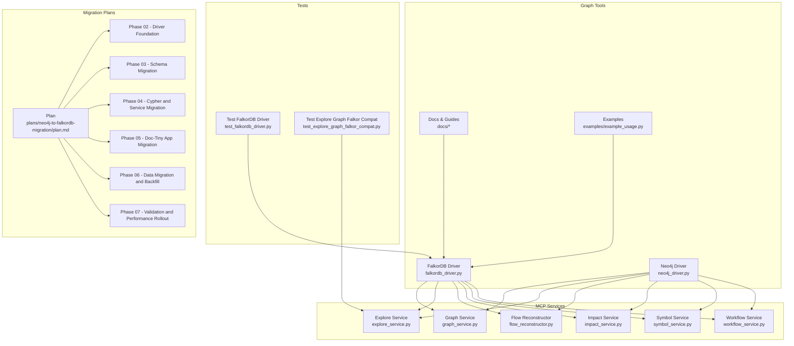
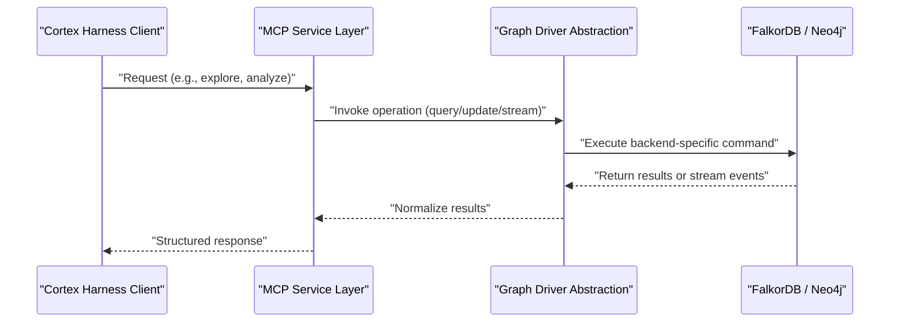
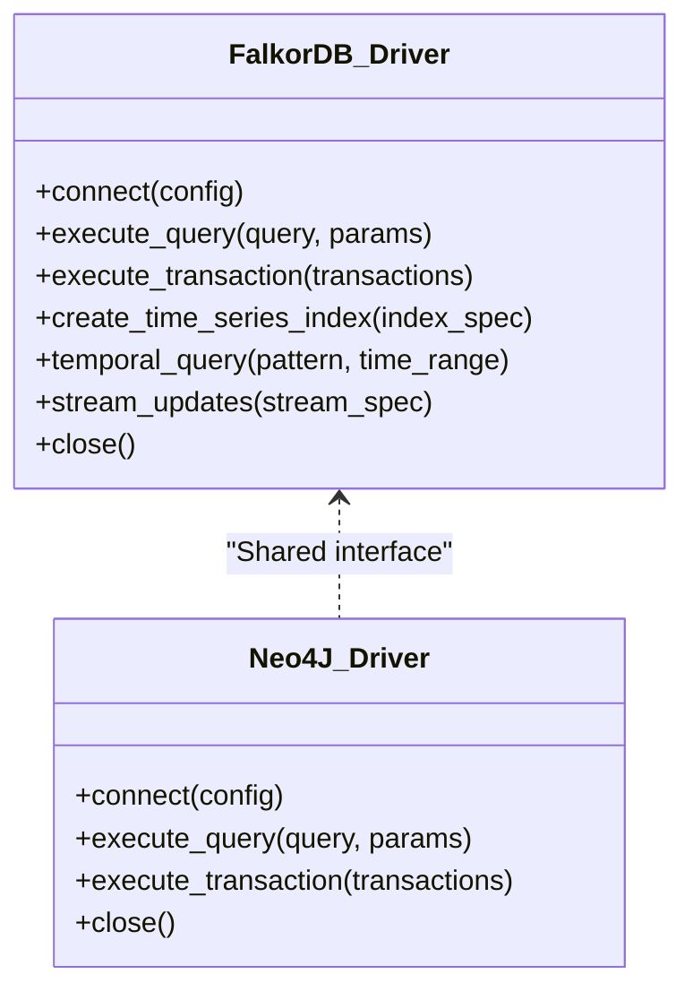
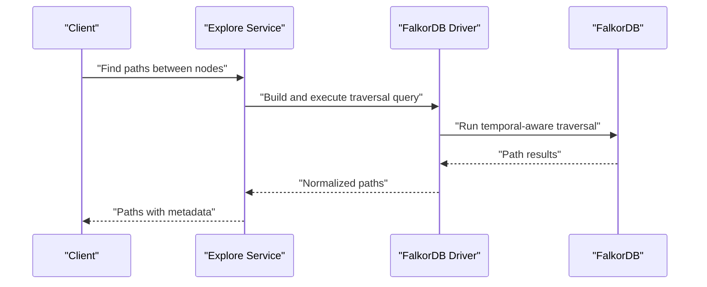
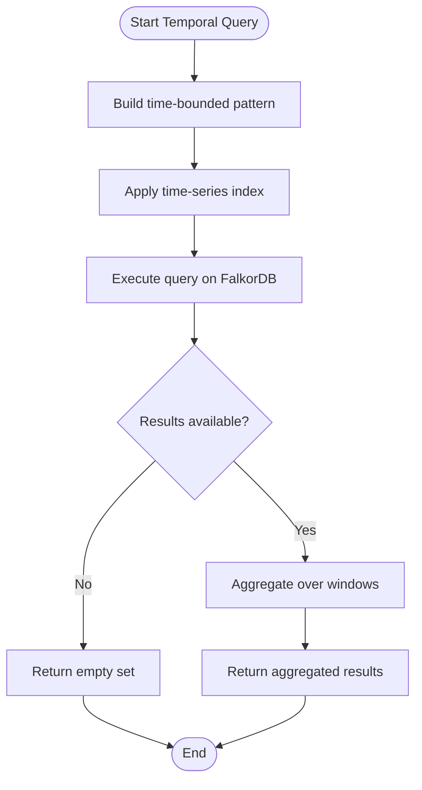
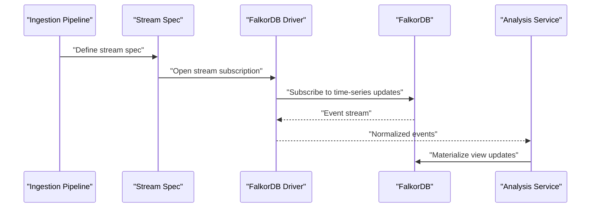
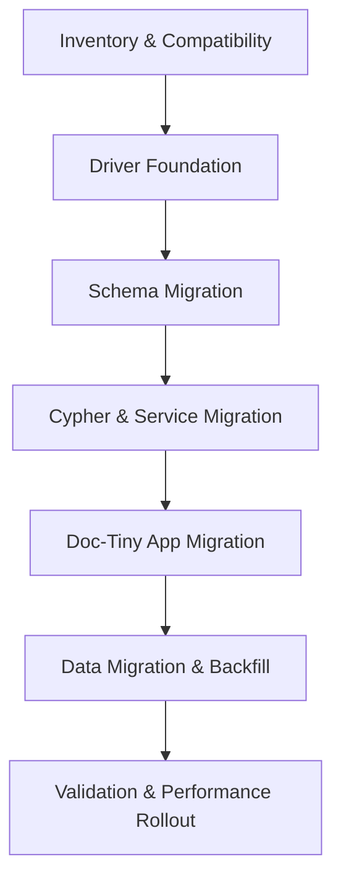
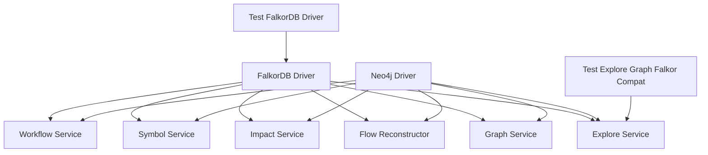

# FalkorDB Driver Implementation

<cite>
**Referenced Files in This Document**
- [falkordb_driver.py](file://code-tiny/tools/graph/driver/falkordb_driver.py)
- [neo4j_driver.py](file://code-tiny/tools/graph/driver/neo4j_driver.py)
- [graph_service.py](file://code-tiny/mcp/services/graph_service.py)
- [explore_service.py](file://code-tiny/mcp/services/explore_service.py)
- [flow_reconstructor.py](file://code-tiny/mcp/services/flow_reconstructor.py)
- [impact_service.py](file://code-tiny/mcp/services/impact_service.py)
- [symbol_service.py](file://code-tiny/mcp/services/symbol_service.py)
- [workflow_service.py](file://code-tiny/mcp/services/workflow_service.py)
- [STRUCTURE.md](file://code-tiny/tools/graph/STRUCTURE.md)
- [README.md](file://code-tiny/tools/graph/docs/README.md)
- [MIGRATION_GUIDE.py](file://code-tiny/tools/graph/docs/MIGRATION_GUIDE.py)
- [MIGRATION_EXAMPLE.md](file://code-tiny/tools/graph/docs/MIGRATION_EXAMPLE.md)
- [IMPLEMENTATION_SUMMARY.md](file://code-tiny/tools/graph/docs/IMPLEMENTATION_SUMMARY.md)
- [QUERY_BUILDER_SOLUTION.md](file://code-tiny/tools/graph/docs/QUERY_BUILDER_SOLUTION.md)
- [QUERY_METHODS.md](file://code-tiny/tools/graph/docs/QUERY_METHODS.md)
- [QUICK_REFERENCE.md](file://code-tiny/tools/graph/docs/QUICK_REFERENCE.md)
- [example_usage.py](file://code-tiny/tools/graph/examples/example_usage.py)
- [test_falkordb_driver.py](file://tests/test_falkordb_driver.py)
- [test_explore_graph_falkor_compat.py](file://tests/test_explore_graph_falkor_compat.py)
- [plan.md](file://plans/neo4j-to-falkordb-migration/plan.md)
- [phase-02-falkordb-driver-foundation.md](file://plans/neo4j-to-falkordb-migration/phase-02-falkordb-driver-foundation.md)
- [phase-03-schema-migration.md](file://plans/neo4j-to-falkordb-migration/phase-03-schema-migration.md)
- [phase-04-cypher-and-service-migration.md](file://plans/neo4j-to-falkordb-migration/phase-04-cypher-and-service-migration.md)
- [phase-05-doc-tiny-application-migration.md](file://plans/neo4j-to-falkordb-migration/phase-05-doc-tiny-application-migration.md)
- [phase-06-data-migration-and-backfill.md](file://plans/neo4j-to-falkordb-migration/phase-06-data-migration-and-backfill.md)
- [phase-07-validation-performance-rollout.md](file://plans/neo4j-to-falkordb-migration/phase-07-validation-performance-rollout.md)
</cite>

## Table of Contents
1. [Introduction](#introduction)
2. [Project Structure](#project-structure)
3. [Core Components](#core-components)
4. [Architecture Overview](#architecture-overview)
5. [Detailed Component Analysis](#detailed-component-analysis)
6. [Dependency Analysis](#dependency-analysis)
7. [Performance Considerations](#performance-considerations)
8. [Troubleshooting Guide](#troubleshooting-guide)
9. [Conclusion](#conclusion)
10. [Appendices](#appendices)

## Introduction
This document provides comprehensive documentation for the FalkorDB graph database driver implementation within Cortex Harness. It explains how FalkorDB’s time-series graph capabilities integrate with analysis workflows, details connection configuration and authentication, and outlines high-performance operation modes. It also documents differences from Neo4j in query syntax, data modeling, and performance characteristics, along with specialized operations for time-series analysis, temporal queries, and streaming updates. Migration strategies from Neo4j to FalkorDB, compatibility considerations, feature mapping, benchmarking guidelines, scaling recommendations, and operational best practices are included.

## Project Structure
The FalkorDB integration is implemented under the graph tools module and exposed via MCP services used by Cortex Harness workflows. The key areas include:
- Driver layer: FalkorDB-specific client and operations
- Service layer: MCP services that orchestrate graph interactions
- Documentation and migration guides
- Tests validating compatibility and behavior

**Diagram sources**
- [falkordb_driver.py](file://code-tiny/tools/graph/driver/falkordb_driver.py)
- [neo4j_driver.py](file://code-tiny/tools/graph/driver/neo4j_driver.py)
- [graph_service.py](file://code-tiny/mcp/services/graph_service.py)
- [explore_service.py](file://code-tiny/mcp/services/explore_service.py)
- [flow_reconstructor.py](file://code-tiny/mcp/services/flow_reconstructor.py)
- [impact_service.py](file://code-tiny/mcp/services/impact_service.py)
- [symbol_service.py](file://code-tiny/mcp/services/symbol_service.py)
- [workflow_service.py](file://code-tiny/mcp/services/workflow_service.py)
- [test_falkordb_driver.py](file://tests/test_falkordb_driver.py)
- [test_explore_graph_falkor_compat.py](file://tests/test_explore_graph_falkor_compat.py)
- [plan.md](file://plans/neo4j-to-falkordb-migration/plan.md)

**Section sources**
- [STRUCTURE.md](file://code-tiny/tools/graph/STRUCTURE.md)
- [README.md](file://code-tiny/tools/graph/docs/README.md)

## Core Components
- FalkorDB Driver: Implements connectivity, transactional operations, and FalkorDB-specific features such as time-series indexing and temporal queries.
- Neo4j Driver: Provides a parallel implementation for Neo4j, enabling abstraction over graph backends.
- MCP Services: High-level services that consume drivers to perform code analysis tasks (graph exploration, flow reconstruction, impact analysis, symbol resolution, workflow orchestration).
- Documentation and Migration Guides: Provide usage patterns, query methods, and step-by-step migration instructions.
- Example Usage: Demonstrates typical workflows and API usage.
- Tests: Validate driver functionality and explore service compatibility with FalkorDB.

Key responsibilities:
- Connection management and authentication
- Query execution and result parsing
- Time-series operations and temporal filtering
- Streaming updates for real-time graph changes
- Compatibility shims between Neo4j and FalkorDB

**Section sources**
- [falkordb_driver.py](file://code-tiny/tools/graph/driver/falkordb_driver.py)
- [neo4j_driver.py](file://code-tiny/tools/graph/driver/neo4j_driver.py)
- [graph_service.py](file://code-tiny/mcp/services/graph_service.py)
- [explore_service.py](file://code-tiny/mcp/services/explore_service.py)
- [flow_reconstructor.py](file://code-tiny/mcp/services/flow_reconstructor.py)
- [impact_service.py](file://code-tiny/mcp/services/impact_service.py)
- [symbol_service.py](file://code-tiny/mcp/services/symbol_service.py)
- [workflow_service.py](file://code-tiny/mcp/services/workflow_service.py)
- [QUERY_METHODS.md](file://code-tiny/tools/graph/docs/QUERY_METHODS.md)
- [QUICK_REFERENCE.md](file://code-tiny/tools/graph/docs/QUICK_REFERENCE.md)
- [example_usage.py](file://code-tiny/tools/graph/examples/example_usage.py)
- [test_falkordb_driver.py](file://tests/test_falkordb_driver.py)
- [test_explore_graph_falkor_compat.py](file://tests/test_explore_graph_falkor_compat.py)

## Architecture Overview
The architecture layers separate concerns between low-level driver operations and higher-level MCP services. The FalkorDB driver exposes a consistent interface consumed by services, allowing seamless switching between FalkorDB and Neo4j.

**Diagram sources**
- [graph_service.py](file://code-tiny/mcp/services/graph_service.py)
- [explore_service.py](file://code-tiny/mcp/services/explore_service.py)
- [falkordb_driver.py](file://code-tiny/tools/graph/driver/falkordb_driver.py)
- [neo4j_driver.py](file://code-tiny/tools/graph/driver/neo4j_driver.py)

## Detailed Component Analysis

### FalkorDB Driver
Responsibilities:
- Establish connections with authentication and TLS options
- Execute read/write transactions
- Perform time-series indexing and temporal queries
- Stream graph updates for real-time analytics
- Normalize results for consumption by MCP services

Operational modes:
- Batch mode for bulk ingestion
- Streaming mode for continuous updates
- Read-only mode for analytical workloads

Error handling:
- Connection retries and backoff
- Transaction rollback on partial failures
- Detailed error categorization for diagnostics

**Diagram sources**
- [falkordb_driver.py](file://code-tiny/tools/graph/driver/falkordb_driver.py)
- [neo4j_driver.py](file://code-tiny/tools/graph/driver/neo4j_driver.py)

**Section sources**
- [falkordb_driver.py](file://code-tiny/tools/graph/driver/falkordb_driver.py)
- [neo4j_driver.py](file://code-tiny/tools/graph/driver/neo4j_driver.py)
- [QUERY_METHODS.md](file://code-tiny/tools/graph/docs/QUERY_METHODS.md)
- [QUICK_REFERENCE.md](file://code-tiny/tools/graph/docs/QUICK_REFERENCE.md)
- [test_falkordb_driver.py](file://tests/test_falkordb_driver.py)

### MCP Services Integration
Services orchestrate graph operations for analysis workflows:
- Graph Service: Centralized entry point for graph-related requests
- Explore Service: Traversals, subgraph extraction, path finding
- Flow Reconstructor: Reconstruct control/data flows using graph context
- Impact Service: Analyze change propagation across the graph
- Symbol Service: Resolve symbols and relationships
- Workflow Service: Orchestrate multi-step analysis pipelines

**Diagram sources**
- [explore_service.py](file://code-tiny/mcp/services/explore_service.py)
- [falkordb_driver.py](file://code-tiny/tools/graph/driver/falkordb_driver.py)

**Section sources**
- [graph_service.py](file://code-tiny/mcp/services/graph_service.py)
- [explore_service.py](file://code-tiny/mcp/services/explore_service.py)
- [flow_reconstructor.py](file://code-tiny/mcp/services/flow_reconstructor.py)
- [impact_service.py](file://code-tiny/mcp/services/impact_service.py)
- [symbol_service.py](file://code-tiny/mcp/services/symbol_service.py)
- [workflow_service.py](file://code-tiny/mcp/services/workflow_service.py)

### Time-Series Graph Operations
FalkorDB supports time-series graphs, enabling:
- Indexing edges/nodes with timestamps
- Temporal range queries
- Sliding window aggregations
- Streaming updates for live telemetry

**Diagram sources**
- [falkordb_driver.py](file://code-tiny/tools/graph/driver/falkordb_driver.py)
- [QUERY_METHODS.md](file://code-tiny/tools/graph/docs/QUERY_METHODS.md)

**Section sources**
- [falkordb_driver.py](file://code-tiny/tools/graph/driver/falkordb_driver.py)
- [QUERY_METHODS.md](file://code-tiny/tools/graph/docs/QUERY_METHODS.md)
- [QUICK_REFERENCE.md](file://code-tiny/tools/graph/docs/QUICK_REFERENCE.md)

### Streaming Graph Updates
Streaming mode enables real-time ingestion and analysis:
- Subscribe to update streams
- Incrementally apply mutations
- Maintain materialized views for fast reads

**Diagram sources**
- [falkordb_driver.py](file://code-tiny/tools/graph/driver/falkordb_driver.py)
- [workflow_service.py](file://code-tiny/mcp/services/workflow_service.py)

**Section sources**
- [falkordb_driver.py](file://code-tiny/tools/graph/driver/falkordb_driver.py)
- [workflow_service.py](file://code-tiny/mcp/services/workflow_service.py)

### Differences from Neo4j
Key distinctions:
- Query syntax: FalkorDB may use different constructs for time-series and streaming; refer to query method docs for specifics.
- Data modeling: Emphasis on temporal attributes on edges/nodes and indexed time ranges.
- Performance: Optimizations for time-windowed traversals and streaming ingestion.

Compatibility shims:
- Normalized interfaces abstract backend differences
- Service layer adapts queries to backend capabilities

**Section sources**
- [neo4j_driver.py](file://code-tiny/tools/graph/driver/neo4j_driver.py)
- [falkordb_driver.py](file://code-tiny/tools/graph/driver/falkordb_driver.py)
- [QUERY_METHODS.md](file://code-tiny/tools/graph/docs/QUERY_METHODS.md)
- [QUERY_BUILDER_SOLUTION.md](file://code-tiny/tools/graph/docs/QUERY_BUILDER_SOLUTION.md)

### Migration Strategies from Neo4j to FalkorDB
Phased approach:
- Inventory and compatibility assessment
- Driver foundation and abstraction
- Schema migration and constraints
- Query/service migration and validation
- Application migration and testing
- Data migration and backfill
- Performance validation and rollout

**Diagram sources**
- [plan.md](file://plans/neo4j-to-falkordb-migration/plan.md)
- [phase-02-falkordb-driver-foundation.md](file://plans/neo4j-to-falkordb-migration/phase-02-falkordb-driver-foundation.md)
- [phase-03-schema-migration.md](file://plans/neo4j-to-falkordb-migration/phase-03-schema-migration.md)
- [phase-04-cypher-and-service-migration.md](file://plans/neo4j-to-falkordb-migration/phase-04-cypher-and-service-migration.md)
- [phase-05-doc-tiny-application-migration.md](file://plans/neo4j-to-falkordb-migration/phase-05-doc-tiny-application-migration.md)
- [phase-06-data-migration-and-backfill.md](file://plans/neo4j-to-falkordb-migration/phase-06-data-migration-and-backfill.md)
- [phase-07-validation-performance-rollout.md](file://plans/neo4j-to-falkordb-migration/phase-07-validation-performance-rollout.md)

**Section sources**
- [plan.md](file://plans/neo4j-to-falkordb-migration/plan.md)
- [phase-02-falkordb-driver-foundation.md](file://plans/neo4j-to-falkordb-migration/phase-02-falkordb-driver-foundation.md)
- [phase-03-schema-migration.md](file://plans/neo4j-to-falkordb-migration/phase-03-schema-migration.md)
- [phase-04-cypher-and-service-migration.md](file://plans/neo4j-to-falkordb-migration/phase-04-cypher-and-service-migration.md)
- [phase-05-doc-tiny-application-migration.md](file://plans/neo4j-to-falkordb-migration/phase-05-doc-tiny-application-migration.md)
- [phase-06-data-migration-and-backfill.md](file://plans/neo4j-to-falkordb-migration/phase-06-data-migration-and-backfill.md)
- [phase-07-validation-performance-rollout.md](file://plans/neo4j-to-falkordb-migration/phase-07-validation-performance-rollout.md)
- [MIGRATION_GUIDE.py](file://code-tiny/tools/graph/docs/MIGRATION_GUIDE.py)
- [MIGRATION_EXAMPLE.md](file://code-tiny/tools/graph/docs/MIGRATION_EXAMPLE.md)

## Dependency Analysis
The FalkorDB driver depends on MCP services for orchestration and is validated by tests. The Neo4j driver shares the same interface, enabling abstraction.

**Diagram sources**
- [falkordb_driver.py](file://code-tiny/tools/graph/driver/falkordb_driver.py)
- [neo4j_driver.py](file://code-tiny/tools/graph/driver/neo4j_driver.py)
- [graph_service.py](file://code-tiny/mcp/services/graph_service.py)
- [explore_service.py](file://code-tiny/mcp/services/explore_service.py)
- [flow_reconstructor.py](file://code-tiny/mcp/services/flow_reconstructor.py)
- [impact_service.py](file://code-tiny/mcp/services/impact_service.py)
- [symbol_service.py](file://code-tiny/mcp/services/symbol_service.py)
- [workflow_service.py](file://code-tiny/mcp/services/workflow_service.py)
- [test_falkordb_driver.py](file://tests/test_falkordb_driver.py)
- [test_explore_graph_falkor_compat.py](file://tests/test_explore_graph_falkor_compat.py)

**Section sources**
- [falkordb_driver.py](file://code-tiny/tools/graph/driver/falkordb_driver.py)
- [neo4j_driver.py](file://code-tiny/tools/graph/driver/neo4j_driver.py)
- [graph_service.py](file://code-tiny/mcp/services/graph_service.py)
- [explore_service.py](file://code-tiny/mcp/services/explore_service.py)
- [test_falkordb_driver.py](file://tests/test_falkordb_driver.py)
- [test_explore_graph_falkor_compat.py](file://tests/test_explore_graph_falkor_compat.py)

## Performance Considerations
Guidelines:
- Use batch mode for large ingests; tune batch sizes based on memory and throughput targets
- Prefer streaming mode for real-time updates; monitor lag and backpressure
- Leverage time-series indexes for temporal queries; validate selectivity and cardinality
- Materialize frequent subgraphs/views to reduce repeated computation
- Monitor query plans and adjust patterns to minimize full scans
- Scale horizontally where supported; partition by time windows or domains

Benchmarking:
- Define representative workloads (reads, writes, streaming)
- Measure latency percentiles and throughput under load
- Compare FalkorDB vs Neo4j for time-series-heavy scenarios
- Track resource utilization (CPU, memory, I/O) during benchmarks

Scaling:
- Partition datasets by time ranges or namespaces
- Use read replicas for analytical queries
- Tune connection pools and concurrency limits
- Implement circuit breakers and retries for resilience

Best practices:
- Normalize schemas to support temporal attributes consistently
- Enforce constraints to maintain data integrity
- Version migration scripts and track schema evolution
- Observe and alert on streaming lag and query degradation

[No sources needed since this section provides general guidance]

## Troubleshooting Guide
Common issues and resolutions:
- Connection failures: Verify credentials, network reachability, and TLS settings; enable retry/backoff
- Authentication errors: Confirm token validity and permissions; rotate secrets securely
- Query timeouts: Optimize patterns, add indexes, limit result sets
- Streaming stalls: Check consumer lag, increase processing capacity, inspect event ordering
- Partial transaction failures: Inspect logs, roll back, re-run idempotently

Diagnostics:
- Enable detailed logging at driver and service layers
- Capture query plans and execution metrics
- Use tests to reproduce issues in isolation

**Section sources**
- [falkordb_driver.py](file://code-tiny/tools/graph/driver/falkordb_driver.py)
- [test_falkordb_driver.py](file://tests/test_falkordb_driver.py)
- [test_explore_graph_falkor_compat.py](file://tests/test_explore_graph_falkor_compat.py)

## Conclusion
The FalkorDB driver integrates tightly with Cortex Harness MCP services to deliver high-performance time-series graph analytics. By leveraging temporal indexing, streaming updates, and normalized abstractions, it complements Neo4j while offering specialized capabilities for real-time analysis. Following the migration plan and operational best practices ensures a smooth transition and robust production deployments.

[No sources needed since this section summarizes without analyzing specific files]

## Appendices

### Configuration and Authentication
- Connection parameters: host, port, database, credentials, TLS flags
- Authentication schemes: tokens, certificates, environment-based secrets
- Operational modes: batch, streaming, read-only
- Pooling and concurrency: max connections, timeouts, retries

**Section sources**
- [falkordb_driver.py](file://code-tiny/tools/graph/driver/falkordb_driver.py)
- [QUICK_REFERENCE.md](file://code-tiny/tools/graph/docs/QUICK_REFERENCE.md)

### Query Syntax and Modeling Notes
- Temporal patterns and time-range filters
- Edge/node timestamp attributes and indexing
- Aggregation over sliding windows
- Compatibility shims for cross-backend queries

**Section sources**
- [QUERY_METHODS.md](file://code-tiny/tools/graph/docs/QUERY_METHODS.md)
- [QUERY_BUILDER_SOLUTION.md](file://code-tiny/tools/graph/docs/QUERY_BUILDER_SOLUTION.md)
- [MIGRATION_GUIDE.py](file://code-tiny/tools/graph/docs/MIGRATION_GUIDE.py)
- [MIGRATION_EXAMPLE.md](file://code-tiny/tools/graph/docs/MIGRATION_EXAMPLE.md)

### Example Workflows
- Ingesting time-series graph data
- Running temporal path queries
- Subscribing to streaming updates and materializing views
- Orchestrating multi-step analysis pipelines

**Section sources**
- [example_usage.py](file://code-tiny/tools/graph/examples/example_usage.py)
- [workflow_service.py](file://code-tiny/mcp/services/workflow_service.py)

### Implementation Summary
- Design principles and architectural decisions
- Feature coverage and limitations
- Known trade-offs and future enhancements

**Section sources**
- [IMPLEMENTATION_SUMMARY.md](file://code-tiny/tools/graph/docs/IMPLEMENTATION_SUMMARY.md)
- [README.md](file://code-tiny/tools/graph/docs/README.md)