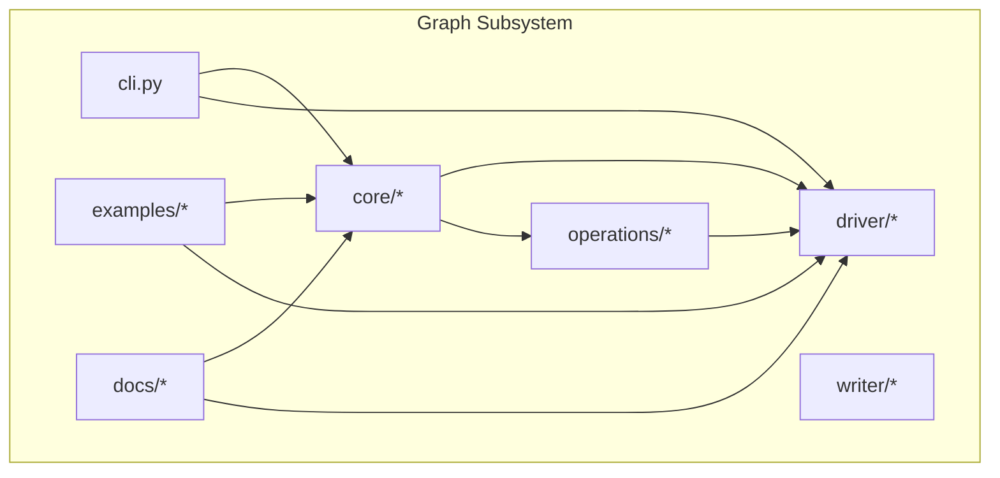
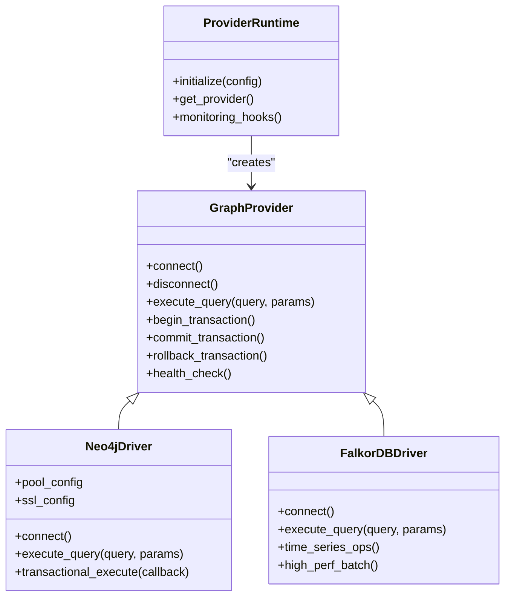
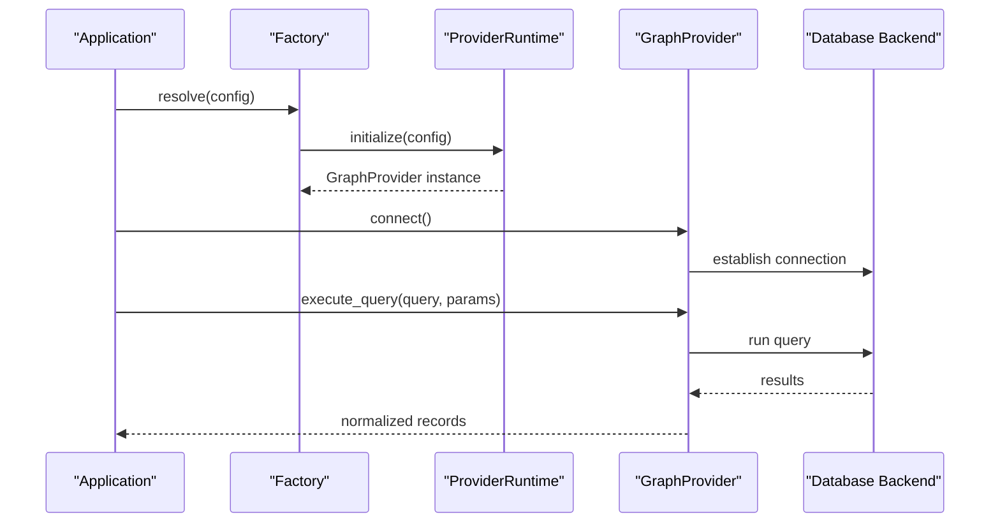
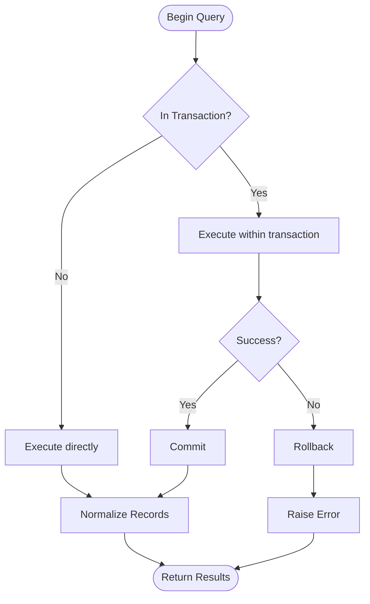
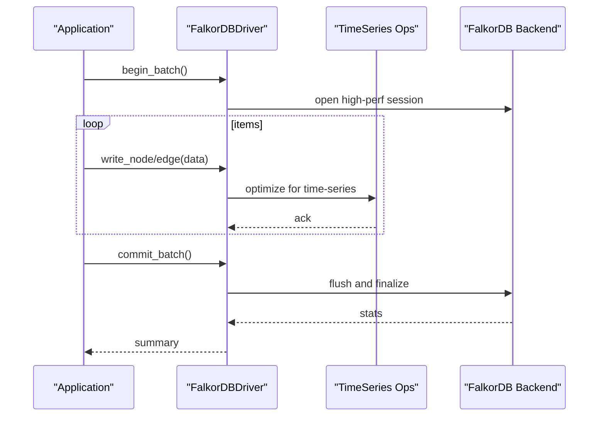
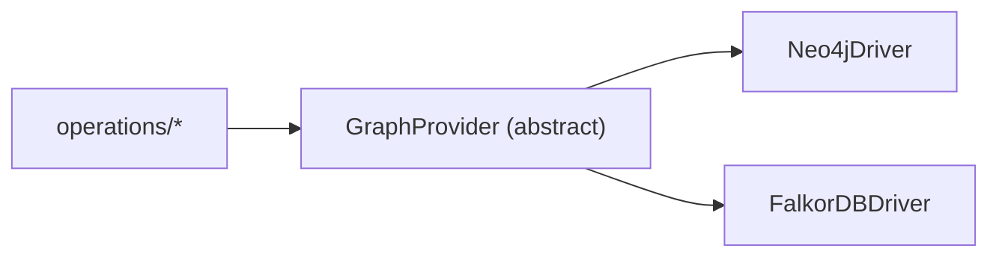
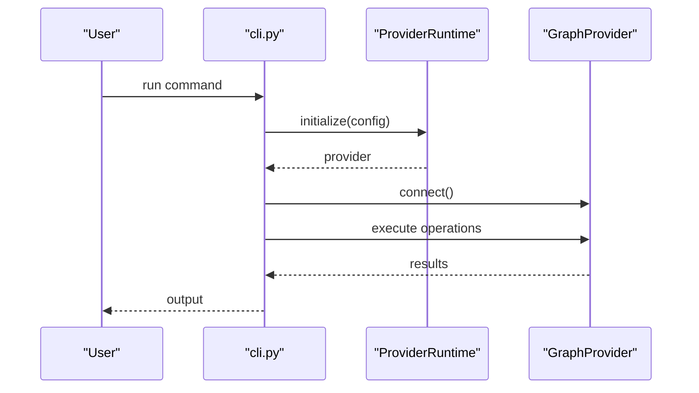
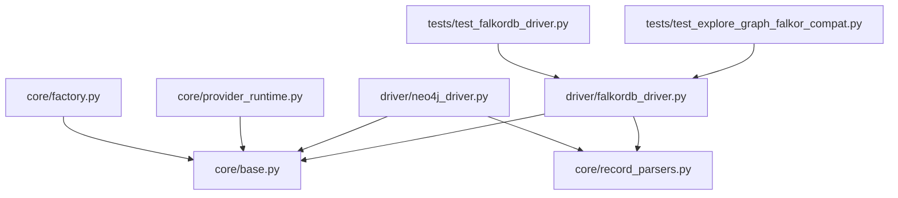

# Graph Database Drivers

<cite>
**Referenced Files in This Document**
- [neo4j_driver.py](file://code-tiny/skills/code-graph-ingraph/driver/neo4j_driver.py)
- [falkordb_driver.py](file://code-tiny/skills/code-graph-ingraph/driver/falkordb_driver.py)
- [base.py](file://code-tiny/skills/code-graph-ingraph/core/base.py)
- [factory.py](file://code-tiny/skills/code-graph-ingraph/core/factory.py)
- [require_neo4j.py](file://code-tiny/skills/code-graph-ingraph/core/require_neo4j.py)
- [record_parsers.py](file://code-tiny/skills/code-graph-ingraph/core/record_parsers.py)
- [provider_runtime.py](file://code-tiny/skills/code-graph-ingraph/core/provider_runtime.py)
- [__init__.py](file://code-tiny/skills/code-graph-ingraph/__init__.py)
- [cli.py](file://code-tiny/skills/code-graph-ingraph/cli.py)
- [STRUCTURE.md](file://code-tiny/skills/code-graph-ingraph/STRUCTURE.md)
- [README.md](file://code-tiny/skills/code-graph-ingraph/docs/README.md)
- [IMPLEMENTATION_SUMMARY.md](file://code-tiny/skills/code-graph-ingraph/docs/IMPLEMENTATION_SUMMARY.md)
- [MIGRATION_GUIDE.py](file://code-tiny/skills/code-graph-ingraph/docs/MIGRATION_GUIDE.py)
- [MIGRATION_EXAMPLE.md](file://code-tiny/skills/code-graph-ingraph/docs/MIGRATION_EXAMPLE.md)
- [QUERY_BUILDER_SOLUTION.md](file://code-tiny/skills/code-graph-ingraph/docs/QUERY_BUILDER_SOLUTION.md)
- [QUERY_METHODS.md](file://code-tiny/skills/code-graph-ingraph/docs/QUERY_METHODS.md)
- [QUICK_REFERENCE.md](file://code-tiny/skills/code-graph-ingraph/docs/QUICK_REFERENCE.md)
- [example_usage.py](file://code-tiny/skills/code-graph-ingraph/examples/example_usage.py)
- [test_falkordb_driver.py](file://tests/test_falkordb_driver.py)
- [test_explore_graph_falkor_compat.py](file://tests/test_explore_graph_falkor_compat.py)
- [plan.md](file://plans/neo4j-to-falkordb-migration/plan.md)
- [validation.md](file://plans/neo4j-to-falkordb-migration/validation.md)
- [red-team.md](file://plans/neo4j-to-falkordb-migration/red-team.md)
</cite>

## Table of Contents
1. [Introduction](#introduction)
2. [Project Structure](#project-structure)
3. [Core Components](#core-components)
4. [Architecture Overview](#architecture-overview)
5. [Detailed Component Analysis](#detailed-component-analysis)
6. [Dependency Analysis](#dependency-analysis)
7. [Performance Considerations](#performance-considerations)
8. [Troubleshooting Guide](#troubleshooting-guide)
9. [Conclusion](#conclusion)
10. [Appendices](#appendices)

## Introduction
This document explains the graph database driver implementations in Cortex Harness, focusing on Neo4j and FalkorDB backends. It covers connection pooling, transaction management, query execution patterns, performance optimization, configuration options (including authentication and SSL/TLS), monitoring, troubleshooting, migration procedures, scalability, and distributed deployment considerations. The goal is to enable developers to understand how drivers are integrated via an abstract interface and how to extend or migrate between backends safely.

## Project Structure
The graph subsystem is organized under code-tiny/skills/code-graph-ingraph with a clear separation between core abstractions, driver implementations, operations, writers, CLI, and documentation. Key areas:
- Core abstractions and runtime utilities
- Driver implementations for Neo4j and FalkorDB
- Operations layer for domain-specific graph actions
- CLI entry points and examples
- Documentation and migration guides

**Diagram sources**
- [STRUCTURE.md](file://code-tiny/skills/code-graph-ingraph/STRUCTURE.md)
- [README.md](file://code-tiny/skills/code-graph-ingraph/docs/README.md)

**Section sources**
- [STRUCTURE.md](file://code-tiny/skills/code-graph-ingraph/STRUCTURE.md)
- [README.md](file://code-tiny/skills/code-graph-ingraph/docs/README.md)

## Core Components
The core defines the abstract contract that all drivers must implement, along with shared utilities for record parsing and provider runtime behavior.

- Abstract driver interface and common behaviors
- Record parsing helpers for consistent result normalization
- Provider runtime integration for lifecycle and configuration
- Optional requirements enforcement (e.g., Neo4j client presence)

Key files:
- Abstract base and factory
- Record parsers
- Provider runtime
- Neo4j requirement helper

**Section sources**
- [base.py](file://code-tiny/skills/code-graph-ingraph/core/base.py)
- [factory.py](file://code-tiny/skills/code-graph-ingraph/core/factory.py)
- [record_parsers.py](file://code-tiny/skills/code-graph-ingraph/core/record_parsers.py)
- [provider_runtime.py](file://code-tiny/skills/code-graph-ingraph/core/provider_runtime.py)
- [require_neo4j.py](file://code-tiny/skills/code-graph-ingraph/core/require_neo4j.py)

## Architecture Overview
The system uses a pluggable driver architecture. Consumers interact with a unified interface; at runtime, a specific backend (Neo4j or FalkorDB) is selected based on configuration.

**Diagram sources**
- [base.py](file://code-tiny/skills/code-graph-ingraph/core/base.py)
- [neo4j_driver.py](file://code-tiny/skills/code-graph-ingraph/driver/neo4j_driver.py)
- [falkordb_driver.py](file://code-tiny/skills/code-graph-ingraph/driver/falkordb_driver.py)
- [provider_runtime.py](file://code-tiny/skills/code-graph-ingraph/core/provider_runtime.py)

## Detailed Component Analysis

### Abstract Driver Interface and Factory
The abstract interface standardizes connection, query execution, transactions, and health checks across backends. A factory resolves the concrete driver from configuration.

Highlights:
- Unified method signatures for connect/disconnect/query/transactions
- Consistent error handling and result normalization via record parsers
- Runtime initialization and provider selection

**Diagram sources**
- [factory.py](file://code-tiny/skills/code-graph-ingraph/core/factory.py)
- [provider_runtime.py](file://code-tiny/skills/code-graph-ingraph/core/provider_runtime.py)
- [base.py](file://code-tiny/skills/code-graph-ingraph/core/base.py)

**Section sources**
- [base.py](file://code-tiny/skills/code-graph-ingraph/core/base.py)
- [factory.py](file://code-tiny/skills/code-graph-ingraph/core/factory.py)
- [provider_runtime.py](file://code-tiny/skills/code-graph-ingraph/core/provider_runtime.py)

### Neo4j Driver
Responsibilities:
- Connection management with pooling
- Transactional execution
- Cypher query execution
- SSL/TLS configuration
- Health checks and metrics hooks

Operational notes:
- Pool sizing and idle timeouts should be tuned to workload
- Transactions wrap multiple queries to ensure consistency
- SSL/TLS requires certificate paths and verification flags
- Monitoring hooks expose latency and error rates

**Diagram sources**
- [neo4j_driver.py](file://code-tiny/skills/code-graph-ingraph/driver/neo4j_driver.py)
- [record_parsers.py](file://code-tiny/skills/code-graph-ingraph/core/record_parsers.py)

**Section sources**
- [neo4j_driver.py](file://code-tiny/skills/code-graph-ingraph/driver/neo4j_driver.py)
- [require_neo4j.py](file://code-tiny/skills/code-graph-ingraph/core/require_neo4j.py)
- [record_parsers.py](file://code-tiny/skills/code-graph-ingraph/core/record_parsers.py)

### FalkorDB Driver
Responsibilities:
- High-performance operations optimized for time-series workloads
- Batched writes and efficient traversal patterns
- Compatibility shims for existing graph APIs where applicable

Operational notes:
- Prefer streaming and batch APIs for throughput
- Use time-series primitives when available
- Monitor memory usage during large batch operations

**Diagram sources**
- [falkordb_driver.py](file://code-tiny/skills/code-graph-ingraph/driver/falkordb_driver.py)

**Section sources**
- [falkordb_driver.py](file://code-tiny/skills/code-graph-ingraph/driver/falkordb_driver.py)

### Operations Layer Integration
Operations encapsulate domain logic (e.g., class, function, flow, namespace, package, type, document, cross-edge, infra). They call into the driver through the abstract interface, ensuring backend independence.

**Diagram sources**
- [class_ops.py](file://code-tiny/skills/code-graph-ingraph/operations/class_ops.py)
- [function_ops.py](file://code-tiny/skills/code-graph-ingraph/operations/function_ops.py)
- [flow_ops.py](file://code-tiny/skills/code-graph-ingraph/operations/flow_ops.py)
- [namespace_ops.py](file://code-tiny/skills/code-graph-ingraph/operations/namespace_ops.py)
- [package_ops.py](file://code-tiny/skills/code-graph-ingraph/operations/package_ops.py)
- [type_ops.py](file://code-tiny/skills/code-graph-ingraph/operations/type_ops.py)
- [document_ops.py](file://code-tiny/skills/code-graph-ingraph/operations/document_ops.py)
- [cross_edge_ops.py](file://code-tiny/skills/code-graph-ingraph/operations/cross_edge_ops.py)
- [infra_ops.py](file://code-tiny/skills/code-graph-ingraph/operations/infra_ops.py)

**Section sources**
- [class_ops.py](file://code-tiny/skills/code-graph-ingraph/operations/class_ops.py)
- [function_ops.py](file://code-tiny/skills/code-graph-ingraph/operations/function_ops.py)
- [flow_ops.py](file://code-tiny/skills/code-graph-ingraph/operations/flow_ops.py)
- [namespace_ops.py](file://code-tiny/skills/code-graph-ingraph/operations/namespace_ops.py)
- [package_ops.py](file://code-tiny/skills/code-graph-ingraph/operations/package_ops.py)
- [type_ops.py](file://code-tiny/skills/code-graph-ingraph/operations/type_ops.py)
- [document_ops.py](file://code-tiny/skills/code-graph-ingraph/operations/document_ops.py)
- [cross_edge_ops.py](file://code-tiny/skills/code-graph-ingraph/operations/cross_edge_ops.py)
- [infra_ops.py](file://code-tiny/skills/code-graph-ingraph/operations/infra_ops.py)

### CLI and Examples
CLI provides commands to bootstrap, configure, and run graph tasks. Examples demonstrate typical usage patterns and workflows.

**Diagram sources**
- [cli.py](file://code-tiny/skills/code-graph-ingraph/cli.py)
- [provider_runtime.py](file://code-tiny/skills/code-graph-ingraph/core/provider_runtime.py)
- [example_usage.py](file://code-tiny/skills/code-graph-ingraph/examples/example_usage.py)

**Section sources**
- [cli.py](file://code-tiny/skills/code-graph-ingraph/cli.py)
- [example_usage.py](file://code-tiny/skills/code-graph-ingraph/examples/example_usage.py)

## Dependency Analysis
Drivers depend on the abstract interface and shared utilities. The factory selects the implementation based on configuration. Tests validate compatibility and behavior.

**Diagram sources**
- [base.py](file://code-tiny/skills/code-graph-ingraph/core/base.py)
- [factory.py](file://code-tiny/skills/code-graph-ingraph/core/factory.py)
- [provider_runtime.py](file://code-tiny/skills/code-graph-ingraph/core/provider_runtime.py)
- [record_parsers.py](file://code-tiny/skills/code-graph-ingraph/core/record_parsers.py)
- [neo4j_driver.py](file://code-tiny/skills/code-graph-ingraph/driver/neo4j_driver.py)
- [falkordb_driver.py](file://code-tiny/skills/code-graph-ingraph/driver/falkordb_driver.py)
- [test_falkordb_driver.py](file://tests/test_falkordb_driver.py)
- [test_explore_graph_falkor_compat.py](file://tests/test_explore_graph_falkor_compat.py)

**Section sources**
- [base.py](file://code-tiny/skills/code-graph-ingraph/core/base.py)
- [factory.py](file://code-tiny/skills/code-graph-ingraph/core/factory.py)
- [provider_runtime.py](file://code-tiny/skills/code-graph-ingraph/core/provider_runtime.py)
- [record_parsers.py](file://code-tiny/skills/code-graph-ingraph/core/record_parsers.py)
- [neo4j_driver.py](file://code-tiny/skills/code-graph-ingraph/driver/neo4j_driver.py)
- [falkordb_driver.py](file://code-tiny/skills/code-graph-ingraph/driver/falkordb_driver.py)
- [test_falkordb_driver.py](file://tests/test_falkordb_driver.py)
- [test_explore_graph_falkor_compat.py](file://tests/test_explore_graph_falkor_compat.py)

## Performance Considerations
General guidance for both drivers:
- Connection pooling
  - Tune pool size to concurrent request volume
  - Set appropriate idle timeouts and max lifetime
- Transactions
  - Group related writes into single transactions to reduce round-trips
  - Keep transactions short to avoid contention
- Query design
  - Minimize returned data; project only needed fields
  - Leverage indexes and constraints defined by schema
- Batch operations
  - Prefer batching writes for high-throughput ingestion
  - For FalkorDB, use time-series optimized primitives
- Monitoring
  - Track latency percentiles, error rates, and queue lengths
  - Alert on saturation thresholds

[No sources needed since this section provides general guidance]

## Troubleshooting Guide
Common issues and resolutions:
- Connectivity failures
  - Verify host, port, credentials, and network reachability
  - Ensure required dependencies are installed (e.g., Neo4j client)
- Authentication and TLS
  - Confirm username/password or token validity
  - Validate certificate paths and trust stores for SSL/TLS
- Query errors
  - Inspect parameter binding and types
  - Review index/constraint definitions for performance and correctness
- Timeouts and retries
  - Adjust timeout settings and retry policies
  - Investigate long-running queries and consider pagination
- Migration pitfalls
  - Validate schema parity before switching backends
  - Back up data and run validation suites post-migration

**Section sources**
- [require_neo4j.py](file://code-tiny/skills/code-graph-ingraph/core/require_neo4j.py)
- [test_falkordb_driver.py](file://tests/test_falkordb_driver.py)
- [test_explore_graph_falkor_compat.py](file://tests/test_explore_graph_falkor_compat.py)

## Conclusion
Cortex Harness provides a clean abstraction over graph backends, enabling seamless integration of Neo4j and FalkorDB. By following the documented configuration, performance tuning, and migration practices, teams can select the best backend for their workload while maintaining a consistent API surface.

[No sources needed since this section summarizes without analyzing specific files]

## Appendices

### Configuration Options
Typical configuration keys include:
- Connection: host, port, scheme, database name
- Authentication: username, password, token
- SSL/TLS: certificate path, verify flag, key material
- Pooling: min/max connections, idle timeout, max lifetime
- Timeouts: connect, read, write
- Monitoring: metrics enabled, sampling rate

Where to set:
- Environment variables or config files consumed by ProviderRuntime
- CLI arguments passed through cli.py

**Section sources**
- [provider_runtime.py](file://code-tiny/skills/code-graph-ingraph/core/provider_runtime.py)
- [cli.py](file://code-tiny/skills/code-graph-ingraph/cli.py)

### Authentication Methods
- Username/password
- Token-based
- Certificate-based (for mutual TLS)

**Section sources**
- [neo4j_driver.py](file://code-tiny/skills/code-graph-ingraph/driver/neo4j_driver.py)
- [falkordb_driver.py](file://code-tiny/skills/code-graph-ingraph/driver/falkordb_driver.py)

### SSL/TLS Setup
- Provide CA certificate path
- Enable verification flags
- Configure client certificates if required

**Section sources**
- [neo4j_driver.py](file://code-tiny/skills/code-graph-ingraph/driver/neo4j_driver.py)

### Monitoring Capabilities
- Expose metrics hooks for latency, throughput, and errors
- Integrate with external observability systems
- Log structured events for tracing

**Section sources**
- [provider_runtime.py](file://code-tiny/skills/code-graph-ingraph/core/provider_runtime.py)

### Migration Procedures
Steps:
- Inventory current schema and queries
- Validate compatibility with target backend
- Apply schema migrations
- Migrate data with backfill and validation
- Run acceptance tests and performance benchmarks

References:
- Plan and validation documents
- Migration guide and example

**Section sources**
- [plan.md](file://plans/neo4j-to-falkordb-migration/plan.md)
- [validation.md](file://plans/neo4j-to-falkordb-migration/validation.md)
- [red-team.md](file://plans/neo4j-to-falkordb-migration/red-team.md)
- [MIGRATION_GUIDE.py](file://code-tiny/skills/code-graph-ingraph/docs/MIGRATION_GUIDE.py)
- [MIGRATION_EXAMPLE.md](file://code-tiny/skills/code-graph-ingraph/docs/MIGRATION_EXAMPLE.md)

### Scalability and Distributed Deployment
- Neo4j
  - Scale out with cluster topology
  - Use read replicas for query-heavy workloads
  - Partition data by domain or tenant
- FalkorDB
  - Favor high-throughput batch ingestion
  - Use time-series partitions for temporal data
  - Monitor resource utilization and scale horizontally as needed

[No sources needed since this section provides general guidance]

### Developer Quick Reference
- How to add a new backend
  - Implement the abstract interface
  - Register via factory
  - Add tests and docs
- Query methods and builders
  - Refer to query methods and builder solution docs
- Example usage
  - See example script for end-to-end workflow

**Section sources**
- [__init__.py](file://code-tiny/skills/code-graph-ingraph/__init__.py)
- [QUICK_REFERENCE.md](file://code-tiny/skills/code-graph-ingraph/docs/QUICK_REFERENCE.md)
- [QUERY_METHODS.md](file://code-tiny/skills/code-graph-ingraph/docs/QUERY_METHODS.md)
- [QUERY_BUILDER_SOLUTION.md](file://code-tiny/skills/code-graph-ingraph/docs/QUERY_BUILDER_SOLUTION.md)
- [IMPLEMENTATION_SUMMARY.md](file://code-tiny/skills/code-graph-ingraph/docs/IMPLEMENTATION_SUMMARY.md)
- [example_usage.py](file://code-tiny/skills/code-graph-ingraph/examples/example_usage.py)