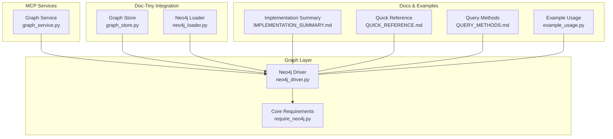
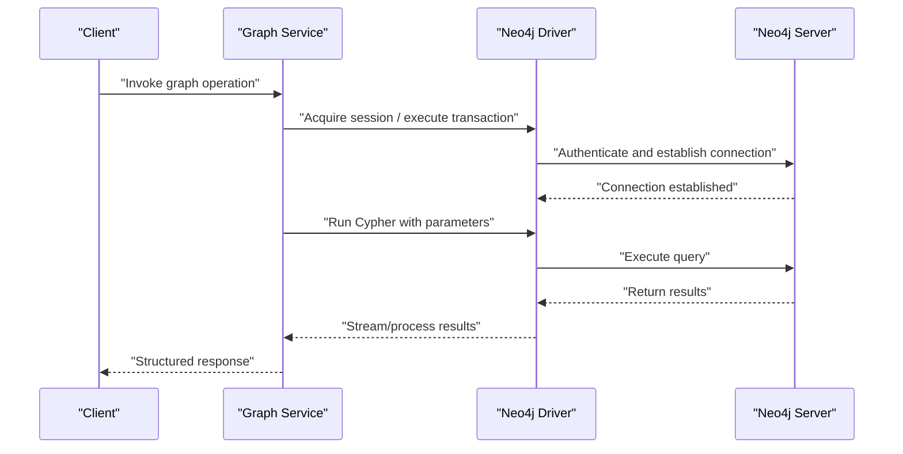
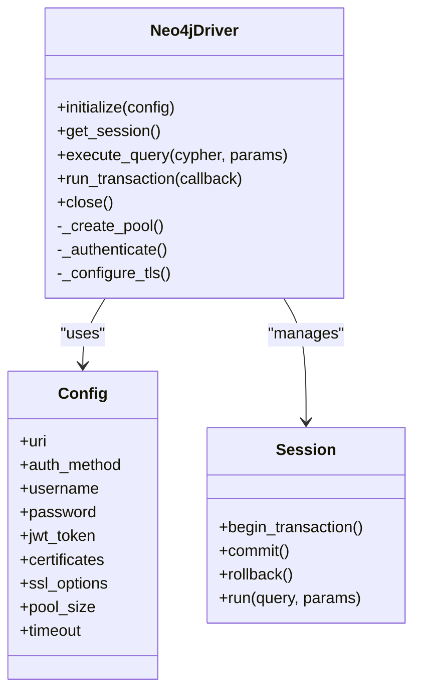
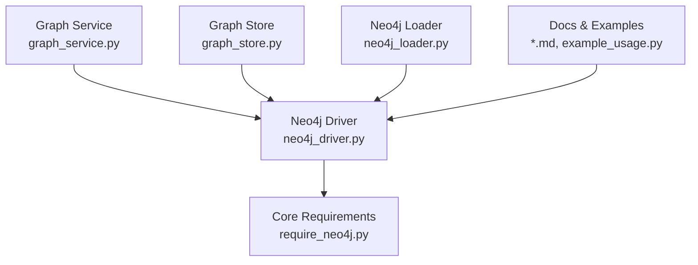

# Neo4j Driver Implementation

<cite>
**Referenced Files in This Document**
- [neo4j_driver.py](file://code-tiny/tools/graph/driver/neo4j_driver.py)
- [require_neo4j.py](file://code-tiny/tools/graph/core/require_neo4j.py)
- [graph_service.py](file://code-tiny/mcp/services/graph_service.py)
- [graph_store.py](file://doc-tiny/graph_store.py)
- [neo4j_loader.py](file://doc-tiny/neo4j_loader.py)
- [example_usage.py](file://code-tiny/tools/graph/examples/example_usage.py)
- [IMPLEMENTATION_SUMMARY.md](file://code-tiny/tools/graph/docs/IMPLEMENTATION_SUMMARY.md)
- [QUICK_REFERENCE.md](file://code-tiny/tools/graph/docs/QUICK_REFERENCE.md)
- [QUERY_METHODS.md](file://code-tiny/tools/graph/docs/QUERY_METHODS.md)
</cite>

## Table of Contents
1. [Introduction](#introduction)
2. [Project Structure](#project-structure)
3. [Core Components](#core-components)
4. [Architecture Overview](#architecture-overview)
5. [Detailed Component Analysis](#detailed-component-analysis)
6. [Dependency Analysis](#dependency-analysis)
7. [Performance Considerations](#performance-considerations)
8. [Troubleshooting Guide](#troubleshooting-guide)
9. [Conclusion](#conclusion)
10. [Appendices](#appendices)

## Introduction
This document explains the Neo4j graph database driver implementation within Cortex Harness. It covers connection management (including pooling and SSL/TLS), authentication methods, transaction handling, Cypher query execution patterns, result processing, performance optimization techniques, error handling and retry strategies, monitoring and debugging, and practical examples for common operations such as node creation, relationship establishment, and complex traversals. The goal is to provide both a high-level understanding and actionable guidance for developers integrating or extending the Neo4j integration.

## Project Structure
The Neo4j integration spans several modules:
- Driver layer: core connectivity, configuration, and session management
- Core utilities: requirement checks and environment setup
- MCP services: higher-level graph operations exposed via MCP
- Documentation and examples: quick references and usage samples

**Diagram sources**
- [neo4j_driver.py](file://code-tiny/tools/graph/driver/neo4j_driver.py)
- [require_neo4j.py](file://code-tiny/tools/graph/core/require_neo4j.py)
- [graph_service.py](file://code-tiny/mcp/services/graph_service.py)
- [graph_store.py](file://doc-tiny/graph_store.py)
- [neo4j_loader.py](file://doc-tiny/neo4j_loader.py)
- [IMPLEMENTATION_SUMMARY.md](file://code-tiny/tools/graph/docs/IMPLEMENTATION_SUMMARY.md)
- [QUICK_REFERENCE.md](file://code-tiny/tools/graph/docs/QUICK_REFERENCE.md)
- [QUERY_METHODS.md](file://code-tiny/tools/graph/docs/QUERY_METHODS.md)
- [example_usage.py](file://code-tiny/tools/graph/examples/example_usage.py)

**Section sources**
- [neo4j_driver.py](file://code-tiny/tools/graph/driver/neo4j_driver.py)
- [require_neo4j.py](file://code-tiny/tools/graph/core/require_neo4j.py)
- [graph_service.py](file://code-tiny/mcp/services/graph_service.py)
- [graph_store.py](file://doc-tiny/graph_store.py)
- [neo4j_loader.py](file://doc-tiny/neo4j_loader.py)
- [IMPLEMENTATION_SUMMARY.md](file://code-tiny/tools/graph/docs/IMPLEMENTATION_SUMMARY.md)
- [QUICK_REFERENCE.md](file://code-tiny/tools/graph/docs/QUICK_REFERENCE.md)
- [QUERY_METHODS.md](file://code-tiny/tools/graph/docs/QUERY_METHODS.md)
- [example_usage.py](file://code-tiny/tools/graph/examples/example_usage.py)

## Core Components
- Neo4j Driver: encapsulates connection lifecycle, configuration, session acquisition, transaction boundaries, and Cypher execution. It centralizes authentication options and TLS settings.
- Core Requirements: validates environment prerequisites and provides helper functions to ensure Neo4j client libraries are available.
- Graph Service (MCP): exposes graph operations through MCP endpoints, delegating to the driver for data access.
- Doc-Tiny Integration: uses the driver for loading and storing graph data in doc-tiny workflows.
- Docs and Examples: provide quick references, method summaries, and example usage patterns.

Key responsibilities:
- Connection management: pool initialization, reuse, and teardown
- Authentication: username/password, JWT, certificates
- SSL/TLS: secure transport configuration
- Transactions: explicit transaction blocks with commit/rollback semantics
- Query execution: parameterized Cypher calls and result iteration
- Error handling: retries, timeouts, and structured error propagation

**Section sources**
- [neo4j_driver.py](file://code-tiny/tools/graph/driver/neo4j_driver.py)
- [require_neo4j.py](file://code-tiny/tools/graph/core/require_neo4j.py)
- [graph_service.py](file://code-tiny/mcp/services/graph_service.py)
- [graph_store.py](file://doc-tiny/graph_store.py)
- [neo4j_loader.py](file://doc-tiny/neo4j_loader.py)
- [IMPLEMENTATION_SUMMARY.md](file://code-tiny/tools/graph/docs/IMPLEMENTATION_SUMMARY.md)
- [QUICK_REFERENCE.md](file://code-tiny/tools/graph/docs/QUICK_REFERENCE.md)
- [QUERY_METHODS.md](file://code-tiny/tools/graph/docs/QUERY_METHODS.md)
- [example_usage.py](file://code-tiny/tools/graph/examples/example_usage.py)

## Architecture Overview
The architecture layers separate concerns between MCP service orchestration, driver connectivity, and application-specific loaders/stores.

**Diagram sources**
- [graph_service.py](file://code-tiny/mcp/services/graph_service.py)
- [neo4j_driver.py](file://code-tiny/tools/graph/driver/neo4j_driver.py)

## Detailed Component Analysis

### Neo4j Driver
Responsibilities:
- Configuration parsing (URI, auth, TLS)
- Pool initialization and session management
- Transactional execution wrappers
- Parameterized Cypher execution and result processing
- Error mapping and retry logic

Operational notes:
- Authentication supports multiple methods; selection depends on configuration.
- TLS configuration is applied at connection time using provided options.
- Transactions wrap multiple queries to ensure consistency.
- Results are processed iteratively to minimize memory footprint.

**Diagram sources**
- [neo4j_driver.py](file://code-tiny/tools/graph/driver/neo4j_driver.py)

**Section sources**
- [neo4j_driver.py](file://code-tiny/tools/graph/driver/neo4j_driver.py)

### Core Requirements
Responsibilities:
- Validate presence of Neo4j client libraries
- Provide helper functions for environment checks
- Raise informative errors when dependencies are missing

Usage:
- Called during driver initialization to ensure runtime readiness
- Used by tests and scripts to bootstrap environments

**Section sources**
- [require_neo4j.py](file://code-tiny/tools/graph/core/require_neo4j.py)

### Graph Service (MCP)
Responsibilities:
- Expose graph operations via MCP endpoints
- Delegate to the driver for data access
- Map MCP requests to driver methods and format responses

Typical flow:
- Receive request
- Validate inputs
- Acquire session from driver
- Execute transactional operations
- Return structured results

**Section sources**
- [graph_service.py](file://code-tiny/mcp/services/graph_service.py)

### Doc-Tiny Integration
Responsibilities:
- Use the driver to load and store graph data
- Integrate with doc-tiny pipelines for ingestion and retrieval

Integration points:
- Graph store abstraction over the driver
- Loader utilities for batch operations

**Section sources**
- [graph_store.py](file://doc-tiny/graph_store.py)
- [neo4j_loader.py](file://doc-tiny/neo4j_loader.py)

### Examples and Quick References
- Example usage demonstrates common operations like creating nodes, establishing relationships, and performing traversals.
- Quick reference summarizes key methods and parameters.
- Query methods documentation outlines supported Cypher patterns and best practices.

**Section sources**
- [example_usage.py](file://code-tiny/tools/graph/examples/example_usage.py)
- [QUICK_REFERENCE.md](file://code-tiny/tools/graph/docs/QUICK_REFERENCE.md)
- [QUERY_METHODS.md](file://code-tiny/tools/graph/docs/QUERY_METHODS.md)
- [IMPLEMENTATION_SUMMARY.md](file://code-tiny/tools/graph/docs/IMPLEMENTATION_SUMMARY.md)

## Dependency Analysis
The driver depends on the Neo4j client library and is used by MCP services and doc-tiny integrations.

**Diagram sources**
- [neo4j_driver.py](file://code-tiny/tools/graph/driver/neo4j_driver.py)
- [require_neo4j.py](file://code-tiny/tools/graph/core/require_neo4j.py)
- [graph_service.py](file://code-tiny/mcp/services/graph_service.py)
- [graph_store.py](file://doc-tiny/graph_store.py)
- [neo4j_loader.py](file://doc-tiny/neo4j_loader.py)
- [IMPLEMENTATION_SUMMARY.md](file://code-tiny/tools/graph/docs/IMPLEMENTATION_SUMMARY.md)
- [QUICK_REFERENCE.md](file://code-tiny/tools/graph/docs/QUICK_REFERENCE.md)
- [QUERY_METHODS.md](file://code-tiny/tools/graph/docs/QUERY_METHODS.md)
- [example_usage.py](file://code-tiny/tools/graph/examples/example_usage.py)

**Section sources**
- [neo4j_driver.py](file://code-tiny/tools/graph/driver/neo4j_driver.py)
- [require_neo4j.py](file://code-tiny/tools/graph/core/require_neo4j.py)
- [graph_service.py](file://code-tiny/mcp/services/graph_service.py)
- [graph_store.py](file://doc-tiny/graph_store.py)
- [neo4j_loader.py](file://doc-tiny/neo4j_loader.py)
- [IMPLEMENTATION_SUMMARY.md](file://code-tiny/tools/graph/docs/IMPLEMENTATION_SUMMARY.md)
- [QUICK_REFERENCE.md](file://code-tiny/tools/graph/docs/QUICK_REFERENCE.md)
- [QUERY_METHODS.md](file://code-tiny/tools/graph/docs/QUERY_METHODS.md)
- [example_usage.py](file://code-tiny/tools/graph/examples/example_usage.py)

## Performance Considerations
- Connection pooling: configure pool size based on expected concurrency; reuse sessions to reduce overhead.
- Query batching: group writes into transactions to minimize round-trips and improve throughput.
- Memory management: stream large result sets instead of materializing entire graphs in memory.
- Indexes and constraints: ensure appropriate indexes exist for frequently queried properties.
- Timeouts: set sensible read/write timeouts to avoid long-running queries blocking resources.
- Metrics: collect latency, throughput, and error rates around driver calls for observability.

[No sources needed since this section provides general guidance]

## Troubleshooting Guide
Common issues and resolutions:
- Connectivity failures: verify URI, network reachability, firewall rules, and credentials.
- Authentication errors: confirm selected auth method matches server configuration (username/password, JWT, certificates).
- TLS handshake problems: validate certificate paths and trust stores; ensure server TLS settings align with client options.
- Query timeouts: review query complexity, add indexes, and adjust timeout values if necessary.
- Resource exhaustion: monitor pool utilization; increase pool size or optimize queries to prevent saturation.
- Retry behavior: inspect retry policies and backoff strategies; tune max retries and intervals.

Diagnostic steps:
- Enable detailed logging around driver initialization and query execution.
- Capture stack traces for exceptions and correlate with server logs.
- Validate environment prerequisites using core requirements helpers.

**Section sources**
- [neo4j_driver.py](file://code-tiny/tools/graph/driver/neo4j_driver.py)
- [require_neo4j.py](file://code-tiny/tools/graph/core/require_neo4j.py)
- [graph_service.py](file://code-tiny/mcp/services/graph_service.py)
- [graph_store.py](file://doc-tiny/graph_store.py)
- [neo4j_loader.py](file://doc-tiny/neo4j_loader.py)
- [IMPLEMENTATION_SUMMARY.md](file://code-tiny/tools/graph/docs/IMPLEMENTATION_SUMMARY.md)
- [QUICK_REFERENCE.md](file://code-tiny/tools/graph/docs/QUICK_REFERENCE.md)
- [QUERY_METHODS.md](file://code-tiny/tools/graph/docs/QUERY_METHODS.md)
- [example_usage.py](file://code-tiny/tools/graph/examples/example_usage.py)

## Conclusion
The Neo4j driver in Cortex Harness provides a robust foundation for secure, efficient graph operations. By leveraging connection pooling, flexible authentication, and transactional execution, it supports scalable and reliable graph workloads. Following the performance and troubleshooting recommendations will help maintain stability and responsiveness under varying loads.

[No sources needed since this section summarizes without analyzing specific files]

## Appendices

### Practical Examples
- Node creation: use parameterized Cypher to insert nodes with labels and properties.
- Relationship establishment: create directed edges with typed relationships and properties.
- Complex traversals: compose multi-hop queries with filters and aggregations.

For concrete patterns and sample calls, refer to the example usage and query methods documentation.

**Section sources**
- [example_usage.py](file://code-tiny/tools/graph/examples/example_usage.py)
- [QUERY_METHODS.md](file://code-tiny/tools/graph/docs/QUERY_METHODS.md)
- [QUICK_REFERENCE.md](file://code-tiny/tools/graph/docs/QUICK_REFERENCE.md)