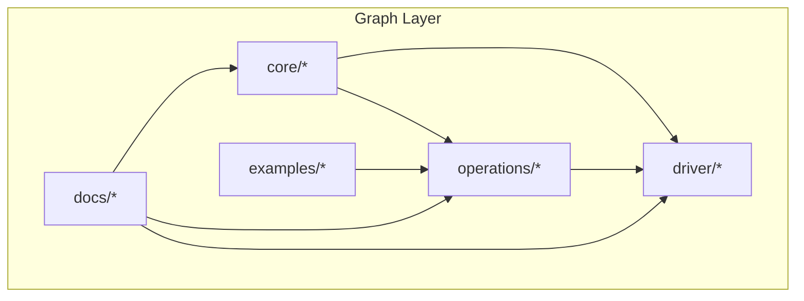
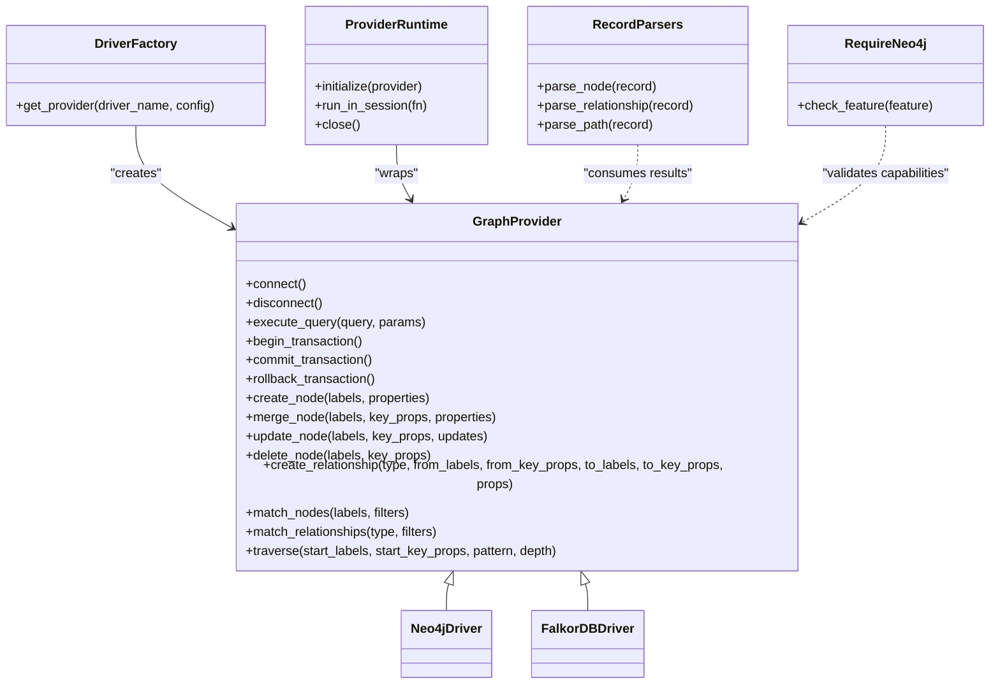
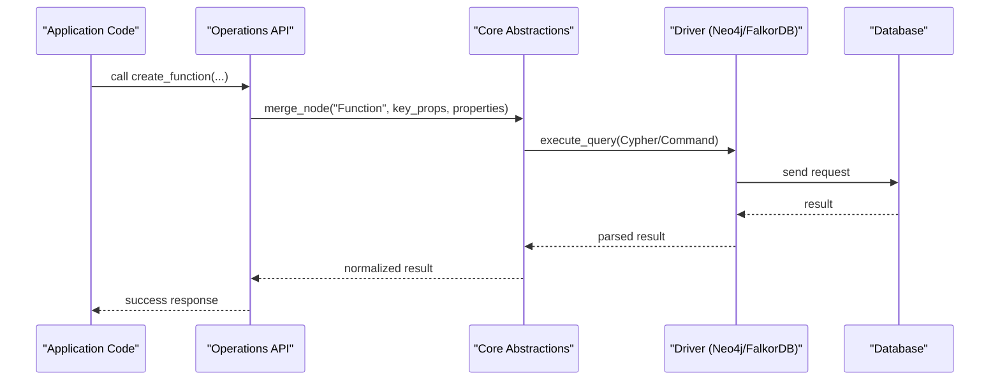
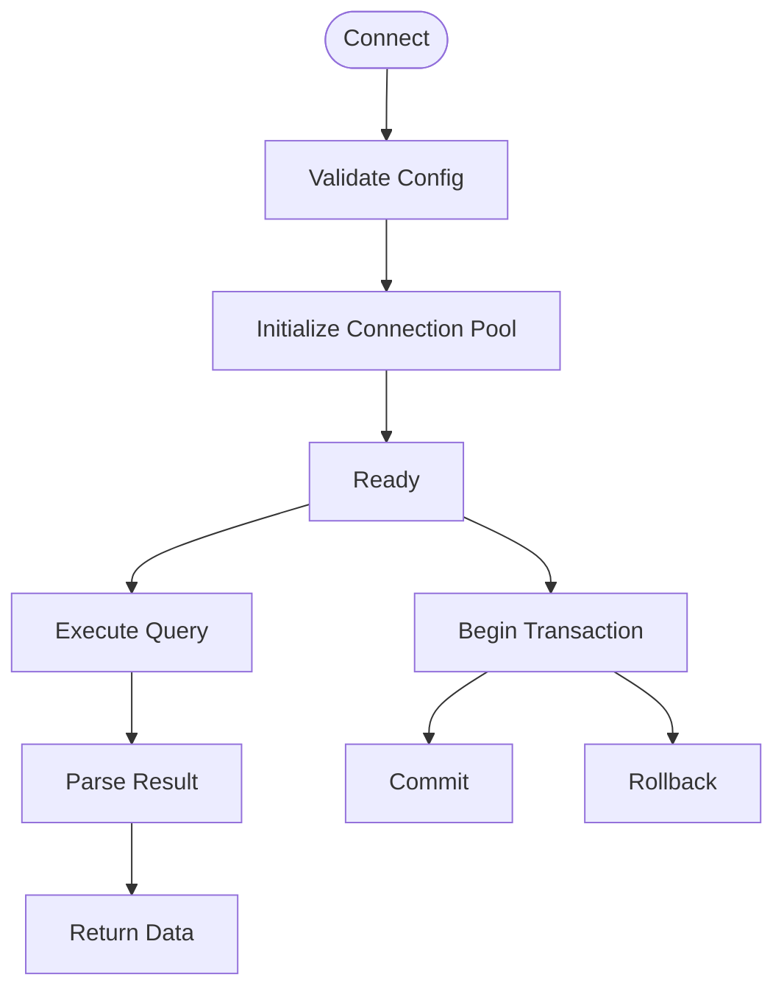
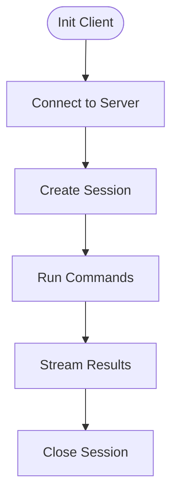
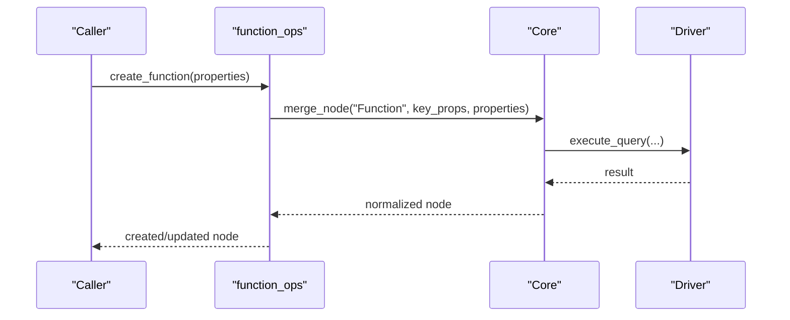
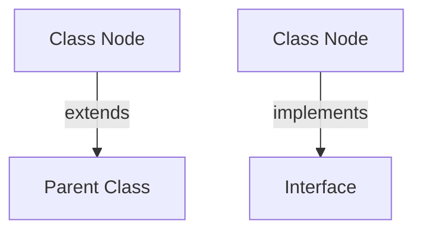
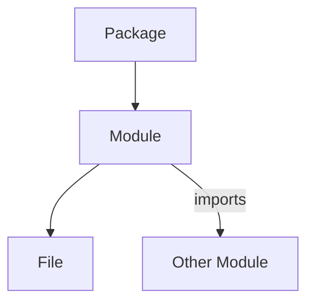
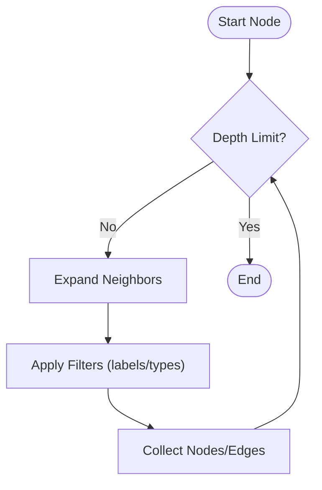
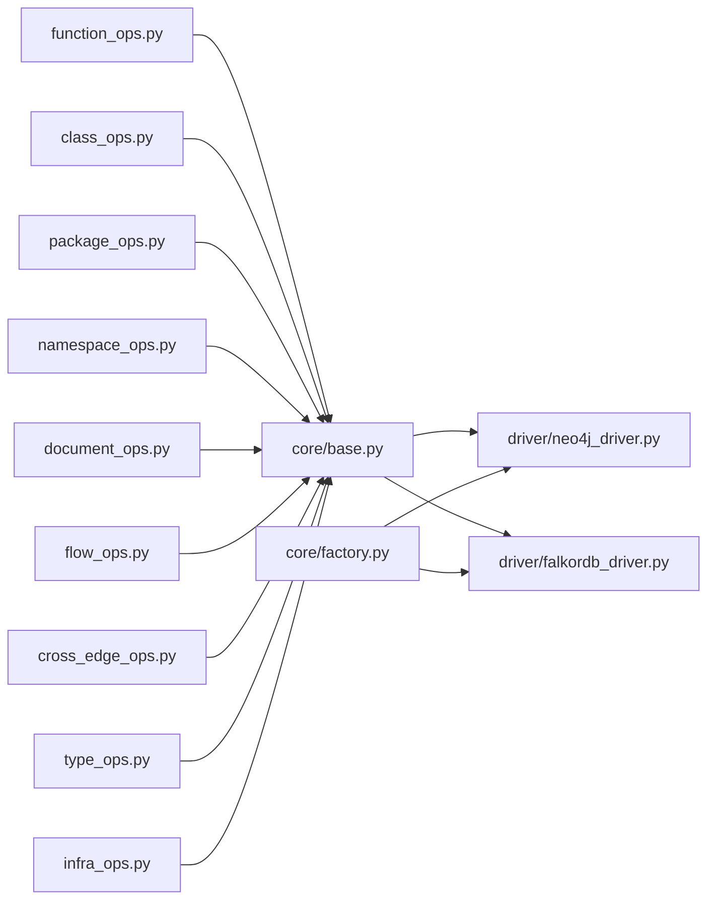

# Graph Operations & Schema

<cite>
**Referenced Files in This Document**
- [graph/__init__.py](file://code-tiny/tools/graph/__init__.py)
- [core/base.py](file://code-tiny/tools/graph/core/base.py)
- [core/factory.py](file://code-tiny/tools/graph/core/factory.py)
- [core/provider_runtime.py](file://code-tiny/tools/graph/core/provider_runtime.py)
- [core/record_parsers.py](file://code-tiny/tools/graph/core/record_parsers.py)
- [core/require_neo4j.py](file://code-tiny/tools/graph/core/require_neo4j.py)
- [driver/neo4j_driver.py](file://code-tiny/tools/graph/driver/neo4j_driver.py)
- [driver/falkordb_driver.py](file://code-tiny/tools/graph/driver/falkordb_driver.py)
- [operations/function_ops.py](file://code-tiny/tools/graph/operations/function_ops.py)
- [operations/class_ops.py](file://code-tiny/tools/graph/operations/class_ops.py)
- [operations/package_ops.py](file://code-tiny/tools/graph/operations/package_ops.py)
- [operations/namespace_ops.py](file://code-tiny/tools/graph/operations/namespace_ops.py)
- [operations/document_ops.py](file://code-tiny/tools/graph/operations/document_ops.py)
- [operations/flow_ops.py](file://code-tiny/tools/graph/operations/flow_ops.py)
- [operations/cross_edge_ops.py](file://code-tiny/tools/graph/operations/cross_edge_ops.py)
- [operations/type_ops.py](file://code-tiny/tools/graph/operations/type_ops.py)
- [operations/infra_ops.py](file://code-tiny/tools/graph/operations/infra_ops.py)
- [STRUCTURE.md](file://code-tiny/tools/graph/STRUCTURE.md)
- [docs/README.md](file://code-tiny/tools/graph/docs/README.md)
- [docs/QUICK_REFERENCE.md](file://code-tiny/tools/graph/docs/QUICK_REFERENCE.md)
- [docs/QUERY_METHODS.md](file://code-tiny/tools/graph/docs/QUERY_METHODS.md)
- [docs/IMPLEMENTATION_SUMMARY.md](file://code-tiny/tools/graph/docs/IMPLEMENTATION_SUMMARY.md)
- [docs/MIGRATION_GUIDE.py](file://code-tiny/tools/graph/docs/MIGRATION_GUIDE.py)
- [examples/example_usage.py](file://code-tiny/tools/graph/examples/example_usage.py)
</cite>

## Table of Contents
1. [Introduction](#introduction)
2. [Project Structure](#project-structure)
3. [Core Components](#core-components)
4. [Architecture Overview](#architecture-overview)
5. [Detailed Component Analysis](#detailed-component-analysis)
6. [Dependency Analysis](#dependency-analysis)
7. [Performance Considerations](#performance-considerations)
8. [Troubleshooting Guide](#troubleshooting-guide)
9. [Conclusion](#conclusion)
10. [Appendices](#appendices)

## Introduction
This document describes the graph operations and schema for Cortex Harness’s graph database layer. It covers the abstract graph schema (node types, edge relationships, metadata), driver implementations for Neo4j and FalkorDB, CRUD APIs, traversal patterns for code analysis, Cypher examples, indexing strategies, backup and migration procedures, scalability considerations, and distributed deployment patterns. The goal is to provide a comprehensive reference for both developers integrating with the graph layer and operators managing its runtime.

## Project Structure
The graph subsystem is organized under tools/graph with clear separation between core abstractions, drivers, operations, documentation, and examples:
- core: Abstract interfaces, factory, provider runtime, record parsers, and Neo4j requirement utilities
- driver: Concrete database drivers (Neo4j, FalkorDB)
- operations: High-level APIs grouped by domain (functions, classes, packages, namespaces, documents, flows, cross edges, types, infra)
- docs: Implementation notes, quick references, query methods, and migration guides
- examples: Usage examples demonstrating common workflows

**Diagram sources**
- [core/base.py](file://code-tiny/tools/graph/core/base.py)
- [driver/neo4j_driver.py](file://code-tiny/tools/graph/driver/neo4j_driver.py)
- [driver/falkordb_driver.py](file://code-tiny/tools/graph/driver/falkordb_driver.py)
- [operations/function_ops.py](file://code-tiny/tools/graph/operations/function_ops.py)
- [docs/README.md](file://code-tiny/tools/graph/docs/README.md)
- [examples/example_usage.py](file://code-tiny/tools/graph/examples/example_usage.py)

**Section sources**
- [STRUCTURE.md](file://code-tiny/tools/graph/STRUCTURE.md)
- [docs/README.md](file://code-tiny/tools/graph/docs/README.md)

## Core Components
The core layer defines the abstraction over graph providers and provides utilities for parsing records and enforcing requirements.

Key responsibilities:
- Abstract interface for graph providers
- Factory for selecting and instantiating drivers
- Provider runtime for lifecycle management
- Record parsers for consistent node/edge representation
- Requirement checks (e.g., Neo4j-specific features)

**Diagram sources**
- [core/base.py](file://code-tiny/tools/graph/core/base.py)
- [core/factory.py](file://code-tiny/tools/graph/core/factory.py)
- [core/provider_runtime.py](file://code-tiny/tools/graph/core/provider_runtime.py)
- [core/record_parsers.py](file://code-tiny/tools/graph/core/record_parsers.py)
- [core/require_neo4j.py](file://code-tiny/tools/graph/core/require_neo4j.py)
- [driver/neo4j_driver.py](file://code-tiny/tools/graph/driver/neo4j_driver.py)
- [driver/falkordb_driver.py](file://code-tiny/tools/graph/driver/falkordb_driver.py)

**Section sources**
- [core/base.py](file://code-tiny/tools/graph/core/base.py)
- [core/factory.py](file://code-tiny/tools/graph/core/factory.py)
- [core/provider_runtime.py](file://code-tiny/tools/graph/core/provider_runtime.py)
- [core/record_parsers.py](file://code-tiny/tools/graph/core/record_parsers.py)
- [core/require_neo4j.py](file://code-tiny/tools/graph/core/require_neo4j.py)

## Architecture Overview
The architecture separates concerns across layers:
- Abstraction layer (core): Defines contracts and shared utilities
- Driver layer: Implements concrete connectivity and query execution for each backend
- Operations layer: Encapsulates domain-specific graph operations using the abstraction
- Documentation and examples: Provide guidance and usage patterns

**Diagram sources**
- [operations/function_ops.py](file://code-tiny/tools/graph/operations/function_ops.py)
- [core/base.py](file://code-tiny/tools/graph/core/base.py)
- [driver/neo4j_driver.py](file://code-tiny/tools/graph/driver/neo4j_driver.py)
- [driver/falkordb_driver.py](file://code-tiny/tools/graph/driver/falkordb_driver.py)

## Detailed Component Analysis

### Abstract Graph Schema
Node types:
- Function: Represents executable units within modules or files
- Class: Represents type definitions and their hierarchy
- Module: Logical grouping of related code elements
- File: Physical source file nodes
- Symbol: General symbol entries (variables, constants, etc.)

Edge relationships:
- imports: Dependency between modules/files/symbols
- calls: Invocation relationships between functions/methods
- extends: Inheritance relationships between classes
- implements: Interface implementation relationships

Metadata attributes:
- identifiers: Unique IDs per node type
- names: Human-readable labels
- locations: File paths and line/column ranges
- languages/frameworks: Contextual tags
- timestamps: Creation/update times
- confidence scores: For inferred relationships

Indexing strategy:
- Primary keys per node type for fast merges
- Label-based indexes for common queries
- Property indexes on frequently filtered fields (name, path, language)

Backup and restore:
- Use native backups for Neo4j
- Export/import scripts for FalkorDB-compatible formats
- Ensure transactional consistency during snapshots

Migration between backends:
- Normalize node/edge schemas
- Map relationship semantics across drivers
- Validate data integrity post-migration

**Section sources**
- [docs/IMPLEMENTATION_SUMMARY.md](file://code-tiny/tools/graph/docs/IMPLEMENTATION_SUMMARY.md)
- [docs/QUERY_METHODS.md](file://code-tiny/tools/graph/docs/QUERY_METHODS.md)

### Driver Implementations

#### Neo4j Driver
- Connection management: Pooling, retry, and timeout configuration
- Query optimization: Parameterized queries, index hints, pagination
- Transaction handling: Begin/commit/rollback with error recovery
- Feature gating: Neo4j-specific features via requirement checks

**Diagram sources**
- [driver/neo4j_driver.py](file://code-tiny/tools/graph/driver/neo4j_driver.py)
- [core/require_neo4j.py](file://code-tiny/tools/graph/core/require_neo4j.py)

**Section sources**
- [driver/neo4j_driver.py](file://code-tiny/tools/graph/driver/neo4j_driver.py)
- [core/require_neo4j.py](file://code-tiny/tools/graph/core/require_neo4j.py)

#### FalkorDB Driver
- Connection management: Client initialization and session reuse
- Query optimization: Command batching and streaming responses
- Transaction handling: Atomic command groups where supported
- Compatibility layer: Normalizes differences from Neo4j semantics

**Diagram sources**
- [driver/falkordb_driver.py](file://code-tiny/tools/graph/driver/falkordb_driver.py)

**Section sources**
- [driver/falkordb_driver.py](file://code-tiny/tools/graph/driver/falkordb_driver.py)

### Graph Operation APIs

#### Functions
- Create function nodes with identifiers, names, and locations
- Merge functions by unique keys to avoid duplicates
- Update function metadata incrementally
- Delete functions by key and label set

**Diagram sources**
- [operations/function_ops.py](file://code-tiny/tools/graph/operations/function_ops.py)
- [core/base.py](file://code-tiny/tools/graph/core/base.py)
- [driver/neo4j_driver.py](file://code-tiny/tools/graph/driver/neo4j_driver.py)

**Section sources**
- [operations/function_ops.py](file://code-tiny/tools/graph/operations/function_ops.py)

#### Classes
- Create and merge class nodes with inheritance metadata
- Link extends relationships between classes
- Track interface implementations via implements edges

**Diagram sources**
- [operations/class_ops.py](file://code-tiny/tools/graph/operations/class_ops.py)

**Section sources**
- [operations/class_ops.py](file://code-tiny/tools/graph/operations/class_ops.py)

#### Packages and Modules
- Manage package/module hierarchies
- Establish imports between modules/packages
- Maintain file-to-module associations

**Diagram sources**
- [operations/package_ops.py](file://code-tiny/tools/graph/operations/package_ops.py)
- [operations/namespace_ops.py](file://code-tiny/tools/graph/operations/namespace_ops.py)

**Section sources**
- [operations/package_ops.py](file://code-tiny/tools/graph/operations/package_ops.py)
- [operations/namespace_ops.py](file://code-tiny/tools/graph/operations/namespace_ops.py)

#### Documents and Symbols
- Index symbols with contextual metadata
- Associate symbols with files and modules
- Support search and retrieval through property filters

**Section sources**
- [operations/document_ops.py](file://code-tiny/tools/graph/operations/document_ops.py)

#### Flow and Cross-Edge Operations
- Build call graphs linking functions/methods
- Capture cross-language or cross-framework dependencies
- Annotate edges with confidence and provenance

**Section sources**
- [operations/flow_ops.py](file://code-tiny/tools/graph/operations/flow_ops.py)
- [operations/cross_edge_ops.py](file://code-tiny/tools/graph/operations/cross_edge_ops.py)

#### Type Operations
- Represent type definitions and relationships
- Link types to classes and symbols
- Support generic and parameterized types

**Section sources**
- [operations/type_ops.py](file://code-tiny/tools/graph/operations/type_ops.py)

#### Infrastructure Operations
- Manage project and repository nodes
- Track scan states and incremental sync markers
- Provide utility operations for graph maintenance

**Section sources**
- [operations/infra_ops.py](file://code-tiny/tools/graph/operations/infra_ops.py)

### Traversal Patterns for Code Analysis
Common traversal patterns:
- Dependency chains: Follow imports across modules/files to map build-time dependencies
- Call graphs: Traverse calls between functions/methods to understand runtime behavior
- Impact analysis: Propagate changes from modified nodes to affected callers and dependents

**Diagram sources**
- [core/base.py](file://code-tiny/tools/graph/core/base.py)
- [operations/flow_ops.py](file://code-tiny/tools/graph/operations/flow_ops.py)

**Section sources**
- [operations/flow_ops.py](file://code-tiny/tools/graph/operations/flow_ops.py)

### Cypher Query Examples
Examples for direct database access:
- Find all functions imported by a module
- Retrieve call chains up to N hops
- Identify classes implementing an interface
- Compute impact sets for a changed function

Note: Use these patterns via the driver when necessary; prefer operation APIs for portability.

**Section sources**
- [docs/QUERY_METHODS.md](file://code-tiny/tools/graph/docs/QUERY_METHODS.md)

### Performance Optimization Techniques
- Use merge operations to reduce duplicate writes
- Batch transactions for bulk ingestion
- Leverage indexes on primary keys and frequent filters
- Paginate large traversals to avoid memory spikes
- Prefer parameterized queries to prevent plan cache thrashing

**Section sources**
- [docs/QUERY_METHODS.md](file://code-tiny/tools/graph/docs/QUERY_METHODS.md)
- [driver/neo4j_driver.py](file://code-tiny/tools/graph/driver/neo4j_driver.py)
- [driver/falkordb_driver.py](file://code-tiny/tools/graph/driver/falkordb_driver.py)

### Indexing Strategies
- Label indexes for node discovery
- Property indexes on identifiers and names
- Composite indexes for multi-field filters (e.g., language + name)
- Periodic reindexing after large migrations

**Section sources**
- [docs/QUERY_METHODS.md](file://code-tiny/tools/graph/docs/QUERY_METHODS.md)

### Backup Procedures
- Neo4j: Use native backup tooling for consistent snapshots
- FalkorDB: Export datasets and import into target environments
- Validate checksums and schema compatibility post-backup

**Section sources**
- [docs/IMPLEMENTATION_SUMMARY.md](file://code-tiny/tools/graph/docs/IMPLEMENTATION_SUMMARY.md)

### Migration Between Backends
- Normalize schemas to abstract model
- Map relationship semantics across drivers
- Execute migration scripts and validate counts
- Rollback plan if inconsistencies detected

**Section sources**
- [docs/MIGRATION_GUIDE.py](file://code-tiny/tools/graph/docs/MIGRATION_GUIDE.py)

### Scalability and Distributed Deployment
- Horizontal scaling via read replicas for query-heavy workloads
- Sharding by project or namespace for very large graphs
- Connection pooling and rate limiting at the driver level
- Consistency models: eventual vs strong depending on use case

[No sources needed since this section provides general guidance]

## Dependency Analysis
The operations layer depends on core abstractions, which in turn depend on specific drivers. The factory selects the appropriate driver based on configuration.

**Diagram sources**
- [operations/function_ops.py](file://code-tiny/tools/graph/operations/function_ops.py)
- [operations/class_ops.py](file://code-tiny/tools/graph/operations/class_ops.py)
- [operations/package_ops.py](file://code-tiny/tools/graph/operations/package_ops.py)
- [operations/namespace_ops.py](file://code-tiny/tools/graph/operations/namespace_ops.py)
- [operations/document_ops.py](file://code-tiny/tools/graph/operations/document_ops.py)
- [operations/flow_ops.py](file://code-tiny/tools/graph/operations/flow_ops.py)
- [operations/cross_edge_ops.py](file://code-tiny/tools/graph/operations/cross_edge_ops.py)
- [operations/type_ops.py](file://code-tiny/tools/graph/operations/type_ops.py)
- [operations/infra_ops.py](file://code-tiny/tools/graph/operations/infra_ops.py)
- [core/base.py](file://code-tiny/tools/graph/core/base.py)
- [core/factory.py](file://code-tiny/tools/graph/core/factory.py)
- [driver/neo4j_driver.py](file://code-tiny/tools/graph/driver/neo4j_driver.py)
- [driver/falkordb_driver.py](file://code-tiny/tools/graph/driver/falkordb_driver.py)

**Section sources**
- [core/base.py](file://code-tiny/tools/graph/core/base.py)
- [core/factory.py](file://code-tiny/tools/graph/core/factory.py)
- [driver/neo4j_driver.py](file://code-tiny/tools/graph/driver/neo4j_driver.py)
- [driver/falkordb_driver.py](file://code-tiny/tools/graph/driver/falkordb_driver.py)

## Performance Considerations
- Prefer batched writes and transactions for ingestion
- Use merge semantics to minimize redundant updates
- Apply selective filters early in traversals
- Monitor query plans and adjust indexes accordingly
- Avoid deep unbounded traversals; enforce depth limits

[No sources needed since this section provides general guidance]

## Troubleshooting Guide
Common issues and resolutions:
- Connection failures: Verify credentials, network reachability, and pool settings
- Query timeouts: Increase timeouts or optimize queries with proper indexes
- Transaction errors: Retry with backoff; ensure idempotent operations
- Schema mismatches: Validate node labels and property keys before writes
- Feature availability: Use requirement checks to gate Neo4j-specific features

**Section sources**
- [core/require_neo4j.py](file://code-tiny/tools/graph/core/require_neo4j.py)
- [driver/neo4j_driver.py](file://code-tiny/tools/graph/driver/neo4j_driver.py)
- [driver/falkordb_driver.py](file://code-tiny/tools/graph/driver/falkordb_driver.py)

## Conclusion
Cortex Harness’s graph layer provides a robust abstraction over multiple database backends, enabling consistent graph operations across Neo4j and FalkorDB. By following the documented schema, leveraging optimized traversal patterns, and applying recommended performance and operational practices, teams can build scalable code analysis pipelines and maintain high-quality graph data.

[No sources needed since this section summarizes without analyzing specific files]

## Appendices

### Quick Reference
- API entry points are exposed via operations modules
- Use the factory to obtain a configured provider instance
- Refer to examples for end-to-end workflows

**Section sources**
- [docs/QUICK_REFERENCE.md](file://code-tiny/tools/graph/docs/QUICK_REFERENCE.md)
- [examples/example_usage.py](file://code-tiny/tools/graph/examples/example_usage.py)