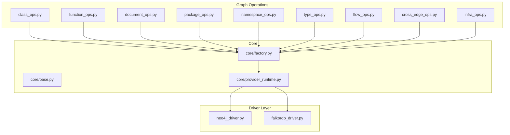
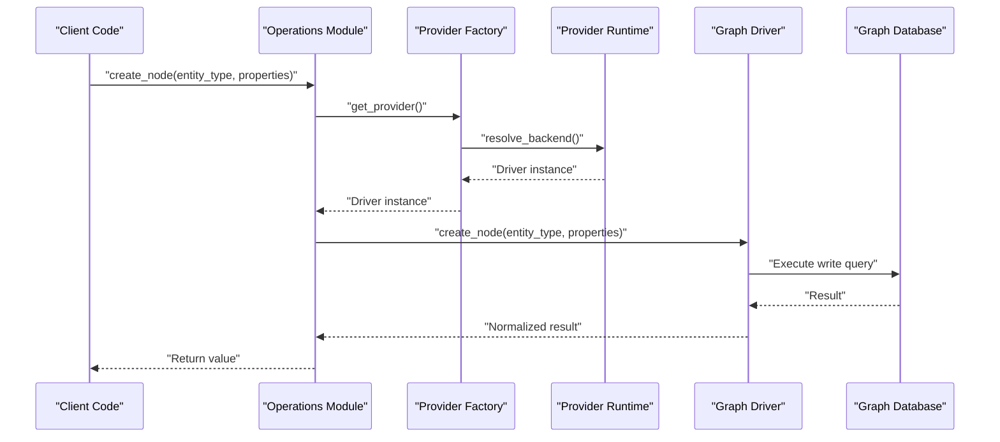
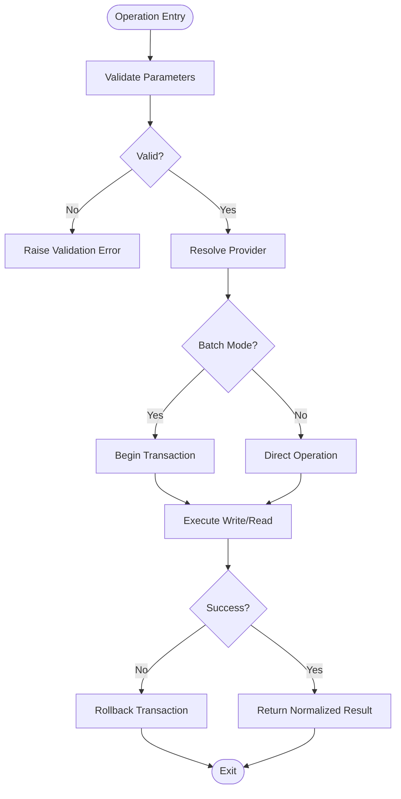
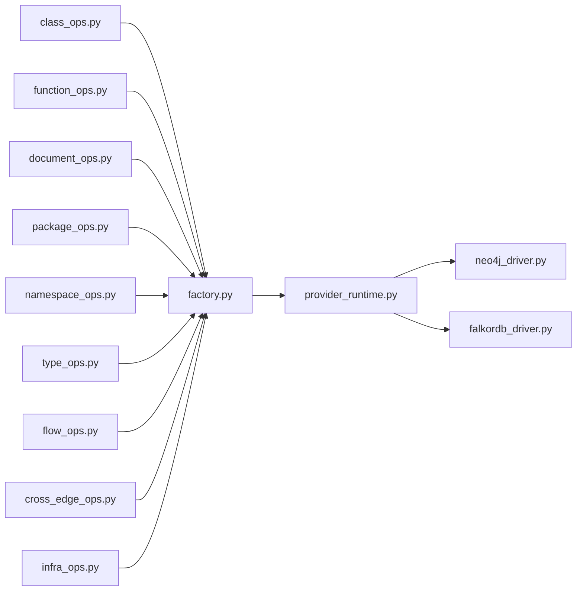

# CRUD Operations

<cite>
**Referenced Files in This Document**
- [operations/class_ops.py](file://code-tiny/tools/graph/operations/class_ops.py)
- [operations/function_ops.py](file://code-tiny/tools/graph/operations/function_ops.py)
- [operations/document_ops.py](file://code-tiny/tools/graph/operations/document_ops.py)
- [operations/package_ops.py](file://code-tiny/tools/graph/operations/package_ops.py)
- [operations/namespace_ops.py](file://code-tiny/tools/graph/operations/namespace_ops.py)
- [operations/type_ops.py](file://code-tiny/tools/graph/operations/type_ops.py)
- [operations/flow_ops.py](file://code-tiny/tools/graph/operations/flow_ops.py)
- [operations/cross_edge_ops.py](file://code-tiny/tools/graph/operations/cross_edge_ops.py)
- [operations/infra_ops.py](file://code-tiny/tools/graph/operations/infra_ops.py)
- [driver/falkordb_driver.py](file://code-tiny/tools/graph/driver/falkordb_driver.py)
- [driver/neo4j_driver.py](file://code-tiny/tools/graph/driver/neo4j_driver.py)
- [core/base.py](file://code-tiny/tools/graph/core/base.py)
- [core/factory.py](file://code-tiny/tools/graph/core/factory.py)
- [core/provider_runtime.py](file://code-tiny/tools/graph/core/provider_runtime.py)
- [__init__.py](file://code-tiny/tools/graph/__init__.py)
- [STRUCTURE.md](file://code-tiny/tools/graph/STRUCTURE.md)
- [QUICK_REFERENCE.md](file://code-tiny/tools/graph/docs/QUICK_REFERENCE.md)
- [QUERY_METHODS.md](file://code-tiny/tools/graph/docs/QUERY_METHODS.md)
- [setup_graph_project.py](file://code-tiny/scripts/setup_graph_project.py)
- [6_setup_indexes.py](file://doc-tiny/6_setup_indexes.py)
</cite>

## Table of Contents
1. [Introduction](#introduction)
2. [Project Structure](#project-structure)
3. [Core Components](#core-components)
4. [Architecture Overview](#architecture-overview)
5. [Detailed Component Analysis](#detailed-component-analysis)
6. [Dependency Analysis](#dependency-analysis)
7. [Performance Considerations](#performance-considerations)
8. [Troubleshooting Guide](#troubleshooting-guide)
9. [Conclusion](#conclusion)
10. [Appendices](#appendices)

## Introduction
This document provides detailed API documentation for CRUD operations on the Cortex Harness graph database. It covers create, read, update, and delete methods for nodes such as classes, functions, documents, packages, namespaces, types, flows, cross-language edges, and infrastructure entities. The guide explains parameter validation, return value formats, error handling patterns, batch operation support with transaction management, and best practices for large-scale graph operations including indexing strategies and performance considerations.

## Project Structure
The graph subsystem is organized by feature-oriented modules under the operations package, each encapsulating CRUD APIs for a specific node type or relationship category. A driver abstraction layer provides pluggable backends (Neo4j and FalkorDB). Core utilities provide base contracts, factory wiring, and runtime provider selection. Documentation files summarize quick references and query methods.

**Diagram sources**
- [operations/class_ops.py](file://code-tiny/tools/graph/operations/class_ops.py)
- [operations/function_ops.py](file://code-tiny/tools/graph/operations/function_ops.py)
- [operations/document_ops.py](file://code-tiny/tools/graph/operations/document_ops.py)
- [operations/package_ops.py](file://code-tiny/tools/graph/operations/package_ops.py)
- [operations/namespace_ops.py](file://code-tiny/tools/graph/operations/namespace_ops.py)
- [operations/type_ops.py](file://code-tiny/tools/graph/operations/type_ops.py)
- [operations/flow_ops.py](file://code-tiny/tools/graph/operations/flow_ops.py)
- [operations/cross_edge_ops.py](file://code-tiny/tools/graph/operations/cross_edge_ops.py)
- [operations/infra_ops.py](file://code-tiny/tools/graph/operations/infra_ops.py)
- [driver/neo4j_driver.py](file://code-tiny/tools/graph/driver/neo4j_driver.py)
- [driver/falkordb_driver.py](file://code-tiny/tools/graph/driver/falkordb_driver.py)
- [core/base.py](file://code-tiny/tools/graph/core/base.py)
- [core/factory.py](file://code-tiny/tools/graph/core/factory.py)
- [core/provider_runtime.py](file://code-tiny/tools/graph/core/provider_runtime.py)

**Section sources**
- [STRUCTURE.md](file://code-tiny/tools/graph/STRUCTURE.md)
- [QUICK_REFERENCE.md](file://code-tiny/tools/graph/docs/QUICK_REFERENCE.md)
- [QUERY_METHODS.md](file://code-tiny/tools/graph/docs/QUERY_METHODS.md)

## Core Components
- Operations modules: Each module exposes typed CRUD methods for a specific entity type (e.g., class, function, document). Methods typically accept normalized parameters, validate inputs, and delegate to the driver layer.
- Driver abstraction: Provides a consistent interface for creating, reading, updating, deleting nodes and relationships, and executing transactions. Two implementations are available: Neo4j and FalkorDB.
- Core utilities: Base contracts define expected method signatures and behavior; factory wires providers; runtime selects the active backend based on configuration.

Key responsibilities:
- Parameter normalization and validation before persistence
- Consistent return formats for reads and mutations
- Transactional batch operations for bulk processing
- Error propagation with actionable messages

**Section sources**
- [core/base.py](file://code-tiny/tools/graph/core/base.py)
- [core/factory.py](file://code-tiny/tools/graph/core/factory.py)
- [core/provider_runtime.py](file://code-tiny/tools/graph/core/provider_runtime.py)
- [driver/neo4j_driver.py](file://code-tiny/tools/graph/driver/neo4j_driver.py)
- [driver/falkordb_driver.py](file://code-tiny/tools/graph/driver/falkordb_driver.py)

## Architecture Overview
The system follows a layered architecture:
- Operations layer: High-level APIs per entity type
- Provider runtime: Chooses the appropriate driver implementation
- Driver layer: Executes queries against the selected graph database

**Diagram sources**
- [core/factory.py](file://code-tiny/tools/graph/core/factory.py)
- [core/provider_runtime.py](file://code-tiny/tools/graph/core/provider_runtime.py)
- [driver/neo4j_driver.py](file://code-tiny/tools/graph/driver/neo4j_driver.py)
- [driver/falkordb_driver.py](file://code-tiny/tools/graph/driver/falkordb_driver.py)

## Detailed Component Analysis

### Classes CRUD
- Create: Add a new class node with required identifiers and metadata. Validates presence of unique keys and normalizes labels.
- Read: Retrieve class details by identifier or filter by attributes. Supports returning minimal or full metadata profiles.
- Update: Patch existing class properties. Ensures idempotency by matching on stable identifiers.
- Delete: Remove class node and associated relationships if configured.

Validation and returns:
- Required fields include stable identifiers and label sets.
- Returns structured objects containing node IDs and updated timestamps.

Batching and transactions:
- Batch create/update/delete supports chunked writes within a single transaction to ensure consistency.

Example usage patterns:
- Creating code elements: Instantiate class nodes with source location and language tags.
- Updating metadata: Enrich class nodes with analysis results or ownership info.
- Querying by criteria: Filter by package, namespace, or inheritance hierarchy.
- Deleting obsolete nodes: Purge deprecated classes after migration.

**Section sources**
- [operations/class_ops.py](file://code-tiny/tools/graph/operations/class_ops.py)

### Functions CRUD
- Create: Insert function nodes with signature, scope, and source references.
- Read: Lookup by name, file path, or semantic filters.
- Update: Modify annotations, complexity metrics, or call-site counts.
- Delete: Remove functions and detach related edges.

Validation and returns:
- Signature parsing ensures valid parameter lists and return types when provided.
- Returns normalized function descriptors.

Batching and transactions:
- Bulk ingestion of functions across multiple files uses transaction boundaries to avoid partial updates.

Example usage patterns:
- Ingesting entry points and utility functions.
- Updating call-graph metrics post-analysis.
- Querying functions by package or naming conventions.
- Removing dead code functions after cleanup.

**Section sources**
- [operations/function_ops.py](file://code-tiny/tools/graph/operations/function_ops.py)

### Documents CRUD
- Create: Store document nodes representing files, specs, or artifacts with content hashes and paths.
- Read: Fetch document metadata or content references by path or hash.
- Update: Refresh content hash, version, or classification.
- Delete: Remove outdated documents and orphaned edges.

Validation and returns:
- Path normalization and hash verification prevent duplicates.
- Returns document identifiers and last-modified timestamps.

Batching and transactions:
- Bulk document sync leverages transactions to maintain referential integrity.

Example usage patterns:
- Ingesting source files and external docs.
- Updating version metadata after commits.
- Querying documents by extension or directory.
- Deleting obsolete artifacts during repository pruning.

**Section sources**
- [operations/document_ops.py](file://code-tiny/tools/graph/operations/document_ops.py)

### Packages CRUD
- Create: Register package nodes with hierarchical names and scopes.
- Read: Resolve packages by fully qualified names or prefixes.
- Update: Adjust visibility, status, or dependency hints.
- Delete: Remove packages and cascade edge removals if configured.

Validation and returns:
- Name canonicalization ensures consistent scoping.
- Returns package identifiers and hierarchy depth.

Batching and transactions:
- Bulk package creation during project bootstrap uses transactions.

Example usage patterns:
- Bootstrapping package topology from manifests.
- Updating package status after refactors.
- Querying packages by naming patterns.
- Deleting unused packages after cleanup.

**Section sources**
- [operations/package_ops.py](file://code-tiny/tools/graph/operations/package_ops.py)

### Namespaces CRUD
- Create: Define namespace nodes for logical grouping.
- Read: Traverse namespace hierarchies and list contained entities.
- Update: Modify namespace attributes like access control or tags.
- Delete: Remove namespaces and reassign children if needed.

Validation and returns:
- Namespace path validation prevents cycles and invalid segments.
- Returns namespace identifiers and parent-child mappings.

Batching and transactions:
- Bulk namespace setup during initialization runs within a transaction.

Example usage patterns:
- Establishing module boundaries.
- Updating namespace tags for governance.
- Querying nested namespaces.
- Deleting empty namespaces.

**Section sources**
- [operations/namespace_ops.py](file://code-tiny/tools/graph/operations/namespace_ops.py)

### Types CRUD
- Create: Insert type definitions (structs, enums, interfaces) with fields and constraints.
- Read: Retrieve type schemas and inheritance graphs.
- Update: Extend fields or adjust constraints.
- Delete: Remove types and detach relationships.

Validation and returns:
- Field schema validation enforces allowed data types and cardinalities.
- Returns type descriptors with field listings.

Batching and transactions:
- Bulk type ingestion for generated code uses transactions.

Example usage patterns:
- Ingesting ORM models or protocol buffers.
- Updating type constraints after schema migrations.
- Querying types by base class or annotation.
- Deleting deprecated types.

**Section sources**
- [operations/type_ops.py](file://code-tiny/tools/graph/operations/type_ops.py)

### Flows CRUD
- Create: Model execution flows between functions or steps with ordering and conditions.
- Read: Retrieve flow sequences and branching logic.
- Update: Adjust flow weights or conditional predicates.
- Delete: Remove obsolete flows.

Validation and returns:
- Flow graph validation ensures acyclic structure where required.
- Returns flow identifiers and step orderings.

Batching and transactions:
- Bulk flow creation during pipeline construction uses transactions.

Example usage patterns:
- Capturing workflow orchestration.
- Updating flow priorities after profiling.
- Querying flows by entry point or target.
- Deleting stale flows.

**Section sources**
- [operations/flow_ops.py](file://code-tiny/tools/graph/operations/flow_ops.py)

### Cross-Language Edges CRUD
- Create: Establish edges spanning different languages or frameworks.
- Read: Traverse cross-language dependencies.
- Update: Refine confidence scores or mapping rules.
- Delete: Remove incorrect cross-language links.

Validation and returns:
- Edge semantics validated against language-specific rules.
- Returns edge identifiers and provenance metadata.

Batching and transactions:
- Bulk edge creation during multi-language scans uses transactions.

Example usage patterns:
- Linking Java controllers to Spring services.
- Updating edge confidence after deeper analysis.
- Querying cross-language call chains.
- Deleting false-positive edges.

**Section sources**
- [operations/cross_edge_ops.py](file://code-tiny/tools/graph/operations/cross_edge_ops.py)

### Infrastructure CRUD
- Create: Manage infrastructure nodes such as databases, queues, or services.
- Read: Discover infrastructure components and their connections.
- Update: Change environment tags or health status.
- Delete: Remove decommissioned infrastructure entries.

Validation and returns:
- Infrastructure identifiers validated against registry rules.
- Returns infrastructure descriptors and connection endpoints.

Batching and transactions:
- Bulk infra registration during deployment pipelines uses transactions.

Example usage patterns:
- Ingesting service catalog entries.
- Updating health status after monitoring.
- Querying infra by region or tier.
- Deleting retired services.

**Section sources**
- [operations/infra_ops.py](file://code-tiny/tools/graph/operations/infra_ops.py)

### Conceptual Overview
CRUD operations follow consistent patterns:
- Input normalization and validation
- Deterministic ID generation or lookup
- Transactional batching for bulk workloads
- Structured return values for downstream consumers

[No sources needed since this diagram shows conceptual workflow, not actual code structure]

## Dependency Analysis
The operations depend on the provider factory and runtime to select the correct driver. Drivers implement the same interface but differ in query syntax and capabilities.

**Diagram sources**
- [operations/class_ops.py](file://code-tiny/tools/graph/operations/class_ops.py)
- [operations/function_ops.py](file://code-tiny/tools/graph/operations/function_ops.py)
- [operations/document_ops.py](file://code-tiny/tools/graph/operations/document_ops.py)
- [operations/package_ops.py](file://code-tiny/tools/graph/operations/package_ops.py)
- [operations/namespace_ops.py](file://code-tiny/tools/graph/operations/namespace_ops.py)
- [operations/type_ops.py](file://code-tiny/tools/graph/operations/type_ops.py)
- [operations/flow_ops.py](file://code-tiny/tools/graph/operations/flow_ops.py)
- [operations/cross_edge_ops.py](file://code-tiny/tools/graph/operations/cross_edge_ops.py)
- [operations/infra_ops.py](file://code-tiny/tools/graph/operations/infra_ops.py)
- [core/factory.py](file://code-tiny/tools/graph/core/factory.py)
- [core/provider_runtime.py](file://code-tiny/tools/graph/core/provider_runtime.py)
- [driver/neo4j_driver.py](file://code-tiny/tools/graph/driver/neo4j_driver.py)
- [driver/falkordb_driver.py](file://code-tiny/tools/graph/driver/falkordb_driver.py)

**Section sources**
- [__init__.py](file://code-tiny/tools/graph/__init__.py)
- [core/factory.py](file://code-tiny/tools/graph/core/factory.py)
- [core/provider_runtime.py](file://code-tiny/tools/graph/core/provider_runtime.py)

## Performance Considerations
- Indexing strategy:
  - Ensure indexes exist on frequently queried fields such as identifiers, labels, and common metadata keys.
  - Use composite indexes for multi-criteria filters to reduce scan overhead.
- Batching and transactions:
  - Group writes into batches to minimize round-trips and leverage transactional guarantees.
  - Choose appropriate batch sizes to balance throughput and memory usage.
- Query design:
  - Prefer targeted lookups by stable identifiers over broad scans.
  - Limit returned fields to necessary metadata to reduce payload size.
- Large-scale operations:
  - Use incremental updates to avoid full re-ingestion.
  - Monitor driver-specific performance characteristics and tune accordingly.

Index setup guidance:
- Review index configuration scripts to align with query patterns.
- Validate that indexes cover primary lookup paths used by operations.

**Section sources**
- [6_setup_indexes.py](file://doc-tiny/6_setup_indexes.py)
- [setup_graph_project.py](file://code-tiny/scripts/setup_graph_project.py)

## Troubleshooting Guide
Common issues and resolutions:
- Validation errors:
  - Check required fields and normalization rules for each entity type.
  - Confirm stable identifiers are unique and correctly formatted.
- Transaction failures:
  - Inspect rollback logs and partial state; retry with smaller batches.
  - Verify driver connectivity and permissions.
- Performance regressions:
  - Reassess index coverage and query plans.
  - Reduce payload sizes and refine filters.

Operational tips:
- Enable detailed logging around provider resolution and driver calls.
- Use dry-run modes for destructive operations when available.

**Section sources**
- [core/base.py](file://code-tiny/tools/graph/core/base.py)
- [driver/neo4j_driver.py](file://code-tiny/tools/graph/driver/neo4j_driver.py)
- [driver/falkordb_driver.py](file://code-tiny/tools/graph/driver/falkordb_driver.py)

## Conclusion
Cortex Harness provides a cohesive set of CRUD APIs for graph entities through well-structured operations modules backed by a pluggable driver layer. By adhering to consistent validation, return formats, and transactional batching, users can efficiently manage large-scale graph data. Proper indexing and query optimization further enhance performance for complex analytics and real-time exploration.

## Appendices

### Quick Reference
- Entity categories: classes, functions, documents, packages, namespaces, types, flows, cross-language edges, infrastructure.
- Typical operations: create, read, update, delete, batch create/update/delete.
- Provider selection: automatic via runtime configuration.

**Section sources**
- [QUICK_REFERENCE.md](file://code-tiny/tools/graph/docs/QUICK_REFERENCE.md)

### Query Methods
- Supported filtering patterns and traversal helpers are documented in the query methods reference.
- Combine filters for precise retrieval and use pagination for large result sets.

**Section sources**
- [QUERY_METHODS.md](file://code-tiny/tools/graph/docs/QUERY_METHODS.md)