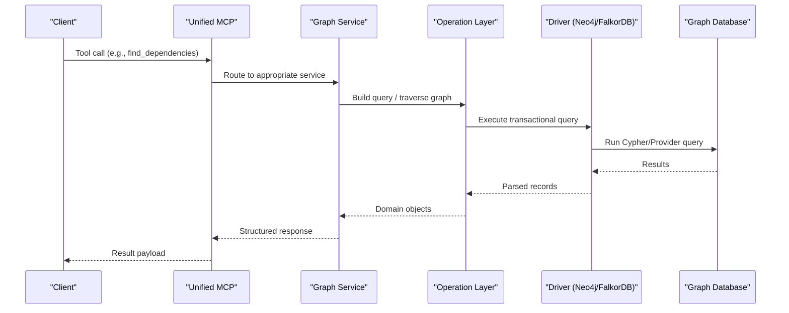
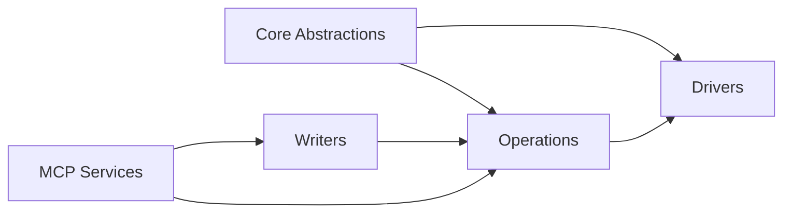

# Graph Operations API

<cite>
**Referenced Files in This Document**
- [graph_service.py](file://code-tiny/mcp/services/graph_service.py)
- [impact_service.py](file://code-tiny/mcp/services/impact_service.py)
- [symbol_service.py](file://code-tiny/mcp/services/symbol_service.py)
- [explore_service.py](file://code-tiny/mcp/services/explore_service.py)
- [flow_reconstructor.py](file://code-tiny/mcp/services/flow_reconstructor.py)
- [unified_mcp.py](file://code-tiny/mcp/unified_mcp.py)
- [fastmcp_server.py](file://code-tiny/mcp/fastmcp_server.py)
- [framework_registry.py](file://code-tiny/mcp/framework_registry.py)
- [semantic_graph_expansion.py](file://code-tiny/mcp/semantic_graph_expansion.py)
- [example_usage.py](file://code-tiny/tools/graph/examples/example_usage.py)
- [STRUCTURE.md](file://code-tiny/tools/graph/STRUCTURE.md)
- [README.md](file://code-tiny/tools/graph/docs/README.md)
- [QUICK_REFERENCE.md](file://code-tiny/tools/graph/docs/QUICK_REFERENCE.md)
- [QUERY_METHODS.md](file://code-tiny/tools/graph/docs/QUERY_METHODS.md)
- [QUERY_BUILDER_SOLUTION.md](file://code-tiny/tools/graph/docs/QUERY_BUILDER_SOLUTION.md)
- [IMPLEMENTATION_SUMMARY.md](file://code-tiny/tools/graph/docs/IMPLEMENTATION_SUMMARY.md)
- [MIGRATION_GUIDE.py](file://code-tiny/tools/graph/docs/MIGRATION_GUIDE.py)
- [MIGRATION_EXAMPLE.md](file://code-tiny/tools/graph/docs/MIGRATION_EXAMPLE.md)
- [__init__.py](file://code-tiny/tools/graph/__init__.py)
- [cli.py](file://code-tiny/tools/graph/cli.py)
- [base.py](file://code-tiny/tools/graph/core/base.py)
- [factory.py](file://code-tiny/tools/graph/core/factory.py)
- [provider_runtime.py](file://code-tiny/tools/graph/core/provider_runtime.py)
- [record_parsers.py](file://code-tiny/tools/graph/core/record_parsers.py)
- [require_neo4j.py](file://code-tiny/tools/graph/core/require_neo4j.py)
- [neo4j_driver.py](file://code-tiny/tools/graph/driver/neo4j_driver.py)
- [falkordb_driver.py](file://code-tiny/tools/graph/driver/falkordb_driver.py)
- [class_ops.py](file://code-tiny/tools/graph/operations/class_ops.py)
- [cross_edge_ops.py](file://code-tiny/tools/graph/operations/cross_edge_ops.py)
- [document_ops.py](file://code-tiny/tools/graph/operations/document_ops.py)
- [flow_ops.py](file://code-tiny/tools/graph/operations/flow_ops.py)
- [function_ops.py](file://code-tiny/tools/graph/operations/function_ops.py)
- [infra_ops.py](file://code-tiny/tools/graph/operations/infra_ops.py)
- [namespace_ops.py](file://code-tiny/tools/graph/operations/namespace_ops.py)
- [package_ops.py](file://code-tiny/tools/graph/operations/package_ops.py)
- [type_ops.py](file://code-tiny/tools/graph/operations/type_ops.py)
- [language_writer.py](file://code-tiny/tools/graph/writer/language_writer.py)
- [aspnet_writer.py](file://code-tiny/tools/graph/writer/aspnet_writer.py)
- [database_schema_writer.py](file://code-tiny/tools/graph/writer/database_schema_writer.py)
- [mybatis_writer.py](file://code-tiny/tools/graph/writer/mybatis_writer.py)
- [servlet_jsp_writer.py](file://code-tiny/tools/graph/writer/servlet_jsp_writer.py)
- [spring_writer.py](file://code-tiny/tools/graph/writer/spring_writer.py)
- [web_framework_writer.py](file://code-tiny/tools/graph/writer/web_framework_writer.py)
</cite>

## Table of Contents
1. [Introduction](#introduction)
2. [Project Structure](#project-structure)
3. [Core Components](#core-components)
4. [Architecture Overview](#architecture-overview)
5. [Detailed Component Analysis](#detailed-component-analysis)
6. [Dependency Analysis](#dependency-analysis)
7. [Performance Considerations](#performance-considerations)
8. [Troubleshooting Guide](#troubleshooting-guide)
9. [Conclusion](#conclusion)
10. [Appendices](#appendices)

## Introduction
This document provides comprehensive API documentation for graph operations in Cortex Harness, focusing on:
- CRUD operations for nodes and edges
- Batch operations and transaction handling
- Traversal APIs (depth-first, breadth-first, path finding, subgraph extraction)
- Query building utilities for complex queries
- Error handling patterns, retry mechanisms, and performance optimization techniques
- Practical examples such as dependency discovery, call chain tracing, and impact analysis
- Concurrency considerations and thread safety for concurrent graph access

The graph subsystem is implemented under the tools/graph package with a layered architecture: core abstractions, driver implementations, typed operation modules, writers for framework-specific ingestion, and MCP services that expose these capabilities via a unified interface.

## Project Structure
At a high level, the graph system consists of:
- Core abstractions and runtime for provider selection and record parsing
- Driver implementations for Neo4j and FalkorDB
- Typed operation modules for classes, functions, flows, namespaces, packages, types, documents, cross-language edges, and infrastructure nodes
- Writers for language and framework-specific ingestion pipelines
- MCP services that wrap graph operations into tool calls
- Documentation and examples for usage and migration

```mermaid
graph TB
subgraph "Graph Core"
base["core/base.py"]
factory["core/factory.py"]
runtime["core/provider_runtime.py"]
parsers["core/record_parsers.py"]
require["core/require_neo4j.py"]
end
subgraph "Drivers"
neo4j["driver/neo4j_driver.py"]
falkor["driver/falkordb_driver.py"]
end
subgraph "Operations"
classops["operations/class_ops.py"]
funcops["operations/function_ops.py"]
flowops["operations/flow_ops.py"]
nsops["operations/namespace_ops.py"]
pkgops["operations/package_ops.py"]
typeops["operations/type_ops.py"]
docops["operations/document_ops.py"]
crossops["operations/cross_edge_ops.py"]
infraops["operations/infra_ops.py"]
end
subgraph "Writers"
langw["writer/language_writer.py"]
aspnetw["writer/aspnet_writer.py"]
dbw["writer/database_schema_writer.py"]
mybitw["writer/mybatis_writer.py"]
servletw["writer/servlet_jsp_writer.py"]
springw["writer/spring_writer.py"]
webfw["writer/web_framework_writer.py"]
end
subgraph "MCP Services"
mcp_unified["unified_mcp.py"]
mcp_fastmcp["fastmcp_server.py"]
svc_graph["services/graph_service.py"]
svc_impact["services/impact_service.py"]
svc_symbol["services/symbol_service.py"]
svc_explore["services/explore_service.py"]
svc_flow["services/flow_reconstructor.py"]
end
base --> factory
factory --> runtime
runtime --> neo4j
runtime --> falkor
classops --> neo4j
funcops --> neo4j
flowops --> neo4j
nsops --> neo4j
pkgops --> neo4j
typeops --> neo4j
docops --> neo4j
crossops --> neo4j
infraops --> neo4j
langw --> neo4j
aspnetw --> neo4j
dbw --> neo4j
mybitw --> neo4j
servletw --> neo4j
springw --> neo4j
webfw --> neo4j
mcp_unified --> svc_graph
mcp_unified --> svc_impact
mcp_unified --> svc_symbol
mcp_unified --> svc_explore
mcp_unified --> svc_flow
svc_graph --> classops
svc_graph --> funcops
svc_graph --> flowops
svc_graph --> nsops
svc_graph --> pkgops
svc_graph --> typeops
svc_graph --> docops
svc_graph --> crossops
svc_graph --> infraops
```

**Diagram sources**
- [base.py](file://code-tiny/tools/graph/core/base.py)
- [factory.py](file://code-tiny/tools/graph/core/factory.py)
- [provider_runtime.py](file://code-tiny/tools/graph/core/provider_runtime.py)
- [record_parsers.py](file://code-tiny/tools/graph/core/record_parsers.py)
- [require_neo4j.py](file://code-tiny/tools/graph/core/require_neo4j.py)
- [neo4j_driver.py](file://code-tiny/tools/graph/driver/neo4j_driver.py)
- [falkordb_driver.py](file://code-tiny/tools/graph/driver/falkordb_driver.py)
- [class_ops.py](file://code-tiny/tools/graph/operations/class_ops.py)
- [function_ops.py](file://code-tiny/tools/graph/operations/function_ops.py)
- [flow_ops.py](file://code-tiny/tools/graph/operations/flow_ops.py)
- [namespace_ops.py](file://code-tiny/tools/graph/operations/namespace_ops.py)
- [package_ops.py](file://code-tiny/tools/graph/operations/package_ops.py)
- [type_ops.py](file://code-tiny/tools/graph/operations/type_ops.py)
- [document_ops.py](file://code-tiny/tools/graph/operations/document_ops.py)
- [cross_edge_ops.py](file://code-tiny/tools/graph/operations/cross_edge_ops.py)
- [infra_ops.py](file://code-tiny/tools/graph/operations/infra_ops.py)
- [language_writer.py](file://code-tiny/tools/graph/writer/language_writer.py)
- [aspnet_writer.py](file://code-tiny/tools/graph/writer/aspnet_writer.py)
- [database_schema_writer.py](file://code-tiny/tools/graph/writer/database_schema_writer.py)
- [mybatis_writer.py](file://code-tiny/tools/graph/writer/mybatis_writer.py)
- [servlet_jsp_writer.py](file://code-tiny/tools/graph/writer/servlet_jsp_writer.py)
- [spring_writer.py](file://code-tiny/tools/graph/writer/spring_writer.py)
- [web_framework_writer.py](file://code-tiny/tools/graph/writer/web_framework_writer.py)
- [unified_mcp.py](file://code-tiny/mcp/unified_mcp.py)
- [fastmcp_server.py](file://code-tiny/mcp/fastmcp_server.py)
- [graph_service.py](file://code-tiny/mcp/services/graph_service.py)
- [impact_service.py](file://code-tiny/mcp/services/impact_service.py)
- [symbol_service.py](file://code-tiny/mcp/services/symbol_service.py)
- [explore_service.py](file://code-tiny/mcp/services/explore_service.py)
- [flow_reconstructor.py](file://code-tiny/mcp/services/flow_reconstructor.py)

**Section sources**
- [STRUCTURE.md](file://code-tiny/tools/graph/STRUCTURE.md)
- [README.md](file://code-tiny/tools/graph/docs/README.md)
- [__init__.py](file://code-tiny/tools/graph/__init__.py)
- [cli.py](file://code-tiny/tools/graph/cli.py)

## Core Components
- Core abstractions define the graph provider contract, driver lifecycle, and record parsing utilities. The factory selects a driver based on configuration, while the runtime manages connection state and query execution context.
- Drivers implement provider-specific logic for Neo4j and FalkorDB, including transaction boundaries and batch write strategies.
- Operation modules encapsulate domain-specific CRUD and traversal methods for classes, functions, flows, namespaces, packages, types, documents, cross-language edges, and infrastructure nodes.
- Writers orchestrate ingestion from language/framework analyzers into the graph using the operation layer.
- MCP services provide a stable tooling surface over the graph operations, enabling search, traversal, impact analysis, and symbol resolution.

Key responsibilities:
- Provider abstraction and driver selection
- Transactional writes and batch processing
- Typed operations for node/edge CRUD and traversals
- Ingestion writers for multi-language support
- Unified MCP service layer for external consumers

**Section sources**
- [base.py](file://code-tiny/tools/graph/core/base.py)
- [factory.py](file://code-tiny/tools/graph/core/factory.py)
- [provider_runtime.py](file://code-tiny/tools/graph/core/provider_runtime.py)
- [record_parsers.py](file://code-tiny/tools/graph/core/record_parsers.py)
- [require_neo4j.py](file://code-tiny/tools/graph/core/require_neo4j.py)
- [neo4j_driver.py](file://code-tiny/tools/graph/driver/neo4j_driver.py)
- [falkordb_driver.py](file://code-tiny/tools/graph/driver/falkordb_driver.py)
- [class_ops.py](file://code-tiny/tools/graph/operations/class_ops.py)
- [function_ops.py](file://code-tiny/tools/graph/operations/function_ops.py)
- [flow_ops.py](file://code-tiny/tools/graph/operations/flow_ops.py)
- [namespace_ops.py](file://code-tiny/tools/graph/operations/namespace_ops.py)
- [package_ops.py](file://code-tiny/tools/graph/operations/package_ops.py)
- [type_ops.py](file://code-tiny/tools/graph/operations/type_ops.py)
- [document_ops.py](file://code-tiny/tools/graph/operations/document_ops.py)
- [cross_edge_ops.py](file://code-tiny/tools/graph/operations/cross_edge_ops.py)
- [infra_ops.py](file://code-tiny/tools/graph/operations/infra_ops.py)
- [language_writer.py](file://code-tiny/tools/graph/writer/language_writer.py)
- [aspnet_writer.py](file://code-tiny/tools/graph/writer/aspnet_writer.py)
- [database_schema_writer.py](file://code-tiny/tools/graph/writer/database_schema_writer.py)
- [mybatis_writer.py](file://code-tiny/tools/graph/writer/mybatis_writer.py)
- [servlet_jsp_writer.py](file://code-tiny/tools/graph/writer/servlet_jsp_writer.py)
- [spring_writer.py](file://code-tiny/tools/graph/writer/spring_writer.py)
- [web_framework_writer.py](file://code-tiny/tools/graph/writer/web_framework_writer.py)

## Architecture Overview
The graph API follows a layered design:
- MCP services translate user requests into operation calls
- Operation modules perform CRUD and traversal against drivers
- Drivers execute provider-specific queries and manage transactions
- Writers use operations to ingest structured data from analyzers

**Diagram sources**
- [unified_mcp.py](file://code-tiny/mcp/unified_mcp.py)
- [fastmcp_server.py](file://code-tiny/mcp/fastmcp_server.py)
- [graph_service.py](file://code-tiny/mcp/services/graph_service.py)
- [function_ops.py](file://code-tiny/tools/graph/operations/function_ops.py)
- [neo4j_driver.py](file://code-tiny/tools/graph/driver/neo4j_driver.py)
- [falkordb_driver.py](file://code-tiny/tools/graph/driver/falkordb_driver.py)

## Detailed Component Analysis

### CRUD Operations for Nodes and Edges
CRUD operations are exposed through typed operation modules:
- Class nodes and relationships: create, read, update, delete classes and their associations
- Function nodes and call edges: create function nodes, link callers/callees, update metadata
- Flow nodes and control-flow edges: represent control flow within functions or across components
- Namespace/package/type/document/infrastructure nodes: hierarchical organization and cross-cutting concerns
- Cross-language edges: connect symbols across different languages or frameworks

Typical patterns:
- Upsert semantics for idempotent writes
- Edge creation with relationship properties
- Bulk upserts for large datasets
- Validation and normalization before persistence

Practical references:
- Class operations: [class_ops.py](file://code-tiny/tools/graph/operations/class_ops.py)
- Function operations: [function_ops.py](file://code-tiny/tools/graph/operations/function_ops.py)
- Flow operations: [flow_ops.py](file://code-tiny/tools/graph/operations/flow_ops.py)
- Namespace operations: [namespace_ops.py](file://code-tiny/tools/graph/operations/namespace_ops.py)
- Package operations: [package_ops.py](file://code-tiny/tools/graph/operations/package_ops.py)
- Type operations: [type_ops.py](file://code-tiny/tools/graph/operations/type_ops.py)
- Document operations: [document_ops.py](file://code-tiny/tools/graph/operations/document_ops.py)
- Cross-edge operations: [cross_edge_ops.py](file://code-tiny/tools/graph/operations/cross_edge_ops.py)
- Infrastructure operations: [infra_ops.py](file://code-tiny/tools/graph/operations/infra_ops.py)

**Section sources**
- [class_ops.py](file://code-tiny/tools/graph/operations/class_ops.py)
- [function_ops.py](file://code-tiny/tools/graph/operations/function_ops.py)
- [flow_ops.py](file://code-tiny/tools/graph/operations/flow_ops.py)
- [namespace_ops.py](file://code-tiny/tools/graph/operations/namespace_ops.py)
- [package_ops.py](file://code-tiny/tools/graph/operations/package_ops.py)
- [type_ops.py](file://code-tiny/tools/graph/operations/type_ops.py)
- [document_ops.py](file://code-tiny/tools/graph/operations/document_ops.py)
- [cross_edge_ops.py](file://code-tiny/tools/graph/operations/cross_edge_ops.py)
- [infra_ops.py](file://code-tiny/tools/graph/operations/infra_ops.py)

### Batch Operations and Transactions
Batch operations enable efficient bulk data processing:
- Batch upsert nodes and edges to minimize round-trips
- Transaction boundaries ensure atomicity and consistency
- Retry policies handle transient failures at the driver layer
- Chunked writes prevent memory pressure during large ingests

Implementation highlights:
- Driver-level batching and transaction management
- Operation-layer helpers for constructing bulk payloads
- Writers orchestrating ingestion with progress tracking and error aggregation

References:
- Neo4j driver: [neo4j_driver.py](file://code-tiny/tools/graph/driver/neo4j_driver.py)
- FalkorDB driver: [falkordb_driver.py](file://code-tiny/tools/graph/driver/falkordb_driver.py)
- Language writer: [language_writer.py](file://code-tiny/tools/graph/writer/language_writer.py)
- Framework writers: [aspnet_writer.py](file://code-tiny/tools/graph/writer/aspnet_writer.py), [spring_writer.py](file://code-tiny/tools/graph/writer/spring_writer.py), [web_framework_writer.py](file://code-tiny/tools/graph/writer/web_framework_writer.py)

**Section sources**
- [neo4j_driver.py](file://code-tiny/tools/graph/driver/neo4j_driver.py)
- [falkordb_driver.py](file://code-tiny/tools/graph/driver/falkordb_driver.py)
- [language_writer.py](file://code-tiny/tools/graph/writer/language_writer.py)
- [aspnet_writer.py](file://code-tiny/tools/graph/writer/aspnet_writer.py)
- [spring_writer.py](file://code-tiny/tools/graph/writer/spring_writer.py)
- [web_framework_writer.py](file://code-tiny/tools/graph/writer/web_framework_writer.py)

### Traversal APIs
Traversal APIs support navigating graph relationships:
- Depth-first search (DFS) for deep exploration along specific edge types
- Breadth-first search (BFS) for shortest-path-like exploration
- Path finding algorithms between two nodes or sets of nodes
- Subgraph extraction around a seed set of nodes with configurable depth and edge filters

Common use cases:
- Dependency discovery for functions and classes
- Call chain tracing across modules
- Impact analysis by expanding downstream/upstream dependencies
- Contextual code review by extracting relevant subgraphs

References:
- Function operations: [function_ops.py](file://code-tiny/tools/graph/operations/function_ops.py)
- Flow operations: [flow_ops.py](file://code-tiny/tools/graph/operations/flow_ops.py)
- Explore service: [explore_service.py](file://code-tiny/mcp/services/explore_service.py)
- Example usage: [example_usage.py](file://code-tiny/tools/graph/examples/example_usage.py)

**Section sources**
- [function_ops.py](file://code-tiny/tools/graph/operations/function_ops.py)
- [flow_ops.py](file://code-tiny/tools/graph/operations/flow_ops.py)
- [explore_service.py](file://code-tiny/mcp/services/explore_service.py)
- [example_usage.py](file://code-tiny/tools/graph/examples/example_usage.py)

### Query Building Utilities
Query building utilities allow constructing complex graph queries programmatically:
- Fluent builders for matching nodes and relationships
- Parameterized queries to avoid injection and improve caching
- Composable filters for labels, properties, and edge constraints
- Aggregation and projection helpers for result shaping

References:
- Query methods guide: [QUERY_METHODS.md](file://code-tiny/tools/graph/docs/QUERY_METHODS.md)
- Query builder solution overview: [QUERY_BUILDER_SOLUTION.md](file://code-tiny/tools/graph/docs/QUERY_BUILDER_SOLUTION.md)
- Quick reference: [QUICK_REFERENCE.md](file://code-tiny/tools/graph/docs/QUICK_REFERENCE.md)

**Section sources**
- [QUERY_METHODS.md](file://code-tiny/tools/graph/docs/QUERY_METHODS.md)
- [QUERY_BUILDER_SOLUTION.md](file://code-tiny/tools/graph/docs/QUERY_BUILDER_SOLUTION.md)
- [QUICK_REFERENCE.md](file://code-tiny/tools/graph/docs/QUICK_REFERENCE.md)

### MCP Services Integration
MCP services expose graph operations as tools:
- Unified MCP routes requests to specialized services
- FastMCP server hosts the tool endpoints
- Services coordinate operations, format responses, and handle errors

Service responsibilities:
- Graph service: general CRUD and traversal
- Symbol service: symbol lookup and resolution
- Impact service: impact analysis workflows
- Explore service: exploratory queries and subgraph extraction
- Flow reconstructor: reconstructing control/data flows

References:
- Unified MCP: [unified_mcp.py](file://code-tiny/mcp/unified_mcp.py)
- FastMCP server: [fastmcp_server.py](file://code-tiny/mcp/fastmcp_server.py)
- Graph service: [graph_service.py](file://code-tiny/mcp/services/graph_service.py)
- Symbol service: [symbol_service.py](file://code-tiny/mcp/services/symbol_service.py)
- Impact service: [impact_service.py](file://code-tiny/mcp/services/impact_service.py)
- Explore service: [explore_service.py](file://code-tiny/mcp/services/explore_service.py)
- Flow reconstructor: [flow_reconstructor.py](file://code-tiny/mcp/services/flow_reconstructor.py)
- Framework registry: [framework_registry.py](file://code-tiny/mcp/framework_registry.py)
- Semantic graph expansion: [semantic_graph_expansion.py](file://code-tiny/mcp/semantic_graph_expansion.py)

**Section sources**
- [unified_mcp.py](file://code-tiny/mcp/unified_mcp.py)
- [fastmcp_server.py](file://code-tiny/mcp/fastmcp_server.py)
- [graph_service.py](file://code-tiny/mcp/services/graph_service.py)
- [symbol_service.py](file://code-tiny/mcp/services/symbol_service.py)
- [impact_service.py](file://code-tiny/mcp/services/impact_service.py)
- [explore_service.py](file://code-tiny/mcp/services/explore_service.py)
- [flow_reconstructor.py](file://code-tiny/mcp/services/flow_reconstructor.py)
- [framework_registry.py](file://code-tiny/mcp/framework_registry.py)
- [semantic_graph_expansion.py](file://code-tiny/mcp/semantic_graph_expansion.py)

### Practical Examples

#### Finding All Dependencies of a Function
Workflow:
- Resolve function symbol
- Traverse caller/callee edges to collect direct and transitive dependencies
- Optionally filter by label or property constraints
- Return deduplicated list of dependent nodes

References:
- Function operations: [function_ops.py](file://code-tiny/tools/graph/operations/function_ops.py)
- Explore service: [explore_service.py](file://code-tiny/mcp/services/explore_service.py)
- Example usage: [example_usage.py](file://code-tiny/tools/graph/examples/example_usage.py)

**Section sources**
- [function_ops.py](file://code-tiny/tools/graph/operations/function_ops.py)
- [explore_service.py](file://code-tiny/mcp/services/explore_service.py)
- [example_usage.py](file://code-tiny/tools/graph/examples/example_usage.py)

#### Tracing Call Chains
Workflow:
- Start from entry point or target function
- Perform BFS/DFS along call edges
- Limit depth and apply filters to keep results manageable
- Aggregate paths and present them in a readable structure

References:
- Function operations: [function_ops.py](file://code-tiny/tools/graph/operations/function_ops.py)
- Flow operations: [flow_ops.py](file://code-tiny/tools/graph/operations/flow_ops.py)
- Explore service: [explore_service.py](file://code-tiny/mcp/services/explore_service.py)

**Section sources**
- [function_ops.py](file://code-tiny/tools/graph/operations/function_ops.py)
- [flow_ops.py](file://code-tiny/tools/graph/operations/flow_ops.py)
- [explore_service.py](file://code-tiny/mcp/services/explore_service.py)

#### Extracting Impact Analysis Results
Workflow:
- Identify change source node(s)
- Expand downstream/upstream dependencies within configured scope
- Score or rank impacts using heuristics or metadata
- Return summarized impact report

References:
- Impact service: [impact_service.py](file://code-tiny/mcp/services/impact_service.py)
- Semantic graph expansion: [semantic_graph_expansion.py](file://code-tiny/mcp/semantic_graph_expansion.py)
- Explore service: [explore_service.py](file://code-tiny/mcp/services/explore_service.py)

**Section sources**
- [impact_service.py](file://code-tiny/mcp/services/impact_service.py)
- [semantic_graph_expansion.py](file://code-tiny/mcp/semantic_graph_expansion.py)
- [explore_service.py](file://code-tiny/mcp/services/explore_service.py)

## Dependency Analysis
The graph system exhibits clear separation of concerns:
- Core abstractions decouple providers from business logic
- Drivers encapsulate database-specific behavior
- Operation modules provide domain-focused APIs
- Writers depend on operations for ingestion
- MCP services depend on operations and writers indirectly via services

**Diagram sources**
- [base.py](file://code-tiny/tools/graph/core/base.py)
- [factory.py](file://code-tiny/tools/graph/core/factory.py)
- [provider_runtime.py](file://code-tiny/tools/graph/core/provider_runtime.py)
- [neo4j_driver.py](file://code-tiny/tools/graph/driver/neo4j_driver.py)
- [falkordb_driver.py](file://code-tiny/tools/graph/driver/falkordb_driver.py)
- [class_ops.py](file://code-tiny/tools/graph/operations/class_ops.py)
- [function_ops.py](file://code-tiny/tools/graph/operations/function_ops.py)
- [language_writer.py](file://code-tiny/tools/graph/writer/language_writer.py)
- [graph_service.py](file://code-tiny/mcp/services/graph_service.py)

**Section sources**
- [base.py](file://code-tiny/tools/graph/core/base.py)
- [factory.py](file://code-tiny/tools/graph/core/factory.py)
- [provider_runtime.py](file://code-tiny/tools/graph/core/provider_runtime.py)
- [neo4j_driver.py](file://code-tiny/tools/graph/driver/neo4j_driver.py)
- [falkordb_driver.py](file://code-tiny/tools/graph/driver/falkordb_driver.py)
- [class_ops.py](file://code-tiny/tools/graph/operations/class_ops.py)
- [function_ops.py](file://code-tiny/tools/graph/operations/function_ops.py)
- [language_writer.py](file://code-tiny/tools/graph/writer/language_writer.py)
- [graph_service.py](file://code-tiny/mcp/services/graph_service.py)

## Performance Considerations
- Use batch upserts for large-scale ingestion to reduce network overhead
- Apply depth limits and filters in traversals to avoid expansive scans
- Prefer parameterized queries to leverage database caching
- Choose appropriate drivers based on workload characteristics (Neo4j vs FalkorDB)
- Monitor transaction sizes and split large batches if needed
- Leverage indexes and constraints defined in the database schema

[No sources needed since this section provides general guidance]

## Troubleshooting Guide
Common issues and resolutions:
- Connection failures: verify provider configuration and credentials; check driver initialization logs
- Query timeouts: adjust depth limits, add filters, or optimize queries
- Duplicate nodes: ensure idempotent upsert semantics and consistent identifiers
- Partial failures in batch writes: inspect transaction boundaries and retry policies
- Migration inconsistencies: follow migration guides and validate schema changes

References:
- Implementation summary: [IMPLEMENTATION_SUMMARY.md](file://code-tiny/tools/graph/docs/IMPLEMENTATION_SUMMARY.md)
- Migration guide: [MIGRATION_GUIDE.py](file://code-tiny/tools/graph/docs/MIGRATION_GUIDE.py)
- Migration example: [MIGRATION_EXAMPLE.md](file://code-tiny/tools/graph/docs/MIGRATION_EXAMPLE.md)

**Section sources**
- [IMPLEMENTATION_SUMMARY.md](file://code-tiny/tools/graph/docs/IMPLEMENTATION_SUMMARY.md)
- [MIGRATION_GUIDE.py](file://code-tiny/tools/graph/docs/MIGRATION_GUIDE.py)
- [MIGRATION_EXAMPLE.md](file://code-tiny/tools/graph/docs/MIGRATION_EXAMPLE.md)

## Conclusion
Cortex Harness provides a robust, layered graph API supporting CRUD, batch operations, traversals, and query building. MCP services offer a stable integration surface for clients, while writers enable multi-language ingestion. By following best practices for batching, filtering, and transaction management, users can achieve reliable and performant graph operations across diverse workloads.

[No sources needed since this section summarizes without analyzing specific files]

## Appendices

### Concurrency and Thread Safety
- Drivers should be used within appropriate concurrency contexts; prefer connection pooling where available
- Avoid sharing mutable state across threads; initialize providers per process or per worker
- Use transaction boundaries to isolate concurrent writes and reads
- Implement retry mechanisms for transient network or database errors

[No sources needed since this section provides general guidance]