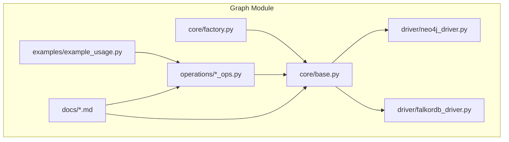
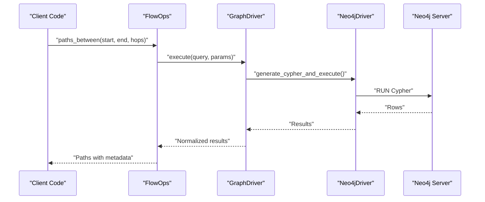
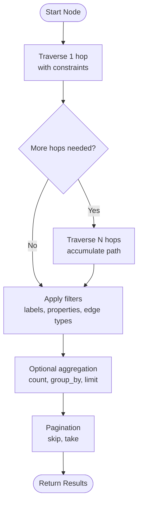
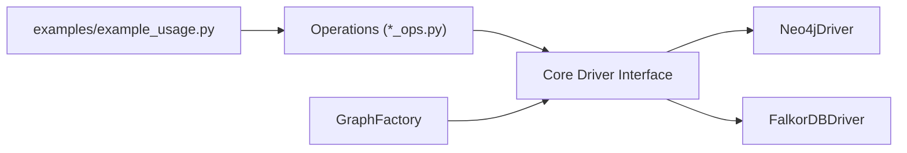

# Query Builder & Advanced Queries

<cite>
**Referenced Files in This Document**
- [graph/__init__.py](file://code-tiny/tools/graph/__init__.py)
- [core/base.py](file://code-tiny/tools/graph/core/base.py)
- [core/factory.py](file://code-tiny/tools/graph/core/factory.py)
- [driver/neo4j_driver.py](file://code-tiny/tools/graph/driver/neo4j_driver.py)
- [driver/falkordb_driver.py](file://code-tiny/tools/graph/driver/falkordb_driver.py)
- [operations/class_ops.py](file://code-tiny/tools/graph/operations/class_ops.py)
- [operations/function_ops.py](file://code-tiny/tools/graph/operations/function_ops.py)
- [operations/package_ops.py](file://code-tiny/tools/graph/operations/package_ops.py)
- [operations/document_ops.py](file://code-tiny/tools/graph/operations/document_ops.py)
- [operations/flow_ops.py](file://code-tiny/tools/graph/operations/flow_ops.py)
- [operations/cross_edge_ops.py](file://code-tiny/tools/graph/operations/cross_edge_ops.py)
- [operations/namespace_ops.py](file://code-tiny/tools/graph/operations/namespace_ops.py)
- [operations/type_ops.py](file://code-tiny/tools/graph/operations/type_ops.py)
- [operations/infra_ops.py](file://code-tiny/tools/graph/operations/infra_ops.py)
- [examples/example_usage.py](file://code-tiny/tools/graph/examples/example_usage.py)
- [QUERY_BUILDER_SOLUTION.md](file://code-tiny/tools/graph/docs/QUERY_BUILDER_SOLUTION.md)
- [QUICK_REFERENCE.md](file://code-tiny/tools/graph/docs/QUICK_REFERENCE.md)
- [QUERY_METHODS.md](file://code-tiny/tools/graph/docs/QUERY_METHODS.md)
- [IMPLEMENTATION_SUMMARY.md](file://code-tiny/tools/graph/docs/IMPLEMENTATION_SUMMARY.md)
- [MIGRATION_GUIDE.py](file://code-tiny/tools/graph/docs/MIGRATION_GUIDE.py)
- [test_falkordb_driver.py](file://tests/test_falkordb_driver.py)
- [test_explore_graph_falkor_compat.py](file://tests/test_explore_graph_falkor_compat.py)
</cite>

## Table of Contents
1. [Introduction](#introduction)
2. [Project Structure](#project-structure)
3. [Core Components](#core-components)
4. [Architecture Overview](#architecture-overview)
5. [Detailed Component Analysis](#detailed-component-analysis)
6. [Dependency Analysis](#dependency-analysis)
7. [Performance Considerations](#performance-considerations)
8. [Troubleshooting Guide](#troubleshooting-guide)
9. [Conclusion](#conclusion)
10. [Appendices](#appendices)

## Introduction
This document explains the query builder system and advanced graph queries in Cortex Harness. It focuses on programmatic query construction using fluent APIs, Cypher generation, and cross-database compatibility layers. It also covers complex query patterns such as multi-hop traversals, conditional filtering, aggregation operations, and pagination. Optimization techniques, execution plan analysis, performance monitoring, caching, connection pooling, and distributed query considerations are included. Sophisticated examples include finding all code paths between modules, extracting architectural boundaries, and performing semantic similarity searches.

## Project Structure
The query builder is implemented under the graph module with a layered design:
- Core abstractions define the driver interface and factory for provider selection.
- Drivers implement database-specific behavior (Neo4j and FalkorDB).
- Operations provide fluent APIs for common graph entities and relationships.
- Documentation provides quick references and migration guidance.

**Diagram sources**
- [core/base.py](file://code-tiny/tools/graph/core/base.py)
- [core/factory.py](file://code-tiny/tools/graph/core/factory.py)
- [driver/neo4j_driver.py](file://code-tiny/tools/graph/driver/neo4j_driver.py)
- [driver/falkordb_driver.py](file://code-tiny/tools/graph/driver/falkordb_driver.py)
- [operations/class_ops.py](file://code-tiny/tools/graph/operations/class_ops.py)
- [operations/function_ops.py](file://code-tiny/tools/graph/operations/function_ops.py)
- [operations/package_ops.py](file://code-tiny/tools/graph/operations/package_ops.py)
- [operations/document_ops.py](file://code-tiny/tools/graph/operations/document_ops.py)
- [operations/flow_ops.py](file://code-tiny/tools/graph/operations/flow_ops.py)
- [operations/cross_edge_ops.py](file://code-tiny/tools/graph/operations/cross_edge_ops.py)
- [operations/namespace_ops.py](file://code-tiny/tools/graph/operations/namespace_ops.py)
- [operations/type_ops.py](file://code-tiny/tools/graph/operations/type_ops.py)
- [operations/infra_ops.py](file://code-tiny/tools/graph/operations/infra_ops.py)
- [examples/example_usage.py](file://code-tiny/tools/graph/examples/example_usage.py)
- [QUERY_BUILDER_SOLUTION.md](file://code-tiny/tools/graph/docs/QUERY_BUILDER_SOLUTION.md)
- [QUICK_REFERENCE.md](file://code-tiny/tools/graph/docs/QUICK_REFERENCE.md)
- [QUERY_METHODS.md](file://code-tiny/tools/graph/docs/QUERY_METHODS.md)
- [IMPLEMENTATION_SUMMARY.md](file://code-tiny/tools/graph/docs/IMPLEMENTATION_SUMMARY.md)
- [MIGRATION_GUIDE.py](file://code-tiny/tools/graph/docs/MIGRATION_GUIDE.py)

**Section sources**
- [graph/__init__.py](file://code-tiny/tools/graph/__init__.py)
- [core/base.py](file://code-tiny/tools/graph/core/base.py)
- [core/factory.py](file://code-tiny/tools/graph/core/factory.py)
- [driver/neo4j_driver.py](file://code-tiny/tools/graph/driver/neo4j_driver.py)
- [driver/falkordb_driver.py](file://code-tiny/tools/graph/driver/falkordb_driver.py)
- [operations/class_ops.py](file://code-tiny/tools/graph/operations/class_ops.py)
- [operations/function_ops.py](file://code-tiny/tools/graph/operations/function_ops.py)
- [operations/package_ops.py](file://code-tiny/tools/graph/operations/package_ops.py)
- [operations/document_ops.py](file://code-tiny/tools/graph/operations/document_ops.py)
- [operations/flow_ops.py](file://code-tiny/tools/graph/operations/flow_ops.py)
- [operations/cross_edge_ops.py](file://code-tiny/tools/graph/operations/cross_edge_ops.py)
- [operations/namespace_ops.py](file://code-tiny/tools/graph/operations/namespace_ops.py)
- [operations/type_ops.py](file://code-tiny/tools/graph/operations/type_ops.py)
- [operations/infra_ops.py](file://code-tiny/tools/graph/operations/infra_ops.py)
- [examples/example_usage.py](file://code-tiny/tools/graph/examples/example_usage.py)
- [QUERY_BUILDER_SOLUTION.md](file://code-tiny/tools/graph/docs/QUERY_BUILDER_SOLUTION.md)
- [QUICK_REFERENCE.md](file://code-tiny/tools/graph/docs/QUICK_REFERENCE.md)
- [QUERY_METHODS.md](file://code-tiny/tools/graph/docs/QUERY_METHODS.md)
- [IMPLEMENTATION_SUMMARY.md](file://code-tiny/tools/graph/docs/IMPLEMENTATION_SUMMARY.md)
- [MIGRATION_GUIDE.py](file://code-tiny/tools/graph/docs/MIGRATION_GUIDE.py)

## Core Components
- Driver Abstraction: Defines a uniform interface for executing queries and managing connections across different graph databases.
- Factory: Resolves and instantiates the appropriate driver based on configuration or runtime context.
- Fluent Operations: Provide high-level methods to construct queries programmatically for classes, functions, packages, documents, flows, namespaces, types, infrastructure nodes, and cross-entity edges.
- Examples and Docs: Demonstrate usage patterns and provide quick references and migration notes.

Key responsibilities:
- Programmatic query construction via fluent APIs.
- Generation of backend-specific queries (e.g., Cypher).
- Cross-database compatibility through a shared interface.
- Encapsulation of traversal, filtering, aggregation, and pagination logic.

**Section sources**
- [core/base.py](file://code-tiny/tools/graph/core/base.py)
- [core/factory.py](file://code-tiny/tools/graph/core/factory.py)
- [driver/neo4j_driver.py](file://code-tiny/tools/graph/driver/neo4j_driver.py)
- [driver/falkordb_driver.py](file://code-tiny/tools/graph/driver/falkordb_driver.py)
- [operations/class_ops.py](file://code-tiny/tools/graph/operations/class_ops.py)
- [operations/function_ops.py](file://code-tiny/tools/graph/operations/function_ops.py)
- [operations/package_ops.py](file://code-tiny/tools/graph/operations/package_ops.py)
- [operations/document_ops.py](file://code-tiny/tools/graph/operations/document_ops.py)
- [operations/flow_ops.py](file://code-tiny/tools/graph/operations/flow_ops.py)
- [operations/cross_edge_ops.py](file://code-tiny/tools/graph/operations/cross_edge_ops.py)
- [operations/namespace_ops.py](file://code-tiny/tools/graph/operations/namespace_ops.py)
- [operations/type_ops.py](file://code-tiny/tools/graph/operations/type_ops.py)
- [operations/infra_ops.py](file://code-tiny/tools/graph/operations/infra_ops.py)
- [examples/example_usage.py](file://code-tiny/tools/graph/examples/example_usage.py)
- [QUERY_BUILDER_SOLUTION.md](file://code-tiny/tools/graph/docs/QUERY_BUILDER_SOLUTION.md)
- [QUICK_REFERENCE.md](file://code-tiny/tools/graph/docs/QUICK_REFERENCE.md)
- [QUERY_METHODS.md](file://code-tiny/tools/graph/docs/QUERY_METHODS.md)
- [IMPLEMENTATION_SUMMARY.md](file://code-tiny/tools/graph/docs/IMPLEMENTATION_SUMMARY.md)
- [MIGRATION_GUIDE.py](file://code-tiny/tools/graph/docs/MIGRATION_GUIDE.py)

## Architecture Overview
The architecture separates concerns into three layers:
- API Layer: Fluent operations that build queries.
- Core Layer: Driver abstraction and factory for provider resolution.
- Driver Layer: Database-specific implementations (Neo4j, FalkorDB).

```mermaid
classDiagram
class GraphDriver {
+execute(query, params)
+close()
+supports(feature) bool
}
class Neo4jDriver {
+execute(cypher, params)
+close()
+supports(feature) bool
}
class FalkorDBDriver {
+execute(command, args)
+close()
+supports(feature) bool
}
class GraphFactory {
+create(config) GraphDriver
}
class ClassOps {
+find_by_name(name)
+list_in_package(pkg)
}
class FunctionOps {
+find_by_signature(sig)
+callers_of(node_id)
}
class PackageOps {
+descendants_of(pkg)
+imports(pkg)
}
class DocumentOps {
+search(text, filters)
+semantic_search(vector, top_k)
}
class FlowOps {
+paths_between(start, end, hops)
+conditional_paths(filters)
}
class CrossEdgeOps {
+edges_between(a, b, edge_types)
+aggregate_edges(group_by)
}
class NamespaceOps {
+resolve_path(path)
+children(ns)
}
class TypeOps {
+inheritance_chain(type_node)
+implementations(interface_node)
}
class InfraOps {
+services_in_cluster(cluster)
+dependencies(service)
}
GraphFactory --> GraphDriver : "creates"
Neo4jDriver --|> GraphDriver
FalkorDBDriver --|> GraphDriver
ClassOps --> GraphDriver : "uses"
FunctionOps --> GraphDriver : "uses"
PackageOps --> GraphDriver : "uses"
DocumentOps --> GraphDriver : "uses"
FlowOps --> GraphDriver : "uses"
CrossEdgeOps --> GraphDriver : "uses"
NamespaceOps --> GraphDriver : "uses"
TypeOps --> GraphDriver : "uses"
InfraOps --> GraphDriver : "uses"
```

**Diagram sources**
- [core/base.py](file://code-tiny/tools/graph/core/base.py)
- [core/factory.py](file://code-tiny/tools/graph/core/factory.py)
- [driver/neo4j_driver.py](file://code-tiny/tools/graph/driver/neo4j_driver.py)
- [driver/falkordb_driver.py](file://code-tiny/tools/graph/driver/falkordb_driver.py)
- [operations/class_ops.py](file://code-tiny/tools/graph/operations/class_ops.py)
- [operations/function_ops.py](file://code-tiny/tools/graph/operations/function_ops.py)
- [operations/package_ops.py](file://code-tiny/tools/graph/operations/package_ops.py)
- [operations/document_ops.py](file://code-tiny/tools/graph/operations/document_ops.py)
- [operations/flow_ops.py](file://code-tiny/tools/graph/operations/flow_ops.py)
- [operations/cross_edge_ops.py](file://code-tiny/tools/graph/operations/cross_edge_ops.py)
- [operations/namespace_ops.py](file://code-tiny/tools/graph/operations/namespace_ops.py)
- [operations/type_ops.py](file://code-tiny/tools/graph/operations/type_ops.py)
- [operations/infra_ops.py](file://code-tiny/tools/graph/operations/infra_ops.py)

## Detailed Component Analysis

### Fluent API and Query Construction
Fluent operations encapsulate common graph interactions behind readable methods. They translate user intent into structured parameters and generate backend-specific queries. Typical patterns include:
- Node discovery by name, package, namespace, or type.
- Relationship traversal for callers/callees, imports, inheritance, and implementation chains.
- Conditional filtering and path enumeration with hop limits.
- Aggregation and grouping over edges or nodes.
- Pagination support for large result sets.

Examples and quick reference materials demonstrate how to chain operations to compose complex queries without writing raw queries.

**Section sources**
- [operations/class_ops.py](file://code-tiny/tools/graph/operations/class_ops.py)
- [operations/function_ops.py](file://code-tiny/tools/graph/operations/function_ops.py)
- [operations/package_ops.py](file://code-tiny/tools/graph/operations/package_ops.py)
- [operations/document_ops.py](file://code-tiny/tools/graph/operations/document_ops.py)
- [operations/flow_ops.py](file://code-tiny/tools/graph/operations/flow_ops.py)
- [operations/cross_edge_ops.py](file://code-tiny/tools/graph/operations/cross_edge_ops.py)
- [operations/namespace_ops.py](file://code-tiny/tools/graph/operations/namespace_ops.py)
- [operations/type_ops.py](file://code-tiny/tools/graph/operations/type_ops.py)
- [operations/infra_ops.py](file://code-tiny/tools/graph/operations/infra_ops.py)
- [examples/example_usage.py](file://code-tiny/tools/graph/examples/example_usage.py)
- [QUICK_REFERENCE.md](file://code-tiny/tools/graph/docs/QUICK_REFERENCE.md)
- [QUERY_METHODS.md](file://code-tiny/tools/graph/docs/QUERY_METHODS.md)

### Cypher Generation and Backend Compatibility
The core driver abstraction defines a uniform interface for query execution. The Neo4j driver implements Cypher generation and execution, while the FalkorDB driver adapts commands to its native protocol. The factory selects the correct driver based on configuration.

**Diagram sources**
- [operations/flow_ops.py](file://code-tiny/tools/graph/operations/flow_ops.py)
- [core/base.py](file://code-tiny/tools/graph/core/base.py)
- [driver/neo4j_driver.py](file://code-tiny/tools/graph/driver/neo4j_driver.py)

**Section sources**
- [core/base.py](file://code-tiny/tools/graph/core/base.py)
- [core/factory.py](file://code-tiny/tools/graph/core/factory.py)
- [driver/neo4j_driver.py](file://code-tiny/tools/graph/driver/neo4j_driver.py)
- [driver/falkordb_driver.py](file://code-tiny/tools/graph/driver/falkordb_driver.py)
- [MIGRATION_GUIDE.py](file://code-tiny/tools/graph/docs/MIGRATION_GUIDE.py)

### Multi-hop Traversals and Conditional Filtering
Multi-hop traversals are exposed through flow operations. Users can specify hop ranges, directionality, and edge constraints. Conditional filtering narrows results by node labels, property predicates, and relationship types.

**Diagram sources**
- [operations/flow_ops.py](file://code-tiny/tools/graph/operations/flow_ops.py)
- [operations/cross_edge_ops.py](file://code-tiny/tools/graph/operations/cross_edge_ops.py)

**Section sources**
- [operations/flow_ops.py](file://code-tiny/tools/graph/operations/flow_ops.py)
- [operations/cross_edge_ops.py](file://code-tiny/tools/graph/operations/cross_edge_ops.py)

### Aggregation and Result Pagination
Aggregation operations allow grouping and summarizing results across nodes and edges. Pagination supports efficient retrieval of large datasets by skipping and limiting returned rows.

**Section sources**
- [operations/cross_edge_ops.py](file://code-tiny/tools/graph/operations/cross_edge_ops.py)
- [operations/flow_ops.py](file://code-tiny/tools/graph/operations/flow_ops.py)

### Semantic Similarity Searches
Semantic search leverages vector embeddings to find similar documents or code elements. The document operations expose methods to perform similarity queries with optional filters and top-k controls.

**Section sources**
- [operations/document_ops.py](file://code-tiny/tools/graph/operations/document_ops.py)

### Sophisticated Query Patterns
- All code paths between modules: Use flow operations to enumerate paths between module nodes with hop bounds and edge-type filters.
- Extracting architectural boundaries: Traverse package and namespace hierarchies, then aggregate import edges to identify boundary crossings.
- Semantic similarity searches: Use document operations to retrieve top-k semantically similar items given an embedding or text input.

**Section sources**
- [operations/flow_ops.py](file://code-tiny/tools/graph/operations/flow_ops.py)
- [operations/package_ops.py](file://code-tiny/tools/graph/operations/package_ops.py)
- [operations/namespace_ops.py](file://code-tiny/tools/graph/operations/namespace_ops.py)
- [operations/document_ops.py](file://code-tiny/tools/graph/operations/document_ops.py)

## Dependency Analysis
The dependency structure emphasizes loose coupling between operations and drivers. Operations depend only on the driver abstraction, enabling seamless switching between Neo4j and FalkorDB.

**Diagram sources**
- [core/base.py](file://code-tiny/tools/graph/core/base.py)
- [core/factory.py](file://code-tiny/tools/graph/core/factory.py)
- [driver/neo4j_driver.py](file://code-tiny/tools/graph/driver/neo4j_driver.py)
- [driver/falkordb_driver.py](file://code-tiny/tools/graph/driver/falkordb_driver.py)
- [operations/class_ops.py](file://code-tiny/tools/graph/operations/class_ops.py)
- [operations/function_ops.py](file://code-tiny/tools/graph/operations/function_ops.py)
- [operations/package_ops.py](file://code-tiny/tools/graph/operations/package_ops.py)
- [operations/document_ops.py](file://code-tiny/tools/graph/operations/document_ops.py)
- [operations/flow_ops.py](file://code-tiny/tools/graph/operations/flow_ops.py)
- [operations/cross_edge_ops.py](file://code-tiny/tools/graph/operations/cross_edge_ops.py)
- [operations/namespace_ops.py](file://code-tiny/tools/graph/operations/namespace_ops.py)
- [operations/type_ops.py](file://code-tiny/tools/graph/operations/type_ops.py)
- [operations/infra_ops.py](file://code-tiny/tools/graph/operations/infra_ops.py)
- [examples/example_usage.py](file://code-tiny/tools/graph/examples/example_usage.py)

**Section sources**
- [core/base.py](file://code-tiny/tools/graph/core/base.py)
- [core/factory.py](file://code-tiny/tools/graph/core/factory.py)
- [driver/neo4j_driver.py](file://code-tiny/tools/graph/driver/neo4j_driver.py)
- [driver/falkordb_driver.py](file://code-tiny/tools/graph/driver/falkordb_driver.py)
- [operations/class_ops.py](file://code-tiny/tools/graph/operations/class_ops.py)
- [operations/function_ops.py](file://code-tiny/tools/graph/operations/function_ops.py)
- [operations/package_ops.py](file://code-tiny/tools/graph/operations/package_ops.py)
- [operations/document_ops.py](file://code-tiny/tools/graph/operations/document_ops.py)
- [operations/flow_ops.py](file://code-tiny/tools/graph/operations/flow_ops.py)
- [operations/cross_edge_ops.py](file://code-tiny/tools/graph/operations/cross_edge_ops.py)
- [operations/namespace_ops.py](file://code-tiny/tools/graph/operations/namespace_ops.py)
- [operations/type_ops.py](file://code-tiny/tools/graph/operations/type_ops.py)
- [operations/infra_ops.py](file://code-tiny/tools/graph/operations/infra_ops.py)
- [examples/example_usage.py](file://code-tiny/tools/graph/examples/example_usage.py)

## Performance Considerations
- Indexing and Constraints: Ensure indexes exist on frequently filtered properties (e.g., names, IDs, labels) to reduce scan costs.
- Limiting Hops: Constrain multi-hop traversals to avoid exponential expansion; prefer bounded ranges and early pruning.
- Selective Projections: Return only necessary fields to minimize payload size and network overhead.
- Aggregation at Source: Push aggregations to the database when possible to reduce client-side processing.
- Pagination: Use skip/take strategies to stream large result sets efficiently.
- Execution Plan Analysis: Inspect backend execution plans (e.g., EXPLAIN in Neo4j) to identify bottlenecks and optimize predicates.
- Monitoring: Track query latency, row counts, and memory usage; correlate with application metrics for capacity planning.

[No sources needed since this section provides general guidance]

## Troubleshooting Guide
Common issues and resolutions:
- Connection failures: Verify driver configuration and credentials; ensure the target server is reachable.
- Unsupported features: Check driver capability flags before invoking advanced operations.
- Large result sets: Apply pagination and tighter filters; consider pre-aggregating data.
- Migration pitfalls: Follow migration guides when switching from Neo4j to FalkorDB to align command semantics.

Validation tests cover driver compatibility and exploration workflows, helping confirm correct setup and behavior.

**Section sources**
- [test_falkordb_driver.py](file://tests/test_falkordb_driver.py)
- [test_explore_graph_falkor_compat.py](file://tests/test_explore_graph_falkor_compat.py)
- [MIGRATION_GUIDE.py](file://code-tiny/tools/graph/docs/MIGRATION_GUIDE.py)

## Conclusion
Cortex Harness provides a robust query builder system with fluent APIs, Cypher generation, and cross-database compatibility. By leveraging multi-hop traversals, conditional filtering, aggregation, and pagination, users can express sophisticated graph queries efficiently. Following optimization practices and using available documentation and tests ensures reliable performance and smooth migrations across backends.

[No sources needed since this section summarizes without analyzing specific files]

## Appendices

### Quick Reference and Guides
- Quick reference for operation methods and usage patterns.
- Solution overview explaining design goals and capabilities.
- Methods catalog detailing available operations and parameters.
- Implementation summary highlighting key architectural decisions.

**Section sources**
- [QUICK_REFERENCE.md](file://code-tiny/tools/graph/docs/QUICK_REFERENCE.md)
- [QUERY_BUILDER_SOLUTION.md](file://code-tiny/tools/graph/docs/QUERY_BUILDER_SOLUTION.md)
- [QUERY_METHODS.md](file://code-tiny/tools/graph/docs/QUERY_METHODS.md)
- [IMPLEMENTATION_SUMMARY.md](file://code-tiny/tools/graph/docs/IMPLEMENTATION_SUMMARY.md)