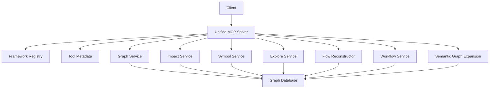
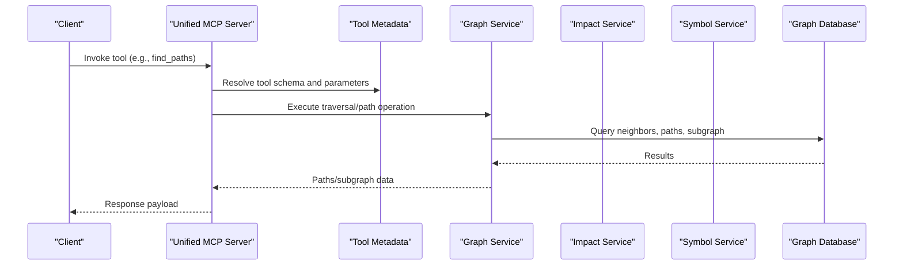
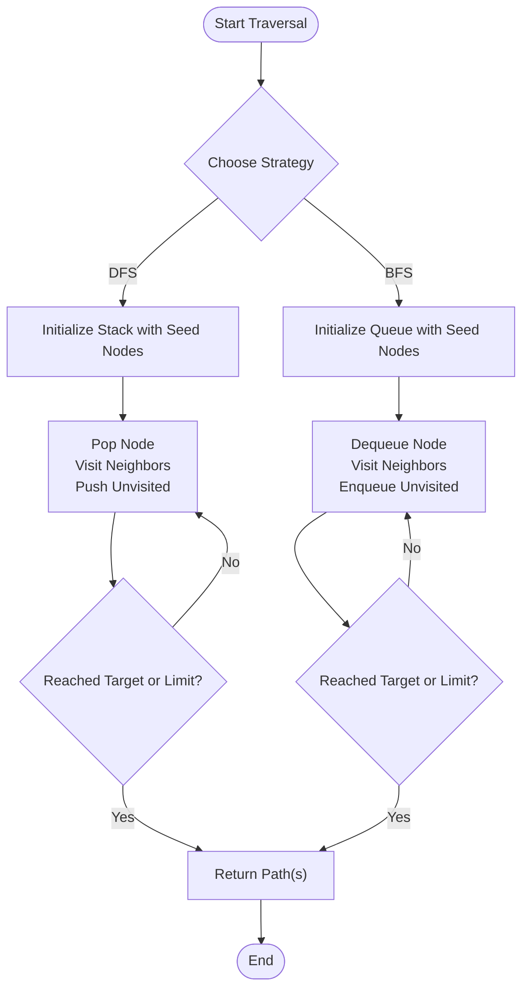
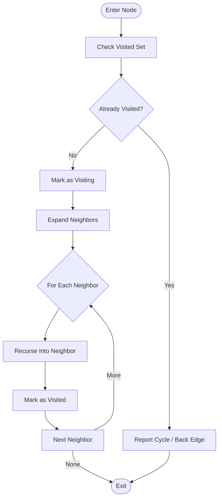
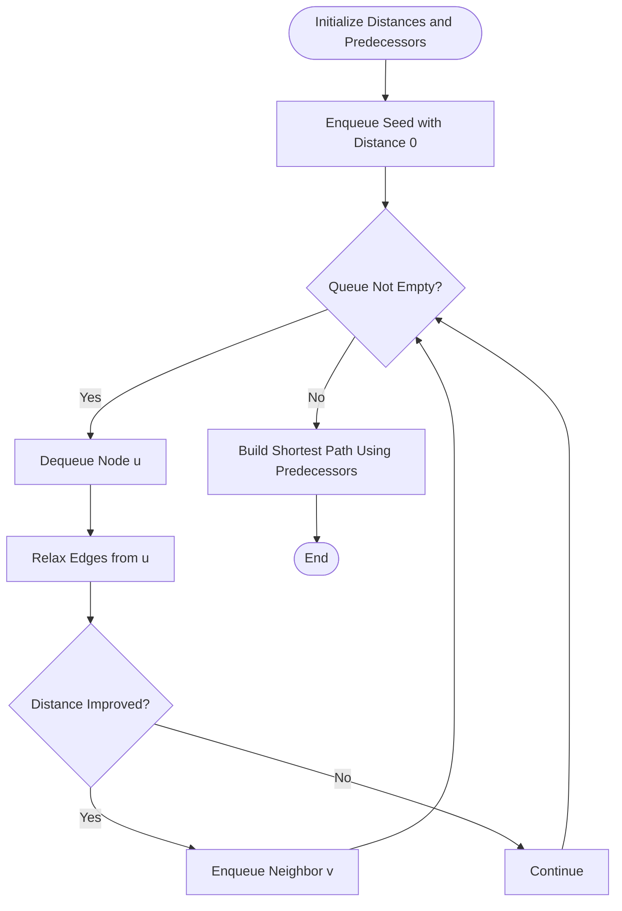
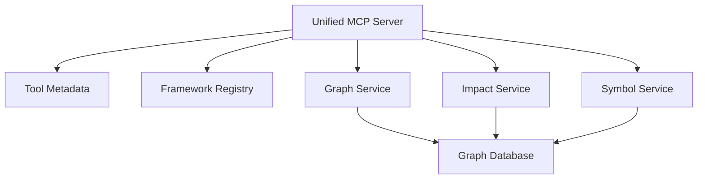

# Traversal & Path Operations

<cite>
**Referenced Files in This Document**
- [graph_service.py](file://code-tiny/mcp/services/graph_service.py)
- [impact_service.py](file://code-tiny/mcp/services/impact_service.py)
- [symbol_service.py](file://code-tiny/mcp/services/symbol_service.py)
- [explore_service.py](file://code-tiny/mcp/services/explore_service.py)
- [flow_reconstructor.py](file://code-tiny/mcp/services/flow_reconstructor.py)
- [workflow_service.py](file://code-tiny/mcp/services/workflow_service.py)
- [semantic_graph_expansion.py](file://code-tiny/mcp/semantic_graph_expansion.py)
- [unified_mcp.py](file://code-tiny/mcp/unified_mcp.py)
- [fastmcp_server.py](file://code-tiny/mcp/fastmcp_server.py)
- [framework_registry.py](file://code-tiny/mcp/framework_registry.py)
- [tool_metadata.py](file://code-tiny/mcp/tool_metadata.py)
- [android_mcp.py](file://code-tiny/mcp/android/android_mcp.py)
- [cplus_mcp.py](file://code-tiny/mcp/cplus/cplus_mcp.py)
- [java_mcp.py](file://code-tiny/mcp/java/java_mcp.py)
- [android/graph_service.py](file://code-tiny/mcp/android/services/graph_service.py)
- [android/impact_service.py](file://code-tiny/mcp/android/services/impact_service.py)
- [android/symbol_service.py](file://code-tiny/mcp/android/services/symbol_service.py)
- [cplus/graph_service.py](file://code-tiny/mcp/cplus/services/graph_service.py)
- [cplus/impact_service.py](file://code-tiny/mcp/cplus/services/impact_service.py)
- [cplus/symbol_service.py](file://code-tiny/mcp/cplus/services/symbol_service.py)
- [java/graph_service.py](file://code-tiny/mcp/java/services/graph_service.py)
- [java/impact_service.py](file://code-tiny/mcp/java/services/impact_service.py)
- [java/symbol_service.py](file://code-tiny/mcp/java/services/symbol_service.py)
- [test_find_path.json](file://code-tiny/testtool/input_exam/test_find_path.json)
- [find_paths.json](file://code-tiny/testtool/input_exam/find_paths.json)
- [find_path_between_module.json](file://code-tiny/testtool/input_exam/find_path_between_module.json)
- [query_subgraph.json](file://code-tiny/testtool/input_exam/query_subgraph.json)
- [trace_flow.json](file://code-tiny/testtool/input_exam/trace_flow.json)
- [trace_flow_between_module.json](file://code-tiny/testtool/input_exam/trace_flow_between_module.json)
- [list_possible_calls.json](file://code-tiny/testtool/input_exam/list_possible_calls.json)
- [get_node_details.json](file://code-tiny/testtool/input_exam/get_node_details.json)
- [get_symbol.json](file://code-tiny/testtool/input_exam/get_symbol.json)
- [search_by_code.json](file://code-tiny/testtool/input_exam/search_by_code.json)
- [search_functions.json](file://code-tiny/testtool/input_exam/search_functions.json)
- [semantic_search.json](file://code-tiny/testtool/input_exam/semantic_search.json)
- [listup_class_matching_path.json](file://code-tiny/testtool/input_exam/listup_class_matching_path.json)
- [listup_symbols_matching_file_path.json](file://code-tiny/testtool/input_exam/listup_symbols_matching_file_path.json)
</cite>

## Table of Contents
1. [Introduction](#introduction)
2. [Project Structure](#project-structure)
3. [Core Components](#core-components)
4. [Architecture Overview](#architecture-overview)
5. [Detailed Component Analysis](#detailed-component-analysis)
6. [Dependency Analysis](#dependency-analysis)
7. [Performance Considerations](#performance-considerations)
8. [Troubleshooting Guide](#troubleshooting-guide)
9. [Conclusion](#conclusion)
10. [Appendices](#appendices)

## Introduction
This document explains graph traversal and path finding operations in Cortex Harness with a focus on navigating code relationships. It covers depth-first search (DFS), breadth-first search (BFS), custom traversal algorithms, path finding between arbitrary nodes, impact analysis traversal patterns, dependency chain exploration, cycle detection, shortest path algorithms, and subgraph extraction. Practical examples include tracing function call chains, enumerating all dependencies of a class, and identifying circular references. Performance optimization techniques for large graphs and memory management considerations are also provided.

## Project Structure
The traversal and path capabilities are exposed via MCP services and tools that operate over a code graph stored in a graph database. The key modules include:
- Graph service: core traversal primitives (neighbors, paths, subgraphs)
- Impact service: forward/backward impact propagation
- Symbol service: symbol resolution and lookup
- Explore service: higher-level exploration workflows
- Flow reconstructor: reconstructs execution flows from graph edges
- Workflow service: orchestrates multi-step analyses
- Semantic graph expansion: augments the graph with inferred relationships
- Unified MCP server and framework-specific adapters: expose APIs to clients

[No sources needed since this diagram shows conceptual workflow, not actual code structure]

## Core Components
- Graph Service: Provides fundamental traversal operations such as neighbor enumeration, path queries, and subgraph extraction. These form the building blocks for DFS/BFS and custom traversals.
- Impact Service: Implements forward and backward impact propagation across the code graph, enabling change impact analysis and dependency chain exploration.
- Symbol Service: Resolves symbols by name or location and returns node details, supporting targeted traversal starting points.
- Explore Service: Orchestrates complex explorations combining multiple graph operations, including path finding and subgraph queries.
- Flow Reconstructor: Builds execution flows by stitching together call edges and related relationships.
- Workflow Service: Coordinates multi-step workflows that may combine traversal, impact, and semantic expansion.
- Semantic Graph Expansion: Enriches the graph with inferred relationships to improve traversal quality and coverage.
- Unified MCP Server and Framework Adapters: Expose these capabilities through a consistent API surface for different languages and frameworks.

**Section sources**
- [graph_service.py](file://code-tiny/mcp/services/graph_service.py)
- [impact_service.py](file://code-tiny/mcp/services/impact_service.py)
- [symbol_service.py](file://code-tiny/mcp/services/symbol_service.py)
- [explore_service.py](file://code-tiny/mcp/services/explore_service.py)
- [flow_reconstructor.py](file://code-tiny/mcp/services/flow_reconstructor.py)
- [workflow_service.py](file://code-tiny/mcp/services/workflow_service.py)
- [semantic_graph_expansion.py](file://code-tiny/mcp/semantic_graph_expansion.py)
- [unified_mcp.py](file://code-tiny/mcp/unified_mcp.py)
- [fastmcp_server.py](file://code-tiny/mcp/fastmcp_server.py)
- [framework_registry.py](file://code-tiny/mcp/framework_registry.py)
- [tool_metadata.py](file://code-tiny/mcp/tool_metadata.py)

## Architecture Overview
The system exposes traversal and path operations via MCP tools. Clients invoke tools like find_paths, query_subgraph, trace_flow, and list_possible_calls. The unified server routes requests to the appropriate service layer, which performs graph operations against the underlying graph store.

**Diagram sources**
- [unified_mcp.py](file://code-tiny/mcp/unified_mcp.py)
- [tool_metadata.py](file://code-tiny/mcp/tool_metadata.py)
- [graph_service.py](file://code-tiny/mcp/services/graph_service.py)
- [impact_service.py](file://code-tiny/mcp/services/impact_service.py)
- [symbol_service.py](file://code-tiny/mcp/services/symbol_service.py)

**Section sources**
- [unified_mcp.py](file://code-tiny/mcp/unified_mcp.py)
- [fastmcp_server.py](file://code-tiny/mcp/fastmcp_server.py)
- [framework_registry.py](file://code-tiny/mcp/framework_registry.py)
- [tool_metadata.py](file://code-tiny/mcp/tool_metadata.py)

## Detailed Component Analysis

### Graph Service: Traversal Primitives
The Graph Service implements core traversal operations used by DFS, BFS, and custom traversals. Typical capabilities include:
- Neighbor enumeration for both directions (incoming/outgoing)
- Path queries between two nodes with optional constraints
- Subgraph extraction around a seed set
- Filtering by edge types and node labels

These primitives enable:
- DFS/BFS implementations at higher layers
- Custom traversals that mix strategies (e.g., BFS up to depth N then DFS)
- Efficient impact analysis by limiting scope

Practical usage patterns:
- Tracing function call chains: start from a function node, follow outgoing call edges, optionally limit depth
- Finding all dependencies of a class: start from a class node, traverse incoming reference edges, collect unique targets
- Identifying circular references: detect cycles during traversal using visited sets and back-edge checks

**Section sources**
- [graph_service.py](file://code-tiny/mcp/services/graph_service.py)

### Impact Service: Forward/Backward Propagation
The Impact Service provides impact analysis traversal patterns:
- Backward impact: given a changed node, enumerate upstream dependencies that could be affected
- Forward impact: given a changed node, enumerate downstream consumers that may break
- Depth-limited propagation to bound cost
- Edge-type filtering to focus on relevant relationships (e.g., calls vs. imports)

Use cases:
- Change impact assessment before refactoring
- Dependency chain exploration for debugging
- Risk scoring based on reachability

**Section sources**
- [impact_service.py](file://code-tiny/mcp/services/impact_service.py)

### Symbol Service: Resolution and Node Details
The Symbol Service supports:
- Symbol lookup by name, file path, or other identifiers
- Retrieving node details for traversal seeds
- Disambiguation when multiple symbols match

Use cases:
- Starting point selection for traversal
- Validating target nodes before path queries
- Building user-friendly results with rich metadata

**Section sources**
- [symbol_service.py](file://code-tiny/mcp/services/symbol_service.py)

### Explore Service: Multi-Step Exploration Workflows
The Explore Service composes multiple operations into cohesive workflows:
- Combining symbol resolution, traversal, and subgraph extraction
- Applying filters and aggregations
- Returning structured results suitable for UI or downstream processing

Use cases:
- End-to-end “show me everything related to X” queries
- Interactive exploration where users refine scopes iteratively

**Section sources**
- [explore_service.py](file://code-tiny/mcp/services/explore_service.py)

### Flow Reconstructor: Execution Flow Reconstruction
The Flow Reconstructor stitches together call edges and related relationships to produce coherent execution flows:
- Aggregates call sites and callees
- Merges parallel branches and loops
- Produces linearized or branching flow representations

Use cases:
- Tracing function call chains end-to-end
- Understanding control flow across modules

**Section sources**
- [flow_reconstructor.py](file://code-tiny/mcp/services/flow_reconstructor.py)

### Workflow Service: Orchestration
The Workflow Service coordinates multi-step analyses:
- Sequencing traversal, impact, and semantic expansion steps
- Managing state and intermediate results
- Providing progress and error reporting

Use cases:
- Complex analyses requiring multiple passes
- Batch operations over many seeds

**Section sources**
- [workflow_service.py](file://code-tiny/mcp/services/workflow_service.py)

### Semantic Graph Expansion: Inferred Relationships
The Semantic Graph Expansion enriches the graph with inferred relationships:
- Augmenting explicit edges with implicit ones (e.g., interface implementations)
- Improving traversal completeness and accuracy

Use cases:
- Enhancing impact analysis coverage
- Filling gaps in sparse graphs

**Section sources**
- [semantic_graph_expansion.py](file://code-tiny/mcp/semantic_graph_expansion.py)

### Unified MCP Server and Framework Adapters
The Unified MCP Server and framework-specific adapters expose traversal and path operations consistently:
- Routing tool calls to appropriate services
- Normalizing inputs and outputs
- Supporting language-specific nuances while preserving a common API

Examples:
- Android, C++, Java adapters provide specialized behaviors while reusing shared services

**Section sources**
- [unified_mcp.py](file://code-tiny/mcp/unified_mcp.py)
- [fastmcp_server.py](file://code-tiny/mcp/fastmcp_server.py)
- [framework_registry.py](file://code-tiny/mcp/framework_registry.py)
- [android_mcp.py](file://code-tiny/mcp/android/android_mcp.py)
- [cplus_mcp.py](file://code-tiny/mcp/cplus/cplus_mcp.py)
- [java_mcp.py](file://code-tiny/mcp/java/java_mcp.py)
- [android/graph_service.py](file://code-tiny/mcp/android/services/graph_service.py)
- [android/impact_service.py](file://code-tiny/mcp/android/services/impact_service.py)
- [android/symbol_service.py](file://code-tiny/mcp/android/services/symbol_service.py)
- [cplus/graph_service.py](file://code-tiny/mcp/cplus/services/graph_service.py)
- [cplus/impact_service.py](file://code-tiny/mcp/cplus/services/impact_service.py)
- [cplus/symbol_service.py](file://code-tiny/mcp/cplus/services/symbol_service.py)
- [java/graph_service.py](file://code-tiny/mcp/java/services/graph_service.py)
- [java/impact_service.py](file://code-tiny/mcp/java/services/impact_service.py)
- [java/symbol_service.py](file://code-tiny/mcp/java/services/symbol_service.py)

### Conceptual Overview
The following diagrams illustrate typical traversal and path operations conceptually. They map to the services described above but do not depict specific source files.

#### DFS and BFS Patterns

[No sources needed since this diagram shows conceptual workflow, not actual code structure]

#### Cycle Detection During Traversal

[No sources needed since this diagram shows conceptual workflow, not actual code structure]

#### Shortest Path Algorithm (Conceptual)

[No sources needed since this diagram shows conceptual workflow, not actual code structure]

## Dependency Analysis
The MCP server depends on tool metadata and framework registry to route and validate requests. Services depend on the graph database for storage and retrieval.

**Diagram sources**
- [unified_mcp.py](file://code-tiny/mcp/unified_mcp.py)
- [tool_metadata.py](file://code-tiny/mcp/tool_metadata.py)
- [framework_registry.py](file://code-tiny/mcp/framework_registry.py)
- [graph_service.py](file://code-tiny/mcp/services/graph_service.py)
- [impact_service.py](file://code-tiny/mcp/services/impact_service.py)
- [symbol_service.py](file://code-tiny/mcp/services/symbol_service.py)

**Section sources**
- [unified_mcp.py](file://code-tiny/mcp/unified_mcp.py)
- [tool_metadata.py](file://code-tiny/mcp/tool_metadata.py)
- [framework_registry.py](file://code-tiny/mcp/framework_registry.py)

## Performance Considerations
- Depth and breadth limits: Always constrain traversal depth and fan-out to avoid exponential blow-up. Use configurable limits per operation.
- Early termination: Stop traversal once targets are found or sufficient context is gathered.
- Incremental updates: Prefer incremental sync and caching to reduce recomputation.
- Streaming results: For large result sets, stream responses instead of materializing entire subgraphs in memory.
- Indexing and queries: Ensure graph indexes exist for frequently queried labels and edge types.
- Memory management: Avoid retaining full path histories; keep only necessary predecessors for reconstruction.
- Parallelism: Where safe, parallelize independent branches of traversal, respecting concurrency limits.
- Edge filtering: Narrow edge types early to reduce work.
- Subgraph pruning: Remove low-value nodes/edges before returning results.

[No sources needed since this section provides general guidance]

## Troubleshooting Guide
Common issues and remedies:
- No paths found: Verify seed nodes exist and edge types match expectations. Use symbol lookup to confirm identifiers.
- Long-running queries: Reduce depth, filter edge types, or narrow scope with additional predicates.
- Cycles causing hangs: Implement visited sets and back-edge detection; cap recursion depth.
- Large subgraphs: Apply pruning and pagination; return summaries first.
- Inconsistent results: Ensure graph consistency and run semantic expansion if needed.

Operational hints:
- Use get_node_details to validate seeds before traversal.
- Use list_possible_calls to understand available call edges for a function.
- Use trace_flow to reconstruct execution flows when path queries are insufficient.

**Section sources**
- [symbol_service.py](file://code-tiny/mcp/services/symbol_service.py)
- [graph_service.py](file://code-tiny/mcp/services/graph_service.py)
- [flow_reconstructor.py](file://code-tiny/mcp/services/flow_reconstructor.py)

## Conclusion
Cortex Harness provides robust traversal and path finding capabilities through a layered architecture centered on the Graph Service, complemented by Impact, Symbol, Explore, Flow Reconstructor, and Workflow services. These components support DFS, BFS, custom traversals, path finding, impact analysis, dependency chain exploration, cycle detection, shortest path computation, and subgraph extraction. By applying performance best practices—depth/breadth limits, early termination, streaming, indexing, and careful memory management—you can efficiently navigate large code graphs and deliver actionable insights.

[No sources needed since this section summarizes without analyzing specific files]

## Appendices

### Practical Examples and Test Inputs
The repository includes test input fixtures demonstrating how to invoke traversal and path operations via MCP tools. These can guide implementation and validation:

- Find paths between nodes: [find_paths.json](file://code-tiny/testtool/input_exam/find_paths.json), [test_find_path.json](file://code-tiny/testtool/input_exam/test_find_path.json), [find_path_between_module.json](file://code-tiny/testtool/input_exam/find_path_between_module.json)
- Subgraph queries: [query_subgraph.json](file://code-tiny/testtool/input_exam/query_subgraph.json)
- Trace execution flows: [trace_flow.json](file://code-tiny/testtool/input_exam/trace_flow.json), [trace_flow_between_module.json](file://code-tiny/testtool/input_exam/trace_flow_between_module.json)
- Discover possible calls: [list_possible_calls.json](file://code-tiny/testtool/input_exam/list_possible_calls.json)
- Retrieve node and symbol details: [get_node_details.json](file://code-tiny/testtool/input_exam/get_node_details.json), [get_symbol.json](file://code-tiny/testtool/input_exam/get_symbol.json)
- Search and semantic search: [search_by_code.json](file://code-tiny/testtool/input_exam/search_by_code.json), [search_functions.json](file://code-tiny/testtool/input_exam/search_functions.json), [semantic_search.json](file://code-tiny/testtool/input_exam/semantic_search.json)
- Class and symbol matching: [listup_class_matching_path.json](file://code-tiny/testtool/input_exam/listup_class_matching_path.json), [listup_symbols_matching_file_path.json](file://code-tiny/testtool/input_exam/listup_symbols_matching_file_path.json)

**Section sources**
- [find_paths.json](file://code-tiny/testtool/input_exam/find_paths.json)
- [test_find_path.json](file://code-tiny/testtool/input_exam/test_find_path.json)
- [find_path_between_module.json](file://code-tiny/testtool/input_exam/find_path_between_module.json)
- [query_subgraph.json](file://code-tiny/testtool/input_exam/query_subgraph.json)
- [trace_flow.json](file://code-tiny/testtool/input_exam/trace_flow.json)
- [trace_flow_between_module.json](file://code-tiny/testtool/input_exam/trace_flow_between_module.json)
- [list_possible_calls.json](file://code-tiny/testtool/input_exam/list_possible_calls.json)
- [get_node_details.json](file://code-tiny/testtool/input_exam/get_node_details.json)
- [get_symbol.json](file://code-tiny/testtool/input_exam/get_symbol.json)
- [search_by_code.json](file://code-tiny/testtool/input_exam/search_by_code.json)
- [search_functions.json](file://code-tiny/testtool/input_exam/search_functions.json)
- [semantic_search.json](file://code-tiny/testtool/input_exam/semantic_search.json)
- [listup_class_matching_path.json](file://code-tiny/testtool/input_exam/listup_class_matching_path.json)
- [listup_symbols_matching_file_path.json](file://code-tiny/testtool/input_exam/listup_symbols_matching_file_path.json)