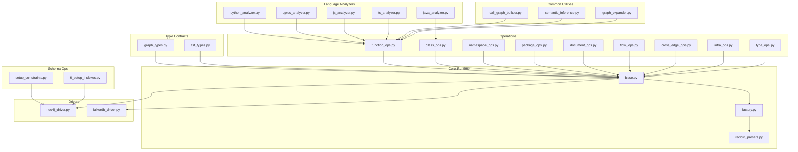
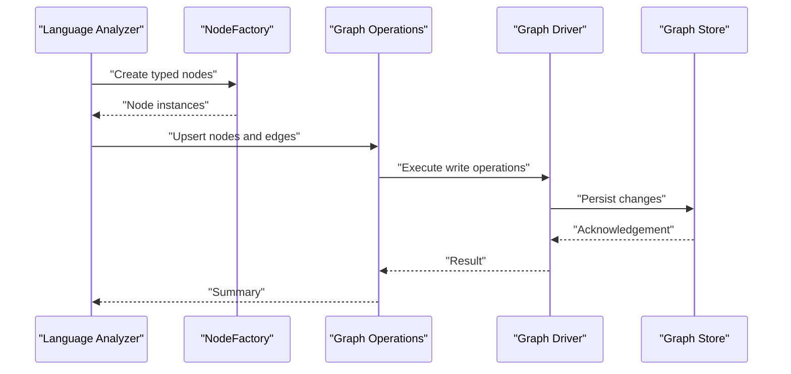
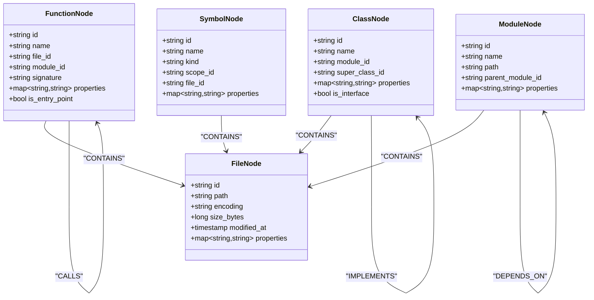
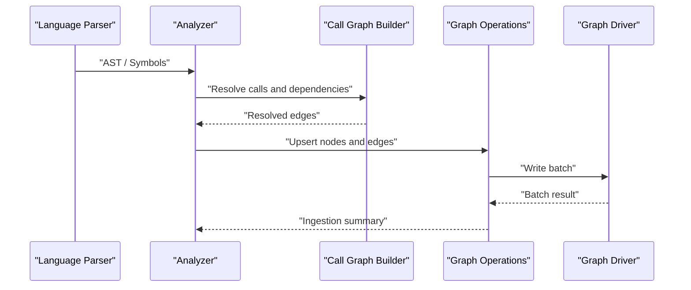
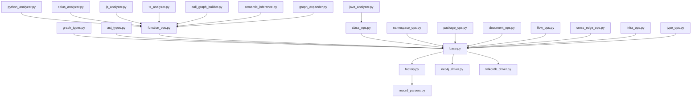

# Graph Schema Design

<cite>
**Referenced Files in This Document**
- [graph_types.py](file://code-tiny/tools/ts/types/graph_types.py)
- [ast_types.py](file://code-tiny/tools/ts/types/ast_types.py)
- [base.py](file://code-tiny/tools/graph/core/base.py)
- [factory.py](file://code-tiny/tools/graph/core/factory.py)
- [record_parsers.py](file://code-tiny/tools/graph/core/record_parsers.py)
- [neo4j_driver.py](file://code-tiny/tools/graph/driver/neo4j_driver.py)
- [falkordb_driver.py](file://code-tiny/tools/graph/driver/falkordb_driver.py)
- [function_ops.py](file://code-tiny/tools/graph/operations/function_ops.py)
- [class_ops.py](file://code-tiny/tools/graph/operations/class_ops.py)
- [namespace_ops.py](file://code-tiny/tools/graph/operations/namespace_ops.py)
- [package_ops.py](file://code-tiny/tools/graph/operations/package_ops.py)
- [document_ops.py](file://code-tiny/tools/graph/operations/document_ops.py)
- [flow_ops.py](file://code-tiny/tools/graph/operations/flow_ops.py)
- [cross_edge_ops.py](file://code-tiny/tools/graph/operations/cross_edge_ops.py)
- [infra_ops.py](file://code-tiny/tools/graph/operations/infra_ops.py)
- [type_ops.py](file://code-tiny/tools/graph/operations/type_ops.py)
- [python_analyzer.py](file://code-tiny/tools/python/python_analyzer.py)
- [java_analyzer.py](file://code-tiny/tools/java/java_analyzer.py)
- [cplus_analyzer.py](file://code-tiny/tools/cplus/cplus_analyzer.py)
- [js_analyzer.py](file://code-tiny/tools/js/js_analyzer.py)
- [ts_analyzer.py](file://code-tiny/tools/ts/ts_analyzer.py)
- [call_graph_builder.py](file://code-tiny/tools/common/call_graph_builder.py)
- [semantic_inference.py](file://code-tiny/tools/common/semantic_inference.py)
- [graph_expander.py](file://code-tiny/tools/common/graph_expander.py)
- [setup_constraints.py](file://code-tiny/scripts/setup_constraints.py)
- [6_setup_indexes.py](file://doc-tiny/6_setup_indexes.py)
- [IMPLEMENTATION_SUMMARY.md](file://code-tiny/tools/graph/docs/IMPLEMENTATION_SUMMARY.md)
- [QUICK_REFERENCE.md](file://code-tiny/tools/graph/docs/QUICK_REFERENCE.md)
- [QUERY_METHODS.md](file://code-tiny/tools/graph/docs/QUERY_METHODS.md)
</cite>

## Table of Contents
1. [Introduction](#introduction)
2. [Project Structure](#project-structure)
3. [Core Components](#core-components)
4. [Architecture Overview](#architecture-overview)
5. [Detailed Component Analysis](#detailed-component-analysis)
6. [Dependency Analysis](#dependency-analysis)
7. [Performance Considerations](#performance-considerations)
8. [Troubleshooting Guide](#troubleshooting-guide)
9. [Conclusion](#conclusion)
10. [Appendices](#appendices)

## Introduction
This document defines the graph schema used by Cortex Harness to represent semantic code across multiple programming languages and frameworks. It focuses on core node types (FunctionNode, ClassNode, ModuleNode, FileNode, SymbolNode), edge relationship types (IMPORTS, CALLS, EXTENDS, IMPLEMENTS, CONTAINS, DEPENDS_ON), hierarchical structure from files to functions, class inheritance hierarchies, and module dependency graphs. It also provides schema validation rules, indexing strategies for common query patterns, versioning considerations for schema evolution, examples mapping typical code structures to nodes and edges, and best practices for maintaining schema consistency across languages.

## Project Structure
The graph schema is implemented as a layered system:
- Type contracts define canonical node and edge schemas.
- Core runtime provides base classes, factory creation, and record parsing utilities.
- Drivers abstract storage backends (Neo4j, FalkorDB).
- Operations encapsulate CRUD and traversal helpers for each node type and relationship category.
- Language analyzers populate the graph using these operations.
- Common utilities build call graphs, perform semantic inference, and expand subgraphs.
- Scripts set up constraints and indexes for performance and integrity.

**Diagram sources**
- [graph_types.py](file://code-tiny/tools/ts/types/graph_types.py)
- [ast_types.py](file://code-tiny/tools/ts/types/ast_types.py)
- [base.py](file://code-tiny/tools/graph/core/base.py)
- [factory.py](file://code-tiny/tools/graph/core/factory.py)
- [record_parsers.py](file://code-tiny/tools/graph/core/record_parsers.py)
- [neo4j_driver.py](file://code-tiny/tools/graph/driver/neo4j_driver.py)
- [falkordb_driver.py](file://code-tiny/tools/graph/driver/falkordb_driver.py)
- [function_ops.py](file://code-tiny/tools/graph/operations/function_ops.py)
- [class_ops.py](file://code-tiny/tools/graph/operations/class_ops.py)
- [namespace_ops.py](file://code-tiny/tools/graph/operations/namespace_ops.py)
- [package_ops.py](file://code-tiny/tools/graph/operations/package_ops.py)
- [document_ops.py](file://code-tiny/tools/graph/operations/document_ops.py)
- [flow_ops.py](file://code-tiny/tools/graph/operations/flow_ops.py)
- [cross_edge_ops.py](file://code-tiny/tools/graph/operations/cross_edge_ops.py)
- [infra_ops.py](file://code-tiny/tools/graph/operations/infra_ops.py)
- [type_ops.py](file://code-tiny/tools/graph/operations/type_ops.py)
- [python_analyzer.py](file://code-tiny/tools/python/python_analyzer.py)
- [java_analyzer.py](file://code-tiny/tools/java/java_analyzer.py)
- [cplus_analyzer.py](file://code-tiny/tools/cplus/cplus_analyzer.py)
- [js_analyzer.py](file://code-tiny/tools/js/js_analyzer.py)
- [ts_analyzer.py](file://code-tiny/tools/ts/ts_analyzer.py)
- [call_graph_builder.py](file://code-tiny/tools/common/call_graph_builder.py)
- [semantic_inference.py](file://code-tiny/tools/common/semantic_inference.py)
- [graph_expander.py](file://code-tiny/tools/common/graph_expander.py)
- [setup_constraints.py](file://code-tiny/scripts/setup_constraints.py)
- [6_setup_indexes.py](file://doc-tiny/6_setup_indexes.py)

**Section sources**
- [graph_types.py](file://code-tiny/tools/ts/types/graph_types.py)
- [ast_types.py](file://code-tiny/tools/ts/types/ast_types.py)
- [base.py](file://code-tiny/tools/graph/core/base.py)
- [factory.py](file://code-tiny/tools/graph/core/factory.py)
- [record_parsers.py](file://code-tiny/tools/graph/core/record_parsers.py)
- [neo4j_driver.py](file://code-tiny/tools/graph/driver/neo4j_driver.py)
- [falkordb_driver.py](file://code-tiny/tools/graph/driver/falkordb_driver.py)
- [function_ops.py](file://code-tiny/tools/graph/operations/function_ops.py)
- [class_ops.py](file://code-tiny/tools/graph/operations/class_ops.py)
- [namespace_ops.py](file://code-tiny/tools/graph/operations/namespace_ops.py)
- [package_ops.py](file://code-tiny/tools/graph/operations/package_ops.py)
- [document_ops.py](file://code-tiny/tools/graph/operations/document_ops.py)
- [flow_ops.py](file://code-tiny/tools/graph/operations/flow_ops.py)
- [cross_edge_ops.py](file://code-tiny/tools/graph/operations/cross_edge_ops.py)
- [infra_ops.py](file://code-tiny/tools/graph/operations/infra_ops.py)
- [type_ops.py](file://code-tiny/tools/graph/operations/type_ops.py)
- [python_analyzer.py](file://code-tiny/tools/python/python_analyzer.py)
- [java_analyzer.py](file://code-tiny/tools/java/java_analyzer.py)
- [cplus_analyzer.py](file://code-tiny/tools/cplus/cplus_analyzer.py)
- [js_analyzer.py](file://code-tiny/tools/js/js_analyzer.py)
- [ts_analyzer.py](file://code-tiny/tools/ts/ts_analyzer.py)
- [call_graph_builder.py](file://code-tiny/tools/common/call_graph_builder.py)
- [semantic_inference.py](file://code-tiny/tools/common/semantic_inference.py)
- [graph_expander.py](file://code-tiny/tools/common/graph_expander.py)
- [setup_constraints.py](file://code-tiny/scripts/setup_constraints.py)
- [6_setup_indexes.py](file://doc-tiny/6_setup_indexes.py)

## Core Components
This section documents the canonical node types and edge semantics that underpin the semantic graph.

- Node Types
  - FunctionNode: Represents executable units such as methods, functions, procedures, or entry points. Properties include identifiers, location metadata, signature descriptors, visibility, and language-specific attributes. Constraints enforce uniqueness per scope and file linkage.
  - ClassNode: Represents class-like constructs including interfaces, structs, records, and traits. Properties include name, namespace, visibility, generics, and implementation details. Constraints ensure unique identity within namespaces and consistent parent-child relationships.
  - ModuleNode: Represents logical modules, packages, or namespaces. Properties include path-based identity, display names, and framework overlays. Constraints maintain hierarchical containment and uniqueness per repository root.
  - FileNode: Represents source files or artifacts. Properties include absolute paths, encodings, sizes, and timestamps. Constraints enforce file-level uniqueness and linkage to modules.
  - SymbolNode: Represents symbols such as variables, constants, parameters, and references. Properties include symbol kind, scope, and resolution hints. Constraints ensure scoping rules and reference validity.

- Edge Relationship Types
  - IMPORTS: Directed from importer to imported artifact (module, package, library). Metadata may include import alias, static vs dynamic classification, and confidence scores.
  - CALLS: Directed from caller to callee function/method. Metadata includes call site context, argument positions, inferred vs explicit calls, and confidence.
  - EXTENDS: Directed from subclass to superclass. Metadata captures inheritance depth and override flags.
  - IMPLEMENTS: Directed from class/interface to interface or abstract contract. Metadata includes method signatures and optional default implementations.
  - CONTAINS: Hierarchical containment from container to contained elements (e.g., module to file, class to method, file to symbol). Direction indicates ownership.
  - DEPENDS_ON: General-purpose dependency link between components with provenance and strength metadata.

- Hierarchical Structure
  - Repository -> Module -> File -> Class/Function -> Symbol
  - Inheritance chains via EXTENDS and IMPLEMENTS form class hierarchies.
  - Dependency graphs via IMPORTS and DEPENDS_ON connect modules and external libraries.

- Versioning and Evolution
  - Nodes and edges carry version fields to support schema evolution without breaking queries.
  - Backward-compatible additions are encouraged; removals require migration scripts and deprecation windows.

**Section sources**
- [graph_types.py](file://code-tiny/tools/ts/types/graph_types.py)
- [ast_types.py](file://code-tiny/tools/ts/types/ast_types.py)
- [function_ops.py](file://code-tiny/tools/graph/operations/function_ops.py)
- [class_ops.py](file://code-tiny/tools/graph/operations/class_ops.py)
- [namespace_ops.py](file://code-tiny/tools/graph/operations/namespace_ops.py)
- [package_ops.py](file://code-tiny/tools/graph/operations/package_ops.py)
- [document_ops.py](file://code-tiny/tools/graph/operations/document_ops.py)
- [flow_ops.py](file://code-tiny/tools/graph/operations/flow_ops.py)
- [cross_edge_ops.py](file://code-tiny/tools/graph/operations/cross_edge_ops.py)
- [infra_ops.py](file://code-tiny/tools/graph/operations/infra_ops.py)
- [type_ops.py](file://code-tiny/tools/graph/operations/type_ops.py)

## Architecture Overview
The architecture separates concerns into type contracts, core runtime, drivers, operations, analyzers, and utilities. The following diagram maps the primary interactions.

**Diagram sources**
- [factory.py](file://code-tiny/tools/graph/core/factory.py)
- [function_ops.py](file://code-tiny/tools/graph/operations/function_ops.py)
- [class_ops.py](file://code-tiny/tools/graph/operations/class_ops.py)
- [namespace_ops.py](file://code-tiny/tools/graph/operations/namespace_ops.py)
- [package_ops.py](file://code-tiny/tools/graph/operations/package_ops.py)
- [document_ops.py](file://code-tiny/tools/graph/operations/document_ops.py)
- [flow_ops.py](file://code-tiny/tools/graph/operations/flow_ops.py)
- [cross_edge_ops.py](file://code-tiny/tools/graph/operations/cross_edge_ops.py)
- [infra_ops.py](file://code-tiny/tools/graph/operations/infra_ops.py)
- [type_ops.py](file://code-tiny/tools/graph/operations/type_ops.py)
- [neo4j_driver.py](file://code-tiny/tools/graph/driver/neo4j_driver.py)
- [falkordb_driver.py](file://code-tiny/tools/graph/driver/falkordb_driver.py)

## Detailed Component Analysis

### Node Types and Relationships
This section explains how nodes and edges are modeled and validated.

**Diagram sources**
- [graph_types.py](file://code-tiny/tools/ts/types/graph_types.py)
- [ast_types.py](file://code-tiny/tools/ts/types/ast_types.py)
- [function_ops.py](file://code-tiny/tools/graph/operations/function_ops.py)
- [class_ops.py](file://code-tiny/tools/graph/operations/class_ops.py)
- [namespace_ops.py](file://code-tiny/tools/graph/operations/namespace_ops.py)
- [package_ops.py](file://code-tiny/tools/graph/operations/package_ops.py)
- [document_ops.py](file://code-tiny/tools/graph/operations/document_ops.py)
- [flow_ops.py](file://code-tiny/tools/graph/operations/flow_ops.py)
- [cross_edge_ops.py](file://code-tiny/tools/graph/operations/cross_edge_ops.py)
- [infra_ops.py](file://code-tiny/tools/graph/operations/infra_ops.py)
- [type_ops.py](file://code-tiny/tools/graph/operations/type_ops.py)

**Section sources**
- [graph_types.py](file://code-tiny/tools/ts/types/graph_types.py)
- [ast_types.py](file://code-tiny/tools/ts/types/ast_types.py)
- [function_ops.py](file://code-tiny/tools/graph/operations/function_ops.py)
- [class_ops.py](file://code-tiny/tools/graph/operations/class_ops.py)
- [namespace_ops.py](file://code-tiny/tools/graph/operations/namespace_ops.py)
- [package_ops.py](file://code-tiny/tools/graph/operations/package_ops.py)
- [document_ops.py](file://code-tiny/tools/graph/operations/document_ops.py)
- [flow_ops.py](file://code-tiny/tools/graph/operations/flow_ops.py)
- [cross_edge_ops.py](file://code-tiny/tools/graph/operations/cross_edge_ops.py)
- [infra_ops.py](file://code-tiny/tools/graph/operations/infra_ops.py)
- [type_ops.py](file://code-tiny/tools/graph/operations/type_ops.py)

### Edge Semantics and Metadata
Edges capture directional semantics and rich metadata:
- IMPORTS: From importer to imported module/package/library. Metadata includes alias, static/dynamic flag, and confidence.
- CALLS: From caller to callee. Metadata includes call site line/column, argument count, inferred vs explicit, and confidence.
- EXTENDS: From subclass to superclass. Metadata includes override flags and depth.
- IMPLEMENTS: From implementing class to interface. Metadata includes method signatures and defaults.
- CONTAINS: Container to contained element. Indicates ownership and hierarchy.
- DEPENDS_ON: General dependency with provenance and strength.

These semantics are enforced through operation helpers and validated at ingestion time.

**Section sources**
- [cross_edge_ops.py](file://code-tiny/tools/graph/operations/cross_edge_ops.py)
- [flow_ops.py](file://code-tiny/tools/graph/operations/flow_ops.py)
- [call_graph_builder.py](file://code-tiny/tools/common/call_graph_builder.py)

### Ingestion Flow: Analyzers to Graph
Analyzers parse source code and produce nodes and edges using the operations layer.

**Diagram sources**
- [python_analyzer.py](file://code-tiny/tools/python/python_analyzer.py)
- [java_analyzer.py](file://code-tiny/tools/java/java_analyzer.py)
- [cplus_analyzer.py](file://code-tiny/tools/cplus/cplus_analyzer.py)
- [js_analyzer.py](file://code-tiny/tools/js/js_analyzer.py)
- [ts_analyzer.py](file://code-tiny/tools/ts/ts_analyzer.py)
- [call_graph_builder.py](file://code-tiny/tools/common/call_graph_builder.py)
- [function_ops.py](file://code-tiny/tools/graph/operations/function_ops.py)
- [class_ops.py](file://code-tiny/tools/graph/operations/class_ops.py)
- [namespace_ops.py](file://code-tiny/tools/graph/operations/namespace_ops.py)
- [package_ops.py](file://code-tiny/tools/graph/operations/package_ops.py)
- [document_ops.py](file://code-tiny/tools/graph/operations/document_ops.py)
- [flow_ops.py](file://code-tiny/tools/graph/operations/flow_ops.py)
- [cross_edge_ops.py](file://code-tiny/tools/graph/operations/cross_edge_ops.py)
- [infra_ops.py](file://code-tiny/tools/graph/operations/infra_ops.py)
- [type_ops.py](file://code-tiny/tools/graph/operations/type_ops.py)
- [neo4j_driver.py](file://code-tiny/tools/graph/driver/neo4j_driver.py)
- [falkordb_driver.py](file://code-tiny/tools/graph/driver/falkordb_driver.py)

**Section sources**
- [python_analyzer.py](file://code-tiny/tools/python/python_analyzer.py)
- [java_analyzer.py](file://code-tiny/tools/java/java_analyzer.py)
- [cplus_analyzer.py](file://code-tiny/tools/cplus/cplus_analyzer.py)
- [js_analyzer.py](file://code-tiny/tools/js/js_analyzer.py)
- [ts_analyzer.py](file://code-tiny/tools/ts/ts_analyzer.py)
- [call_graph_builder.py](file://code-tiny/tools/common/call_graph_builder.py)

### Schema Validation Rules
Validation ensures integrity and consistency:
- Uniqueness constraints on node identities (e.g., file path, module path, symbol id).
- Referential integrity for edges (target nodes must exist).
- Required properties for critical nodes (e.g., FunctionNode signature, ClassNode name).
- Confidence thresholds for inferred edges before persistence.
- Version compatibility checks for schema evolution.

Operational helpers centralize validation and error reporting.

**Section sources**
- [function_ops.py](file://code-tiny/tools/graph/operations/function_ops.py)
- [class_ops.py](file://code-tiny/tools/graph/operations/class_ops.py)
- [namespace_ops.py](file://code-tiny/tools/graph/operations/namespace_ops.py)
- [package_ops.py](file://code-tiny/tools/graph/operations/package_ops.py)
- [document_ops.py](file://code-tiny/tools/graph/operations/document_ops.py)
- [flow_ops.py](file://code-tiny/tools/graph/operations/flow_ops.py)
- [cross_edge_ops.py](file://code-tiny/tools/graph/operations/cross_edge_ops.py)
- [infra_ops.py](file://code-tiny/tools/graph/operations/infra_ops.py)
- [type_ops.py](file://code-tiny/tools/graph/operations/type_ops.py)

### Indexing Strategies
Indexes optimize common query patterns:
- File path index for fast file lookups and containment queries.
- Module path index for module traversal and dependency analysis.
- Function name and signature index for search and call resolution.
- Class name and interface index for inheritance and implementation queries.
- Symbol name and kind index for symbol resolution and cross-references.
- Edge property indexes (e.g., confidence, call site) for filtered traversals.

Index setup is automated via dedicated scripts.

**Section sources**
- [6_setup_indexes.py](file://doc-tiny/6_setup_indexes.py)
- [neo4j_driver.py](file://code-tiny/tools/graph/driver/neo4j_driver.py)
- [falkordb_driver.py](file://code-tiny/tools/graph/driver/falkordb_driver.py)

### Versioning Considerations
- Nodes and edges include version fields to support schema evolution.
- Additive changes are backward compatible; removals require migrations.
- Operation layers validate versions and apply transformations during ingestion.
- Documentation tracks schema changes and deprecations.

**Section sources**
- [graph_types.py](file://code-tiny/tools/ts/types/graph_types.py)
- [ast_types.py](file://code-tiny/tools/ts/types/ast_types.py)
- [record_parsers.py](file://code-tiny/tools/graph/core/record_parsers.py)

### Examples: Mapping Code Structures to Graph
- Python module imports and function calls map to IMPORTS and CALLS edges.
- Java class inheritance and interface implementations map to EXTENDS and IMPLEMENTS edges.
- C++ header includes and template instantiations map to IMPORTS and DEPENDS_ON edges.
- TypeScript modules and symbols map to CONTAINS and symbol references.

These mappings are produced by language analyzers and normalized via common utilities.

**Section sources**
- [python_analyzer.py](file://code-tiny/tools/python/python_analyzer.py)
- [java_analyzer.py](file://code-tiny/tools/java/java_analyzer.py)
- [cplus_analyzer.py](file://code-tiny/tools/cplus/cplus_analyzer.py)
- [js_analyzer.py](file://code-tiny/tools/js/js_analyzer.py)
- [ts_analyzer.py](file://code-tiny/tools/ts/ts_analyzer.py)
- [semantic_inference.py](file://code-tiny/tools/common/semantic_inference.py)

## Dependency Analysis
The graph schema depends on type contracts, core runtime, drivers, operations, and analyzers. The following diagram highlights key dependencies.

**Diagram sources**
- [graph_types.py](file://code-tiny/tools/ts/types/graph_types.py)
- [ast_types.py](file://code-tiny/tools/ts/types/ast_types.py)
- [base.py](file://code-tiny/tools/graph/core/base.py)
- [factory.py](file://code-tiny/tools/graph/core/factory.py)
- [record_parsers.py](file://code-tiny/tools/graph/core/record_parsers.py)
- [neo4j_driver.py](file://code-tiny/tools/graph/driver/neo4j_driver.py)
- [falkordb_driver.py](file://code-tiny/tools/graph/driver/falkordb_driver.py)
- [function_ops.py](file://code-tiny/tools/graph/operations/function_ops.py)
- [class_ops.py](file://code-tiny/tools/graph/operations/class_ops.py)
- [namespace_ops.py](file://code-tiny/tools/graph/operations/namespace_ops.py)
- [package_ops.py](file://code-tiny/tools/graph/operations/package_ops.py)
- [document_ops.py](file://code-tiny/tools/graph/operations/document_ops.py)
- [flow_ops.py](file://code-tiny/tools/graph/operations/flow_ops.py)
- [cross_edge_ops.py](file://code-tiny/tools/graph/operations/cross_edge_ops.py)
- [infra_ops.py](file://code-tiny/tools/graph/operations/infra_ops.py)
- [type_ops.py](file://code-tiny/tools/graph/operations/type_ops.py)
- [python_analyzer.py](file://code-tiny/tools/python/python_analyzer.py)
- [java_analyzer.py](file://code-tiny/tools/java/java_analyzer.py)
- [cplus_analyzer.py](file://code-tiny/tools/cplus/cplus_analyzer.py)
- [js_analyzer.py](file://code-tiny/tools/js/js_analyzer.py)
- [ts_analyzer.py](file://code-tiny/tools/ts/ts_analyzer.py)
- [call_graph_builder.py](file://code-tiny/tools/common/call_graph_builder.py)
- [semantic_inference.py](file://code-tiny/tools/common/semantic_inference.py)
- [graph_expander.py](file://code-tiny/tools/common/graph_expander.py)

**Section sources**
- [graph_types.py](file://code-tiny/tools/ts/types/graph_types.py)
- [ast_types.py](file://code-tiny/tools/ts/types/ast_types.py)
- [base.py](file://code-tiny/tools/graph/core/base.py)
- [factory.py](file://code-tiny/tools/graph/core/factory.py)
- [record_parsers.py](file://code-tiny/tools/graph/core/record_parsers.py)
- [neo4j_driver.py](file://code-tiny/tools/graph/driver/neo4j_driver.py)
- [falkordb_driver.py](file://code-tiny/tools/graph/driver/falkordb_driver.py)
- [function_ops.py](file://code-tiny/tools/graph/operations/function_ops.py)
- [class_ops.py](file://code-tiny/tools/graph/operations/class_ops.py)
- [namespace_ops.py](file://code-tiny/tools/graph/operations/namespace_ops.py)
- [package_ops.py](file://code-tiny/tools/graph/operations/package_ops.py)
- [document_ops.py](file://code-tiny/tools/graph/operations/document_ops.py)
- [flow_ops.py](file://code-tiny/tools/graph/operations/flow_ops.py)
- [cross_edge_ops.py](file://code-tiny/tools/graph/operations/cross_edge_ops.py)
- [infra_ops.py](file://code-tiny/tools/graph/operations/infra_ops.py)
- [type_ops.py](file://code-tiny/tools/graph/operations/type_ops.py)
- [python_analyzer.py](file://code-tiny/tools/python/python_analyzer.py)
- [java_analyzer.py](file://code-tiny/tools/java/java_analyzer.py)
- [cplus_analyzer.py](file://code-tiny/tools/cplus/cplus_analyzer.py)
- [js_analyzer.py](file://code-tiny/tools/js/js_analyzer.py)
- [ts_analyzer.py](file://code-tiny/tools/ts/ts_analyzer.py)
- [call_graph_builder.py](file://code-tiny/tools/common/call_graph_builder.py)
- [semantic_inference.py](file://code-tiny/tools/common/semantic_inference.py)
- [graph_expander.py](file://code-tiny/tools/common/graph_expander.py)

## Performance Considerations
- Batch writes: Use driver batching to reduce round-trips and improve throughput.
- Selective indexing: Index only high-cardinality and frequently queried properties.
- Confidence thresholds: Filter low-confidence edges to reduce noise and traversal cost.
- Incremental updates: Leverage change detection to minimize re-ingestion.
- Query optimization: Prefer indexed properties and constrained traversals.

[No sources needed since this section provides general guidance]

## Troubleshooting Guide
Common issues and resolutions:
- Constraint violations: Ensure uniqueness and referential integrity before ingestion.
- Missing indexes: Run index setup scripts to enable optimal query performance.
- Schema mismatches: Validate node and edge versions against current schema.
- Driver connectivity: Verify backend configuration and credentials.

Operational helpers provide detailed error messages and recovery steps.

**Section sources**
- [setup_constraints.py](file://code-tiny/scripts/setup_constraints.py)
- [6_setup_indexes.py](file://doc-tiny/6_setup_indexes.py)
- [neo4j_driver.py](file://code-tiny/tools/graph/driver/neo4j_driver.py)
- [falkordb_driver.py](file://code-tiny/tools/graph/driver/falkordb_driver.py)

## Conclusion
Cortex Harness implements a robust, multi-language graph schema centered on FunctionNode, ClassNode, ModuleNode, FileNode, and SymbolNode, with well-defined edge semantics (IMPORTS, CALLS, EXTENDS, IMPLEMENTS, CONTAINS, DEPENDS_ON). The layered architecture separates type contracts, core runtime, drivers, operations, and analyzers, enabling scalable ingestion and efficient querying. Schema validation, indexing strategies, and versioning considerations ensure data integrity and long-term maintainability. Best practices emphasize consistency across languages, careful indexing, and incremental updates.

[No sources needed since this section summarizes without analyzing specific files]

## Appendices

### Quick Reference
- Node and edge definitions, usage patterns, and example queries are summarized in documentation files.

**Section sources**
- [IMPLEMENTATION_SUMMARY.md](file://code-tiny/tools/graph/docs/IMPLEMENTATION_SUMMARY.md)
- [QUICK_REFERENCE.md](file://code-tiny/tools/graph/docs/QUICK_REFERENCE.md)
- [QUERY_METHODS.md](file://code-tiny/tools/graph/docs/QUERY_METHODS.md)