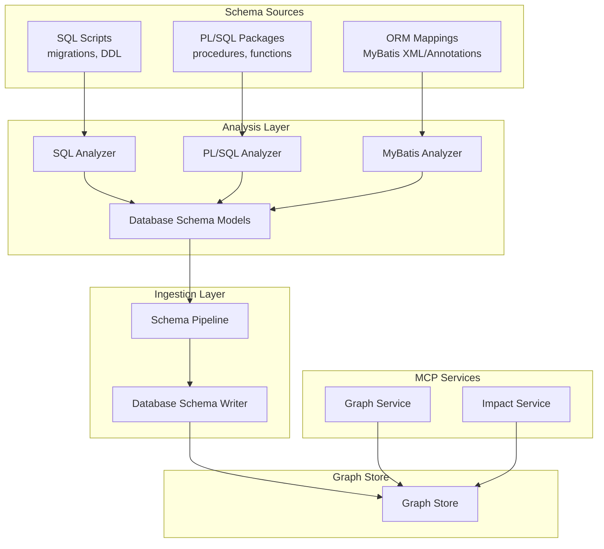
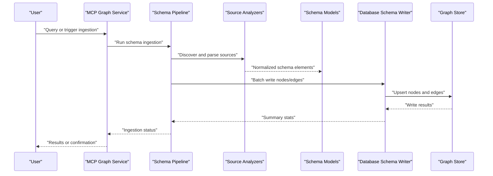
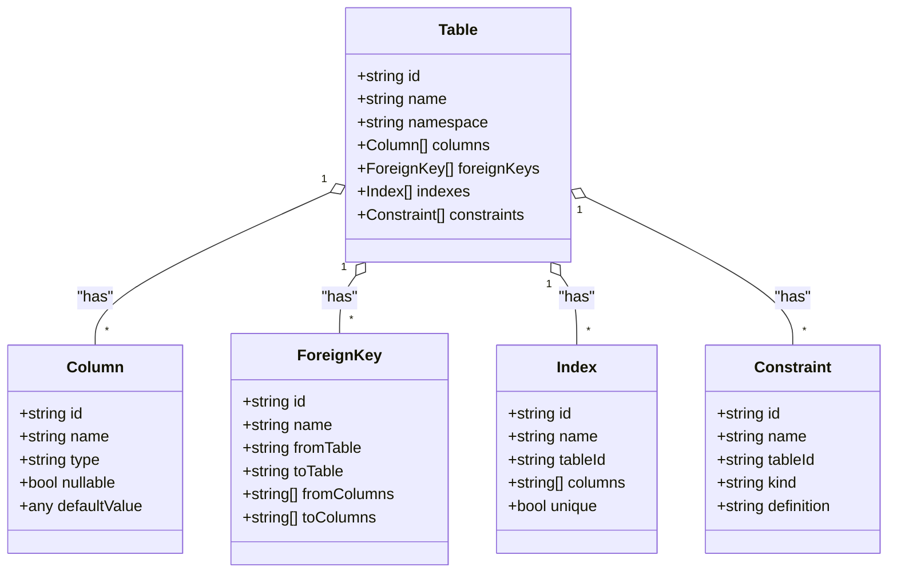
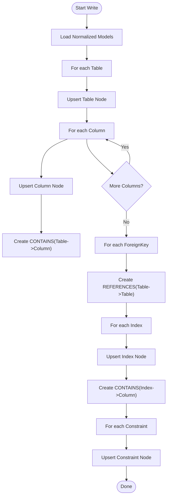
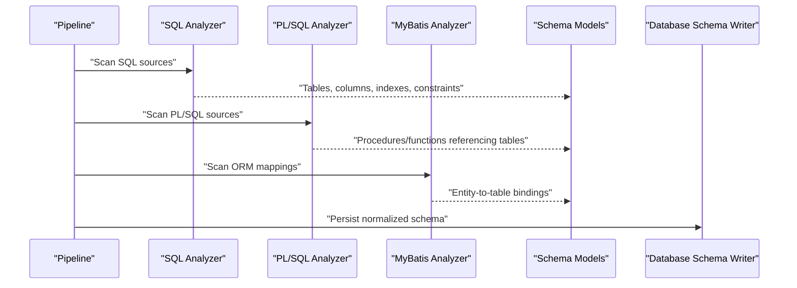
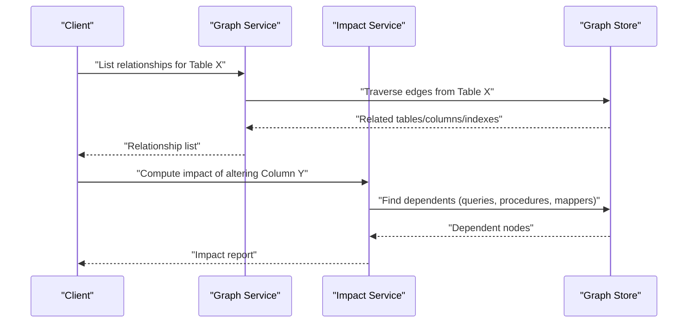
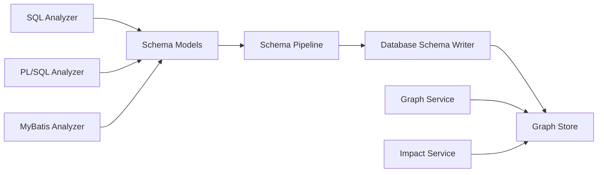

# Database Schema Writer

<cite>
**Referenced Files in This Document**
- [database_schema_writer.py](file://code-tiny/tools/graph/writer/database_schema_writer.py)
- [database_schema_analyzer.py](file://code-tiny/tools/database_schema/database_schema_analyzer.py)
- [models.py](file://code-tiny/tools/database_schema/models.py)
- [pipeline.py](file://code-tiny/tools/database_schema/pipeline.py)
- [sql_analyzer.py](file://code-tiny/tools/sql/sql_analyzer.py)
- [plsql_analyzer.py](file://code-tiny/tools/plsql/plsql_analyzer.py)
- [mybatis_analyzer.py](file://code-tiny/tools/mybatis/mybatis_analyzer.py)
- [graph_service.py](file://code-tiny/mcp/services/graph_service.py)
- [impact_service.py](file://code-tiny/mcp/services/impact_service.py)
- [test_database_schema_overlay.py](file://tests/test_database_schema_overlay.py)
</cite>

## Table of Contents
1. [Introduction](#introduction)
2. [Project Structure](#project-structure)
3. [Core Components](#core-components)
4. [Architecture Overview](#architecture-overview)
5. [Detailed Component Analysis](#detailed-component-analysis)
6. [Dependency Analysis](#dependency-analysis)
7. [Performance Considerations](#performance-considerations)
8. [Troubleshooting Guide](#troubleshooting-guide)
9. [Conclusion](#conclusion)
10. [Appendices](#appendices)

## Introduction
This document explains the database schema writer that ingests database structure information into the graph. It covers how table definitions, column relationships, foreign keys, indexes, and constraints are represented as graph nodes and edges. It also documents support for multiple database types including SQL, PL/SQL, and ORM mappings (e.g., MyBatis), and details the schema discovery process from migration files, model definitions, and runtime introspection. Finally, it includes examples of querying database relationships, impact analysis for schema changes, integration with application code dependencies, performance considerations for large schemas, and incremental update strategies.

## Project Structure
The database schema ingestion pipeline is implemented across several modules:
- Graph writer responsible for creating and linking graph nodes and edges for database objects
- Analyzers for different sources (SQL scripts, PL/SQL packages, ORM mappers)
- A shared data model describing tables, columns, relationships, indexes, and constraints
- A pipeline orchestrating discovery, parsing, normalization, and writing to the graph
- MCP services exposing query and impact capabilities over the resulting graph

**Diagram sources**
- [database_schema_writer.py](file://code-tiny/tools/graph/writer/database_schema_writer.py)
- [database_schema_analyzer.py](file://code-tiny/tools/database_schema/database_schema_analyzer.py)
- [models.py](file://code-tiny/tools/database_schema/models.py)
- [pipeline.py](file://code-tiny/tools/database_schema/pipeline.py)
- [sql_analyzer.py](file://code-tiny/tools/sql/sql_analyzer.py)
- [plsql_analyzer.py](file://code-tiny/tools/plsql/plsql_analyzer.py)
- [mybatis_analyzer.py](file://code-tiny/tools/mybatis/mybatis_analyzer.py)
- [graph_service.py](file://code-tiny/mcp/services/graph_service.py)
- [impact_service.py](file://code-tiny/mcp/services/impact_service.py)

**Section sources**
- [database_schema_writer.py](file://code-tiny/tools/graph/writer/database_schema_writer.py)
- [database_schema_analyzer.py](file://code-tiny/tools/database_schema/database_schema_analyzer.py)
- [models.py](file://code-tiny/tools/database_schema/models.py)
- [pipeline.py](file://code-tiny/tools/database_schema/pipeline.py)
- [sql_analyzer.py](file://code-tiny/tools/sql/sql_analyzer.py)
- [plsql_analyzer.py](file://code-tiny/tools/plsql/plsql_analyzer.py)
- [mybatis_analyzer.py](file://code-tiny/tools/mybatis/mybatis_analyzer.py)
- [graph_service.py](file://code-tiny/mcp/services/graph_service.py)
- [impact_service.py](file://code-tiny/mcp/services/impact_service.py)

## Core Components
- Database Schema Writer: Creates and updates graph nodes for tables, columns, indexes, constraints, and relationships; writes edges for ownership, containment, referential links, and index membership.
- Database Schema Models: Canonical representation of tables, columns, foreign keys, indexes, and constraints used by writers and analyzers.
- Schema Pipeline: Orchestrates source discovery, parsing, normalization, and batched ingestion into the graph.
- Source Analyzers: Extract structured schema elements from SQL, PL/SQL, and ORM mapping artifacts.
- MCP Services: Provide query and impact analysis APIs over the graph.

Key responsibilities:
- Normalize identifiers and namespaces across dialects
- Deduplicate and reconcile overlapping definitions
- Maintain consistent node labels and edge semantics
- Support incremental updates based on change detection

**Section sources**
- [database_schema_writer.py](file://code-tiny/tools/graph/writer/database_schema_writer.py)
- [models.py](file://code-tiny/tools/database_schema/models.py)
- [pipeline.py](file://code-tiny/tools/database_schema/pipeline.py)

## Architecture Overview
The ingestion architecture follows a layered approach:
- Source layer: SQL migrations, PL/SQL packages, ORM mappings
- Analysis layer: Parsers and analyzers produce normalized schema models
- Ingestion layer: Pipeline batches and writes to the graph via the writer
- Query layer: MCP services expose traversal and impact queries

**Diagram sources**
- [pipeline.py](file://code-tiny/tools/database_schema/pipeline.py)
- [database_schema_writer.py](file://code-tiny/tools/graph/writer/database_schema_writer.py)
- [graph_service.py](file://code-tiny/mcp/services/graph_service.py)

## Detailed Component Analysis

### Data Model for Database Schema
The canonical model defines entities such as tables, columns, foreign keys, indexes, and constraints. These abstractions unify heterogeneous sources into a single representation consumed by the writer.

**Diagram sources**
- [models.py](file://code-tiny/tools/database_schema/models.py)

**Section sources**
- [models.py](file://code-tiny/tools/database_schema/models.py)

### Database Schema Writer
The writer translates the canonical model into graph nodes and edges. Typical operations include:
- Creating or upserting nodes for tables, columns, indexes, and constraints
- Writing containment edges from tables to their columns and indexes
- Writing referential edges between tables via foreign keys
- Writing index membership edges from indexes to columns
- Annotating nodes with metadata (types, nullability, uniqueness)

**Diagram sources**
- [database_schema_writer.py](file://code-tiny/tools/graph/writer/database_schema_writer.py)

**Section sources**
- [database_schema_writer.py](file://code-tiny/tools/graph/writer/database_schema_writer.py)

### Schema Discovery and Parsing
Discovery sources and their analyzers:
- SQL migrations and DDL scripts parsed by the SQL analyzer
- PL/SQL packages and procedures parsed by the PL/SQL analyzer
- ORM mappings (e.g., MyBatis XML/annotations) parsed by the MyBatis analyzer

The pipeline coordinates scanning, parsing, and normalization before invoking the writer.

**Diagram sources**
- [pipeline.py](file://code-tiny/tools/database_schema/pipeline.py)
- [sql_analyzer.py](file://code-tiny/tools/sql/sql_analyzer.py)
- [plsql_analyzer.py](file://code-tiny/tools/plsql/plsql_analyzer.py)
- [mybatis_analyzer.py](file://code-tiny/tools/mybatis/mybatis_analyzer.py)

**Section sources**
- [pipeline.py](file://code-tiny/tools/database_schema/pipeline.py)
- [sql_analyzer.py](file://code-tiny/tools/sql/sql_analyzer.py)
- [plsql_analyzer.py](file://code-tiny/tools/plsql/plsql_analyzer.py)
- [mybatis_analyzer.py](file://code-tiny/tools/mybatis/mybatis_analyzer.py)

### MCP Integration: Querying Relationships and Impact Analysis
MCP services provide interfaces to traverse the graph and analyze impacts:
- Graph service exposes relationship queries (e.g., find all tables referenced by a given table)
- Impact service computes downstream effects when a table or column changes

**Diagram sources**
- [graph_service.py](file://code-tiny/mcp/services/graph_service.py)
- [impact_service.py](file://code-tiny/mcp/services/impact_service.py)

**Section sources**
- [graph_service.py](file://code-tiny/mcp/services/graph_service.py)
- [impact_service.py](file://code-tiny/mcp/services/impact_service.py)

### Example Use Cases

#### Querying Database Relationships
- Find all foreign key targets of a table
- List indexes on a table and their columns
- Discover ORM mappings bound to a table

These queries rely on the edges created by the writer for containment, references, and index membership.

#### Impact Analysis for Schema Changes
- When a column type changes, identify stored procedures, views, and ORM mappers that may be affected
- When a table is renamed, compute downstream impacts across SQL scripts and application code

#### Integration with Application Code Dependencies
- ORM mappings link application entities to tables
- PL/SQL procedures reference tables and columns
- SQL scripts embed direct table and column usage
The graph unifies these references to enable cross-layer impact analysis.

[No sources needed since this section provides conceptual examples without analyzing specific files]

## Dependency Analysis
The writer depends on normalized schema models produced by analyzers and persists to the graph store. The pipeline coordinates discovery and batching. MCP services depend on the graph to answer queries and compute impacts.

**Diagram sources**
- [sql_analyzer.py](file://code-tiny/tools/sql/sql_analyzer.py)
- [plsql_analyzer.py](file://code-tiny/tools/plsql/plsql_analyzer.py)
- [mybatis_analyzer.py](file://code-tiny/tools/mybatis/mybatis_analyzer.py)
- [models.py](file://code-tiny/tools/database_schema/models.py)
- [pipeline.py](file://code-tiny/tools/database_schema/pipeline.py)
- [database_schema_writer.py](file://code-tiny/tools/graph/writer/database_schema_writer.py)
- [graph_service.py](file://code-tiny/mcp/services/graph_service.py)
- [impact_service.py](file://code-tiny/mcp/services/impact_service.py)

**Section sources**
- [sql_analyzer.py](file://code-tiny/tools/sql/sql_analyzer.py)
- [plsql_analyzer.py](file://code-tiny/tools/plsql/plsql_analyzer.py)
- [mybatis_analyzer.py](file://code-tiny/tools/mybatis/mybatis_analyzer.py)
- [models.py](file://code-tiny/tools/database_schema/models.py)
- [pipeline.py](file://code-tiny/tools/database_schema/pipeline.py)
- [database_schema_writer.py](file://code-tiny/tools/graph/writer/database_schema_writer.py)
- [graph_service.py](file://code-tiny/mcp/services/graph_service.py)
- [impact_service.py](file://code-tiny/mcp/services/impact_service.py)

## Performance Considerations
- Batched writes: Group node and edge creation to reduce round-trips to the graph store
- Idempotent upserts: Use stable identifiers to avoid duplicate nodes and redundant edges
- Incremental updates: Only reprocess changed sources and affected subtrees
- Indexing strategy: Ensure appropriate indexes on frequently traversed edges (e.g., references, contains)
- Memory management: Stream large schemas instead of loading entire datasets into memory
- Parallelism: Parse independent sources concurrently while serializing writes to maintain consistency

[No sources needed since this section provides general guidance]

## Troubleshooting Guide
Common issues and resolutions:
- Duplicate nodes: Verify stable identifier generation and deduplication logic in the writer
- Missing relationships: Confirm foreign key and index parsing coverage across SQL and PL/SQL sources
- ORM mismatches: Validate entity-to-table bindings and ensure ORM mappings are included in discovery
- Large schema slowdowns: Enable batching and streaming; review graph store indexing
- Incremental sync inconsistencies: Check change detection scope and ensure dependent nodes are refreshed

Validation can be performed using existing tests that exercise overlay scenarios and graph contracts.

**Section sources**
- [test_database_schema_overlay.py](file://tests/test_database_schema_overlay.py)

## Conclusion
The database schema writer integrates heterogeneous database sources into a unified graph representation. By normalizing schema elements and consistently modeling relationships, it enables powerful queries and robust impact analysis across SQL, PL/SQL, and ORM layers. With careful attention to batching, idempotency, and incremental updates, the system scales effectively to large schemas while maintaining accuracy and performance.

## Appendices

### Supported Database Types and Sources
- SQL: DDL scripts and migration files
- PL/SQL: Packages, procedures, functions referencing tables and columns
- ORM Mappings: MyBatis XML and annotations binding entities to tables

**Section sources**
- [sql_analyzer.py](file://code-tiny/tools/sql/sql_analyzer.py)
- [plsql_analyzer.py](file://code-tiny/tools/plsql/plsql_analyzer.py)
- [mybatis_analyzer.py](file://code-tiny/tools/mybatis/mybatis_analyzer.py)