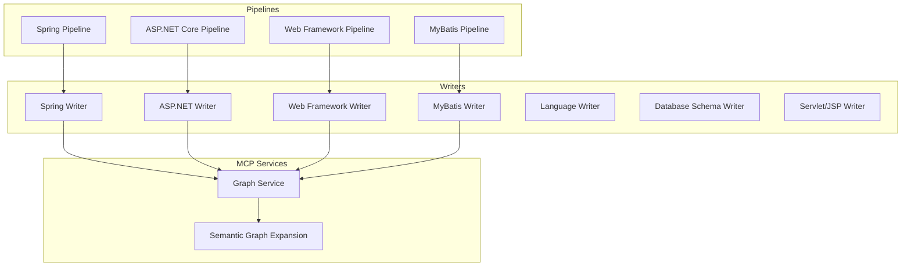
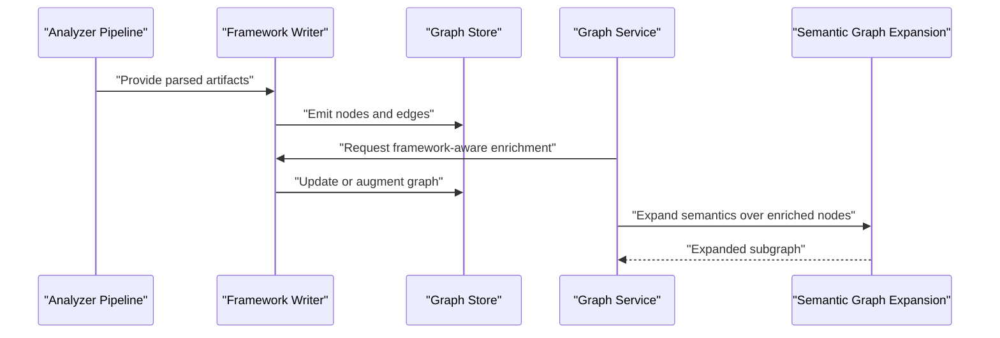
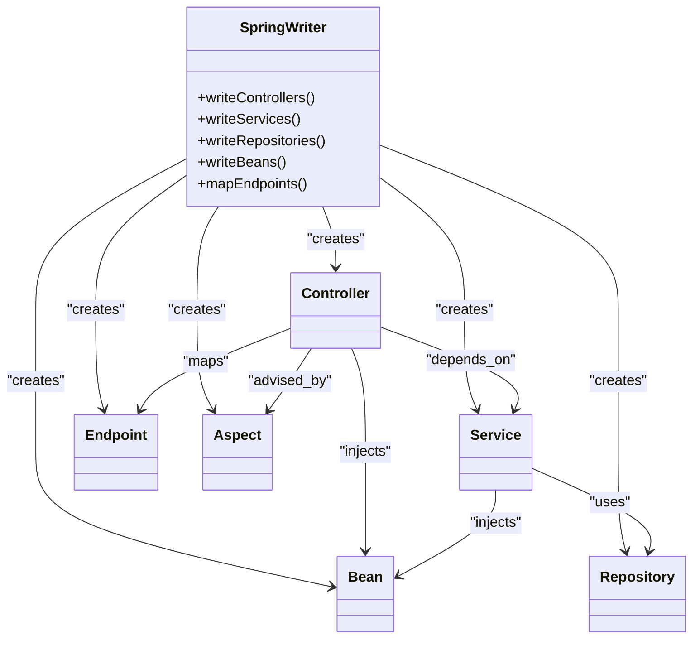
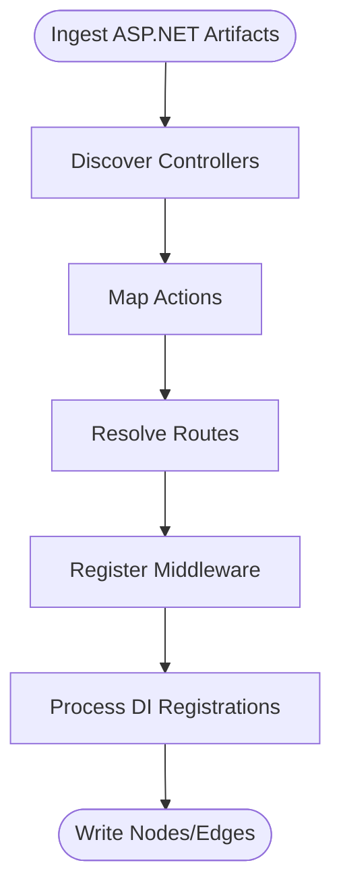
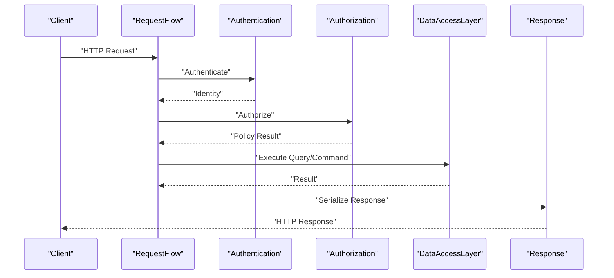
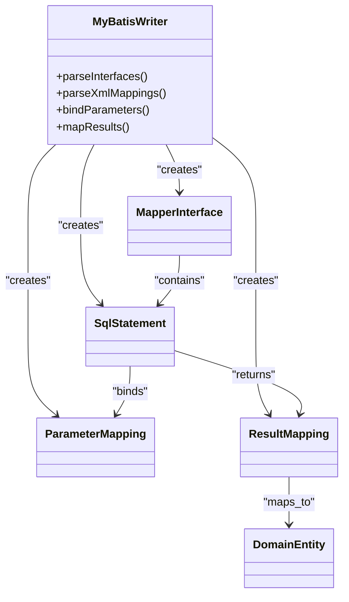
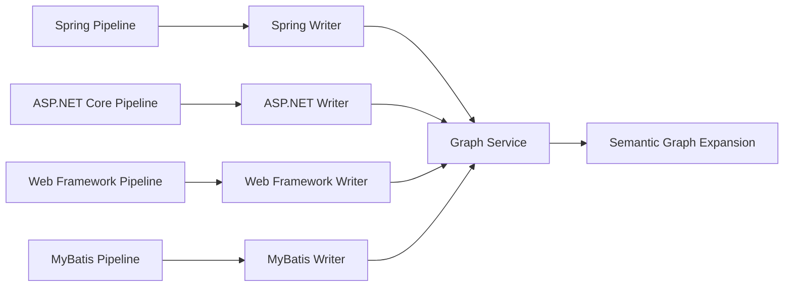

# Framework-Aware Writers

<cite>
**Referenced Files in This Document**
- [spring_writer.py](file://code-tiny/tools/graph/writer/spring_writer.py)
- [aspnet_writer.py](file://code-tiny/tools/graph/writer/aspnet_writer.py)
- [web_framework_writer.py](file://code-tiny/tools/graph/writer/web_framework_writer.py)
- [mybatis_writer.py](file://code-tiny/tools/graph/writer/mybatis_writer.py)
- [language_writer.py](file://code-tiny/tools/graph/writer/language_writer.py)
- [database_schema_writer.py](file://code-tiny/tools/graph/writer/database_schema_writer.py)
- [servlet_jsp_writer.py](file://code-tiny/tools/graph/writer/servlet_jsp_writer.py)
- [graph_service.py](file://code-tiny/mcp/services/graph_service.py)
- [semantic_graph_expansion.py](file://code-tiny/mcp/semantic_graph_expansion.py)
- [pipeline.py (Spring)](file://code-tiny/tools/spring/pipeline.py)
- [pipeline.py (ASP.NET Core)](file://code-tiny/tools/aspnet_core/pipeline.py)
- [pipeline.py (Web Framework)](file://code-tiny/tools/web_framework/pipeline.py)
- [pipeline.py (MyBatis)](file://code-tiny/tools/mybatis/pipeline.py)
</cite>

## Table of Contents
1. [Introduction](#introduction)
2. [Project Structure](#project-structure)
3. [Core Components](#core-components)
4. [Architecture Overview](#architecture-overview)
5. [Detailed Component Analysis](#detailed-component-analysis)
6. [Dependency Analysis](#dependency-analysis)
7. [Performance Considerations](#performance-considerations)
8. [Troubleshooting Guide](#troubleshooting-guide)
9. [Conclusion](#conclusion)
10. [Appendices](#appendices)

## Introduction
This document explains the framework-aware graph writers that enrich code graphs with semantic context beyond basic syntax analysis. It focuses on:
- Spring Boot writer for annotations, dependency injection, REST endpoints, and service layer relationships
- ASP.NET writer for controllers, routing, middleware, and dependency injection patterns
- Web framework writer for common request/response flows, authentication, and data access layers across frameworks
- MyBatis writer for SQL mapping and database interactions

It also provides examples of framework-specific node types, relationship patterns, and query optimization strategies for framework-aware searches.

## Project Structure
The writers live under a shared graph writer module and integrate with analyzer pipelines to produce enriched nodes and edges. The MCP services orchestrate ingestion and expansion using these writers.

**Diagram sources**
- [spring_writer.py](file://code-tiny/tools/graph/writer/spring_writer.py)
- [aspnet_writer.py](file://code-tiny/tools/graph/writer/aspnet_writer.py)
- [web_framework_writer.py](file://code-tiny/tools/graph/writer/web_framework_writer.py)
- [mybatis_writer.py](file://code-tiny/tools/graph/writer/mybatis_writer.py)
- [language_writer.py](file://code-tiny/tools/graph/writer/language_writer.py)
- [database_schema_writer.py](file://code-tiny/tools/graph/writer/database_schema_writer.py)
- [servlet_jsp_writer.py](file://code-tiny/tools/graph/writer/servlet_jsp_writer.py)
- [pipeline.py (Spring)](file://code-tiny/tools/spring/pipeline.py)
- [pipeline.py (ASP.NET Core)](file://code-tiny/tools/aspnet_core/pipeline.py)
- [pipeline.py (Web Framework)](file://code-tiny/tools/web_framework/pipeline.py)
- [pipeline.py (MyBatis)](file://code-tiny/tools/mybatis/pipeline.py)
- [graph_service.py](file://code-tiny/mcp/services/graph_service.py)
- [semantic_graph_expansion.py](file://code-tiny/mcp/semantic_graph_expansion.py)

**Section sources**
- [spring_writer.py](file://code-tiny/tools/graph/writer/spring_writer.py)
- [aspnet_writer.py](file://code-tiny/tools/graph/writer/aspnet_writer.py)
- [web_framework_writer.py](file://code-tiny/tools/graph/writer/web_framework_writer.py)
- [mybatis_writer.py](file://code-tiny/tools/graph/writer/mybatis_writer.py)
- [language_writer.py](file://code-tiny/tools/graph/writer/language_writer.py)
- [database_schema_writer.py](file://code-tiny/tools/graph/writer/database_schema_writer.py)
- [servlet_jsp_writer.py](file://code-tiny/tools/graph/writer/servlet_jsp_writer.py)
- [pipeline.py (Spring)](file://code-tiny/tools/spring/pipeline.py)
- [pipeline.py (ASP.NET Core)](file://code-tiny/tools/aspnet_core/pipeline.py)
- [pipeline.py (Web Framework)](file://code-tiny/tools/web_framework/pipeline.py)
- [pipeline.py (MyBatis)](file://code-tiny/tools/mybatis/pipeline.py)
- [graph_service.py](file://code-tiny/mcp/services/graph_service.py)
- [semantic_graph_expansion.py](file://code-tiny/mcp/semantic_graph_expansion.py)

## Core Components
- Spring Writer: Produces nodes for controllers, services, repositories, configuration classes, and beans; adds edges for DI wiring, REST mappings, and cross-cutting concerns.
- ASP.NET Writer: Emits controller nodes, route definitions, middleware components, and DI registrations; links endpoints to handlers and middleware chains.
- Web Framework Writer: Normalizes request/response flows, authentication mechanisms, and data access patterns into a unified schema across frameworks.
- MyBatis Writer: Maps interfaces and XML/annotations to SQL statements, result sets, and parameter bindings; connects to repository/service layers.
- Language Writer: Base writer providing common utilities and shared node/edge creation helpers used by framework writers.
- Database Schema Writer: Ingests DDL/schema artifacts to create tables, columns, indexes, and constraints as graph entities.
- Servlet/JSP Writer: Bridges legacy Java web artifacts to the same graph model for compatibility.

Key responsibilities:
- Normalize identifiers and file paths
- Create typed nodes and labeled relationships
- Attach metadata for search and traversal
- Integrate with pipeline stages to ensure deterministic ordering

**Section sources**
- [spring_writer.py](file://code-tiny/tools/graph/writer/spring_writer.py)
- [aspnet_writer.py](file://code-tiny/tools/graph/writer/aspnet_writer.py)
- [web_framework_writer.py](file://code-tiny/tools/graph/writer/web_framework_writer.py)
- [mybatis_writer.py](file://code-tiny/tools/graph/writer/mybatis_writer.py)
- [language_writer.py](file://code-tiny/tools/graph/writer/language_writer.py)
- [database_schema_writer.py](file://code-tiny/tools/graph/writer/database_schema_writer.py)
- [servlet_jsp_writer.py](file://code-tiny/tools/graph/writer/servlet_jsp_writer.py)

## Architecture Overview
Framework-aware writers are invoked by their respective analyzer pipelines. They consume parsed artifacts and emit normalized graph records consumed by the graph store. MCP services can trigger semantic expansion over these enriched nodes.

**Diagram sources**
- [pipeline.py (Spring)](file://code-tiny/tools/spring/pipeline.py)
- [pipeline.py (ASP.NET Core)](file://code-tiny/tools/aspnet_core/pipeline.py)
- [pipeline.py (Web Framework)](file://code-tiny/tools/web_framework/pipeline.py)
- [pipeline.py (MyBatis)](file://code-tiny/tools/mybatis/pipeline.py)
- [spring_writer.py](file://code-tiny/tools/graph/writer/spring_writer.py)
- [aspnet_writer.py](file://code-tiny/tools/graph/writer/aspnet_writer.py)
- [web_framework_writer.py](file://code-tiny/tools/graph/writer/web_framework_writer.py)
- [mybatis_writer.py](file://code-tiny/tools/graph/writer/mybatis_writer.py)
- [graph_service.py](file://code-tiny/mcp/services/graph_service.py)
- [semantic_graph_expansion.py](file://code-tiny/mcp/semantic_graph_expansion.py)

## Detailed Component Analysis

### Spring Boot Writer
Responsibilities:
- Detect and annotate controllers, services, repositories, configuration classes, and beans
- Map REST endpoints to handler methods
- Model dependency injection wiring between components
- Capture cross-cutting aspects (e.g., security, caching)

Node types:
- Controller, Service, Repository, Configuration, Bean, Endpoint, Aspect

Relationship patterns:
- Controller -> Endpoint (HTTP method + path)
- Controller -> Service (calls)
- Service -> Repository (data access)
- Any -> Bean (injection)
- Controller -> Aspect (cross-cutting)

**Diagram sources**
- [spring_writer.py](file://code-tiny/tools/graph/writer/spring_writer.py)

Query optimization strategies:
- Index endpoint paths and HTTP methods for fast route lookup
- Pre-index bean names and types to accelerate DI resolution queries
- Use scoped labels to filter by package/module boundaries
- Cache resolved injection edges to avoid repeated lookups during batch writes

Example searches:
- Find all endpoints exposed by a specific controller
- Trace DI chain from a controller down to repositories
- Identify all beans injected into a given service

**Section sources**
- [spring_writer.py](file://code-tiny/tools/graph/writer/spring_writer.py)
- [pipeline.py (Spring)](file://code-tiny/tools/spring/pipeline.py)

### ASP.NET Writer
Responsibilities:
- Emit controller nodes and route definitions
- Link middleware components and registration points
- Model dependency injection registrations and lifetimes
- Connect endpoints to action handlers and filters

Node types:
- Controller, Action, Route, Middleware, DIRegistration, Filter

Relationship patterns:
- Controller -> Action (method)
- Route -> Action (maps)
- RequestPipeline -> Middleware (ordered)
- Controller -> DIRegistration (resolved)
- Action -> Filter (applied)

**Diagram sources**
- [aspnet_writer.py](file://code-tiny/tools/graph/writer/aspnet_writer.py)
- [pipeline.py (ASP.NET Core)](file://code-tiny/tools/aspnet_core/pipeline.py)

Query optimization strategies:
- Index routes by template and HTTP verb
- Materialize middleware order as an array property for efficient traversal
- Precompute DI scope groups to speed up lifetime-based queries
- Deduplicate registration edges by canonical key

Example searches:
- List all actions reachable via a route pattern
- Show middleware chain for a given request path
- Resolve DI dependencies for a controller with lifetime info

**Section sources**
- [aspnet_writer.py](file://code-tiny/tools/graph/writer/aspnet_writer.py)
- [pipeline.py (ASP.NET Core)](file://code-tiny/tools/aspnet_core/pipeline.py)

### Web Framework Writer
Responsibilities:
- Normalize request/response flows across frameworks
- Abstract authentication mechanisms and authorization checks
- Represent data access layers uniformly

Node types:
- RequestFlow, Authentication, Authorization, DataAccessLayer, Response

Relationship patterns:
- RequestFlow -> Authentication -> Authorization -> DataAccessLayer -> Response
- Common “handler” abstraction linking framework-specific endpoints to this flow

**Diagram sources**
- [web_framework_writer.py](file://code-tiny/tools/graph/writer/web_framework_writer.py)
- [pipeline.py (Web Framework)](file://code-tiny/tools/web_framework/pipeline.py)

Query optimization strategies:
- Index request flows by entry point and target resource
- Tag authentication schemes and policies for policy-based queries
- Group data access calls by repository or DAO type for impact analysis

Example searches:
- Trace full request lifecycle for a given endpoint
- Find all endpoints protected by a specific policy
- Locate all data access calls within a feature boundary

**Section sources**
- [web_framework_writer.py](file://code-tiny/tools/graph/writer/web_framework_writer.py)
- [pipeline.py (Web Framework)](file://code-tiny/tools/web_framework/pipeline.py)

### MyBatis Writer
Responsibilities:
- Map mapper interfaces and XML/annotation-based SQL
- Bind parameters and result sets to domain objects
- Connect mappers to service/repository layers

Node types:
- MapperInterface, SqlStatement, ParameterMapping, ResultMapping, DomainEntity

Relationship patterns:
- MapperInterface -> SqlStatement (defines)
- SqlStatement -> ParameterMapping (binds)
- SqlStatement -> ResultMapping (maps)
- Service/Repository -> MapperInterface (uses)

**Diagram sources**
- [mybatis_writer.py](file://code-tiny/tools/graph/writer/mybatis_writer.py)

Query optimization strategies:
- Index SQL statements by operation type (SELECT/INSERT/UPDATE/DELETE)
- Pre-index parameter and result field names for targeted queries
- Build a mapper-to-entity index to quickly find affected entities on schema changes

Example searches:
- Find all SQL executed by a given mapper interface
- Identify which entities are updated by a set of statements
- Locate parameterized queries missing explicit binding

**Section sources**
- [mybatis_writer.py](file://code-tiny/tools/graph/writer/mybatis_writer.py)

### Shared Writer Infrastructure
- Language Writer: Provides base utilities for node/edge creation, normalization, and metadata attachment.
- Database Schema Writer: Creates table/column/index/constraint nodes and relationships.
- Servlet/JSP Writer: Bridges legacy Java web artifacts to the unified model.

These components support consistent labeling, idempotent writes, and incremental updates.

**Section sources**
- [language_writer.py](file://code-tiny/tools/graph/writer/language_writer.py)
- [database_schema_writer.py](file://code-tiny/tools/graph/writer/database_schema_writer.py)
- [servlet_jsp_writer.py](file://code-tiny/tools/graph/writer/servlet_jsp_writer.py)

## Dependency Analysis
Writers depend on their analyzer pipelines for artifact discovery and on shared graph operations for persistence. MCP services may invoke writers for on-demand enrichment and expand semantics over the resulting graph.

**Diagram sources**
- [pipeline.py (Spring)](file://code-tiny/tools/spring/pipeline.py)
- [pipeline.py (ASP.NET Core)](file://code-tiny/tools/aspnet_core/pipeline.py)
- [pipeline.py (Web Framework)](file://code-tiny/tools/web_framework/pipeline.py)
- [pipeline.py (MyBatis)](file://code-tiny/tools/mybatis/pipeline.py)
- [spring_writer.py](file://code-tiny/tools/graph/writer/spring_writer.py)
- [aspnet_writer.py](file://code-tiny/tools/graph/writer/aspnet_writer.py)
- [web_framework_writer.py](file://code-tiny/tools/graph/writer/web_framework_writer.py)
- [mybatis_writer.py](file://code-tiny/tools/graph/writer/mybatis_writer.py)
- [graph_service.py](file://code-tiny/mcp/services/graph_service.py)
- [semantic_graph_expansion.py](file://code-tiny/mcp/semantic_graph_expansion.py)

**Section sources**
- [pipeline.py (Spring)](file://code-tiny/tools/spring/pipeline.py)
- [pipeline.py (ASP.NET Core)](file://code-tiny/tools/aspnet_core/pipeline.py)
- [pipeline.py (Web Framework)](file://code-tiny/tools/web_framework/pipeline.py)
- [pipeline.py (MyBatis)](file://code-tiny/tools/mybatis/pipeline.py)
- [spring_writer.py](file://code-tiny/tools/graph/writer/spring_writer.py)
- [aspnet_writer.py](file://code-tiny/tools/graph/writer/aspnet_writer.py)
- [web_framework_writer.py](file://code-tiny/tools/graph/writer/web_framework_writer.py)
- [mybatis_writer.py](file://code-tiny/tools/graph/writer/mybatis_writer.py)
- [graph_service.py](file://code-tiny/mcp/services/graph_service.py)
- [semantic_graph_expansion.py](file://code-tiny/mcp/semantic_graph_expansion.py)

## Performance Considerations
- Batch writes: Group node/edge emissions per writer to reduce transaction overhead.
- Idempotency: Use stable keys to avoid duplicate edges and enable safe retries.
- Indexing strategy:
  - Endpoint routes and HTTP verbs
  - Bean names and types for DI
  - SQL statement categories and bound fields
  - Middleware order arrays for fast traversal
- Incremental updates: Only reprocess changed files/artifacts when possible.
- Caching: Cache resolved injections and mappings to minimize repeated work.

[No sources needed since this section provides general guidance]

## Troubleshooting Guide
Common issues and remedies:
- Missing DI edges: Verify bean name/type normalization and ensure both provider and consumer are scanned.
- Duplicate endpoints: Check route deduplication logic and canonical path formatting.
- Unmapped SQL: Confirm mapper interface and XML/annotation parsing coverage and parameter/result naming consistency.
- Slow queries: Validate presence of indexes on frequently filtered properties (paths, types, scopes).
- Inconsistent middleware order: Ensure ordered registration is materialized and preserved.

Operational tips:
- Inspect writer logs for skipped artifacts and reasons
- Re-run pipeline with verbose mode to trace resolution steps
- Validate graph integrity by checking expected node counts per subsystem

**Section sources**
- [spring_writer.py](file://code-tiny/tools/graph/writer/spring_writer.py)
- [aspnet_writer.py](file://code-tiny/tools/graph/writer/aspnet_writer.py)
- [web_framework_writer.py](file://code-tiny/tools/graph/writer/web_framework_writer.py)
- [mybatis_writer.py](file://code-tiny/tools/graph/writer/mybatis_writer.py)

## Conclusion
Framework-aware writers transform language-level artifacts into rich, searchable graph structures. By standardizing node types and relationships across Spring Boot, ASP.NET, generic web frameworks, and MyBatis, they enable powerful queries for tracing requests, understanding DI, and analyzing data access. Proper indexing, batching, and idempotent writes ensure scalability and reliability.

[No sources needed since this section summarizes without analyzing specific files]

## Appendices

### Example Node Types and Relationships
- Spring: Controller, Service, Repository, Bean, Endpoint, Aspect
- ASP.NET: Controller, Action, Route, Middleware, DIRegistration, Filter
- Web Framework: RequestFlow, Authentication, Authorization, DataAccessLayer, Response
- MyBatis: MapperInterface, SqlStatement, ParameterMapping, ResultMapping, DomainEntity

### Example Queries (Conceptual)
- “Show all endpoints under /api/v1 and their DI dependencies”
- “List all SQL statements that update entity X”
- “Trace middleware chain for route pattern /users/{id}”
- “Find controllers advising security aspect Y”

[No sources needed since this section provides conceptual examples]