# Graph Writers & Data Ingestion

<cite>
**Referenced Files in This Document**
- [language_writer.py](file://code-tiny/tools/graph/writer/language_writer.py)
- [web_framework_writer.py](file://code-tiny/tools/graph/writer/web_framework_writer.py)
- [spring_writer.py](file://code-tiny/tools/graph/writer/spring_writer.py)
- [aspnet_writer.py](file://code-tiny/tools/graph/writer/aspnet_writer.py)
- [database_schema_writer.py](file://code-tiny/tools/graph/writer/database_schema_writer.py)
- [servlet_jsp_writer.py](file://code-tiny/tools/graph/writer/servlet_jsp_writer.py)
- [mybatis_writer.py](file://code-tiny/tools/graph/writer/mybatis_writer.py)
- [graph/__init__.py](file://code-tiny/tools/graph/__init__.py)
- [cli.py](file://code-tiny/tools/graph/cli.py)
- [orchestrator.py](file://harness/scripts/orchestrator.py)
- [sync_scope.py](file://code-tiny/tools/common/sync_scope.py)
- [incremental_sync_state.py](file://code-tiny/tools/common/incremental_sync_state.py)
- [incremental_cleanup.py](file://code-tiny/tools/common/incremental_cleanup.py)
- [source_inventory.py](file://code-tiny/tools/common/source_inventory.py)
- [analyzer_cache.py](file://code-tiny/tools/common/analyzer_cache.py)
- [signal_normalizer.py](file://code-tiny/tools/common/signal_normalizer.py)
- [result_packager.py](file://code-tiny/tools/common/result_packager.py)
- [primary_vector_sync.py](file://code-tiny/tools/common/primary_vector_sync.py)
- [neo4j_driver.py](file://code-tiny/tools/graph/driver/neo4j_driver.py)
- [falkordb_driver.py](file://code-tiny/tools/graph/driver/falkordb_driver.py)
- [base.py](file://code-tiny/tools/graph/core/base.py)
- [factory.py](file://code-tiny/tools/graph/core/factory.py)
- [provider_runtime.py](file://code-tiny/tools/graph/core/provider_runtime.py)
- [record_parsers.py](file://code-tiny/tools/graph/core/record_parsers.py)
- [require_neo4j.py](file://code-tiny/tools/graph/core/require_neo4j.py)
</cite>

## Table of Contents
1. [Introduction](#introduction)
2. [Project Structure](#project-structure)
3. [Core Components](#core-components)
4. [Architecture Overview](#architecture-overview)
5. [Detailed Component Analysis](#detailed-component-analysis)
6. [Dependency Analysis](#dependency-analysis)
7. [Performance Considerations](#performance-considerations)
8. [Troubleshooting Guide](#troubleshooting-guide)
9. [Conclusion](#conclusion)
10. [Appendices](#appendices)

## Introduction
This document explains the graph writer subsystem responsible for ingesting analyzed code data into a graph database. It covers:
- The base language writer interface and how language-specific writers map code elements to graph nodes and edges
- Framework-aware writers that add semantic context (Spring Boot, ASP.NET, Servlet/JSP, MyBatis, Database Schema)
- The end-to-end ingestion pipeline: parsing, normalization, conflict resolution, incremental updates
- Batch processing strategies and memory management for large codebases
- Writer configuration options, custom writer development guidelines, and performance tuning parameters
- Examples and testing strategies for validating new writers

## Project Structure
The writer subsystem is organized under tools/graph/writer with supporting core runtime and drivers:
- Base interfaces and framework overlay support
- Language-specific and framework-specific writers
- Core runtime utilities for record parsing and provider requirements
- Drivers for Neo4j and FalkorDB backends
- Orchestration and common utilities for synchronization, caching, and normalization

```mermaid
graph TB
subgraph "Writer Layer"
LW["language_writer.py"]
FW["web_framework_writer.py"]
SW["spring_writer.py"]
AW["aspnet_writer.py"]
SJW["servlet_jsp_writer.py"]
MW["mybatis_writer.py"]
DBW["database_schema_writer.py"]
end
subgraph "Core Runtime"
BASE["core/base.py"]
FACT["core/factory.py"]
PRUN["core/provider_runtime.py"]
RP["core/record_parsers.py"]
REQ["core/require_neo4j.py"]
end
subgraph "Drivers"
N4J["driver/neo4j_driver.py"]
FDB["driver/falkordb_driver.py"]
end
subgraph "Orchestration"
CLI["tools/graph/cli.py"]
ORCH["harness/scripts/orchestrator.py"]
end
subgraph "Common Utilities"
SYNC["common/sync_scope.py"]
ISS["common/incremental_sync_state.py"]
IC["common/incremental_cleanup.py"]
SI["common/source_inventory.py"]
AC["common/analyzer_cache.py"]
SN["common/signal_normalizer.py"]
RPkg["common/result_packager.py"]
PVS["common/primary_vector_sync.py"]
end
LW --> BASE
FW --> BASE
SW --> FW
AW --> FW
SJW --> FW
MW --> FW
DBW --> FW
CLI --> FACT
ORCH --> FACT
FACT --> PRUN
PRUN --> N4J
PRUN --> FDB
PRUN --> RP
PRUN --> REQ
ORCH --> SYNC
ORCH --> ISS
ORCH --> IC
ORCH --> SI
ORCH --> AC
ORCH --> SN
ORCH --> RPkg
ORCH --> PVS
```

**Diagram sources**
- [language_writer.py:1-200](file://code-tiny/tools/graph/writer/language_writer.py#L1-L200)
- [web_framework_writer.py:1-200](file://code-tiny/tools/graph/writer/web_framework_writer.py#L1-L200)
- [spring_writer.py:1-200](file://code-tiny/tools/graph/writer/spring_writer.py#L1-L200)
- [aspnet_writer.py:1-200](file://code-tiny/tools/graph/writer/aspnet_writer.py#L1-L200)
- [servlet_jsp_writer.py:1-200](file://code-tiny/tools/graph/writer/servlet_jsp_writer.py#L1-L200)
- [mybatis_writer.py:1-200](file://code-tiny/tools/graph/writer/mybatis_writer.py#L1-L200)
- [database_schema_writer.py:1-200](file://code-tiny/tools/graph/writer/database_schema_writer.py#L1-L200)
- [base.py:1-200](file://code-tiny/tools/graph/core/base.py#L1-L200)
- [factory.py:1-200](file://code-tiny/tools/graph/core/factory.py#L1-L200)
- [provider_runtime.py:1-200](file://code-tiny/tools/graph/core/provider_runtime.py#L1-L200)
- [record_parsers.py:1-200](file://code-tiny/tools/graph/core/record_parsers.py#L1-L200)
- [require_neo4j.py:1-200](file://code-tiny/tools/graph/core/require_neo4j.py#L1-L200)
- [neo4j_driver.py:1-200](file://code-tiny/tools/graph/driver/neo4j_driver.py#L1-L200)
- [falkordb_driver.py:1-200](file://code-tiny/tools/graph/driver/falkordb_driver.py#L1-L200)
- [cli.py:1-200](file://code-tiny/tools/graph/cli.py#L1-L200)
- [orchestrator.py:1-200](file://harness/scripts/orchestrator.py#L1-L200)
- [sync_scope.py:1-200](file://code-tiny/tools/common/sync_scope.py#L1-L200)
- [incremental_sync_state.py:1-200](file://code-tiny/tools/common/incremental_sync_state.py#L1-L200)
- [incremental_cleanup.py:1-200](file://code-tiny/tools/common/incremental_cleanup.py#L1-L200)
- [source_inventory.py:1-200](file://code-tiny/tools/common/source_inventory.py#L1-L200)
- [analyzer_cache.py:1-200](file://code-tiny/tools/common/analyzer_cache.py#L1-L200)
- [signal_normalizer.py:1-200](file://code-tiny/tools/common/signal_normalizer.py#L1-L200)
- [result_packager.py:1-200](file://code-tiny/tools/common/result_packager.py#L1-L200)
- [primary_vector_sync.py:1-200](file://code-tiny/tools/common/primary_vector_sync.py#L1-L200)

**Section sources**
- [graph/__init__.py:1-200](file://code-tiny/tools/graph/__init__.py#L1-L200)
- [cli.py:1-200](file://code-tiny/tools/graph/cli.py#L1-L200)
- [orchestrator.py:1-200](file://harness/scripts/orchestrator.py#L1-L200)

## Core Components
- Base language writer interface defines the contract for mapping analyzed code elements to graph nodes and edges. Implementations must provide methods for node creation, edge creation, and optional upsert semantics.
- Web framework writer extends the base interface to handle framework-specific constructs (controllers, routes, annotations) and enriches the graph with semantic relationships beyond syntax.
- Concrete writers implement mappings for specific languages/frameworks:
  - Spring writer adds controller endpoints, service beans, repository associations, and security metadata
  - ASP.NET writer maps controllers, actions, dependency injection registrations, and routing
  - Servlet/JSP writer captures servlet mappings, JSP views, and web.xml descriptors
  - MyBatis writer links mapper interfaces and XML mappings to SQL statements and entities
  - Database schema writer ingests DDL artifacts and creates typed nodes and relationships for tables, columns, keys, and constraints

Key responsibilities:
- Normalize identifiers and paths
- Resolve conflicts between overlapping definitions
- Upsert nodes and edges idempotently
- Emit batched write operations for performance

**Section sources**
- [language_writer.py:1-200](file://code-tiny/tools/graph/writer/language_writer.py#L1-L200)
- [web_framework_writer.py:1-200](file://code-tiny/tools/graph/writer/web_framework_writer.py#L1-L200)
- [spring_writer.py:1-200](file://code-tiny/tools/graph/writer/spring_writer.py#L1-L200)
- [aspnet_writer.py:1-200](file://code-tiny/tools/graph/writer/aspnet_writer.py#L1-L200)
- [servlet_jsp_writer.py:1-200](file://code-tiny/tools/graph/writer/servlet_jsp_writer.py#L1-L200)
- [mybatis_writer.py:1-200](file://code-tiny/tools/graph/writer/mybatis_writer.py#L1-L200)
- [database_schema_writer.py:1-200](file://code-tiny/tools/graph/writer/database_schema_writer.py#L1-L200)

## Architecture Overview
The ingestion pipeline orchestrates analysis results through normalization, conflict resolution, and writing to the graph store via a provider runtime and driver abstraction.

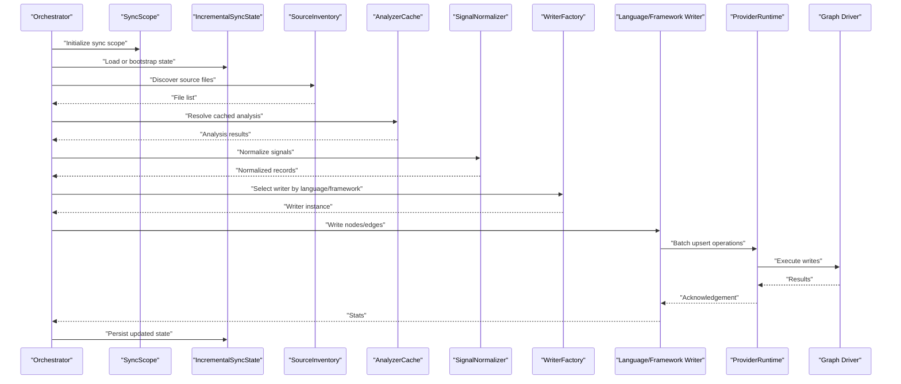

**Diagram sources**
- [orchestrator.py:1-200](file://harness/scripts/orchestrator.py#L1-L200)
- [sync_scope.py:1-200](file://code-tiny/tools/common/sync_scope.py#L1-L200)
- [incremental_sync_state.py:1-200](file://code-tiny/tools/common/incremental_sync_state.py#L1-L200)
- [source_inventory.py:1-200](file://code-tiny/tools/common/source_inventory.py#L1-L200)
- [analyzer_cache.py:1-200](file://code-tiny/tools/common/analyzer_cache.py#L1-L200)
- [signal_normalizer.py:1-200](file://code-tiny/tools/common/signal_normalizer.py#L1-L200)
- [factory.py:1-200](file://code-tiny/tools/graph/core/factory.py#L1-L200)
- [provider_runtime.py:1-200](file://code-tiny/tools/graph/core/provider_runtime.py#L1-L200)
- [neo4j_driver.py:1-200](file://code-tiny/tools/graph/driver/neo4j_driver.py#L1-L200)
- [falkordb_driver.py:1-200](file://code-tiny/tools/graph/driver/falkordb_driver.py#L1-L200)

## Detailed Component Analysis

### Base Language Writer Interface
Responsibilities:
- Define node and edge creation contracts
- Provide idempotent upsert semantics keyed by stable identifiers
- Support batching and transaction boundaries
- Expose configuration hooks for normalization and conflict resolution

Implementation patterns:
- Use normalized IDs derived from file path, symbol name, and line ranges
- Group writes into batches sized by memory and throughput targets
- Apply conflict resolution rules when multiple definitions overlap

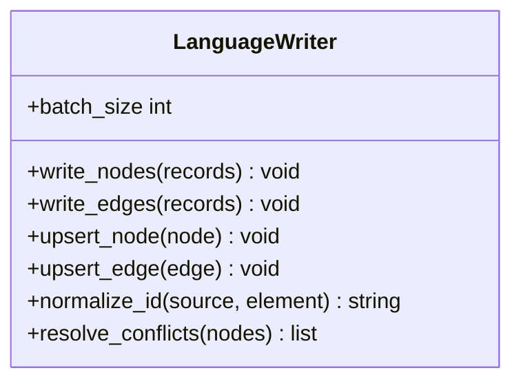

**Diagram sources**
- [language_writer.py:1-200](file://code-tiny/tools/graph/writer/language_writer.py#L1-L200)

**Section sources**
- [language_writer.py:1-200](file://code-tiny/tools/graph/writer/language_writer.py#L1-L200)

### Web Framework Writer Overlay
Extends the base interface to capture framework semantics:
- Controller/action discovery and route mapping
- Dependency injection registration and wiring
- Security and middleware overlays
- Cross-cutting concerns (logging, metrics)

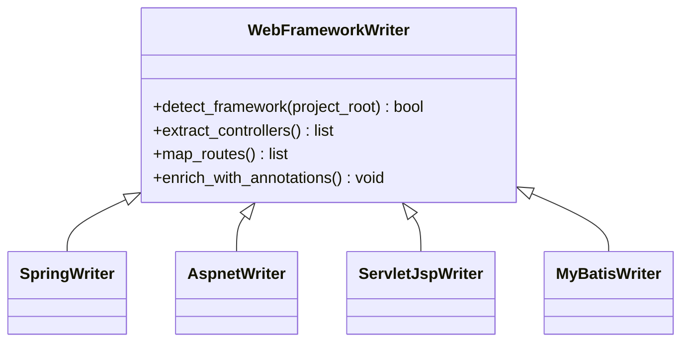

**Diagram sources**
- [web_framework_writer.py:1-200](file://code-tiny/tools/graph/writer/web_framework_writer.py#L1-L200)
- [spring_writer.py:1-200](file://code-tiny/tools/graph/writer/spring_writer.py#L1-L200)
- [aspnet_writer.py:1-200](file://code-tiny/tools/graph/writer/aspnet_writer.py#L1-L200)
- [servlet_jsp_writer.py:1-200](file://code-tiny/tools/graph/writer/servlet_jsp_writer.py#L1-L200)
- [mybatis_writer.py:1-200](file://code-tiny/tools/graph/writer/mybatis_writer.py#L1-L200)

**Section sources**
- [web_framework_writer.py:1-200](file://code-tiny/tools/graph/writer/web_framework_writer.py#L1-L200)
- [spring_writer.py:1-200](file://code-tiny/tools/graph/writer/spring_writer.py#L1-L200)
- [aspnet_writer.py:1-200](file://code-tiny/tools/graph/writer/aspnet_writer.py#L1-L200)
- [servlet_jsp_writer.py:1-200](file://code-tiny/tools/graph/writer/servlet_jsp_writer.py#L1-L200)
- [mybatis_writer.py:1-200](file://code-tiny/tools/graph/writer/mybatis_writer.py#L1-L200)

### Spring Writer
Adds semantic context for Spring Boot applications:
- Controllers, services, repositories, components
- REST endpoints and parameter binding
- Configuration classes and property injection
- Security decorators and interceptors

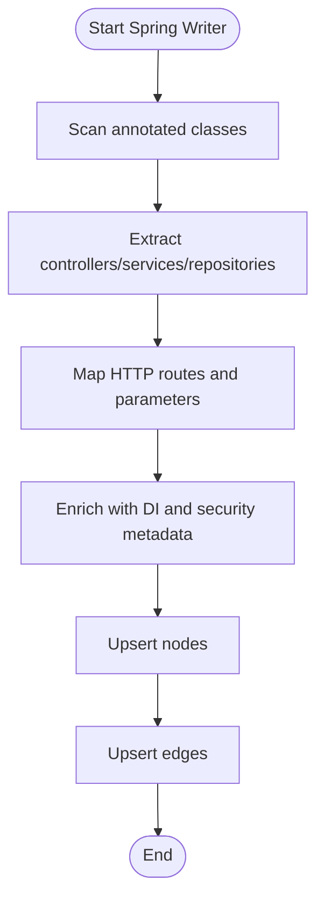

**Diagram sources**
- [spring_writer.py:1-200](file://code-tiny/tools/graph/writer/spring_writer.py#L1-L200)

**Section sources**
- [spring_writer.py:1-200](file://code-tiny/tools/graph/writer/spring_writer.py#L1-L200)

### ASP.NET Writer
Maps ASP.NET constructs:
- Controllers and action methods
- Routing configurations and attribute-based routes
- Dependency injection registrations
- Middleware pipelines

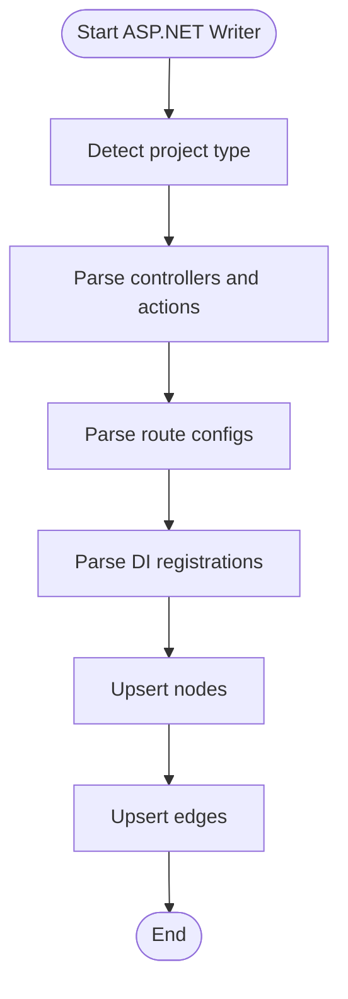

**Diagram sources**
- [aspnet_writer.py:1-200](file://code-tiny/tools/graph/writer/aspnet_writer.py#L1-L200)

**Section sources**
- [aspnet_writer.py:1-200](file://code-tiny/tools/graph/writer/aspnet_writer.py#L1-L200)

### Servlet/JSP Writer
Captures Java EE web application structure:
- Servlet mappings and URL patterns
- JSP view references and EL expressions
- web.xml descriptor entries
- Tag libraries and filters

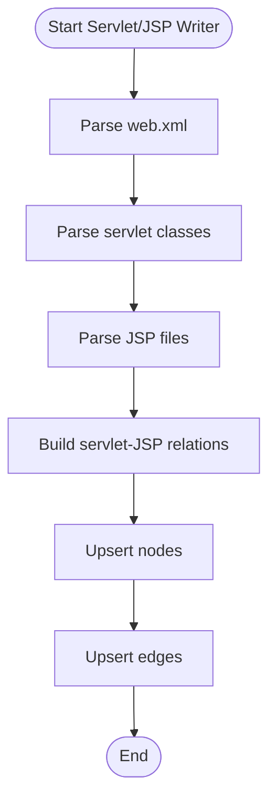

**Diagram sources**
- [servlet_jsp_writer.py:1-200](file://code-tiny/tools/graph/writer/servlet_jsp_writer.py#L1-L200)

**Section sources**
- [servlet_jsp_writer.py:1-200](file://code-tiny/tools/graph/writer/servlet_jsp_writer.py#L1-L200)

### MyBatis Writer
Links persistence layer artifacts:
- Mapper interfaces and XML mappings
- SQL statements and result mappings
- Entity relationships and key constraints

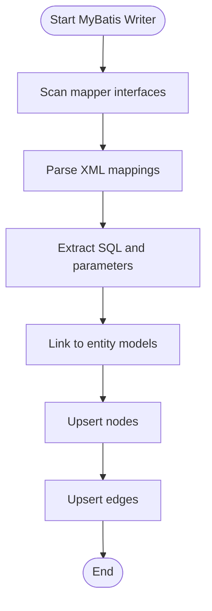

**Diagram sources**
- [mybatis_writer.py:1-200](file://code-tiny/tools/graph/writer/mybatis_writer.py#L1-L200)

**Section sources**
- [mybatis_writer.py:1-200](file://code-tiny/tools/graph/writer/mybatis_writer.py#L1-L200)

### Database Schema Writer
Ingests DDL artifacts and builds typed schema graphs:
- Tables, columns, indexes, constraints
- Foreign keys and referential integrity
- Views and stored procedures

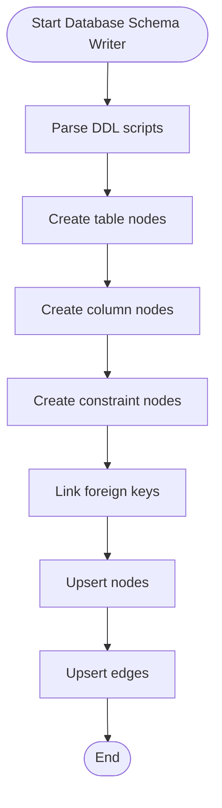

**Diagram sources**
- [database_schema_writer.py:1-200](file://code-tiny/tools/graph/writer/database_schema_writer.py#L1-L200)

**Section sources**
- [database_schema_writer.py:1-200](file://code-tiny/tools/graph/writer/database_schema_writer.py#L1-L200)

### Core Runtime and Drivers
- Provider runtime abstracts backend differences and manages transactions
- Record parsers normalize incoming records and validate schemas
- Require checks ensure environment readiness
- Drivers implement low-level write operations for Neo4j and FalkorDB

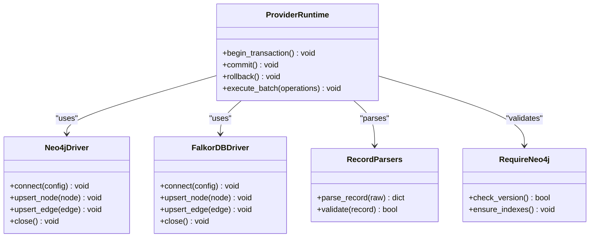

**Diagram sources**
- [provider_runtime.py:1-200](file://code-tiny/tools/graph/core/provider_runtime.py#L1-L200)
- [neo4j_driver.py:1-200](file://code-tiny/tools/graph/driver/neo4j_driver.py#L1-L200)
- [falkordb_driver.py:1-200](file://code-tiny/tools/graph/driver/falkordb_driver.py#L1-L200)
- [record_parsers.py:1-200](file://code-tiny/tools/graph/core/record_parsers.py#L1-L200)
- [require_neo4j.py:1-200](file://code-tiny/tools/graph/core/require_neo4j.py#L1-L200)

**Section sources**
- [base.py:1-200](file://code-tiny/tools/graph/core/base.py#L1-L200)
- [factory.py:1-200](file://code-tiny/tools/graph/core/factory.py#L1-L200)
- [provider_runtime.py:1-200](file://code-tiny/tools/graph/core/provider_runtime.py#L1-L200)
- [record_parsers.py:1-200](file://code-tiny/tools/graph/core/record_parsers.py#L1-L200)
- [require_neo4j.py:1-200](file://code-tiny/tools/graph/core/require_neo4j.py#L1-L200)
- [neo4j_driver.py:1-200](file://code-tiny/tools/graph/driver/neo4j_driver.py#L1-L200)
- [falkordb_driver.py:1-200](file://code-tiny/tools/graph/driver/falkordb_driver.py#L1-L200)

## Dependency Analysis
Writers depend on core runtime abstractions and drivers. Orchestration depends on common utilities for synchronization, caching, and normalization.

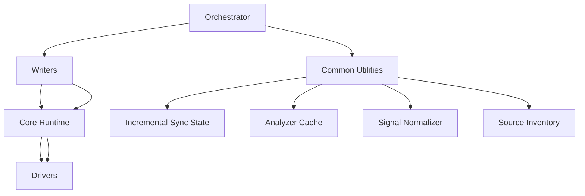

**Diagram sources**
- [orchestrator.py:1-200](file://harness/scripts/orchestrator.py#L1-L200)
- [sync_scope.py:1-200](file://code-tiny/tools/common/sync_scope.py#L1-L200)
- [incremental_sync_state.py:1-200](file://code-tiny/tools/common/incremental_sync_state.py#L1-L200)
- [analyzer_cache.py:1-200](file://code-tiny/tools/common/analyzer_cache.py#L1-L200)
- [signal_normalizer.py:1-200](file://code-tiny/tools/common/signal_normalizer.py#L1-L200)
- [source_inventory.py:1-200](file://code-tiny/tools/common/source_inventory.py#L1-L200)
- [provider_runtime.py:1-200](file://code-tiny/tools/graph/core/provider_runtime.py#L1-L200)
- [neo4j_driver.py:1-200](file://code-tiny/tools/graph/driver/neo4j_driver.py#L1-L200)
- [falkordb_driver.py:1-200](file://code-tiny/tools/graph/driver/falkordb_driver.py#L1-L200)

**Section sources**
- [graph/__init__.py:1-200](file://code-tiny/tools/graph/__init__.py#L1-L200)
- [cli.py:1-200](file://code-tiny/tools/graph/cli.py#L1-L200)
- [orchestrator.py:1-200](file://harness/scripts/orchestrator.py#L1-L200)

## Performance Considerations
- Batch size tuning: Adjust batch sizes based on memory footprint and driver throughput; larger batches reduce round-trips but increase memory pressure
- Transaction boundaries: Commit per batch to limit rollback cost and improve resilience
- Idempotent upserts: Use stable keys to avoid duplicate writes and reduce conflict resolution overhead
- Caching: Leverage analyzer cache to skip re-parsing unchanged files
- Incremental updates: Use sync scope and incremental state to process only changed files
- Indexing: Ensure required indexes exist before bulk writes to speed up lookups
- Memory management: Stream records where possible; avoid holding entire codebase in memory

[No sources needed since this section provides general guidance]

## Troubleshooting Guide
Common issues and resolutions:
- Connection failures: Verify driver configuration and backend availability
- Version mismatches: Run require checks to ensure compatibility
- Duplicate nodes: Confirm stable ID normalization and conflict resolution rules
- Slow ingestion: Increase batch size cautiously; verify indexes; enable caching
- Partial updates: Inspect incremental state and cleanup routines for orphaned artifacts

**Section sources**
- [require_neo4j.py:1-200](file://code-tiny/tools/graph/core/require_neo4j.py#L1-L200)
- [incremental_cleanup.py:1-200](file://code-tiny/tools/common/incremental_cleanup.py#L1-L200)
- [analyzer_cache.py:1-200](file://code-tiny/tools/common/analyzer_cache.py#L1-L200)
- [signal_normalizer.py:1-200](file://code-tiny/tools/common/signal_normalizer.py#L1-L200)

## Conclusion
The graph writer subsystem provides a robust, extensible foundation for ingesting analyzed code into graph databases. By separating base language mapping from framework overlays, it balances generality with rich semantic enrichment. The orchestration leverages caching, normalization, and incremental updates to scale efficiently across large codebases. Proper configuration and performance tuning ensure reliable, high-throughput ingestion.

[No sources needed since this section summarizes without analyzing specific files]

## Appendices

### Writer Configuration Options
- Batch size: Controls number of operations per transaction
- Conflict resolution strategy: Last-write-wins, merge fields, or custom resolver
- Normalization rules: Identifier casing, path canonicalization, symbol scoping
- Driver settings: Connection pool size, timeouts, retry policies
- Incremental mode flags: Enable/disable change detection and cleanup

[No sources needed since this section provides general guidance]

### Custom Writer Development Guidelines
Steps:
- Extend the base language writer interface
- Implement node and edge creation with stable IDs
- Add normalization and conflict resolution logic
- Integrate with the writer factory if registering a new language
- Validate against test fixtures and acceptance criteria

Example outline:
- Create a new writer class implementing upsert semantics
- Map language constructs to graph nodes and edges
- Hook into the orchestration pipeline via factory registration
- Provide configuration overrides for batch size and normalization

[No sources needed since this section provides general guidance]

### Testing Strategies for Writer Validation
- Unit tests: Validate node/edge creation for representative inputs
- Integration tests: End-to-end ingestion against a test graph store
- Contract tests: Ensure schema compliance and index presence
- Performance tests: Measure throughput and memory usage at scale
- Fixture-driven tests: Use provided sample projects for regression checks

[No sources needed since this section provides general guidance]