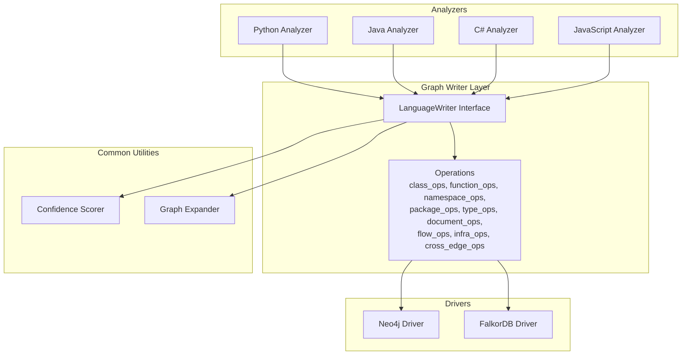
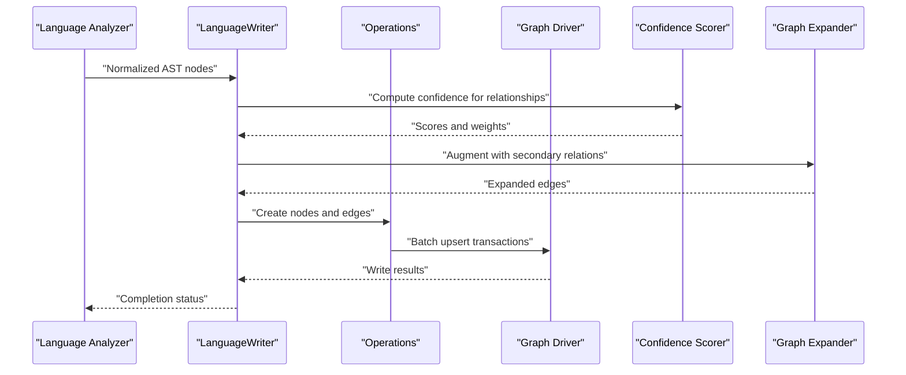
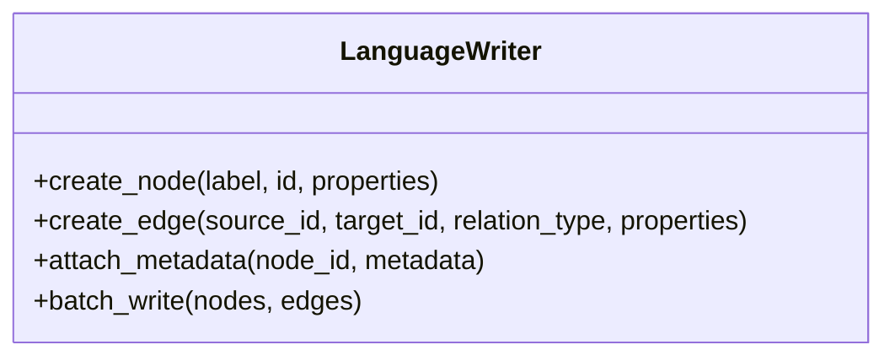
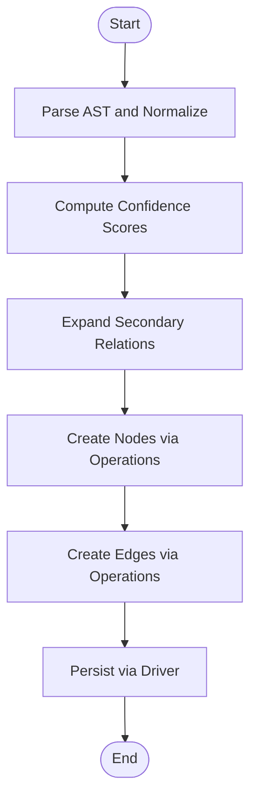
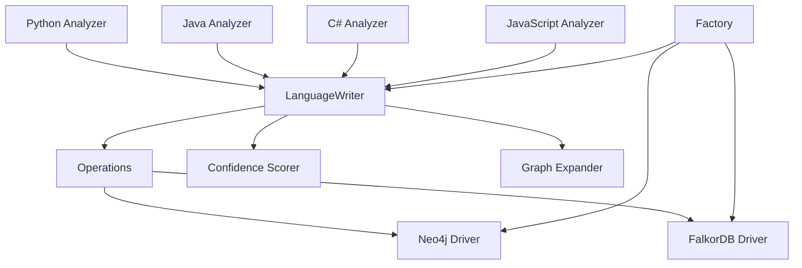

# Language-Specific Writers

<cite>
**Referenced Files in This Document**
- [language_writer.py](file://code-tiny/tools/graph/writer/language_writer.py)
- [python_analyzer.py](file://code-tiny/tools/python/python_analyzer.py)
- [java_analyzer.py](file://code-tiny/tools/java/java_analyzer.py)
- [csharp_analyzer.py](file://code-tiny/tools/csharp/csharp_analyzer.py)
- [js_analyzer.py](file://code-tiny/tools/js/js_analyzer.py)
- [confidence_scorer.py](file://code-tiny/tools/common/confidence_scorer.py)
- [graph_expander.py](file://code-tiny/tools/common/graph_expander.py)
- [base.py](file://code-tiny/tools/graph/core/base.py)
- [factory.py](file://code-tiny/tools/graph/core/factory.py)
- [neo4j_driver.py](file://code-tiny/tools/graph/driver/neo4j_driver.py)
- [falkordb_driver.py](file://code-tiny/tools/graph/driver/falkordb_driver.py)
</cite>

## Table of Contents
1. [Introduction](#introduction)
2. [Project Structure](#project-structure)
3. [Core Components](#core-components)
4. [Architecture Overview](#architecture-overview)
5. [Detailed Component Analysis](#detailed-component-analysis)
6. [Dependency Analysis](#dependency-analysis)
7. [Performance Considerations](#performance-considerations)
8. [Troubleshooting Guide](#troubleshooting-guide)
9. [Conclusion](#conclusion)
10. [Appendices](#appendices)

## Introduction
This document explains the language-specific graph writers that transform parsed code elements into graph database nodes and edges. It covers the base LanguageWriter interface, node creation patterns, edge relationship establishment, metadata handling, and confidence scoring. It also details how each language writer (Python, Java, C#, JavaScript) implements language-specific semantics such as imports, function calls, class hierarchies, and variable relationships. Finally, it describes the data transformation pipeline from AST nodes to graph entities, configuration options, performance considerations for large codebases, and guidance for writing custom language writers.

## Project Structure
The graph writer subsystem is organized under a dedicated module with clear separation between core interfaces, drivers, operations, and per-language analyzers:
- Core interfaces and runtime utilities define the contract for writers and provide common helpers.
- Drivers abstract persistence to different graph databases.
- Operations encapsulate reusable write routines for classes, functions, namespaces, packages, types, documents, flows, and cross-cutting concerns.
- Per-language analyzers produce structured representations that are consumed by writers to create nodes and edges.

**Diagram sources**
- [language_writer.py](file://code-tiny/tools/graph/writer/language_writer.py)
- [operations/class_ops.py](file://code-tiny/tools/graph/operations/class_ops.py)
- [operations/function_ops.py](file://code-tiny/tools/graph/operations/function_ops.py)
- [operations/namespace_ops.py](file://code-tiny/tools/graph/operations/namespace_ops.py)
- [operations/package_ops.py](file://code-tiny/tools/graph/operations/package_ops.py)
- [operations/type_ops.py](file://code-tiny/tools/graph/operations/type_ops.py)
- [operations/document_ops.py](file://code-tiny/tools/graph/operations/document_ops.py)
- [operations/flow_ops.py](file://code-tiny/tools/graph/operations/flow_ops.py)
- [operations/infra_ops.py](file://code-tiny/tools/graph/operations/infra_ops.py)
- [operations/cross_edge_ops.py](file://code-tiny/tools/graph/operations/cross_edge_ops.py)
- [neo4j_driver.py](file://code-tiny/tools/graph/driver/neo4j_driver.py)
- [falkordb_driver.py](file://code-tiny/tools/graph/driver/falkordb_driver.py)
- [python_analyzer.py](file://code-tiny/tools/python/python_analyzer.py)
- [java_analyzer.py](file://code-tiny/tools/java/java_analyzer.py)
- [csharp_analyzer.py](file://code-tiny/tools/csharp/csharp_analyzer.py)
- [js_analyzer.py](file://code-tiny/tools/js/js_analyzer.py)
- [confidence_scorer.py](file://code-tiny/tools/common/confidence_scorer.py)
- [graph_expander.py](file://code-tiny/tools/common/graph_expander.py)

**Section sources**
- [language_writer.py](file://code-tiny/tools/graph/writer/language_writer.py)
- [base.py](file://code-tiny/tools/graph/core/base.py)
- [factory.py](file://code-tiny/tools/graph/core/factory.py)
- [neo4j_driver.py](file://code-tiny/tools/graph/driver/neo4j_driver.py)
- [falkordb_driver.py](file://code-tiny/tools/graph/driver/falkordb_driver.py)

## Core Components
- Base LanguageWriter interface defines the contract for creating nodes, establishing edges, and attaching metadata. Implementations must support:
  - Node creation with labels, identifiers, and properties.
  - Edge creation with typed relationships and directionality.
  - Metadata attachment including source attribution, line/column ranges, and confidence scores.
  - Batched writes where supported by the driver.
- Common operations provide reusable building blocks for:
  - Class hierarchy edges (extends/implements).
  - Function/method call edges and parameter mappings.
  - Namespace/package containment and import/use relationships.
  - Type declarations and references.
  - Document-level artifacts and flow edges across files.
  - Infrastructure nodes (projects, modules, repositories).
  - Cross-cutting edges (annotations, decorators, attributes).
- Drivers abstract persistence to Neo4j or FalkorDB, exposing transactional APIs and upsert semantics.
- Confidence scorer computes reliability metrics for inferred relationships based on evidence strength and resolution quality.
- Graph expander augments primary signals with secondary relationships (e.g., transitive imports, indirect calls).

**Section sources**
- [language_writer.py](file://code-tiny/tools/graph/writer/language_writer.py)
- [operations/class_ops.py](file://code-tiny/tools/graph/operations/class_ops.py)
- [operations/function_ops.py](file://code-tiny/tools/graph/operations/function_ops.py)
- [operations/namespace_ops.py](file://code-tiny/tools/graph/operations/namespace_ops.py)
- [operations/package_ops.py](file://code-tiny/tools/graph/operations/package_ops.py)
- [operations/type_ops.py](file://code-tiny/tools/graph/operations/type_ops.py)
- [operations/document_ops.py](file://code-tiny/tools/graph/operations/document_ops.py)
- [operations/flow_ops.py](file://code-tiny/tools/graph/operations/flow_ops.py)
- [operations/infra_ops.py](file://code-tiny/tools/graph/operations/infra_ops.py)
- [operations/cross_edge_ops.py](file://code-tiny/tools/graph/operations/cross_edge_ops.py)
- [neo4j_driver.py](file://code-tiny/tools/graph/driver/neo4j_driver.py)
- [falkordb_driver.py](file://code-tiny/tools/graph/driver/falkordb_driver.py)
- [confidence_scorer.py](file://code-tiny/tools/common/confidence_scorer.py)
- [graph_expander.py](file://code-tiny/tools/common/graph_expander.py)

## Architecture Overview
The ingestion pipeline transforms ASTs into graph entities through a layered architecture:
- Analyzers parse language-specific code and emit normalized structures.
- Language writers consume these structures and apply semantic rules to create nodes and edges.
- Common operations standardize entity creation and relationship establishment.
- Drivers persist results to the selected graph database.
- Confidence scoring and expansion refine relationship quality and completeness.

**Diagram sources**
- [python_analyzer.py](file://code-tiny/tools/python/python_analyzer.py)
- [java_analyzer.py](file://code-tiny/tools/java/java_analyzer.py)
- [csharp_analyzer.py](file://code-tiny/tools/csharp/csharp_analyzer.py)
- [js_analyzer.py](file://code-tiny/tools/js/js_analyzer.py)
- [language_writer.py](file://code-tiny/tools/graph/writer/language_writer.py)
- [operations/class_ops.py](file://code-tiny/tools/graph/operations/class_ops.py)
- [operations/function_ops.py](file://code-tiny/tools/graph/operations/function_ops.py)
- [operations/namespace_ops.py](file://code-tiny/tools/graph/operations/namespace_ops.py)
- [operations/package_ops.py](file://code-tiny/tools/graph/operations/package_ops.py)
- [operations/type_ops.py](file://code-tiny/tools/graph/operations/type_ops.py)
- [operations/document_ops.py](file://code-tiny/tools/graph/operations/document_ops.py)
- [operations/flow_ops.py](file://code-tiny/tools/graph/operations/flow_ops.py)
- [operations/infra_ops.py](file://code-tiny/tools/graph/operations/infra_ops.py)
- [operations/cross_edge_ops.py](file://code-tiny/tools/graph/operations/cross_edge_ops.py)
- [neo4j_driver.py](file://code-tiny/tools/graph/driver/neo4j_driver.py)
- [falkordb_driver.py](file://code-tiny/tools/graph/driver/falkordb_driver.py)
- [confidence_scorer.py](file://code-tiny/tools/common/confidence_scorer.py)
- [graph_expander.py](file://code-tiny/tools/common/graph_expander.py)

## Detailed Component Analysis

### Base LanguageWriter Interface
The base interface defines the canonical methods for:
- Creating nodes with labels, unique identifiers, and properties.
- Establishing directed edges with typed relationships.
- Attaching metadata including file paths, line/column ranges, and confidence scores.
- Supporting batch operations when available.

Key responsibilities:
- Normalize identifiers across languages.
- Ensure idempotent writes via upsert semantics.
- Provide consistent metadata schema for traceability.

**Diagram sources**
- [language_writer.py](file://code-tiny/tools/graph/writer/language_writer.py)

**Section sources**
- [language_writer.py](file://code-tiny/tools/graph/writer/language_writer.py)

### Python Writer Semantics
The Python writer maps Python constructs to graph entities:
- Modules and packages become namespace nodes with containment edges.
- Classes and functions become typed nodes with inheritance and call edges.
- Imports and from-imports become use edges with source attribution.
- Variable assignments and attribute accesses become reference edges.
- Decorators and annotations become cross-cutting edges.

Implementation highlights:
- Uses operation helpers for class hierarchy and function call edges.
- Applies confidence scoring based on static resolution success and symbol presence.
- Attaches file path and line/column ranges for precise source attribution.

**Section sources**
- [python_analyzer.py](file://code-tiny/tools/python/python_analyzer.py)
- [operations/class_ops.py](file://code-tiny/tools/graph/operations/class_ops.py)
- [operations/function_ops.py](file://code-tiny/tools/graph/operations/function_ops.py)
- [operations/namespace_ops.py](file://code-tiny/tools/graph/operations/namespace_ops.py)
- [operations/package_ops.py](file://code-tiny/tools/graph/operations/package_ops.py)
- [operations/cross_edge_ops.py](file://code-tiny/tools/graph/operations/cross_edge_ops.py)
- [confidence_scorer.py](file://code-tiny/tools/common/confidence_scorer.py)

### Java Writer Semantics
The Java writer captures Java-specific semantics:
- Packages and modules form hierarchical namespace nodes.
- Classes implement interfaces and extend superclasses with typed edges.
- Methods and constructors generate call edges; parameters and return types link to type nodes.
- Import statements and fully qualified references create use edges.
- Annotations and generics add cross-cutting and type edges.

Implementation highlights:
- Leverages class and type operations for hierarchy and typing.
- Resolves generic types and wildcards to strengthen confidence.
- Attributes edges with source ranges and annotation metadata.

**Section sources**
- [java_analyzer.py](file://code-tiny/tools/java/java_analyzer.py)
- [operations/class_ops.py](file://code-tiny/tools/graph/operations/class_ops.py)
- [operations/type_ops.py](file://code-tiny/tools/graph/operations/type_ops.py)
- [operations/function_ops.py](file://code-tiny/tools/graph/operations/function_ops.py)
- [operations/namespace_ops.py](file://code-tiny/tools/graph/operations/namespace_ops.py)
- [operations/cross_edge_ops.py](file://code-tiny/tools/graph/operations/cross_edge_ops.py)
- [confidence_scorer.py](file://code-tiny/tools/common/confidence_scorer.py)

### C# Writer Semantics
The C# writer models .NET ecosystem constructs:
- Namespaces and assemblies form nested namespace nodes.
- Classes, structs, and interfaces participate in inheritance and implementation edges.
- Methods, properties, events, and indexers become callable nodes with parameter and return type links.
- Using directives and assembly references create use edges.
- Attributes and nullable annotations contribute to cross-cutting edges.

Implementation highlights:
- Uses type operations to capture generics and constraints.
- Applies confidence scoring based on Roslyn resolution outcomes.
- Ensures deterministic IDs for symbols across compilation units.

**Section sources**
- [csharp_analyzer.py](file://code-tiny/tools/csharp/csharp_analyzer.py)
- [operations/class_ops.py](file://code-tiny/tools/graph/operations/class_ops.py)
- [operations/type_ops.py](file://code-tiny/tools/graph/operations/type_ops.py)
- [operations/function_ops.py](file://code-tiny/tools/graph/operations/function_ops.py)
- [operations/namespace_ops.py](file://code-tiny/tools/graph/operations/namespace_ops.py)
- [operations/cross_edge_ops.py](file://code-tiny/tools/graph/operations/cross_edge_ops.py)
- [confidence_scorer.py](file://code-tiny/tools/common/confidence_scorer.py)

### JavaScript Writer Semantics
The JavaScript writer handles dynamic and module-based semantics:
- Modules and scripts become document nodes with import/export edges.
- Functions and arrow functions generate call edges; destructuring and default parameters are modeled.
- Classes and prototypes establish inheritance and prototype chain edges.
- Dynamic requires and eval usage are flagged with lower confidence.
- JSX and template literals may be represented as document fragments.

Implementation highlights:
- Emphasizes robustness against dynamic patterns using confidence scoring.
- Captures ESM and CommonJS interop via use edges.
- Attaches source ranges for precise tracing.

**Section sources**
- [js_analyzer.py](file://code-tiny/tools/js/js_analyzer.py)
- [operations/document_ops.py](file://code-tiny/tools/graph/operations/document_ops.py)
- [operations/function_ops.py](file://code-tiny/tools/graph/operations/function_ops.py)
- [operations/class_ops.py](file://code-tiny/tools/graph/operations/class_ops.py)
- [operations/cross_edge_ops.py](file://code-tiny/tools/graph/operations/cross_edge_ops.py)
- [confidence_scorer.py](file://code-tiny/tools/common/confidence_scorer.py)

### Data Transformation Pipeline
The pipeline converts AST nodes into graph entities with confidence and attribution:
- Parse and normalize AST into analyzer output.
- Compute confidence scores for inferred relationships.
- Expand graph with secondary relations where appropriate.
- Create nodes and edges using standardized operations.
- Persist via driver with transactional guarantees.

**Diagram sources**
- [confidence_scorer.py](file://code-tiny/tools/common/confidence_scorer.py)
- [graph_expander.py](file://code-tiny/tools/common/graph_expander.py)
- [operations/class_ops.py](file://code-tiny/tools/graph/operations/class_ops.py)
- [operations/function_ops.py](file://code-tiny/tools/graph/operations/function_ops.py)
- [operations/namespace_ops.py](file://code-tiny/tools/graph/operations/namespace_ops.py)
- [operations/package_ops.py](file://code-tiny/tools/graph/operations/package_ops.py)
- [operations/type_ops.py](file://code-tiny/tools/graph/operations/type_ops.py)
- [operations/document_ops.py](file://code-tiny/tools/graph/operations/document_ops.py)
- [operations/flow_ops.py](file://code-tiny/tools/graph/operations/flow_ops.py)
- [operations/infra_ops.py](file://code-tiny/tools/graph/operations/infra_ops.py)
- [operations/cross_edge_ops.py](file://code-tiny/tools/graph/operations/cross_edge_ops.py)
- [neo4j_driver.py](file://code-tiny/tools/graph/driver/neo4j_driver.py)
- [falkordb_driver.py](file://code-tiny/tools/graph/driver/falkordb_driver.py)

## Dependency Analysis
Writers depend on operations and drivers, while analyzers feed normalized structures. The factory provides runtime selection of writers and drivers.

**Diagram sources**
- [python_analyzer.py](file://code-tiny/tools/python/python_analyzer.py)
- [java_analyzer.py](file://code-tiny/tools/java/java_analyzer.py)
- [csharp_analyzer.py](file://code-tiny/tools/csharp/csharp_analyzer.py)
- [js_analyzer.py](file://code-tiny/tools/js/js_analyzer.py)
- [language_writer.py](file://code-tiny/tools/graph/writer/language_writer.py)
- [operations/class_ops.py](file://code-tiny/tools/graph/operations/class_ops.py)
- [operations/function_ops.py](file://code-tiny/tools/graph/operations/function_ops.py)
- [operations/namespace_ops.py](file://code-tiny/tools/graph/operations/namespace_ops.py)
- [operations/package_ops.py](file://code-tiny/tools/graph/operations/package_ops.py)
- [operations/type_ops.py](file://code-tiny/tools/graph/operations/type_ops.py)
- [operations/document_ops.py](file://code-tiny/tools/graph/operations/document_ops.py)
- [operations/flow_ops.py](file://code-tiny/tools/graph/operations/flow_ops.py)
- [operations/infra_ops.py](file://code-tiny/tools/graph/operations/infra_ops.py)
- [operations/cross_edge_ops.py](file://code-tiny/tools/graph/operations/cross_edge_ops.py)
- [neo4j_driver.py](file://code-tiny/tools/graph/driver/neo4j_driver.py)
- [falkordb_driver.py](file://code-tiny/tools/graph/driver/falkordb_driver.py)
- [factory.py](file://code-tiny/tools/graph/core/factory.py)

**Section sources**
- [factory.py](file://code-tiny/tools/graph/core/factory.py)
- [base.py](file://code-tiny/tools/graph/core/base.py)

## Performance Considerations
- Batch writes: Use driver-supported batching to reduce round-trips and improve throughput.
- Idempotent upserts: Avoid redundant writes by leveraging unique identifiers and merge semantics.
- Confidence thresholds: Filter low-confidence edges to minimize noise and storage overhead.
- Incremental updates: Process only changed files and recompute affected subgraphs.
- Memory management: Stream large AST outputs and avoid loading entire projects into memory.
- Indexing strategy: Ensure indexes exist for frequently queried labels and properties.
- Parallelism: Distribute analysis across files or modules while respecting driver concurrency limits.

[No sources needed since this section provides general guidance]

## Troubleshooting Guide
- Missing edges: Verify analyzer resolution and confidence thresholds; check for dynamic patterns that reduce certainty.
- Duplicate nodes: Confirm unique identifier generation and idempotent upsert behavior.
- Incorrect relationships: Inspect source attribution and line/column ranges; validate normalization logic.
- Driver errors: Check connection settings, transaction boundaries, and supported operations.
- Performance regressions: Monitor batch sizes, query complexity, and indexing coverage.

**Section sources**
- [neo4j_driver.py](file://code-tiny/tools/graph/driver/neo4j_driver.py)
- [falkordb_driver.py](file://code-tiny/tools/graph/driver/falkordb_driver.py)
- [confidence_scorer.py](file://code-tiny/tools/common/confidence_scorer.py)

## Conclusion
The language-specific writers provide a consistent abstraction over diverse programming languages, transforming ASTs into well-structured graph entities with reliable metadata and confidence scores. By leveraging common operations and pluggable drivers, the system scales across multiple languages and backends while maintaining traceability and performance.

[No sources needed since this section summarizes without analyzing specific files]

## Appendices

### Writing a Custom Language Writer
Steps to implement a new language writer:
- Define analyzer output structure aligned with writer expectations.
- Implement LanguageWriter methods for node and edge creation.
- Use operations helpers for standard entities (classes, functions, namespaces, types).
- Attach metadata including file paths, line/column ranges, and confidence scores.
- Configure driver and batch size for optimal performance.
- Validate with tests covering typical and edge cases.

**Section sources**
- [language_writer.py](file://code-tiny/tools/graph/writer/language_writer.py)
- [operations/class_ops.py](file://code-tiny/tools/graph/operations/class_ops.py)
- [operations/function_ops.py](file://code-tiny/tools/graph/operations/function_ops.py)
- [operations/namespace_ops.py](file://code-tiny/tools/graph/operations/namespace_ops.py)
- [operations/package_ops.py](file://code-tiny/tools/graph/operations/package_ops.py)
- [operations/type_ops.py](file://code-tiny/tools/graph/operations/type_ops.py)
- [operations/document_ops.py](file://code-tiny/tools/graph/operations/document_ops.py)
- [operations/flow_ops.py](file://code-tiny/tools/graph/operations/flow_ops.py)
- [operations/infra_ops.py](file://code-tiny/tools/graph/operations/infra_ops.py)
- [operations/cross_edge_ops.py](file://code-tiny/tools/graph/operations/cross_edge_ops.py)
- [neo4j_driver.py](file://code-tiny/tools/graph/driver/neo4j_driver.py)
- [falkordb_driver.py](file://code-tiny/tools/graph/driver/falkordb_driver.py)
- [confidence_scorer.py](file://code-tiny/tools/common/confidence_scorer.py)

### Configuration Options
Typical configuration keys include:
- Driver selection (Neo4j or FalkorDB).
- Connection parameters (host, port, credentials).
- Batch size for writes.
- Confidence threshold for edge inclusion.
- Expansion flags for secondary relations.
- Logging and verbosity levels.

**Section sources**
- [factory.py](file://code-tiny/tools/graph/core/factory.py)
- [neo4j_driver.py](file://code-tiny/tools/graph/driver/neo4j_driver.py)
- [falkordb_driver.py](file://code-tiny/tools/graph/driver/falkordb_driver.py)
- [confidence_scorer.py](file://code-tiny/tools/common/confidence_scorer.py)