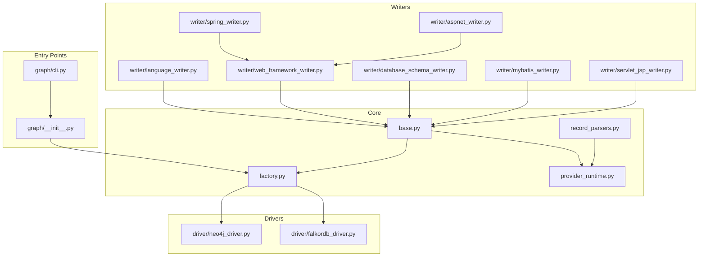
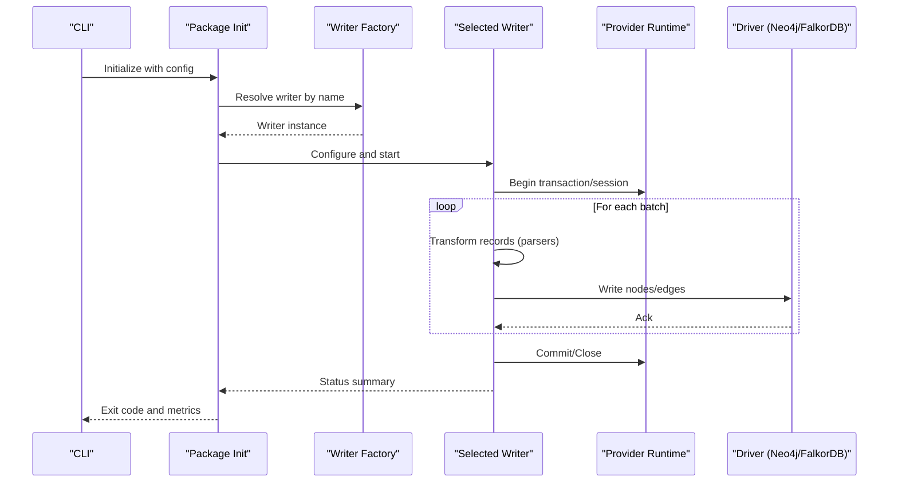
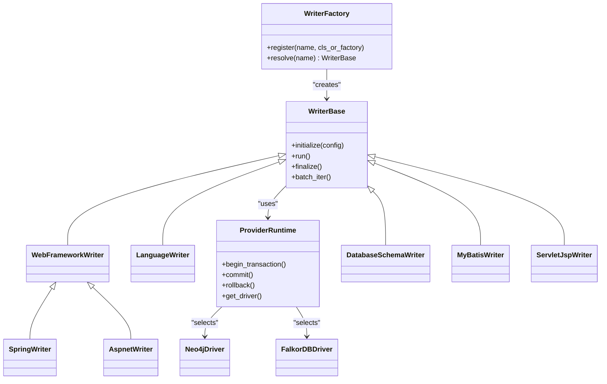

# Writer Configuration & Customization

<cite>
**Referenced Files in This Document**
- [writer/factory.py](file://code-tiny/tools/graph/core/factory.py)
- [writer/base.py](file://code-tiny/tools/graph/core/base.py)
- [writer/provider_runtime.py](file://code-tiny/tools/graph/core/provider_runtime.py)
- [writer/record_parsers.py](file://code-tiny/tools/graph/core/record_parsers.py)
- [writer/neo4j_driver.py](file://code-tiny/tools/graph/driver/neo4j_driver.py)
- [writer/falkordb_driver.py](file://code-tiny/tools/graph/driver/falkordb_driver.py)
- [writer/language_writer.py](file://code-tiny/tools/graph/writer/language_writer.py)
- [writer/web_framework_writer.py](file://code-tiny/tools/graph/writer/web_framework_writer.py)
- [writer/spring_writer.py](file://code-tiny/tools/graph/writer/spring_writer.py)
- [writer/aspnet_writer.py](file://code-tiny/tools/graph/writer/aspnet_writer.py)
- [writer/database_schema_writer.py](file://code-tiny/tools/graph/writer/database_schema_writer.py)
- [writer/mybatis_writer.py](file://code-tiny/tools/graph/writer/mybatis_writer.py)
- [writer/servlet_jsp_writer.py](file://code-tiny/tools/graph/writer/servlet_jsp_writer.py)
- [graph/__init__.py](file://code-tiny/tools/graph/__init__.py)
- [graph/cli.py](file://code-tiny/tools/graph/cli.py)
</cite>

## Table of Contents
1. [Introduction](#introduction)
2. [Project Structure](#project-structure)
3. [Core Components](#core-components)
4. [Architecture Overview](#architecture-overview)
5. [Detailed Component Analysis](#detailed-component-analysis)
6. [Dependency Analysis](#dependency-analysis)
7. [Performance Considerations](#performance-considerations)
8. [Troubleshooting Guide](#troubleshooting-guide)
9. [Conclusion](#conclusion)
10. [Appendices](#appendices)

## Introduction
This document explains how to configure and extend the graph writer subsystem, focusing on:
- The writer factory pattern for registration and discovery
- Configuration options for batch processing, memory management, and performance tuning
- Customization points for new node types, relationship patterns, and metadata attributes
- Guidelines for developing custom writers
- Testing strategies for writer validation
- Debugging techniques for ingestion issues
- Best practices for performance optimization and error handling

The goal is to enable you to add new writers safely, tune ingestion throughput, and maintain robustness under load.

## Project Structure
The writer subsystem is organized into core abstractions, driver implementations, and domain-specific writers:
- Core abstractions define the writer interface, runtime context, and record parsing utilities
- Drivers implement storage backends (Neo4j and FalkorDB)
- Domain writers implement ingestion logic for specific frameworks or domains
- CLI and package entrypoints orchestrate configuration and execution

**Diagram sources**
- [writer/base.py](file://code-tiny/tools/graph/core/base.py)
- [writer/factory.py](file://code-tiny/tools/graph/core/factory.py)
- [writer/provider_runtime.py](file://code-tiny/tools/graph/core/provider_runtime.py)
- [writer/record_parsers.py](file://code-tiny/tools/graph/core/record_parsers.py)
- [writer/neo4j_driver.py](file://code-tiny/tools/graph/driver/neo4j_driver.py)
- [writer/falkordb_driver.py](file://code-tiny/tools/graph/driver/falkordb_driver.py)
- [writer/language_writer.py](file://code-tiny/tools/graph/writer/language_writer.py)
- [writer/web_framework_writer.py](file://code-tiny/tools/graph/writer/web_framework_writer.py)
- [writer/spring_writer.py](file://code-tiny/tools/graph/writer/spring_writer.py)
- [writer/aspnet_writer.py](file://code-tiny/tools/graph/writer/aspnet_writer.py)
- [writer/database_schema_writer.py](file://code-tiny/tools/graph/writer/database_schema_writer.py)
- [writer/mybatis_writer.py](file://code-tiny/tools/graph/writer/mybatis_writer.py)
- [writer/servlet_jsp_writer.py](file://code-tiny/tools/graph/writer/servlet_jsp_writer.py)
- [graph/__init__.py](file://code-tiny/tools/graph/__init__.py)
- [graph/cli.py](file://code-tiny/tools/graph/cli.py)

**Section sources**
- [writer/base.py](file://code-tiny/tools/graph/core/base.py)
- [writer/factory.py](file://code-tiny/tools/graph/core/factory.py)
- [writer/provider_runtime.py](file://code-tiny/tools/graph/core/provider_runtime.py)
- [writer/record_parsers.py](file://code-tiny/tools/graph/core/record_parsers.py)
- [writer/neo4j_driver.py](file://code-tiny/tools/graph/driver/neo4j_driver.py)
- [writer/falkordb_driver.py](file://code-tiny/tools/graph/driver/falkordb_driver.py)
- [writer/language_writer.py](file://code-tiny/tools/graph/writer/language_writer.py)
- [writer/web_framework_writer.py](file://code-tiny/tools/graph/writer/web_framework_writer.py)
- [writer/spring_writer.py](file://code-tiny/tools/graph/writer/spring_writer.py)
- [writer/aspnet_writer.py](file://code-tiny/tools/graph/writer/aspnet_writer.py)
- [writer/database_schema_writer.py](file://code-tiny/tools/graph/writer/database_schema_writer.py)
- [writer/mybatis_writer.py](file://code-tiny/tools/graph/writer/mybatis_writer.py)
- [writer/servlet_jsp_writer.py](file://code-tiny/tools/graph/writer/servlet_jsp_writer.py)
- [graph/__init__.py](file://code-tiny/tools/graph/__init__.py)
- [graph/cli.py](file://code-tiny/tools/graph/cli.py)

## Core Components
- Writer base class: Defines the contract for all writers, including lifecycle methods, batching hooks, and metadata handling.
- Factory: Central registry that discovers and instantiates writers by name; supports dynamic registration and lookup.
- Provider runtime: Manages connection state, transaction boundaries, and shared resources across writers.
- Record parsers: Utilities to normalize raw records into canonical forms consumed by writers.
- Drivers: Backend adapters for Neo4j and FalkorDB, exposing low-level write primitives used by writers.

Key responsibilities:
- Registration and discovery: Writers register themselves with the factory at import time or via explicit calls.
- Batch control: Writers can override batching behavior to optimize throughput and memory usage.
- Metadata mapping: Writers map domain-specific attributes to canonical node/edge properties.

**Section sources**
- [writer/base.py](file://code-tiny/tools/graph/core/base.py)
- [writer/factory.py](file://code-tiny/tools/graph/core/factory.py)
- [writer/provider_runtime.py](file://code-tiny/tools/graph/core/provider_runtime.py)
- [writer/record_parsers.py](file://code-tiny/tools/graph/core/record_parsers.py)

## Architecture Overview
The writer architecture follows a layered design:
- Entry points (CLI and package init) resolve configuration and select a writer by name using the factory.
- The selected writer uses the provider runtime to coordinate transactions and resource access.
- Writers call driver APIs to perform writes, optionally leveraging record parsers to transform inputs.

**Diagram sources**
- [graph/cli.py](file://code-tiny/tools/graph/cli.py)
- [graph/__init__.py](file://code-tiny/tools/graph/__init__.py)
- [writer/factory.py](file://code-tiny/tools/graph/core/factory.py)
- [writer/provider_runtime.py](file://code-tiny/tools/graph/core/provider_runtime.py)
- [writer/neo4j_driver.py](file://code-tiny/tools/graph/driver/neo4j_driver.py)
- [writer/falkordb_driver.py](file://code-tiny/tools/graph/driver/falkordb_driver.py)

## Detailed Component Analysis

### Writer Base Class and Contracts
- Purpose: Define the writer interface and common behaviors such as initialization, batch iteration, and finalization.
- Customization points:
  - Override batch iteration to control chunk size and memory footprint.
  - Implement metadata mapping to convert domain attributes to canonical properties.
  - Provide error recovery hooks to handle transient failures and partial batches.

Best practices:
- Keep per-batch memory bounded by streaming records rather than loading entire datasets.
- Normalize IDs and labels consistently to avoid duplicates.
- Use idempotent writes where possible to support retries.

**Section sources**
- [writer/base.py](file://code-tiny/tools/graph/core/base.py)

### Writer Factory Pattern
- Purpose: Central registry for discovering and instantiating writers by name.
- Registration:
  - Writers typically register themselves during module import or via an explicit registration function.
  - The factory maintains a mapping from writer names to constructors or classes.
- Discovery:
  - Consumers request a writer by name; the factory returns a configured instance.
  - Supports overriding default registrations if needed.

Guidelines for adding a new writer:
- Create a new writer class implementing the base contract.
- Register the writer with the factory under a stable name.
- Ensure configuration keys are documented and validated.

**Section sources**
- [writer/factory.py](file://code-tiny/tools/graph/core/factory.py)

### Provider Runtime
- Purpose: Manage backend connections, sessions, and transaction boundaries shared across writers.
- Responsibilities:
  - Establish and reuse connections to the target database.
  - Provide transactional wrappers for batched writes.
  - Expose retry and timeout policies.

Configuration highlights:
- Connection parameters (host, port, credentials).
- Transaction size and timeout settings.
- Retry/backoff policies for transient errors.

**Section sources**
- [writer/provider_runtime.py](file://code-tiny/tools/graph/core/provider_runtime.py)

### Record Parsers
- Purpose: Normalize raw ingestion records into canonical structures expected by writers.
- Features:
  - Type coercion and validation.
  - Attribute renaming and merging.
  - Deduplication helpers based on identifiers.

Usage:
- Writers should parse and validate input early to fail fast.
- Use parsers to enforce consistent schema across different data sources.

**Section sources**
- [writer/record_parsers.py](file://code-tiny/tools/graph/core/record_parsers.py)

### Drivers (Neo4j and FalkorDB)
- Purpose: Low-level adapters for writing nodes and edges to supported databases.
- Differences:
  - API surface may vary between drivers; writers should depend on abstract operations provided by the runtime.
  - Performance characteristics differ; choose the appropriate driver based on workload.

Operational notes:
- Prefer bulk write APIs when available.
- Monitor driver-level metrics (latency, throughput, errors).

**Section sources**
- [writer/neo4j_driver.py](file://code-tiny/tools/graph/driver/neo4j_driver.py)
- [writer/falkordb_driver.py](file://code-tiny/tools/graph/driver/falkordb_driver.py)

### Domain-Specific Writers
Examples include language, web framework, Spring, ASP.NET, database schema, MyBatis, and Servlet/JSP writers. Each implements ingestion logic tailored to its domain while reusing the base contracts and runtime.

Common customization points:
- Node type definitions and label conventions.
- Relationship patterns and edge property mappings.
- Metadata attributes to capture source context and confidence scores.

**Section sources**
- [writer/language_writer.py](file://code-tiny/tools/graph/writer/language_writer.py)
- [writer/web_framework_writer.py](file://code-tiny/tools/graph/writer/web_framework_writer.py)
- [writer/spring_writer.py](file://code-tiny/tools/graph/writer/spring_writer.py)
- [writer/aspnet_writer.py](file://code-tiny/tools/graph/writer/aspnet_writer.py)
- [writer/database_schema_writer.py](file://code-tiny/tools/graph/writer/database_schema_writer.py)
- [writer/mybatis_writer.py](file://code-tiny/tools/graph/writer/mybatis_writer.py)
- [writer/servlet_jsp_writer.py](file://code-tiny/tools/graph/writer/servlet_jsp_writer.py)

### Entry Points and Orchestration
- Package init: Initializes global state and ensures factories are ready.
- CLI: Parses user configuration, selects a writer via the factory, and runs ingestion with progress reporting.

Integration tips:
- Validate configuration before starting ingestion.
- Log key decisions (selected writer, batch sizes, driver choice).

**Section sources**
- [graph/__init__.py](file://code-tiny/tools/graph/__init__.py)
- [graph/cli.py](file://code-tiny/tools/graph/cli.py)

## Dependency Analysis
The following diagram shows how components depend on each other:

**Diagram sources**
- [writer/base.py](file://code-tiny/tools/graph/core/base.py)
- [writer/factory.py](file://code-tiny/tools/graph/core/factory.py)
- [writer/provider_runtime.py](file://code-tiny/tools/graph/core/provider_runtime.py)
- [writer/neo4j_driver.py](file://code-tiny/tools/graph/driver/neo4j_driver.py)
- [writer/falkordb_driver.py](file://code-tiny/tools/graph/driver/falkordb_driver.py)
- [writer/language_writer.py](file://code-tiny/tools/graph/writer/language_writer.py)
- [writer/web_framework_writer.py](file://code-tiny/tools/graph/writer/web_framework_writer.py)
- [writer/spring_writer.py](file://code-tiny/tools/graph/writer/spring_writer.py)
- [writer/aspnet_writer.py](file://code-tiny/tools/graph/writer/aspnet_writer.py)
- [writer/database_schema_writer.py](file://code-tiny/tools/graph/writer/database_schema_writer.py)
- [writer/mybatis_writer.py](file://code-tiny/tools/graph/writer/mybatis_writer.py)
- [writer/servlet_jsp_writer.py](file://code-tiny/tools/graph/writer/servlet_jsp_writer.py)

**Section sources**
- [writer/base.py](file://code-tiny/tools/graph/core/base.py)
- [writer/factory.py](file://code-tiny/tools/graph/core/factory.py)
- [writer/provider_runtime.py](file://code-tiny/tools/graph/core/provider_runtime.py)
- [writer/neo4j_driver.py](file://code-tiny/tools/graph/driver/neo4j_driver.py)
- [writer/falkordb_driver.py](file://code-tiny/tools/graph/driver/falkordb_driver.py)
- [writer/language_writer.py](file://code-tiny/tools/graph/writer/language_writer.py)
- [writer/web_framework_writer.py](file://code-tiny/tools/graph/writer/web_framework_writer.py)
- [writer/spring_writer.py](file://code-tiny/tools/graph/writer/spring_writer.py)
- [writer/aspnet_writer.py](file://code-tiny/tools/graph/writer/aspnet_writer.py)
- [writer/database_schema_writer.py](file://code-tiny/tools/graph/writer/database_schema_writer.py)
- [writer/mybatis_writer.py](file://code-tiny/tools/graph/writer/mybatis_writer.py)
- [writer/servlet_jsp_writer.py](file://code-tiny/tools/graph/writer/servlet_jsp_writer.py)

## Performance Considerations
Batch processing:
- Tune batch size to balance throughput and memory usage. Larger batches improve throughput but increase memory pressure and failure impact.
- Stream records instead of buffering entire datasets.

Memory management:
- Avoid holding references to processed records after committing a batch.
- Reuse parser instances and minimize object allocations within hot paths.

Driver selection:
- Choose the driver that best matches your workload and deployment constraints.
- Enable bulk write modes when supported by the driver.

Indexing and constraints:
- Pre-create indexes and unique constraints on frequently queried fields to speed up upserts and deduplication.

Observability:
- Track per-batch metrics (records written, latency, errors) to identify bottlenecks.
- Use structured logging to correlate ingestion runs with system metrics.

[No sources needed since this section provides general guidance]

## Troubleshooting Guide
Common ingestion issues and remedies:
- Connection failures: Verify driver configuration and network reachability; check authentication and TLS settings.
- Transaction timeouts: Reduce batch size or increase transaction timeout; consider splitting large updates.
- Duplicate nodes/edges: Ensure deterministic ID generation and use idempotent write patterns.
- Schema mismatches: Validate records with parsers before writing; log rejected records for inspection.

Debugging techniques:
- Enable verbose logging for writer and driver layers.
- Inspect last successful batch and first failing batch to isolate problematic records.
- Use dry-run mode (if available) to validate transformations without persisting changes.

Error handling patterns:
- Wrap batch operations in try/except blocks with rollback on failure.
- Implement retry with exponential backoff for transient errors.
- Record partial successes and resume from checkpoint when possible.

**Section sources**
- [writer/provider_runtime.py](file://code-tiny/tools/graph/core/provider_runtime.py)
- [writer/record_parsers.py](file://code-tiny/tools/graph/core/record_parsers.py)
- [writer/neo4j_driver.py](file://code-tiny/tools/graph/driver/neo4j_driver.py)
- [writer/falkordb_driver.py](file://code-tiny/tools/graph/driver/falkordb_driver.py)

## Conclusion
By adhering to the writer base contract, registering writers through the factory, and leveraging the provider runtime and drivers, you can build robust, high-performance ingestion pipelines. Focus on deterministic IDs, idempotent writes, and well-tuned batch sizes to achieve reliable throughput. Use parsers to enforce schema consistency and apply strong error handling and observability to simplify debugging and maintenance.

[No sources needed since this section summarizes without analyzing specific files]

## Appendices

### Adding a New Writer: Step-by-Step
- Implement a writer class extending the base contract.
- Register the writer with the factory under a descriptive name.
- Map domain-specific node types and relationships to canonical forms.
- Configure batch size and driver options according to workload.
- Add tests to validate ingestion correctness and performance.

**Section sources**
- [writer/base.py](file://code-tiny/tools/graph/core/base.py)
- [writer/factory.py](file://code-tiny/tools/graph/core/factory.py)

### Testing Strategies for Writer Validation
- Unit tests: Validate record parsing and transformation logic.
- Integration tests: Run against a test database using both drivers.
- Contract tests: Assert node labels, edge types, and required properties.
- Performance tests: Measure throughput and memory usage under realistic loads.

**Section sources**
- [writer/record_parsers.py](file://code-tiny/tools/graph/core/record_parsers.py)
- [writer/neo4j_driver.py](file://code-tiny/tools/graph/driver/neo4j_driver.py)
- [writer/falkordb_driver.py](file://code-tiny/tools/graph/driver/falkordb_driver.py)

### Configuration Options Reference
- Writer selection: Name-based resolution via factory.
- Batching: Batch size, flush interval, and checkpointing.
- Memory: Streaming mode flags and buffer limits.
- Driver: Connection parameters, timeouts, and retry policies.
- Logging: Verbosity levels and output destinations.

**Section sources**
- [writer/factory.py](file://code-tiny/tools/graph/core/factory.py)
- [writer/provider_runtime.py](file://code-tiny/tools/graph/core/provider_runtime.py)
- [graph/cli.py](file://code-tiny/tools/graph/cli.py)