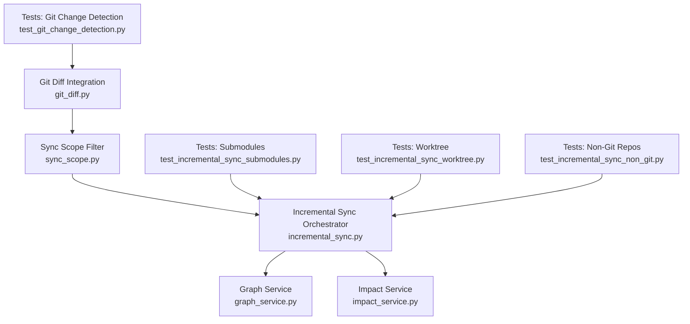
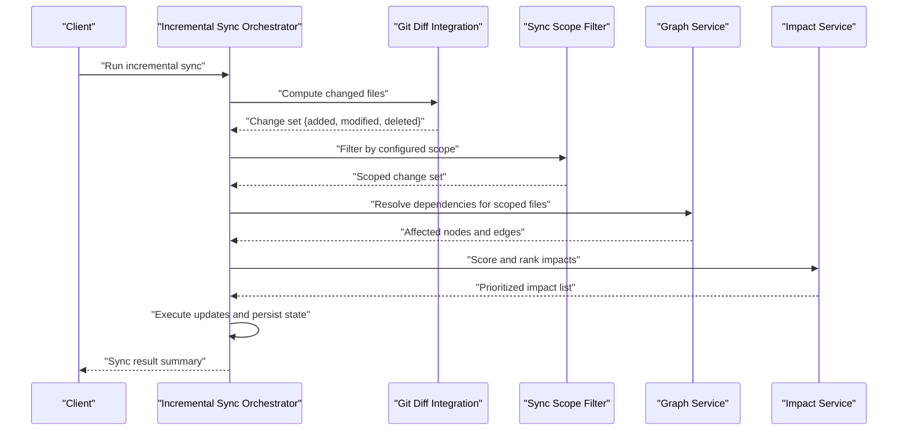
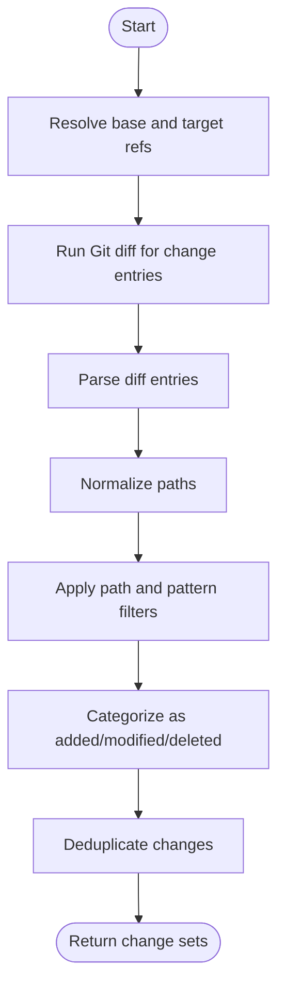
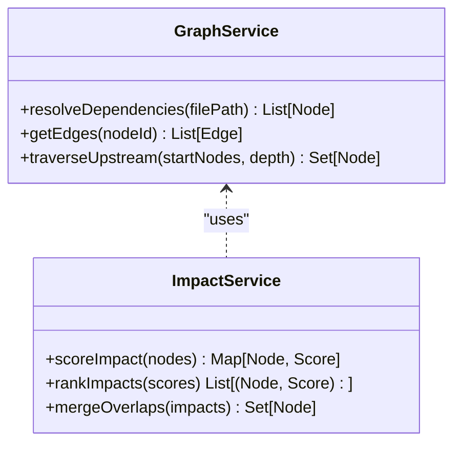
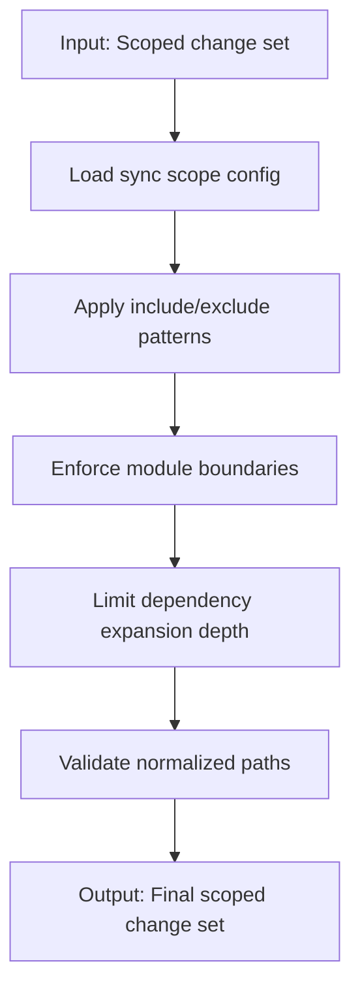
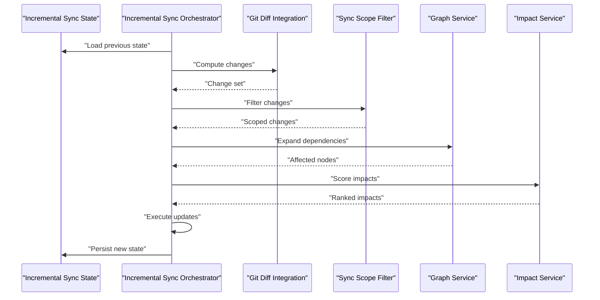
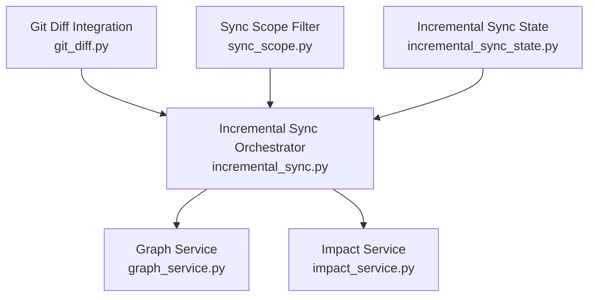

# Change Detection & Impact Analysis

<cite>
**Referenced Files in This Document**
- [git_diff.py](file://code-tiny/tools/common/git_diff.py)
- [sync_scope.py](file://code-tiny/tools/common/sync_scope.py)
- [incremental_sync_state.py](file://code-tiny/tools/common/incremental_sync_state.py)
- [incremental_sync.py](file://code-tiny/tools/sync/incremental_sync.py)
- [graph_service.py](file://code-tiny/mcp/services/graph_service.py)
- [impact_service.py](file://code-tiny/mcp/services/impact_service.py)
- [test_git_change_detection.py](file://tests/test_git_change_detection.py)
- [test_incremental_sync_submodules.py](file://tests/test_incremental_sync_submodules.py)
- [test_incremental_sync_worktree.py](file://tests/test_incremental_sync_worktree.py)
- [test_incremental_sync_non_git.py](file://tests/test_incremental_sync_non_git.py)
</cite>

## Table of Contents
1. [Introduction](#introduction)
2. [Project Structure](#project-structure)
3. [Core Components](#core-components)
4. [Architecture Overview](#architecture-overview)
5. [Detailed Component Analysis](#detailed-component-analysis)
6. [Dependency Analysis](#dependency-analysis)
7. [Performance Considerations](#performance-considerations)
8. [Troubleshooting Guide](#troubleshooting-guide)
9. [Conclusion](#conclusion)

## Introduction
This document explains the change detection and impact analysis system used by Cortex Harness to perform incremental synchronization across repositories. It covers:
- Git diff integration for identifying modified, deleted, and new files
- Dependency-based impact analysis that traces how changes propagate through code relationships
- Sync scope configuration to limit analysis to relevant areas based on change boundaries
- Handling complex scenarios such as submodules, worktrees, and non-Git repositories
- Configuration options for optimizing performance in large repositories
- Conflict resolution strategies when multiple changes affect the same elements
- Troubleshooting guidance for false positives and performance optimization techniques

## Project Structure
The change detection and impact analysis features are implemented primarily under:
- Common utilities for Git diff parsing and sync scoping
- Incremental sync orchestration
- MCP services exposing graph traversal and impact queries
- Tests validating behavior across Git submodules, worktrees, and non-Git repos

**Diagram sources**
- [git_diff.py](file://code-tiny/tools/common/git_diff.py)
- [sync_scope.py](file://code-tiny/tools/common/sync_scope.py)
- [incremental_sync.py](file://code-tiny/tools/sync/incremental_sync.py)
- [graph_service.py](file://code-tiny/mcp/services/graph_service.py)
- [impact_service.py](file://code-tiny/mcp/services/impact_service.py)
- [test_git_change_detection.py](file://tests/test_git_change_detection.py)
- [test_incremental_sync_submodules.py](file://tests/test_incremental_sync_submodules.py)
- [test_incremental_sync_worktree.py](file://tests/test_incremental_sync_worktree.py)
- [test_incremental_sync_non_git.py](file://tests/test_incremental_sync_non_git.py)

**Section sources**
- [git_diff.py](file://code-tiny/tools/common/git_diff.py)
- [sync_scope.py](file://code-tiny/tools/common/sync_scope.py)
- [incremental_sync.py](file://code-tiny/tools/sync/incremental_sync.py)
- [graph_service.py](file://code-tiny/mcp/services/graph_service.py)
- [impact_service.py](file://code-tiny/mcp/services/impact_service.py)
- [test_git_change_detection.py](file://tests/test_git_change_detection.py)
- [test_incremental_sync_submodules.py](file://tests/test_incremental_sync_submodules.py)
- [test_incremental_sync_worktree.py](file://tests/test_incremental_sync_worktree.py)
- [test_incremental_sync_non_git.py](file://tests/test_incremental_sync_non_git.py)

## Core Components
- Git Diff Integration: Parses repository diffs to enumerate added, modified, and deleted paths; supports range selection (commits or refs), filtering, and normalization.
- Sync Scope: Applies filters to restrict analysis to directories, file patterns, or module boundaries derived from change boundaries.
- Incremental Sync Orchestrator: Coordinates change detection, scope application, dependency expansion, and update execution while maintaining state.
- Graph and Impact Services: Provide graph traversal and impact scoring to determine affected modules and components.

Key responsibilities:
- Identify precise change sets with minimal overhead
- Limit downstream processing via configurable scopes
- Expand impact using code relationship graphs
- Persist and migrate incremental state safely

**Section sources**
- [git_diff.py](file://code-tiny/tools/common/git_diff.py)
- [sync_scope.py](file://code-tiny/tools/common/sync_scope.py)
- [incremental_sync.py](file://code-tiny/tools/sync/incremental_sync.py)
- [graph_service.py](file://code-tiny/mcp/services/graph_service.py)
- [impact_service.py](file://code-tiny/mcp/services/impact_service.py)

## Architecture Overview
The system composes a pipeline:
- Detect changes via Git diff
- Apply sync scope filters
- Expand impact using graph edges
- Execute targeted updates
- Persist incremental state

**Diagram sources**
- [incremental_sync.py](file://code-tiny/tools/sync/incremental_sync.py)
- [git_diff.py](file://code-tiny/tools/common/git_diff.py)
- [sync_scope.py](file://code-tiny/tools/common/sync_scope.py)
- [graph_service.py](file://code-tiny/mcp/services/graph_service.py)
- [impact_service.py](file://code-tiny/mcp/services/impact_service.py)

## Detailed Component Analysis

### Git Diff Integration Algorithm
Purpose:
- Enumerate added, modified, and deleted files between two Git references or within a commit range
- Normalize paths and handle edge cases like renames and binary files
- Support optional filters (path prefixes, ignore patterns)

Algorithm overview:
- Resolve base and target refs or commits
- Invoke Git diff to obtain raw change entries
- Parse entries into structured change records
- Normalize paths relative to repository root
- Apply filters and deduplicate changes
- Return categorized change sets

**Diagram sources**
- [git_diff.py](file://code-tiny/tools/common/git_diff.py)

**Section sources**
- [git_diff.py](file://code-tiny/tools/common/git_diff.py)
- [test_git_change_detection.py](file://tests/test_git_change_detection.py)

### Dependency Impact Analysis
Purpose:
- Trace how changes propagate through code relationships
- Determine affected modules and components
- Score impacts to prioritize updates

Approach:
- Use graph service to resolve direct and transitive dependencies for each changed file
- Traverse edges to build an impact set
- Apply impact scoring rules to rank affected elements
- Merge overlapping impacts and remove redundant nodes

**Diagram sources**
- [graph_service.py](file://code-tiny/mcp/services/graph_service.py)
- [impact_service.py](file://code-tiny/mcp/services/impact_service.py)

**Section sources**
- [graph_service.py](file://code-tiny/mcp/services/graph_service.py)
- [impact_service.py](file://code-tiny/mcp/services/impact_service.py)

### Sync Scope Configuration
Purpose:
- Limit analysis to relevant areas based on change boundaries
- Reduce processing time and memory usage in large repositories

Configuration aspects:
- Path-based filters (include/exclude patterns)
- Module boundary constraints
- Depth limits for dependency expansion
- Repository-relative vs absolute path handling

**Diagram sources**
- [sync_scope.py](file://code-tiny/tools/common/sync_scope.py)

**Section sources**
- [sync_scope.py](file://code-tiny/tools/common/sync_scope.py)

### Incremental Sync Orchestration
Purpose:
- Coordinate change detection, scoping, impact analysis, and updates
- Maintain and migrate incremental state safely

Workflow:
- Load previous state
- Compute current changes
- Apply sync scope
- Expand impact via graph and impact services
- Execute updates and record results
- Persist updated state

**Diagram sources**
- [incremental_sync.py](file://code-tiny/tools/sync/incremental_sync.py)
- [incremental_sync_state.py](file://code-tiny/tools/common/incremental_sync_state.py)
- [git_diff.py](file://code-tiny/tools/common/git_diff.py)
- [sync_scope.py](file://code-tiny/tools/common/sync_scope.py)
- [graph_service.py](file://code-tiny/mcp/services/graph_service.py)
- [impact_service.py](file://code-tiny/mcp/services/impact_service.py)

**Section sources**
- [incremental_sync.py](file://code-tiny/tools/sync/incremental_sync.py)
- [incremental_sync_state.py](file://code-tiny/tools/common/incremental_sync_state.py)

### Complex Scenarios

#### Submodule Changes
Behavior:
- Detect submodule pointer updates and treat them as changes to the parent repo
- Optionally recurse into submodules to analyze internal changes if configured
- Merge submodule impacts into the parent’s impact set

Validation:
- Tests cover submodule change detection and propagation

**Section sources**
- [test_incremental_sync_submodules.py](file://tests/test_incremental_sync_submodules.py)

#### Worktree Compatibility
Behavior:
- Resolve repository root correctly in worktree contexts
- Ensure path normalization is compatible with worktree-specific layouts
- Avoid stale cache invalidation issues due to different working trees

Validation:
- Tests verify correct behavior under worktree configurations

**Section sources**
- [test_incremental_sync_worktree.py](file://tests/test_incremental_sync_worktree.py)

#### Non-Git Repositories
Behavior:
- Gracefully detect non-Git repositories and fall back to filesystem-based scanning
- Use file modification times and checksums to approximate changes
- Maintain consistent API surface for callers

Validation:
- Tests ensure fallback logic works without errors

**Section sources**
- [test_incremental_sync_non_git.py](file://tests/test_incremental_sync_non_git.py)

## Dependency Analysis
The following diagram shows core dependencies among components involved in change detection and impact analysis.

**Diagram sources**
- [git_diff.py](file://code-tiny/tools/common/git_diff.py)
- [sync_scope.py](file://code-tiny/tools/common/sync_scope.py)
- [incremental_sync.py](file://code-tiny/tools/sync/incremental_sync.py)
- [incremental_sync_state.py](file://code-tiny/tools/common/incremental_sync_state.py)
- [graph_service.py](file://code-tiny/mcp/services/graph_service.py)
- [impact_service.py](file://code-tiny/mcp/services/impact_service.py)

**Section sources**
- [git_diff.py](file://code-tiny/tools/common/git_diff.py)
- [sync_scope.py](file://code-tiny/tools/common/sync_scope.py)
- [incremental_sync.py](file://code-tiny/tools/sync/incremental_sync.py)
- [incremental_sync_state.py](file://code-tiny/tools/common/incremental_sync_state.py)
- [graph_service.py](file://code-tiny/mcp/services/graph_service.py)
- [impact_service.py](file://code-tiny/mcp/services/impact_service.py)

## Performance Considerations
Optimization strategies:
- Configure sync scope filters to minimize the number of files analyzed
- Limit dependency expansion depth to reduce graph traversal cost
- Use commit ranges instead of full history scans where possible
- Enable caching for graph lookups and impact scores
- Prefer narrow ref comparisons (e.g., branch tip vs last known state)
- Exclude irrelevant directories and file patterns at the diff stage
- Batch updates and persist incremental state incrementally

[No sources needed since this section provides general guidance]

## Troubleshooting Guide
Common issues and resolutions:
- False positives in change detection:
  - Verify include/exclude patterns in sync scope
  - Check path normalization and repository root resolution
  - Confirm Git diff range inputs are correct
- Performance regressions:
  - Increase scope specificity
  - Reduce dependency expansion depth
  - Validate cache effectiveness and clear stale entries
- Submodule anomalies:
  - Ensure submodule pointers are updated and tracked
  - Confirm recursion settings align with expectations
- Worktree inconsistencies:
  - Validate repository root discovery in worktree context
  - Ensure path mappings are consistent across worktrees
- Non-Git repository fallback:
  - Confirm filesystem scan mode is enabled
  - Review checksum computation and mtime handling

**Section sources**
- [test_git_change_detection.py](file://tests/test_git_change_detection.py)
- [test_incremental_sync_submodules.py](file://tests/test_incremental_sync_submodules.py)
- [test_incremental_sync_worktree.py](file://tests/test_incremental_sync_worktree.py)
- [test_incremental_sync_non_git.py](file://tests/test_incremental_sync_non_git.py)

## Conclusion
Cortex Harness implements a robust change detection and impact analysis pipeline that integrates Git diff parsing, configurable sync scoping, and graph-driven dependency expansion. The system handles complex environments including submodules, worktrees, and non-Git repositories, while providing mechanisms to optimize performance and resolve conflicts. Proper configuration of sync scope and dependency expansion parameters is key to achieving accurate and efficient incremental synchronization in large codebases.