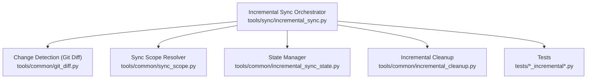
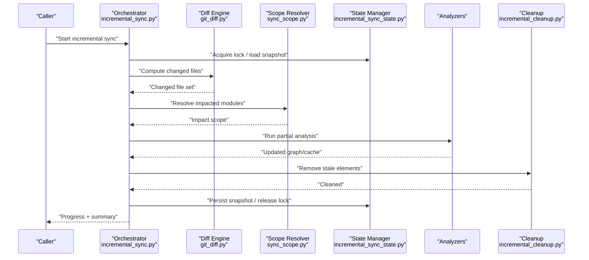
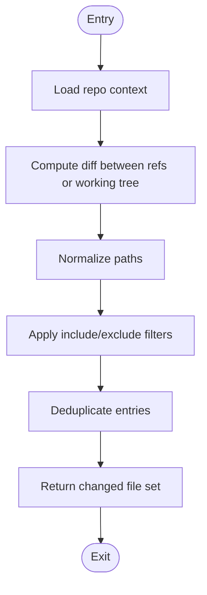
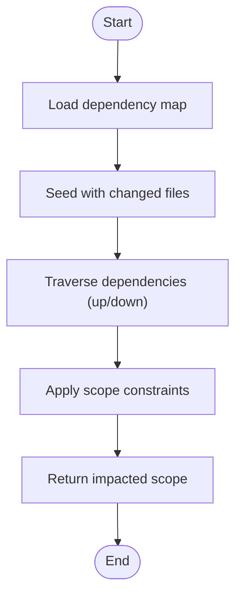
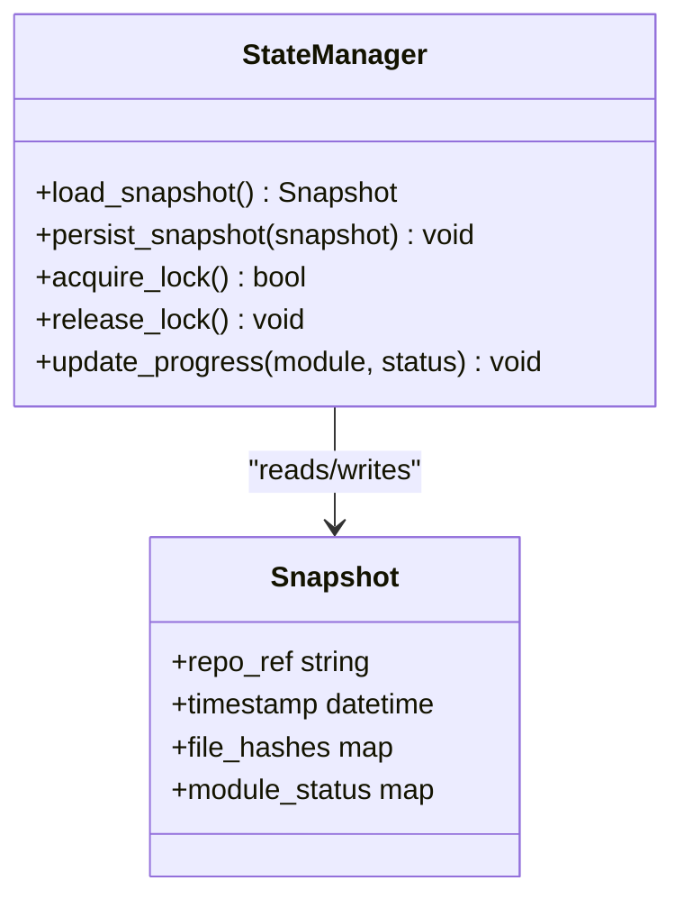
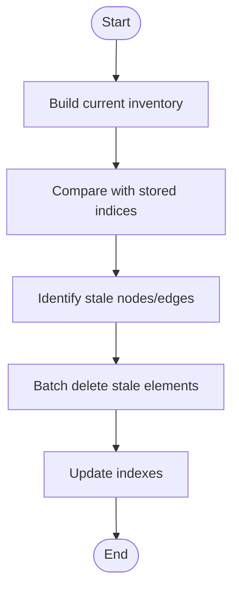
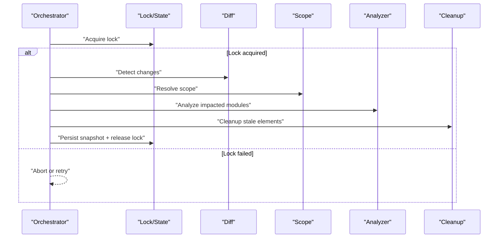
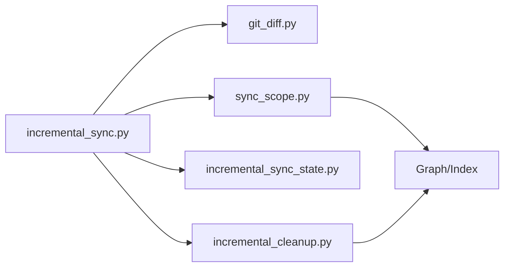

# Incremental Analysis & Sync

<cite>
**Referenced Files in This Document**
- [git_diff.py](file://code-tiny/tools/common/git_diff.py)
- [incremental_sync_state.py](file://code-tiny/tools/common/incremental_sync_state.py)
- [sync_scope.py](file://code-tiny/tools/common/sync_scope.py)
- [incremental_cleanup.py](file://code-tiny/tools/common/incremental_cleanup.py)
- [incremental_sync.py](file://code-tiny/tools/sync/incremental_sync.py)
- [test_git_change_detection.py](file://tests/test_git_change_detection.py)
- [test_incremental_sync_bootstrap.py](file://tests/test_incremental_sync_bootstrap.py)
- [test_incremental_sync_lock.py](file://tests/test_incremental_sync_lock.py)
- [test_incremental_sync_non_git.py](file://tests/test_incremental_sync_non_git.py)
- [test_incremental_sync_submodules.py](file://tests/test_incremental_sync_submodules.py)
- [test_incremental_sync_worktree.py](file://tests/test_incremental_sync_worktree.py)
</cite>

## Table of Contents
1. [Introduction](#introduction)
2. [Project Structure](#project-structure)
3. [Core Components](#core-components)
4. [Architecture Overview](#architecture-overview)
5. [Detailed Component Analysis](#detailed-component-analysis)
6. [Dependency Analysis](#dependency-analysis)
7. [Performance Considerations](#performance-considerations)
8. [Troubleshooting Guide](#troubleshooting-guide)
9. [Conclusion](#conclusion)
10. [Appendices](#appendices)

## Introduction
This document explains the incremental analysis and synchronization system used by Cortex Harness to keep code graphs, caches, and related artifacts up-to-date with minimal work. It focuses on:
- Change detection using Git diff integration
- File modification tracking and dependency impact analysis
- State management for progress persistence and recovery
- Cache invalidation strategies and conflict resolution
- Sync scope configuration to limit analysis to affected modules
- Incremental cleanup procedures for stale graph elements
- Configuration examples for large repositories, submodules, and worktrees
- Performance monitoring, progress reporting, and interrupted analysis recovery
- Troubleshooting common issues and CI/CD best practices

## Project Structure
The incremental sync subsystem is implemented under the shared tools and a dedicated sync module, with comprehensive tests covering edge cases such as non-Git repos, submodules, and worktrees.

**Diagram sources**
- [incremental_sync.py](file://code-tiny/tools/sync/incremental_sync.py)
- [git_diff.py](file://code-tiny/tools/common/git_diff.py)
- [sync_scope.py](file://code-tiny/tools/common/sync_scope.py)
- [incremental_sync_state.py](file://code-tiny/tools/common/incremental_sync_state.py)
- [incremental_cleanup.py](file://code-tiny/tools/common/incremental_cleanup.py)
- [test_git_change_detection.py](file://tests/test_git_change_detection.py)
- [test_incremental_sync_bootstrap.py](file://tests/test_incremental_sync_bootstrap.py)
- [test_incremental_sync_lock.py](file://tests/test_incremental_sync_lock.py)
- [test_incremental_sync_non_git.py](file://tests/test_incremental_sync_non_git.py)
- [test_incremental_sync_submodules.py](file://tests/test_incremental_sync_submodules.py)
- [test_incremental_sync_worktree.py](file://tests/test_incremental_sync_worktree.py)

**Section sources**
- [incremental_sync.py](file://code-tiny/tools/sync/incremental_sync.py)
- [git_diff.py](file://code-tiny/tools/common/git_diff.py)
- [sync_scope.py](file://code-tiny/tools/common/sync_scope.py)
- [incremental_sync_state.py](file://code-tiny/tools/common/incremental_sync_state.py)
- [incremental_cleanup.py](file://code-tiny/tools/common/incremental_cleanup.py)
- [test_git_change_detection.py](file://tests/test_git_change_detection.py)
- [test_incremental_sync_bootstrap.py](file://tests/test_incremental_sync_bootstrap.py)
- [test_incremental_sync_lock.py](file://tests/test_incremental_sync_lock.py)
- [test_incremental_sync_non_git.py](file://tests/test_incremental_sync_non_git.py)
- [test_incremental_sync_submodules.py](file://tests/test_incremental_sync_submodules.py)
- [test_incremental_sync_worktree.py](file://tests/test_incremental_sync_worktree.py)

## Core Components
- Change Detection (Git Diff): Computes file-level deltas between revisions or working tree vs index, normalizes paths, and filters by include/exclude patterns.
- Sync Scope: Resolves which modules or packages are impacted by changed files using dependency metadata and repository topology.
- State Manager: Persists analysis progress, last-synced snapshots, and lock state to support resuming after interruptions and avoiding concurrent runs.
- Incremental Cleanup: Removes stale nodes/edges and unused artifacts based on current source inventory and dependency graph.
- Orchestration: Coordinates change detection, scope resolution, re-analysis, cache updates, and cleanup with progress reporting and error handling.

**Section sources**
- [git_diff.py](file://code-tiny/tools/common/git_diff.py)
- [sync_scope.py](file://code-tiny/tools/common/sync_scope.py)
- [incremental_sync_state.py](file://code-tiny/tools/common/incremental_sync_state.py)
- [incremental_cleanup.py](file://code-tiny/tools/common/incremental_cleanup.py)
- [incremental_sync.py](file://code-tiny/tools/sync/incremental_sync.py)

## Architecture Overview
The orchestrator composes specialized components to perform an incremental update cycle: detect changes, compute impact scope, analyze only what is necessary, persist state, and clean up stale data.

**Diagram sources**
- [incremental_sync.py](file://code-tiny/tools/sync/incremental_sync.py)
- [git_diff.py](file://code-tiny/tools/common/git_diff.py)
- [sync_scope.py](file://code-tiny/tools/common/sync_scope.py)
- [incremental_sync_state.py](file://code-tiny/tools/common/incremental_sync_state.py)
- [incremental_cleanup.py](file://code-tiny/tools/common/incremental_cleanup.py)

## Detailed Component Analysis

### Change Detection Algorithm (Git Diff Integration)
- Inputs: repository root, base and head references (or working tree), optional path filters.
- Outputs: normalized list of added/modified/deleted files within the configured scope.
- Key behaviors:
  - Uses Git diff commands to enumerate changes efficiently.
  - Normalizes paths to repository-relative form.
  - Applies include/exclude patterns to reduce noise.
  - Handles renames and binary files where applicable.
  - Provides deterministic ordering for reproducibility.

**Diagram sources**
- [git_diff.py](file://code-tiny/tools/common/git_diff.py)

**Section sources**
- [git_diff.py](file://code-tiny/tools/common/git_diff.py)
- [test_git_change_detection.py](file://tests/test_git_change_detection.py)

### Dependency Impact Analysis and Sync Scope
- Purpose: Limit re-analysis to modules/packages impacted by changed files.
- Mechanism:
  - Builds or loads a dependency map from the existing graph or manifest.
  - Traverses upstream/downstream edges from changed files to identify impacted modules.
  - Applies additional constraints (e.g., workspace boundaries, ignore lists).
- Outputs: a scoped set of modules/files to re-analyze.

**Diagram sources**
- [sync_scope.py](file://code-tiny/tools/common/sync_scope.py)

**Section sources**
- [sync_scope.py](file://code-tiny/tools/common/sync_scope.py)

### State Management and Progress Persistence
- Responsibilities:
  - Persist last successful sync snapshot (refs, timestamps, file hashes).
  - Track per-module analysis status and counters.
  - Manage locks to prevent concurrent runs.
  - Support resume after interruption by reading latest snapshot.
- Recovery:
  - On startup, attempt to acquire lock; if held by another process, wait or fail fast based on config.
  - If interrupted mid-run, snapshot is persisted at safe checkpoints to allow resumption.

**Diagram sources**
- [incremental_sync_state.py](file://code-tiny/tools/common/incremental_sync_state.py)

**Section sources**
- [incremental_sync_state.py](file://code-tiny/tools/common/incremental_sync_state.py)
- [test_incremental_sync_lock.py](file://tests/test_incremental_sync_lock.py)
- [test_incremental_sync_bootstrap.py](file://tests/test_incremental_sync_bootstrap.py)

### Incremental Cleanup Procedures
- Goals:
  - Remove orphaned nodes/edges no longer referenced by current source inventory.
  - Prune unused caches and temporary artifacts.
  - Reconcile graph consistency after deletions or renames.
- Strategy:
  - Compare current inventory against stored indices.
  - Mark and delete stale elements in batches.
  - Update indexes post-cleanup to maintain consistency.

**Diagram sources**
- [incremental_cleanup.py](file://code-tiny/tools/common/incremental_cleanup.py)

**Section sources**
- [incremental_cleanup.py](file://code-tiny/tools/common/incremental_cleanup.py)

### Orchestration Flow and Conflict Resolution
- Flow:
  - Acquire lock and load snapshot.
  - Detect changes and resolve scope.
  - Run partial analysis for impacted modules.
  - Persist updated snapshot and release lock.
  - Perform cleanup pass.
- Conflict Resolution:
  - Lock contention: retry with backoff or abort depending on policy.
  - Snapshot divergence: validate ref/timestamps and decide whether to restart full sync.
  - Non-Git repos: fallback to filesystem-based change detection when Git is unavailable.

**Diagram sources**
- [incremental_sync.py](file://code-tiny/tools/sync/incremental_sync.py)
- [incremental_sync_state.py](file://code-tiny/tools/common/incremental_sync_state.py)
- [git_diff.py](file://code-tiny/tools/common/git_diff.py)
- [sync_scope.py](file://code-tiny/tools/common/sync_scope.py)
- [incremental_cleanup.py](file://code-tiny/tools/common/incremental_cleanup.py)

**Section sources**
- [incremental_sync.py](file://code-tiny/tools/sync/incremental_sync.py)
- [test_incremental_sync_lock.py](file://tests/test_incremental_sync_lock.py)
- [test_incremental_sync_non_git.py](file://tests/test_incremental_sync_non_git.py)

## Dependency Analysis
High-level coupling among core components:
- Orchestrator depends on Diff, Scope, State, and Cleanup.
- Diff is independent of other components except repository context.
- Scope depends on dependency maps derived from the graph or manifests.
- State is isolated and accessed via clear interfaces.
- Cleanup operates on the graph and indexes post-analysis.

**Diagram sources**
- [incremental_sync.py](file://code-tiny/tools/sync/incremental_sync.py)
- [git_diff.py](file://code-tiny/tools/common/git_diff.py)
- [sync_scope.py](file://code-tiny/tools/common/sync_scope.py)
- [incremental_sync_state.py](file://code-tiny/tools/common/incremental_sync_state.py)
- [incremental_cleanup.py](file://code-tiny/tools/common/incremental_cleanup.py)

**Section sources**
- [incremental_sync.py](file://code-tiny/tools/sync/incremental_sync.py)
- [git_diff.py](file://code-tiny/tools/common/git_diff.py)
- [sync_scope.py](file://code-tiny/tools/common/sync_scope.py)
- [incremental_sync_state.py](file://code-tiny/tools/common/incremental_sync_state.py)
- [incremental_cleanup.py](file://code-tiny/tools/common/incremental_cleanup.py)

## Performance Considerations
- Prefer Git-backed diffs over filesystem scans for large repos.
- Use narrow sync scopes to minimize re-analysis.
- Batch cleanup operations to avoid long-running transactions.
- Persist snapshots at safe checkpoints to enable resumable runs.
- Monitor throughput and latency metrics for each phase (diff, scope, analyze, cleanup).
- Tune concurrency limits for analyzer workers based on available CPU and I/O capacity.

[No sources needed since this section provides general guidance]

## Troubleshooting Guide
Common issues and resolutions:
- False positives in change detection:
  - Verify include/exclude patterns and normalization rules.
  - Ensure correct base/head refs and consider staged vs unstaged changes.
- State corruption:
  - Validate snapshot integrity before resume; if inconsistent, reset to last known good state.
  - Check lock files for stale locks and remove them safely.
- Performance bottlenecks:
  - Profile diff computation and scope traversal; adjust filters and depth.
  - Increase batch sizes for cleanup; ensure indexes are optimized.
- Non-Git environments:
  - Confirm fallback to filesystem-based detection works and that mtime-based heuristics are acceptable.
- Submodules and worktrees:
  - Validate submodule initialization and worktree-specific refs; ensure paths are resolved relative to the active worktree.

**Section sources**
- [test_git_change_detection.py](file://tests/test_git_change_detection.py)
- [test_incremental_sync_bootstrap.py](file://tests/test_incremental_sync_bootstrap.py)
- [test_incremental_sync_lock.py](file://tests/test_incremental_sync_lock.py)
- [test_incremental_sync_non_git.py](file://tests/test_incremental_sync_non_git.py)
- [test_incremental_sync_submodules.py](file://tests/test_incremental_sync_submodules.py)
- [test_incremental_sync_worktree.py](file://tests/test_incremental_sync_worktree.py)

## Conclusion
Cortex Harness incremental sync combines efficient Git diffing, precise scope resolution, robust state management, and targeted cleanup to deliver fast, reliable updates for large repositories. With proper configuration and observability, it integrates smoothly into CI/CD pipelines while minimizing resource usage and ensuring consistent graph state.

[No sources needed since this section summarizes without analyzing specific files]

## Appendices

### Configuration Examples
- Large repository handling:
  - Enable Git-backed diff, restrict scope to changed modules, and increase batch sizes for cleanup.
- Submodule support:
  - Initialize submodules prior to sync; configure paths to include submodule roots in scope resolution.
- Worktree compatibility:
  - Resolve repository root and refs relative to the active worktree; ensure lock storage is worktree-scoped.

[No sources needed since this section provides general guidance]

### CI/CD Best Practices
- Pre-flight checks:
  - Ensure Git availability and correct refs; initialize submodules if required.
- Idempotency:
  - Always run incremental sync with lock acquisition; handle lock contention gracefully.
- Observability:
  - Emit structured logs for each phase (diff, scope, analyze, cleanup) and expose metrics.
- Rollback strategy:
  - Keep previous snapshot accessible; if sync fails, revert to last known good state.

[No sources needed since this section provides general guidance]