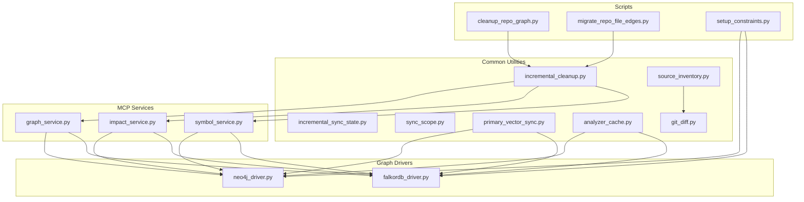
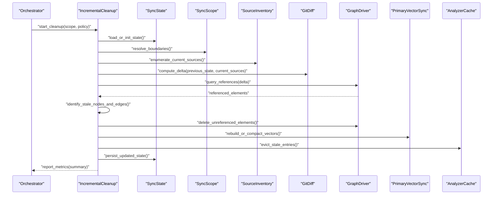
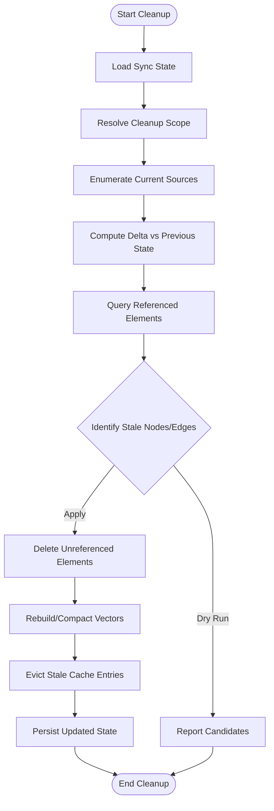
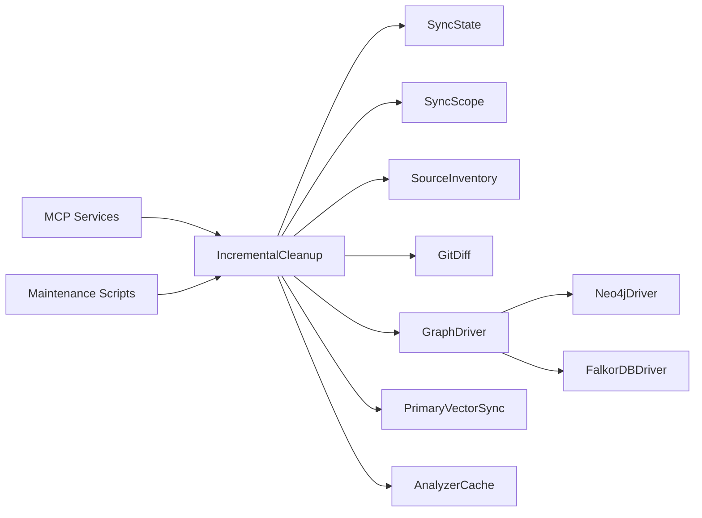

# Incremental Cleanup & Storage Optimization

<cite>
**Referenced Files in This Document**
- [incremental_cleanup.py](file://code-tiny/tools/common/incremental_cleanup.py)
- [incremental_sync_state.py](file://code-tiny/tools/common/incremental_sync_state.py)
- [sync_scope.py](file://code-tiny/tools/common/sync_scope.py)
- [graph_service.py](file://code-tiny/mcp/services/graph_service.py)
- [impact_service.py](file://code-tiny/mcp/services/impact_service.py)
- [symbol_service.py](file://code-tiny/mcp/services/symbol_service.py)
- [harness_config.py](file://code-tiny/tools/common/harness_config.py)
- [cleanup_repo_graph.py](file://code-tiny/scripts/cleanup_repo_graph.py)
- [migrate_repo_file_edges.py](file://code-tiny/scripts/migrate_repo_file_edges.py)
- [setup_constraints.py](file://code-tiny/scripts/setup_constraints.py)
- [falkordb_driver.py](file://code-tiny/tools/graph/driver/falkordb_driver.py)
- [neo4j_driver.py](file://code-tiny/tools/graph/driver/neo4j_driver.py)
- [database_schema_analyzer.py](file://code-tiny/tools/database_schema/database_schema_analyzer.py)
- [models.py](file://code-tiny/tools/database_schema/models.py)
- [pipeline.py](file://code-tiny/tools/database_schema/pipeline.py)
- [primary_vector_sync.py](file://code-tiny/tools/common/primary_vector_sync.py)
- [analyzer_cache.py](file://code-tiny/tools/common/analyzer_cache.py)
- [source_inventory.py](file://code-tiny/tools/common/source_inventory.py)
- [git_diff.py](file://code-tiny/tools/common/git_diff.py)
- [test_incremental_sync_lock.py](file://tests/test_incremental_sync_lock.py)
- [test_incremental_sync_state_migration.py](file://tests/test_incremental_sync_state_migration.py)
- [test_primary_vector_sync.py](file://tests/test_primary_vector_sync.py)
</cite>

## Table of Contents
1. [Introduction](#introduction)
2. [Project Structure](#project-structure)
3. [Core Components](#core-components)
4. [Architecture Overview](#architecture-overview)
5. [Detailed Component Analysis](#detailed-component-analysis)
6. [Dependency Analysis](#dependency-analysis)
7. [Performance Considerations](#performance-considerations)
8. [Troubleshooting Guide](#troubleshooting-guide)
9. [Conclusion](#conclusion)
10. [Appendices](#appendices)

## Introduction
This document explains incremental cleanup and storage optimization procedures in Cortex Harness. It focuses on identifying and removing stale graph nodes, edges, and metadata no longer referenced by current source code; garbage collection strategies for orphaned elements; memory optimization techniques; database compaction and index rebuilding; space reclamation; configuration options for scheduling, retention policies, and resource limits; monitoring and measurement; backup and recovery before cleanup; and troubleshooting guidance for failures, storage bloat, and performance degradation after extended analysis periods.

## Project Structure
The cleanup and optimization capabilities are implemented across shared utilities, MCP services, graph drivers, and scripts:
- Shared utilities implement change detection, state management, scope control, and vector sync.
- MCP services expose operations to trigger cleanup and query graph health.
- Graph drivers provide low-level access to the underlying graph store (Neo4j or FalkorDB).
- Scripts orchestrate repository-level cleanup and schema maintenance.

**Diagram sources**
- [incremental_cleanup.py](file://code-tiny/tools/common/incremental_cleanup.py)
- [incremental_sync_state.py](file://code-tiny/tools/common/incremental_sync_state.py)
- [sync_scope.py](file://code-tiny/tools/common/sync_scope.py)
- [primary_vector_sync.py](file://code-tiny/tools/common/primary_vector_sync.py)
- [analyzer_cache.py](file://code-tiny/tools/common/analyzer_cache.py)
- [source_inventory.py](file://code-tiny/tools/common/source_inventory.py)
- [git_diff.py](file://code-tiny/tools/common/git_diff.py)
- [graph_service.py](file://code-tiny/mcp/services/graph_service.py)
- [impact_service.py](file://code-tiny/mcp/services/impact_service.py)
- [symbol_service.py](file://code-tiny/mcp/services/symbol_service.py)
- [neo4j_driver.py](file://code-tiny/tools/graph/driver/neo4j_driver.py)
- [falkordb_driver.py](file://code-tiny/tools/graph/driver/falkordb_driver.py)
- [cleanup_repo_graph.py](file://code-tiny/scripts/cleanup_repo_graph.py)
- [migrate_repo_file_edges.py](file://code-tiny/scripts/migrate_repo_file_edges.py)
- [setup_constraints.py](file://code-tiny/scripts/setup_constraints.py)

**Section sources**
- [incremental_cleanup.py](file://code-tiny/tools/common/incremental_cleanup.py)
- [incremental_sync_state.py](file://code-tiny/tools/common/incremental_sync_state.py)
- [sync_scope.py](file://code-tiny/tools/common/sync_scope.py)
- [graph_service.py](file://code-tiny/mcp/services/graph_service.py)
- [impact_service.py](file://code-tiny/mcp/services/impact_service.py)
- [symbol_service.py](file://code-tiny/mcp/services/symbol_service.py)
- [falkordb_driver.py](file://code-tiny/tools/graph/driver/falkordb_driver.py)
- [neo4j_driver.py](file://code-tiny/tools/graph/driver/neo4j_driver.py)
- [cleanup_repo_graph.py](file://code-tiny/scripts/cleanup_repo_graph.py)
- [migrate_repo_file_edges.py](file://code-tiny/scripts/migrate_repo_file_edges.py)
- [setup_constraints.py](file://code-tiny/scripts/setup_constraints.py)
- [primary_vector_sync.py](file://code-tiny/tools/common/primary_vector_sync.py)
- [analyzer_cache.py](file://code-tiny/tools/common/analyzer_cache.py)
- [source_inventory.py](file://code-tiny/tools/common/source_inventory.py)
- [git_diff.py](file://code-tiny/tools/common/git_diff.py)

## Core Components
- Incremental cleanup engine: identifies stale nodes, edges, and metadata by comparing current source inventory with stored references and removes unreferenced artifacts safely.
- Sync state manager: persists and migrates incremental scan state to ensure idempotent and resumable operations.
- Scope controller: defines boundaries for cleanup (e.g., per project, per language, per module) to limit blast radius.
- Vector sync utility: keeps primary vectors consistent with graph changes and supports compaction/rebuild workflows.
- Cache manager: evicts and prunes analyzer caches aligned with cleanup to prevent stale cache entries from bloating memory.
- Source inventory and diff: enumerates current files and computes deltas to guide targeted cleanup.
- MCP services: expose cleanup triggers and reporting endpoints for orchestration and monitoring.
- Graph drivers: provide low-level operations for deletion, compaction, and index management across Neo4j and FalkorDB.
- Maintenance scripts: run repository-wide cleanup, edge migration, and constraint setup.

**Section sources**
- [incremental_cleanup.py](file://code-tiny/tools/common/incremental_cleanup.py)
- [incremental_sync_state.py](file://code-tiny/tools/common/incremental_sync_state.py)
- [sync_scope.py](file://code-tiny/tools/common/sync_scope.py)
- [primary_vector_sync.py](file://code-tiny/tools/common/primary_vector_sync.py)
- [analyzer_cache.py](file://code-tiny/tools/common/analyzer_cache.py)
- [source_inventory.py](file://code-tiny/tools/common/source_inventory.py)
- [git_diff.py](file://code-tiny/tools/common/git_diff.py)
- [graph_service.py](file://code-tiny/mcp/services/graph_service.py)
- [impact_service.py](file://code-tiny/mcp/services/impact_service.py)
- [symbol_service.py](file://code-tiny/mcp/services/symbol_service.py)
- [falkordb_driver.py](file://code-tiny/tools/graph/driver/falkordb_driver.py)
- [neo4j_driver.py](file://code-tiny/tools/graph/driver/neo4j_driver.py)
- [cleanup_repo_graph.py](file://code-tiny/scripts/cleanup_repo_graph.py)
- [migrate_repo_file_edges.py](file://code-tiny/scripts/migrate_repo_file_edges.py)
- [setup_constraints.py](file://code-tiny/scripts/setup_constraints.py)

## Architecture Overview
The cleanup pipeline integrates change detection, graph traversal, and driver-specific optimizations.

**Diagram sources**
- [incremental_cleanup.py](file://code-tiny/tools/common/incremental_cleanup.py)
- [incremental_sync_state.py](file://code-tiny/tools/common/incremental_sync_state.py)
- [sync_scope.py](file://code-tiny/tools/common/sync_scope.py)
- [source_inventory.py](file://code-tiny/tools/common/source_inventory.py)
- [git_diff.py](file://code-tiny/tools/common/git_diff.py)
- [falkordb_driver.py](file://code-tiny/tools/graph/driver/falkordb_driver.py)
- [neo4j_driver.py](file://code-tiny/tools/graph/driver/neo4j_driver.py)
- [primary_vector_sync.py](file://code-tiny/tools/common/primary_vector_sync.py)
- [analyzer_cache.py](file://code-tiny/tools/common/analyzer_cache.py)

## Detailed Component Analysis

### Incremental Cleanup Engine
Responsibilities:
- Compute current source inventory and compare against previous state.
- Identify nodes and edges not referenced by current sources.
- Safely delete unreferenced elements while preserving cross-cutting metadata.
- Update vector indexes and prune caches post-cleanup.

Key behaviors:
- Uses a deterministic ordering for deletions to avoid dependency violations.
- Supports dry-run mode for auditing before applying changes.
- Emits metrics for deleted counts, time spent, and storage reclaimed.

**Diagram sources**
- [incremental_cleanup.py](file://code-tiny/tools/common/incremental_cleanup.py)
- [incremental_sync_state.py](file://code-tiny/tools/common/incremental_sync_state.py)
- [sync_scope.py](file://code-tiny/tools/common/sync_scope.py)
- [source_inventory.py](file://code-tiny/tools/common/source_inventory.py)
- [git_diff.py](file://code-tiny/tools/common/git_diff.py)
- [falkordb_driver.py](file://code-tiny/tools/graph/driver/falkordb_driver.py)
- [neo4j_driver.py](file://code-tiny/tools/graph/driver/neo4j_driver.py)
- [primary_vector_sync.py](file://code-tiny/tools/common/primary_vector_sync.py)
- [analyzer_cache.py](file://code-tiny/tools/common/analyzer_cache.py)

**Section sources**
- [incremental_cleanup.py](file://code-tiny/tools/common/incremental_cleanup.py)
- [incremental_sync_state.py](file://code-tiny/tools/common/incremental_sync_state.py)
- [sync_scope.py](file://code-tiny/tools/common/sync_scope.py)
- [source_inventory.py](file://code-tiny/tools/common/source_inventory.py)
- [git_diff.py](file://code-tiny/tools/common/git_diff.py)
- [primary_vector_sync.py](file://code-tiny/tools/common/primary_vector_sync.py)
- [analyzer_cache.py](file://code-tiny/tools/common/analyzer_cache.py)

### Garbage Collection Strategies for Orphaned Elements
Strategies:
- Reference-based pruning: remove nodes/edges only if no incoming references remain from active sources.
- Cascading cleanup: propagate removals transitively where safe, respecting ownership manifests.
- Metadata preservation: retain global metadata even when local references vanish.
- Idempotency: repeated runs do not re-delete already removed elements.

Operational safeguards:
- Dry-run reports candidates without modifications.
- Batched deletions with transaction boundaries to maintain consistency.
- Rollback on partial failure to avoid inconsistent states.

**Section sources**
- [incremental_cleanup.py](file://code-tiny/tools/common/incremental_cleanup.py)
- [incremental_sync_state.py](file://code-tiny/tools/common/incremental_sync_state.py)
- [sync_scope.py](file://code-tiny/tools/common/sync_scope.py)

### Memory Optimization Techniques
- Analyzer cache eviction: remove entries tied to deleted nodes/edges to free memory.
- Streaming deletions: process large graphs in batches to avoid loading entire subgraphs into memory.
- Vector compaction: compact embeddings to reduce memory footprint and improve retrieval speed.
- GC-friendly batching: release intermediate results promptly between batches.

**Section sources**
- [analyzer_cache.py](file://code-tiny/tools/common/analyzer_cache.py)
- [primary_vector_sync.py](file://code-tiny/tools/common/primary_vector_sync.py)

### Storage Optimization Procedures
Database compaction and index rebuilding:
- Compaction: perform store-level compaction to reclaim disk space after bulk deletions.
- Index rebuild: rebuild relevant indexes to optimize query performance post-cleanup.
- Space reclamation: verify freed space via driver-specific commands and report metrics.

Supported stores:
- Neo4j: compaction and index operations exposed through driver methods.
- FalkorDB: compaction and index operations exposed through driver methods.

**Section sources**
- [neo4j_driver.py](file://code-tiny/tools/graph/driver/neo4j_driver.py)
- [falkordb_driver.py](file://code-tiny/tools/graph/driver/falkordb_driver.py)

### Configuration Options
Cleanup scheduling, retention policies, and resource limits:
- Scheduling: cron-like intervals or event-driven triggers via orchestrator integration.
- Retention policies: keep-alive windows for recently deleted elements to allow rollback.
- Resource limits: max batch size, concurrency, and timeout thresholds to protect system stability.
- Feature flags: enable/disable vector rebuild, cache eviction, and compaction phases.

Configuration is typically loaded via harness configuration utilities.

**Section sources**
- [harness_config.py](file://code-tiny/tools/common/harness_config.py)

### Monitoring Storage Usage and Identifying Cleanup Opportunities
Monitoring:
- Metrics: number of deleted nodes/edges, storage reclaimed, time elapsed, and error rates.
- Health checks: index sizes, vector collection sizes, and cache hit ratios.
- Alerts: thresholds for storage growth or failed cleanup runs.

Identifying opportunities:
- Compare current source inventory with stored references to find gaps.
- Analyze impact scores to prioritize high-value cleanup targets.
- Use symbol queries to detect orphaned symbols and unused imports.

**Section sources**
- [graph_service.py](file://code-tiny/mcp/services/graph_service.py)
- [impact_service.py](file://code-tiny/mcp/services/impact_service.py)
- [symbol_service.py](file://code-tiny/mcp/services/symbol_service.py)

### Measuring Optimization Effectiveness
Effectiveness indicators:
- Reduction in node/edge count and storage usage.
- Improved query latency and throughput.
- Lower memory consumption during scans and queries.
- Higher cache hit ratios and reduced vector rebuild times.

Measurement approach:
- Baseline metrics before cleanup.
- Post-cleanup metrics collected over a stable period.
- Trend analysis across multiple cycles to confirm sustained improvements.

**Section sources**
- [graph_service.py](file://code-tiny/mcp/services/graph_service.py)
- [primary_vector_sync.py](file://code-tiny/tools/common/primary_vector_sync.py)

### Backup and Recovery Procedures Before Cleanup
Recommended steps:
- Snapshot the graph store prior to cleanup.
- Export critical metadata and indexes for quick restoration.
- Validate backups and test restore in a staging environment.
- Maintain versioned state snapshots to roll back to a known-good point.

Post-recovery:
- Re-run incremental sync to reconcile state.
- Rebuild vectors and indexes as needed.
- Verify health checks and performance baselines.

**Section sources**
- [neo4j_driver.py](file://code-tiny/tools/graph/driver/neo4j_driver.py)
- [falkordb_driver.py](file://code-tiny/tools/graph/driver/falkordb_driver.py)

### Troubleshooting Guidance
Common issues:
- Cleanup failures due to locked resources or concurrent writes.
- Storage bloat from incomplete compaction or missing index rebuilds.
- Performance degradation after extended analysis due to fragmented indexes or oversized caches.

Resolution steps:
- Ensure exclusive locks during cleanup; use lock tests to validate.
- Re-run compaction and index rebuild explicitly.
- Clear stale cache entries and restart services if necessary.
- Monitor error logs and adjust batch sizes/timeouts.

**Section sources**
- [test_incremental_sync_lock.py](file://tests/test_incremental_sync_lock.py)
- [neo4j_driver.py](file://code-tiny/tools/graph/driver/neo4j_driver.py)
- [falkordb_driver.py](file://code-tiny/tools/graph/driver/falkordb_driver.py)
- [analyzer_cache.py](file://code-tiny/tools/common/analyzer_cache.py)

## Dependency Analysis
High-level dependencies among components involved in cleanup and optimization:

**Diagram sources**
- [incremental_cleanup.py](file://code-tiny/tools/common/incremental_cleanup.py)
- [incremental_sync_state.py](file://code-tiny/tools/common/incremental_sync_state.py)
- [sync_scope.py](file://code-tiny/tools/common/sync_scope.py)
- [source_inventory.py](file://code-tiny/tools/common/source_inventory.py)
- [git_diff.py](file://code-tiny/tools/common/git_diff.py)
- [falkordb_driver.py](file://code-tiny/tools/graph/driver/falkordb_driver.py)
- [neo4j_driver.py](file://code-tiny/tools/graph/driver/neo4j_driver.py)
- [primary_vector_sync.py](file://code-tiny/tools/common/primary_vector_sync.py)
- [analyzer_cache.py](file://code-tiny/tools/common/analyzer_cache.py)
- [graph_service.py](file://code-tiny/mcp/services/graph_service.py)
- [impact_service.py](file://code-tiny/mcp/services/impact_service.py)
- [symbol_service.py](file://code-tiny/mcp/services/symbol_service.py)
- [cleanup_repo_graph.py](file://code-tiny/scripts/cleanup_repo_graph.py)

**Section sources**
- [incremental_cleanup.py](file://code-tiny/tools/common/incremental_cleanup.py)
- [incremental_sync_state.py](file://code-tiny/tools/common/incremental_sync_state.py)
- [sync_scope.py](file://code-tiny/tools/common/sync_scope.py)
- [source_inventory.py](file://code-tiny/tools/common/source_inventory.py)
- [git_diff.py](file://code-tiny/tools/common/git_diff.py)
- [falkordb_driver.py](file://code-tiny/tools/graph/driver/falkordb_driver.py)
- [neo4j_driver.py](file://code-tiny/tools/graph/driver/neo4j_driver.py)
- [primary_vector_sync.py](file://code-tiny/tools/common/primary_vector_sync.py)
- [analyzer_cache.py](file://code-tiny/tools/common/analyzer_cache.py)
- [graph_service.py](file://code-tiny/mcp/services/graph_service.py)
- [impact_service.py](file://code-tiny/mcp/services/impact_service.py)
- [symbol_service.py](file://code-tiny/mcp/services/symbol_service.py)
- [cleanup_repo_graph.py](file://code-tiny/scripts/cleanup_repo_graph.py)

## Performance Considerations
- Prefer incremental diffs to minimize work and reduce lock contention.
- Use batched transactions for deletions to balance throughput and safety.
- Schedule compaction and index rebuilds during off-peak hours.
- Tune batch sizes and concurrency based on available resources.
- Monitor memory usage and adjust cache eviction thresholds accordingly.

[No sources needed since this section provides general guidance]

## Troubleshooting Guide
Symptoms and actions:
- Cleanup fails intermittently: check for locks and retry with backoff; validate locking behavior using dedicated tests.
- Storage continues to grow: run explicit compaction and index rebuild; verify driver support and permissions.
- Queries slow after cleanup: rebuild indexes and compact vectors; clear stale caches and restart services.
- Inconsistent state after crash: restore from snapshot and re-run incremental sync to reconcile.

Validation aids:
- Lock tests ensure exclusive access during cleanup.
- State migration tests confirm compatibility across versions.
- Vector sync tests validate consistency after graph changes.

**Section sources**
- [test_incremental_sync_lock.py](file://tests/test_incremental_sync_lock.py)
- [test_incremental_sync_state_migration.py](file://tests/test_incremental_sync_state_migration.py)
- [test_primary_vector_sync.py](file://tests/test_primary_vector_sync.py)
- [neo4j_driver.py](file://code-tiny/tools/graph/driver/neo4j_driver.py)
- [falkordb_driver.py](file://code-tiny/tools/graph/driver/falkordb_driver.py)
- [analyzer_cache.py](file://code-tiny/tools/common/analyzer_cache.py)

## Conclusion
Cortex Harness implements robust incremental cleanup and storage optimization through coordinated components: change detection, reference-aware pruning, vector synchronization, cache management, and driver-specific compaction/indexing. With proper configuration, monitoring, and backup practices, these procedures maintain lean storage, stable performance, and reliable operation across extended analysis lifecycles.

[No sources needed since this section summarizes without analyzing specific files]

## Appendices

### Database Schema and Constraints
Schema analysis and constraint setup help maintain data integrity and optimize cleanup:
- Schema analyzer inspects existing structures and suggests constraints.
- Constraint setup enforces referential rules that simplify orphan detection.
- Pipeline utilities automate migrations and validations.

**Section sources**
- [database_schema_analyzer.py](file://code-tiny/tools/database_schema/database_schema_analyzer.py)
- [models.py](file://code-tiny/tools/database_schema/models.py)
- [pipeline.py](file://code-tiny/tools/database_schema/pipeline.py)
- [setup_constraints.py](file://code-tiny/scripts/setup_constraints.py)

### Repository-Level Cleanup and Migration Scripts
- cleanup_repo_graph.py: runs repository-wide cleanup targeting stale nodes and edges.
- migrate_repo_file_edges.py: migrates file-edge relationships to new schemas.
- setup_constraints.py: applies database constraints to improve integrity and cleanup efficiency.

**Section sources**
- [cleanup_repo_graph.py](file://code-tiny/scripts/cleanup_repo_graph.py)
- [migrate_repo_file_edges.py](file://code-tiny/scripts/migrate_repo_file_edges.py)
- [setup_constraints.py](file://code-tiny/scripts/setup_constraints.py)