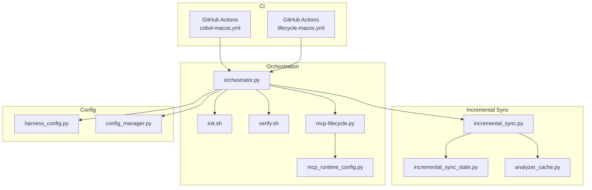
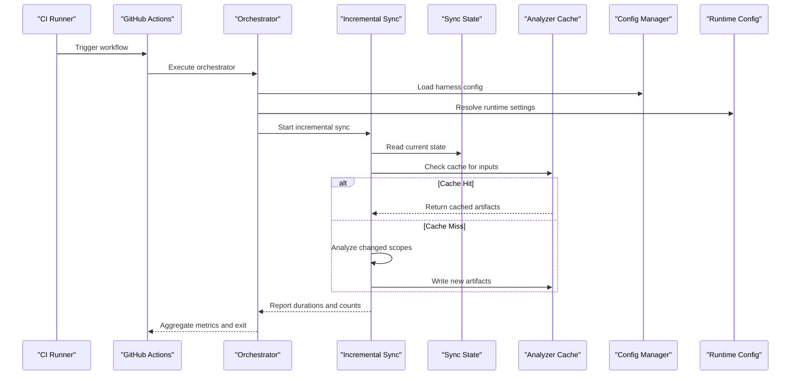
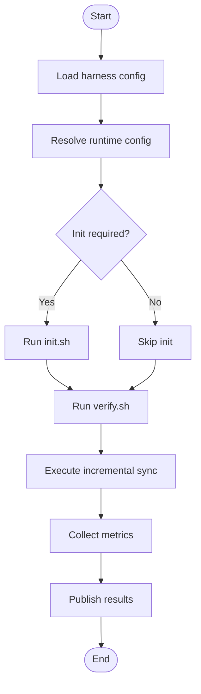
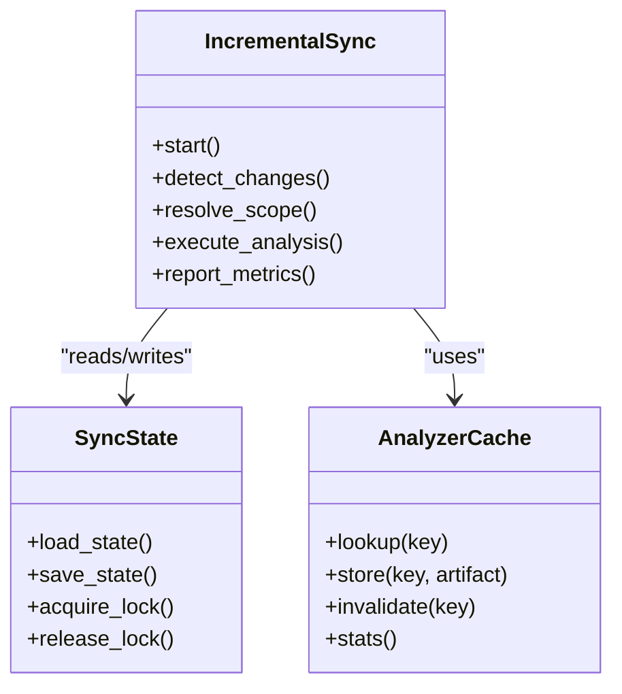
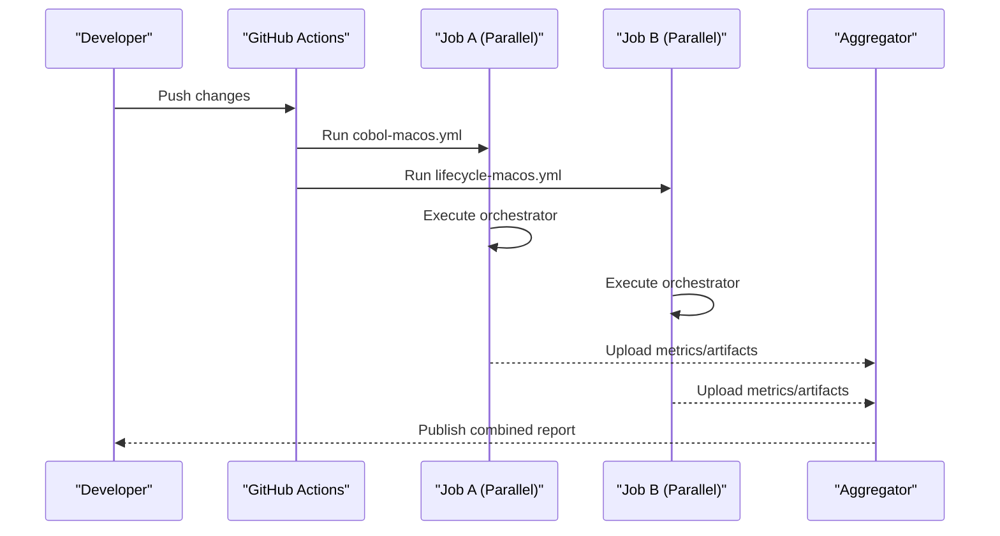
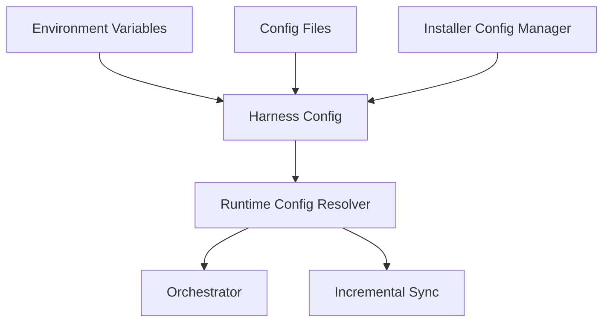
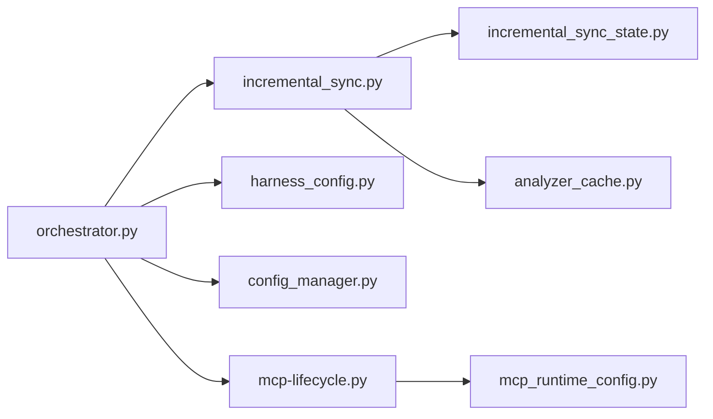

# Performance Monitoring & CI/CD Integration

<cite>
**Referenced Files in This Document**
- [ReadMe.md](file://ReadMe.md)
- [Makefile](file://Makefile)
- [.github/workflows/cobol-macos.yml](file://.github/workflows/cobol-macos.yml)
- [.github/workflows/lifecycle-macos.yml](file://.github/workflows/lifecycle-macos.yml)
- [harness/scripts/orchestrator.py](file://harness/scripts/orchestrator.py)
- [harness/scripts/init.sh](file://harness/scripts/init.sh)
- [harness/scripts/verify.sh](file://harness/scripts/verify.sh)
- [code-tiny/tools/common/analyzer_cache.py](file://code-tiny/tools/common/analyzer_cache.py)
- [code-tiny/tools/common/incremental_sync_state.py](file://code-tiny/tools/common/incremental_sync_state.py)
- [code-tiny/tools/sync/incremental_sync.py](file://code-tiny/tools/sync/incremental_sync.py)
- [code-tiny/tools/common/harness_config.py](file://code-tiny/tools/common/harness_config.py)
- [tests/test_cobol_performance.py](file://tests/test_cobol_performance.py)
- [tests/test_incremental_sync_lock.py](file://tests/test_incremental_sync_lock.py)
- [tests/test_mcp_http_resilience.py](file://tests/test_mcp_http_resilience.py)
- [installers/common/config_manager.py](file://installers/common/config_manager.py)
- [scripts/mcp-lifecycle.py](file://scripts/mcp-lifecycle.py)
- [scripts/mcp_runtime_config.py](file://scripts/mcp_runtime_config.py)
</cite>

## Table of Contents
1. [Introduction](#introduction)
2. [Project Structure](#project-structure)
3. [Core Components](#core-components)
4. [Architecture Overview](#architecture-overview)
5. [Detailed Component Analysis](#detailed-component-analysis)
6. [Dependency Analysis](#dependency-analysis)
7. [Performance Considerations](#performance-considerations)
8. [Troubleshooting Guide](#troubleshooting-guide)
9. [Conclusion](#conclusion)
10. [Appendices](#appendices)

## Introduction
This document provides comprehensive guidance for performance monitoring and CI/CD integration of incremental analysis within Cortex Harness. It focuses on:
- Collecting key metrics such as analysis duration, memory usage, disk I/O patterns, and cache hit rates
- Building dashboards and alerting to detect regressions or resource exhaustion
- Integrating with CI/CD pipelines for parallel execution, artifact caching, and result aggregation
- Configuring deployments across containerized, cloud, and on-premises environments
- Capacity planning, scaling, and load balancing strategies
- Troubleshooting bottlenecks, timeouts, and contention
- Best practices for high-frequency development and automated testing

## Project Structure
Cortex Harness organizes orchestration scripts, configuration utilities, incremental sync logic, and CI workflows in a modular way:
- Orchestration and lifecycle scripts under harness/scripts and scripts
- Incremental analysis state and synchronization under code-tiny/tools/sync and code-tiny/tools/common
- CI workflows under .github/workflows
- Configuration management under installers/common and code-tiny/tools/common
- Performance tests under tests

**Diagram sources**
- [.github/workflows/cobol-macos.yml](file://.github/workflows/cobol-macos.yml)
- [.github/workflows/lifecycle-macos.yml](file://.github/workflows/lifecycle-macos.yml)
- [harness/scripts/orchestrator.py](file://harness/scripts/orchestrator.py)
- [harness/scripts/init.sh](file://harness/scripts/init.sh)
- [harness/scripts/verify.sh](file://harness/scripts/verify.sh)
- [code-tiny/tools/sync/incremental_sync.py](file://code-tiny/tools/sync/incremental_sync.py)
- [code-tiny/tools/common/incremental_sync_state.py](file://code-tiny/tools/common/incremental_sync_state.py)
- [code-tiny/tools/common/analyzer_cache.py](file://code-tiny/tools/common/analyzer_cache.py)
- [code-tiny/tools/common/harness_config.py](file://code-tiny/tools/common/harness_config.py)
- [installers/common/config_manager.py](file://installers/common/config_manager.py)
- [scripts/mcp-lifecycle.py](file://scripts/mcp-lifecycle.py)
- [scripts/mcp_runtime_config.py](file://scripts/mcp_runtime_config.py)

**Section sources**
- [ReadMe.md](file://ReadMe.md)
- [Makefile](file://Makefile)

## Core Components
- Orchestrator: Central entry point that coordinates initialization, verification, and lifecycle tasks for analysis runs. It integrates with configuration managers and runtime config modules.
- Incremental Sync Engine: Manages change detection, scope determination, and synchronized updates to the graph store while minimizing redundant work.
- Analyzer Cache: Provides caching for analyzer outputs and intermediate artifacts to improve throughput and reduce I/O.
- Lifecycle Scripts: Provide reusable commands for setup, verification, and teardown in both local and CI contexts.
- CI Workflows: Define job steps for running analyses, collecting metrics, and publishing results.

Key responsibilities:
- Orchestration and task sequencing
- State persistence and locking for concurrent access
- Cache utilization and invalidation
- Configuration loading and environment-specific overrides
- Metrics collection hooks and reporting interfaces

**Section sources**
- [harness/scripts/orchestrator.py](file://harness/scripts/orchestrator.py)
- [code-tiny/tools/sync/incremental_sync.py](file://code-tiny/tools/sync/incremental_sync.py)
- [code-tiny/tools/common/incremental_sync_state.py](file://code-tiny/tools/common/incremental_sync_state.py)
- [code-tiny/tools/common/analyzer_cache.py](file://code-tiny/tools/common/analyzer_cache.py)
- [harness/scripts/init.sh](file://harness/scripts/init.sh)
- [harness/scripts/verify.sh](file://harness/scripts/verify.sh)
- [scripts/mcp-lifecycle.py](file://scripts/mcp-lifecycle.py)
- [scripts/mcp_runtime_config.py](file://scripts/mcp_runtime_config.py)
- [installers/common/config_manager.py](file://installers/common/config_manager.py)

## Architecture Overview
The system follows an orchestrated pipeline where CI triggers orchestrator jobs that execute incremental analysis with caching and state management. Metrics are collected at key stages and can be exported for dashboards and alerts.

**Diagram sources**
- [.github/workflows/lifecycle-macos.yml](file://.github/workflows/lifecycle-macos.yml)
- [harness/scripts/orchestrator.py](file://harness/scripts/orchestrator.py)
- [code-tiny/tools/sync/incremental_sync.py](file://code-tiny/tools/sync/incremental_sync.py)
- [code-tiny/tools/common/incremental_sync_state.py](file://code-tiny/tools/common/incremental_sync_state.py)
- [code-tiny/tools/common/analyzer_cache.py](file://code-tiny/tools/common/analyzer_cache.py)
- [installers/common/config_manager.py](file://installers/common/config_manager.py)
- [scripts/mcp_runtime_config.py](file://scripts/mcp_runtime_config.py)

## Detailed Component Analysis

### Orchestrator and Lifecycle Integration
The orchestrator coordinates initialization, verification, and analysis runs. It loads configuration from the harness config manager and runtime config, then delegates to the incremental sync engine. The lifecycle script exposes reusable commands for CI and local use.

**Diagram sources**
- [harness/scripts/orchestrator.py](file://harness/scripts/orchestrator.py)
- [harness/scripts/init.sh](file://harness/scripts/init.sh)
- [harness/scripts/verify.sh](file://harness/scripts/verify.sh)
- [code-tiny/tools/common/harness_config.py](file://code-tiny/tools/common/harness_config.py)
- [scripts/mcp-lifecycle.py](file://scripts/mcp-lifecycle.py)
- [scripts/mcp_runtime_config.py](file://scripts/mcp_runtime_config.py)

**Section sources**
- [harness/scripts/orchestrator.py](file://harness/scripts/orchestrator.py)
- [harness/scripts/init.sh](file://harness/scripts/init.sh)
- [harness/scripts/verify.sh](file://harness/scripts/verify.sh)
- [code-tiny/tools/common/harness_config.py](file://code-tiny/tools/common/harness_config.py)
- [scripts/mcp-lifecycle.py](file://scripts/mcp-lifecycle.py)
- [scripts/mcp_runtime_config.py](file://scripts/mcp_runtime_config.py)

### Incremental Sync Engine
The incremental sync engine determines affected scopes, reads current state, and performs targeted analysis. It interacts with the sync state module for persistence and locking, and leverages the analyzer cache to avoid redundant work.

**Diagram sources**
- [code-tiny/tools/sync/incremental_sync.py](file://code-tiny/tools/sync/incremental_sync.py)
- [code-tiny/tools/common/incremental_sync_state.py](file://code-tiny/tools/common/incremental_sync_state.py)
- [code-tiny/tools/common/analyzer_cache.py](file://code-tiny/tools/common/analyzer_cache.py)

**Section sources**
- [code-tiny/tools/sync/incremental_sync.py](file://code-tiny/tools/sync/incremental_sync.py)
- [code-tiny/tools/common/incremental_sync_state.py](file://code-tiny/tools/common/incremental_sync_state.py)
- [code-tiny/tools/common/analyzer_cache.py](file://code-tiny/tools/common/analyzer_cache.py)

### CI/CD Pipeline Integration
CI workflows trigger orchestrator tasks, run verification, and collect metrics. Parallelization is achieved by splitting jobs per language or feature area, while artifact caching reduces warm-up time. Results are aggregated into reports for downstream consumption.

**Diagram sources**
- [.github/workflows/cobol-macos.yml](file://.github/workflows/cobol-macos.yml)
- [.github/workflows/lifecycle-macos.yml](file://.github/workflows/lifecycle-macos.yml)
- [harness/scripts/orchestrator.py](file://harness/scripts/orchestrator.py)

**Section sources**
- [.github/workflows/cobol-macos.yml](file://.github/workflows/cobol-macos.yml)
- [.github/workflows/lifecycle-macos.yml](file://.github/workflows/lifecycle-macos.yml)

### Configuration Management
Configuration is loaded via the harness config manager and runtime config resolver. Installer config manager supports platform-specific overrides. This enables consistent behavior across containerized, cloud, and on-premises deployments.

**Diagram sources**
- [code-tiny/tools/common/harness_config.py](file://code-tiny/tools/common/harness_config.py)
- [scripts/mcp_runtime_config.py](file://scripts/mcp_runtime_config.py)
- [installers/common/config_manager.py](file://installers/common/config_manager.py)

**Section sources**
- [code-tiny/tools/common/harness_config.py](file://code-tiny/tools/common/harness_config.py)
- [scripts/mcp_runtime_config.py](file://scripts/mcp_runtime_config.py)
- [installers/common/config_manager.py](file://installers/common/config_manager.py)

## Dependency Analysis
The following diagram shows core dependencies between orchestration, sync, caching, and configuration components.

**Diagram sources**
- [harness/scripts/orchestrator.py](file://harness/scripts/orchestrator.py)
- [code-tiny/tools/sync/incremental_sync.py](file://code-tiny/tools/sync/incremental_sync.py)
- [code-tiny/tools/common/incremental_sync_state.py](file://code-tiny/tools/common/incremental_sync_state.py)
- [code-tiny/tools/common/analyzer_cache.py](file://code-tiny/tools/common/analyzer_cache.py)
- [code-tiny/tools/common/harness_config.py](file://code-tiny/tools/common/harness_config.py)
- [installers/common/config_manager.py](file://installers/common/config_manager.py)
- [scripts/mcp-lifecycle.py](file://scripts/mcp-lifecycle.py)
- [scripts/mcp_runtime_config.py](file://scripts/mcp_runtime_config.py)

**Section sources**
- [harness/scripts/orchestrator.py](file://harness/scripts/orchestrator.py)
- [code-tiny/tools/sync/incremental_sync.py](file://code-tiny/tools/sync/incremental_sync.py)
- [code-tiny/tools/common/incremental_sync_state.py](file://code-tiny/tools/common/incremental_sync_state.py)
- [code-tiny/tools/common/analyzer_cache.py](file://code-tiny/tools/common/analyzer_cache.py)
- [code-tiny/tools/common/harness_config.py](file://code-tiny/tools/common/harness_config.py)
- [installers/common/config_manager.py](file://installers/common/config_manager.py)
- [scripts/mcp-lifecycle.py](file://scripts/mcp-lifecycle.py)
- [scripts/mcp_runtime_config.py](file://scripts/mcp_runtime_config.py)

## Performance Considerations
- Analysis Duration
  - Track per-phase durations in the orchestrator and sync engine to identify hotspots.
  - Use cache hits to minimize re-analysis; monitor cache miss rates to tune invalidation policies.
- Memory Usage
  - Monitor process memory growth during large scans; consider chunked processing and garbage collection tuning.
  - Validate memory limits in CI runners and container runtimes.
- Disk I/O Patterns
  - Observe read/write amplification around cache and state directories.
  - Prefer fast storage for cache and state; ensure adequate IOPS for concurrent jobs.
- Cache Hit Rates
  - Measure cache lookup vs store operations; aim for high hit rates on stable codebases.
  - Implement selective invalidation based on dependency graphs to maximize reuse.
- Concurrency and Locking
  - Ensure robust locking to prevent contention and corruption when multiple jobs update state concurrently.
- Network Resilience
  - For remote graph stores or caches, implement retries and backoff to handle transient failures.

[No sources needed since this section provides general guidance]

## Troubleshooting Guide
Common issues and remediation steps:
- Performance Bottlenecks
  - Profile orchestrator phases and sync operations to locate slow steps.
  - Increase cache size or adjust invalidation thresholds if misses dominate.
  - Scale out CI runners or split jobs to reduce queue times.
- Timeout Issues
  - Tune timeout values in orchestrator and network calls; add retry/backoff for resilience.
  - Break large jobs into smaller units to avoid long-running tasks.
- Resource Contention
  - Inspect lock acquisition logs; ensure exclusive access to shared state and cache directories.
  - Limit concurrency levels based on available CPU and I/O capacity.
- HTTP Resilience
  - Validate retry policies and error handling for MCP and graph store interactions.
  - Add circuit breakers to fail fast when downstream services degrade.

**Section sources**
- [tests/test_cobol_performance.py](file://tests/test_cobol_performance.py)
- [tests/test_incremental_sync_lock.py](file://tests/test_incremental_sync_lock.py)
- [tests/test_mcp_http_resilience.py](file://tests/test_mcp_http_resilience.py)

## Conclusion
By instrumenting the orchestrator and incremental sync engine, leveraging the analyzer cache, and integrating robust CI workflows, Cortex Harness can deliver fast, reliable incremental analysis at scale. Proper configuration, capacity planning, and observability enable early detection of regressions and efficient resource utilization across diverse deployment scenarios.

[No sources needed since this section summarizes without analyzing specific files]

## Appendices

### Metrics Collection Plan
- Duration Metrics
  - Per-phase timing in orchestrator and sync engine
  - Total analysis duration and breakdown by component
- Memory Metrics
  - Process RSS and peak memory usage
  - GC statistics if applicable
- Disk I/O Metrics
  - Bytes read/written to cache and state directories
  - Latency distributions for I/O operations
- Cache Metrics
  - Hit/miss ratios and invalidation events
  - Cache size and eviction policy effectiveness

[No sources needed since this section provides general guidance]

### CI/CD Integration Patterns
- Parallel Execution
  - Split jobs by language or subsystem; aggregate results post-run
- Artifact Caching
  - Persist analyzer outputs and state between runs; invalidate selectively
- Result Aggregation
  - Combine per-job metrics into unified reports; publish to dashboards

**Section sources**
- [.github/workflows/cobol-macos.yml](file://.github/workflows/cobol-macos.yml)
- [.github/workflows/lifecycle-macos.yml](file://.github/workflows/lifecycle-macos.yml)

### Deployment Configuration Examples
- Containerized Environments
  - Mount persistent volumes for cache and state
  - Set resource limits and requests for CPU/memory
  - Configure environment variables for runtime settings
- Cloud Platforms
  - Use managed runners with scalable pools
  - Enable cloud-native caching layers where available
  - Integrate with centralized logging and metrics collectors
- On-Premises Installations
  - Provision dedicated storage for cache/state
  - Configure internal registries and proxies
  - Apply security policies for file and network access

**Section sources**
- [installers/common/config_manager.py](file://installers/common/config_manager.py)
- [code-tiny/tools/common/harness_config.py](file://code-tiny/tools/common/harness_config.py)
- [scripts/mcp_runtime_config.py](file://scripts/mcp_runtime_config.py)

### Capacity Planning and Scaling
- Estimate baseline throughput per runner and multiply by expected concurrency
- Size storage for cache growth and retention policies
- Plan for peak loads during major releases or nightly builds
- Implement horizontal scaling by adding runners and sharding workloads

[No sources needed since this section provides general guidance]

### Load Balancing Strategies
- Distribute jobs across runners using CI workload queues
- Shard repositories or features to balance load
- Use sticky sessions for cache locality when appropriate
- Monitor utilization and auto-scale runner pools

[No sources needed since this section provides general guidance]

### Best Practices for High-Frequency Development and Automated Testing
- Keep change sets small and focused to maximize incremental benefits
- Pre-warm caches with common dependencies
- Fail fast on critical errors; continue non-critical tasks
- Regularly review and prune stale cache entries
- Automate metric baselines and regression checks

[No sources needed since this section provides general guidance]