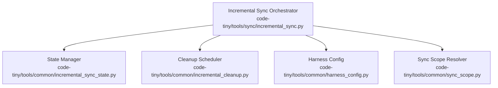
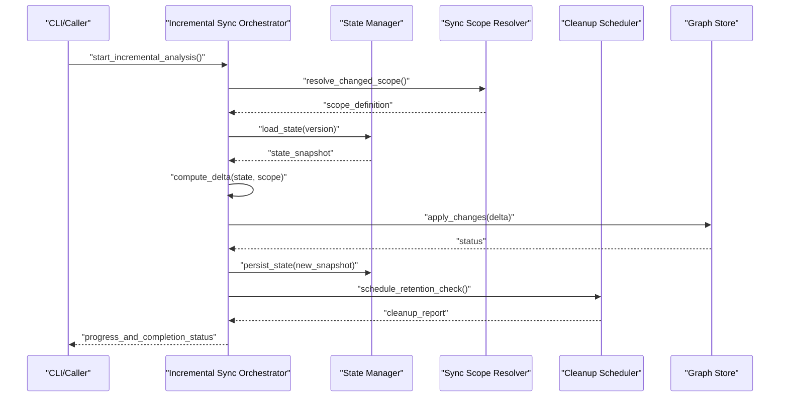
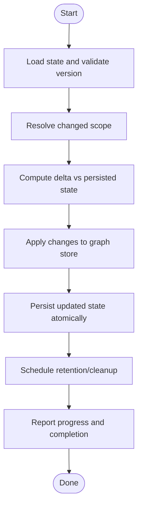
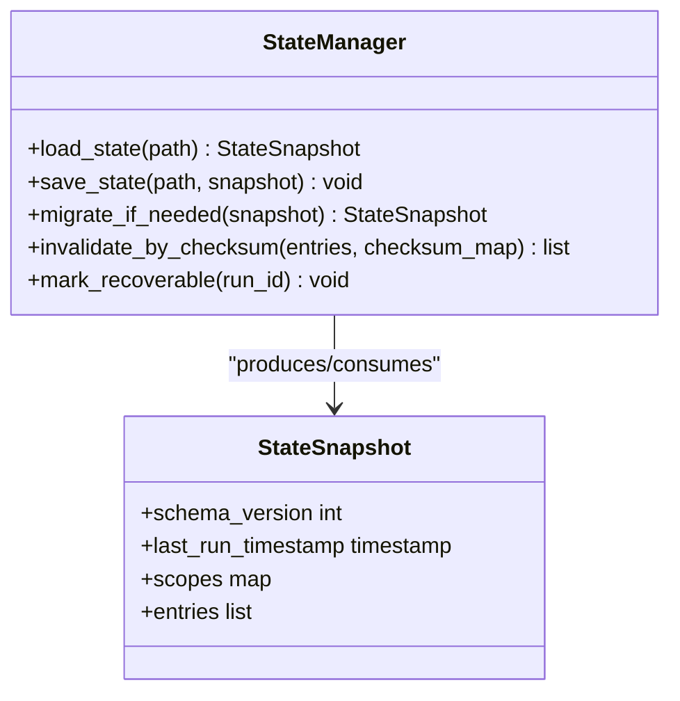
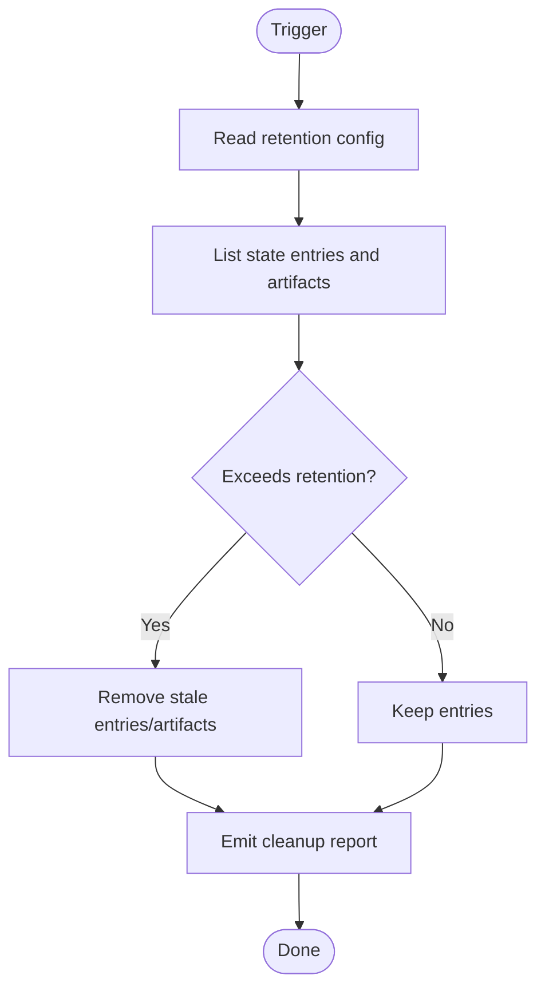
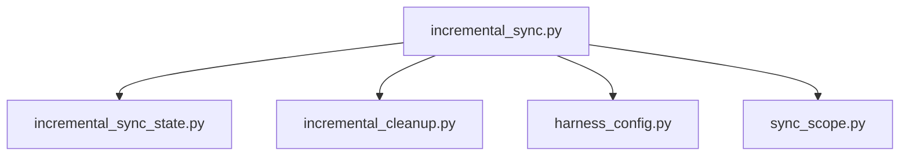

# State Management & Progress Tracking

<cite>
**Referenced Files in This Document**
- [incremental_sync_state.py](file://code-tiny/tools/common/incremental_sync_state.py)
- [incremental_cleanup.py](file://code-tiny/tools/common/incremental_cleanup.py)
- [harness_config.py](file://code-tiny/tools/common/harness_config.py)
- [sync_scope.py](file://code-tiny/tools/common/sync_scope.py)
- [incremental_sync.py](file://code-tiny/tools/sync/incremental_sync.py)
- [test_incremental_sync_state_migration.py](file://tests/test_incremental_sync_state_migration.py)
- [test_incremental_sync_lock.py](file://tests/test_incremental_sync_lock.py)
- [test_incremental_sync_bootstrap.py](file://tests/test_incremental_sync_bootstrap.py)
- [test_incremental_sync_cobol.py](file://tests/test_incremental_sync_cobol.py)
- [test_incremental_sync_framework_overlays.py](file://tests/test_incremental_sync_framework_overlays.py)
- [test_incremental_sync_graph_setup.py](file://tests/test_incremental_sync_graph_setup.py)
- [test_incremental_sync_non_git.py](file://tests/test_incremental_sync_non_git.py)
- [test_incremental_sync_submodules.py](file://tests/test_incremental_sync_submodules.py)
- [test_incremental_sync_worktree.py](file://tests/test_incremental_sync_worktree.py)
</cite>

## Table of Contents
1. [Introduction](#introduction)
2. [Project Structure](#project-structure)
3. [Core Components](#core-components)
4. [Architecture Overview](#architecture-overview)
5. [Detailed Component Analysis](#detailed-component-analysis)
6. [Dependency Analysis](#dependency-analysis)
7. [Performance Considerations](#performance-considerations)
8. [Troubleshooting Guide](#troubleshooting-guide)
9. [Conclusion](#conclusion)
10. [Appendices](#appendices)

## Introduction
This document explains how Cortex Harness manages incremental analysis state and progress across sessions, including persistence, recovery from interruptions, cache invalidation strategies, state file formats and versioning/migration, configuration for storage locations and retention/cleanup, monitoring and debugging guidance, and best practices for distributed environments. It focuses on the shared common components that implement incremental synchronization and cleanup, as well as the orchestrator that coordinates graph setup and framework overlays.

## Project Structure
The incremental state management and progress tracking are implemented primarily under:
- code-tiny/tools/common: shared utilities for state, cleanup, configuration, and scope resolution
- code-tiny/tools/sync: orchestration of incremental sync operations
- tests: comprehensive coverage of migration, locking, bootstrap, non-git repos, submodules, worktrees, and framework overlays

**Diagram sources**
- [incremental_sync.py](file://code-tiny/tools/sync/incremental_sync.py)
- [incremental_sync_state.py](file://code-tiny/tools/common/incremental_sync_state.py)
- [incremental_cleanup.py](file://code-tiny/tools/common/incremental_cleanup.py)
- [harness_config.py](file://code-tiny/tools/common/harness_config.py)
- [sync_scope.py](file://code-tiny/tools/common/sync_scope.py)

**Section sources**
- [incremental_sync.py](file://code-tiny/tools/sync/incremental_sync.py)
- [incremental_sync_state.py](file://code-tiny/tools/common/incremental_sync_state.py)
- [incremental_cleanup.py](file://code-tiny/tools/common/incremental_cleanup.py)
- [harness_config.py](file://code-tiny/tools/common/harness_config.py)
- [sync_scope.py](file://code-tiny/tools/common/sync_scope.py)

## Core Components
- Incremental Sync Orchestrator: Coordinates change detection, scope resolution, and execution of incremental tasks while reading/writing state and invoking cleanup policies.
- State Manager: Persists analysis progress, tracks per-file and per-scope metadata, handles schema versioning and migrations, and provides atomic updates to ensure consistency.
- Cleanup Scheduler: Applies retention policies and removes stale artifacts based on configured schedules and thresholds.
- Harness Config: Provides centralized configuration for state storage paths, retention windows, cleanup intervals, and feature toggles.
- Sync Scope Resolver: Determines which parts of the repository or project should be reanalyzed (e.g., changed files, affected modules).

Key responsibilities:
- Persistence: durable state files with versioned schemas
- Recovery: resume interrupted analyses by detecting partial states
- Invalidation: targeted removal of outdated results when inputs change
- Observability: progress reporting and completion status
- Concurrency: safe access patterns for multi-process usage

**Section sources**
- [incremental_sync.py](file://code-tiny/tools/sync/incremental_sync.py)
- [incremental_sync_state.py](file://code-tiny/tools/common/incremental_sync_state.py)
- [incremental_cleanup.py](file://code-tiny/tools/common/incremental_cleanup.py)
- [harness_config.py](file://code-tiny/tools/common/harness_config.py)
- [sync_scope.py](file://code-tiny/tools/common/sync_scope.py)

## Architecture Overview
The system follows a layered architecture where the orchestrator composes state, cleanup, config, and scope services to perform reliable incremental analysis.

**Diagram sources**
- [incremental_sync.py](file://code-tiny/tools/sync/incremental_sync.py)
- [incremental_sync_state.py](file://code-tiny/tools/common/incremental_sync_state.py)
- [incremental_cleanup.py](file://code-tiny/tools/common/incremental_cleanup.py)
- [sync_scope.py](file://code-tiny/tools/common/sync_scope.py)

## Detailed Component Analysis

### Incremental Sync Orchestrator
Responsibilities:
- Entry point for incremental runs
- Delegates scope resolution and state loading
- Applies changes to the graph store
- Persists updated state and triggers cleanup
- Emits progress and completion events

Operational flow:
- Load current state and validate schema version
- Resolve affected scope using change detection
- Compute delta between current state and new scope
- Execute graph mutations
- Persist state atomically
- Schedule cleanup according to retention policy
- Report progress and final status

**Diagram sources**
- [incremental_sync.py](file://code-tiny/tools/sync/incremental_sync.py)

**Section sources**
- [incremental_sync.py](file://code-tiny/tools/sync/incremental_sync.py)

### State Manager
Responsibilities:
- Define state file format and schema versioning
- Provide load/save with migration support
- Track per-file and per-scope metadata
- Ensure atomic writes and consistent snapshots
- Support recovery from interrupted runs

State file format and versioning:
- Top-level fields include schema_version, last_run_timestamp, scopes, and entries
- Each entry contains identifiers, timestamps, checksums, and status flags
- Schema version is enforced at load time; incompatible versions trigger migration
- Migration procedures transform older structures to the current schema safely

Recovery from interruptions:
- Partial writes are avoided via atomic commits
- On restart, the manager detects incomplete runs and marks them recoverable
- The orchestrator can resume from the last consistent snapshot

Cache invalidation strategies:
- Invalidates entries whose input checksums differ from stored values
- Removes dependent artifacts transitively when upstream inputs change
- Preserves valid cached results outside the invalidated scope

**Diagram sources**
- [incremental_sync_state.py](file://code-tiny/tools/common/incremental_sync_state.py)

**Section sources**
- [incremental_sync_state.py](file://code-tiny/tools/common/incremental_sync_state.py)
- [test_incremental_sync_state_migration.py](file://tests/test_incremental_sync_state_migration.py)

### Cleanup Scheduler
Responsibilities:
- Enforce retention policies (time-based and count-based)
- Remove stale state entries and artifacts
- Run on schedule or triggered by the orchestrator after successful runs

Retention policies:
- Maximum age for state entries
- Maximum number of retained runs per scope
- Optional pruning of orphaned artifacts not referenced by current state

Scheduling:
- Can be invoked immediately after persistence
- Supports periodic background jobs controlled by harness configuration

**Diagram sources**
- [incremental_cleanup.py](file://code-tiny/tools/common/incremental_cleanup.py)

**Section sources**
- [incremental_cleanup.py](file://code-tiny/tools/common/incremental_cleanup.py)

### Harness Config
Responsibilities:
- Centralize configuration for state storage location, retention windows, cleanup intervals, and feature toggles
- Provide defaults and environment overrides
- Validate required settings before starting incremental runs

Configuration options:
- State storage path and directory structure
- Retention window (max age, max runs)
- Cleanup schedule interval
- Locking strategy for distributed environments
- Logging and observability levels

**Section sources**
- [harness_config.py](file://code-tiny/tools/common/harness_config.py)

### Sync Scope Resolver
Responsibilities:
- Determine the subset of files/modules impacted by changes
- Integrate with version control (git) or fallback mechanisms for non-git repositories
- Produce a deterministic scope definition consumed by the orchestrator

Change detection:
- Uses commit diffs, file timestamps, or custom detectors
- Normalizes paths and resolves relative to workspace root

**Section sources**
- [sync_scope.py](file://code-tiny/tools/common/sync_scope.py)
- [test_incremental_sync_non_git.py](file://tests/test_incremental_sync_non_git.py)

## Dependency Analysis
The orchestrator depends on state, cleanup, config, and scope components. Tests validate behavior across multiple scenarios including migration, locking, bootstrap, non-git repos, submodules, and worktrees.

**Diagram sources**
- [incremental_sync.py](file://code-tiny/tools/sync/incremental_sync.py)
- [incremental_sync_state.py](file://code-tiny/tools/common/incremental_sync_state.py)
- [incremental_cleanup.py](file://code-tiny/tools/common/incremental_cleanup.py)
- [harness_config.py](file://code-tiny/tools/common/harness_config.py)
- [sync_scope.py](file://code-tiny/tools/common/sync_scope.py)

**Section sources**
- [incremental_sync.py](file://code-tiny/tools/sync/incremental_sync.py)
- [incremental_sync_state.py](file://code-tiny/tools/common/incremental_sync_state.py)
- [incremental_cleanup.py](file://code-tiny/tools/common/incremental_cleanup.py)
- [harness_config.py](file://code-tiny/tools/common/harness_config.py)
- [sync_scope.py](file://code-tiny/tools/common/sync_scope.py)

## Performance Considerations
- Prefer scoped invalidation over full rebuilds to minimize recomputation
- Use checksum-based change detection to avoid unnecessary work
- Batch state updates and persist once per run to reduce I/O overhead
- Tune retention policies to balance disk usage and performance
- Avoid excessive cleanup frequency; schedule during off-peak hours
- For large repositories, leverage parallel processing within safe concurrency limits

[No sources needed since this section provides general guidance]

## Troubleshooting Guide
Common issues and resolutions:
- State corruption:
  - Symptoms: failed loads, inconsistent snapshots, missing entries
  - Actions: verify schema version, restore from last known good snapshot, run migration if available
  - References: [test_incremental_sync_state_migration.py](file://tests/test_incremental_sync_state_migration.py)

- Lock conflicts in distributed environments:
  - Symptoms: concurrent runs blocking each other, timeouts
  - Actions: configure robust locking strategy, ensure exclusive access to state directory, backoff retries
  - References: [test_incremental_sync_lock.py](file://tests/test_incremental_sync_lock.py)

- Bootstrap failures:
  - Symptoms: initial run cannot create baseline state
  - Actions: validate harness config, ensure writable state directory, check graph store connectivity
  - References: [test_incremental_sync_bootstrap.py](file://tests/test_incremental_sync_bootstrap.py)

- Non-git repositories:
  - Symptoms: change detection returns empty scope
  - Actions: enable non-git mode, provide alternative detectors, verify path normalization
  - References: [test_incremental_sync_non_git.py](file://tests/test_incremental_sync_non_git.py)

- Submodules and worktrees:
  - Symptoms: missed changes due to nested repos or worktrees
  - Actions: traverse submodules, resolve worktree roots, normalize paths consistently
  - References: [test_incremental_sync_submodules.py](file://tests/test_incremental_sync_submodules.py), [test_incremental_sync_worktree.py](file://tests/test_incremental_sync_worktree.py)

- Framework overlays and graph setup:
  - Symptoms: overlay rules not applied, graph inconsistencies
  - Actions: validate overlay configuration, ensure graph setup completes before incremental runs
  - References: [test_incremental_sync_framework_overlays.py](file://tests/test_incremental_sync_framework_overlays.py), [test_incremental_sync_graph_setup.py](file://tests/test_incremental_sync_graph_setup.py)

- Language-specific incremental behavior:
  - Symptoms: language analyzer does not respect incremental state
  - Actions: confirm analyzer integrates with scope resolver and state invalidation
  - References: [test_incremental_sync_cobol.py](file://tests/test_incremental_sync_cobol.py)

Best practices for distributed environments:
- Use a shared, network-backed state directory with strong consistency guarantees
- Enable file locking or database-backed locks to prevent concurrent writes
- Partition state by workspace/project to reduce contention
- Monitor lock acquisition times and adjust timeouts/backoffs
- Keep state files small by pruning aggressively and avoiding redundant metadata

Monitoring and debugging:
- Log state load/save operations, migration steps, and invalidation decisions
- Emit progress events at key phases: scope resolution, delta computation, apply changes, persistence, cleanup
- Expose completion status with summary metrics (files analyzed, skipped, invalidated)
- Inspect state snapshots to diagnose drift between expected and actual state

**Section sources**
- [test_incremental_sync_state_migration.py](file://tests/test_incremental_sync_state_migration.py)
- [test_incremental_sync_lock.py](file://tests/test_incremental_sync_lock.py)
- [test_incremental_sync_bootstrap.py](file://tests/test_incremental_sync_bootstrap.py)
- [test_incremental_sync_non_git.py](file://tests/test_incremental_sync_non_git.py)
- [test_incremental_sync_submodules.py](file://tests/test_incremental_sync_submodules.py)
- [test_incremental_sync_worktree.py](file://tests/test_incremental_sync_worktree.py)
- [test_incremental_sync_framework_overlays.py](file://tests/test_incremental_sync_framework_overlays.py)
- [test_incremental_sync_graph_setup.py](file://tests/test_incremental_sync_graph_setup.py)
- [test_incremental_sync_cobol.py](file://tests/test_incremental_sync_cobol.py)

## Conclusion
Cortex Harness implements a robust incremental analysis state management system centered around a versioned state file, targeted cache invalidation, and coordinated cleanup. The orchestrator ties together scope resolution, state persistence, and graph updates to deliver resilient, resumable analyses. With proper configuration and monitoring, the system scales to distributed environments and maintains high performance through scoped recomputation and efficient retention policies.

[No sources needed since this section summarizes without analyzing specific files]

## Appendices

### Configuration Options Summary
- State storage location: absolute path to state directory
- Retention window: maximum age and maximum retained runs
- Cleanup schedule: interval or trigger mechanism
- Locking strategy: file-based or external lock provider
- Logging level: verbosity for diagnostics

**Section sources**
- [harness_config.py](file://code-tiny/tools/common/harness_config.py)

### Monitoring and Reporting Examples
- Progress events: emit at start, scope resolved, delta computed, changes applied, state persisted, cleanup completed
- Completion status: include counts of processed items, invalidated entries, and errors encountered
- Debugging aids: dump state snapshot, log invalidation reasons, record lock acquisition details

**Section sources**
- [incremental_sync.py](file://code-tiny/tools/sync/incremental_sync.py)
- [incremental_cleanup.py](file://code-tiny/tools/common/incremental_cleanup.py)