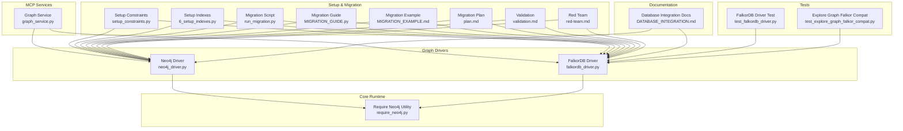
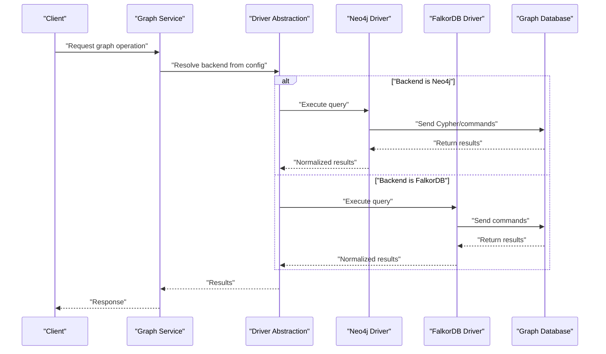
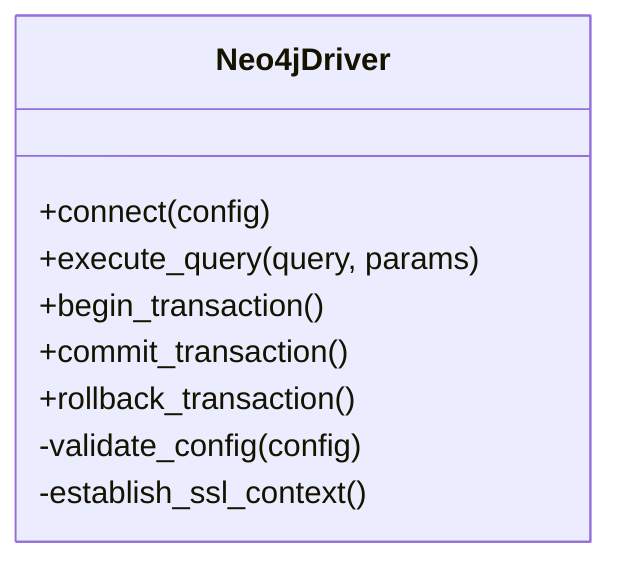
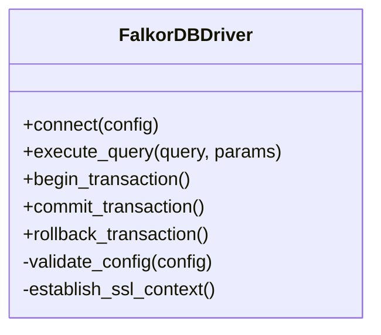
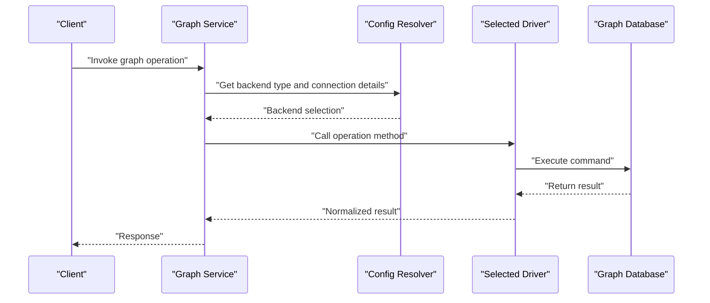
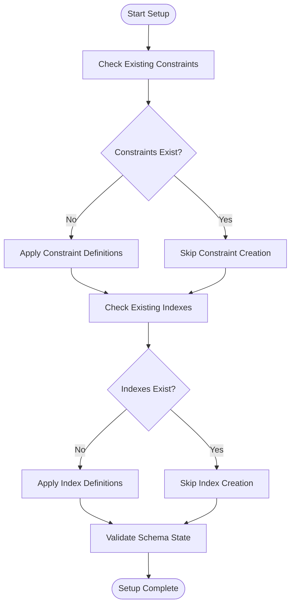
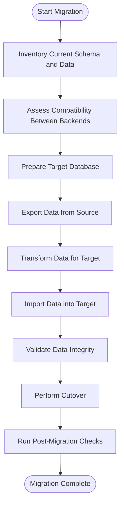
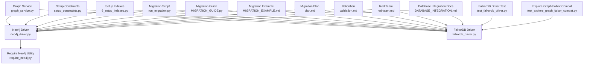

# Database Configuration

<cite>
**Referenced Files in This Document**
- [neo4j_driver.py](file://code-tiny/tools/graph/driver/neo4j_driver.py)
- [falkordb_driver.py](file://code-tiny/tools/graph/driver/falkordb_driver.py)
- [require_neo4j.py](file://code-tiny/tools/graph/core/require_neo4j.py)
- [graph_service.py](file://code-tiny/mcp/services/graph_service.py)
- [setup_constraints.py](file://code-tiny/scripts/setup_constraints.py)
- [6_setup_indexes.py](file://doc-tiny/6_setup_indexes.py)
- [run_migration.py](file://code-tiny/run_migration.py)
- [MIGRATION_GUIDE.py](file://code-tiny/tools/graph/docs/MIGRATION_GUIDE.py)
- [MIGRATION_EXAMPLE.md](file://code-tiny/tools/graph/docs/MIGRATION_EXAMPLE.md)
- [plan.md](file://plans/neo4j-to-falkordb-migration/plan.md)
- [validation.md](file://plans/neo4j-to-falkordb-migration/validation.md)
- [red-team.md](file://plans/neo4j-to-falkordb-migration/red-team.md)
- [DATABASE_INTEGRATION.md](file://docs/DATABASE_INTEGRATION.md)
- [test_falkordb_driver.py](file://tests/test_falkordb_driver.py)
- [test_explore_graph_falkor_compat.py](file://tests/test_explore_graph_falkor_compat.py)
</cite>

## Table of Contents
1. [Introduction](#introduction)
2. [Project Structure](#project-structure)
3. [Core Components](#core-components)
4. [Architecture Overview](#architecture-overview)
5. [Detailed Component Analysis](#detailed-component-analysis)
6. [Dependency Analysis](#dependency-analysis)
7. [Performance Considerations](#performance-considerations)
8. [Troubleshooting Guide](#troubleshooting-guide)
9. [Conclusion](#conclusion)
10. [Appendices](#appendices)

## Introduction
This document provides comprehensive database configuration guidance for Cortex Harness when using Neo4j and FalkorDB graph databases. It covers connection string formats, authentication methods, SSL/TLS configuration, performance tuning parameters, schema initialization, index creation, backup/recovery procedures, cluster configuration for distributed deployments, load balancing, high availability setups, migration procedures between versions and database types, and troubleshooting guides for common issues such as connection problems, performance bottlenecks, and data consistency concerns.

## Project Structure
Cortex Harness integrates with graph databases through a driver abstraction layer and MCP services that expose graph operations. The relevant components include:
- Driver implementations for Neo4j and FalkorDB
- Core runtime utilities for provider requirements
- MCP service integration for graph queries
- Scripts for constraints and indexes setup
- Migration documentation and scripts
- Tests validating compatibility and behavior

**Diagram sources**
- [neo4j_driver.py](file://code-tiny/tools/graph/driver/neo4j_driver.py)
- [falkordb_driver.py](file://code-tiny/tools/graph/driver/falkordb_driver.py)
- [require_neo4j.py](file://code-tiny/tools/graph/core/require_neo4j.py)
- [graph_service.py](file://code-tiny/mcp/services/graph_service.py)
- [setup_constraints.py](file://code-tiny/scripts/setup_constraints.py)
- [6_setup_indexes.py](file://doc-tiny/6_setup_indexes.py)
- [run_migration.py](file://code-tiny/run_migration.py)
- [MIGRATION_GUIDE.py](file://code-tiny/tools/graph/docs/MIGRATION_GUIDE.py)
- [MIGRATION_EXAMPLE.md](file://code-tiny/tools/graph/docs/MIGRATION_EXAMPLE.md)
- [plan.md](file://plans/neo4j-to-falkordb-migration/plan.md)
- [validation.md](file://plans/neo4j-to-falkordb-migration/validation.md)
- [red-team.md](file://plans/neo4j-to-falkordb-migration/red-team.md)
- [DATABASE_INTEGRATION.md](file://docs/DATABASE_INTEGRATION.md)
- [test_falkordb_driver.py](file://tests/test_falkordb_driver.py)
- [test_explore_graph_falkor_compat.py](file://tests/test_explore_graph_falkor_compat.py)

**Section sources**
- [neo4j_driver.py](file://code-tiny/tools/graph/driver/neo4j_driver.py)
- [falkordb_driver.py](file://code-tiny/tools/graph/driver/falkordb_driver.py)
- [require_neo4j.py](file://code-tiny/tools/graph/core/require_neo4j.py)
- [graph_service.py](file://code-tiny/mcp/services/graph_service.py)
- [setup_constraints.py](file://code-tiny/scripts/setup_constraints.py)
- [6_setup_indexes.py](file://doc-tiny/6_setup_indexes.py)
- [run_migration.py](file://code-tiny/run_migration.py)
- [MIGRATION_GUIDE.py](file://code-tiny/tools/graph/docs/MIGRATION_GUIDE.py)
- [MIGRATION_EXAMPLE.md](file://code-tiny/tools/graph/docs/MIGRATION_EXAMPLE.md)
- [plan.md](file://plans/neo4j-to-falkordb-migration/plan.md)
- [validation.md](file://plans/neo4j-to-falkordb-migration/validation.md)
- [red-team.md](file://plans/neo4j-to-falkordb-migration/red-team.md)
- [DATABASE_INTEGRATION.md](file://docs/DATABASE_INTEGRATION.md)
- [test_falkordb_driver.py](file://tests/test_falkordb_driver.py)
- [test_explore_graph_falkor_compat.py](file://tests/test_explore_graph_falkor_compat.py)

## Core Components
- Neo4j Driver: Implements connectivity, query execution, and transaction handling for Neo4j.
- FalkorDB Driver: Implements connectivity, query execution, and transaction handling for FalkorDB.
- Require Neo4j Utility: Provides checks and bootstrapping logic for Neo4j dependencies.
- Graph Service (MCP): Exposes graph operations via MCP protocol, delegating to the appropriate driver based on configuration.
- Setup Scripts: Initialize constraints and indexes for both drivers.
- Migration Tools: Provide scripts and guides for migrating between Neo4j and FalkorDB.

Key responsibilities:
- Connection management and pooling
- Authentication and TLS configuration
- Query execution and result parsing
- Schema initialization and maintenance
- Transaction boundaries and error handling

**Section sources**
- [neo4j_driver.py](file://code-tiny/tools/graph/driver/neo4j_driver.py)
- [falkordb_driver.py](file://code-tiny/tools/graph/driver/falkordb_driver.py)
- [require_neo4j.py](file://code-tiny/tools/graph/core/require_neo4j.py)
- [graph_service.py](file://code-tiny/mcp/services/graph_service.py)
- [setup_constraints.py](file://code-tiny/scripts/setup_constraints.py)
- [6_setup_indexes.py](file://doc-tiny/6_setup_indexes.py)
- [run_migration.py](file://code-tiny/run_migration.py)
- [MIGRATION_GUIDE.py](file://code-tiny/tools/graph/docs/MIGRATION_GUIDE.py)
- [MIGRATION_EXAMPLE.md](file://code-tiny/tools/graph/docs/MIGRATION_EXAMPLE.md)

## Architecture Overview
The system uses a driver abstraction to support multiple graph backends. MCP services call into the selected driver, which handles low-level communication with the database.

**Diagram sources**
- [graph_service.py](file://code-tiny/mcp/services/graph_service.py)
- [neo4j_driver.py](file://code-tiny/tools/graph/driver/neo4j_driver.py)
- [falkordb_driver.py](file://code-tiny/tools/graph/driver/falkordb_driver.py)

## Detailed Component Analysis

### Neo4j Driver
Responsibilities:
- Connect to Neo4j using configured connection strings
- Authenticate with username/password or token-based methods
- Configure SSL/TLS options
- Execute queries and transactions
- Handle errors and retries

Configuration aspects:
- Connection string format includes host, port, scheme, and optional path
- Authentication parameters can be provided via environment variables or configuration files
- SSL/TLS settings allow enabling verification and specifying CA certificates

**Diagram sources**
- [neo4j_driver.py](file://code-tiny/tools/graph/driver/neo4j_driver.py)

**Section sources**
- [neo4j_driver.py](file://code-tiny/tools/graph/driver/neo4j_driver.py)
- [require_neo4j.py](file://code-tiny/tools/graph/core/require_neo4j.py)

### FalkorDB Driver
Responsibilities:
- Connect to FalkorDB using configured connection strings
- Authenticate with credentials or API keys
- Configure SSL/TLS options
- Execute queries and transactions
- Handle errors and retries

Configuration aspects:
- Connection string format includes host, port, scheme, and optional path
- Authentication parameters can be provided via environment variables or configuration files
- SSL/TLS settings allow enabling verification and specifying CA certificates

**Diagram sources**
- [falkordb_driver.py](file://code-tiny/tools/graph/driver/falkordb_driver.py)

**Section sources**
- [falkordb_driver.py](file://code-tiny/tools/graph/driver/falkordb_driver.py)

### MCP Graph Service Integration
Responsibilities:
- Route requests to the appropriate driver based on configuration
- Normalize responses across different backends
- Manage session state and context

**Diagram sources**
- [graph_service.py](file://code-tiny/mcp/services/graph_service.py)

**Section sources**
- [graph_service.py](file://code-tiny/mcp/services/graph_service.py)

### Schema Initialization and Index Creation
Responsibilities:
- Create constraints to enforce uniqueness and referential integrity
- Build indexes to optimize query performance
- Ensure idempotent setup for repeated runs

**Diagram sources**
- [setup_constraints.py](file://code-tiny/scripts/setup_constraints.py)
- [6_setup_indexes.py](file://doc-tiny/6_setup_indexes.py)

**Section sources**
- [setup_constraints.py](file://code-tiny/scripts/setup_constraints.py)
- [6_setup_indexes.py](file://doc-tiny/6_setup_indexes.py)

### Migration Procedures
Responsibilities:
- Provide step-by-step guides for migrating between Neo4j and FalkorDB
- Include example migrations and validation strategies
- Address compatibility differences and data transformation needs

**Diagram sources**
- [MIGRATION_GUIDE.py](file://code-tiny/tools/graph/docs/MIGRATION_GUIDE.py)
- [MIGRATION_EXAMPLE.md](file://code-tiny/tools/graph/docs/MIGRATION_EXAMPLE.md)
- [run_migration.py](file://code-tiny/run_migration.py)
- [plan.md](file://plans/neo4j-to-falkordb-migration/plan.md)
- [validation.md](file://plans/neo4j-to-falkordb-migration/validation.md)
- [red-team.md](file://plans/neo4j-to-falkordb-migration/red-team.md)

**Section sources**
- [MIGRATION_GUIDE.py](file://code-tiny/tools/graph/docs/MIGRATION_GUIDE.py)
- [MIGRATION_EXAMPLE.md](file://code-tiny/tools/graph/docs/MIGRATION_EXAMPLE.md)
- [run_migration.py](file://code-tiny/run_migration.py)
- [plan.md](file://plans/neo4j-to-falkordb-migration/plan.md)
- [validation.md](file://plans/neo4j-to-falkordb-migration/validation.md)
- [red-team.md](file://plans/neo4j-to-falkordb-migration/red-team.md)

## Dependency Analysis
The following diagram shows key dependencies between components involved in database configuration and operations.

**Diagram sources**
- [graph_service.py](file://code-tiny/mcp/services/graph_service.py)
- [neo4j_driver.py](file://code-tiny/tools/graph/driver/neo4j_driver.py)
- [falkordb_driver.py](file://code-tiny/tools/graph/driver/falkordb_driver.py)
- [require_neo4j.py](file://code-tiny/tools/graph/core/require_neo4j.py)
- [setup_constraints.py](file://code-tiny/scripts/setup_constraints.py)
- [6_setup_indexes.py](file://doc-tiny/6_setup_indexes.py)
- [run_migration.py](file://code-tiny/run_migration.py)
- [MIGRATION_GUIDE.py](file://code-tiny/tools/graph/docs/MIGRATION_GUIDE.py)
- [MIGRATION_EXAMPLE.md](file://code-tiny/tools/graph/docs/MIGRATION_EXAMPLE.md)
- [plan.md](file://plans/neo4j-to-falkordb-migration/plan.md)
- [validation.md](file://plans/neo4j-to-falkordb-migration/validation.md)
- [red-team.md](file://plans/neo4j-to-falkordb-migration/red-team.md)
- [DATABASE_INTEGRATION.md](file://docs/DATABASE_INTEGRATION.md)
- [test_falkordb_driver.py](file://tests/test_falkordb_driver.py)
- [test_explore_graph_falkor_compat.py](file://tests/test_explore_graph_falkor_compat.py)

**Section sources**
- [graph_service.py](file://code-tiny/mcp/services/graph_service.py)
- [neo4j_driver.py](file://code-tiny/tools/graph/driver/neo4j_driver.py)
- [falkordb_driver.py](file://code-tiny/tools/graph/driver/falkordb_driver.py)
- [require_neo4j.py](file://code-tiny/tools/graph/core/require_neo4j.py)
- [setup_constraints.py](file://code-tiny/scripts/setup_constraints.py)
- [6_setup_indexes.py](file://doc-tiny/6_setup_indexes.py)
- [run_migration.py](file://code-tiny/run_migration.py)
- [MIGRATION_GUIDE.py](file://code-tiny/tools/graph/docs/MIGRATION_GUIDE.py)
- [MIGRATION_EXAMPLE.md](file://code-tiny/tools/graph/docs/MIGRATION_EXAMPLE.md)
- [plan.md](file://plans/neo4j-to-falkordb-migration/plan.md)
- [validation.md](file://plans/neo4j-to-falkordb-migration/validation.md)
- [red-team.md](file://plans/neo4j-to-falkordb-migration/red-team.md)
- [DATABASE_INTEGRATION.md](file://docs/DATABASE_INTEGRATION.md)
- [test_falkordb_driver.py](file://tests/test_falkordb_driver.py)
- [test_explore_graph_falkor_compat.py](file://tests/test_explore_graph_falkor_compat.py)

## Performance Considerations
- Connection Pooling: Configure pool sizes appropriately based on expected concurrency and database capacity.
- Query Optimization: Use indexes and constraints effectively; avoid overly complex traversals.
- Batch Operations: Prefer batched writes and reads to reduce round-trips.
- Monitoring: Track query latency, throughput, and resource utilization to identify bottlenecks.
- Scaling: For distributed deployments, consider read replicas and sharding strategies supported by each backend.

[No sources needed since this section provides general guidance]

## Troubleshooting Guide
Common issues and resolutions:
- Connection Failures: Verify host, port, scheme, and credentials; check firewall rules and network connectivity.
- Authentication Errors: Ensure correct username/password or token configuration; validate certificate paths for TLS.
- SSL/TLS Problems: Confirm CA certificates are accessible and trusted; verify server certificate validity.
- Performance Bottlenecks: Analyze slow queries, add missing indexes, adjust pool sizes, and monitor resource usage.
- Data Consistency Issues: Review transaction boundaries, constraint enforcement, and migration steps; run validation scripts.

Useful references:
- FalkorDB driver tests for compatibility scenarios
- Explore graph Falkor compatibility tests for edge cases
- Database integration documentation for configuration examples

**Section sources**
- [test_falkordb_driver.py](file://tests/test_falkordb_driver.py)
- [test_explore_graph_falkor_compat.py](file://tests/test_explore_graph_falkor_compat.py)
- [DATABASE_INTEGRATION.md](file://docs/DATABASE_INTEGRATION.md)

## Conclusion
Cortex Harness supports both Neo4j and FalkorDB through a consistent driver abstraction, enabling flexible deployment choices while maintaining uniform APIs. Proper configuration of connection strings, authentication, SSL/TLS, and performance tuning ensures reliable and efficient graph operations. Schema initialization, indexing, and migration tools streamline setup and evolution. Comprehensive testing and documentation aid in troubleshooting and operational excellence.

[No sources needed since this section summarizes without analyzing specific files]

## Appendices

### Connection String Formats
- Neo4j: Includes scheme, host, port, and optional path; authentication via username/password or tokens; SSL/TLS configurable with CA certificates.
- FalkorDB: Similar structure with host, port, scheme, and path; authentication via credentials or API keys; SSL/TLS settings available.

**Section sources**
- [neo4j_driver.py](file://code-tiny/tools/graph/driver/neo4j_driver.py)
- [falkordb_driver.py](file://code-tiny/tools/graph/driver/falkordb_driver.py)

### Cluster Configuration and High Availability
- Neo4j: Supports clustering with causal clustering; configure cluster members, discovery, and routing.
- FalkorDB: Evaluate supported HA patterns; use load balancers and replication where applicable.

**Section sources**
- [DATABASE_INTEGRATION.md](file://docs/DATABASE_INTEGRATION.md)

### Backup and Recovery Procedures
- Neo4j: Use native backup tools or snapshot mechanisms; ensure consistent backups during quiescent periods.
- FalkorDB: Follow vendor-recommended backup strategies; validate restore processes regularly.

**Section sources**
- [DATABASE_INTEGRATION.md](file://docs/DATABASE_INTEGRATION.md)