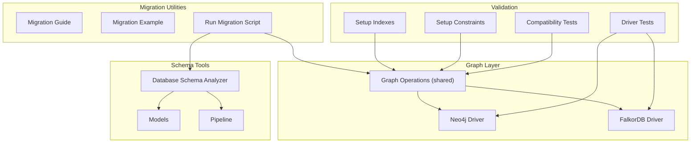
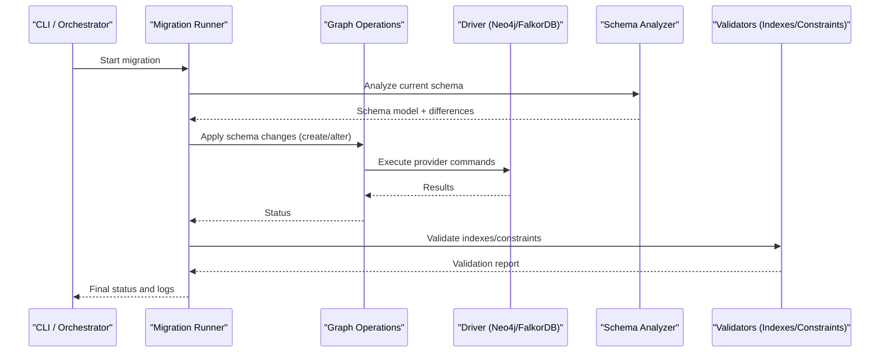
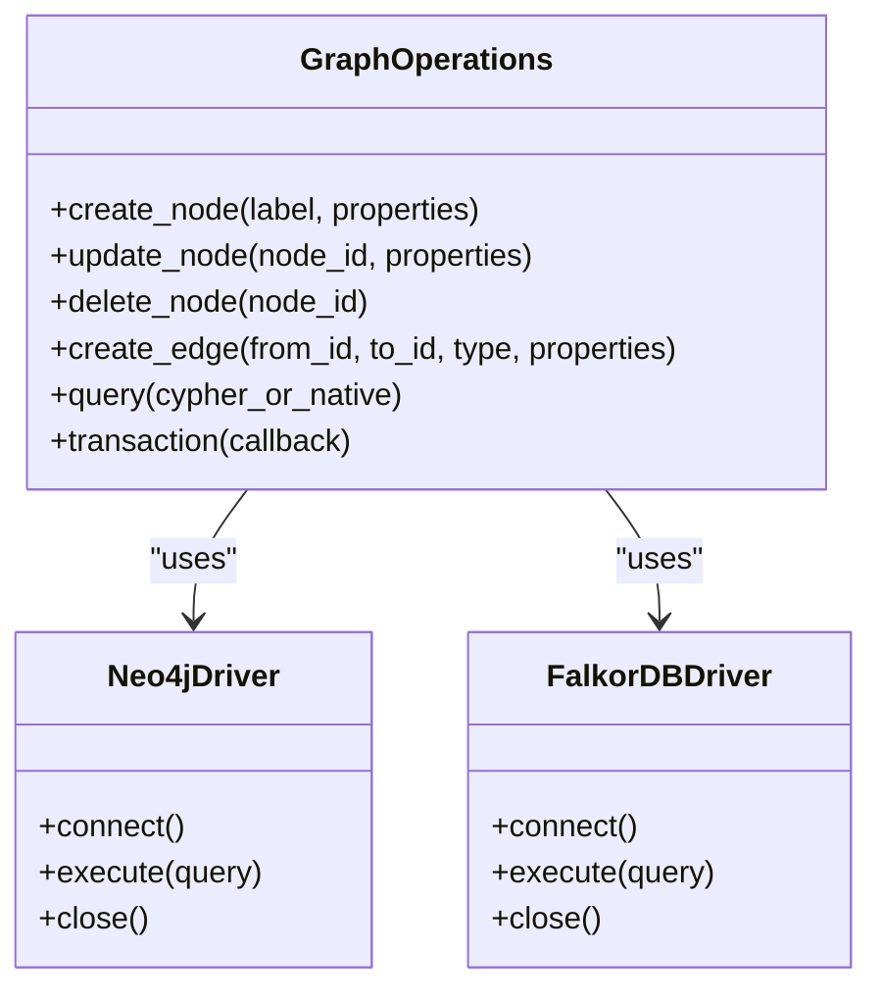
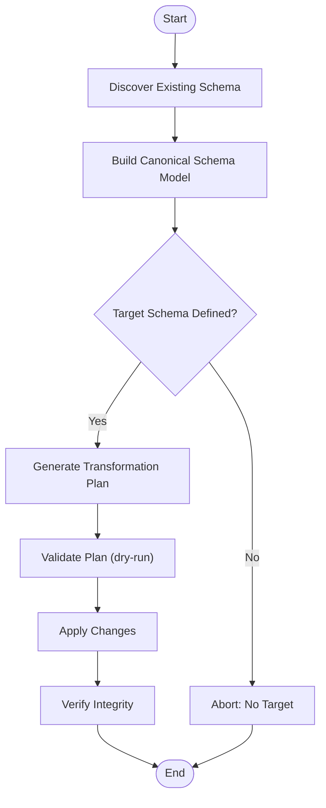
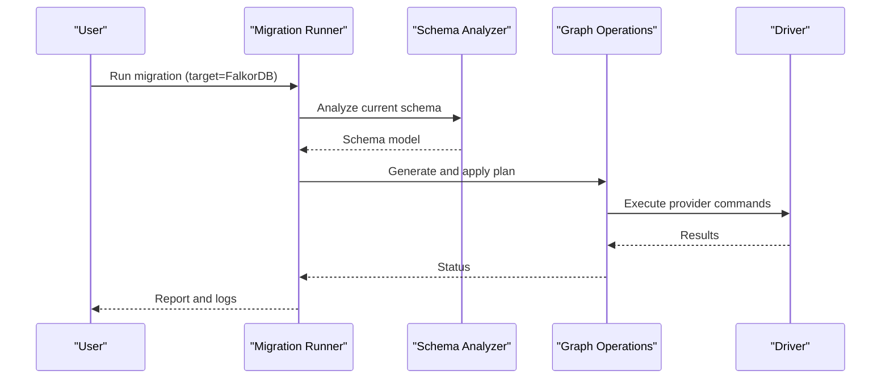
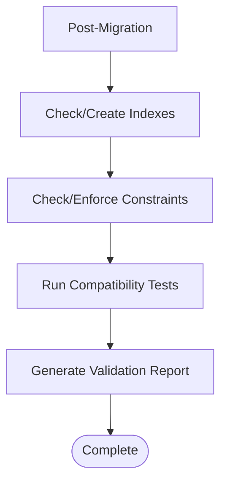
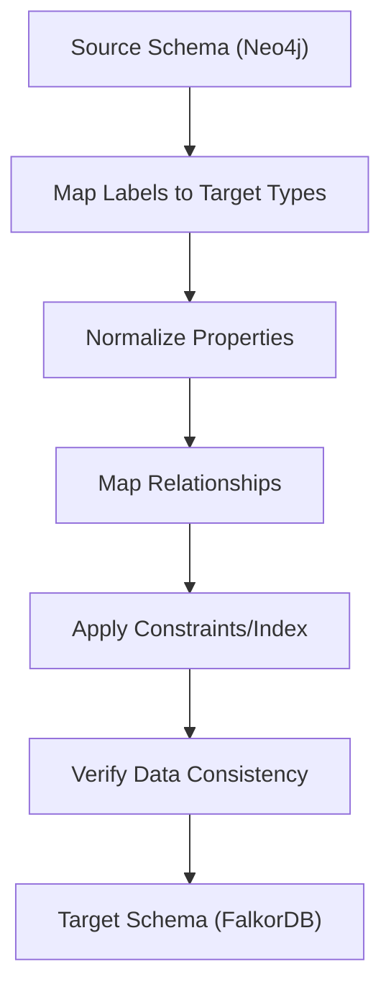
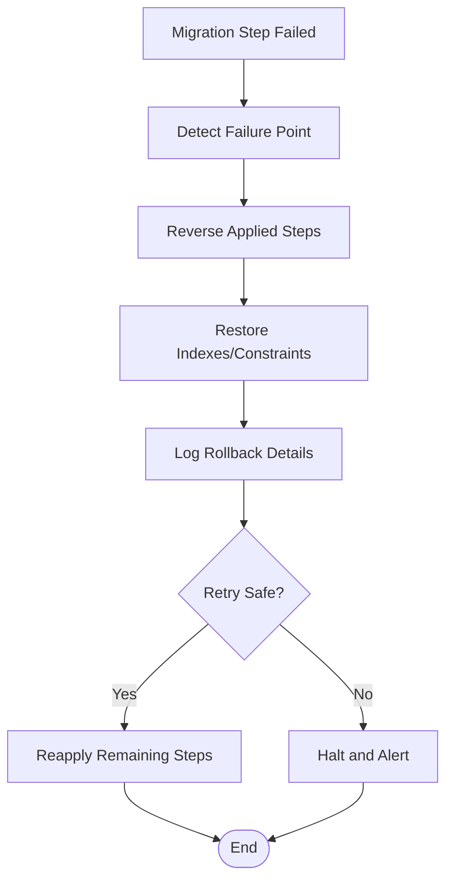
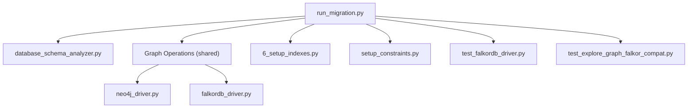

# Database Migration & Schema Management

<cite>
**Referenced Files in This Document**
- [README.md](file://ReadMe.md)
- [Makefile](file://Makefile)
- [pyproject.toml](file://pyproject.toml)
- [requirements.txt](file://requirements.txt)
- [graph_store.py](file://doc-tiny/graph_store.py)
- [neo4j_loader.py](file://doc-tiny/neo4j_loader.py)
- [falkordb_driver.py](file://code-tiny/tools/graph/driver/falkordb_driver.py)
- [neo4j_driver.py](file://code-tiny/tools/graph/driver/neo4j_driver.py)
- [database_schema_analyzer.py](file://code-tiny/tools/database_schema/database_schema_analyzer.py)
- [models.py](file://code-tiny/tools/database_schema/models.py)
- [pipeline.py](file://code-tiny/tools/database_schema/pipeline.py)
- [MIGRATION_GUIDE.py](file://code-tiny/tools/graph/docs/MIGRATION_GUIDE.py)
- [MIGRATION_EXAMPLE.md](file://code-tiny/tools/graph/docs/MIGRATION_EXAMPLE.md)
- [run_migration.py](file://code-tiny/run_migration.py)
- [plan.md](file://plans/neo4j-to-falkordb-migration/plan.md)
- [validation.md](file://plans/neo4j-to-falkordb-migration/validation.md)
- [red-team.md](file://plans/neo4j-to-falkordb-migration/red-team.md)
- [6_setup_indexes.py](file://doc-tiny/6_setup_indexes.py)
- [setup_constraints.py](file://code-tiny/scripts/setup_constraints.py)
- [test_falkordb_driver.py](file://tests/test_falkordb_driver.py)
- [test_explore_graph_falkor_compat.py](file://tests/test_explore_graph_falkor_compat.py)
</cite>

## Table of Contents
1. [Introduction](#introduction)
2. [Project Structure](#project-structure)
3. [Core Components](#core-components)
4. [Architecture Overview](#architecture-overview)
5. [Detailed Component Analysis](#detailed-component-analysis)
6. [Dependency Analysis](#dependency-analysis)
7. [Performance Considerations](#performance-considerations)
8. [Troubleshooting Guide](#troubleshooting-guide)
9. [Conclusion](#conclusion)
10. [Appendices](#appendices)

## Introduction
This document explains the database migration and schema management approach used by Cortex Harness, focusing on:
- The migration framework architecture for graph databases
- Version control and automated execution of schema changes
- Differences between Neo4j and FalkorDB schemas and how to migrate data across them
- Rollback procedures for failed migrations
- Schema validation, integrity checks, and consistency verification tools
- Step-by-step guides for upgrading versions, migrating from legacy schemas, and performing emergency repairs
- Best practices for planning migrations, minimizing downtime, and handling large datasets

The repository includes a dedicated plan for migrating from Neo4j to FalkorDB, driver implementations for both backends, and utilities for schema analysis and index/constraint setup.

## Project Structure
Cortex Harness organizes graph-related code under a modular structure:
- Graph drivers for Neo4j and FalkorDB
- A shared graph operations layer that abstracts provider-specific details
- Database schema analysis and modeling utilities
- Scripts and documentation for migration workflows
- Tests validating compatibility and behavior across providers

**Diagram sources**
- [neo4j_driver.py](file://code-tiny/tools/graph/driver/neo4j_driver.py)
- [falkordb_driver.py](file://code-tiny/tools/graph/driver/falkordb_driver.py)
- [database_schema_analyzer.py](file://code-tiny/tools/database_schema/database_schema_analyzer.py)
- [models.py](file://code-tiny/tools/database_schema/models.py)
- [pipeline.py](file://code-tiny/tools/database_schema/pipeline.py)
- [MIGRATION_GUIDE.py](file://code-tiny/tools/graph/docs/MIGRATION_GUIDE.py)
- [MIGRATION_EXAMPLE.md](file://code-tiny/tools/graph/docs/MIGRATION_EXAMPLE.md)
- [run_migration.py](file://code-tiny/run_migration.py)
- [6_setup_indexes.py](file://doc-tiny/6_setup_indexes.py)
- [setup_constraints.py](file://code-tiny/scripts/setup_constraints.py)
- [test_falkordb_driver.py](file://tests/test_falkordb_driver.py)
- [test_explore_graph_falkor_compat.py](file://tests/test_explore_graph_falkor_compat.py)

**Section sources**
- [README.md](file://ReadMe.md)
- [Makefile](file://Makefile)
- [pyproject.toml](file://pyproject.toml)
- [requirements.txt](file://requirements.txt)

## Core Components
- Graph Drivers
  - Neo4j driver provides Cypher-based connectivity and query execution.
  - FalkorDB driver implements compatible interfaces for FalkorDB’s API surface.
- Shared Graph Operations
  - Encapsulates common operations (nodes, edges, queries) behind a consistent interface.
- Schema Analysis and Modeling
  - Analyzes existing graph schemas, models node/edge types, and generates pipeline steps for transformations.
- Migration Utilities
  - Guides and examples for migrating between providers.
  - Orchestration script to run migrations with logging and error handling.
- Validation and Integrity
  - Index setup and constraint enforcement scripts.
  - Tests ensuring cross-provider compatibility and correct behavior.

**Section sources**
- [neo4j_driver.py](file://code-tiny/tools/graph/driver/neo4j_driver.py)
- [falkordb_driver.py](file://code-tiny/tools/graph/driver/falkordb_driver.py)
- [database_schema_analyzer.py](file://code-tiny/tools/database_schema/database_schema_analyzer.py)
- [models.py](file://code-tiny/tools/database_schema/models.py)
- [pipeline.py](file://code-tiny/tools/database_schema/pipeline.py)
- [MIGRATION_GUIDE.py](file://code-tiny/tools/graph/docs/MIGRATION_GUIDE.py)
- [MIGRATION_EXAMPLE.md](file://code-tiny/tools/graph/docs/MIGRATION_EXAMPLE.md)
- [run_migration.py](file://code-tiny/run_migration.py)
- [6_setup_indexes.py](file://doc-tiny/6_setup_indexes.py)
- [setup_constraints.py](file://code-tiny/scripts/setup_constraints.py)
- [test_falkordb_driver.py](file://tests/test_falkordb_driver.py)
- [test_explore_graph_falkor_compat.py](file://tests/test_explore_graph_falkor_compat.py)

## Architecture Overview
The migration architecture centers on a provider-agnostic operations layer backed by specific drivers. Schema analysis informs transformation pipelines, while migration orchestration coordinates execution and rollback.

**Diagram sources**
- [run_migration.py](file://code-tiny/run_migration.py)
- [database_schema_analyzer.py](file://code-tiny/tools/database_schema/database_schema_analyzer.py)
- [neo4j_driver.py](file://code-tiny/tools/graph/driver/neo4j_driver.py)
- [falkordb_driver.py](file://code-tiny/tools/graph/driver/falkordb_driver.py)
- [6_setup_indexes.py](file://doc-tiny/6_setup_indexes.py)
- [setup_constraints.py](file://code-tiny/scripts/setup_constraints.py)

## Detailed Component Analysis

### Graph Drivers and Provider Abstraction
- Neo4j Driver
  - Implements connection management, transaction boundaries, and Cypher execution.
  - Exposes methods aligned with shared operations for nodes, edges, and queries.
- FalkorDB Driver
  - Provides equivalent capabilities using FalkorDB’s API surface.
  - Ensures method signatures match the shared interface to minimize refactoring.
- Shared Operations
  - Centralizes logic for creating/updating nodes and edges, executing queries, and handling results.
  - Abstracts provider-specific differences so higher layers remain portable.

**Diagram sources**
- [neo4j_driver.py](file://code-tiny/tools/graph/driver/neo4j_driver.py)
- [falkordb_driver.py](file://code-tiny/tools/graph/driver/falkordb_driver.py)

**Section sources**
- [neo4j_driver.py](file://code-tiny/tools/graph/driver/neo4j_driver.py)
- [falkordb_driver.py](file://code-tiny/tools/graph/driver/falkordb_driver.py)

### Schema Analysis and Modeling
- Schema Analyzer
  - Inspects existing graph structures (labels, relationships, properties).
  - Produces a normalized schema model suitable for diffing and transformation.
- Models
  - Define canonical representations of nodes, edges, and constraints.
- Pipeline
  - Generates ordered steps to transform source schema to target schema.
  - Supports idempotent operations and safe retries.

**Diagram sources**
- [database_schema_analyzer.py](file://code-tiny/tools/database_schema/database_schema_analyzer.py)
- [models.py](file://code-tiny/tools/database_schema/models.py)
- [pipeline.py](file://code-tiny/tools/database_schema/pipeline.py)

**Section sources**
- [database_schema_analyzer.py](file://code-tiny/tools/database_schema/database_schema_analyzer.py)
- [models.py](file://code-tiny/tools/database_schema/models.py)
- [pipeline.py](file://code-tiny/tools/database_schema/pipeline.py)

### Migration Orchestration and Execution
- Migration Runner
  - Coordinates discovery, planning, application, and verification phases.
  - Logs progress and errors; supports dry-run mode.
- Guides and Examples
  - Provide step-by-step instructions and example flows for provider transitions.
- Cross-Provider Data Transformation
  - Maps labels and relationship types to target semantics.
  - Normalizes property names and types where necessary.

**Diagram sources**
- [run_migration.py](file://code-tiny/run_migration.py)
- [MIGRATION_GUIDE.py](file://code-tiny/tools/graph/docs/MIGRATION_GUIDE.py)
- [MIGRATION_EXAMPLE.md](file://code-tiny/tools/graph/docs/MIGRATION_EXAMPLE.md)
- [database_schema_analyzer.py](file://code-tiny/tools/database_schema/database_schema_analyzer.py)
- [neo4j_driver.py](file://code-tiny/tools/graph/driver/neo4j_driver.py)
- [falkordb_driver.py](file://code-tiny/tools/graph/driver/falkordb_driver.py)

**Section sources**
- [run_migration.py](file://code-tiny/run_migration.py)
- [MIGRATION_GUIDE.py](file://code-tiny/tools/graph/docs/MIGRATION_GUIDE.py)
- [MIGRATION_EXAMPLE.md](file://code-tiny/tools/graph/docs/MIGRATION_EXAMPLE.md)

### Validation, Integrity Checks, and Consistency Verification
- Index Setup
  - Ensures performance-critical indexes exist post-migration.
- Constraint Enforcement
  - Applies uniqueness or existence constraints to maintain integrity.
- Compatibility Tests
  - Validates that operations behave consistently across Neo4j and FalkorDB.

**Diagram sources**
- [6_setup_indexes.py](file://doc-tiny/6_setup_indexes.py)
- [setup_constraints.py](file://code-tiny/scripts/setup_constraints.py)
- [test_falkordb_driver.py](file://tests/test_falkordb_driver.py)
- [test_explore_graph_falkor_compat.py](file://tests/test_explore_graph_falkor_compat.py)

**Section sources**
- [6_setup_indexes.py](file://doc-tiny/6_setup_indexes.py)
- [setup_constraints.py](file://code-tiny/scripts/setup_constraints.py)
- [test_falkordb_driver.py](file://tests/test_falkordb_driver.py)
- [test_explore_graph_falkor_compat.py](file://tests/test_explore_graph_falkor_compat.py)

### Neo4j vs FalkorDB Schema Differences and Transformation Rules
- Labels and Relationship Types
  - Map Neo4j labels to FalkorDB entity types; ensure naming conventions align.
- Properties and Types
  - Normalize property names and coerce types where needed (e.g., strings to integers).
- Constraints and Indexes
  - Recreate equivalent constraints/indexes in the target system.
- Query Semantics
  - Translate Cypher-like patterns to FalkorDB-compatible calls via the shared operations layer.

[No sources needed since this diagram shows conceptual workflow, not actual code structure]

**Section sources**
- [MIGRATION_GUIDE.py](file://code-tiny/tools/graph/docs/MIGRATION_GUIDE.py)
- [MIGRATION_EXAMPLE.md](file://code-tiny/tools/graph/docs/MIGRATION_EXAMPLE.md)
- [database_schema_analyzer.py](file://code-tiny/tools/database_schema/database_schema_analyzer.py)

### Rollback Procedures for Failed Migrations
- Dry-Run First
  - Always validate plans without applying changes.
- Idempotent Steps
  - Ensure each step can be safely retried without side effects.
- Transaction Boundaries
  - Wrap batches of changes in transactions where supported.
- Rollback Strategy
  - Revert applied steps in reverse order; restore indexes and constraints if they were dropped.
- State Tracking
  - Record migration state and version to avoid partial applications.

[No sources needed since this diagram shows conceptual workflow, not actual code structure]

**Section sources**
- [run_migration.py](file://code-tiny/run_migration.py)
- [neo4j_driver.py](file://code-tiny/tools/graph/driver/neo4j_driver.py)
- [falkordb_driver.py](file://code-tiny/tools/graph/driver/falkordb_driver.py)

## Dependency Analysis
The migration subsystem depends on:
- Graph drivers for connectivity and execution
- Schema analyzer and models for planning
- Validation utilities for integrity assurance
- Tests for regression prevention

**Diagram sources**
- [run_migration.py](file://code-tiny/run_migration.py)
- [database_schema_analyzer.py](file://code-tiny/tools/database_schema/database_schema_analyzer.py)
- [neo4j_driver.py](file://code-tiny/tools/graph/driver/neo4j_driver.py)
- [falkordb_driver.py](file://code-tiny/tools/graph/driver/falkordb_driver.py)
- [6_setup_indexes.py](file://doc-tiny/6_setup_indexes.py)
- [setup_constraints.py](file://code-tiny/scripts/setup_constraints.py)
- [test_falkordb_driver.py](file://tests/test_falkordb_driver.py)
- [test_explore_graph_falkor_compat.py](file://tests/test_explore_graph_falkor_compat.py)

**Section sources**
- [run_migration.py](file://code-tiny/run_migration.py)
- [database_schema_analyzer.py](file://code-tiny/tools/database_schema/database_schema_analyzer.py)
- [neo4j_driver.py](file://code-tiny/tools/graph/driver/neo4j_driver.py)
- [falkordb_driver.py](file://code-tiny/tools/graph/driver/falkordb_driver.py)
- [6_setup_indexes.py](file://doc-tiny/6_setup_indexes.py)
- [setup_constraints.py](file://code-tiny/scripts/setup_constraints.py)
- [test_falkordb_driver.py](file://tests/test_falkordb_driver.py)
- [test_explore_graph_falkor_compat.py](file://tests/test_explore_graph_falkor_compat.py)

## Performance Considerations
- Batched Writes
  - Group node/edge updates into batches to reduce round-trips.
- Index Pre-Planning
  - Create indexes before bulk loads when possible.
- Read-Only Phases
  - Use read-only connections during validation to avoid contention.
- Backpressure and Retries
  - Implement retry logic with exponential backoff for transient failures.
- Monitoring
  - Track throughput, latency, and error rates during migrations.

[No sources needed since this section provides general guidance]

## Troubleshooting Guide
Common issues and resolutions:
- Connection Errors
  - Verify credentials, endpoints, and network reachability for Neo4j/FalkorDB.
- Constraint Violations
  - Review uniqueness constraints; normalize keys prior to insertion.
- Index Not Found
  - Ensure indexes are created post-migration; re-run index setup.
- Partial Migrations
  - Use dry-run and idempotent steps; roll back and reapply remaining steps.
- Compatibility Failures
  - Run provider compatibility tests; adjust mapping rules accordingly.

**Section sources**
- [test_falkordb_driver.py](file://tests/test_falkordb_driver.py)
- [test_explore_graph_falkor_compat.py](file://tests/test_explore_graph_falkor_compat.py)
- [6_setup_indexes.py](file://doc-tiny/6_setup_indexes.py)
- [setup_constraints.py](file://code-tiny/scripts/setup_constraints.py)

## Conclusion
Cortex Harness provides a structured, provider-agnostic migration framework with clear separation between operations, drivers, and schema analysis. By leveraging idempotent steps, robust validation, and comprehensive testing, teams can confidently upgrade versions, migrate between Neo4j and FalkorDB, and perform emergency repairs with minimal risk.

[No sources needed since this section summarizes without analyzing specific files]

## Appendices

### Step-by-Step Migration Guides

#### Upgrading Between Cortex Harness Versions
- Backup current graph state
- Run schema analyzer to detect changes
- Generate and validate transformation plan
- Apply changes in batches with monitoring
- Post-migration validation (indexes, constraints, tests)

**Section sources**
- [run_migration.py](file://code-tiny/run_migration.py)
- [database_schema_analyzer.py](file://code-tiny/tools/database_schema/database_schema_analyzer.py)
- [6_setup_indexes.py](file://doc-tiny/6_setup_indexes.py)
- [setup_constraints.py](file://code-tiny/scripts/setup_constraints.py)

#### Migrating from Legacy Schemas
- Inventory legacy labels and relationships
- Map to canonical models
- Transform properties and types
- Apply constraints and indexes
- Validate with compatibility tests

**Section sources**
- [MIGRATION_GUIDE.py](file://code-tiny/tools/graph/docs/MIGRATION_GUIDE.py)
- [MIGRATION_EXAMPLE.md](file://code-tiny/tools/graph/docs/MIGRATION_EXAMPLE.md)
- [models.py](file://code-tiny/tools/database_schema/models.py)
- [pipeline.py](file://code-tiny/tools/database_schema/pipeline.py)

#### Performing Emergency Schema Repairs
- Identify affected entities and relationships
- Isolate problematic batches
- Apply targeted fixes with transaction boundaries
- Re-validate integrity and consistency
- Document incident and update migration plan

**Section sources**
- [run_migration.py](file://code-tiny/run_migration.py)
- [neo4j_driver.py](file://code-tiny/tools/graph/driver/neo4j_driver.py)
- [falkordb_driver.py](file://code-tiny/tools/graph/driver/falkordb_driver.py)

### Planning and Best Practices
- Plan migrations incrementally with small, reversible steps
- Minimize downtime by scheduling off-peak runs
- Handle large datasets with batching and streaming
- Maintain detailed logs and metrics
- Keep rollback procedures tested and ready

[No sources needed since this section provides general guidance]

### Reference Plans and Documentation
- Neo4j to FalkorDB migration plan, validation strategy, and red team review

**Section sources**
- [plan.md](file://plans/neo4j-to-falkordb-migration/plan.md)
- [validation.md](file://plans/neo4j-to-falkordb-migration/validation.md)
- [red-team.md](file://plans/neo4j-to-falkordb-migration/red-team.md)