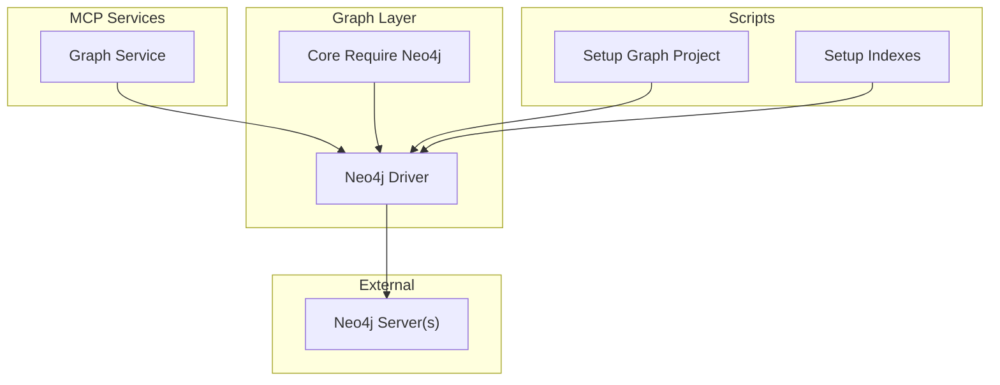
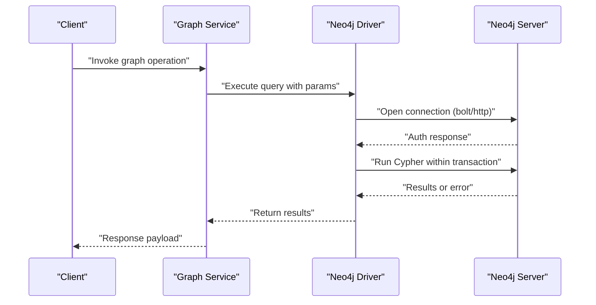
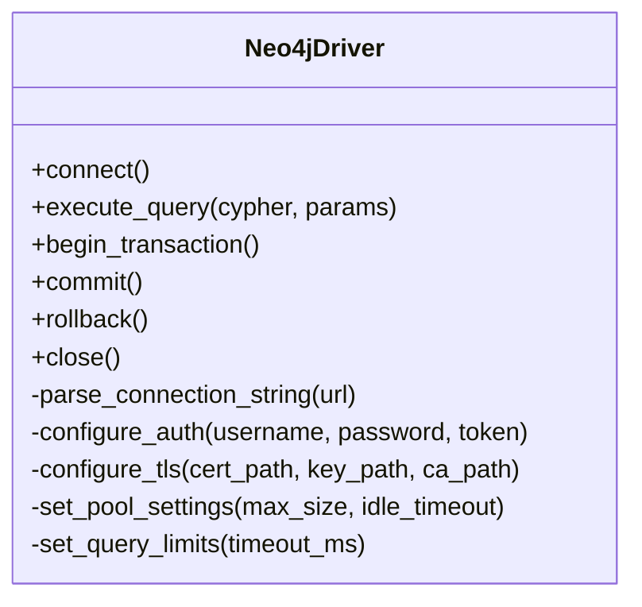
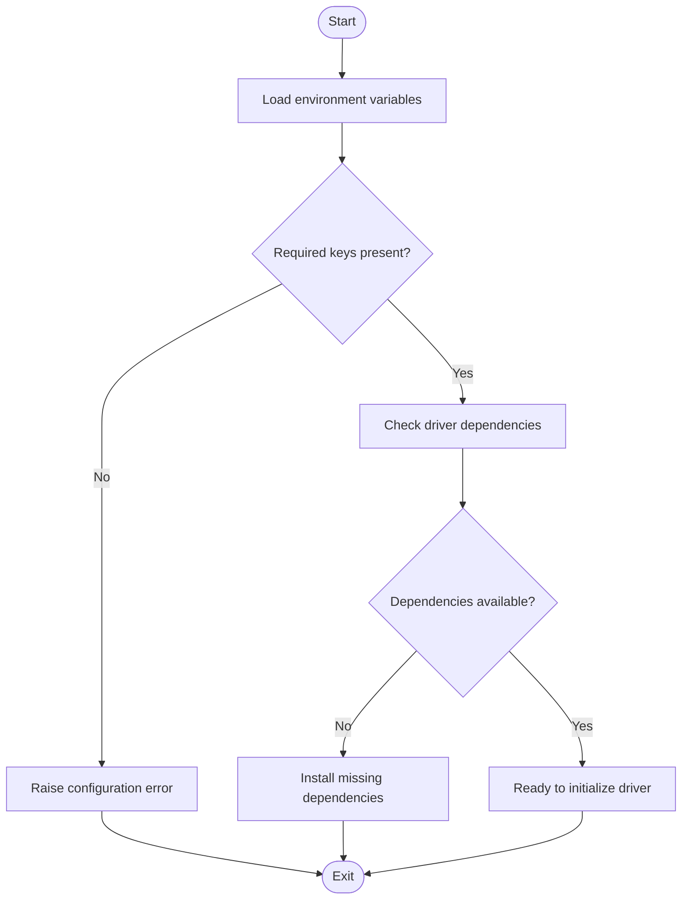
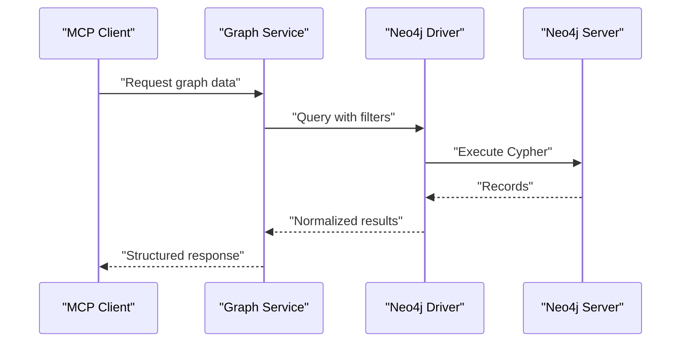
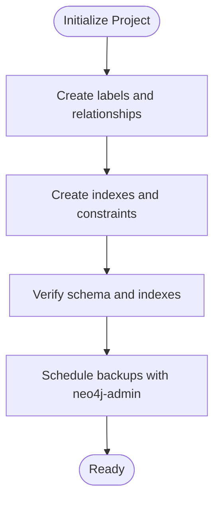
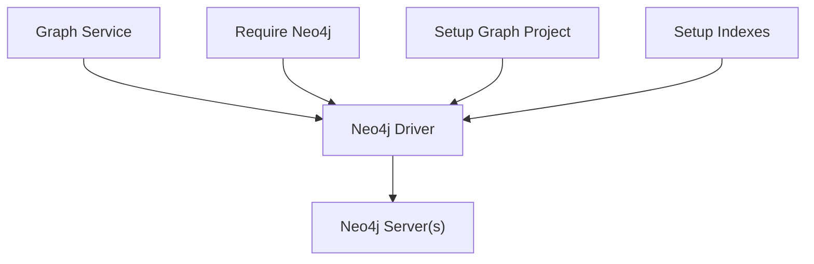

# Neo4j Configuration

<cite>
**Referenced Files in This Document**
- [neo4j_driver.py](file://code-tiny/tools/graph/driver/neo4j_driver.py)
- [require_neo4j.py](file://code-tiny/tools/graph/core/require_neo4j.py)
- [graph_service.py](file://code-tiny/mcp/services/graph_service.py)
- [setup_graph_project.py](file://code-tiny/scripts/setup_graph_project.py)
- [6_setup_indexes.py](file://doc-tiny/6_setup_indexes.py)
- [neo4j_loader.py](file://doc-tiny/neo4j_loader.py)
- [DATABASE_INTEGRATION.md](file://docs/DATABASE_INTEGRATION.md)
</cite>

## Table of Contents
1. [Introduction](#introduction)
2. [Project Structure](#project-structure)
3. [Core Components](#core-components)
4. [Architecture Overview](#architecture-overview)
5. [Detailed Component Analysis](#detailed-component-analysis)
6. [Dependency Analysis](#dependency-analysis)
7. [Performance Considerations](#performance-considerations)
8. [Troubleshooting Guide](#troubleshooting-guide)
9. [Conclusion](#conclusion)
10. [Appendices](#appendices)

## Introduction
This document provides detailed configuration guidance for using Neo4j with Cortex Harness. It covers connection string formats, authentication methods, SSL/TLS setup, performance tuning parameters, schema initialization and indexing strategies, backup and recovery workflows, cluster configurations for distributed deployments, and troubleshooting common issues such as connectivity, authentication failures, performance bottlenecks, and data consistency problems.

## Project Structure
Cortex Harness integrates Neo4j through a dedicated driver and supporting modules:
- Driver layer: Implements connection management, query execution, and transaction handling.
- Core utilities: Provide environment-based configuration and requirement checks.
- MCP services: Expose graph operations to the orchestration layer.
- Scripts: Initialize project graphs and create indexes for optimal query performance.
- Documentation: Describes integration patterns and usage.

**Diagram sources**
- [neo4j_driver.py](file://code-tiny/tools/graph/driver/neo4j_driver.py)
- [require_neo4j.py](file://code-tiny/tools/graph/core/require_neo4j.py)
- [graph_service.py](file://code-tiny/mcp/services/graph_service.py)
- [setup_graph_project.py](file://code-tiny/scripts/setup_graph_project.py)
- [6_setup_indexes.py](file://doc-tiny/6_setup_indexes.py)

**Section sources**
- [neo4j_driver.py](file://code-tiny/tools/graph/driver/neo4j_driver.py)
- [require_neo4j.py](file://code-tiny/tools/graph/core/require_neo4j.py)
- [graph_service.py](file://code-tiny/mcp/services/graph_service.py)
- [setup_graph_project.py](file://code-tiny/scripts/setup_graph_project.py)
- [6_setup_indexes.py](file://doc-tiny/6_setup_indexes.py)
- [DATABASE_INTEGRATION.md](file://docs/DATABASE_INTEGRATION.md)

## Core Components
- Neo4j Driver: Manages connections, executes Cypher queries, handles transactions, and supports multiple protocols and authentication mechanisms.
- Core Require Neo4j: Validates environment variables and required dependencies before initializing the driver.
- Graph Service: Provides higher-level graph operations used by MCP tools and orchestrators.
- Setup Scripts: Initialize database schema and indexes for consistent performance.

Key responsibilities:
- Connection lifecycle (create, reuse, close).
- Query execution with retries and timeouts.
- Transaction boundaries and error propagation.
- Environment-driven configuration (connection strings, credentials, TLS settings).

**Section sources**
- [neo4j_driver.py](file://code-tiny/tools/graph/driver/neo4j_driver.py)
- [require_neo4j.py](file://code-tiny/tools/graph/core/require_neo4j.py)
- [graph_service.py](file://code-tiny/mcp/services/graph_service.py)

## Architecture Overview
The following sequence diagram shows how a typical graph operation flows from the MCP service through the driver to Neo4j:

**Diagram sources**
- [graph_service.py](file://code-tiny/mcp/services/graph_service.py)
- [neo4j_driver.py](file://code-tiny/tools/graph/driver/neo4j_driver.py)

## Detailed Component Analysis

### Neo4j Driver
Responsibilities:
- Parse connection strings for bolt:// and http:// protocols.
- Configure authentication (username/password and JWT tokens).
- Manage SSL/TLS certificates for secure connections.
- Control connection pooling, query limits, memory allocation hints, and transaction timeouts.
- Execute read/write transactions and handle errors consistently.

Configuration entry points:
- Environment variables for connection URL, username, password, token, and TLS paths.
- Optional explicit parameters passed at driver initialization.

Connection string formats:
- Bolt protocol: Use bolt://host:port with optional path and query parameters.
- HTTP protocol: Use http://host:port/dbname with optional query parameters.

Authentication methods:
- Username/password: Provide credentials via environment variables or constructor parameters.
- JWT tokens: Supply a bearer token for token-based authentication.

SSL/TLS configuration:
- Specify certificate paths for server verification and client identity when required.
- Enable strict hostname verification and truststore configuration if supported by the underlying driver.

Performance tuning parameters:
- Connection pool size: Adjust based on concurrency needs and server capacity.
- Max query execution time: Set per-query or default timeout to prevent long-running queries.
- Memory allocation hints: Configure driver-side memory buffers where applicable.
- Transaction timeout: Define maximum duration for write transactions.

Error handling:
- Retry transient network errors with backoff.
- Map Neo4j-specific errors to application exceptions.
- Log diagnostic information without exposing secrets.

**Diagram sources**
- [neo4j_driver.py](file://code-tiny/tools/graph/driver/neo4j_driver.py)

**Section sources**
- [neo4j_driver.py](file://code-tiny/tools/graph/driver/neo4j_driver.py)

### Core Require Neo4j
Responsibilities:
- Validate presence of required environment variables (e.g., NEO4J_URL, NEO4J_USER, NEO4J_PASSWORD, NEO4J_TOKEN).
- Ensure driver dependencies are installed and importable.
- Provide early failure feedback during startup.

Operational flow:
- Load environment variables.
- Check for mandatory keys.
- Attempt minimal driver capability check.
- Raise descriptive errors if prerequisites are missing.

**Diagram sources**
- [require_neo4j.py](file://code-tiny/tools/graph/core/require_neo4j.py)

**Section sources**
- [require_neo4j.py](file://code-tiny/tools/graph/core/require_neo4j.py)

### Graph Service (MCP Integration)
Responsibilities:
- Expose graph operations to MCP clients.
- Translate MCP requests into driver calls.
- Handle result serialization and error mapping.

Integration points:
- Uses the Neo4j driver for all database interactions.
- Relies on core require module to ensure runtime readiness.

**Diagram sources**
- [graph_service.py](file://code-tiny/mcp/services/graph_service.py)
- [neo4j_driver.py](file://code-tiny/tools/graph/driver/neo4j_driver.py)

**Section sources**
- [graph_service.py](file://code-tiny/mcp/services/graph_service.py)

### Schema Initialization and Indexing
Procedures:
- Initialize project graph structure using setup scripts.
- Create indexes to optimize frequent queries (e.g., node labels and property lookups).
- Apply constraints to enforce uniqueness and integrity.

Index creation strategy:
- Identify high-cardinality properties commonly filtered in queries.
- Create single-property indexes for equality and range scans.
- Consider composite indexes for multi-property predicates.
- Monitor index usage and adjust based on query plans.

Backup and recovery:
- Use neo4j-admin tools to perform backups and restores.
- Schedule regular backups for production environments.
- Validate restore procedures periodically.

**Diagram sources**
- [setup_graph_project.py](file://code-tiny/scripts/setup_graph_project.py)
- [6_setup_indexes.py](file://doc-tiny/6_setup_indexes.py)

**Section sources**
- [setup_graph_project.py](file://code-tiny/scripts/setup_graph_project.py)
- [6_setup_indexes.py](file://doc-tiny/6_setup_indexes.py)

### Cluster Configuration
Guidance:
- For distributed deployments, configure causal clustering with multiple members.
- Set up load balancing across instances using a proxy or client-side routing.
- Ensure high availability by configuring appropriate replication factors and monitoring.

Considerations:
- Network topology and firewall rules between cluster nodes.
- Consistency levels and read replicas for scaling reads.
- Monitoring and alerting for leader elections and lag.

[No sources needed since this section provides general guidance]

## Dependency Analysis
The following diagram illustrates component dependencies and their roles:

**Diagram sources**
- [graph_service.py](file://code-tiny/mcp/services/graph_service.py)
- [neo4j_driver.py](file://code-tiny/tools/graph/driver/neo4j_driver.py)
- [require_neo4j.py](file://code-tiny/tools/graph/core/require_neo4j.py)
- [setup_graph_project.py](file://code-tiny/scripts/setup_graph_project.py)
- [6_setup_indexes.py](file://doc-tiny/6_setup_indexes.py)

**Section sources**
- [graph_service.py](file://code-tiny/mcp/services/graph_service.py)
- [neo4j_driver.py](file://code-tiny/tools/graph/driver/neo4j_driver.py)
- [require_neo4j.py](file://code-tiny/tools/graph/core/require_neo4j.py)
- [setup_graph_project.py](file://code-tiny/scripts/setup_graph_project.py)
- [6_setup_indexes.py](file://doc-tiny/6_setup_indexes.py)

## Performance Considerations
- Connection pooling: Tune pool size to match expected concurrency; avoid over-provisioning to prevent resource contention.
- Query limits: Set reasonable timeouts to protect against runaway queries; use pagination for large result sets.
- Memory allocation: Adjust driver-side buffers according to workload characteristics and server capabilities.
- Transaction timeouts: Keep write transactions short; split large updates into batches.
- Indexing: Maintain relevant indexes; regularly review query plans and remove unused indexes.
- Monitoring: Track latency, throughput, and error rates; correlate with Neo4j metrics.

[No sources needed since this section provides general guidance]

## Troubleshooting Guide
Common issues and resolutions:
- Connection failures:
  - Verify connection string format and host/port accessibility.
  - Check firewall rules and DNS resolution.
  - Confirm protocol support (bolt vs http) matches server configuration.
- Authentication failures:
  - Ensure credentials or JWT tokens are correctly set in environment variables.
  - Validate token expiration and permissions.
- SSL/TLS errors:
  - Confirm certificate paths and truststore configuration.
  - Check hostname verification settings and certificate validity.
- Performance bottlenecks:
  - Review query execution times and add appropriate indexes.
  - Increase pool size cautiously; monitor server resources.
  - Reduce transaction sizes and implement batching.
- Data consistency problems:
  - Inspect cluster health and leader status.
  - Validate replication lag and retry policies.
  - Use consistent read preferences where applicable.

Operational references:
- Environment validation and dependency checks.
- Driver error mapping and logging practices.
- Backup and restore procedures using neo4j-admin.

**Section sources**
- [require_neo4j.py](file://code-tiny/tools/graph/core/require_neo4j.py)
- [neo4j_driver.py](file://code-tiny/tools/graph/driver/neo4j_driver.py)
- [neo4j_loader.py](file://doc-tiny/neo4j_loader.py)
- [DATABASE_INTEGRATION.md](file://docs/DATABASE_INTEGRATION.md)

## Conclusion
Cortex Harness integrates Neo4j through a robust driver and supporting modules that manage connections, authentication, TLS, performance tuning, and schema operations. By following the configuration guidelines, indexing strategies, and troubleshooting steps outlined here, you can deploy reliable and high-performance graph operations across single-node and clustered Neo4j environments.

## Appendices

### Connection String Formats
- Bolt protocol: bolt://host:port[/database]?options
- HTTP protocol: http://host:port/database?options

Use these formats when setting environment variables or passing explicit parameters to the driver.

**Section sources**
- [neo4j_driver.py](file://code-tiny/tools/graph/driver/neo4j_driver.py)

### Authentication Methods
- Username/password: Provide user and password via environment variables or constructor parameters.
- JWT tokens: Supply a bearer token for token-based authentication.

Ensure credentials are securely managed and rotated as needed.

**Section sources**
- [neo4j_driver.py](file://code-tiny/tools/graph/driver/neo4j_driver.py)

### SSL/TLS Certificate Configuration
- Specify CA certificate path for server verification.
- Optionally provide client certificate and key for mutual TLS.
- Enable strict hostname verification to prevent MITM attacks.

Validate certificates and trust chains before deployment.

**Section sources**
- [neo4j_driver.py](file://code-tiny/tools/graph/driver/neo4j_driver.py)

### Performance Tuning Parameters
- Connection pool size: Align with concurrency and server capacity.
- Query execution timeout: Prevent long-running queries from blocking resources.
- Memory allocation: Tune driver buffers based on workload patterns.
- Transaction timeout: Keep write transactions concise and batched.

Monitor and iterate based on observed metrics.

**Section sources**
- [neo4j_driver.py](file://code-tiny/tools/graph/driver/neo4j_driver.py)

### Schema Initialization Procedures
- Run setup scripts to create labels, relationships, and constraints.
- Apply indexes for frequently queried properties.
- Verify schema correctness and performance.

**Section sources**
- [setup_graph_project.py](file://code-tiny/scripts/setup_graph_project.py)
- [6_setup_indexes.py](file://doc-tiny/6_setup_indexes.py)

### Backup and Recovery Workflows
- Use neo4j-admin to perform backups and restores.
- Schedule regular backups and test restore procedures.
- Document runbooks for disaster recovery scenarios.

**Section sources**
- [neo4j_loader.py](file://doc-tiny/neo4j_loader.py)
- [DATABASE_INTEGRATION.md](file://docs/DATABASE_INTEGRATION.md)

### Cluster Configuration
- Configure causal clustering with multiple members.
- Implement load balancing across instances.
- Ensure high availability with proper replication and monitoring.

[No sources needed since this section provides general guidance]