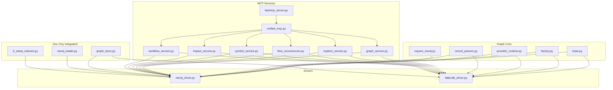
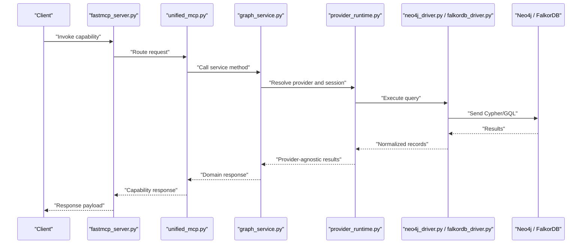
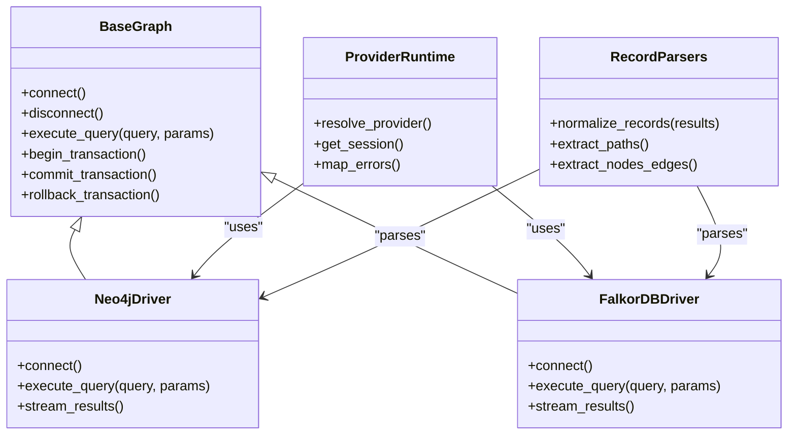
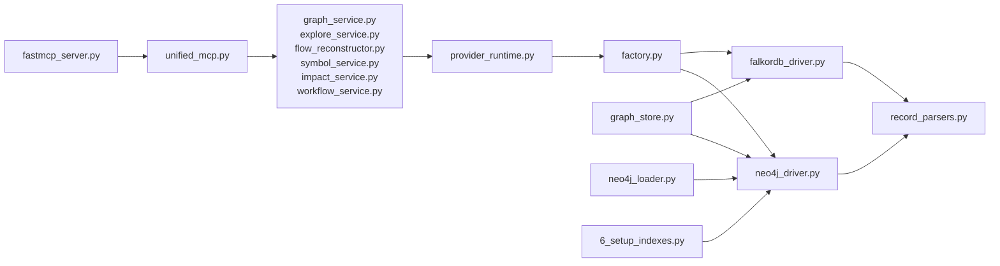
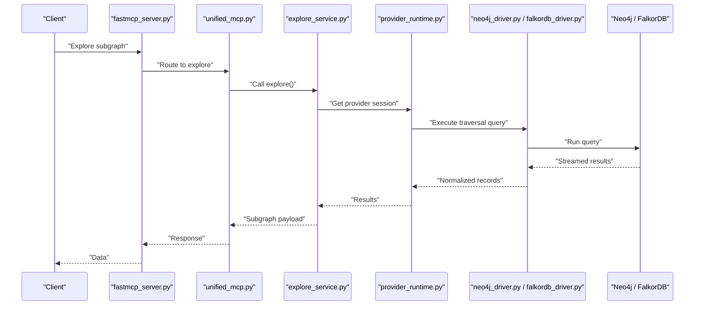
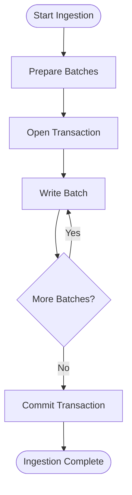

# Performance Tuning & Optimization

<cite>
**Referenced Files in This Document**
- [neo4j_driver.py](file://code-tiny/tools/graph/driver/neo4j_driver.py)
- [falkordb_driver.py](file://code-tiny/tools/graph/driver/falkordb_driver.py)
- [base.py](file://code-tiny/tools/graph/core/base.py)
- [factory.py](file://code-tiny/tools/graph/core/factory.py)
- [provider_runtime.py](file://code-tiny/tools/graph/core/provider_runtime.py)
- [require_neo4j.py](file://code-tiny/tools/graph/core/require_neo4j.py)
- [record_parsers.py](file://code-tiny/tools/graph/core/record_parsers.py)
- [graph_service.py](file://code-tiny/mcp/services/graph_service.py)
- [explore_service.py](file://code-tiny/mcp/services/explore_service.py)
- [flow_reconstructor.py](file://code-tiny/mcp/services/flow_reconstructor.py)
- [symbol_service.py](file://code-tiny/mcp/services/symbol_service.py)
- [impact_service.py](file://code-tiny/mcp/services/impact_service.py)
- [workflow_service.py](file://code-tiny/mcp/services/workflow_service.py)
- [unified_mcp.py](file://code-tiny/mcp/unified_mcp.py)
- [fastmcp_server.py](file://code-tiny/mcp/fastmcp_server.py)
- [6_setup_indexes.py](file://doc-tiny/6_setup_indexes.py)
- [graph_store.py](file://doc-tiny/graph_store.py)
- [neo4j_loader.py](file://doc-tiny/neo4j_loader.py)
- [test_falkordb_driver.py](file://tests/test_falkordb_driver.py)
- [test_explore_graph_falkor_compat.py](file://tests/test_explore_graph_falkor_compat.py)
</cite>

## Table of Contents
1. [Introduction](#introduction)
2. [Project Structure](#project-structure)
3. [Core Components](#core-components)
4. [Architecture Overview](#architecture-overview)
5. [Detailed Component Analysis](#detailed-component-analysis)
6. [Dependency Analysis](#dependency-analysis)
7. [Performance Considerations](#performance-considerations)
8. [Troubleshooting Guide](#troubleshooting-guide)
9. [Conclusion](#conclusion)
10. [Appendices](#appendices)

## Introduction
This document provides comprehensive performance tuning guidance for Cortex Harness database operations across Neo4j and FalkorDB backends. It focuses on connection pool optimization, query execution tuning, memory management, indexing strategies, query plan analysis, bottleneck identification, caching mechanisms, result set optimization, batch operation tuning, monitoring and metrics collection, alerting thresholds, capacity planning, benchmarking procedures, load testing methodologies, scaling recommendations, and troubleshooting guides for slow queries, memory leaks, and resource contention.

## Project Structure
Cortex Harness implements a provider-agnostic graph layer with drivers for Neo4j and FalkorDB. The MCP services orchestrate graph operations through a unified interface. Key areas relevant to performance include:
- Graph core abstractions and runtime
- Driver implementations (Neo4j and FalkorDB)
- MCP services that execute graph queries and transformations
- Index setup utilities and loaders used by the doc-tiny application
- Tests validating driver behavior and compatibility

**Diagram sources**
- [base.py](file://code-tiny/tools/graph/core/base.py)
- [factory.py](file://code-tiny/tools/graph/core/factory.py)
- [provider_runtime.py](file://code-tiny/tools/graph/core/provider_runtime.py)
- [require_neo4j.py](file://code-tiny/tools/graph/core/require_neo4j.py)
- [record_parsers.py](file://code-tiny/tools/graph/core/record_parsers.py)
- [neo4j_driver.py](file://code-tiny/tools/graph/driver/neo4j_driver.py)
- [falkordb_driver.py](file://code-tiny/tools/graph/driver/falkordb_driver.py)
- [graph_service.py](file://code-tiny/mcp/services/graph_service.py)
- [explore_service.py](file://code-tiny/mcp/services/explore_service.py)
- [flow_reconstructor.py](file://code-tiny/mcp/services/flow_reconstructor.py)
- [symbol_service.py](file://code-tiny/mcp/services/symbol_service.py)
- [impact_service.py](file://code-tiny/mcp/services/impact_service.py)
- [workflow_service.py](file://code-tiny/mcp/services/workflow_service.py)
- [unified_mcp.py](file://code-tiny/mcp/unified_mcp.py)
- [fastmcp_server.py](file://code-tiny/mcp/fastmcp_server.py)
- [6_setup_indexes.py](file://doc-tiny/6_setup_indexes.py)
- [graph_store.py](file://doc-tiny/graph_store.py)
- [neo4j_loader.py](file://doc-tiny/neo4j_loader.py)

**Section sources**
- [neo4j_driver.py](file://code-tiny/tools/graph/driver/neo4j_driver.py)
- [falkordb_driver.py](file://code-tiny/tools/graph/driver/falkordb_driver.py)
- [base.py](file://code-tiny/tools/graph/core/base.py)
- [factory.py](file://code-tiny/tools/graph/core/factory.py)
- [provider_runtime.py](file://code-tiny/tools/graph/core/provider_runtime.py)
- [require_neo4j.py](file://code-tiny/tools/graph/core/require_neo4j.py)
- [record_parsers.py](file://code-tiny/tools/graph/core/record_parsers.py)
- [graph_service.py](file://code-tiny/mcp/services/graph_service.py)
- [explore_service.py](file://code-tiny/mcp/services/explore_service.py)
- [flow_reconstructor.py](file://code-tiny/mcp/services/flow_reconstructor.py)
- [symbol_service.py](file://code-tiny/mcp/services/symbol_service.py)
- [impact_service.py](file://code-tiny/mcp/services/impact_service.py)
- [workflow_service.py](file://code-tiny/mcp/services/workflow_service.py)
- [unified_mcp.py](file://code-tiny/mcp/unified_mcp.py)
- [fastmcp_server.py](file://code-tiny/mcp/fastmcp_server.py)
- [6_setup_indexes.py](file://doc-tiny/6_setup_indexes.py)
- [graph_store.py](file://doc-tiny/graph_store.py)
- [neo4j_loader.py](file://doc-tiny/neo4j_loader.py)

## Core Components
- Graph core abstractions define the common interfaces and runtime behaviors for both Neo4j and FalkorDB drivers.
- Drivers encapsulate connection handling, transaction boundaries, query execution, and result parsing.
- MCP services implement domain-specific workflows (graph exploration, flow reconstruction, symbol resolution, impact analysis, workflow orchestration) using the graph core.
- Doc-tiny integration includes index setup and data loading utilities tailored for Neo4j and compatible providers.

Key responsibilities:
- Connection lifecycle and pooling
- Query construction and execution
- Result normalization and streaming
- Error propagation and diagnostics
- Provider selection and initialization

**Section sources**
- [base.py](file://code-tiny/tools/graph/core/base.py)
- [factory.py](file://code-tiny/tools/graph/core/factory.py)
- [provider_runtime.py](file://code-tiny/tools/graph/core/provider_runtime.py)
- [neo4j_driver.py](file://code-tiny/tools/graph/driver/neo4j_driver.py)
- [falkordb_driver.py](file://code-tiny/tools/graph/driver/falkordb_driver.py)

## Architecture Overview
The system uses a layered architecture:
- MCP Server exposes capabilities via a unified interface.
- Service layer orchestrates business logic and composes graph operations.
- Graph core abstracts provider differences and manages runtime context.
- Drivers implement concrete interactions with Neo4j or FalkorDB.

**Diagram sources**
- [fastmcp_server.py](file://code-tiny/mcp/fastmcp_server.py)
- [unified_mcp.py](file://code-tiny/mcp/unified_mcp.py)
- [graph_service.py](file://code-tiny/mcp/services/graph_service.py)
- [provider_runtime.py](file://code-tiny/tools/graph/core/provider_runtime.py)
- [neo4j_driver.py](file://code-tiny/tools/graph/driver/neo4j_driver.py)
- [falkordb_driver.py](file://code-tiny/tools/graph/driver/falkordb_driver.py)

## Detailed Component Analysis

### Graph Core Abstractions and Runtime
- Base classes define the contract for drivers and provide shared utilities.
- Factory selects the appropriate driver based on configuration.
- Provider runtime manages sessions, transactions, and error mapping.
- Record parsers normalize results into consistent structures.

Performance implications:
- Centralized session management enables pooling and reuse.
- Consistent record parsing reduces overhead in downstream services.
- Clear separation allows targeted optimizations per provider.

**Diagram sources**
- [base.py](file://code-tiny/tools/graph/core/base.py)
- [neo4j_driver.py](file://code-tiny/tools/graph/driver/neo4j_driver.py)
- [falkordb_driver.py](file://code-tiny/tools/graph/driver/falkordb_driver.py)
- [provider_runtime.py](file://code-tiny/tools/graph/core/provider_runtime.py)
- [record_parsers.py](file://code-tiny/tools/graph/core/record_parsers.py)

**Section sources**
- [base.py](file://code-tiny/tools/graph/core/base.py)
- [factory.py](file://code-tiny/tools/graph/core/factory.py)
- [provider_runtime.py](file://code-tiny/tools/graph/core/provider_runtime.py)
- [record_parsers.py](file://code-tiny/tools/graph/core/record_parsers.py)

### Neo4j Driver
Responsibilities:
- Establish connections and manage connection pools.
- Execute Cypher queries with optional streaming.
- Handle transactions and retries.
- Parse results into normalized records.

Performance considerations:
- Tune pool size based on concurrency and CPU/memory headroom.
- Use streaming for large result sets to reduce memory pressure.
- Batch writes where supported to minimize round-trips.
- Leverage indexes and constraints for faster lookups.

**Section sources**
- [neo4j_driver.py](file://code-tiny/tools/graph/driver/neo4j_driver.py)
- [require_neo4j.py](file://code-tiny/tools/graph/core/require_neo4j.py)

### FalkorDB Driver
Responsibilities:
- Provide a compatible interface to FalkorDB.
- Execute GQL/Cypher-like queries.
- Stream results when available.
- Normalize outputs to match the core contract.

Performance considerations:
- Align query patterns with FalkorDB’s strengths (e.g., path traversals).
- Prefer indexed properties and constrained labels.
- Use streaming to avoid materializing entire graphs in memory.

**Section sources**
- [falkordb_driver.py](file://code-tiny/tools/graph/driver/falkordb_driver.py)

### MCP Services Layer
Services implement domain workflows over the graph core:
- Graph service: general-purpose traversal and retrieval.
- Explore service: interactive exploration and subgraph extraction.
- Flow reconstructor: reconstruct control/data flows from graph data.
- Symbol service: resolve symbols and references.
- Impact service: compute change impact across code artifacts.
- Workflow service: orchestrate multi-step processes.

Performance considerations:
- Compose efficient queries to minimize hops.
- Cache frequently accessed nodes/edges at the service layer if safe.
- Paginate or limit results for UI responsiveness.
- Avoid N+1 query patterns by batching reads.

**Section sources**
- [graph_service.py](file://code-tiny/mcp/services/graph_service.py)
- [explore_service.py](file://code-tiny/mcp/services/explore_service.py)
- [flow_reconstructor.py](file://code-tiny/mcp/services/flow_reconstructor.py)
- [symbol_service.py](file://code-tiny/mcp/services/symbol_service.py)
- [impact_service.py](file://code-tiny/mcp/services/impact_service.py)
- [workflow_service.py](file://code-tiny/mcp/services/workflow_service.py)

### Doc-Tiny Integration Utilities
- Index setup utility creates necessary indexes and constraints for optimal traversal.
- Graph store wraps read/write operations with caching and batching.
- Loader handles ingestion pipelines and bulk writes.

Performance considerations:
- Pre-create indexes before bulk loads.
- Use write batching and transaction grouping.
- Validate schema constraints to prevent expensive re-indexing.

**Section sources**
- [6_setup_indexes.py](file://doc-tiny/6_setup_indexes.py)
- [graph_store.py](file://doc-tiny/graph_store.py)
- [neo4j_loader.py](file://doc-tiny/neo4j_loader.py)

## Dependency Analysis
The following diagram shows key dependencies among components involved in performance-critical paths.

**Diagram sources**
- [fastmcp_server.py](file://code-tiny/mcp/fastmcp_server.py)
- [unified_mcp.py](file://code-tiny/mcp/unified_mcp.py)
- [graph_service.py](file://code-tiny/mcp/services/graph_service.py)
- [explore_service.py](file://code-tiny/mcp/services/explore_service.py)
- [flow_reconstructor.py](file://code-tiny/mcp/services/flow_reconstructor.py)
- [symbol_service.py](file://code-tiny/mcp/services/symbol_service.py)
- [impact_service.py](file://code-tiny/mcp/services/impact_service.py)
- [workflow_service.py](file://code-tiny/mcp/services/workflow_service.py)
- [provider_runtime.py](file://code-tiny/tools/graph/core/provider_runtime.py)
- [factory.py](file://code-tiny/tools/graph/core/factory.py)
- [neo4j_driver.py](file://code-tiny/tools/graph/driver/neo4j_driver.py)
- [falkordb_driver.py](file://code-tiny/tools/graph/driver/falkordb_driver.py)
- [record_parsers.py](file://code-tiny/tools/graph/core/record_parsers.py)
- [graph_store.py](file://doc-tiny/graph_store.py)
- [neo4j_loader.py](file://doc-tiny/neo4j_loader.py)
- [6_setup_indexes.py](file://doc-tiny/6_setup_indexes.py)

**Section sources**
- [unified_mcp.py](file://code-tiny/mcp/unified_mcp.py)
- [provider_runtime.py](file://code-tiny/tools/graph/core/provider_runtime.py)
- [factory.py](file://code-tiny/tools/graph/core/factory.py)
- [neo4j_driver.py](file://code-tiny/tools/graph/driver/neo4j_driver.py)
- [falkordb_driver.py](file://code-tiny/tools/graph/driver/falkordb_driver.py)
- [graph_store.py](file://doc-tiny/graph_store.py)
- [neo4j_loader.py](file://doc-tiny/neo4j_loader.py)
- [6_setup_indexes.py](file://doc-tiny/6_setup_indexes.py)

## Performance Considerations

### Connection Pool Optimization
- Determine pool size based on concurrent requests, CPU cores, and I/O characteristics. Start with a moderate pool and scale up while monitoring saturation.
- Ensure idle timeouts and max lifetime are configured to recycle stale connections.
- For long-running workloads, prefer persistent sessions with bounded lifetimes to reduce handshake overhead.
- Separate read and write pools if your workload is heavily skewed to one direction.

[No sources needed since this section provides general guidance]

### Query Execution Tuning
- Prefer single-pass queries that traverse multiple relationships rather than multiple small queries.
- Use parameterized queries to leverage query plan caching.
- Limit returned fields and apply filters early in the traversal.
- For deep traversals, constrain starting points using indexed properties or unique constraints.
- Use streaming APIs for large result sets to avoid memory spikes.

[No sources needed since this section provides general guidance]

### Memory Management Strategies
- Stream results instead of materializing full graphs in memory.
- Process results in chunks and release references promptly.
- Avoid retaining large intermediate structures; transform incrementally.
- Monitor heap usage during ingestion and adjust batch sizes accordingly.

[No sources needed since this section provides general guidance]

### Indexing Strategies for Optimal Traversal
- Create indexes on frequently filtered properties (e.g., node labels, relationship types, and property keys).
- Use unique constraints for identity properties to speed up lookups and enforce integrity.
- Prefer composite indexes only if supported by the backend; otherwise, design queries to leverage single-property indexes.
- Rebuild or optimize indexes after bulk loads.

**Section sources**
- [6_setup_indexes.py](file://doc-tiny/6_setup_indexes.py)

### Query Plan Analysis and Bottleneck Identification
- Analyze query plans to identify full scans, cartesian products, or unindexed filters.
- Profile hot paths in MCP services to detect N+1 patterns or excessive joins.
- Track latency percentiles and throughput to pinpoint regressions.
- Correlate database metrics (CPU, I/O, lock waits) with application-side timings.

[No sources needed since this section provides general guidance]

### Caching Mechanisms and Result Set Optimization
- Implement service-level caches for stable reference data (e.g., symbol catalogs).
- Use short TTLs for volatile results and invalidate on mutations.
- Apply pagination and field projection to reduce payload sizes.
- Deduplicate results at the service layer to avoid redundant processing.

**Section sources**
- [graph_store.py](file://doc-tiny/graph_store.py)

### Batch Operation Tuning
- Group writes into transactions and batches sized to fit within memory and timeout limits.
- Back off and retry transient failures with exponential backoff.
- Monitor queue depths and adjust batch sizes to maintain steady throughput.

**Section sources**
- [neo4j_loader.py](file://doc-tiny/neo4j_loader.py)

### Monitoring Tools and Metrics Collection
- Collect database-level metrics: connection pool utilization, query latency distributions, cache hit ratios, and memory usage.
- Instrument application-side metrics: request counts, error rates, and end-to-end latency.
- Export metrics to a time-series store and visualize dashboards.

[No sources needed since this section provides general guidance]

### Alerting Thresholds and Capacity Planning
- Define SLOs for p95/p99 latency and error budgets.
- Alert on pool exhaustion, high lock contention, and rising memory usage.
- Plan capacity by modeling dataset growth and query complexity; provision CPU, memory, and storage accordingly.

[No sources needed since this section provides general guidance]

### Benchmarking Procedures and Load Testing Methodologies
- Build representative datasets reflecting production distribution.
- Design test suites covering read-heavy, write-heavy, and mixed workloads.
- Measure baseline performance, then iterate on indexes, queries, and pool settings.
- Use ramp-up and sustained load phases to uncover saturation points.

[No sources needed since this section provides general guidance]

### Scaling Recommendations Based on Dataset Size and Query Patterns
- Small to medium graphs: tune indexes and query composition; modest pool sizes suffice.
- Large graphs: enable streaming, partition workloads, and consider sharding or read replicas if supported.
- High cardinality properties: ensure dedicated indexes and consider denormalization where appropriate.

[No sources needed since this section provides general guidance]

## Troubleshooting Guide

### Slow Queries
- Check for missing indexes on filter predicates and join conditions.
- Reduce traversal depth and scope; add early filters.
- Verify query plan stability and avoid dynamic query generation without parameterization.
- Inspect lock waits and contention on hot nodes.

**Section sources**
- [6_setup_indexes.py](file://doc-tiny/6_setup_indexes.py)
- [graph_service.py](file://code-tiny/mcp/services/graph_service.py)

### Memory Leaks
- Ensure streams are consumed and closed; avoid holding references to large result sets.
- Review service-layer caches for unbounded growth; implement eviction policies.
- Monitor process memory profiles during ingestion and peak loads.

**Section sources**
- [graph_store.py](file://doc-tiny/graph_store.py)
- [record_parsers.py](file://code-tiny/tools/graph/core/record_parsers.py)

### Resource Contention Issues
- Adjust pool sizes and timeouts to match workload characteristics.
- Separate read and write paths if contention is asymmetric.
- Throttle heavy background jobs and schedule them during off-peak hours.

**Section sources**
- [provider_runtime.py](file://code-tiny/tools/graph/core/provider_runtime.py)
- [neo4j_driver.py](file://code-tiny/tools/graph/driver/neo4j_driver.py)
- [falkordb_driver.py](file://code-tiny/tools/graph/driver/falkordb_driver.py)

## Conclusion
Optimizing Cortex Harness database performance requires coordinated tuning across connection pooling, query design, indexing, memory management, and monitoring. By leveraging the provider-agnostic graph core and applying targeted strategies for Neo4j and FalkorDB, teams can achieve predictable latency, high throughput, and resilient scalability. Continuous benchmarking and observability are essential to sustain performance as datasets and query patterns evolve.

## Appendices

### API Workflows and Call Flows

**Diagram sources**
- [fastmcp_server.py](file://code-tiny/mcp/fastmcp_server.py)
- [unified_mcp.py](file://code-tiny/mcp/unified_mcp.py)
- [explore_service.py](file://code-tiny/mcp/services/explore_service.py)
- [provider_runtime.py](file://code-tiny/tools/graph/core/provider_runtime.py)
- [neo4j_driver.py](file://code-tiny/tools/graph/driver/neo4j_driver.py)
- [falkordb_driver.py](file://code-tiny/tools/graph/driver/falkordb_driver.py)

### Data Ingestion Flow

**Diagram sources**
- [neo4j_loader.py](file://doc-tiny/neo4j_loader.py)

### Compatibility and Validation
- Driver tests validate connectivity, query execution, and result normalization.
- Explore compatibility tests ensure consistent behavior across providers.

**Section sources**
- [test_falkordb_driver.py](file://tests/test_falkordb_driver.py)
- [test_explore_graph_falkor_compat.py](file://tests/test_explore_graph_falkor_compat.py)