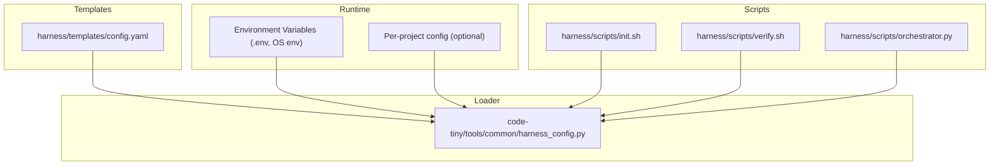
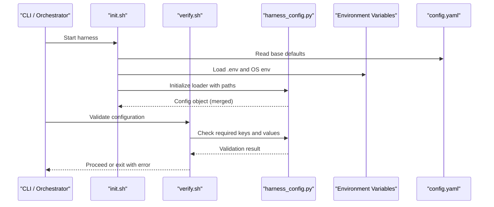
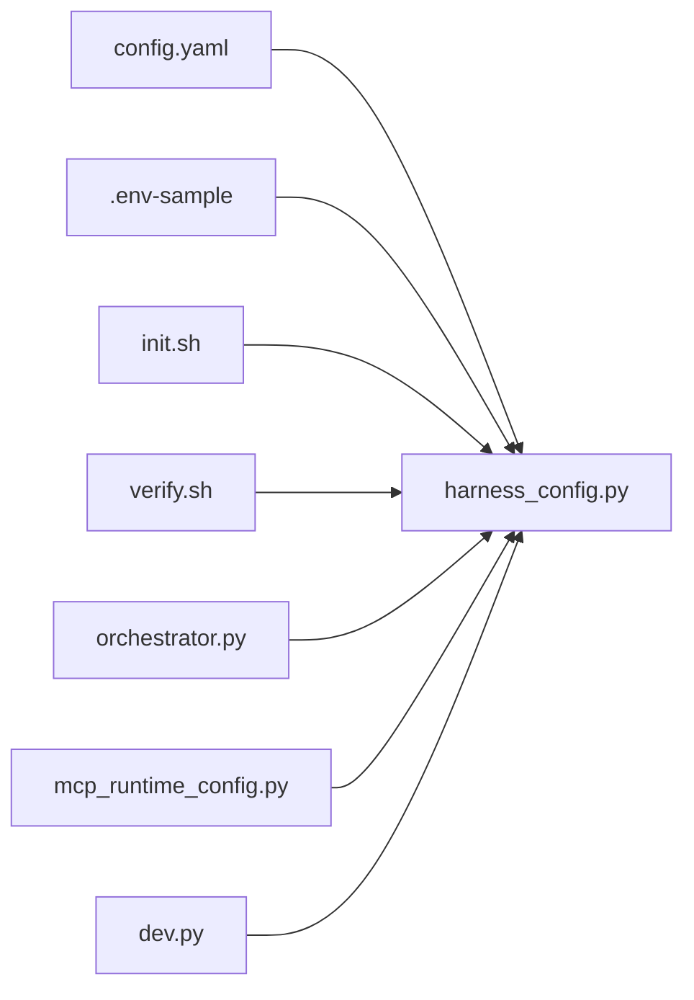

# Environment & Configuration Files

<cite>
**Referenced Files in This Document**
- [config.yaml](file://harness/templates/config.yaml)
- [harness_config.py](file://code-tiny/tools/common/harness_config.py)
- [.env-sample](file://doc-tiny/.env-sample)
- [enviroment_loader.py](file://doc-tiny/enviroment_loader.py)
- [mcp_runtime_config.py](file://scripts/mcp_runtime_config.py)
- [init.sh](file://harness/scripts/init.sh)
- [verify.sh](file://harness/scripts/verify.sh)
- [orchestrator.py](file://harness/scripts/orchestrator.py)
- [dev.py](file://cortex_harness/dev.py)
- [Makefile](file://Makefile)
</cite>

## Table of Contents
1. [Introduction](#introduction)
2. [Project Structure](#project-structure)
3. [Core Components](#core-components)
4. [Architecture Overview](#architecture-overview)
5. [Detailed Component Analysis](#detailed-component-analysis)
6. [Dependency Analysis](#dependency-analysis)
7. [Performance Considerations](#performance-considerations)
8. [Troubleshooting Guide](#troubleshooting-guide)
9. [Conclusion](#conclusion)
10. [Appendices](#appendices)

## Introduction
This document explains how Cortex Harness manages environment configuration and file structure. It covers the harness config.yaml format, available options and defaults, environment variable usage for sensitive settings and runtime parameters, project-specific configuration files, analyzer and framework detection options, configuration inheritance and override mechanisms, validation rules, and common patterns for development, testing, and production environments. Security best practices and secret management strategies are also included.

## Project Structure
Cortex Harness centralizes configuration in a template-based approach:
- A default harness configuration is provided as a YAML template.
- Runtime environment variables supply secrets and overrides.
- Scripts initialize and verify configuration at startup.
- Optional per-project configuration can be layered on top of defaults.

**Diagram sources**
- [config.yaml](file://harness/templates/config.yaml)
- [harness_config.py](file://code-tiny/tools/common/harness_config.py)
- [init.sh](file://harness/scripts/init.sh)
- [verify.sh](file://harness/scripts/verify.sh)
- [orchestrator.py](file://harness/scripts/orchestrator.py)

**Section sources**
- [config.yaml](file://harness/templates/config.yaml)
- [harness_config.py](file://code-tiny/tools/common/harness_config.py)
- [init.sh](file://harness/scripts/init.sh)
- [verify.sh](file://harness/scripts/verify.sh)
- [orchestrator.py](file://harness/scripts/orchestrator.py)

## Core Components
- Default harness configuration template: defines all available keys, types, and defaults.
- Configuration loader: merges defaults, environment variables, and optional per-project overrides; validates required fields.
- Initialization and verification scripts: bootstrap configuration and validate readiness before running analyzers or MCP services.
- Example environment sample: demonstrates supported environment variables for secrets and runtime toggles.

Key responsibilities:
- Provide a single source of truth for configuration schema and defaults.
- Support secure injection of secrets via environment variables.
- Allow per-project customization without duplicating global defaults.
- Validate configuration early to fail fast with actionable errors.

**Section sources**
- [config.yaml](file://harness/templates/config.yaml)
- [harness_config.py](file://code-tiny/tools/common/harness_config.py)
- [.env-sample](file://doc-tiny/.env-sample)
- [init.sh](file://harness/scripts/init.sh)
- [verify.sh](file://harness/scripts/verify.sh)

## Architecture Overview
The configuration system follows a layered merge strategy:
- Base layer: defaults from the harness config.yaml template.
- Overlay layer: per-project configuration files if present.
- Secret/runtime layer: environment variables that override specific keys.
- Validation: enforced by the loader prior to use.

**Diagram sources**
- [init.sh](file://harness/scripts/init.sh)
- [verify.sh](file://harness/scripts/verify.sh)
- [harness_config.py](file://code-tiny/tools/common/harness_config.py)
- [config.yaml](file://harness/templates/config.yaml)

## Detailed Component Analysis

### Harness Configuration File (config.yaml)
Purpose:
- Defines the canonical schema for harness configuration.
- Provides default values for all options.
- Documents expected data types and constraints.

Typical sections include:
- Global settings (paths, logging, concurrency).
- Graph store connection details (driver, host, port, credentials).
- Analyzer profiles (enabled analyzers, thresholds, timeouts).
- Framework detection options (rules, exclusions).
- MCP runtime parameters (ports, transport, rate limits).
- Secrets placeholders (API keys, tokens) intended to be overridden via environment variables.

Notes:
- Do not commit secrets into config.yaml; use environment variables instead.
- Per-project overrides should only contain differences from the template.

**Section sources**
- [config.yaml](file://harness/templates/config.yaml)

### Configuration Loader (harness_config.py)
Responsibilities:
- Load defaults from the template.
- Merge per-project configuration if present.
- Apply environment variable overrides for sensitive and runtime keys.
- Validate presence and types of required fields.
- Expose a typed configuration object to other components.

Merge order (lowest to highest precedence):
1. Defaults from config.yaml.
2. Per-project configuration overlay.
3. Environment variables.

Validation behavior:
- Fails fast when required keys are missing or invalid.
- Provides clear error messages indicating which key failed validation.

Security considerations:
- Secrets must be supplied via environment variables.
- Avoid logging sensitive values.

**Section sources**
- [harness_config.py](file://code-tiny/tools/common/harness_config.py)

### Environment Variables and Secrets
Supported categories:
- API keys and tokens for external services.
- Graph store credentials (host, port, username, password).
- Runtime toggles (debug flags, log levels, feature flags).
- Paths and directories (workspace root, output directories).

Best practices:
- Use a dedicated .env file for local development; do not commit it.
- In CI/CD, inject secrets through platform secret managers.
- Mask secrets in logs and avoid printing them.

Example reference:
- See the example environment file for a list of supported variables and naming conventions.

**Section sources**
- [.env-sample](file://doc-tiny/.env-sample)
- [enviroment_loader.py](file://doc-tiny/enviroment_loader.py)

### Initialization and Verification Scripts
Initialization (init.sh):
- Ensures required directories exist.
- Loads environment variables.
- Initializes the configuration loader.
- Prepares workspace state for analysis.

Verification (verify.sh):
- Validates configuration completeness.
- Checks connectivity to graph store and external services.
- Exits with non-zero status and actionable diagnostics on failure.

Orchestration (orchestrator.py):
- Consumes validated configuration.
- Drives analyzer pipelines and MCP services based on configuration.

**Section sources**
- [init.sh](file://harness/scripts/init.sh)
- [verify.sh](file://harness/scripts/verify.sh)
- [orchestrator.py](file://harness/scripts/orchestrator.py)

### MCP Runtime Configuration
MCP runtime parameters are typically configured via:
- The harness configuration file (non-sensitive parts).
- Environment variables (sensitive parts like tokens).
- Optional per-project overrides.

A helper module may provide convenience accessors for common runtime settings.

**Section sources**
- [mcp_runtime_config.py](file://scripts/mcp_runtime_config.py)

### Development Entry Point
The development entry point integrates configuration loading and provides convenient commands for local runs. It reads configuration from the merged layers and exposes CLI options where appropriate.

**Section sources**
- [dev.py](file://cortex_harness/dev.py)

## Dependency Analysis
Configuration dependencies across components:

**Diagram sources**
- [config.yaml](file://harness/templates/config.yaml)
- [harness_config.py](file://code-tiny/tools/common/harness_config.py)
- [.env-sample](file://doc-tiny/.env-sample)
- [init.sh](file://harness/scripts/init.sh)
- [verify.sh](file://harness/scripts/verify.sh)
- [orchestrator.py](file://harness/scripts/orchestrator.py)
- [mcp_runtime_config.py](file://scripts/mcp_runtime_config.py)
- [dev.py](file://cortex_harness/dev.py)

**Section sources**
- [config.yaml](file://harness/templates/config.yaml)
- [harness_config.py](file://code-tiny/tools/common/harness_config.py)
- [.env-sample](file://doc-tiny/.env-sample)
- [init.sh](file://harness/scripts/init.sh)
- [verify.sh](file://harness/scripts/verify.sh)
- [orchestrator.py](file://harness/scripts/orchestrator.py)
- [mcp_runtime_config.py](file://scripts/mcp_runtime_config.py)
- [dev.py](file://cortex_harness/dev.py)

## Performance Considerations
- Keep per-project overrides minimal to reduce merge overhead.
- Avoid excessive logging of large configuration objects.
- Cache resolved configuration during long-running processes to prevent repeated I/O.
- Tune concurrency and timeout settings in configuration for your workload.

[No sources needed since this section provides general guidance]

## Troubleshooting Guide
Common issues and resolutions:
- Missing required configuration keys: ensure defaults are present and environment variables are set.
- Invalid types or formats: check environment variable values against expected types.
- Connectivity failures: verify graph store endpoints and credentials.
- Permission errors: confirm workspace and output directories exist and are writable.

Useful checks:
- Run the verification script to surface configuration problems early.
- Inspect initialization logs for warnings about missing or deprecated keys.

**Section sources**
- [verify.sh](file://harness/scripts/verify.sh)
- [init.sh](file://harness/scripts/init.sh)

## Conclusion
Cortex Harness uses a robust, layered configuration model centered around a canonical YAML template, environment-driven secrets, and optional per-project overlays. The loader enforces validation and provides a consistent configuration interface to all components. Following the security and operational recommendations in this document will help maintain safe, reliable, and maintainable configurations across environments.

[No sources needed since this section summarizes without analyzing specific files]

## Appendices

### Common Configuration Patterns
- Development:
  - Enable verbose logging and debug flags.
  - Use local graph store endpoints.
  - Set per-project overrides for quick iteration.
- Testing:
  - Isolate test workspaces and outputs.
  - Use mock or lightweight external services.
  - Disable heavy analyzers unless necessary.
- Production:
  - Restrict permissions and minimize exposed ports.
  - Use secret managers for all sensitive values.
  - Enable structured logging and metrics.

[No sources needed since this section provides general guidance]

### Configuration Inheritance and Overrides
- Order of precedence:
  1. Defaults from config.yaml.
  2. Per-project configuration overlay.
  3. Environment variables.
- Best practice:
  - Store only differences in per-project files.
  - Use environment variables for secrets and runtime toggles.

**Section sources**
- [harness_config.py](file://code-tiny/tools/common/harness_config.py)
- [config.yaml](file://harness/templates/config.yaml)

### Validation Rules Summary
- Required keys must be present after merging.
- Types must match expected schemas (strings, integers, booleans, lists).
- External service endpoints must be reachable when connectivity checks are enabled.

**Section sources**
- [harness_config.py](file://code-tiny/tools/common/harness_config.py)
- [verify.sh](file://harness/scripts/verify.sh)

### Security Best Practices
- Never commit secrets to version control.
- Prefer environment variables or secret managers over file-based secrets.
- Mask secrets in logs and error messages.
- Rotate secrets regularly and limit access scopes.

**Section sources**
- [.env-sample](file://doc-tiny/.env-sample)
- [enviroment_loader.py](file://doc-tiny/enviroment_loader.py)

### Lifecycle Integration
- Make targets and scripts orchestrate initialization, verification, and execution using the merged configuration.
- Ensure CI/CD pipelines inject secrets securely and run verification before analysis.

**Section sources**
- [Makefile](file://Makefile)
- [init.sh](file://harness/scripts/init.sh)
- [verify.sh](file://harness/scripts/verify.sh)
- [orchestrator.py](file://harness/scripts/orchestrator.py)