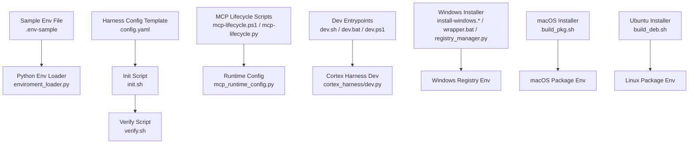
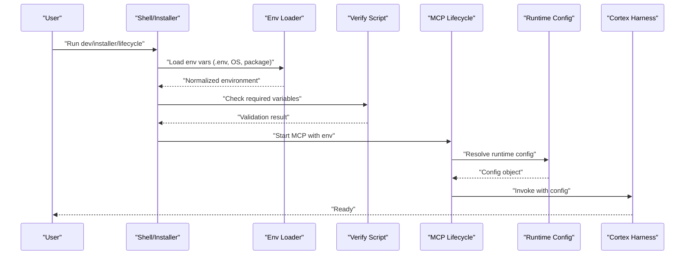
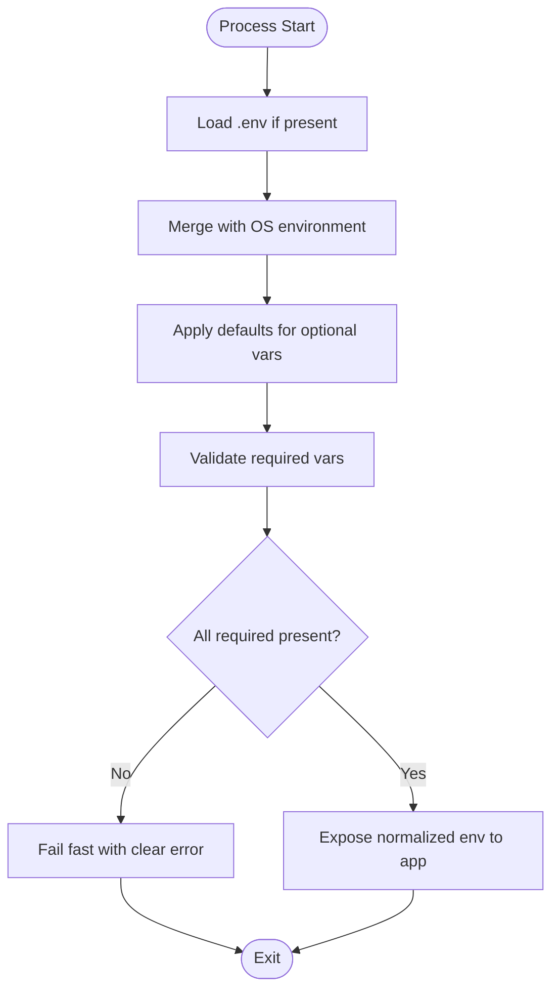
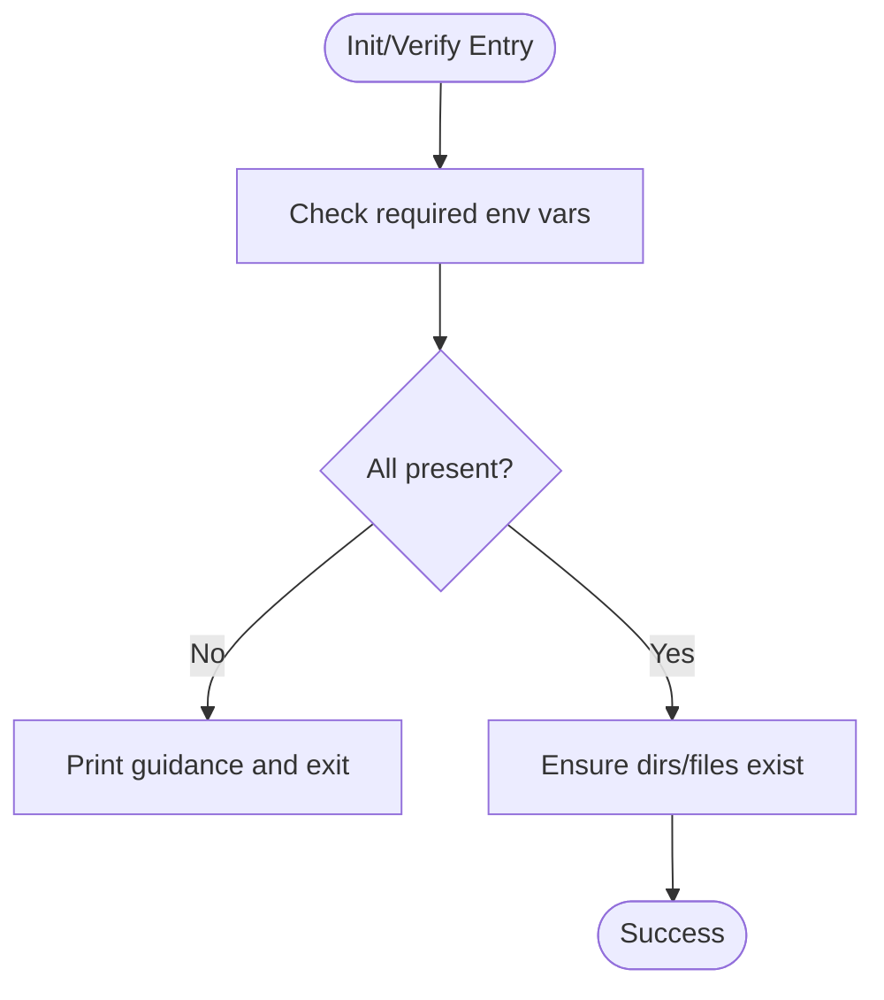
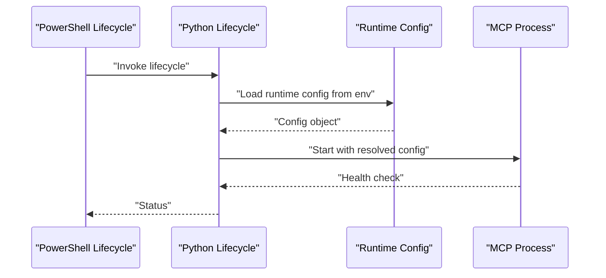
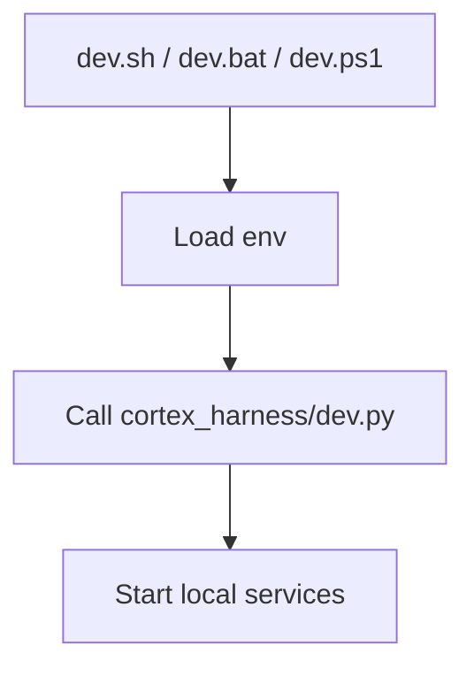
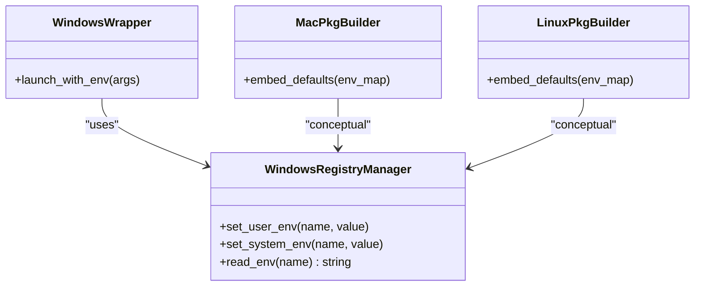
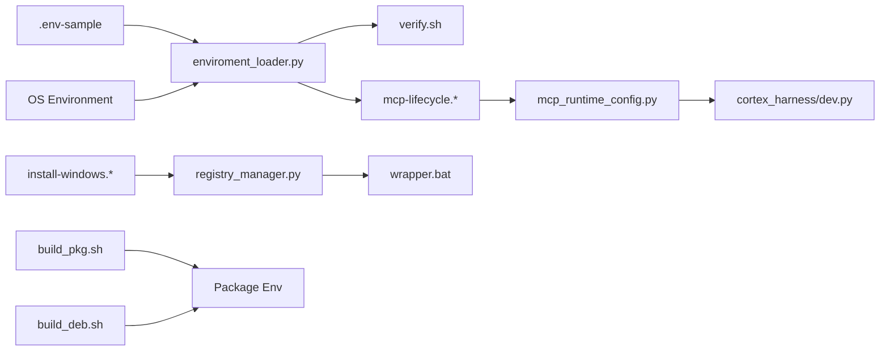

# Environment Variables & Secrets

<cite>
**Referenced Files in This Document**
- [ReadMe.md](file://ReadMe.md)
- [.env-sample](file://doc-tiny/.env-sample)
- [enviroment_loader.py](file://doc-tiny/enviroment_loader.py)
- [config.yaml](file://harness/templates/config.yaml)
- [init.sh](file://harness/scripts/init.sh)
- [verify.sh](file://harness/scripts/verify.sh)
- [mcp-lifecycle.ps1](file://scripts/mcp-lifecycle.ps1)
- [mcp-lifecycle.py](file://scripts/mcp-lifecycle.py)
- [mcp_runtime_config.py](file://scripts/mcp_runtime_config.py)
- [dev.sh](file://dev.sh)
- [dev.bat](file://dev.bat)
- [dev.ps1](file://dev.ps1)
- [install-windows.bat](file://install-windows.bat)
- [install-windows.ps1](file://install-windows.ps1)
- [wrapper.bat](file://installers/windows/scripts/wrapper.bat)
- [registry_manager.py](file://installers/windows/registry_manager.py)
- [build_pkg.sh](file://installers/macos/build_pkg.sh)
- [build_deb.sh](file://installers/ubuntu/scripts/build_deb.sh)
- [cortex_harness.dev.py](file://cortex_harness/dev.py)
</cite>

## Table of Contents
1. [Introduction](#introduction)
2. [Project Structure](#project-structure)
3. [Core Components](#core-components)
4. [Architecture Overview](#architecture-overview)
5. [Detailed Component Analysis](#detailed-component-analysis)
6. [Dependency Analysis](#dependency-analysis)
7. [Performance Considerations](#performance-considerations)
8. [Troubleshooting Guide](#troubleshooting-guide)
9. [Conclusion](#conclusion)
10. [Appendices](#appendices)

## Introduction
This document describes how Cortex Harness consumes environment variables and secrets across the codebase, including database connection strings, API keys, authentication tokens, and runtime parameters. It explains precedence rules, secure configuration patterns, platform-specific considerations for Windows, macOS, and Linux, and provides examples of setup scripts and container configuration files. The goal is to help you configure Cortex Harness securely and consistently across development, CI, and production environments.

## Project Structure
Environment-related configuration spans several areas:
- Sample environment file for reference
- Python-based environment loader used by documentation and tooling
- Harness templates and scripts that initialize or verify configuration
- Lifecycle scripts (PowerShell and Python) that orchestrate MCP runtime with environment-driven settings
- Platform installers and wrappers that set up environment on Windows/macOS/Linux
- Dev entrypoints that bootstrap local runs

**Diagram sources**
- [.env-sample](file://doc-tiny/.env-sample)
- [enviroment_loader.py](file://doc-tiny/enviroment_loader.py)
- [config.yaml](file://harness/templates/config.yaml)
- [init.sh](file://harness/scripts/init.sh)
- [verify.sh](file://harness/scripts/verify.sh)
- [mcp-lifecycle.ps1](file://scripts/mcp-lifecycle.ps1)
- [mcp-lifecycle.py](file://scripts/mcp-lifecycle.py)
- [mcp_runtime_config.py](file://scripts/mcp_runtime_config.py)
- [dev.sh](file://dev.sh)
- [dev.bat](file://dev.bat)
- [dev.ps1](file://dev.ps1)
- [cortex_harness/dev.py](file://cortex_harness/dev.py)
- [install-windows.bat](file://install-windows.bat)
- [install-windows.ps1](file://install-windows.ps1)
- [wrapper.bat](file://installers/windows/scripts/wrapper.bat)
- [registry_manager.py](file://installers/windows/registry_manager.py)
- [build_pkg.sh](file://installers/macos/build_pkg.sh)
- [build_deb.sh](file://installers/ubuntu/scripts/build_deb.sh)

**Section sources**
- [ReadMe.md](file://ReadMe.md)
- [.env-sample](file://doc-tiny/.env-sample)
- [enviroment_loader.py](file://doc-tiny/enviroment_loader.py)
- [config.yaml](file://harness/templates/config.yaml)
- [init.sh](file://harness/scripts/init.sh)
- [verify.sh](file://harness/scripts/verify.sh)
- [mcp-lifecycle.ps1](file://scripts/mcp-lifecycle.ps1)
- [mcp-lifecycle.py](file://scripts/mcp-lifecycle.py)
- [mcp_runtime_config.py](file://scripts/mcp_runtime_config.py)
- [dev.sh](file://dev.sh)
- [dev.bat](file://dev.bat)
- [dev.ps1](file://dev.ps1)
- [cortex_harness/dev.py](file://cortex_harness/dev.py)
- [install-windows.bat](file://install-windows.bat)
- [install-windows.ps1](file://install-windows.ps1)
- [wrapper.bat](file://installers/windows/scripts/wrapper.bat)
- [registry_manager.py](file://installers/windows/registry_manager.py)
- [build_pkg.sh](file://installers/macos/build_pkg.sh)
- [build_deb.sh](file://installers/ubuntu/scripts/build_deb.sh)

## Core Components
- Environment sample and loader:
  - A sample .env file documents required and optional variables.
  - A Python loader reads environment variables at runtime for tools and scripts.
- Harness initialization and verification:
  - An init script prepares harness state and validates prerequisites.
  - A verify script checks environment readiness before running tasks.
- MCP lifecycle and runtime config:
  - Lifecycle scripts start and manage MCP processes using environment-driven configuration.
  - Runtime config module centralizes runtime options sourced from environment variables.
- Dev entrypoints:
  - Shell and PowerShell entrypoints bootstrap local development with environment-aware behavior.
- Installers and wrappers:
  - Windows installer and registry manager integrate environment into system settings.
  - macOS and Ubuntu packaging scripts embed environment defaults into packages.

Key responsibilities:
- Provide a single source of truth for environment variable names and defaults.
- Ensure consistent loading order and precedence across platforms.
- Surface validation errors early during initialization.

**Section sources**
- [.env-sample](file://doc-tiny/.env-sample)
- [enviroment_loader.py](file://doc-tiny/enviroment_loader.py)
- [init.sh](file://harness/scripts/init.sh)
- [verify.sh](file://harness/scripts/verify.sh)
- [mcp-lifecycle.ps1](file://scripts/mcp-lifecycle.ps1)
- [mcp-lifecycle.py](file://scripts/mcp-lifecycle.py)
- [mcp_runtime_config.py](file://scripts/mcp_runtime_config.py)
- [dev.sh](file://dev.sh)
- [dev.bat](file://dev.bat)
- [dev.ps1](file://dev.ps1)
- [cortex_harness/dev.py](file://cortex_harness/dev.py)
- [install-windows.bat](file://install-windows.bat)
- [install-windows.ps1](file://install-windows.ps1)
- [wrapper.bat](file://installers/windows/scripts/wrapper.bat)
- [registry_manager.py](file://installers/windows/registry_manager.py)
- [build_pkg.sh](file://installers/macos/build_pkg.sh)
- [build_deb.sh](file://installers/ubuntu/scripts/build_deb.sh)

## Architecture Overview
The environment configuration architecture follows a layered approach:
- Source layer: OS environment, shell profiles, .env files, package defaults, and registry entries.
- Loader layer: Python loader and lifecycle/runtime modules read and normalize values.
- Validation layer: Init and verify scripts enforce presence and format of critical variables.
- Runtime layer: MCP lifecycle and harness components consume normalized configuration.

**Diagram sources**
- [enviroment_loader.py](file://doc-tiny/enviroment_loader.py)
- [verify.sh](file://harness/scripts/verify.sh)
- [mcp-lifecycle.ps1](file://scripts/mcp-lifecycle.ps1)
- [mcp-lifecycle.py](file://scripts/mcp-lifecycle.py)
- [mcp_runtime_config.py](file://scripts/mcp_runtime_config.py)
- [cortex_harness/dev.py](file://cortex_harness/dev.py)

## Detailed Component Analysis

### Environment Sample and Loader
- Purpose:
  - Define all supported environment variables with comments and defaults.
  - Provide a programmatic loader for Python-based components.
- Supported categories:
  - Database connection strings and provider settings
  - API keys and authentication tokens
  - Runtime parameters (logging, concurrency, paths)
- Precedence:
  - Explicit process environment overrides .env files.
  - Loader merges defaults with loaded values; missing required variables cause early failures.
- Best practices:
  - Keep .env out of version control.
  - Use secret managers in CI/CD and production.
  - Validate required variables before starting services.

**Diagram sources**
- [.env-sample](file://doc-tiny/.env-sample)
- [enviroment_loader.py](file://doc-tiny/enviroment_loader.py)

**Section sources**
- [.env-sample](file://doc-tiny/.env-sample)
- [enviroment_loader.py](file://doc-tiny/enviroment_loader.py)

### Harness Initialization and Verification
- Purpose:
  - Prepare harness state and validate environment readiness.
- Key behaviors:
  - Check presence of required variables.
  - Create necessary directories and files if missing.
  - Exit with actionable messages when misconfigured.
- Integration:
  - Called by dev scripts and lifecycle runners.

**Diagram sources**
- [init.sh](file://harness/scripts/init.sh)
- [verify.sh](file://harness/scripts/verify.sh)

**Section sources**
- [init.sh](file://harness/scripts/init.sh)
- [verify.sh](file://harness/scripts/verify.sh)

### MCP Lifecycle and Runtime Configuration
- Purpose:
  - Orchestrate MCP processes using environment-driven configuration.
- Flow:
  - Lifecycle scripts load environment and invoke runtime config.
  - Runtime config resolves final settings consumed by MCP and harness.
- Security:
  - Avoid logging sensitive values.
  - Pass secrets via environment only, never via command-line arguments.

**Diagram sources**
- [mcp-lifecycle.ps1](file://scripts/mcp-lifecycle.ps1)
- [mcp-lifecycle.py](file://scripts/mcp-lifecycle.py)
- [mcp_runtime_config.py](file://scripts/mcp_runtime_config.py)

**Section sources**
- [mcp-lifecycle.ps1](file://scripts/mcp-lifecycle.ps1)
- [mcp-lifecycle.py](file://scripts/mcp-lifecycle.py)
- [mcp_runtime_config.py](file://scripts/mcp_runtime_config.py)

### Development Entrypoints
- Purpose:
  - Provide cross-platform ways to start Cortex Harness locally.
- Behavior:
  - Load environment from .env and OS.
  - Invoke core dev module with appropriate flags.
- Recommendations:
  - Use per-project .env files.
  - Pin versions and ensure consistent environment across developers.

**Diagram sources**
- [dev.sh](file://dev.sh)
- [dev.bat](file://dev.bat)
- [dev.ps1](file://dev.ps1)
- [cortex_harness/dev.py](file://cortex_harness/dev.py)

**Section sources**
- [dev.sh](file://dev.sh)
- [dev.bat](file://dev.bat)
- [dev.ps1](file://dev.ps1)
- [cortex_harness/dev.py](file://cortex_harness/dev.py)

### Installers and Wrappers (Platform-Specific)
- Windows:
  - Installer scripts and registry manager can set environment variables in the system or user scope.
  - Wrapper script ensures correct environment when launching binaries.
- macOS:
  - Packaging script embeds environment defaults into the package.
- Linux:
  - Packaging script sets environment defaults for Debian packages.

**Diagram sources**
- [registry_manager.py](file://installers/windows/registry_manager.py)
- [wrapper.bat](file://installers/windows/scripts/wrapper.bat)
- [build_pkg.sh](file://installers/macos/build_pkg.sh)
- [build_deb.sh](file://installers/ubuntu/scripts/build_deb.sh)

**Section sources**
- [install-windows.bat](file://install-windows.bat)
- [install-windows.ps1](file://install-windows.ps1)
- [wrapper.bat](file://installers/windows/scripts/wrapper.bat)
- [registry_manager.py](file://installers/windows/registry_manager.py)
- [build_pkg.sh](file://installers/macos/build_pkg.sh)
- [build_deb.sh](file://installers/ubuntu/scripts/build_deb.sh)

## Dependency Analysis
Environment configuration dependencies:
- Loader depends on filesystem access for .env and OS environment APIs.
- Lifecycle scripts depend on loader and runtime config.
- Installers may write to OS-level stores (e.g., Windows registry).
- Dev entrypoints depend on loader and harness core.

**Diagram sources**
- [.env-sample](file://doc-tiny/.env-sample)
- [enviroment_loader.py](file://doc-tiny/enviroment_loader.py)
- [verify.sh](file://harness/scripts/verify.sh)
- [mcp-lifecycle.ps1](file://scripts/mcp-lifecycle.ps1)
- [mcp-lifecycle.py](file://scripts/mcp-lifecycle.py)
- [mcp_runtime_config.py](file://scripts/mcp_runtime_config.py)
- [cortex_harness/dev.py](file://cortex_harness/dev.py)
- [install-windows.bat](file://install-windows.bat)
- [install-windows.ps1](file://install-windows.ps1)
- [registry_manager.py](file://installers/windows/registry_manager.py)
- [wrapper.bat](file://installers/windows/scripts/wrapper.bat)
- [build_pkg.sh](file://installers/macos/build_pkg.sh)
- [build_deb.sh](file://installers/ubuntu/scripts/build_deb.sh)

**Section sources**
- [enviroment_loader.py](file://doc-tiny/enviroment_loader.py)
- [mcp_runtime_config.py](file://scripts/mcp_runtime_config.py)
- [registry_manager.py](file://installers/windows/registry_manager.py)

## Performance Considerations
- Minimize environment lookups:
  - Load once at startup and reuse the normalized configuration object.
- Avoid heavy operations in init/verify:
  - Keep checks lightweight; defer expensive validations to later stages.
- Cache derived values:
  - For example, parse connection strings once and cache parsed results.
- Reduce logging of large payloads:
  - Especially avoid logging secrets or long connection strings.

[No sources needed since this section provides general guidance]

## Troubleshooting Guide
Common issues and resolutions:
- Missing required variables:
  - Verify presence using the verify script; fix based on provided guidance.
- Incorrect formats:
  - Ensure connection strings follow expected patterns; consult the sample file for examples.
- Permission errors:
  - On Windows, confirm registry writes are allowed; on Unix-like systems, ensure file permissions for .env and generated artifacts.
- Conflicting values:
  - Confirm precedence: explicit process environment overrides .env and package defaults.

Operational tips:
- Use separate .env files per environment (development, staging, production).
- In CI/CD, inject secrets via secret managers and map them to environment variables at runtime.
- Validate environment early in pipelines to fail fast.

**Section sources**
- [verify.sh](file://harness/scripts/verify.sh)
- [.env-sample](file://doc-tiny/.env-sample)

## Conclusion
Cortex Harness relies on a layered environment configuration strategy that emphasizes clarity, validation, and security. By following the documented precedence rules, adopting secret management best practices, and leveraging platform-specific installers and wrappers, you can maintain consistent and secure configurations across Windows, macOS, and Linux. Use the provided scripts and templates as a foundation, and adapt them to your organization’s policies and infrastructure.

[No sources needed since this section summarizes without analyzing specific files]

## Appendices

### Environment Variable Categories and Examples
- Database connection strings:
  - Provider-specific URIs and credentials.
- API keys and authentication tokens:
  - Keys for external services and internal auth endpoints.
- Runtime parameters:
  - Logging levels, concurrency limits, and path overrides.

For concrete variable names and examples, refer to the sample environment file and loader implementation.

**Section sources**
- [.env-sample](file://doc-tiny/.env-sample)
- [enviroment_loader.py](file://doc-tiny/enviroment_loader.py)

### Secure Configuration Patterns
- Prefer secret managers (e.g., cloud vaults) over plaintext .env files in production.
- Rotate secrets regularly and audit access logs.
- Restrict file permissions for .env and generated artifacts.
- Avoid embedding secrets in images or packages; inject at runtime.

[No sources needed since this section provides general guidance]

### Platform-Specific Notes
- Windows:
  - Use registry manager to set user/system environment variables.
  - Ensure wrapper script launches with correct PATH and env.
- macOS:
  - Embed defaults in package; override via launch agents or shell profiles.
- Linux:
  - Set defaults in package; use systemd drop-ins or profile.d for service accounts.

**Section sources**
- [registry_manager.py](file://installers/windows/registry_manager.py)
- [wrapper.bat](file://installers/windows/scripts/wrapper.bat)
- [build_pkg.sh](file://installers/macos/build_pkg.sh)
- [build_deb.sh](file://installers/ubuntu/scripts/build_deb.sh)

### Example Setup References
- Local development:
  - Use dev entrypoints to load .env and start services.
- CI/CD:
  - Inject secrets via pipeline secret stores; run verify before deployment.
- Containers:
  - Mount .env or pass secrets via orchestrator secret mounts; ensure runtime config reads from environment.

**Section sources**
- [dev.sh](file://dev.sh)
- [dev.bat](file://dev.bat)
- [dev.ps1](file://dev.ps1)
- [mcp-lifecycle.ps1](file://scripts/mcp-lifecycle.ps1)
- [mcp-lifecycle.py](file://scripts/mcp-lifecycle.py)