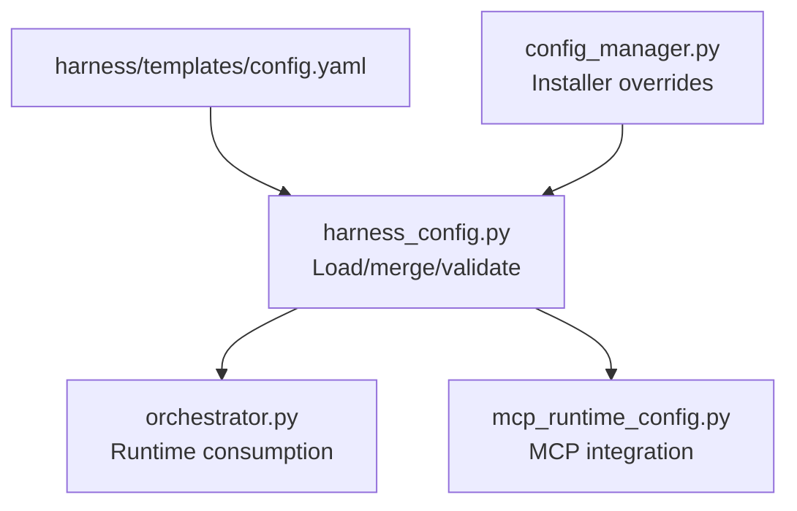
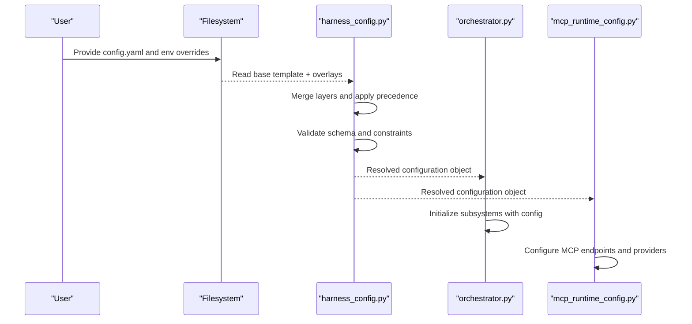
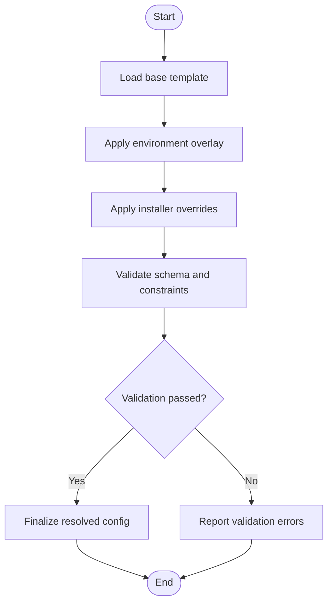
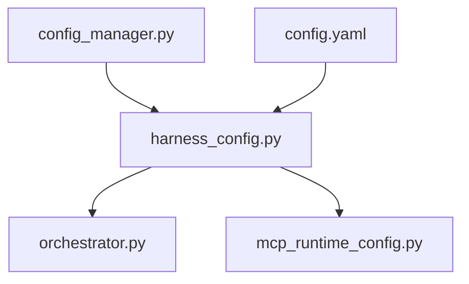

# Harness Configuration (config.yaml)

<cite>
**Referenced Files in This Document**
- [harness/templates/config.yaml](file://harness/templates/config.yaml)
- [code-tiny/tools/common/harness_config.py](file://code-tiny/tools/common/harness_config.py)
- [installers/common/config_manager.py](file://installers/common/config_manager.py)
- [harness/scripts/orchestrator.py](file://harness/scripts/orchestrator.py)
- [scripts/mcp_runtime_config.py](file://scripts/mcp_runtime_config.py)
</cite>

## Table of Contents
1. [Introduction](#introduction)
2. [Project Structure](#project-structure)
3. [Core Components](#core-components)
4. [Architecture Overview](#architecture-overview)
5. [Detailed Component Analysis](#detailed-component-analysis)
6. [Dependency Analysis](#dependency-analysis)
7. [Performance Considerations](#performance-considerations)
8. [Troubleshooting Guide](#troubleshooting-guide)
9. [Conclusion](#conclusion)
10. [Appendices](#appendices)

## Introduction
This document explains the harness configuration file structure and options for config.yaml used by the harness system. It covers database connections, analyzer settings, framework detection rules, performance tuning parameters, inheritance patterns, environment-specific overrides, validation rules, precedence, template usage, and dynamic loading mechanisms. The goal is to help you configure development, testing, and production environments effectively and reliably.

## Project Structure
The harness configuration is defined as a YAML template and loaded at runtime by the harness orchestration layer. Key locations:
- Template definition: harness/templates/config.yaml
- Runtime loader and merging logic: code-tiny/tools/common/harness_config.py
- Installer-level configuration management: installers/common/config_manager.py
- Orchestration entry points that consume configuration: harness/scripts/orchestrator.py
- MCP runtime configuration integration: scripts/mcp_runtime_config.py

**Diagram sources**
- [harness/templates/config.yaml](file://harness/templates/config.yaml)
- [code-tiny/tools/common/harness_config.py](file://code-tiny/tools/common/harness_config.py)
- [harness/scripts/orchestrator.py](file://harness/scripts/orchestrator.py)
- [installers/common/config_manager.py](file://installers/common/config_manager.py)
- [scripts/mcp_runtime_config.py](file://scripts/mcp_runtime_config.py)

**Section sources**
- [harness/templates/config.yaml](file://harness/templates/config.yaml)
- [code-tiny/tools/common/harness_config.py](file://code-tiny/tools/common/harness_config.py)
- [installers/common/config_manager.py](file://installers/common/config_manager.py)
- [harness/scripts/orchestrator.py](file://harness/scripts/orchestrator.py)
- [scripts/mcp_runtime_config.py](file://scripts/mcp_runtime_config.py)

## Core Components
The harness configuration is organized into logical sections:
- Database connections: connection strings, pools, timeouts, and provider-specific options
- Analyzer settings: enabled analyzers, thresholds, caching, and output formats
- Framework detection rules: language/framework signatures, priority, and exclusions
- Performance tuning: concurrency limits, memory caps, batch sizes, and cache policies
- Environment overrides: per-environment values and inheritance from base templates
- Validation rules: required fields, allowed values, and constraints

These components are merged and validated at startup before any analysis or graph operations begin.

**Section sources**
- [harness/templates/config.yaml](file://harness/templates/config.yaml)
- [code-tiny/tools/common/harness_config.py](file://code-tiny/tools/common/harness_config.py)

## Architecture Overview
Configuration flows through a layered pipeline:
- Base template provides defaults
- Environment-specific overlays override selected keys
- Installer-managed secrets and paths are injected
- Loader validates and normalizes values
- Consumers (orchestrator, MCP runtime) read the final resolved configuration

**Diagram sources**
- [harness/templates/config.yaml](file://harness/templates/config.yaml)
- [code-tiny/tools/common/harness_config.py](file://code-tiny/tools/common/harness_config.py)
- [harness/scripts/orchestrator.py](file://harness/scripts/orchestrator.py)
- [scripts/mcp_runtime_config.py](file://scripts/mcp_runtime_config.py)

## Detailed Component Analysis

### Configuration Sections and Options
- Database connections
  - Provider selection (e.g., Neo4j, FalkorDB)
  - Connection string or host/port/user/password fields
  - Pool size, max retries, timeout, SSL flags
  - Graph store options (indexes, collections, namespaces)
- Analyzer settings
  - Enabled analyzers list
  - Language-specific thresholds and filters
  - Cache enablement and TTL
  - Output format and verbosity
- Framework detection rules
  - Signatures for frameworks (Spring, ASP.NET, Struts, Servlet/JSP, Flutter, etc.)
  - Priority ordering and exclusion lists
  - Path-based overrides and include/exclude patterns
- Performance tuning
  - Concurrency limits for scanning and parsing
  - Memory caps and GC hints
  - Batch sizes for ingestion and vector sync
  - Cache policies and eviction strategies
- Environment overrides
  - Per-environment blocks (development, testing, production)
  - Secret injection via environment variables
  - Feature flags and toggles
- Validation rules
  - Required fields and types
  - Allowed enumerations and ranges
  - Cross-field dependencies and constraints

**Section sources**
- [harness/templates/config.yaml](file://harness/templates/config.yaml)
- [code-tiny/tools/common/harness_config.py](file://code-tiny/tools/common/harness_config.py)

### Configuration Inheritance Patterns
- Base template defines default values
- Environment overlays merge on top, overriding only specified keys
- Installer-managed values take highest precedence for secrets and paths
- Merging strategy is shallow by default; nested maps require explicit override keys

**Diagram sources**
- [harness/templates/config.yaml](file://harness/templates/config.yaml)
- [code-tiny/tools/common/harness_config.py](file://code-tiny/tools/common/harness_config.py)
- [installers/common/config_manager.py](file://installers/common/config_manager.py)

**Section sources**
- [harness/templates/config.yaml](file://harness/templates/config.yaml)
- [code-tiny/tools/common/harness_config.py](file://code-tiny/tools/common/harness_config.py)
- [installers/common/config_manager.py](file://installers/common/config_manager.py)

### Environment-Specific Overrides
- Development: lower concurrency, verbose logging, local DB endpoints
- Testing: isolated DB instances, minimal analyzers, fast caches
- Production: higher concurrency, strict timeouts, secure connections, tuned caches

Environment variables can inject sensitive values such as passwords and tokens.

**Section sources**
- [harness/templates/config.yaml](file://harness/templates/config.yaml)
- [code-tiny/tools/common/harness_config.py](file://code-tiny/tools/common/harness_config.py)

### Validation Rules
- Required fields must be present and non-empty
- Enumerations restrict allowed values (e.g., provider names)
- Numeric ranges enforce sane bounds (timeouts, pool sizes)
- Cross-field checks ensure consistency (e.g., SSL requires certificate paths)

Errors are reported early during load, preventing misconfiguration from propagating.

**Section sources**
- [code-tiny/tools/common/harness_config.py](file://code-tiny/tools/common/harness_config.py)

### File Location Precedence
Precedence order (highest to lowest):
1. Installer-managed overrides (secrets, paths)
2. Environment-specific overlay files
3. Base template config.yaml
4. Built-in defaults

The loader resolves conflicts deterministically based on this order.

**Section sources**
- [installers/common/config_manager.py](file://installers/common/config_manager.py)
- [code-tiny/tools/common/harness_config.py](file://code-tiny/tools/common/harness_config.py)

### Template Usage and Dynamic Loading
- Templates allow placeholders for environment variables and computed values
- Dynamic loading supports hot-reload of certain sections without restart
- MCP runtime integrates with the same resolved configuration for endpoint setup

**Section sources**
- [harness/templates/config.yaml](file://harness/templates/config.yaml)
- [code-tiny/tools/common/harness_config.py](file://code-tiny/tools/common/harness_config.py)
- [scripts/mcp_runtime_config.py](file://scripts/mcp_runtime_config.py)

### Common Configuration Scenarios

#### Development
- Use local database endpoints
- Enable verbose logging
- Reduce concurrency to minimize resource usage
- Disable heavy analyzers unless needed

#### Testing
- Use isolated database instances
- Limit analyzers to critical ones
- Shorten cache TTLs for faster test cycles
- Enable detailed diagnostics for failures

#### Production
- Secure database connections (SSL/TLS)
- Tune pool sizes and timeouts for throughput
- Enable robust caching and indexing
- Restrict feature flags to stable sets

**Section sources**
- [harness/templates/config.yaml](file://harness/templates/config.yaml)
- [code-tiny/tools/common/harness_config.py](file://code-tiny/tools/common/harness_config.py)

## Dependency Analysis
Configuration consumers depend on the resolved configuration object produced by the loader. Changes in loader behavior or schema affect orchestrator and MCP runtime integrations.

**Diagram sources**
- [code-tiny/tools/common/harness_config.py](file://code-tiny/tools/common/harness_config.py)
- [harness/scripts/orchestrator.py](file://harness/scripts/orchestrator.py)
- [scripts/mcp_runtime_config.py](file://scripts/mcp_runtime_config.py)
- [installers/common/config_manager.py](file://installers/common/config_manager.py)
- [harness/templates/config.yaml](file://harness/templates/config.yaml)

**Section sources**
- [code-tiny/tools/common/harness_config.py](file://code-tiny/tools/common/harness_config.py)
- [harness/scripts/orchestrator.py](file://harness/scripts/orchestrator.py)
- [scripts/mcp_runtime_config.py](file://scripts/mcp_runtime_config.py)
- [installers/common/config_manager.py](file://installers/common/config_manager.py)
- [harness/templates/config.yaml](file://harness/templates/config.yaml)

## Performance Considerations
- Adjust concurrency limits based on CPU cores and I/O capacity
- Set appropriate pool sizes for database connections to avoid contention
- Tune cache TTLs and eviction policies to balance freshness and memory usage
- Monitor memory usage and adjust batch sizes for ingestion tasks
- Use profiling logs to identify bottlenecks in analyzer pipelines

[No sources needed since this section provides general guidance]

## Troubleshooting Guide
Common issues and resolutions:
- Missing required fields: Ensure all mandatory keys are present in the active overlay
- Invalid enum values: Verify provider names and analyzer identifiers match allowed sets
- Connection failures: Check host, port, credentials, and SSL flags; confirm network reachability
- High memory usage: Reduce concurrency and batch sizes; increase cache eviction aggressiveness
- Validation errors: Review error messages emitted during load and correct offending keys

When debugging, inspect the resolved configuration object and validate against schema constraints.

**Section sources**
- [code-tiny/tools/common/harness_config.py](file://code-tiny/tools/common/harness_config.py)

## Conclusion
The harness configuration system provides a flexible, layered approach to managing settings across environments. By understanding precedence, inheritance, and validation rules, you can reliably configure databases, analyzers, framework detection, and performance tuning for development, testing, and production scenarios.

[No sources needed since this section summarizes without analyzing specific files]

## Appendices

### Quick Reference Checklist
- Confirm base template completeness
- Apply environment-specific overrides
- Inject secrets via installer or environment variables
- Validate configuration before starting services
- Monitor performance metrics and adjust tuning parameters

[No sources needed since this section provides general guidance]