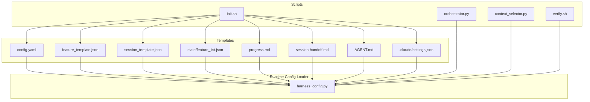
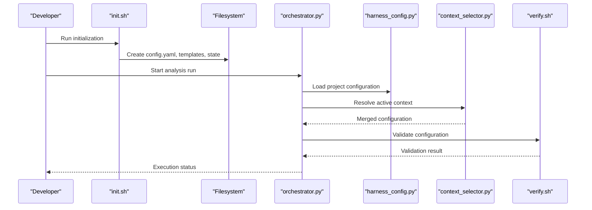
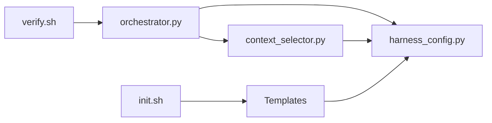

# Project-Specific Configuration

<cite>
**Referenced Files in This Document**
- [config.yaml](file://harness/templates/config.yaml)
- [feature_template.json](file://harness/templates/feature_template.json)
- [session_template.json](file://harness/templates/session_template.json)
- [state/feature_list.json](file://harness/templates/state/feature_list.json)
- [progress.md](file://harness/templates/progress.md)
- [session-handoff.md](file://harness/templates/session-handoff.md)
- [AGENT.md](file://harness/templates/AGENT.md)
- [.claude/settings.json](file://harness/templates/.claude/settings.json)
- [harness_config.py](file://code-tiny/tools/common/harness_config.py)
- [orchestrator.py](file://harness/scripts/orchestrator.py)
- [context_selector.py](file://harness/scripts/context_selector.py)
- [init.sh](file://harness/scripts/init.sh)
- [verify.sh](file://harness/scripts/verify.sh)
- [README.md](file://ReadMe.md)
- [Makefile](file://Makefile)
</cite>

## Table of Contents
1. [Introduction](#introduction)
2. [Project Structure](#project-structure)
3. [Core Components](#core-components)
4. [Architecture Overview](#architecture-overview)
5. [Detailed Component Analysis](#detailed-component-analysis)
6. [Dependency Analysis](#dependency-analysis)
7. [Performance Considerations](#performance-considerations)
8. [Troubleshooting Guide](#troubleshooting-guide)
9. [Conclusion](#conclusion)
10. [Appendices](#appendices)

## Introduction
This document explains project-specific configuration in Cortex Harness, focusing on the .cortext-harness directory structure, feature templates, session configurations, and project metadata files. It also covers how to customize analyzers per project, configure language-specific parsing options, set up framework detection rules, and manage multi-project setups with shared configurations and versioning strategies. Finally, it provides guidance for configuration migration between project versions and team collaboration workflows.

## Project Structure
Cortex Harness uses a combination of template-driven scaffolding and runtime configuration to define project behavior. The key artifacts are:
- Templates that define default project structures and configuration files
- Scripts that initialize, orchestrate, and verify harness operations
- A configuration loader used by tools and analyzers to read project settings

**Diagram sources**
- [config.yaml:1-200](file://harness/templates/config.yaml#L1-L200)
- [feature_template.json:1-200](file://harness/templates/feature_template.json#L1-L200)
- [session_template.json:1-200](file://harness/templates/session_template.json#L1-L200)
- [state/feature_list.json:1-200](file://harness/templates/state/feature_list.json#L1-L200)
- [progress.md:1-200](file://harness/templates/progress.md#L1-L200)
- [session-handoff.md:1-200](file://harness/templates/session-handoff.md#L1-L200)
- [AGENT.md:1-200](file://harness/templates/AGENT.md#L1-L200)
- [.claude/settings.json:1-200](file://harness/templates/.claude/settings.json#L1-L200)
- [init.sh:1-200](file://harness/scripts/init.sh#L1-L200)
- [orchestrator.py:1-200](file://harness/scripts/orchestrator.py#L1-L200)
- [context_selector.py:1-200](file://harness/scripts/context_selector.py#L1-L200)
- [verify.sh:1-200](file://harness/scripts/verify.sh#L1-L200)
- [harness_config.py:1-200](file://code-tiny/tools/common/harness_config.py#L1-L200)

**Section sources**
- [config.yaml:1-200](file://harness/templates/config.yaml#L1-L200)
- [feature_template.json:1-200](file://harness/templates/feature_template.json#L1-L200)
- [session_template.json:1-200](file://harness/templates/session_template.json#L1-L200)
- [state/feature_list.json:1-200](file://harness/templates/state/feature_list.json#L1-L200)
- [progress.md:1-200](file://harness/templates/progress.md#L1-L200)
- [session-handoff.md:1-200](file://harness/templates/session-handoff.md#L1-L200)
- [AGENT.md:1-200](file://harness/templates/AGENT.md#L1-L200)
- [.claude/settings.json:1-200](file://harness/templates/.claude/settings.json#L1-L200)
- [init.sh:1-200](file://harness/scripts/init.sh#L1-L200)
- [orchestrator.py:1-200](file://harness/scripts/orchestrator.py#L1-L200)
- [context_selector.py:1-200](file://harness/scripts/context_selector.py#L1-L200)
- [verify.sh:1-200](file://harness/scripts/verify.sh#L1-L200)
- [harness_config.py:1-200](file://code-tiny/tools/common/harness_config.py#L1-L200)

## Core Components
- Project configuration file (YAML): Defines global harness settings, analyzer selections, language parsers, and framework detection rules.
- Feature templates (JSON): Define reusable feature definitions and their associated analysis pipelines.
- Session templates (JSON): Provide structured handoff information for sessions, including context, goals, and state references.
- State management (JSON): Tracks features and progress across runs.
- Progress tracking (Markdown): Human-readable status updates for features and tasks.
- Agent instructions (Markdown): Guidance for AI agents interacting with the harness.
- Claude settings (JSON): IDE-level integration settings for agent workflows.
- Initialization script (Shell): Bootstraps project structure from templates and writes defaults.
- Orchestrator (Python): Loads configuration, resolves contexts, and coordinates analysis runs.
- Context selector (Python): Chooses appropriate configuration scope for multi-project setups.
- Verification script (Shell): Validates configuration integrity and environment readiness.
- Configuration loader (Python): Centralized access to project configuration values.

**Section sources**
- [config.yaml:1-200](file://harness/templates/config.yaml#L1-L200)
- [feature_template.json:1-200](file://harness/templates/feature_template.json#L1-L200)
- [session_template.json:1-200](file://harness/templates/session_template.json#L1-L200)
- [state/feature_list.json:1-200](file://harness/templates/state/feature_list.json#L1-L200)
- [progress.md:1-200](file://harness/templates/progress.md#L1-L200)
- [session-handoff.md:1-200](file://harness/templates/session-handoff.md#L1-L200)
- [AGENT.md:1-200](file://harness/templates/AGENT.md#L1-L200)
- [.claude/settings.json:1-200](file://harness/templates/.claude/settings.json#L1-L200)
- [init.sh:1-200](file://harness/scripts/init.sh#L1-L200)
- [orchestrator.py:1-200](file://harness/scripts/orchestrator.py#L1-L200)
- [context_selector.py:1-200](file://harness/scripts/context_selector.py#L1-L200)
- [verify.sh:1-200](file://harness/scripts/verify.sh#L1-L200)
- [harness_config.py:1-200](file://code-tiny/tools/common/harness_config.py#L1-L200)

## Architecture Overview
The configuration architecture is template-driven and script-coordinated. Initialization creates project files from templates; the orchestrator loads and merges configuration; the context selector scopes configuration for multi-project environments; verification ensures correctness.

**Diagram sources**
- [init.sh:1-200](file://harness/scripts/init.sh#L1-L200)
- [orchestrator.py:1-200](file://harness/scripts/orchestrator.py#L1-L200)
- [harness_config.py:1-200](file://code-tiny/tools/common/harness_config.py#L1-L200)
- [context_selector.py:1-200](file://harness/scripts/context_selector.py#L1-L200)
- [verify.sh:1-200](file://harness/scripts/verify.sh#L1-L200)

## Detailed Component Analysis

### Project Configuration File (config.yaml)
Role:
- Global harness settings
- Analyzer selection and ordering
- Language-specific parser options
- Framework detection rules
- Scope and include/exclude patterns

Customization:
- Add or remove analyzers per project
- Override language parser flags
- Define framework detectors and precedence
- Configure graph providers and storage backends

Best practices:
- Keep common settings at the top level
- Use environment-specific overrides via context scoping
- Version control config.yaml alongside code

**Section sources**
- [config.yaml:1-200](file://harness/templates/config.yaml#L1-L200)

### Feature Templates (feature_template.json)
Role:
- Define reusable feature units
- Associate analysis pipelines with features
- Specify inputs, outputs, and dependencies

Customization:
- Extend templates for domain-specific features
- Bind custom analyzers to feature steps
- Parameterize pipeline stages

Collaboration:
- Share templates across projects
- Maintain backward compatibility when evolving schemas

**Section sources**
- [feature_template.json:1-200](file://harness/templates/feature_template.json#L1-L200)

### Session Templates (session_template.json)
Role:
- Provide structured handoff data for sessions
- Include context, goals, and state references
- Support continuity across tool invocations

Customization:
- Add fields for project-specific context
- Reference external artifacts and datasets
- Embed version tags for reproducibility

**Section sources**
- [session_template.json:1-200](file://harness/templates/session_template.json#L1-L200)

### State Management (state/feature_list.json)
Role:
- Track features discovered and processed
- Persist incremental sync state
- Record outcomes and timestamps

Customization:
- Extend schema for additional metadata
- Integrate with CI to persist state artifacts

**Section sources**
- [state/feature_list.json:1-200](file://harness/templates/state/feature_list.json#L1-L200)

### Progress Tracking (progress.md)
Role:
- Human-readable status updates
- Summarize completed and pending tasks
- Aid manual triage and reporting

Customization:
- Append entries per run
- Include links to logs and artifacts

**Section sources**
- [progress.md:1-200](file://harness/templates/progress.md#L1-L200)

### Session Handoff Notes (session-handoff.md)
Role:
- Narrative context for human reviewers
- Capture decisions and rationale
- Link to relevant configuration and state

Customization:
- Add sections for risk assessment and next steps
- Reference specific configuration keys changed

**Section sources**
- [session-handoff.md:1-200](file://harness/templates/session-handoff.md#L1-L200)

### Agent Instructions (AGENT.md)
Role:
- Guidance for AI agents interacting with the harness
- Define expected behaviors and constraints
- Outline available commands and configuration locations

Customization:
- Tailor instructions to project-specific workflows
- Update when configuration schema evolves

**Section sources**
- [AGENT.md:1-200](file://harness/templates/AGENT.md#L1-L200)

### Claude Settings (.claude/settings.json)
Role:
- IDE-level integration settings for agent workflows
- Control prompt formatting and tool usage

Customization:
- Adjust model parameters and capabilities
- Enable/disable specific integrations

**Section sources**
- [.claude/settings.json:1-200](file://harness/templates/.claude/settings.json#L1-L200)

### Initialization Script (init.sh)
Role:
- Bootstrap project structure from templates
- Write default configuration files
- Prepare state directories and placeholders

Customization:
- Add project-specific scaffolding steps
- Inject environment variables into templates

**Section sources**
- [init.sh:1-200](file://harness/scripts/init.sh#L1-L200)

### Orchestrator (orchestrator.py)
Role:
- Load and merge configuration
- Resolve active context for multi-project setups
- Coordinate analysis runs and validation

Customization:
- Extend context resolution logic
- Integrate new analyzers and frameworks

**Section sources**
- [orchestrator.py:1-200](file://harness/scripts/orchestrator.py#L1-L200)

### Context Selector (context_selector.py)
Role:
- Choose appropriate configuration scope
- Merge base and override configurations
- Handle nested project hierarchies

Customization:
- Implement custom scoping rules
- Support workspace-level shared configs

**Section sources**
- [context_selector.py:1-200](file://harness/scripts/context_selector.py#L1-L200)

### Verification Script (verify.sh)
Role:
- Validate configuration integrity
- Check environment readiness
- Report missing dependencies or misconfigurations

Customization:
- Add checks for project-specific requirements
- Integrate with CI pipelines

**Section sources**
- [verify.sh:1-200](file://harness/scripts/verify.sh#L1-L200)

### Configuration Loader (harness_config.py)
Role:
- Centralized access to project configuration values
- Provide typed getters and defaults
- Support environment variable overrides

Customization:
- Add new configuration keys and validation
- Implement caching for performance

**Section sources**
- [harness_config.py:1-200](file://code-tiny/tools/common/harness_config.py#L1-L200)

## Dependency Analysis
Configuration components interact through well-defined contracts:
- init.sh depends on templates to scaffold files
- orchestrator.py depends on harness_config.py for reading settings
- context_selector.py composes multiple configuration layers
- verify.sh validates outputs produced by other components

**Diagram sources**
- [init.sh:1-200](file://harness/scripts/init.sh#L1-L200)
- [orchestrator.py:1-200](file://harness/scripts/orchestrator.py#L1-L200)
- [context_selector.py:1-200](file://harness/scripts/context_selector.py#L1-L200)
- [verify.sh:1-200](file://harness/scripts/verify.sh#L1-L200)
- [harness_config.py:1-200](file://code-tiny/tools/common/harness_config.py#L1-L200)

**Section sources**
- [init.sh:1-200](file://harness/scripts/init.sh#L1-L200)
- [orchestrator.py:1-200](file://harness/scripts/orchestrator.py#L1-L200)
- [context_selector.py:1-200](file://harness/scripts/context_selector.py#L1-L200)
- [verify.sh:1-200](file://harness/scripts/verify.sh#L1-L200)
- [harness_config.py:1-200](file://code-tiny/tools/common/harness_config.py#L1-L200)

## Performance Considerations
- Cache configuration reads to avoid repeated I/O
- Prefer minimal YAML/JSON payloads for faster parsing
- Use incremental state to reduce reprocessing
- Avoid heavy validation during hot paths; defer to pre-run checks

[No sources needed since this section provides general guidance]

## Troubleshooting Guide
Common issues and resolutions:
- Missing configuration keys: Ensure all required fields exist in config.yaml and templates match current schema
- Context resolution failures: Verify context selector rules and nested project hierarchy
- Environment readiness errors: Run verification script and install missing dependencies
- Template mismatch: Reinitialize project structure using the initialization script

**Section sources**
- [verify.sh:1-200](file://harness/scripts/verify.sh#L1-L200)
- [init.sh:1-200](file://harness/scripts/init.sh#L1-L200)

## Conclusion
Cortex Harness leverages a robust template-and-script architecture to manage project-specific configuration. By centralizing settings, standardizing feature and session templates, and providing clear initialization and verification flows, teams can reliably customize analyzers, configure language parsers, and enforce framework detection rules across single and multi-project environments. Adopting shared configurations, versioning strategies, and migration procedures further enhances collaboration and maintainability.

[No sources needed since this section summarizes without analyzing specific files]

## Appendices

### Multi-Project Setups and Shared Configurations
- Place shared configuration at the repository root and override per project under .cortext-harness
- Use context selector to merge base and project-specific settings
- Maintain separate feature templates per domain while sharing common ones

**Section sources**
- [context_selector.py:1-200](file://harness/scripts/context_selector.py#L1-L200)
- [config.yaml:1-200](file://harness/templates/config.yaml#L1-L200)

### Configuration Versioning Strategies
- Bump version in config.yaml when schema changes
- Keep migration notes in session-handoff.md
- Tag releases and preserve old configurations for rollback

**Section sources**
- [config.yaml:1-200](file://harness/templates/config.yaml#L1-L200)
- [session-handoff.md:1-200](file://harness/templates/session-handoff.md#L1-L200)

### Configuration Migration Between Versions
- Run verification after migration to detect breaking changes
- Update templates incrementally and validate with orchestrator
- Document migration steps in progress.md and AGENT.md

**Section sources**
- [verify.sh:1-200](file://harness/scripts/verify.sh#L1-L200)
- [progress.md:1-200](file://harness/templates/progress.md#L1-L200)
- [AGENT.md:1-200](file://harness/templates/AGENT.md#L1-L200)

### Team Collaboration Workflows
- Enforce configuration reviews via pull requests
- Standardize feature templates across teams
- Use session handoff notes to communicate changes and rationale

**Section sources**
- [session-handoff.md:1-200](file://harness/templates/session-handoff.md#L1-L200)
- [feature_template.json:1-200](file://harness/templates/feature_template.json#L1-L200)

### Customizing Analyzers Per Project
- Add analyzer entries in config.yaml with project-specific options
- Bind analyzers to feature templates for consistent execution
- Test with verification script before committing changes

**Section sources**
- [config.yaml:1-200](file://harness/templates/config.yaml#L1-L200)
- [feature_template.json:1-200](file://harness/templates/feature_template.json#L1-L200)
- [verify.sh:1-200](file://harness/scripts/verify.sh#L1-L200)

### Configuring Language-Specific Parsing Options
- Define parser flags under language sections in config.yaml
- Use environment variables for sensitive or dynamic options
- Validate parser availability with verification script

**Section sources**
- [config.yaml:1-200](file://harness/templates/config.yaml#L1-L200)
- [verify.sh:1-200](file://harness/scripts/verify.sh#L1-L200)

### Setting Up Framework Detection Rules
- Declare framework detectors in config.yaml with precedence
- Provide sample artifacts in tests/fixtures for validation
- Confirm detection with orchestrator runs

**Section sources**
- [config.yaml:1-200](file://harness/templates/config.yaml#L1-L200)
- [orchestrator.py:1-200](file://harness/scripts/orchestrator.py#L1-L200)