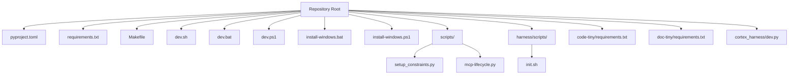
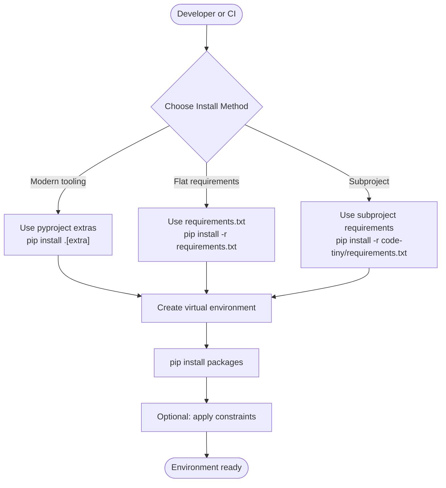
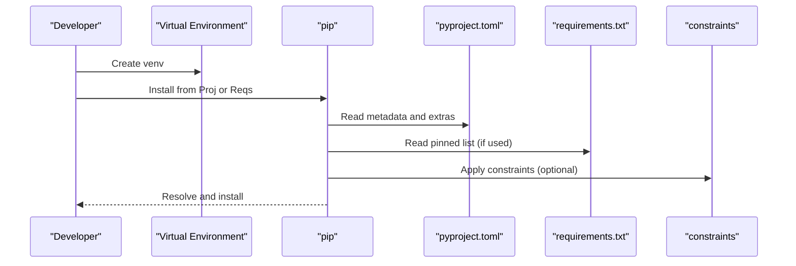

# Python Dependencies & Project Setup

<cite>
**Referenced Files in This Document**
- [pyproject.toml](file://pyproject.toml)
- [requirements.txt](file://requirements.txt)
- [Makefile](file://Makefile)
- [dev.sh](file://dev.sh)
- [dev.bat](file://dev.bat)
- [dev.ps1](file://dev.ps1)
- [install-windows.bat](file://install-windows.bat)
- [install-windows.ps1](file://install-windows.ps1)
- [code-tiny/requirements.txt](file://code-tiny/requirements.txt)
- [doc-tiny/requirements.txt](file://doc-tiny/requirements.txt)
- [scripts/setup_constraints.py](file://scripts/setup_constraints.py)
- [scripts/mcp-lifecycle.py](file://scripts/mcp-lifecycle.py)
- [harness/scripts/init.sh](file://harness/scripts/init.sh)
- [cortex_harness/dev.py](file://cortex_harness/dev.py)
</cite>

## Table of Contents
1. [Introduction](#introduction)
2. [Project Structure](#project-structure)
3. [Core Components](#core-components)
4. [Architecture Overview](#architecture-overview)
5. [Detailed Component Analysis](#detailed-component-analysis)
6. [Dependency Analysis](#dependency-analysis)
7. [Performance Considerations](#performance-considerations)
8. [Troubleshooting Guide](#troubleshooting-guide)
9. [Conclusion](#conclusion)
10. [Appendices](#appendices)

## Introduction
This document explains how Python dependencies are managed in Cortex Harness, including configuration via pyproject and requirements files, virtual environment setup, dependency resolution behavior, version constraints, compatibility across Python versions, optional feature dependencies (graph databases, vector search, language analyzers), custom builds, development workflows, platform-specific considerations, and troubleshooting common installation issues.

## Project Structure
Cortex Harness uses a hybrid approach:
- A top-level pyproject.toml for modern packaging metadata and optional dependency groups.
- A top-level requirements.txt used by CI and quick-start scripts.
- Sub-project requirements files under code-tiny and doc-tiny for isolated features.
- Shell and PowerShell helpers to bootstrap environments and run lifecycle tasks.

**Diagram sources**
- [pyproject.toml](file://pyproject.toml)
- [requirements.txt](file://requirements.txt)
- [Makefile](file://Makefile)
- [dev.sh](file://dev.sh)
- [dev.bat](file://dev.bat)
- [dev.ps1](file://dev.ps1)
- [install-windows.bat](file://install-windows.bat)
- [install-windows.ps1](file://install-windows.ps1)
- [code-tiny/requirements.txt](file://code-tiny/requirements.txt)
- [doc-tiny/requirements.txt](file://doc-tiny/requirements.txt)
- [scripts/setup_constraints.py](file://scripts/setup_constraints.py)
- [scripts/mcp-lifecycle.py](file://scripts/mcp-lifecycle.py)
- [harness/scripts/init.sh](file://harness/scripts/init.sh)
- [cortex_harness/dev.py](file://cortex_harness/dev.py)

**Section sources**
- [pyproject.toml](file://pyproject.toml)
- [requirements.txt](file://requirements.txt)
- [Makefile](file://Makefile)
- [dev.sh](file://dev.sh)
- [dev.bat](file://dev.bat)
- [dev.ps1](file://dev.ps1)
- [install-windows.bat](file://install-windows.bat)
- [install-windows.ps1](file://install-windows.ps1)
- [code-tiny/requirements.txt](file://code-tiny/requirements.txt)
- [doc-tiny/requirements.txt](file://doc-tiny/requirements.txt)
- [scripts/setup_constraints.py](file://scripts/setup_constraints.py)
- [scripts/mcp-lifecycle.py](file://scripts/mcp-lifecycle.py)
- [harness/scripts/init.sh](file://harness/scripts/init.sh)
- [cortex_harness/dev.py](file://cortex_harness/dev.py)

## Core Components
- Modern project metadata and optional extras defined in the top-level pyproject file.
- Flat requirements list for CI and quick installs at the repository root.
- Feature-scoped requirements for subprojects (code-tiny, doc-tiny).
- Lifecycle and bootstrap scripts that create and manage virtual environments and install dependencies.
- Constraint generation helper to pin transitive dependencies consistently.

Key responsibilities:
- Centralize dependency declarations and optional groups.
- Provide reproducible installs across platforms.
- Enable feature toggles for graph stores, vector backends, and language analyzers.
- Support developer workflows with minimal friction.

**Section sources**
- [pyproject.toml](file://pyproject.toml)
- [requirements.txt](file://requirements.txt)
- [code-tiny/requirements.txt](file://code-tiny/requirements.txt)
- [doc-tiny/requirements.txt](file://doc-tiny/requirements.txt)
- [scripts/setup_constraints.py](file://scripts/setup_constraints.py)
- [scripts/mcp-lifecycle.py](file://scripts/mcp-lifecycle.py)
- [harness/scripts/init.sh](file://harness/scripts/init.sh)
- [cortex_harness/dev.py](file://cortex_harness/dev.py)

## Architecture Overview
The dependency architecture is layered:
- Top-level pyproject declares core runtime and optional extras.
- requirements.txt pins versions for deterministic CI runs.
- Subproject requirements isolate feature sets.
- Bootstrap scripts orchestrate venv creation and pip installs.
- Constraint script ensures consistent transitive resolution.

[No sources needed since this diagram shows conceptual workflow, not actual code structure]

## Detailed Component Analysis

### Top-Level pyproject Configuration
Purpose:
- Define package metadata, supported Python versions, entry points, and optional dependency groups.
- Group optional features such as graph database drivers, vector search backends, and language analyzers into extras.

What to look for:
- Python version constraints and classifiers.
- Optional dependency groups (extras) for feature toggles.
- Core runtime dependencies and dev/test dependencies.

How it affects installation:
- Users can install only required features using extras to reduce footprint.
- Dependency resolver honors version specifiers and group selections.

**Section sources**
- [pyproject.toml](file://pyproject.toml)

### Top-Level requirements.txt
Purpose:
- Provide a flat, pinned list for CI and quick setups.
- Ensure deterministic builds across environments.

Behavior:
- Installed via pip with the -r flag.
- Useful when pyproject tooling is unavailable or when a simple lock-like list is preferred.

**Section sources**
- [requirements.txt](file://requirements.txt)

### Subproject Requirements (code-tiny and doc-tiny)
Purpose:
- Isolate dependencies for specific features or documentation pipelines.
- Allow selective installation without pulling in full harness dependencies.

Usage:
- Install from the subproject directory using its local requirements file.

**Section sources**
- [code-tiny/requirements.txt](file://code-tiny/requirements.txt)
- [doc-tiny/requirements.txt](file://doc-tiny/requirements.txt)

### Virtual Environment and Bootstrap Scripts
Shell and PowerShell helpers streamline environment setup:
- Create a virtual environment if missing.
- Activate it automatically.
- Install dependencies from either pyproject extras or requirements files.
- Provide convenience targets for common tasks.

Platform notes:
- Windows batch and PowerShell variants ensure parity across shells.
- Unix shell scripts handle POSIX environments.

**Section sources**
- [dev.sh](file://dev.sh)
- [dev.bat](file://dev.bat)
- [dev.ps1](file://dev.ps1)
- [install-windows.bat](file://install-windows.bat)
- [install-windows.ps1](file://install-windows.ps1)

### Lifecycle and Initialization Scripts
- Lifecycle script orchestrates MCP-related tasks and may trigger dependency checks or installs.
- Harness initialization script prepares runtime state and may validate prerequisites.

**Section sources**
- [scripts/mcp-lifecycle.py](file://scripts/mcp-lifecycle.py)
- [harness/scripts/init.sh](file://harness/scripts/init.sh)

### Constraint Generation Helper
A helper script generates or applies dependency constraints to stabilize transitive dependency resolution. This is useful when multiple components depend on overlapping libraries with conflicting version ranges.

**Section sources**
- [scripts/setup_constraints.py](file://scripts/setup_constraints.py)

### Developer Entry Point
The core developer entry point coordinates local development tasks and may integrate with dependency management routines.

**Section sources**
- [cortex_harness/dev.py](file://cortex_harness/dev.py)

## Dependency Analysis

### Dependency Resolution Strategy
- Prefer stable, compatible versions within declared constraints.
- When both pyproject and requirements exist, use one source per environment to avoid conflicts:
  - For modern workflows, rely on pyproject extras.
  - For CI or legacy flows, use requirements.txt.
- Apply constraints when necessary to resolve transitive conflicts.

**Diagram sources**
- [pyproject.toml](file://pyproject.toml)
- [requirements.txt](file://requirements.txt)
- [scripts/setup_constraints.py](file://scripts/setup_constraints.py)

### Version Constraints and Compatibility
- The top-level pyproject defines supported Python versions and dependency ranges.
- requirements.txt provides exact pins for reproducibility.
- Subproject requirements constrain feature-specific dependencies independently.

Best practices:
- Keep Python version constraints aligned with CI matrices.
- Pin critical packages in requirements.txt for CI stability.
- Use extras to limit installed surface area.

**Section sources**
- [pyproject.toml](file://pyproject.toml)
- [requirements.txt](file://requirements.txt)
- [code-tiny/requirements.txt](file://code-tiny/requirements.txt)
- [doc-tiny/requirements.txt](file://doc-tiny/requirements.txt)

### Optional Features and Extras
Typical optional categories include:
- Graph database integrations (e.g., Neo4j, FalkorDB).
- Vector search backends (e.g., Qdrant).
- Language-specific analyzers and parsers.

Installation patterns:
- Use pyproject extras to install only needed features.
- Alternatively, add feature packages directly to requirements for targeted environments.

**Section sources**
- [pyproject.toml](file://pyproject.toml)

### Platform-Specific Requirements
- Windows-specific installers and wrappers are provided.
- Cross-platform scripts abstract differences in path handling and activation.

Recommendations:
- Use the provided installers on Windows for consistent setup.
- On Unix-like systems, prefer the shell bootstrap scripts.

**Section sources**
- [install-windows.bat](file://install-windows.bat)
- [install-windows.ps1](file://install-windows.ps1)
- [dev.sh](file://dev.sh)
- [dev.bat](file://dev.bat)
- [dev.ps1](file://dev.ps1)

## Performance Considerations
- Prefer installing only required extras to minimize build time and memory usage.
- Use constraints to avoid expensive conflict resolution cycles.
- Cache wheels and reuse virtual environments where possible.
- Run dependency audits periodically to remove unused or outdated packages.

[No sources needed since this section provides general guidance]

## Troubleshooting Guide
Common issues and resolutions:
- Conflicting dependency versions:
  - Use constraints to align transitive dependencies.
  - Prefer a single source of truth (either pyproject or requirements) per environment.
- Missing optional features:
  - Verify the correct extra was selected during installation.
  - Check subproject requirements if running isolated features.
- Platform-specific failures:
  - Use the appropriate installer or wrapper for your OS.
  - Ensure system prerequisites (compilers, SDKs) are present for native extensions.
- Stale environments:
  - Recreate the virtual environment and reinstall dependencies.
  - Clear pip caches if corruption is suspected.

Operational tips:
- Validate environment readiness using lifecycle and init scripts before running tasks.
- Log pip output during installs to diagnose resolution problems.

**Section sources**
- [scripts/setup_constraints.py](file://scripts/setup_constraints.py)
- [scripts/mcp-lifecycle.py](file://scripts/mcp-lifecycle.py)
- [harness/scripts/init.sh](file://harness/scripts/init.sh)
- [install-windows.bat](file://install-windows.bat)
- [install-windows.ps1](file://install-windows.ps1)

## Conclusion
Cortex Harness combines modern packaging with practical bootstrapping to deliver flexible, reproducible Python environments. By leveraging pyproject extras, pinned requirements for CI, and constraint tools, teams can tailor installations to their needs while maintaining stability across platforms and Python versions.

[No sources needed since this section summarizes without analyzing specific files]

## Appendices

### Quick Reference: Installation Paths
- Modern extras-based install:
  - Use the top-level pyproject to select features.
- Deterministic CI install:
  - Use the top-level requirements.txt.
- Feature-scoped installs:
  - Use subproject requirements files.

[No sources needed since this section provides general guidance]