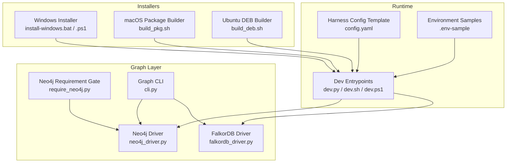
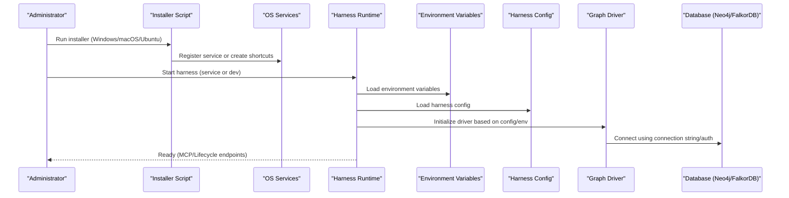
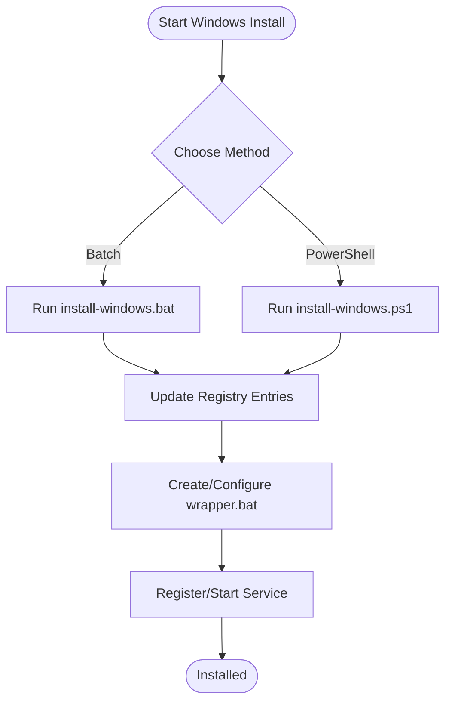
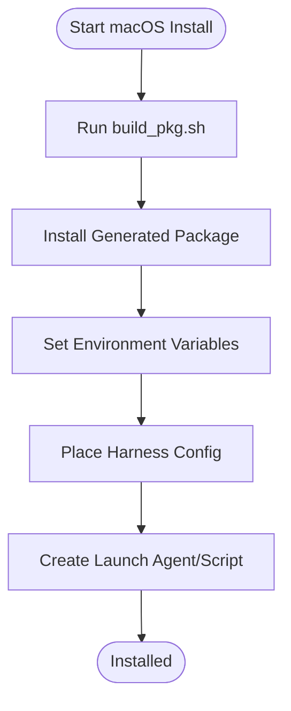
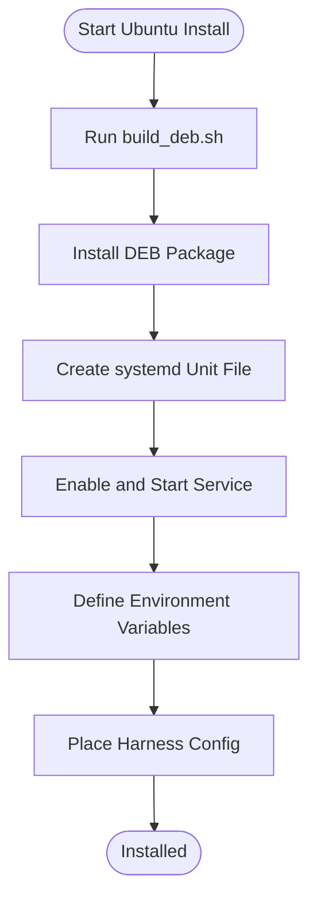
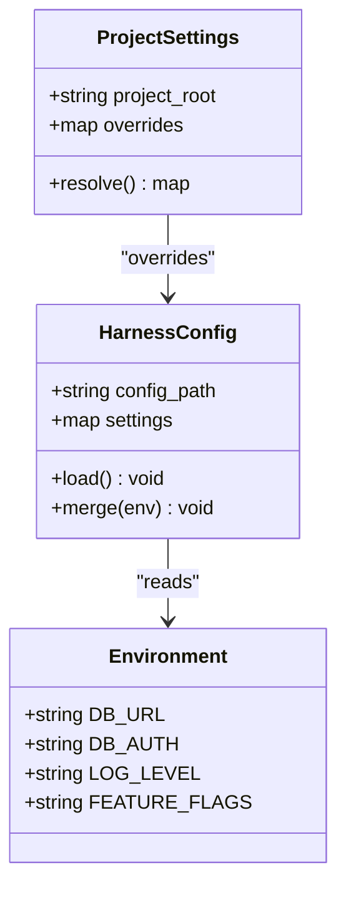
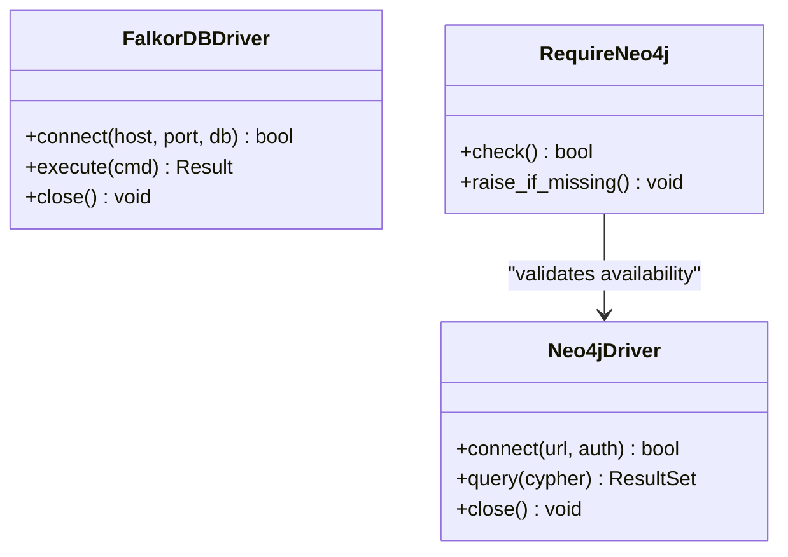
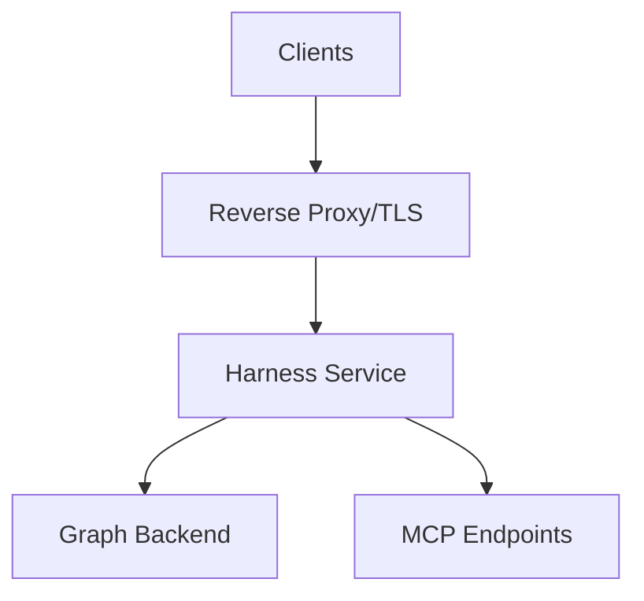
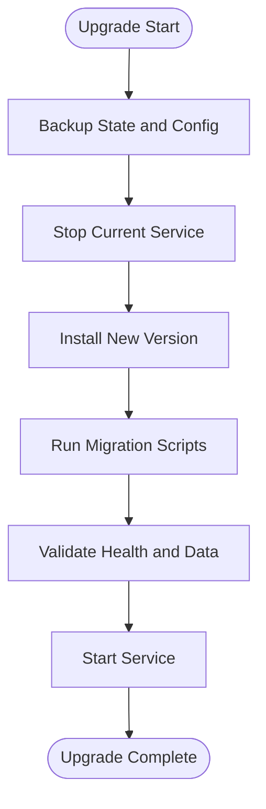
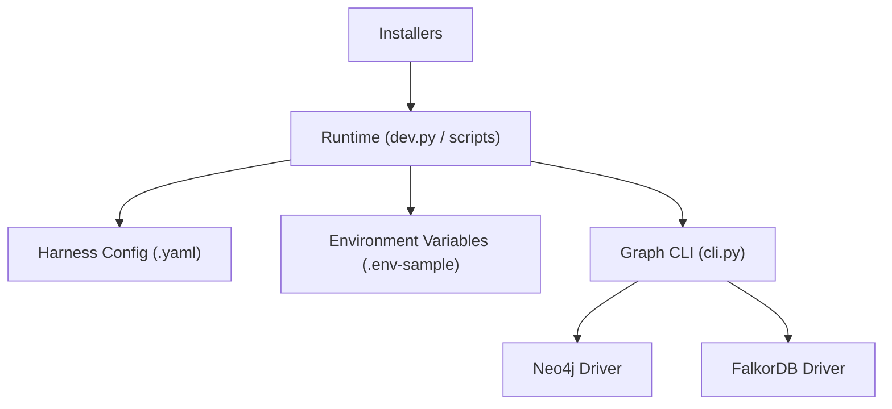

# Installation & Configuration

<cite>
**Referenced Files in This Document**
- [ReadMe.md](file://ReadMe.md)
- [INSTALLER_GUIDE.md](file://INSTALLER_GUIDE.md)
- [install-windows.bat](file://install-windows.bat)
- [install-windows.ps1](file://install-windows.ps1)
- [dev.ps1](file://dev.ps1)
- [dev.sh](file://dev.sh)
- [Makefile](file://Makefile)
- [harness/templates/config.yaml](file://harness/templates/config.yaml)
- [code-tiny/.env-sample](file://code-tiny/.env-sample)
- [doc-tiny/.env-sample](file://doc-tiny/.env-sample)
- [cortex_harness/dev.py](file://cortex_harness/dev.py)
- [scripts/mcp_runtime_config.py](file://scripts/mcp_runtime_config.py)
- [installers/windows/registry_manager.py](file://installers/windows/registry_manager.py)
- [installers/windows/scripts/wrapper.bat](file://installers/windows/scripts/wrapper.bat)
- [installers/macos/build_pkg.sh](file://installers/macos/build_pkg.sh)
- [installers/ubuntu/build_deb.sh](file://installers/ubuntu/build_deb.sh)
- [graph/driver/neo4j_driver.py](file://code-tiny/tools/graph/driver/neo4j_driver.py)
- [graph/driver/falkordb_driver.py](file://code-tiny/tools/graph/driver/falkordb_driver.py)
- [graph/core/require_neo4j.py](file://code-tiny/tools/graph/core/require_neo4j.py)
- [graph/cli.py](file://code-tiny/tools/graph/cli.py)
- [database_schema_analyzer.py](file://code-tiny/tools/database_schema/database_schema_analyzer.py)
- [mcp-lifecycle.ps1](file://scripts/mcp-lifecycle.ps1)
- [mcp-lifecycle.py](file://scripts/mcp-lifecycle.py)
- [mcp.sh](file://code-tiny/mcp.sh)
- [run_mcp.sh](file://code-tiny/run_mcp.sh)
- [6_setup_indexes.py](file://doc-tiny/6_setup_indexes.py)
- [neo4j_loader.py](file://doc-tiny/neo4j_loader.py)
</cite>

## Table of Contents
1. Introduction
2. Project Structure
3. Core Components
4. Architecture Overview
5. Detailed Component Analysis
6. Dependency Analysis
7. Performance Considerations
8. Troubleshooting Guide
9. Conclusion
10. Appendices

## Introduction
This document provides comprehensive installation and configuration guidance for Cortex Harness across Windows, macOS, and Ubuntu/Debian systems. It covers platform-specific installers, environment variables, harness configuration files, project-specific settings, database integration (Neo4j and FalkorDB), distributed networking, security considerations, monitoring setup, troubleshooting, and upgrade procedures.

## Project Structure
Cortex Harness includes cross-platform installers, templates, scripts, and runtime components:
- Installers: Windows Inno Setup and registry helpers, macOS package builder, Ubuntu DEB builder
- Templates: Default harness config and project scaffolding
- Scripts: Lifecycle management, MCP runtime configuration, and helper utilities
- Graph drivers: Neo4j and FalkorDB integrations with CLI and core requirements
- Documentation examples: Environment samples and index setup scripts

**Diagram sources**
- [install-windows.bat](file://install-windows.bat)
- [install-windows.ps1](file://install-windows.ps1)
- [installers/macos/build_pkg.sh](file://installers/macos/build_pkg.sh)
- [installers/ubuntu/build_deb.sh](file://installers/ubuntu/build_deb.sh)
- [harness/templates/config.yaml](file://harness/templates/config.yaml)
- [code-tiny/.env-sample](file://code-tiny/.env-sample)
- [doc-tiny/.env-sample](file://doc-tiny/.env-sample)
- [cortex_harness/dev.py](file://cortex_harness/dev.py)
- [dev.sh](file://dev.sh)
- [dev.ps1](file://dev.ps1)
- [code-tiny/tools/graph/driver/neo4j_driver.py](file://code-tiny/tools/graph/driver/neo4j_driver.py)
- [code-tiny/tools/graph/driver/falkordb_driver.py](file://code-tiny/tools/graph/driver/falkordb_driver.py)
- [code-tiny/tools/graph/core/require_neo4j.py](file://code-tiny/tools/graph/core/require_neo4j.py)
- [code-tiny/tools/graph/cli.py](file://code-tiny/tools/graph/cli.py)

**Section sources**
- [ReadMe.md](file://ReadMe.md)
- [INSTALLER_GUIDE.md](file://INSTALLER_GUIDE.md)
- [Makefile](file://Makefile)

## Core Components
- Platform installers and wrappers:
  - Windows: batch and PowerShell installers; registry manager and wrapper script
  - macOS: package build script
  - Ubuntu/Debian: DEB build script
- Runtime entrypoints:
  - Python dev entrypoint and shell/PowerShell helpers
  - Lifecycle scripts for MCP orchestration
- Configuration:
  - Harness config template
  - Environment variable samples
- Graph layer:
  - Neo4j and FalkorDB drivers
  - Requirement gate for Neo4j
  - CLI to interact with graph services

**Section sources**
- [install-windows.bat](file://install-windows.bat)
- [install-windows.ps1](file://install-windows.ps1)
- [installers/windows/registry_manager.py](file://installers/windows/registry_manager.py)
- [installers/windows/scripts/wrapper.bat](file://installers/windows/scripts/wrapper.bat)
- [installers/macos/build_pkg.sh](file://installers/macos/build_pkg.sh)
- [installers/ubuntu/build_deb.sh](file://installers/ubuntu/build_deb.sh)
- [cortex_harness/dev.py](file://cortex_harness/dev.py)
- [dev.sh](file://dev.sh)
- [dev.ps1](file://dev.ps1)
- [harness/templates/config.yaml](file://harness/templates/config.yaml)
- [code-tiny/.env-sample](file://code-tiny/.env-sample)
- [doc-tiny/.env-sample](file://doc-tiny/.env-sample)
- [code-tiny/tools/graph/driver/neo4j_driver.py](file://code-tiny/tools/graph/driver/neo4j_driver.py)
- [code-tiny/tools/graph/driver/falkordb_driver.py](file://code-tiny/tools/graph/driver/falkordb_driver.py)
- [code-tiny/tools/graph/core/require_neo4j.py](file://code-tiny/tools/graph/core/require_neo4j.py)
- [code-tiny/tools/graph/cli.py](file://code-tiny/tools/graph/cli.py)

## Architecture Overview
The system integrates a harness runtime with optional graph backends. The harness reads environment variables and config files, initializes the appropriate graph driver, and exposes lifecycle and MCP capabilities via scripts and CLI.

**Diagram sources**
- [install-windows.bat](file://install-windows.bat)
- [installers/macos/build_pkg.sh](file://installers/macos/build_pkg.sh)
- [installers/ubuntu/build_deb.sh](file://installers/ubuntu/build_deb.sh)
- [cortex_harness/dev.py](file://cortex_harness/dev.py)
- [harness/templates/config.yaml](file://harness/templates/config.yaml)
- [code-tiny/.env-sample](file://code-tiny/.env-sample)
- [doc-tiny/.env-sample](file://doc-tiny/.env-sample)
- [code-tiny/tools/graph/driver/neo4j_driver.py](file://code-tiny/tools/graph/driver/neo4j_driver.py)
- [code-tiny/tools/graph/driver/falkordb_driver.py](file://code-tiny/tools/graph/driver/falkordb_driver.py)

## Detailed Component Analysis

### Windows Installation and Configuration
- Installers:
  - Batch and PowerShell installers provide automated setup steps.
  - Registry manager updates Windows registry entries for paths and options.
  - Wrapper script launches harness with correct environment context.
- Service and startup:
  - Use provided scripts to register or start the harness as a Windows service or scheduled task.
- Environment and config:
  - Set environment variables via system properties or installer prompts.
  - Place harness config file in the expected location and adjust paths.

**Diagram sources**
- [install-windows.bat](file://install-windows.bat)
- [install-windows.ps1](file://install-windows.ps1)
- [installers/windows/registry_manager.py](file://installers/windows/registry_manager.py)
- [installers/windows/scripts/wrapper.bat](file://installers/windows/scripts/wrapper.bat)

**Section sources**
- [install-windows.bat](file://install-windows.bat)
- [install-windows.ps1](file://install-windows.ps1)
- [installers/windows/registry_manager.py](file://installers/windows/registry_manager.py)
- [installers/windows/scripts/wrapper.bat](file://installers/windows/scripts/wrapper.bat)

### macOS Installation and Configuration
- Package builds:
  - Build a macOS package using the provided script.
- System integration:
  - After building, install the package and configure launch agents or scripts for auto-start.
- Environment and config:
  - Export environment variables in your shell profile or use a dedicated env file loader.
  - Configure harness config file path and values.

**Diagram sources**
- [installers/macos/build_pkg.sh](file://installers/macos/build_pkg.sh)

**Section sources**
- [installers/macos/build_pkg.sh](file://installers/macos/build_pkg.sh)

### Ubuntu/Debian Installation and Configuration
- APT packages:
  - Build a DEB package using the provided script.
- systemd services:
  - Create a systemd unit to run the harness as a service.
  - Enable and start the service.
- Environment and config:
  - Define environment variables in the systemd unit or an included env file.
  - Configure harness config file path and values.

**Diagram sources**
- [installers/ubuntu/build_deb.sh](file://installers/ubuntu/build_deb.sh)

**Section sources**
- [installers/ubuntu/build_deb.sh](file://installers/ubuntu/build_deb.sh)

### Environment Variables and Harness Config
- Environment variables:
  - Refer to sample files for available keys and defaults.
  - Typical categories include database connections, authentication tokens, logging levels, and feature flags.
- Harness config file:
  - Use the provided template as a baseline.
  - Adjust paths, ports, and backend selections.
- Project-specific settings:
  - Override global config per-project by placing a local config file or setting project-scoped environment variables.

**Diagram sources**
- [code-tiny/.env-sample](file://code-tiny/.env-sample)
- [doc-tiny/.env-sample](file://doc-tiny/.env-sample)
- [harness/templates/config.yaml](file://harness/templates/config.yaml)

**Section sources**
- [code-tiny/.env-sample](file://code-tiny/.env-sample)
- [doc-tiny/.env-sample](file://doc-tiny/.env-sample)
- [harness/templates/config.yaml](file://harness/templates/config.yaml)

### Database Configuration: Neo4j and FalkorDB
- Connection strings and authentication:
  - Drivers accept connection parameters and credentials from environment variables or config.
  - Ensure network reachability and firewall rules allow inbound/outbound traffic.
- Performance tuning:
  - Adjust pool sizes, timeouts, and query limits according to workload.
  - For Neo4j, consider indexes and constraints; for FalkorDB, tune memory and replication if applicable.
- Requirement gating:
  - Some features require Neo4j; ensure prerequisites are met before enabling.

**Diagram sources**
- [code-tiny/tools/graph/driver/neo4j_driver.py](file://code-tiny/tools/graph/driver/neo4j_driver.py)
- [code-tiny/tools/graph/driver/falkordb_driver.py](file://code-tiny/tools/graph/driver/falkordb_driver.py)
- [code-tiny/tools/graph/core/require_neo4j.py](file://code-tiny/tools/graph/core/require_neo4j.py)

**Section sources**
- [code-tiny/tools/graph/driver/neo4j_driver.py](file://code-tiny/tools/graph/driver/neo4j_driver.py)
- [code-tiny/tools/graph/driver/falkordb_driver.py](file://code-tiny/tools/graph/driver/falkordb_driver.py)
- [code-tiny/tools/graph/core/require_neo4j.py](file://code-tiny/tools/graph/core/require_neo4j.py)

### Network Configuration for Distributed Deployments
- Bind addresses and ports:
  - Configure harness to listen on specific interfaces and ports.
- Reverse proxy and TLS:
  - Place a reverse proxy in front of the harness for TLS termination and routing.
- Inter-service communication:
  - Ensure MCP and lifecycle endpoints are reachable across nodes.
- Firewall and DNS:
  - Open required ports and configure hostnames consistently.

[No sources needed since this diagram shows conceptual workflow, not actual code structure]

### Security Considerations for Production
- Secrets management:
  - Store credentials in secure vaults or environment managers; avoid hardcoding.
- Least privilege:
  - Run harness under a dedicated user/service account with minimal permissions.
- Network isolation:
  - Restrict access to graph databases and internal endpoints.
- Audit and logging:
  - Enable structured logs and forward to centralized logging.

[No sources needed since this section provides general guidance]

### Monitoring Setup
- Health checks:
  - Expose health endpoints and integrate with orchestrators.
- Metrics and tracing:
  - Emit metrics for request latency, error rates, and graph operations.
- Log aggregation:
  - Ship logs to a central system for analysis and alerting.

[No sources needed since this section provides general guidance]

### Upgrade Procedures and Migration Paths
- Version upgrades:
  - Back up current state and configs.
  - Follow platform-specific upgrade steps (package manager or manual).
- Data migration:
  - Use provided migration scripts where applicable.
  - Validate schema compatibility between versions.
- Rollback plan:
  - Keep previous binaries and configs until validation completes.

[No sources needed since this diagram shows conceptual workflow, not actual code structure]

## Dependency Analysis
Key dependencies and relationships:
- Installers depend on OS-specific tools and packaging utilities.
- Runtime depends on environment variables and harness config.
- Graph layer depends on Neo4j or FalkorDB drivers and their connectivity.

**Diagram sources**
- [cortex_harness/dev.py](file://cortex_harness/dev.py)
- [harness/templates/config.yaml](file://harness/templates/config.yaml)
- [code-tiny/.env-sample](file://code-tiny/.env-sample)
- [doc-tiny/.env-sample](file://doc-tiny/.env-sample)
- [code-tiny/tools/graph/cli.py](file://code-tiny/tools/graph/cli.py)
- [code-tiny/tools/graph/driver/neo4j_driver.py](file://code-tiny/tools/graph/driver/neo4j_driver.py)
- [code-tiny/tools/graph/driver/falkordb_driver.py](file://code-tiny/tools/graph/driver/falkordb_driver.py)

**Section sources**
- [cortex_harness/dev.py](file://cortex_harness/dev.py)
- [harness/templates/config.yaml](file://harness/templates/config.yaml)
- [code-tiny/.env-sample](file://code-tiny/.env-sample)
- [doc-tiny/.env-sample](file://doc-tiny/.env-sample)
- [code-tiny/tools/graph/cli.py](file://code-tiny/tools/graph/cli.py)
- [code-tiny/tools/graph/driver/neo4j_driver.py](file://code-tiny/tools/graph/driver/neo4j_driver.py)
- [code-tiny/tools/graph/driver/falkordb_driver.py](file://code-tiny/tools/graph/driver/falkordb_driver.py)

## Performance Considerations
- Database tuning:
  - Indexes and constraints for Neo4j; memory and replication settings for FalkorDB.
- Connection pooling:
  - Tune pool sizes and timeouts to match workload.
- Resource allocation:
  - Allocate sufficient CPU and memory for harness and graph processes.
- Incremental processing:
  - Leverage incremental sync and caching mechanisms where available.

[No sources needed since this section provides general guidance]

## Troubleshooting Guide
Common issues and resolutions:
- Permission problems:
  - Ensure service accounts have read/write access to config and data directories.
- Dependency conflicts:
  - Verify Python version and package compatibility; use virtual environments.
- Network connectivity:
  - Test reachability to graph backends; check firewalls and DNS.
- Registry and service registration (Windows):
  - Re-run registry manager and wrapper configuration; validate service status.
- Package installation (macOS/Ubuntu):
  - Confirm package signatures and dependencies; inspect logs from package manager.

**Section sources**
- [installers/windows/registry_manager.py](file://installers/windows/registry_manager.py)
- [installers/windows/scripts/wrapper.bat](file://installers/windows/scripts/wrapper.bat)
- [installers/macos/build_pkg.sh](file://installers/macos/build_pkg.sh)
- [installers/ubuntu/build_deb.sh](file://installers/ubuntu/build_deb.sh)

## Conclusion
Cortex Harness supports multi-platform installation through dedicated installers and packaging scripts. Proper environment and harness configuration are essential for connecting to Neo4j or FalkorDB. Follow security best practices, monitor performance, and use the provided troubleshooting steps to maintain a stable production deployment.

## Appendices

### Quick Reference: Key Files and Roles
- Installers and packaging:
  - Windows: [install-windows.bat](file://install-windows.bat), [install-windows.ps1](file://install-windows.ps1), [registry_manager.py](file://installers/windows/registry_manager.py), [wrapper.bat](file://installers/windows/scripts/wrapper.bat)
  - macOS: [build_pkg.sh](file://installers/macos/build_pkg.sh)
  - Ubuntu/Debian: [build_deb.sh](file://installers/ubuntu/build_deb.sh)
- Runtime and lifecycle:
  - [dev.py](file://cortex_harness/dev.py), [dev.sh](file://dev.sh), [dev.ps1](file://dev.ps1)
  - [mcp-lifecycle.ps1](file://scripts/mcp-lifecycle.ps1), [mcp-lifecycle.py](file://scripts/mcp-lifecycle.py)
  - [mcp.sh](file://code-tiny/mcp.sh), [run_mcp.sh](file://code-tiny/run_mcp.sh)
- Configuration:
  - [config.yaml](file://harness/templates/config.yaml)
  - [.env-sample (code-tiny)](file://code-tiny/.env-sample)
  - [.env-sample (doc-tiny)](file://doc-tiny/.env-sample)
- Graph layer:
  - [neo4j_driver.py](file://code-tiny/tools/graph/driver/neo4j_driver.py)
  - [falkordb_driver.py](file://code-tiny/tools/graph/driver/falkordb_driver.py)
  - [require_neo4j.py](file://code-tiny/tools/graph/core/require_neo4j.py)
  - [cli.py](file://code-tiny/tools/graph/cli.py)
- Utilities and docs:
  - [INSTALLER_GUIDE.md](file://INSTALLER_GUIDE.md)
  - [ReadMe.md](file://ReadMe.md)
  - [6_setup_indexes.py](file://doc-tiny/6_setup_indexes.py)
  - [neo4j_loader.py](file://doc-tiny/neo4j_loader.py)
  - [database_schema_analyzer.py](file://code-tiny/tools/database_schema/database_schema_analyzer.py)