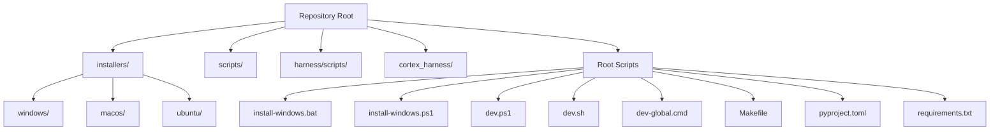
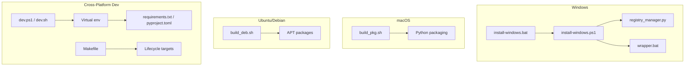
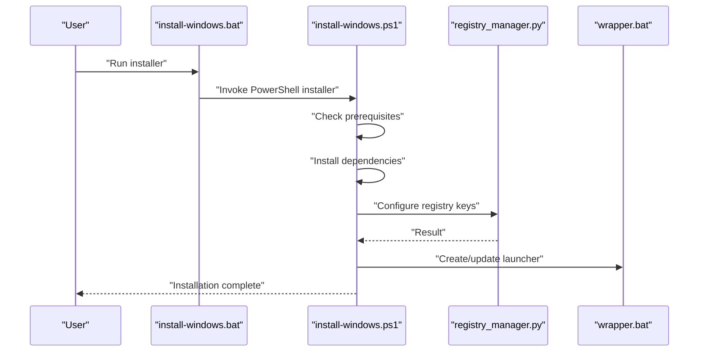
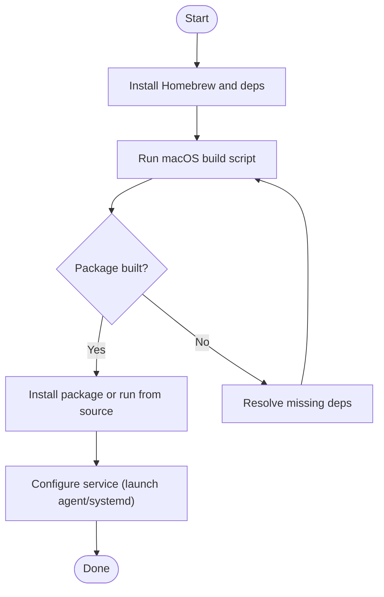
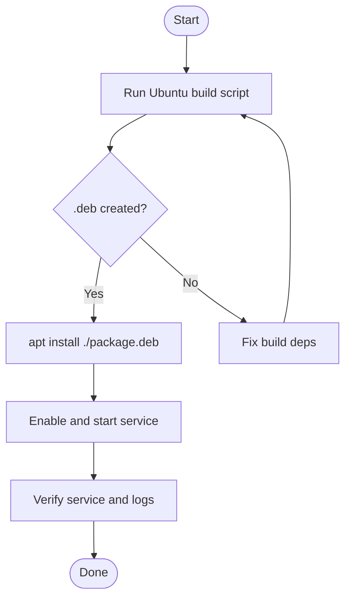
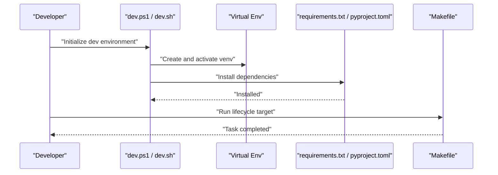
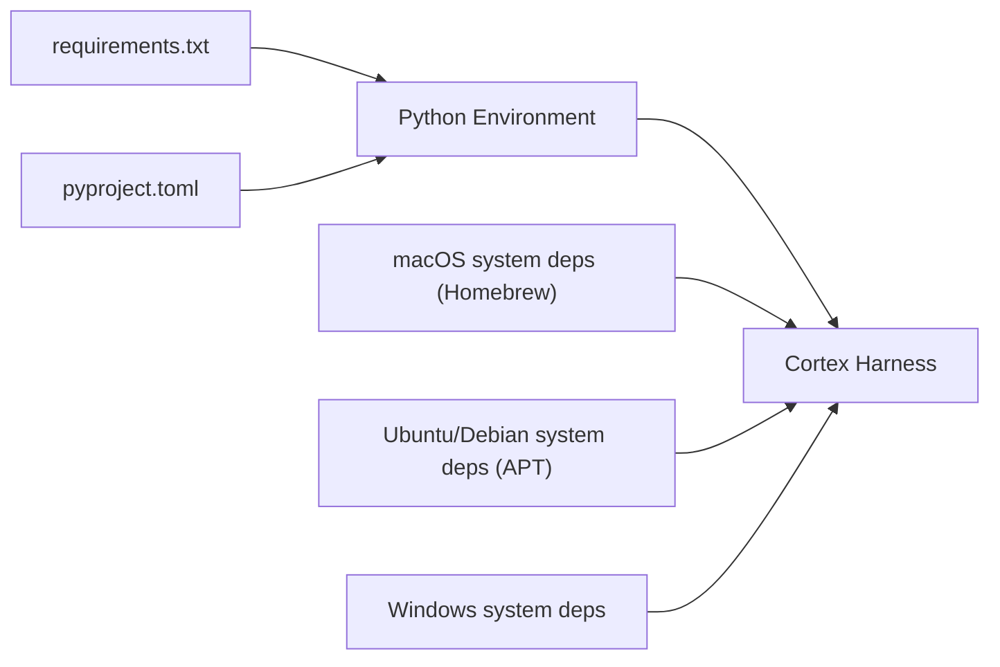

# Platform-Specific Installation

<cite>
**Referenced Files in This Document**
- [ReadMe.md](file://ReadMe.md)
- [INSTALLER_GUIDE.md](file://INSTALLER_GUIDE.md)
- [install-windows.bat](file://install-windows.bat)
- [install-windows.ps1](file://install-windows.ps1)
- [dev.ps1](file://dev.ps1)
- [dev.sh](file://dev.sh)
- [dev-global.cmd](file://dev-global.cmd)
- [Makefile](file://Makefile)
- [pyproject.toml](file://pyproject.toml)
- [requirements.txt](file://requirements.txt)
- [cortex_harness/dev.py](file://cortex_harness/dev.py)
- [harness/scripts/init.sh](file://harness/scripts/init.sh)
- [harness/scripts/verify.sh](file://harness/scripts/verify.sh)
- [installers/windows/registry_manager.py](file://installers/windows/registry_manager.py)
- [installers/windows/scripts/wrapper.bat](file://installers/windows/scripts/wrapper.bat)
- [installers/macos/build_pkg.sh](file://installers/macos/build_pkg.sh)
- [installers/ubuntu/build_deb.sh](file://installers/ubuntu/build_deb.sh)
- [scripts/mcp-lifecycle.ps1](file://scripts/mcp-lifecycle.ps1)
- [scripts/mcp-lifecycle.py](file://scripts/mcp-lifecycle.py)
</cite>

## Table of Contents
1. [Introduction](#introduction)
2. [Project Structure](#project-structure)
3. [Core Components](#core-components)
4. [Architecture Overview](#architecture-overview)
5. [Detailed Component Analysis](#detailed-component-analysis)
6. [Dependency Analysis](#dependency-analysis)
7. [Performance Considerations](#performance-considerations)
8. [Troubleshooting Guide](#troubleshooting-guide)
9. [Conclusion](#conclusion)
10. [Appendices](#appendices)

## Introduction
This document provides platform-specific installation instructions for Cortex Harness across Windows, macOS, and Ubuntu/Debian. It covers package manager setup, script execution, registry configuration (Windows), system service configuration (macOS and Linux), dependency management, and cross-platform development environment setup. Where applicable, it references repository-provided installers and scripts to streamline the process.

## Project Structure
Cortex Harness includes platform installers under installers/, OS-specific scripts, and shared Python tooling. The root contains developer entry points and packaging definitions that influence installation behavior.

**Diagram sources**
- [installers/windows/registry_manager.py](file://installers/windows/registry_manager.py)
- [installers/windows/scripts/wrapper.bat](file://installers/windows/scripts/wrapper.bat)
- [installers/macos/build_pkg.sh](file://installers/macos/build_pkg.sh)
- [installers/ubuntu/build_deb.sh](file://installers/ubuntu/build_deb.sh)
- [install-windows.bat](file://install-windows.bat)
- [install-windows.ps1](file://install-windows.ps1)
- [dev.ps1](file://dev.ps1)
- [dev.sh](file://dev.sh)
- [dev-global.cmd](file://dev-global.cmd)
- [Makefile](file://Makefile)
- [pyproject.toml](file://pyproject.toml)
- [requirements.txt](file://requirements.txt)

**Section sources**
- [ReadMe.md](file://ReadMe.md)
- [INSTALLER_GUIDE.md](file://INSTALLER_GUIDE.md)
- [install-windows.bat](file://install-windows.bat)
- [install-windows.ps1](file://install-windows.ps1)
- [dev.ps1](file://dev.ps1)
- [dev.sh](file://dev.sh)
- [dev-global.cmd](file://dev-global.cmd)
- [Makefile](file://Makefile)
- [pyproject.toml](file://pyproject.toml)
- [requirements.txt](file://requirements.txt)

## Core Components
- Windows installer: batch and PowerShell entry points orchestrate environment checks, dependency installation, and optional registry integration via a dedicated module.
- macOS installer: build script prepares a distributable package; manual builds rely on standard Python packaging tools.
- Ubuntu/Debian installer: build script produces a .deb package with dependencies declared by packaging metadata.
- Development utilities: dev scripts and Make targets provide consistent local setup across platforms.

Key responsibilities:
- Environment validation and prerequisite detection
- Dependency resolution and installation
- Optional system integration (registry entries, PATH updates, services)
- Packaging and distribution artifacts generation

**Section sources**
- [install-windows.bat](file://install-windows.bat)
- [install-windows.ps1](file://install-windows.ps1)
- [installers/windows/registry_manager.py](file://installers/windows/registry_manager.py)
- [installers/windows/scripts/wrapper.bat](file://installers/windows/scripts/wrapper.bat)
- [installers/macos/build_pkg.sh](file://installers/macos/build_pkg.sh)
- [installers/ubuntu/build_deb.sh](file://installers/ubuntu/build_deb.sh)
- [Makefile](file://Makefile)
- [pyproject.toml](file://pyproject.toml)
- [requirements.txt](file://requirements.txt)

## Architecture Overview
The installation architecture is modular per platform while sharing common Python tooling and configuration. Installers coordinate prerequisites, set up virtual environments where appropriate, and integrate with the host OS as needed.

**Diagram sources**
- [install-windows.bat](file://install-windows.bat)
- [install-windows.ps1](file://install-windows.ps1)
- [installers/windows/registry_manager.py](file://installers/windows/registry_manager.py)
- [installers/windows/scripts/wrapper.bat](file://installers/windows/scripts/wrapper.bat)
- [installers/macos/build_pkg.sh](file://installers/macos/build_pkg.sh)
- [installers/ubuntu/build_deb.sh](file://installers/ubuntu/build_deb.sh)
- [dev.ps1](file://dev.ps1)
- [dev.sh](file://dev.sh)
- [Makefile](file://Makefile)
- [requirements.txt](file://requirements.txt)
- [pyproject.toml](file://pyproject.toml)

## Detailed Component Analysis

### Windows Installation
- Package manager setup: Ensure Python and pip are available and accessible from PATH. If required, enable long paths and adjust execution policy for PowerShell.
- Script execution: Run the provided batch or PowerShell installer to bootstrap the environment, install dependencies, and configure optional integrations.
- Registry configuration: The installer can write registry keys for discovery and runtime settings using the registry manager module.
- System integration: Optionally update PATH and create convenience wrappers for launching components.

Recommended steps:
1. Verify Python and pip availability and version compatibility.
2. Execute the batch installer or the PowerShell installer with appropriate execution policy.
3. Confirm registry entries were created if registry integration was selected.
4. Validate PATH updates and wrapper availability.

**Diagram sources**
- [install-windows.bat](file://install-windows.bat)
- [install-windows.ps1](file://install-windows.ps1)
- [installers/windows/registry_manager.py](file://installers/windows/registry_manager.py)
- [installers/windows/scripts/wrapper.bat](file://installers/windows/scripts/wrapper.bat)

**Section sources**
- [install-windows.bat](file://install-windows.bat)
- [install-windows.ps1](file://install-windows.ps1)
- [installers/windows/registry_manager.py](file://installers/windows/registry_manager.py)
- [installers/windows/scripts/wrapper.bat](file://installers/windows/scripts/wrapper.bat)

### macOS Installation
- Homebrew: Use Homebrew to install system-level dependencies required by analyzers and native components.
- Manual package builds: Build a distributable package using the provided macOS build script, which relies on Python packaging tooling.
- System service configuration: Configure a launch agent or systemd-like service depending on deployment needs.

Recommended steps:
1. Install Homebrew and required system dependencies.
2. Build the package using the macOS build script.
3. Install the generated package or run from source.
4. Set up a background service if running as a daemon.

**Diagram sources**
- [installers/macos/build_pkg.sh](file://installers/macos/build_pkg.sh)

**Section sources**
- [installers/macos/build_pkg.sh](file://installers/macos/build_pkg.sh)

### Ubuntu/Debian Installation
- APT packages: Use the provided build script to produce a .deb package that declares system dependencies.
- systemd service setup: Create a service unit to manage lifecycle and ensure persistence.
- Dependency management: Rely on APT for system libraries and Python packaging for Python dependencies.

Recommended steps:
1. Build the .deb package using the Ubuntu build script.
2. Install the package with APT.
3. Enable and start the systemd service.
4. Verify service status and logs.

**Diagram sources**
- [installers/ubuntu/build_deb.sh](file://installers/ubuntu/build_deb.sh)

**Section sources**
- [installers/ubuntu/build_deb.sh](file://installers/ubuntu/build_deb.sh)

### Cross-Platform Development Environment
- Dev scripts: Use dev.ps1 for Windows and dev.sh for Unix-like systems to initialize a virtual environment and install project dependencies.
- Virtual environment: Each platform script creates an isolated environment to avoid conflicts.
- IDE integration: Point your IDE’s interpreter to the virtual environment created by the dev scripts.
- Lifecycle commands: Use Make targets to standardize tasks such as init, verify, and cleanup.

Recommended steps:
1. Run the platform-appropriate dev script to set up the virtual environment.
2. Activate the environment and install requirements from requirements.txt or pyproject.toml.
3. Configure your IDE to use the virtual environment interpreter.
4. Use Make targets for common development workflows.

**Diagram sources**
- [dev.ps1](file://dev.ps1)
- [dev.sh](file://dev.sh)
- [requirements.txt](file://requirements.txt)
- [pyproject.toml](file://pyproject.toml)
- [Makefile](file://Makefile)

**Section sources**
- [dev.ps1](file://dev.ps1)
- [dev.sh](file://dev.sh)
- [requirements.txt](file://requirements.txt)
- [pyproject.toml](file://pyproject.toml)
- [Makefile](file://Makefile)

## Dependency Analysis
- Python dependencies are defined in requirements.txt and optionally in pyproject.toml.
- System dependencies differ by platform and are managed via platform package managers (Homebrew on macOS, APT on Ubuntu/Debian).
- Windows may require additional system libraries for native analyzers; ensure they are installed before running installers.

**Diagram sources**
- [requirements.txt](file://requirements.txt)
- [pyproject.toml](file://pyproject.toml)

**Section sources**
- [requirements.txt](file://requirements.txt)
- [pyproject.toml](file://pyproject.toml)

## Performance Considerations
- Prefer building packages once and installing them rather than repeatedly invoking installers.
- On Windows, ensure disk I/O performance and disable real-time antivirus scanning for build directories during heavy operations.
- On macOS and Linux, consider enabling parallel compilation flags when building native components if supported by your environment.

[No sources needed since this section provides general guidance]

## Troubleshooting Guide
Common issues and resolutions:
- Permission errors:
  - Windows: Run installers with elevated privileges when modifying registry or system-wide PATH.
  - macOS/Linux: Use sudo only where necessary; prefer user-scoped installations when possible.
- Dependency conflicts:
  - Ensure Python versions match project requirements.
  - Re-create virtual environments if conflicts arise after partial installs.
- Missing system libraries:
  - macOS: Install required Homebrew packages before building.
  - Ubuntu/Debian: Install system dependencies declared by the .deb build script.
- Registry issues (Windows):
  - Verify registry keys exist and have correct permissions.
  - Re-run registry configuration step if entries are missing.
- Service not starting:
  - Check service logs and ensure all dependencies are present.
  - Validate service unit files and environment variables.

Operational helpers:
- Use verification scripts to validate environment readiness.
- Use lifecycle scripts to manage MCP-related processes consistently.

**Section sources**
- [harness/scripts/verify.sh](file://harness/scripts/verify.sh)
- [harness/scripts/init.sh](file://harness/scripts/init.sh)
- [scripts/mcp-lifecycle.ps1](file://scripts/mcp-lifecycle.ps1)
- [scripts/mcp-lifecycle.py](file://scripts/mcp-lifecycle.py)

## Conclusion
Cortex Harness provides platform-specific installers and development utilities to streamline installation across Windows, macOS, and Ubuntu/Debian. By following the platform guides and leveraging provided scripts, you can reliably set up the environment, manage dependencies, and integrate with the host OS. For development, use the dev scripts and Make targets to maintain consistency across machines.

[No sources needed since this section summarizes without analyzing specific files]

## Appendices

### Appendix A: Quick Reference Commands
- Windows:
  - Run installer: execute the batch or PowerShell installer.
  - Verify registry: check registry keys created by the registry manager.
- macOS:
  - Build package: run the macOS build script.
  - Install service: configure a launch agent or equivalent.
- Ubuntu/Debian:
  - Build .deb: run the Ubuntu build script.
  - Install and start service: use APT and systemd.

[No sources needed since this section provides general guidance]