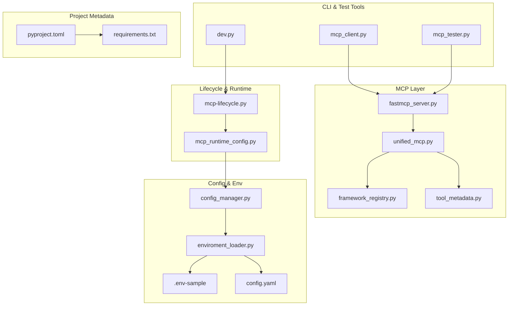
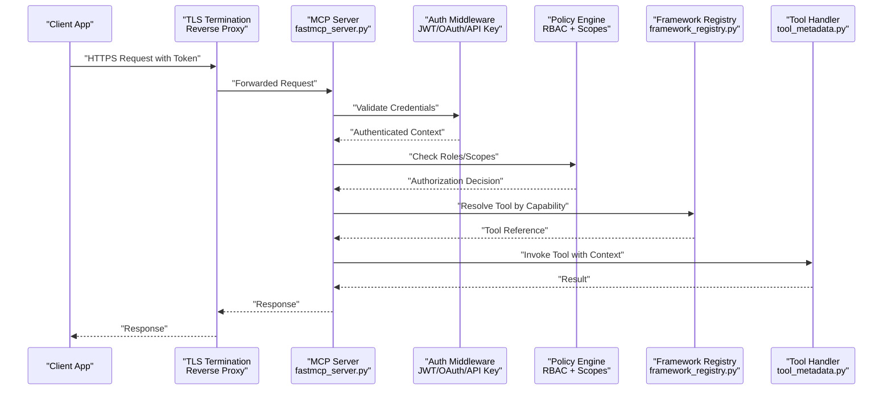
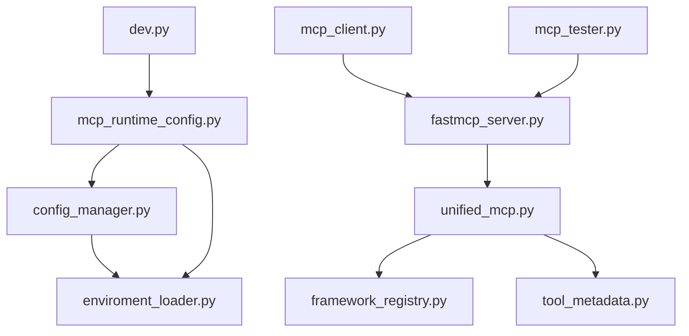
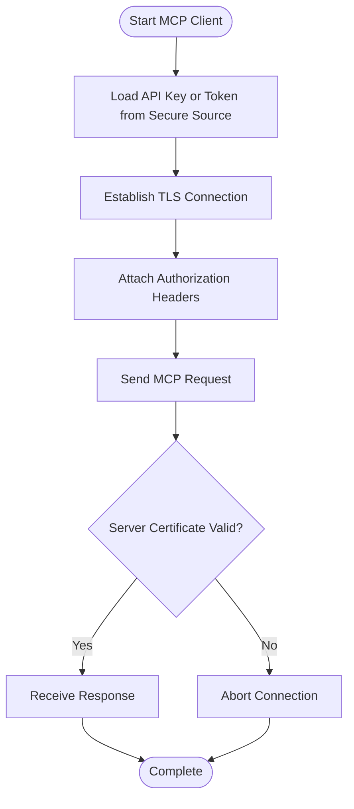
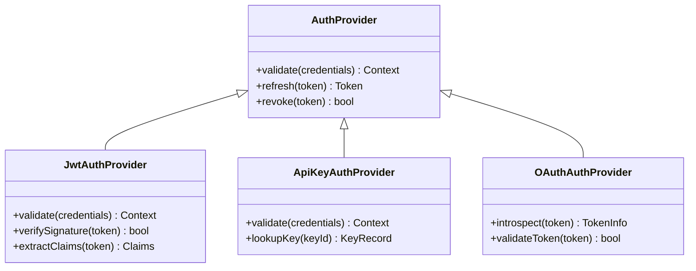

# Authentication & Authorization

<cite>
**Referenced Files in This Document**
- [ReadMe.md](file://ReadMe.md)
- [Makefile](file://Makefile)
- [pyproject.toml](file://pyproject.toml)
- [requirements.txt](file://requirements.txt)
- [cortex_harness/dev.py](file://cortex_harness/dev.py)
- [harness/scripts/orchestrator.py](file://harness/scripts/orchestrator.py)
- [installers/common/config_manager.py](file://installers/common/config_manager.py)
- [code-tiny/mcp/fastmcp_server.py](file://code-tiny/mcp/fastmcp_server.py)
- [code-tiny/mcp/unified_mcp.py](file://code-tiny/mcp/unified_mcp.py)
- [code-tiny/mcp/framework_registry.py](file://code-tiny/mcp/framework_registry.py)
- [code-tiny/mcp/tool_metadata.py](file://code-tiny/mcp/tool_metadata.py)
- [code-tiny/testtool/mcp_client.py](file://code-tiny/testtool/mcp_client.py)
- [code-tiny/testtool/mcp_tester.py](file://code-tiny/testtool/mcp_tester.py)
- [scripts/mcp-lifecycle.py](file://scripts/mcp-lifecycle.py)
- [scripts/mcp_runtime_config.py](file://scripts/mcp_runtime_config.py)
- [doc-tiny/enviroment_loader.py](file://doc-tiny/enviroment_loader.py)
- [doc-tiny/.env-sample](file://doc-tiny/.env-sample)
- [harness/templates/config.yaml](file://harness/templates/config.yaml)
- [backendjs/src/routes/](file://backendjs/src/routes/)
</cite>

## Table of Contents
1. [Introduction](#introduction)
2. [Project Structure](#project-structure)
3. [Core Components](#core-components)
4. [Architecture Overview](#architecture-overview)
5. [Detailed Component Analysis](#detailed-component-analysis)
6. [Dependency Analysis](#dependency-analysis)
7. [Performance Considerations](#performance-considerations)
8. [Troubleshooting Guide](#troubleshooting-guide)
9. [Conclusion](#conclusion)
10. [Appendices](#appendices)

## Introduction
This document provides comprehensive authentication and authorization guidance for Cortex Harness, focusing on:
- MCP server authentication mechanisms
- API key management and token-based access control
- User roles, permissions, and access policies across CLI, REST API, and MCP endpoints
- Configuration of authentication providers, session management, and secure credential storage
- Securing MCP client connections, implementing custom auth providers, and service-to-service authentication
- Common security patterns including JWT tokens, OAuth integration, and certificate-based authentication

The repository contains multiple components (MCP servers, lifecycle scripts, configuration loaders, and templates). Where concrete implementation details are present, this document maps them to specific files and lines. For areas where the codebase does not yet implement a feature, this document provides recommended patterns and integration points.

## Project Structure
Cortex Harness is organized into several subsystems:
- MCP server implementations and unified entrypoints under code-tiny/mcp
- Lifecycle and runtime configuration helpers under scripts
- Environment and configuration loading utilities under doc-tiny
- Installer configuration manager under installers/common
- Harness orchestration scripts under harness/scripts
- Python project metadata and dependencies under pyproject.toml and requirements.txt
- Documentation and specs under docs

**Diagram sources**
- [code-tiny/mcp/fastmcp_server.py](file://code-tiny/mcp/fastmcp_server.py)
- [code-tiny/mcp/unified_mcp.py](file://code-tiny/mcp/unified_mcp.py)
- [code-tiny/mcp/framework_registry.py](file://code-tiny/mcp/framework_registry.py)
- [code-tiny/mcp/tool_metadata.py](file://code-tiny/mcp/tool_metadata.py)
- [scripts/mcp-lifecycle.py](file://scripts/mcp-lifecycle.py)
- [scripts/mcp_runtime_config.py](file://scripts/mcp_runtime_config.py)
- [installers/common/config_manager.py](file://installers/common/config_manager.py)
- [doc-tiny/enviroment_loader.py](file://doc-tiny/enviroment_loader.py)
- [doc-tiny/.env-sample](file://doc-tiny/.env-sample)
- [harness/templates/config.yaml](file://harness/templates/config.yaml)
- [cortex_harness/dev.py](file://cortex_harness/dev.py)
- [code-tiny/testtool/mcp_client.py](file://code-tiny/testtool/mcp_client.py)
- [code-tiny/testtool/mcp_tester.py](file://code-tiny/testtool/mcp_tester.py)
- [pyproject.toml](file://pyproject.toml)
- [requirements.txt](file://requirements.txt)

**Section sources**
- [ReadMe.md](file://ReadMe.md)
- [Makefile](file://Makefile)
- [pyproject.toml](file://pyproject.toml)
- [requirements.txt](file://requirements.txt)

## Core Components
This section outlines the primary building blocks relevant to authentication and authorization:

- MCP Server Entry Points
  - Unified MCP server and framework registry provide the surface for tool invocation and capability routing. These are natural places to integrate authentication middleware and request context propagation.
  - Tool metadata can be used to annotate required permissions or scopes.

- Lifecycle and Runtime Configuration
  - Lifecycle scripts manage MCP process lifecycles and may inject environment variables or credentials at startup.
  - Runtime configuration loader centralizes reading settings from environment and config files.

- Configuration Manager and Environment Loader
  - The installer’s configuration manager and environment loader handle secrets and configuration values. Secure handling of these values is essential for authentication providers and token stores.

- CLI and Test Tools
  - Development entrypoint and test tools demonstrate how clients connect to MCP endpoints and may carry credentials or tokens.

- Project Metadata
  - Dependencies and project configuration indicate available libraries that can support JWT, OAuth, and secure storage.

**Section sources**
- [code-tiny/mcp/fastmcp_server.py](file://code-tiny/mcp/fastmcp_server.py)
- [code-tiny/mcp/unified_mcp.py](file://code-tiny/mcp/unified_mcp.py)
- [code-tiny/mcp/framework_registry.py](file://code-tiny/mcp/framework_registry.py)
- [code-tiny/mcp/tool_metadata.py](file://code-tiny/mcp/tool_metadata.py)
- [scripts/mcp-lifecycle.py](file://scripts/mcp-lifecycle.py)
- [scripts/mcp_runtime_config.py](file://scripts/mcp_runtime_config.py)
- [installers/common/config_manager.py](file://installers/common/config_manager.py)
- [doc-tiny/enviroment_loader.py](file://doc-tiny/enviroment_loader.py)
- [doc-tiny/.env-sample](file://doc-tiny/.env-sample)
- [harness/templates/config.yaml](file://harness/templates/config.yaml)
- [cortex_harness/dev.py](file://cortex_harness/dev.py)
- [code-tiny/testtool/mcp_client.py](file://code-tiny/testtool/mcp_client.py)
- [code-tiny/testtool/mcp_tester.py](file://code-tiny/testtool/mcp_tester.py)
- [pyproject.toml](file://pyproject.toml)
- [requirements.txt](file://requirements.txt)

## Architecture Overview
The authentication and authorization architecture integrates at three layers:
- Transport Layer: TLS termination and mutual TLS for MCP HTTP/WebSocket channels
- Request Layer: Middleware for API key validation, JWT verification, and OAuth introspection
- Policy Layer: Role-based access control (RBAC) and permission checks applied before tool execution

**Diagram sources**
- [code-tiny/mcp/fastmcp_server.py](file://code-tiny/mcp/fastmcp_server.py)
- [code-tiny/mcp/framework_registry.py](file://code-tiny/mcp/framework_registry.py)
- [code-tiny/mcp/tool_metadata.py](file://code-tiny/mcp/tool_metadata.py)

## Detailed Component Analysis

### MCP Server Authentication Mechanisms
- Integration Points
  - The MCP server entrypoint is the ideal place to attach authentication middleware that validates API keys, JWT tokens, or performs OAuth introspection.
  - The unified MCP layer can propagate authenticated user identity and roles into the request context for downstream policy checks.

- Recommended Patterns
  - API Keys: Validate against a secure store (e.g., encrypted config or secret manager). Bind keys to roles and scopes.
  - JWT Tokens: Verify signature, issuer, audience, expiration; extract claims for RBAC evaluation.
  - OAuth Integration: Use an authorization server; validate access tokens via introspection or JWKS.

- Implementation Guidance
  - Add middleware in the MCP server to parse headers (e.g., Authorization), normalize tokens, and enrich request context.
  - Ensure transport security (TLS) for all MCP endpoints. Consider mTLS for service-to-service calls.

**Section sources**
- [code-tiny/mcp/fastmcp_server.py](file://code-tiny/mcp/fastmcp_server.py)
- [code-tiny/mcp/unified_mcp.py](file://code-tiny/mcp/unified_mcp.py)

### API Key Management and Token-Based Access Control
- API Key Lifecycle
  - Generation: Create cryptographically random keys; associate with identities and roles.
  - Storage: Encrypt at rest; restrict access to configuration managers and secret managers.
  - Rotation: Support key rotation without downtime; maintain versioning and deprecation windows.
  - Revocation: Immediate invalidation via deny lists or short-lived tokens.

- Token-Based Access Control
  - Short-Lived Tokens: Prefer time-bound tokens with refresh flows.
  - Scope Binding: Map tokens to fine-grained scopes aligned with tool capabilities.
  - Audience and Issuer Validation: Prevent token misuse across services.

- Credential Storage Security
  - Use environment variables loaded securely at runtime.
  - Avoid logging secrets; sanitize logs and error messages.
  - Restrict file permissions for local config files.

**Section sources**
- [installers/common/config_manager.py](file://installers/common/config_manager.py)
- [doc-tiny/enviroment_loader.py](file://doc-tiny/enviroment_loader.py)
- [doc-tiny/.env-sample](file://doc-tiny/.env-sample)
- [harness/templates/config.yaml](file://harness/templates/config.yaml)

### User Role Definitions and Permission Models
- Role Model
  - Define roles such as Admin, Operator, Analyst, Viewer.
  - Assign roles to users or service accounts.

- Permission Model
  - Map roles to permissions per tool or capability.
  - Use scopes to limit token access to specific operations.

- Access Policies
  - Enforce least privilege.
  - Apply policy checks before invoking tools.
  - Log authorization decisions for auditability.

- Implementation Guidance
  - Annotate tools with required roles/scopes using metadata.
  - Centralize policy evaluation logic to ensure consistent enforcement.

**Section sources**
- [code-tiny/mcp/tool_metadata.py](file://code-tiny/mcp/tool_metadata.py)
- [code-tiny/mcp/framework_registry.py](file://code-tiny/mcp/framework_registry.py)

### Access Policies for CLI, REST API, and MCP Endpoints
- CLI
  - CLI commands should read credentials from secure sources (environment or secret manager).
  - CLI should enforce minimum TLS and optionally mTLS when connecting to MCP endpoints.

- REST API
  - If exposing REST endpoints, apply standard web security practices:
    - Require HTTPS
    - Validate JWT or API keys
    - Rate limiting and input validation

- MCP Endpoints
  - Treat MCP requests as privileged operations; require strong authentication and authorization.
  - Propagate identity and roles through the call chain.

**Section sources**
- [cortex_harness/dev.py](file://cortex_harness/dev.py)
- [code-tiny/testtool/mcp_client.py](file://code-tiny/testtool/mcp_client.py)
- [code-tiny/testtool/mcp_tester.py](file://code-tiny/testtool/mcp_tester.py)
- [backendjs/src/routes/](file://backendjs/src/routes/)

### Configuration of Authentication Providers
- Provider Types
  - Local API key provider
  - JWT provider with JWKS endpoint
  - OAuth provider with token introspection

- Configuration Sources
  - Environment variables for secrets and endpoints
  - Config files for non-secret settings
  - Secret managers for production deployments

- Best Practices
  - Separate configuration for development and production.
  - Validate provider connectivity at startup.
  - Provide clear error messages for misconfiguration.

**Section sources**
- [scripts/mcp_runtime_config.py](file://scripts/mcp_runtime_config.py)
- [installers/common/config_manager.py](file://installers/common/config_manager.py)
- [doc-tiny/enviroment_loader.py](file://doc-tiny/enviroment_loader.py)
- [doc-tiny/.env-sample](file://doc-tiny/.env-sample)
- [harness/templates/config.yaml](file://harness/templates/config.yaml)

### Session Management
- Stateless vs Stateful
  - Prefer stateless sessions using signed tokens (JWT) for scalability.
  - If stateful sessions are needed, use secure, centralized session stores with encryption and short TTLs.

- Token Refresh
  - Implement refresh flows for long-running clients.
  - Rotate signing keys periodically.

- Security Controls
  - Enforce token binding to client identifiers where appropriate.
  - Revoke tokens upon logout or suspicious activity.

[No sources needed since this section provides general guidance]

### Securing MCP Client Connections
- TLS and mTLS
  - Always use TLS for MCP transports.
  - Enable mTLS for service-to-service communication.

- Client Credentials
  - Pass API keys or bearer tokens in secure headers.
  - Avoid embedding secrets in URLs or logs.

- Connection Hardening
  - Validate server certificates.
  - Configure timeouts and retry policies.

**Section sources**
- [code-tiny/testtool/mcp_client.py](file://code-tiny/testtool/mcp_client.py)
- [code-tiny/testtool/mcp_tester.py](file://code-tiny/testtool/mcp_tester.py)

### Implementing Custom Auth Providers
- Provider Interface
  - Define a minimal interface for validating credentials and returning user context.
  - Support pluggable providers via configuration.

- Provider Registration
  - Register providers at startup based on configuration.
  - Allow fallback providers for migration scenarios.

- Testing
  - Mock external providers in tests.
  - Validate error paths and edge cases.

**Section sources**
- [code-tiny/mcp/unified_mcp.py](file://code-tiny/mcp/unified_mcp.py)
- [scripts/mcp_runtime_config.py](file://scripts/mcp_runtime_config.py)

### Service-to-Service Authentication
- Mutual TLS
  - Use client certificates for inter-service authentication.
  - Manage certificate lifecycles and rotation.

- Short-Lived Tokens
  - Generate tokens with limited scope and TTL.
  - Use internal token issuance services.

- Network Policies
  - Restrict access to MCP endpoints via network policies and firewalls.

[No sources needed since this section provides general guidance]

### Common Security Patterns
- JWT Tokens
  - Validate signatures, issuers, audiences, and expirations.
  - Extract claims for RBAC and auditing.

- OAuth Integration
  - Integrate with authorization servers.
  - Use token introspection for opaque tokens.

- Certificate-Based Authentication
  - Deploy mTLS for high-security environments.
  - Automate certificate provisioning and renewal.

[No sources needed since this section provides general guidance]

## Dependency Analysis
Authentication-related functionality depends on configuration loaders, environment utilities, and MCP server modules. The following diagram shows key relationships:

**Diagram sources**
- [installers/common/config_manager.py](file://installers/common/config_manager.py)
- [doc-tiny/enviroment_loader.py](file://doc-tiny/enviroment_loader.py)
- [scripts/mcp_runtime_config.py](file://scripts/mcp_runtime_config.py)
- [code-tiny/mcp/fastmcp_server.py](file://code-tiny/mcp/fastmcp_server.py)
- [code-tiny/mcp/unified_mcp.py](file://code-tiny/mcp/unified_mcp.py)
- [code-tiny/mcp/framework_registry.py](file://code-tiny/mcp/framework_registry.py)
- [code-tiny/mcp/tool_metadata.py](file://code-tiny/mcp/tool_metadata.py)
- [cortex_harness/dev.py](file://cortex_harness/dev.py)
- [code-tiny/testtool/mcp_client.py](file://code-tiny/testtool/mcp_client.py)
- [code-tiny/testtool/mcp_tester.py](file://code-tiny/testtool/mcp_tester.py)

**Section sources**
- [installers/common/config_manager.py](file://installers/common/config_manager.py)
- [doc-tiny/enviroment_loader.py](file://doc-tiny/enviroment_loader.py)
- [scripts/mcp_runtime_config.py](file://scripts/mcp_runtime_config.py)
- [code-tiny/mcp/fastmcp_server.py](file://code-tiny/mcp/fastmcp_server.py)
- [code-tiny/mcp/unified_mcp.py](file://code-tiny/mcp/unified_mcp.py)
- [code-tiny/mcp/framework_registry.py](file://code-tiny/mcp/framework_registry.py)
- [code-tiny/mcp/tool_metadata.py](file://code-tiny/mcp/tool_metadata.py)
- [cortex_harness/dev.py](file://cortex_harness/dev.py)
- [code-tiny/testtool/mcp_client.py](file://code-tiny/testtool/mcp_client.py)
- [code-tiny/testtool/mcp_tester.py](file://code-tiny/testtool/mcp_tester.py)

## Performance Considerations
- Minimize overhead of authentication checks by caching validated tokens and role mappings where safe.
- Use efficient cryptographic libraries and hardware acceleration for TLS/JWT operations.
- Avoid blocking I/O during auth; prefer async validation and connection pooling.
- Monitor latency and errors around auth middleware to detect bottlenecks.

[No sources needed since this section provides general guidance]

## Troubleshooting Guide
Common issues and resolutions:
- Invalid or expired tokens
  - Check token issuer, audience, and expiration.
  - Ensure clock synchronization between services.

- Misconfigured providers
  - Validate provider endpoints and keys.
  - Confirm network reachability and certificate trust chains.

- Secrets not loaded
  - Verify environment variables and config file permissions.
  - Inspect loader logs for missing keys.

- mTLS failures
  - Validate client and server certificates.
  - Ensure correct certificate order and intermediate CA inclusion.

**Section sources**
- [installers/common/config_manager.py](file://installers/common/config_manager.py)
- [doc-tiny/enviroment_loader.py](file://doc-tiny/enviroment_loader.py)
- [scripts/mcp_runtime_config.py](file://scripts/mcp_runtime_config.py)

## Conclusion
Cortex Harness provides multiple integration points for authentication and authorization across MCP servers, lifecycle scripts, and configuration loaders. By applying robust patterns—API keys, JWT, OAuth, and mTLS—and enforcing RBAC with scoped permissions, you can secure CLI, REST API, and MCP endpoints effectively. Centralized configuration and secure credential storage further harden the system. Future enhancements should focus on explicit middleware implementation, policy engine integration, and comprehensive testing of auth flows.

[No sources needed since this section summarizes without analyzing specific files]

## Appendices

### Appendix A: Example Flows

#### Securing MCP Client Connections

[No sources needed since this diagram shows conceptual workflow, not actual code structure]

#### Implementing Custom Auth Provider

[No sources needed since this diagram shows conceptual classes, not actual code structure]